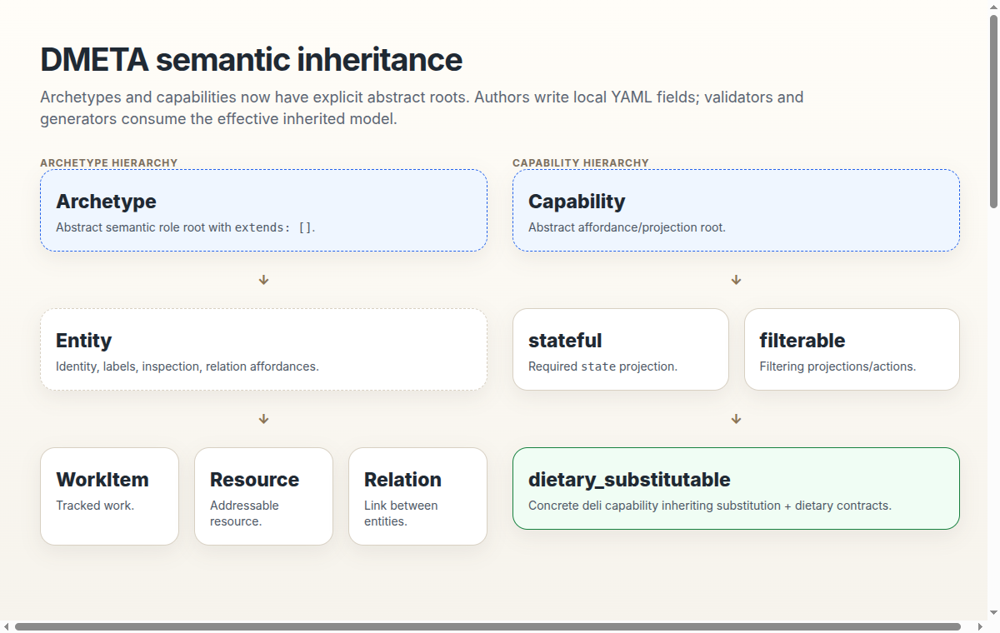
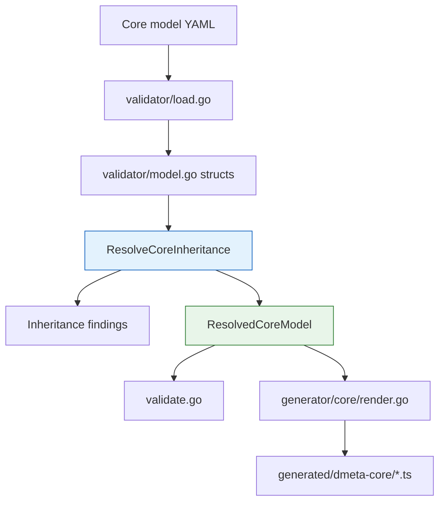
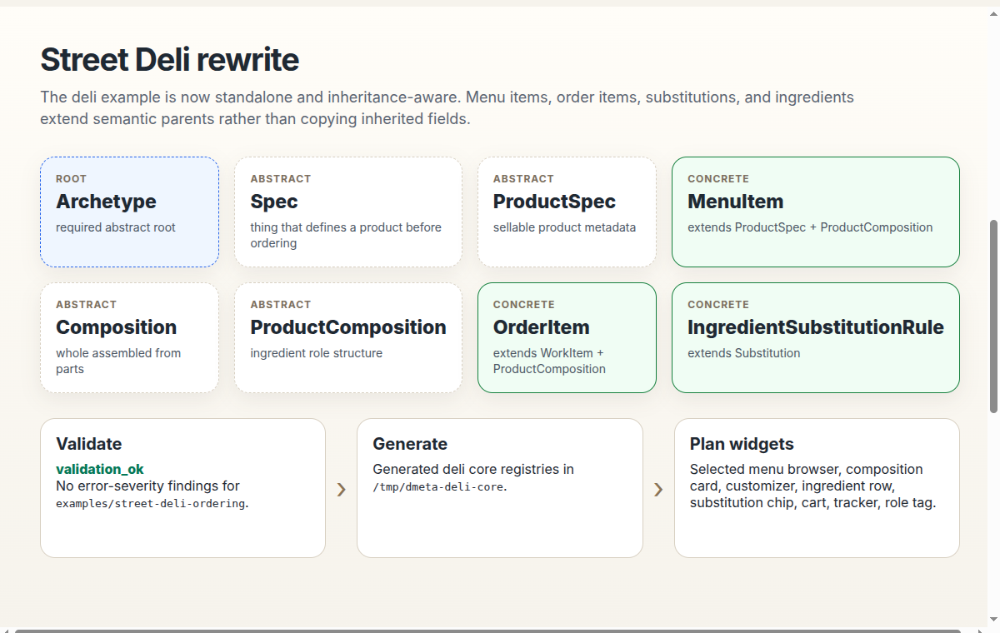
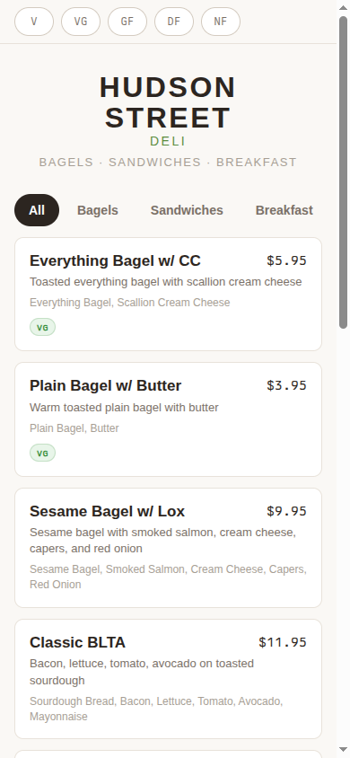
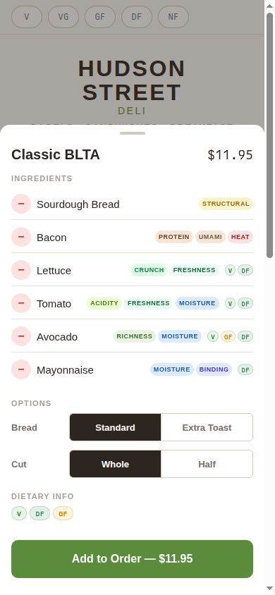
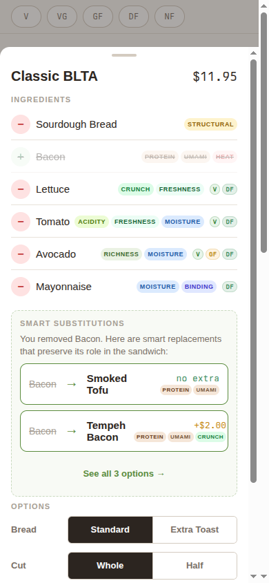
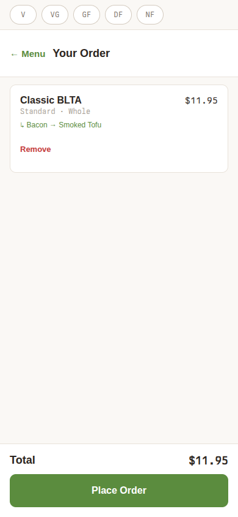
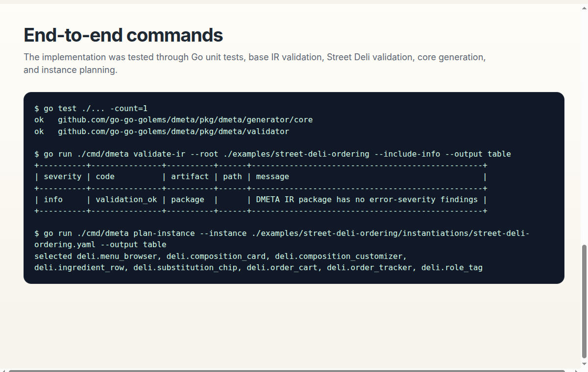

# DMETA Semantic Inheritance: From Flat Tags to Deli Ordering

DMETA's semantic core model now has an explicit inheritance system. `Archetype` and `Capability` are no longer just informal words in a flat YAML vocabulary; they are abstract roots of two validated semantic class hierarchies. Validators resolve inherited contracts before checking examples, generators emit ancestry-aware TypeScript registries, and the Street Deli ordering example has been rewritten to use real `extends` relationships instead of documentation-only `inherited_from_base` notes.

> [!summary]
> - `Archetype` and `Capability` are explicit abstract roots with `extends: []`.
> - Non-root archetypes/capabilities must declare parents; stale flat definitions now fail validation.
> - Validation and TypeScript generation use the effective inherited model.
> - Street Deli now models `MenuItem`, `OrderItem`, `Ingredient`, and substitutions through semantic inheritance and shows that model in the mobile prototype.

## Why this note exists

This note preserves the implementation story behind the DMETA semantic inheritance overhaul. The immediate trigger was the Street Deli ordering example: a deli `MenuItem` is not just a standalone tag. It is a sellable product specification, a role-based ingredient composition, a configurable item, a dietary object, a measurable price-bearing object, and an availability-aware menu object. Trying to represent that with copied flat fields quickly becomes brittle.

The deeper lesson is reusable: design-system factories need semantic inheritance when UI behavior is driven by meaning rather than by raw domain object names. If a runtime action accepts `WorkItem`, then an `OrderItem` should match because it is a kind of work item. If a widget consumes `role_preserving_substitutable`, then a dietary substitution suggestion should match because it inherits that capability.

## The old flat model

Before this change, archetypes and capabilities were maps of independent definitions:

```yaml
archetypes:
  WorkItem:
    default_capabilities:
      - identifiable
      - labelable
      - stateful
      - temporal
  ActionInvocation:
    default_capabilities:
      - identifiable
      - labelable
      - stateful
      - temporal
      - executable
```

That structure was easy to parse, but it made inheritance implicit and repetitive. The model could not say that `ActionInvocation` is a specialized `WorkItem`, nor could it say that `MenuItem` combines `ProductSpec` and `ProductComposition`. Generated TypeScript could only exact-match ids, which meant an action selector for `WorkItem` would not naturally match a descendant.

## The new mental model

The new model separates what authors write from what tools consume.

Authors write local semantic intent:

```yaml
MenuItem:
  extends:
    - ProductSpec
    - ProductComposition
  description: Concrete sellable menu item definition that is both a product spec and a role-based ingredient composition.
  default_capabilities:
    - searchable
    - filterable
```

Tools consume effective inherited contracts. After resolution, `MenuItem` has the local fields above plus inherited product, composition, identity, label, dietary, measurable, availability, and inspection behavior.



The key rules are intentionally strict:

- `Archetype` is the root semantic role class.
- `Capability` is the root affordance/projection class.
- Both roots are abstract and declare `extends: []`.
- Every non-root archetype/capability must declare `extends`.
- Abstract helper nodes can exist, but domain examples may not map to them directly.
- Multiple inheritance is allowed when it models a real semantic intersection.
- Parent order is stable and visible in generated output.
- Projection conflicts are errors unless the definitions are identical.

## Implementation architecture

The implementation is small but changes the center of gravity of the system. Loading still parses YAML into raw Go structs, but validation and generation now go through a resolver.



Important files in the repo:

- `/home/manuel/code/wesen/go-go-golems/dmeta/pkg/dmeta/validator/model.go`
  - adds `Extends []string` and `Abstract bool` to `Archetype` and `Capability`.
- `/home/manuel/code/wesen/go-go-golems/dmeta/pkg/dmeta/validator/inheritance.go`
  - implements `ResolveCoreInheritance`, ancestry, effective field merging, descendant indexes, and `IsArchetypeA` / `IsCapabilityA`.
- `/home/manuel/code/wesen/go-go-golems/dmeta/pkg/dmeta/validator/validate.go`
  - validates examples against inherited effective fields and rejects abstract mappings.
- `/home/manuel/code/wesen/go-go-golems/dmeta/pkg/dmeta/generator/core/render.go`
  - emits local and effective TypeScript fields and inheritance-aware action matching.
- `/home/manuel/code/wesen/go-go-golems/dmeta/sources/dmeta-ir/core-model/archetypes.yaml`
  - base archetype hierarchy.
- `/home/manuel/code/wesen/go-go-golems/dmeta/sources/dmeta-ir/core-model/capabilities.yaml`
  - base capability hierarchy.

## Resolver pseudocode

The resolver uses deterministic depth-first traversal. The important idea is that a resolved node is a cache entry containing ancestry plus effective inherited fields.

```text
resolveArchetype(id):
  if id is already resolved:
    return cached result

  raw = core.archetypes[id]
  reject missing raw id
  reject cycle if id is in current recursion stack
  reject missing extends unless id == "Archetype"
  reject duplicate parent ids

  ancestors = []
  effectiveCapabilities = []
  effectivePresentations = []
  effectiveExamples = []

  for parentID in raw.extends, in author order:
    parent = resolveArchetype(parentID)
    ancestors += stable unique parent.ancestors
    ancestors += stable unique parentID
    effectiveCapabilities += stable unique parent.effectiveCapabilities
    effectivePresentations += stable unique parent.effectivePresentations
    effectiveExamples += stable unique parent.effectiveExamples

  effectiveCapabilities += stable unique raw.defaultCapabilities
  effectivePresentations += stable unique raw.recommendedPresentations
  effectiveExamples += stable unique raw.examples

  cache and return result
```

Capability resolution follows the same shape, except projection maps are merged by name. Identical inherited projection definitions deduplicate; conflicting definitions fail with `projection_inheritance_conflict`.

## Generated TypeScript API

Generated archetypes now expose both local and inherited fields:

```ts
export type ArchetypeDefinition = {
  id: ArchetypeId;
  extends: ArchetypeId[];
  abstract: boolean;
  ancestors: ArchetypeId[];
  defaultCapabilities: CapabilityId[];
  effectiveDefaultCapabilities: CapabilityId[];
  recommendedPresentations: PresentationId[];
  effectiveRecommendedPresentations: PresentationId[];
};
```

Generated capabilities do the same:

```ts
export type CapabilityDefinition = {
  id: CapabilityId;
  extends: CapabilityId[];
  abstract: boolean;
  ancestors: CapabilityId[];
  projections: Record<string, ProjectionDefinition>;
  effectiveProjections: Record<string, ProjectionDefinition>;
  actions: ActionId[];
  effectiveActions: ActionId[];
};
```

The most important runtime helpers are:

```ts
export function isArchetypeA(child: ArchetypeId, ancestor: ArchetypeId): boolean;
export function isCapabilityA(child: CapabilityId, ancestor: CapabilityId): boolean;
export function archetypeHasCapability(archetype: ArchetypeId, capability: CapabilityId): boolean;
```

`actionMatching.ts` now uses these helpers. A selector accepting `WorkItem` can match a presentation ref whose concrete archetype is `OrderItem`, and a selector accepting `role_preserving_substitutable` can match a richer descendant capability.

## How Street Deli uses it

Street Deli is the pressure test because food ordering combines product metadata, ingredient composition, substitution reasoning, order lifecycle, kitchen workflow, and mobile presentation constraints.

The refactored hierarchy includes nodes such as:

```text
Archetype
  ├─ Entity
  │   ├─ WorkItem
  │   │   ├─ Order
  │   │   ├─ OrderItem
  │   │   └─ PrepTask
  │   ├─ Resource
  │   │   └─ Ingredient
  │   └─ Relation
  │       └─ Substitution
  │           ├─ IngredientSubstitutionRule
  │           ├─ SubstitutionSuggestion
  │           └─ AppliedSubstitution
  ├─ Spec
  │   └─ ProductSpec
  │       └─ MenuItem
  └─ Composition
      └─ ProductComposition
          ├─ SandwichComposition
          ├─ SaladComposition
          └─ BowlComposition
```

`MenuItem` is the most important multiple-inheritance example:

```yaml
MenuItem:
  extends:
    - ProductSpec
    - ProductComposition
```

This says a menu item is both a sellable product specification and a role-based ingredient composition. The UI can browse it as a product and customize it as a composition.

`OrderItem` is another multiple-inheritance example:

```yaml
OrderItem:
  extends:
    - WorkItem
    - ProductComposition
```

This says a cart/prep line item is both tracked work and a concrete customized composition.



## The refactored deli app screenshots

The mobile prototype was updated to surface the inherited semantic model in the customer flow. These markers are intentionally visible for documentation and debugging; a production customer UI might gate them behind a debug flag.

### Menu browsing

Menu cards now expose `MenuItem` semantics and show that the item extends both product and composition parents.



### Customizer

The customizer shows item-level semantics and ingredient rows with inherited resource/capability metadata. This is where the semantic model becomes useful: ingredients are not only strings in a list; they carry roles such as `structural`, `protein`, `umami`, and `moisture`.



### Smart substitutions

When bacon is removed, the app presents substitution candidates as `SubstitutionSuggestion` objects. Their role overlap and dietary metadata are visible, which is exactly the capability contract provided by `role_preserving_substitutable`, `dietary_substitutable`, and `price_aware_substitutable`.



### Cart propagation

After applying smoked tofu and adding the item to the cart, the cart row exposes `OrderItem extends WorkItem + ProductComposition`. This demonstrates that the semantic model survives the transition from menu browsing to customized order state.



## End-to-end validation

The implementation was tested through Go tests, base package validation, Street Deli validation, scratch generation, instance planning, widget scaffolding, and browser screenshot automation.



Useful commands:

```bash
cd /home/manuel/code/wesen/go-go-golems/dmeta

go test ./... -count=1

go run ./cmd/dmeta validate-ir \
  --root ./sources/dmeta-ir \
  --include-info \
  --output table

go run ./cmd/dmeta validate-ir \
  --root ./examples/street-deli-ordering \
  --include-info \
  --output table

go run ./cmd/dmeta generate-core \
  --root ./examples/street-deli-ordering \
  --out /tmp/dmeta-deli-core \
  --force \
  --output table

go run ./cmd/dmeta plan-instance \
  --instance ./examples/street-deli-ordering/instantiations/street-deli-ordering.yaml \
  --output table
```

The final Street Deli validation result was:

```text
validation_ok: DMETA IR package has no error-severity findings
```

## What was tricky

### Standalone examples still need base definitions

The inheritance system is semantic inheritance, not package import composition. Street Deli cannot yet say “import the base package and only define my additions.” To validate end to end today, the Street Deli package includes the base archetypes/capabilities/presentations plus deli-specific descendants. That is honest but verbose.

A future package-composition feature can remove this duplication. Until then, `inherited_from_base` comments are not enough; executable YAML must contain the definitions the validator sees.

### Abstract nodes are useful but dangerous

Nodes such as `Spec`, `ProductSpec`, `Composition`, `ProductComposition`, and `Substitution` make the hierarchy understandable, but they should not usually be mapped directly by domain examples. The validator now rejects abstract domain mappings so examples target concrete leaves.

### Generated widgets are scaffolds

Running `scaffold-instance` regenerated React widget scaffolds and metadata sidecars, but the components still render placeholder JSON until promoted. The polished screenshots therefore come from the existing static mobile prototype, which was manually adapted to expose the semantic model.

That distinction matters: inheritance is implemented in the semantic model, validator, generator, and prototype; production-ready generated React widgets are a separate future pass.

## Recommended working rules

- Add `extends` first; do not copy parent fields by hand.
- Mark helper taxonomy nodes `abstract: true`.
- Keep domain examples concrete.
- Validate against effective inherited projections.
- Use generated `isArchetypeA` and `isCapabilityA` instead of exact id checks when routing actions.
- Treat semantic debug chips in the prototype as documentation/debug UI, not necessarily customer-facing production chrome.
- Commit generated registry changes separately from handwritten code when diffs become large.

## Open questions

- Should DMETA add a `dmeta explain-inheritance` command that prints ancestry/effective fields for one archetype or capability?
- Should Street Deli keep copied base definitions until package composition exists, or should a lightweight include mechanism be implemented next?
- Should generated widget scaffolds learn enough about semantic inheritance to produce richer initial props and non-placeholder layouts?
- Should semantic chips become a reusable debug overlay for all DMETA prototypes?

## Related project docs

- Ticket workspace: `/home/manuel/code/wesen/go-go-golems/dmeta/ttmp/2026/05/22/DMETA-IR-COMPOSITION--ir-imports-and-extension-composition`
- Implemented guide: `/home/manuel/code/wesen/go-go-golems/dmeta/ttmp/2026/05/22/DMETA-IR-COMPOSITION--ir-imports-and-extension-composition/design-doc/03-implemented-inheritance-system-intern-guide.md`
- Diary: `/home/manuel/code/wesen/go-go-golems/dmeta/ttmp/2026/05/22/DMETA-IR-COMPOSITION--ir-imports-and-extension-composition/reference/01-diary.md`
- Street Deli archetypes: `/home/manuel/code/wesen/go-go-golems/dmeta/examples/street-deli-ordering/core-model/archetypes.yaml`
- Street Deli capabilities: `/home/manuel/code/wesen/go-go-golems/dmeta/examples/street-deli-ordering/core-model/capabilities.yaml`
- Street Deli mobile prototype: `/home/manuel/code/wesen/go-go-golems/dmeta/examples/street-deli-ordering/www/mobile/`
