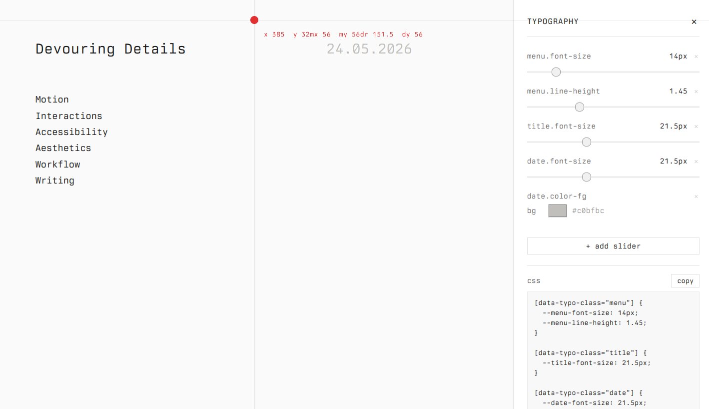
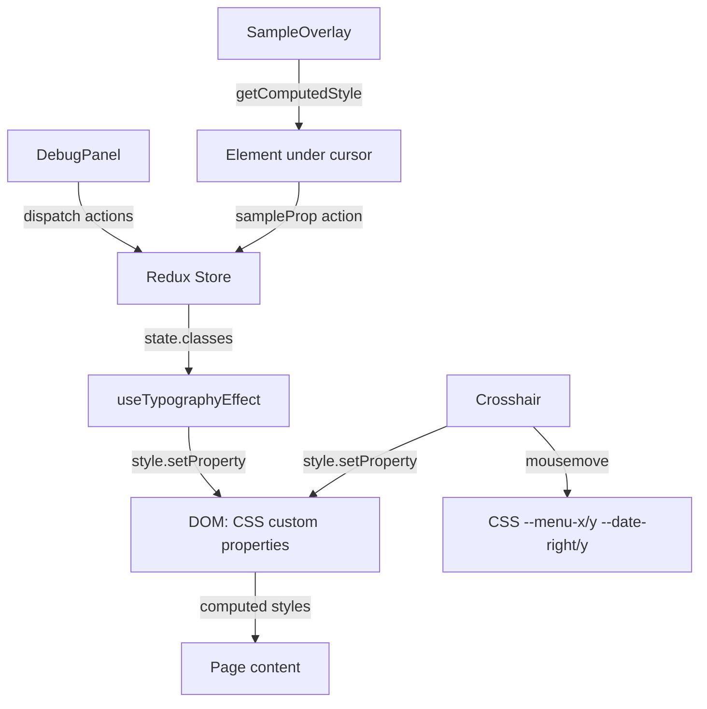

# Devouring Details — Building an Interactive Typography Debug Tool

This article describes the architecture, implementation decisions, and iteration path of Devouring Details, an interactive typography debug tool built as a single-page React application. The tool demonstrates a pattern for building learn-by-doing debug panels: start empty, let the user discover which controls they need, and add only those controls to the interface. It also shows how CSS custom properties serve as a bridge between React state and the DOM, how `getComputedStyle` enables element-level typography sampling, and how a crosshair cursor can make spatial relationships between layout elements tangible.



> [!summary]
> - CSS custom properties bridge Redux state and the DOM without a CSS-in-JS library. Writing properties on `document.documentElement` and scoped elements via `style.setProperty` produces immediate visual feedback.
> - A dynamic slider palette (start empty, sample to add) is more useful than a pre-populated control panel. The user learns typography by inspecting real elements, not by reading a list of property names.
> - `window.getComputedStyle` and `document.elementFromPoint` are sufficient to build a full element inspector. The key technique is temporarily setting `pointer-events: none` on an overlay to let `elementFromPoint` see through it.
> - Crosshair cursor with H1/V3 follow positioning demonstrates that menu and date elements can be made to follow the cursor while respecting border constraints — the cursor always stays between them, and each element never drifts more than half the viewport away.

## Why this project exists

Typography is learned through adjustment. Reading about `line-height` ratios produces abstract knowledge; dragging a slider from `1.2` to `1.6` while watching text compress and then breathe produces felt knowledge. The standard approach for typography experimentation is either editing CSS in a text editor and refreshing, or using browser DevTools, which presents all properties at once and is optimized for debugging rather than learning.

Devouring Details starts from a different premise: the panel begins empty, and you add controls by inspecting actual elements on the page. This "sample to discover" pattern means the interface only contains what you have chosen to explore. It also means the relationship between a CSS property and its visual effect is immediately visible — you sampled `title.font-size`, you see the slider, you drag it, the title resizes.

## Architecture

The application has four layers: the page content, the typography state, the debug sidebar, and the crosshair overlay. Each layer has a single responsibility.



**Redux store** holds the typography state: class-scoped property values and the list of active slider controls. **`useTypographyEffect`** is a React effect that watches the store and writes CSS custom properties onto the DOM. **DebugPanel** renders sliders and dispatches Redux actions. **SampleOverlay** captures mouse events, reads computed styles from the element under the cursor, and dispatches `sampleProp` actions. **Crosshair** reads cursor position and writes positioning custom properties so the menu and date follow the cursor.

### State shape

The Redux state is deliberately flat. There are four class scopes — `all`, `title`, `menu`, `date` — each holding the same set of typography properties. A separate `controls` array tracks which `class.prop` combinations have sliders in the debug panel.

```typescript
interface TypographyState {
  sampleMode: boolean
  panelOpen: boolean
  crosshair: boolean
  followH: boolean
  followV: boolean
  controls: ActiveControl[]       // [{ cls: 'title', prop: 'fontSize' }, ...]
  classes: Record<ClassScope, ClassTypography>
}

interface ClassTypography {
  fontSize: number      // px, range 8–48
  lineHeight: number    // unitless, range 0.8–3.0
  letterSpacing: number // em, range -0.05–0.5
  fontWeight: number    // 100–900
  colorFg: string       // hex
  colorBg: string       // hex
}
```

The `controls` array is the key data structure. It is the only source of truth for what sliders appear in the debug panel. When the user samples `title.font-size`, the `sampleProp` reducer both adds `{ cls: 'title', prop: 'fontSize' }` to `controls` and sets the value on `classes.title.fontSize`. The debug panel iterates over `controls` and reads values from `classes`.

### CSS custom properties as the state-to-DOM bridge

The `useTypographyEffect` hook writes Redux state to the DOM every time the state changes. For the `all` class, it writes to `:root` (global custom properties). For scoped classes, it writes to each element matching `[data-typo-class="title"]`, `[data-typo-class="menu"]`, and `[data-typo-class="date"]`.

```typescript
// Simplified pseudocode for useTypographyEffect
function useTypographyEffect(state: TypographyState) {
  useEffect(() => {
    const root = document.documentElement
    // Global properties
    root.style.setProperty('--font-size', `${state.classes.all.fontSize}px`)
    root.style.setProperty('--line-height', String(state.classes.all.lineHeight))
    root.style.setProperty('--color-fg', state.classes.all.colorFg)
    root.style.setProperty('--color-bg', state.classes.all.colorBg)

    // Per-class overrides
    for (const cls of ['title', 'menu', 'date'] as ClassScope[]) {
      const props = state.classes[cls]
      document.querySelectorAll(`[data-typo-class="${cls}"]`).forEach(el => {
        const htmlEl = el as HTMLElement
        htmlEl.style.setProperty(`--${cls}-font-size`, `${props.fontSize}px`)
        htmlEl.style.setProperty(`--${cls}-line-height`, String(props.lineHeight))
        htmlEl.style.setProperty(`--${cls}-letter-spacing`, `${props.letterSpacing}em`)
        htmlEl.style.setProperty(`--${cls}-color-fg`, props.colorFg)
      })
    }
  }, [state])
}
```

The CSS then uses these custom properties with fallbacks:

```css
[data-typo-class="title"] {
  font-size: var(--title-font-size, var(--font-size));
  line-height: var(--title-line-height, var(--line-height));
  color: var(--title-color-fg, var(--color-fg));
}
```

This pattern has three advantages over CSS-in-JS. First, it preserves the CSS cascade — per-class overrides fall back to global values. Second, it requires no build-time transformation. Third, it makes the system inspectable: opening DevTools shows the custom properties and their sources.

## The sample mode

Sample mode is the primary discovery mechanism. When activated, a full-viewport overlay captures mouse events. On hover, it identifies the element under the cursor and reads its computed typography. On click, it pins a tooltip next to that element showing each attribute with a "+" button. Clicking an attribute adds it as a slider in the debug panel.

### The pointer-events technique

The overlay must capture mouse events (to track the cursor) but must also allow `document.elementFromPoint` to find the real element underneath. The solution is to temporarily set `pointer-events: none` on the overlay, call `elementFromPoint`, then restore `pointer-events: auto`.

```typescript
function resolveElement(x: number, y: number): HoverInfo | null {
  const overlay = overlayRef.current
  overlay.style.pointerEvents = 'none'
  const target = document.elementFromPoint(x, y)
  overlay.style.pointerEvents = 'auto'

  const classedEl = target?.closest('[data-typo-class]') as HTMLElement | null
  if (!classedEl) return null

  const cls = classedEl.dataset.typoClass as ClassScope
  const computed = extractTypography(classedEl)
  const rect = classedEl.getBoundingClientRect()
  return { cls, rect, computed }
}
```

### Extracting computed styles

The `extractTypography` function reads live computed values and normalizes them. Three normalizations matter:

1. **`lineHeight`** may return a pixel value (`"22.4px"`) instead of a unitless ratio. Divide by `fontSize` to recover the ratio.
2. **`letterSpacing`** may return `"normal"` (meaning zero). Parse it conditionally.
3. **`color`** returns `rgb(R, G, B)`. Convert to hex for the color picker.

```typescript
function extractTypography(el: HTMLElement): Partial<ClassTypography> {
  const cs = window.getComputedStyle(el)
  const fontSize = parseFloat(cs.fontSize)

  let lineHeight = parseFloat(cs.lineHeight)
  if (cs.lineHeight.includes('px') && fontSize > 0) {
    lineHeight = lineHeight / fontSize
  }

  let letterSpacing = 0
  if (cs.letterSpacing !== 'normal') {
    letterSpacing = parseFloat(cs.letterSpacing) / fontSize
  }

  return {
    fontSize,
    lineHeight: Math.round(lineHeight * 100) / 100,
    letterSpacing: Math.round(letterSpacing * 1000) / 1000,
    fontWeight: parseInt(cs.fontWeight) || 400,
    colorFg: rgbToHex(cs.color),
    colorBg: rgbToHex(cs.backgroundColor),
  }
}
```

### Click-to-pin interaction model

The tooltip follows the cursor position during hover, which makes it impossible to click an attribute row — moving the mouse toward the tooltip moves the tooltip away. The solution is to separate hover and pin into two steps: hover highlights the element, click pins the tooltip at a fixed position (anchored to the element's right edge), and the user can then move their mouse into the tooltip to click attribute rows. The tooltip dismisses when the mouse leaves it or when the close button is pressed.

## The crosshair cursor

The crosshair is a visual measurement tool. It renders a red circle at the cursor position, gray horizontal and vertical lines spanning the full viewport, and a coordinate readout showing the cursor position plus the computed positions of the menu and date elements.

### H1 + V3 positioning model

Two positioning formulas control how the menu and date follow the cursor.

**H1 (horizontal, half-screen anchor):**

```
menuX    = max(padding, cursorX - viewportWidth / 2)
dateRight = max(padding, viewportWidth - cursorX - viewportWidth / 2)
```

When the cursor is at the left edge, `menuX` pins to the left padding and `dateRight` is half the viewport (the date sits at the midpoint). When the cursor moves right, the menu shifts right and the date shifts left. The cursor is always between them, and neither is more than half the viewport away.

**V3 (vertical, direct follow with clamping):**

```
menuY = clamp(cursorY, padding, viewportHeight - menuHeight)
dateY = clamp(cursorY, padding, viewportHeight - dateHeight)
```

Both elements follow the cursor's Y position directly, stopping at the top and bottom edges. When the cursor is near the bottom, both elements are pushed down — the date stops at the bottom border, and the menu must also stay above the bottom minus its height.

These formulas are applied via CSS custom properties written by the `Crosshair` component:

```typescript
useEffect(() => {
  const root = document.documentElement
  root.style.setProperty('--menu-x', `${menuX}px`)
  root.style.setProperty('--menu-y', `${menuY}px`)
  root.style.setProperty('--date-right', `${dateRight}px`)
  root.style.setProperty('--date-y', `${dateY}px`)
}, [menuX, dateRight, menuY, dateY])
```

The CSS reads these properties directly:

```css
.menu {
  position: absolute;
  left: var(--menu-x, 56px);
  top: var(--menu-y, 48px);
}

.date-display {
  position: absolute;
  right: var(--date-right, 56px);
  top: var(--date-y, 48px);
}
```

Using `right:` for the date instead of `left:` simplifies the computation — `dateRight` is the distance from the right edge of the viewport, which avoids needing to know the `.page` container width.

## CSS output

The debug panel includes a CSS output section that generates copy-pasteable CSS custom property declarations from the current slider state. It groups properties by class and produces `:root` for the `all` scope and `[data-typo-class="..."]` selectors for scoped classes.

```css
[data-typo-class="menu"] {
  --menu-font-size: 14px;
  --menu-line-height: 1.45;
}

[data-typo-class="title"] {
  --title-font-size: 21.5px;
}

[data-typo-class="date"] {
  --date-font-size: 21.5px;
  --date-color-fg: #c0bfbc;
}
```

The `navigator.clipboard.writeText` API handles the copy action.

## Persistence

Slider state (the `controls` array and all class property values) persists to `localStorage` on every Redux state change. On page load, `loadState()` reads the saved JSON and merges it with defaults, so new properties added in future versions get their defaults while user-adjusted values are preserved.

```typescript
function loadState(): TypographyState {
  try {
    const saved = JSON.parse(localStorage.getItem(STORAGE_KEY))
    return {
      sampleMode: false,
      panelOpen: false,
      crosshair: saved.crosshair ?? false,
      followH: saved.followH ?? false,
      followV: saved.followV ?? false,
      controls: saved.controls ?? [],
      classes: {
        all:   { ...defaultClassTypography, ...saved.classes?.all },
        title: { ...defaultClassTypography, ...saved.classes?.title },
        menu:  { ...defaultClassTypography, ...saved.classes?.menu },
        date:  { ...defaultClassTypography, ...saved.classes?.date },
      },
    }
  } catch {
    return defaultState
  }
}
```

## Technology stack

| Layer | Technology | Purpose |
|-------|-----------|---------|
| Build | Vite 8 + `@vitejs/plugin-react` | HMR, TypeScript compilation, bundling |
| Styling | Tailwind CSS v4 + custom CSS | Reset, custom properties, layout |
| UI framework | React 19 | Component model, hooks, effects |
| State management | Redux Toolkit | `createSlice`, typed dispatch/selectors |
| Server sync | RTK Query (placeholder) | `createApi` with empty endpoints, extensible for future persistence |
| Font | Berkeley Mono Regular (woff2) | Single typeface, single weight, from local font files |
| Persistence | `localStorage` | Slider state and values |
| Browser APIs | `getComputedStyle`, `elementFromPoint`, `clipboard.writeText` | Element inspection, cursor tracking, CSS export |

## Implementation iteration path

The project went through five distinct implementation phases, each changing the architecture in response to what the tool needed to do.

**Phase 1: Static HTML + CSS.** A single `index.html` with `style.css` and `main.js`. The page had a flexbox layout with the menu on the left and the date on the right. CSS custom properties (`--font-size`, `--line-height`, `--color-fg`, `--color-bg`) were set on `:root`. This phase established the visual identity: Berkeley Mono, white background, near-black foreground, 14px font size, Swiss-style whitespace separators.

**Phase 2: React + TypeScript migration.** The vanilla files were replaced with a React component tree (`App`, `Page`, `NavMenu`, `DateDisplay`) and a Redux store. The `@vitejs/plugin-react` plugin was added to Vite. The CSS custom properties became the output of a React effect rather than static declarations.

**Phase 3: DebugPanel with pre-populated sliders.** The first debug panel showed all typography sliders for all classes simultaneously, with class-selector tabs to switch scope. This was functional but overwhelming — the user saw controls for properties they had not chosen to explore.

**Phase 4: Dynamic slider palette.** The class-selector tabs were removed. The `controls: ActiveControl[]` array was introduced: the panel starts empty, and sliders appear only when the user samples an attribute or adds one manually. Each slider is labelled with its scope (`title.font-size`, `menu.line-height`). The layout changed from a fixed overlay to a right sidebar so the date is never covered.

**Phase 5: Crosshair and follow.** The `Crosshair` component was added with three toggles: crosshair (red circle + gray lines), follow H (H1 horizontal positioning), follow V (V3 vertical positioning). A coordinate readout appears next to the red circle showing cursor position and computed element positions.

## Key implementation details

### The `data-typo-class` attribute pattern

Each page element that can be independently styled carries a `data-typo-class` attribute. This serves two purposes: the CSS uses it as a selector for per-class custom property overrides, and the sample mode uses it to identify which class scope an element belongs to.

```tsx
<a className="menu-item menu-title" data-typo-class="title" href="/">
  Devouring Details
</a>
<a className="menu-item" data-typo-class="menu" href="/motion">
  Motion
</a>
<div className="date-display" data-typo-class="date">
  {dateStr}
</div>
```

### Early-return hooks violation

A React hooks violation appeared in the `Crosshair` component. The component had a `useEffect` for toggling the `crosshair-active` CSS class on `document.body`, placed after an early `if (!crosshair) return null`. React requires that hooks are called in the same order on every render; the early return caused the effect to run on some renders but not others. The fix was to move all hooks above the conditional return.

```typescript
// WRONG: hooks after conditional return
if (!crosshair) return null
useEffect(() => { /* ... */ }, [])  // only runs when crosshair is true

// CORRECT: all hooks before any return
useEffect(() => { /* ... */ }, [crosshair])
if (!crosshair) return null
```

### The `elementFromPoint` overlay dance

The sample overlay must capture mouse events to track the cursor, but `document.elementFromPoint` needs to see through it. The technique is a three-step sequence: (1) set `overlay.style.pointerEvents = 'none'`, (2) call `elementFromPoint(clientX, clientY)`, (3) restore `overlay.style.pointerEvents = 'auto'`. This must happen synchronously — if the browser processes a paint between steps, the user may see a flicker.

### Date positioning with `right:` instead of `left:`

The initial implementation used `left: var(--date-x)` to position the date. This required computing `dateX = viewportWidth - padding - estimatedDateWidth`, which broke when the `.page` container was narrower than the viewport (e.g., when the sidebar was open). Switching to `right: var(--date-right, 56px)` made the computation simpler: `dateRight` is just the distance from the right edge, and CSS handles the rest.

## Open questions

- The `useTypographyEffect` hook runs `querySelectorAll` on every state change. For the current number of elements (under 10), this is negligible. If the page had hundreds of `[data-typo-class]` elements, a ref-based approach would be more efficient.
- The font-weight slider has no visual effect because Berkeley Mono Regular (400) is the only weight available. Adding Berkeley Mono Bold (700) would make the slider functional.
- The crosshair's coordinate readout is rendered as raw text next to the cursor ball. A more polished version might use a small canvas overlay or a monospaced readout with alignment guides.

## Near-term next steps

- Add a click-outside handler for the "+ add slider" dropdown menu.
- Add keyboard shortcuts: `Ctrl+D` to toggle the debug panel, `Escape` to exit sample mode at the application level.
- Add visual grouping in the sidebar (thin separators between controls of different classes).
- Consider adding a "preset" system: save the current slider configuration as a named preset, load presets from a dropdown.
- Upload the design doc and diary to reMarkable for reading away from the computer.
