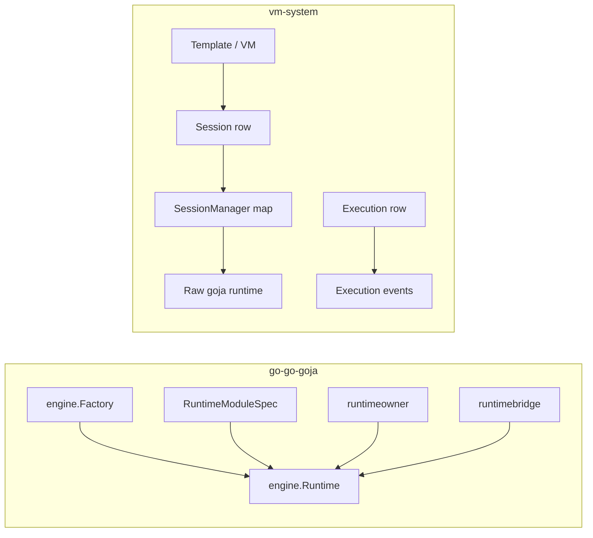
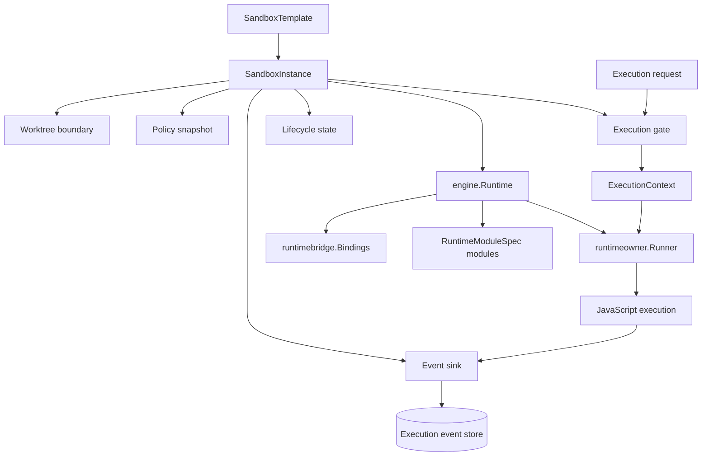
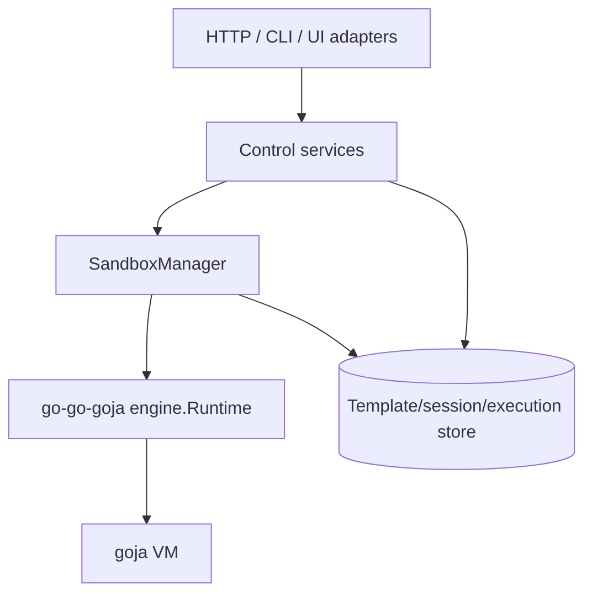

# Goja Sandbox Architecture: Lessons from go-go-goja and vm-system

This note steps back from the recent `go-go-goja` runtime work and compares it with the Goja runtime plane in `vm-system`. The purpose is to ask a larger architectural question: what would a powerful, effective, and elegant Goja sandbox management system look like if it had to support persistent sessions, request-scoped executions, generated runtimes, controlled native modules, asynchronous Go-backed APIs, durable execution history, and long-lived daemon hosting?

The answer is not that the recent `go-go-goja` design is wrong. The answer is also not that `vm-system` should be copied into `go-go-goja` as-is. The two systems solve different slices of the same problem. `go-go-goja` has a strong runtime substrate. `vm-system` has a strong control-plane vocabulary. The most valuable future design probably combines those two strengths while deleting the duplicated and weaker runtime mechanisms.

> [!summary]
> - `go-go-goja` now has the stronger live runtime substrate: `engine.Runtime`, event loop ownership, runtime owner scheduling, per-call context propagation, runtime-aware module registration, lifecycle closers, and explicit module exposure policy.
> - `vm-system` has the stronger product/control-plane vocabulary: templates, sessions, executions, event streams, REST/CLI access, worktree roots, startup files, daemon ownership, stale-session reconciliation, and persisted audit history.
> - The main architectural gap is that neither repository currently expresses a single first-class concept of a managed sandbox. `go-go-goja` owns a runtime instance; `vm-system` owns a session record and raw Goja runtime. The future object should own both runtime execution and control-plane policy.
> - The most promising direction is a sandbox manager built on `go-go-goja/engine.Runtime` and informed by `vm-system`'s template/session/execution/event model. It should support long-lived keyed sessions, short-lived invocation runtimes, and generated xgoja runtimes through the same lifecycle contracts.
> - Sobek is relevant because it adds first-class ES Modules, dynamic import, top-level await, and import metadata, which could simplify modern source loading and library policy. It does not remove the need for runtime ownership, context propagation, lifecycle, execution records, or resource policy.
> - The main warning is feature accumulation without a contract boundary. Modules, event capture, limits, startup scripts, libraries, persistence, and HTTP control should not each invent their own runtime lifecycle. They should attach to one sandbox lifecycle.

## Why this note exists

The recent `go-go-goja` work added important runtime capabilities: owner-aware scheduling, `runtimebridge` bindings, `RuntimeModuleSpec`, generated xgoja module adaptation, explicit module exposure controls, and `jsverbs` invocation through `engine.Runtime`. Those pieces are useful, but they also raise a larger design concern. A runtime substrate can accumulate features without becoming a coherent sandbox platform.

`vm-system` is relevant because it already attempted the next layer up. It models templates, live sessions, executions, event streams, daemon hosting, REST APIs, CLI commands, startup files, library loading, and worktree boundaries. Its runtime implementation is older and weaker than the current `go-go-goja` engine, but its domain model captures use cases that `go-go-goja` does not yet model directly.

The question is therefore architectural, not only technical:

- Which parts of the current `go-go-goja` runtime design are strong enough to become the foundation?
- Which parts of `vm-system` should be preserved as concepts?
- Which parts of both systems are accidental complexity?
- What contract should exist between a JavaScript runtime substrate and a durable sandbox control plane?

This report is speculative, but it is grounded in current files and behavior in both repositories.

## Source map

The main `go-go-goja` files considered here are:

```text
/home/manuel/workspaces/2026-05-22/xgoja/go-go-goja/
├── engine/factory.go              # builder, factory, runtime creation sequence
├── engine/runtime.go              # owned runtime, lifecycle context, closers, close order
├── engine/runtime_modules.go      # RuntimeModuleSpec and RuntimeModuleContext
├── engine/module_specs.go         # default/native/process modules and initializers
├── engine/module_middleware.go    # default module selection policy
├── engine/options.go              # implicit default module controls
├── pkg/runtimeowner/runner.go     # owner Call/Post scheduling and context propagation
├── pkg/runtimebridge/runtimebridge.go
├── pkg/jsverbs/runtime.go         # owner-aware JavaScript verb invocation
└── pkg/xgoja/app/factory.go       # generated runtime profile adaptation to engine.Runtime
```

The main `vm-system` files considered here are:

```text
/home/manuel/code/wesen/go-go-golems/vm-system/
├── README.md
├── pkg/doc/vm-system-architecture.md
├── pkg/vmmodels/models.go         # templates, settings, sessions, executions, events
├── pkg/vmcontrol/core.go          # services and ports composition
├── pkg/vmcontrol/ports.go         # runtime/store port boundaries
├── pkg/vmcontrol/session_service.go
├── pkg/vmcontrol/execution_service.go
├── pkg/vmsession/session.go       # active session map and raw goja runtime lifecycle
├── pkg/vmexec/executor.go         # execution pipeline and event capture
├── pkg/vmmodules/registry.go      # go-go-goja module registry adapter
├── pkg/vmdaemon/app.go            # daemon lifecycle and stale session reconciliation
├── pkg/vmtransport/http/server.go # REST route surface
└── ttmp/...                       # earlier architecture and quality review docs
```

The earlier Obsidian note [[ARTICLE - go-go-goja Runtime System - Creation Context Scheduling and Modules|go-go-goja Runtime System: Creation, Context, Scheduling, Bindings, and Modules]] explains the current `go-go-goja` runtime mechanism. This note builds on that explanation and asks what the next architectural layer should be.

## The central distinction: runtime substrate versus sandbox control plane

A useful design starts by separating two concerns.

The **runtime substrate** is responsible for the live JavaScript execution environment. It creates the VM, owns the event loop, serializes VM access, registers modules, propagates contexts, settles promises on the owner path, and shuts down resources.

The **sandbox control plane** is responsible for identity, policy, persistence, and operation. It defines templates, creates sessions, records executions, stores event streams, exposes APIs, closes stale sessions, enforces limits, tracks worktree roots, and decides what should happen after process restart.

The current repositories divide these concerns unevenly.

| Concern | go-go-goja current state | vm-system current state |
|---|---|---|
| Owned Goja runtime | Strong: `engine.Runtime` owns VM, loop, owner, bridge, closers. | Weak: `Session` stores raw `*goja.Runtime` and a mutex. |
| Module registration | Strong: `RuntimeModuleSpec` receives runtime context before `require` is enabled. | Partial: template modules call go-go-goja module registry loaders directly. |
| Async module safety | Strong: `runtimebridge` + `runtimeowner` support owner-thread promise settlement. | Weak: raw VM has no event loop owner bindings for async go-go-goja modules. |
| Context propagation | Strong: `runtimebridge.CurrentContext(vm)` follows owner calls. | Minimal: execution methods do not attach a call context to VM execution. |
| Session identity | Minimal: runtime values exist, but no durable session model. | Strong: session records, statuses, worktree path, template ID, timestamps. |
| Execution history | Package-specific: jsverbs returns values; no canonical execution stream. | Strong: execution rows and sequential event rows. |
| Daemon hosting | Out of scope in engine. | Strong direction: long-lived daemon, REST API, CLI client. |
| Startup files and libraries | Out of scope in engine. | Present: startup file execution and library loading. |
| Limit semantics | Mostly module exposure policy; not a full resource manager. | Modeled, but enforcement is partial and post-execution. |
| Generated runtime composition | Strong in xgoja. | Not a generated-binary builder. |

The synthesis is straightforward: keep `go-go-goja` as the runtime substrate, and let `vm-system` inform a higher-level sandbox control plane. Do not keep two Goja runtime implementations.

## What `go-go-goja` gets right

### 1. Runtime creation is now an explicit lifecycle

The current engine does not return a bare VM. It returns:

```go
type Runtime struct {
    VM      *goja.Runtime
    Require *require.RequireModule
    Loop    *eventloop.EventLoop
    Owner   runtimeowner.Runner
    Values  map[string]any

    runtimeCtx       context.Context
    runtimeCtxCancel context.CancelFunc
    closers          []func(context.Context) error
}
```

This is the correct foundation for sandbox management. A sandbox needs a lifecycle object. A bare `*goja.Runtime` cannot express all of the state that real host integrations need.

`engine.Factory.NewRuntime` creates the VM, starts the event loop, creates a runtime owner, stores bridge bindings, creates a require registry, registers modules, enables require, installs global services, runs initializers, and returns a live runtime. The order is explicit and testable.

The design is strong because it gives every future feature a place to attach:

- modules attach during `RuntimeModuleSpec.RegisterRuntimeModule`,
- globals attach during `RuntimeInitializer.InitRuntime`,
- asynchronous work attaches through `runtimebridge.Bindings`,
- cancellation attaches through the runtime lifecycle context and current call context,
- cleanup attaches through `Runtime.AddCloser`,
- execution enters through `Runtime.Owner.Call` or `Runtime.Owner.Post`.

That is an architectural boundary, not only an implementation detail.

### 2. The owner path is a real correctness mechanism

`pkg/runtimeowner.Runner` provides two operations:

```go
type Runner interface {
    Call(ctx context.Context, op string, fn CallFunc) (any, error)
    Post(ctx context.Context, op string, fn PostFunc) error
    Shutdown(ctx context.Context) error
    IsClosed() bool
}
```

This matters because Goja VM access must be serialized. Without a runtime owner, every async Go-backed module has to decide on its own whether it is safe to touch the VM from a goroutine. That is not a decision each module should make independently.

The runner also installs the active call context through `runtimebridge.WithCallContext`. That means native modules can read request-scoped cancellation, deadlines, and tracing values through `runtimebridge.CurrentContext(vm)`.

This is the key difference between a VM wrapper and a runtime substrate. The substrate defines how Go code enters JavaScript and how JavaScript-backed operations return to Go.

### 3. Runtime-aware module registration is the right module abstraction

The new contract is:

```go
type RuntimeModuleSpec interface {
    ID() string
    RegisterRuntimeModule(ctx *RuntimeModuleContext, reg *require.Registry) error
}
```

`RuntimeModuleContext` includes the lifecycle context, VM, event loop, owner, closer registry, and values map. That is exactly what runtime-scoped modules need. A plugin module, HTTP route module, xgoja provider module, documentation module, or database module can all use the same interface.

The recent hard cutover removed the older split between static module specs and runtime registrars. That was the right direction. A sandbox platform should not have two competing extension seams for `require()` modules.

### 4. Explicit module exposure policy is present

`engine/options.go` now contains explicit controls for implicit defaults:

```go
engine.WithImplicitDefaultRegistryModules(false)
engine.WithDataOnlyDefaultRegistryModules(false)
```

Those controls matter because the same runtime substrate must support different policies.

- A developer REPL may want broad default modules.
- A script runner may want `MiddlewareSafe()`.
- A generated xgoja binary must expose only buildspec-selected modules.
- A daemon-managed sandbox may need a template-defined module list.

The runtime system must make module exposure an explicit policy decision, not a side effect of which constructor was called.

### 5. xgoja now proves that generated composition can reuse the engine

`pkg/xgoja/app/factory.go` adapts generated provider modules into `RuntimeModuleSpec` values and then creates an engine runtime:

```go
builder := engine.NewBuilder(
    engine.WithImplicitDefaultRegistryModules(false),
    engine.WithDataOnlyDefaultRegistryModules(false),
).WithModules(modules...)
```

This is significant because xgoja has strict module selection semantics. The generated binary may compile many providers, but each runtime profile exposes only selected modules. The fact that xgoja can now use `engine.Runtime` without inheriting broad defaults shows that the engine substrate is flexible enough for policy-sensitive hosts.

## What `go-go-goja` still does not provide

The current engine is a runtime substrate, not a full sandbox manager. That is appropriate, but it should be recognized explicitly.

### 1. There is no durable sandbox identity

`engine.Runtime` has a lifecycle context and values map, but it has no durable ID, template snapshot, workspace, worktree root, status, restart policy, execution history, or owner process lease. Those are not engine responsibilities by default, but any durable sandbox use case needs them.

### 2. There is no canonical execution record

`jsverbs` has command invocation logic. REPL code has evaluator paths. xgoja has eval commands. HTTP modules dispatch JavaScript handlers. Each path can run JavaScript, but there is no shared execution record contract equivalent to `vm-system`'s `Execution` and `ExecutionEvent` model.

This is acceptable at the engine layer. It becomes a problem if the repository wants to offer managed sandboxes as a product-level abstraction.

### 3. Limits are not a complete sandbox policy

The engine can restrict modules. It can propagate contexts. It can close runtimes. It can let callers apply `context.WithTimeout` around owner calls. It does not currently define CPU budgets, memory budgets, event budgets, output budgets, queue limits, idle expiration, maximum concurrent executions, or crash policies.

Some of these constraints are difficult with Goja inside the same process. That difficulty should be documented as part of the sandbox design rather than hidden behind configuration fields that imply stronger isolation than the process can provide.

### 4. Runtime bridge state is per-VM global state

`runtimebridge` stores bindings in a `sync.Map` keyed by `*goja.Runtime`. That is practical and currently appropriate. It also means that constructing raw Goja runtimes outside `engine.Runtime` bypasses bridge setup and cleanup. If a future sandbox layer permits raw VM construction, it will reintroduce a class of bugs that the engine already solved.

The rule should be direct: managed sandboxes use `engine.Runtime` or a wrapper that creates equivalent bindings and close behavior. They do not create bare VMs.

## What `vm-system` gets right

### 1. It names the product concepts correctly

`vm-system/pkg/vmmodels/models.go` contains the most important vocabulary for a managed sandbox platform:

```go
type VM struct {
    ID             string
    Name           string
    Engine         string
    ExposedModules []string
    Libraries      []string
}

type VMSession struct {
    ID            string
    VMID          string
    WorkspaceID   string
    BaseCommitOID string
    WorktreePath  string
    Status        string
    CreatedAt     time.Time
    ClosedAt      *time.Time
    LastError     string
}

type Execution struct {
    ID        string
    SessionID string
    Kind      string
    Input     string
    Path      string
    Args      json.RawMessage
    Env       json.RawMessage
    Status    string
    StartedAt time.Time
    EndedAt   *time.Time
    Result    json.RawMessage
    Error     json.RawMessage
    Metrics   json.RawMessage
}

type ExecutionEvent struct {
    ExecutionID string
    Seq         int
    Ts          time.Time
    Type        string
    Payload     json.RawMessage
}
```

The names are not perfect. `VM` is currently a template/profile, not a live virtual machine. But the model identifies the right entities: a reusable definition, a live session, a discrete execution, and an ordered event stream.

This is exactly the layer missing from `go-go-goja`.

### 2. It treats the daemon as the runtime authority

The earlier `vm-system` analysis identified a major problem: if each CLI invocation creates a new in-memory session manager, live runtime handles disappear between commands. The current repository has moved toward a daemon-first architecture. `pkg/vmdaemon/app.go` hosts a long-lived process; `pkg/vmtransport/http` exposes REST endpoints; the CLI uses `pkg/vmclient`.

This direction is correct for durable sessions. A live JavaScript runtime is process memory. If sessions are meant to preserve variables across executions, the process that owns those sessions must remain alive, or it must implement snapshot/recovery. `vm-system` correctly chose a long-lived daemon as the first implementation.

### 3. It separates transport from core orchestration

`pkg/vmcontrol` defines service-layer ports:

```go
type SessionRuntimePort interface {
    CreateSession(vmID, workspaceID, baseCommitOID, worktreePath string) (*vmsession.Session, error)
    GetSession(sessionID string) (*vmsession.Session, error)
    CloseSession(sessionID string) error
    ListSessions() []*vmsession.Session
}

type ExecutionRuntimePort interface {
    ExecuteREPL(sessionID, input string) (*vmmodels.Execution, error)
    ExecuteRunFile(sessionID, path string, args, env map[string]interface{}) (*vmmodels.Execution, error)
    ListExecutions(sessionID string, limit int) ([]*vmmodels.Execution, error)
    GetExecution(executionID string) (*vmmodels.Execution, error)
    GetEvents(executionID string, afterSeq int) ([]*vmmodels.ExecutionEvent, error)
}
```

This is a good architectural instinct. HTTP handlers should not own runtime policy. CLI commands should not own runtime policy. A reusable core should orchestrate templates, sessions, executions, and stores through ports.

The specific port shapes would change in a future system, but the layering should survive.

### 4. It has a persistent execution event stream

`vmexec.Executor` records execution rows and event rows. It overrides `console.log`, emits `input_echo`, records return values, records exceptions, and persists sequential event numbers.

The event stream is one of the most valuable ideas in `vm-system`. Managed JavaScript runtimes need observability. A caller should be able to ask:

- what code ran,
- when it started,
- when it finished,
- what it logged,
- what value it returned,
- what exception it threw,
- which events were emitted in what order.

`go-go-goja` has no equivalent canonical record today. If the future platform includes durable or operational sandboxes, the event stream should be preserved and generalized.

### 5. It models worktree boundaries

`vm-system` sessions include a `WorktreePath`, and `ExecutionService` normalizes run-file paths through `vmpath`. Earlier review work identified traversal and symlink issues; current code has typed path primitives and path normalization around run-file and startup paths.

That matters because a sandbox without a filesystem boundary is not a sandbox. Even if Goja itself is in-process, the host can still enforce path capability boundaries for file loading and execution entrypoints.

### 6. It reconciles stale sessions after daemon restart

`pkg/vmdaemon/app.go` closes persisted `starting` and `ready` sessions on daemon startup:

```go
const sessionStartupGCMessage = "garbage collected on daemon startup: runtime state does not survive process restarts"
```

This is a sober and correct behavior. `vm-system` does not pretend that in-memory Goja runtime state survives process restart. It marks persisted session records as closed and records why.

A future sandbox manager should keep this honesty. Durable control-plane records can survive restart; live JavaScript heap state cannot survive restart unless the system implements explicit snapshotting or replay.

## What `vm-system` gets wrong or has outgrown

### 1. It creates raw Goja runtimes instead of engine runtimes

`pkg/vmsession/session.go` currently creates sessions with:

```go
runtime := goja.New()
session.Runtime = runtime
```

Then it enables configured modules with:

```go
if err := vmmodules.EnableConfiguredModules(runtime, vm.ExposedModules); err != nil {
    return failSessionCreation("failed to enable configured modules", err)
}
```

This bypasses the current `go-go-goja` engine runtime substrate. It does not create an event loop, owner runner, runtimebridge bindings, runtime lifecycle context, runtime closers, or runtime-aware module context.

That makes the design incompatible with the strongest recent `go-go-goja` work. Any go-go-goja module that expects runtimebridge bindings, owner scheduling, or lifecycle context will fail or behave differently inside `vm-system`.

The `timer` module is a concrete example. It calls `runtimebridge.Lookup(vm)` and requires owner bindings. A raw `goja.New()` runtime does not have those bindings.

### 2. It uses a mutex instead of owner scheduling

`vmsession.Session` contains:

```go
type Session struct {
    Runtime       *goja.Runtime
    ExecutionLock sync.Mutex
}
```

`vmexec.Executor.prepareSession` uses `TryLock()` to reject concurrent execution:

```go
if !session.ExecutionLock.TryLock() {
    return nil, nil, vmmodels.ErrSessionBusy
}
```

The lock is useful, but it is not a replacement for owner scheduling. It prevents two executor calls from entering `RunString` at the same time, but it does not provide:

- event-loop scheduling,
- reentrant owner calls,
- current-call context propagation,
- promise settlement through `Owner.Post`,
- a standard path for native modules to return to the VM.

A future session should contain `*engine.Runtime`, not `*goja.Runtime`, and execution should enter through `rt.Owner.Call`.

### 3. It records execution events outside the runtime context

`vmexec.Executor` installs console capture by setting a Go map as `console` on the raw runtime:

```go
console := map[string]interface{}{
    "log": func(args ...interface{}) {
        output := fmt.Sprint(args...)
        recorder.emit(vmmodels.EventConsole, payload)
    },
}
session.Runtime.Set("console", console)
```

This works for basic `console.log`, but it is structurally local to the executor. It is not integrated with runtimebridge current context. Modules cannot ask for the active execution recorder. Async work that logs after the immediate `RunString` call may not belong to a well-defined execution scope.

A better design would attach an execution scope to the owner call context. Console capture would emit to the event sink stored in that context. Native modules could also emit structured events through the same context if the host allows it.

### 4. It models limits but enforces them weakly

`vmmodels.LimitsConfig` includes CPU, wall time, memory, max events, and max output. `ExecutionService.enforceLimits` currently runs after execution and counts stored events/output size. It also soft-fails if settings or events cannot be read:

```go
limits, err := s.loadSessionLimits(sessionID)
if err != nil {
    // Scaffolding is intentionally soft-fail while limit enforcement matures.
    return nil
}
```

This is acceptable scaffolding, but it should not be confused with sandbox enforcement. A future design needs to distinguish between:

- preflight limits that reject an execution before it starts,
- context deadlines that cancel cooperative host operations,
- event/output budgets enforced while events are emitted,
- runtime close or session crash policy after budget violation,
- hard isolation limits that Goja cannot provide inside one Go process.

The last category is important. In-process Goja cannot provide the same hard isolation guarantees as an OS process boundary. The architecture should state which guarantees are hard and which are cooperative.

### 5. Startup failure can leave active runtime entries

The current session creation path inserts the session into the active sessions map before startup files run:

```go
sm.sessionsMu.Lock()
sm.sessions[sessionID] = session
sm.sessionsMu.Unlock()

if err := sm.runStartupFiles(session); err != nil {
    return failSessionCreation("startup failed", err)
}
```

The earlier VM-006 review called this out. If startup fails, the persisted session becomes `crashed`, but the in-memory entry can remain active. That is a control-plane/runtime-plane consistency bug.

An engine-backed sandbox manager should make session activation atomic: a runtime is inserted into the active registry only after startup succeeds, or it is inserted as `starting` and removed/closed deterministically on failure.

### 6. Closing a session does not close runtime resources

`CloseSession` deletes the session from the map and updates the database. With raw Goja runtimes, there is little to close. With engine runtimes, there will be bridge bindings, event loops, owner runners, module closers, plugin processes, timers, watchers, and lifecycle contexts.

That means a future migration cannot simply replace `*goja.Runtime` with `*engine.Runtime`. It must also call `rt.Close(ctx)` and define what happens when close fails.

### 7. The module adapter uses old go-go-goja module primitives

`pkg/vmmodules/registry.go` imports `github.com/go-go-golems/go-go-goja/modules` and enables selected modules by registering loaders into a fresh `require.Registry`:

```go
reg := require.NewRegistry()
module := gogojamodules.GetModule(name)
reg.RegisterNativeModule(name, module.Loader)
reg.Enable(vm)
```

This was sensible before `go-go-goja` had a unified runtime-aware module API. It is now a compatibility-shaped path. A future adapter should produce `engine.RuntimeModuleSpec` values or use `engine.MiddlewareOnly` for default-registry modules. That would preserve module policy while gaining runtime context and owner bindings.

## The architectural concept that is missing

The missing concept is a **managed sandbox instance**.

A managed sandbox instance is not only a VM, and it is not only a database row. It is the joined object that connects:

- a durable identity,
- a template snapshot,
- a live `engine.Runtime`,
- a workspace/worktree boundary,
- an execution queue or lock,
- event sinks,
- limits and policy,
- lifecycle state,
- startup result,
- close/crash behavior.

The current systems split this concept:



The desired system connects these into one runtime-plane object:



This object can support multiple use cases without changing the engine substrate.

## A proposed vocabulary

The future design should use precise names. The names below are proposals, not requirements.

| Concept | Meaning |
|---|---|
| `SandboxTemplate` | Durable definition of engine, modules, libraries, startup, limits, resolver, and persistence policy. This is `vm-system`'s current `VM` with clearer naming. |
| `SandboxInstance` | Live runtime instance created from a template snapshot. Contains `*engine.Runtime`, state, worktree root, execution gate, and close policy. |
| `SandboxManager` | Process-local owner of live instances. Provides create/get/close/list/invoke operations. |
| `ExecutionRequest` | A REPL snippet, file run, command invocation, scheduled event, HTTP dispatch, or generated action. |
| `ExecutionScope` | Per-execution context containing execution ID, event sink, deadline, output budget, logger, and trace metadata. |
| `ExecutionEvent` | Ordered persisted event emitted during execution. |
| `CapabilityPolicy` | Host-defined module/global/filesystem/network/environment access policy. |
| `RuntimeProfile` | A named module/runtime configuration within a generated binary or template. xgoja already has this concept. |

The goal is not to rename everything immediately. The goal is to prevent future features from attaching to the wrong object.

## The target architecture

The target architecture has three layers.

### Layer 1: engine runtime substrate

This is the current `go-go-goja/engine` package plus `runtimeowner` and `runtimebridge`.

Responsibilities:

- create owned Goja runtimes,
- manage event loop and owner scheduling,
- register runtime-aware modules,
- enable `require`,
- propagate contexts,
- run initializers,
- close resources.

Non-responsibilities:

- durable sessions,
- HTTP routes,
- database persistence of executions,
- multi-session process management,
- user-facing template CRUD.

### Layer 2: sandbox manager

This could live in `go-go-goja` as a new package, or in `vm-system` first. It should depend on the engine, not replace it.

Responsibilities:

- create `SandboxInstance` from `SandboxTemplate`,
- build an `engine.Factory` or reusable factory plan from template policy,
- maintain the live instance registry,
- own execution gates and queue policy,
- create execution scopes,
- call `rt.Owner.Call` for execution,
- close `engine.Runtime` on session close or crash,
- expose in-process APIs for daemon/CLI/server callers.

### Layer 3: control-plane adapters

This is where `vm-system` is already strong.

Responsibilities:

- persist templates, sessions, executions, events,
- expose REST APIs,
- expose CLI commands,
- serve UI,
- reconcile stale sessions on daemon startup,
- implement operator workflows and status views.

The layers should point downward:



The control plane may store records before and after runtime operations. The sandbox manager owns live runtime correctness. The engine owns VM correctness.

## The execution model

A future execution path should be owner-scheduled and event-scoped.

```go
type ExecutionScope struct {
    ExecutionID string
    SessionID   string
    Kind        string
    EventSink   EventSink
    Limits      ExecutionLimits
    StartedAt   time.Time
}

type executionScopeKey struct{}

func WithExecutionScope(ctx context.Context, scope *ExecutionScope) context.Context {
    return context.WithValue(ctx, executionScopeKey{}, scope)
}

func CurrentExecutionScope(ctx context.Context) (*ExecutionScope, bool) {
    scope, ok := ctx.Value(executionScopeKey{}).(*ExecutionScope)
    return scope, ok
}
```

The sandbox manager would execute code through the runtime owner:

```go
func (s *SandboxInstance) Execute(ctx context.Context, req ExecutionRequest) (*ExecutionResult, error) {
    if !s.gate.TryAcquire() {
        return nil, ErrSandboxBusy
    }
    defer s.gate.Release()

    exec := s.store.CreateExecution(req)
    sink := s.store.EventSink(exec.ID)
    scope := &ExecutionScope{ExecutionID: exec.ID, SessionID: s.ID, EventSink: sink, Limits: s.policy.Limits}

    callCtx, cancel := context.WithTimeout(ctx, s.policy.Limits.WallTime)
    defer cancel()
    callCtx = WithExecutionScope(callCtx, scope)

    ret, err := s.runtime.Owner.Call(callCtx, "sandbox.execute", func(ctx context.Context, vm *goja.Runtime) (any, error) {
        installExecutionConsole(vm, scope)
        value, err := runRequest(vm, s.runtime.Require, req)
        if err != nil {
            scope.EventSink.EmitException(err)
            return nil, err
        }
        scope.EventSink.EmitValue(value)
        return exportValue(value), nil
    })

    return s.store.FinalizeExecution(exec.ID, ret, err)
}
```

The important point is that `callCtx` becomes the current runtimebridge context. Native modules can read it:

```go
callCtx := runtimebridge.CurrentContext(vm)
scope, ok := sandbox.CurrentExecutionScope(callCtx)
```

That creates a path for modules to emit events, observe cancellation, and enforce output budgets without global variables.

## Console capture should become a runtime module or initializer

The current `vmexec` console capture sets `console` directly before each run. That should become a reusable runtime component.

A better shape is:

```go
type ConsoleCaptureInitializer struct{}

func (ConsoleCaptureInitializer) ID() string { return "console-capture" }

func (ConsoleCaptureInitializer) InitRuntime(ctx *engine.RuntimeContext) error {
    console := map[string]any{
        "log": func(args ...any) {
            callCtx := runtimebridge.CurrentContext(ctx.VM)
            if scope, ok := CurrentExecutionScope(callCtx); ok {
                scope.EventSink.EmitConsole("log", fmt.Sprint(args...))
                return
            }
            // Fallback for startup or unscoped calls.
        },
    }
    return ctx.VM.Set("console", console)
}
```

This makes console capture part of runtime composition rather than executor-local mutation. It also works for async owner calls as long as they run with a context carrying the execution scope.

There is a subtle design choice here. The console initializer should probably be host-supplied, not automatically installed by the engine. A general embedded runtime may want the default goja_nodejs console. A managed sandbox wants persisted console events.

## Startup should become a first-class execution phase

`vm-system` currently runs startup files during session creation, and failures transition the session to `crashed`. That behavior is valuable. It should be integrated with the same execution/event machinery as REPL and run-file.

Instead of startup being a side effect of session creation, model it as ordered startup executions:

```text
create session row: starting
create engine runtime
for each startup file in order:
    create execution row kind=startup
    run through owner with execution scope
    persist console/value/exception events
    if failure:
        close runtime
        mark session crashed
        return startup failure
insert live instance into active registry
mark session ready
```

This yields several benefits:

- startup console logs are persisted,
- startup errors have stack traces and event streams,
- startup obeys the same timeout/output limits,
- failed runtime resources are closed,
- the session does not become active unless startup succeeds.

## Libraries and source loading should use `require` policy, not raw `RunString`

`vm-system` loads configured libraries by reading cached JavaScript files and executing them with `runtime.RunString`. This can work for simple global libraries. It does not define module identity, import paths, dependency resolution, caching, or source provenance.

`go-go-goja` already uses `require.WithLoader` for `jsverbs` scanned source overlays. xgoja uses require loaders for embedded and filesystem verb sources. A future sandbox should treat libraries as a source loading policy:

```go
engine.NewBuilder().WithRequireOptions(
    require.WithLoader(templateLibraryLoader),
)
```

Then libraries can have stable module names:

```javascript
const lodash = require("lodash")
```

For global-style libraries, a startup file or initializer can explicitly attach them to `globalThis`. That makes the distinction clear:

- libraries are loadable modules,
- startup code can choose to assign globals,
- raw source execution is reserved for explicit startup scripts and REPL/file execution.

## What Sobek could change

The existing vault note [[PROJ - Goja vs Sobek Deep Analysis]] established the important baseline: Sobek tracks Goja closely and its primary differentiator is ECMAScript Module support. At the time of that analysis, Sobek was synced with Goja at commit `065cd97`, added roughly 3,600 lines of ESM implementation, and exposed module APIs for static imports, dynamic imports, top-level await, `import.meta`, module namespace objects, and host-controlled import resolution.

That matters for sandbox architecture because many of the awkward source-loading questions are really module-language questions. Goja plus `goja_nodejs/require` gives this repository a CommonJS-oriented module model. It works, and the current `jsverbs` and xgoja source loaders are built around it. Sobek would make a different path available: the sandbox could treat user libraries, startup modules, and application entrypoints as ES modules with explicit `import` and `export` declarations.

Sobek could make several things easier.

- Modern JavaScript source could run without converting `import`/`export` into CommonJS or asking users to write `require()`.
- Library policy could be expressed as a module graph rooted at an entry module rather than as raw `RunString` evaluation plus global mutation.
- Top-level await could become a normal part of startup and execution semantics instead of a special wrapper convention.
- `import.meta` could carry sandbox-provided metadata such as session ID, worktree-relative URL, template ID, or read-only source provenance.
- Static import declarations give the host an earlier opportunity to inspect requested modules before evaluation.

The important limit is that Sobek changes the JavaScript module system; it does not solve sandbox ownership. A Sobek-backed sandbox would still need a runtime lifecycle object, owner scheduling, context propagation, event sinks, module/capability policy, close semantics, startup failure behavior, and execution history. It would still need to decide what happens when a session is closed, when an execution is canceled, when output exceeds a budget, or when the daemon restarts.

Sobek would also make the existing `go-go-goja` implementation harder in concrete ways. The current code is typed around `github.com/dop251/goja`:

```text
modules.NativeModule.Loader(*goja.Runtime, *goja.Object)
runtimeowner.Runner callbacks receive *goja.Runtime
runtimebridge.Bindings are keyed by *goja.Runtime
engine.Runtime stores *goja.Runtime
xgoja provider modules return require.ModuleLoader from goja_nodejs/require
```

Sobek uses a different Go package path. Even if many type and method names match Goja, the types are not assignable. The existing `goja_nodejs/require` integration is also Goja-specific. Moving to Sobek is therefore not a search-and-replace operation. It would require either a parallel Sobek runtime substrate or a carefully designed engine backend boundary.

A premature abstraction over `Value`, `Object`, `Runtime`, `Promise`, and native module loaders would likely be expensive. Those APIs are central and leaky. A better design is to keep the sandbox control plane engine-neutral while allowing engine-specific runtime adapters underneath it.

A possible shape is:

```go
type SandboxBackend interface {
    Name() string
    BuildRuntimePlan(template SandboxTemplateSnapshot) (RuntimePlan, error)
    NewInstance(ctx context.Context, plan RuntimePlan) (SandboxRuntime, error)
}

type SandboxRuntime interface {
    Execute(ctx context.Context, req ExecutionRequest) (*ExecutionResult, error)
    Close(ctx context.Context) error
}
```

In that design, the Goja backend can keep using `engine.Runtime`, `RuntimeModuleSpec`, `runtimeowner`, `runtimebridge`, and `goja_nodejs/require`. A future Sobek backend can expose ESM-first loading and evaluation without forcing every existing native module to become engine-agnostic immediately.

The key design rule is that the high-level sandbox model should not bake in CommonJS. Templates should describe source capabilities in neutral terms:

```go
type SourcePolicy struct {
    Mode       string // commonjs, esm, script, generated
    Roots      []string
    Entry      string
    Libraries  []LibraryRef
    ImportMeta map[string]any
}
```

The Goja backend may compile this into `require.WithLoader` plus startup code. The Sobek backend may compile it into `HostResolveImportedModuleFunc`, parsed `SourceTextModuleRecord` values, and import-meta hooks. The control plane should not care which mechanism is used, as long as execution records, events, limits, and lifecycle semantics remain stable.

A realistic Sobek evaluation spike should be narrow:

1. Create a Sobek-backed runtime prototype outside the main engine package.
2. Run an ESM startup module with static imports and top-level await.
3. Implement a host resolver restricted to a worktree root.
4. Emit console/value/exception events through an execution scope.
5. Test dynamic import and `import.meta` policy.
6. Test whether promise settlement and owner scheduling need a Sobek-specific event loop strategy.
7. Measure how much existing go-go-goja native module code must be duplicated or adapted.

If the spike shows that ESM support dramatically simplifies library and startup semantics, Sobek should be considered as an optional backend for the sandbox manager. If the spike mostly produces adapter complexity around native modules and owner scheduling, Sobek should remain a future ESM-specific path rather than replacing Goja as the default substrate.

The current recommendation is conservative: keep Goja as the default backend because the existing engine, modules, xgoja, `jsverbs`, and vm-system adapter path are all Goja-shaped. Design the sandbox control plane so that Sobek can be added later without changing the template/session/execution/event vocabulary. Choose Sobek when ESM is a product requirement, not as a way to avoid building the sandbox lifecycle.

## Durable sessions, request-scoped invocations, and generated runtimes

The same substrate can serve several execution modes if the sandbox manager treats duration and persistence as policy.

| Mode | Runtime lifetime | State persistence | Good fit |
|---|---|---|---|
| Long-lived session | Runtime stays alive until close/idle/crash. | JS heap persists in memory; control history persists in DB. | REPLs, agent workspaces, durable keyed workers, interactive tools. |
| Request-scoped invocation | Runtime created per request and closed after execution. | Only execution record persists unless state is externalized. | Serverless-style commands, untrusted one-shot scripts, tests. |
| Warm pool | Runtime reused across compatible invocations but not addressable as a user session. | Cache state persists opportunistically. | High-throughput repeated scripts with controlled startup cost. |
| Generated xgoja runtime | Module set compiled into binary; profile selects runtime modules. | Depends on host; usually CLI process lifetime. | Custom CLIs, embedded toolchains, provider-backed jsverbs. |

These modes do not require separate runtime implementations. They require separate manager policies around `engine.Factory` and `engine.Runtime`.

For example, a request-scoped invocation can be expressed as:

```go
rt, err := factory.NewRuntime(ctx)
if err != nil { return err }
defer rt.Close(context.Background())
return executeOnce(rt, req)
```

A long-lived session can be expressed as:

```go
instance := &SandboxInstance{Runtime: rt, Template: snapshot, Gate: singleFlightGate}
manager.instances[sessionID] = instance
```

A generated xgoja binary can continue using its profile adapter:

```go
factory.NewRuntime(ctx, profile, require.WithLoader(jsverbLoader))
```

The architecture should keep these as policies on top of one runtime substrate.

## Resource limits: classify guarantees honestly

A future sandbox design should use a precise limit taxonomy.

| Limit type | Enforcement mechanism | Strength |
|---|---|---|
| Module exposure | Engine builder/module policy. | Strong within JavaScript API surface. |
| Filesystem path access | Host module implementation and worktree resolver. | Strong for host-provided filesystem APIs. |
| Wall time for host calls | `context.WithTimeout` around owner calls and module operations. | Cooperative for Go-backed operations; not a hard CPU interrupt. |
| Output/event budget | Event sink checks before persisting/emitting. | Strong for managed event outputs. |
| Concurrent execution | Session gate/queue policy. | Strong inside one manager process. |
| Memory limit | Not strongly enforceable inside one Go process with plain Goja. | Requires process boundary or runtime instrumentation. |
| CPU limit | Not strongly enforceable for all JavaScript loops in-process. | Requires interrupt support, VM instrumentation, or process boundary. |
| Network access | Only expose network modules when policy allows. | Strong if no other escape hatches exist. |

This table should shape product promises. A managed Goja sandbox in one Go process can be very useful and reasonably safe for trusted or semi-trusted scripts. It should not claim hard hostile-code isolation unless the implementation adds process isolation, OS-level resource controls, or a different runtime boundary.

## What should move from vm-system into the next design

The following `vm-system` concepts are worth preserving.

### Templates

A template is a durable runtime policy. It should include:

```go
type SandboxTemplate struct {
    ID        string
    Name      string
    Engine    string // initially "goja"
    Modules   ModulePolicy
    Libraries SourcePolicy
    Startup   []StartupStep
    Limits    LimitPolicy
    Resolver  ResolverPolicy
    Runtime   RuntimePolicy
}
```

The current `VM` model can evolve into this without changing the conceptual role.

### Sessions

A session is a live runtime instance created from a template snapshot. The snapshot matters. If the template changes later, existing sessions should either continue using their creation snapshot or be explicitly restarted. The current schema links sessions to `VMID`, but a future design should consider storing a template snapshot hash or JSON snapshot in `runtime_meta`.

### Executions and events

The execution/event model should survive almost intact. The main improvement is to move event emission into an execution scope carried by the runtime owner context.

Potential event types:

```text
input_echo
console
value
exception
system
module_event
metric
resource_limit
lifecycle
```

The `seq` field should remain. Ordered retrieval is essential for UI and debugging.

### Daemon startup reconciliation

The startup reconciliation behavior is correct. It should be generalized into a recovery policy:

```go
type RecoveryPolicy string

const (
    CloseStaleSessions RecoveryPolicy = "close_stale_sessions"
    ReplayStartupOnly  RecoveryPolicy = "replay_startup_only"
    RestoreSnapshot    RecoveryPolicy = "restore_snapshot"
)
```

Only `CloseStaleSessions` is currently honest without snapshotting. Other modes require explicit implementation.

### Worktree path model

The worktree boundary should become part of the sandbox instance. Modules that expose filesystem access should use the worktree root and resolver policy rather than accepting arbitrary host paths.

## What should move from go-go-goja into vm-system

If `vm-system` continues as a daemon product, it should migrate to the current `go-go-goja` runtime substrate.

### Replace raw sessions with engine-backed sessions

Current:

```go
type Session struct {
    Runtime       *goja.Runtime
    ExecutionLock sync.Mutex
}
```

Target:

```go
type Session struct {
    Runtime *engine.Runtime
    Gate    ExecutionGate
    // metadata unchanged
}
```

`CreateSession` should build an engine runtime from template policy. `CloseSession` should call `Runtime.Close(ctx)`. Startup execution should use `Runtime.Owner.Call`.

### Replace `vmmodules.EnableConfiguredModules` with engine module policy

Current:

```go
reg := require.NewRegistry()
reg.RegisterNativeModule(name, module.Loader)
reg.Enable(vm)
```

Target:

```go
builder := engine.NewBuilder(
    engine.WithImplicitDefaultRegistryModules(false),
    engine.WithDataOnlyDefaultRegistryModules(false),
)

if len(template.Modules) > 0 {
    builder = builder.UseModuleMiddleware(engine.MiddlewareOnly(template.Modules...))
}

factory, err := builder.Build()
rt, err := factory.NewRuntime(ctx)
```

If a template includes custom module specs, pass them through `WithModules`.

### Move execution through owner calls

Current:

```go
return session.Runtime.RunString(input)
```

Target:

```go
return session.Runtime.Owner.Call(ctx, "vm-system.repl", func(ctx context.Context, vm *goja.Runtime) (any, error) {
    value, err := vm.RunString(input)
    if err != nil {
        return nil, err
    }
    return value, nil
})
```

The real implementation should also attach `ExecutionScope` to `ctx` and record events through that scope.

## Areas where the current go-go-goja design may need refinement

This section is intentionally speculative.

### 1. `engine.Runtime` may be too low-level for application callers

The engine runtime is useful, but application code still sees `VM`, `Require`, `Loop`, `Owner`, and `Values` directly. That is appropriate for package-level integration. A managed sandbox API should expose a narrower surface:

```go
type Sandbox interface {
    ID() string
    Execute(ctx context.Context, req ExecutionRequest) (*ExecutionResult, error)
    Close(ctx context.Context) error
    Status() SandboxStatus
}
```

The sandbox can contain an `engine.Runtime`, but most callers should not need direct VM access.

### 2. Runtime options are growing in multiple places

There are engine options, module middleware, runtime module specs, xgoja buildspec runtime profiles, vm-system runtime settings, and jsverbs module middleware. Each is valid in its local context, but the combined system needs a shared vocabulary for module policy and runtime policy.

A possible type:

```go
type RuntimePlan struct {
    RequireOptions []require.Option
    Modules        []engine.RuntimeModuleSpec
    ModuleSelector []string
    DisableDefaults bool
    DataDefaults    bool
    Initializers    []engine.RuntimeInitializer
}
```

The engine builder can remain fluent. The sandbox manager can use a normalized plan internally so templates, xgoja profiles, and REPL configs all compile to the same representation.

### 3. Event emission needs a standard context key

If execution scopes become important, `go-go-goja` may need a small package for context-carried runtime services:

```go
package runtimecontext

type ExecutionScope interface {
    Emit(event Event) error
    Budget() Budget
    Logger() Logger
}

func WithExecutionScope(ctx context.Context, scope ExecutionScope) context.Context
func ExecutionScopeFrom(ctx context.Context) (ExecutionScope, bool)
```

This should stay optional. The engine should not require a store. But modules should have a standard way to discover host-provided execution services through `runtimebridge.CurrentContext(vm)`.

### 4. Close semantics should become more visible

`Runtime.Close` is strong, but higher layers need status transitions around it. A sandbox manager should distinguish:

- `closing requested`,
- `runtime context canceled`,
- `module closers completed`,
- `owner shutdown completed`,
- `event loop stopped`,
- `close failed with errors`.

The engine can keep returning one error. The manager can emit lifecycle events for operators.

### 5. The default module story needs clearer product-facing docs

Engine defaults, safe middleware, data-only automatic modules, and xgoja no-default mode are all defensible. They are also easy to misunderstand. A future public sandbox API should not require users to know engine history.

Product-facing presets could be:

```text
developer      broad local scripting defaults
safe-data      no filesystem/process/exec/network by default
workspace      filesystem access restricted to worktree
generated      no implicit modules; profile-selected only
custom         explicit module plan
```

Internally these presets compile to engine options and module middleware.

## A minimal migration path

The highest-leverage path is incremental and does not require rewriting both repositories at once.

### Phase 1: Make vm-system sessions engine-backed

- Upgrade `vm-system` to a current `go-go-goja` version containing `engine.Runtime`, `RuntimeModuleSpec`, and default opt-out options.
- Change `vmsession.Session.Runtime` from `*goja.Runtime` to `*engine.Runtime`.
- Replace raw `goja.New()` with `engine.NewBuilder(...).Build().NewRuntime(ctx)`.
- Use `engine.MiddlewareOnly(vm.ExposedModules...)` or explicit module specs for template modules.
- Make `CloseSession` call `rt.Close(ctx)`.
- Run startup files through `rt.Owner.Call`.
- Add tests proving `timer.sleep()` and other runtimebridge-dependent modules work in vm-system sessions.

This phase removes the weakest runtime duplication.

### Phase 2: Introduce execution scopes

- Define an execution scope context package.
- Attach scope to owner calls in `vmexec.Executor`.
- Move console capture into a runtime initializer that reads scope from `runtimebridge.CurrentContext(vm)`.
- Enforce output/event budgets inside the event sink.
- Persist startup as execution records.

This phase aligns observability with runtime context propagation.

### Phase 3: Normalize template-to-runtime compilation

- Define a `RuntimePlan` or `SandboxTemplateSnapshot` type.
- Compile vm-system templates into that type.
- Compile xgoja profiles into the same kind of plan where appropriate.
- Keep engine builder as the low-level constructor.
- Use one validation path for module exposure policy.

This phase prevents configuration drift.

### Phase 4: Add sandbox manager API

- Introduce `SandboxManager` with create/get/execute/close/list operations.
- Move live map ownership from `vmsession.SessionManager` into the manager.
- Keep `vmcontrol` services as control-plane orchestration around the manager.
- Add lifecycle events and close failure handling.

This phase creates the missing first-class object.

### Phase 5: Decide on isolation tiers

- Document in-process cooperative isolation as tier 1.
- Consider subprocess isolation as tier 2 for hostile code or hard memory/CPU budgets.
- Keep the template/session/execution/event model stable across tiers.

This phase prevents over-promising and clarifies where stronger isolation belongs.

## What should not be done

### Do not copy vm-system's raw runtime into go-go-goja

The raw Goja session model is older than the current engine substrate. Copying it would lose owner scheduling, runtimebridge, module closers, and runtime-aware modules.

### Do not put HTTP or SQLite into `engine`

The engine should remain a runtime substrate. HTTP transport, SQLite persistence, and product-level session APIs belong in a sandbox/control package or in vm-system.

### Do not add another module registrar abstraction

`RuntimeModuleSpec` is the right seam. New features should compile down to it rather than creating parallel registries.

### Do not treat limits as solved by configuration fields

A `LimitsConfig` type does not enforce limits. Each limit needs a named enforcement point and a documented guarantee level.

### Do not make generated xgoja binaries inherit sandbox defaults implicitly

xgoja has spec-driven module policy. It should continue disabling implicit defaults unless the buildspec explicitly requests a preset.

## Recommended design sketch

A concrete package layout could look like this:

```text
go-go-goja/
  engine/                 # existing runtime substrate
  pkg/runtimeowner/        # existing owner scheduler
  pkg/runtimebridge/       # existing VM bindings and call context
  sandbox/                 # new optional managed sandbox layer
    template.go            # SandboxTemplate, RuntimePlan, policies
    manager.go             # SandboxManager live registry
    instance.go            # SandboxInstance around engine.Runtime
    execution.go           # ExecutionRequest/Result/Scope
    events.go              # EventSink interfaces, event types
    console.go             # console capture initializer
    limits.go              # budget checks and guarantee docs

vm-system/
  pkg/vmcontrol/           # control services stay here
  pkg/vmsandbox/           # adapter from persisted templates to sandbox.Manager
  pkg/vmstore/             # persistence stays here
  pkg/vmtransport/http/    # REST stays here
  cmd/vm-system/           # CLI stays here
```

The `sandbox` package should not require SQLite. It should define interfaces:

```go
type EventSink interface {
    Emit(ctx context.Context, event Event) error
}

type TemplateStore interface {
    GetTemplate(ctx context.Context, id string) (*SandboxTemplate, error)
}

type ExecutionStore interface {
    CreateExecution(ctx context.Context, req ExecutionRequest) (*ExecutionRecord, error)
    FinalizeExecution(ctx context.Context, id string, result ExecutionResult) error
}
```

`vm-system` can implement those interfaces with SQLite. Another host can implement them in memory. xgoja can ignore them for simple CLI eval and jsverb paths.

## The likely best near-term answer

The most effective next step is not a grand rewrite. It is to make `vm-system` a consumer of the current `go-go-goja` engine runtime and let the friction reveal the right sandbox API.

A focused spike should answer these questions with code:

1. Can `vm-system` create sessions as `*engine.Runtime` with `MiddlewareOnly(template.ExposedModules...)` and default opt-outs?
2. Can `vmexec` execute REPL and run-file through `rt.Owner.Call` without changing the REST API?
3. Can console capture become a runtime initializer that emits to an execution scope?
4. Can startup files be represented as persisted executions?
5. Can existing vm-system integration tests pass after this migration?
6. Which engine APIs feel too low-level after the migration?
7. Can a small Sobek prototype run the same startup/execution/event-scope model for ESM modules without forcing a full rewrite of existing Goja-native modules?

That spike would provide better evidence than an abstract design debate. If the migration is smooth, then the existing `go-go-goja` architecture is validated. If the migration produces repeated adapter code, that adapter code probably wants to become the new `sandbox` package. The Sobek part of the spike should be treated as an ESM backend experiment, not as a replacement decision for the current Goja runtime substrate.

## Judgement on the current design

The current `go-go-goja` design is mostly good and necessary for its use cases. The runtime owner, bridge bindings, runtime-aware module API, explicit default-module controls, and xgoja engine reuse all solve real problems. They are not ornamental complexity.

The risk is not that these pieces exist. The risk is that higher-level systems will keep bypassing them. `vm-system` currently does bypass them because it predates the newer engine shape. That creates an architectural mismatch: one repository has the strong runtime substrate, while the other has the durable sandbox product model.

The current `vm-system` design is also mostly good at the control-plane level. Templates, sessions, executions, event streams, daemon hosting, REST adapters, CLI clients, and stale-session reconciliation are the right concepts. The problematic part is its raw runtime implementation. It should be retired in favor of `engine.Runtime`.

The future architecture should therefore be evolutionary:

- keep `engine.Runtime` as the default Goja execution substrate,
- preserve `vm-system`'s template/session/execution/event vocabulary,
- introduce a managed sandbox layer only where repeated integration code proves it is needed,
- keep the high-level source policy neutral enough that a Sobek ESM backend can be evaluated later,
- classify isolation guarantees honestly,
- keep module policy explicit,
- make execution scope and event emission context-driven,
- stop constructing bare Goja runtimes in managed systems.

## Closing synthesis

A powerful Goja sandbox platform does not begin with a larger API. It begins with a sharper boundary.

The runtime substrate answers: how is JavaScript executed safely inside this Go process? The current `go-go-goja` engine now has a strong answer: owned runtime creation, event loop, owner scheduling, bridge bindings, runtime-aware modules, context propagation, and close semantics.

The sandbox control plane answers: who owns this runtime, what policy created it, what code ran inside it, what did it emit, when should it close, and what survives process restart? `vm-system` has most of that vocabulary already, with a daemon and persisted event stream to make it operational.

The next architecture should join these two answers. A managed sandbox should be an engine runtime plus durable identity, policy snapshot, execution scope, event sink, and lifecycle state. That object can support long-lived sessions, request-scoped invocations, generated xgoja binaries, REPLs, HTTP handlers, and background workers without each feature inventing a runtime lifecycle.

Sobek adds one more design pressure: modern JavaScript source increasingly expects ESM. That pressure belongs in the source/module backend, not in the control-plane model. If the sandbox layer keeps template, session, execution, event, and lifecycle concepts independent from CommonJS assumptions, Sobek can become an optional ESM backend when the product needs it.

The design is therefore not a rejection of the recent feature work. It is a way to contain it. Features become easier to reason about when they attach to the correct layer: engine for VM correctness, sandbox manager for live-instance policy, backend-specific source loading for Goja or Sobek module semantics, and control plane for persistence and operations.
