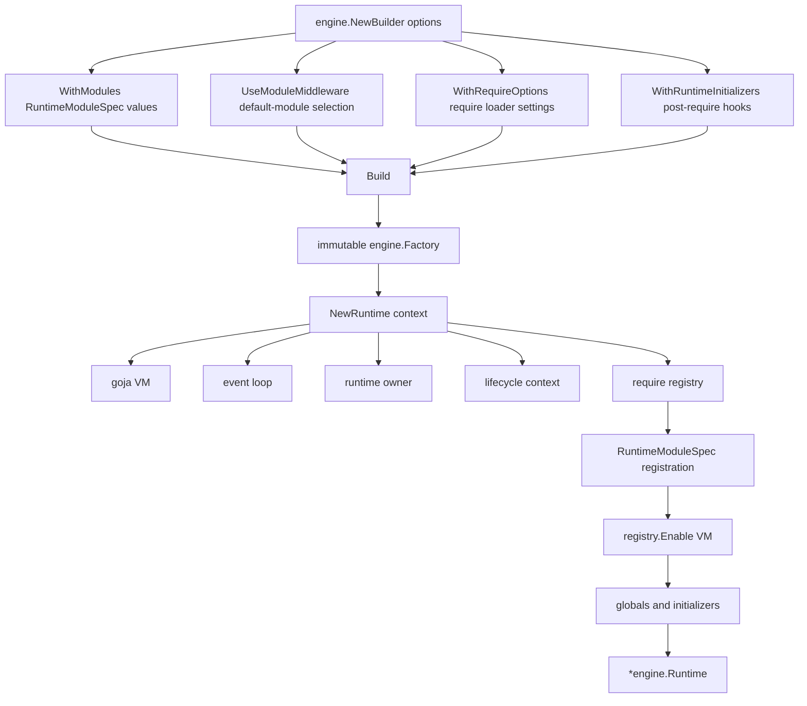

# go-go-goja Runtime System: Creation, Context, Scheduling, Bindings, and Modules

This note explains the runtime creation mechanism in `go-go-goja`: how a JavaScript VM is created, how the Node-style event loop is started, how `require()` modules are selected and registered, how Go code schedules work onto the runtime owner path, how contexts move from Go callers into native JavaScript module callbacks, and how the runtime is shut down safely.

The target reader is a Go developer who wants to build or maintain native modules, generated xgoja binaries, HTTP-backed JavaScript applications, plugin-backed runtimes, `jsverbs` commands, or REPL integrations on top of `go-go-goja`. The goal is to make the runtime system understandable as a coherent implementation rather than a set of separate packages.

> [!summary]
> - The runtime system is built around `engine.Factory`. A builder freezes module policy and initializer policy; each `Factory.NewRuntime(ctx)` creates a fresh owned `*goja.Runtime` with an event loop, owner scheduler, lifecycle context, require registry, bridge bindings, closers, and runtime values.
> - All module registration is runtime-aware through `engine.RuntimeModuleSpec`. A module receives the VM, event loop, owner, lifecycle context, closer registry, and value bag before `require` is enabled.
> - Goja VM access is serialized through `pkg/runtimeowner.Runner`. `Call` returns a value; `Post` schedules fire-and-forget work. Both carry the active Go context through `pkg/runtimebridge`.
> - Async modules such as `timer` and `fs` do blocking work in goroutines, but they settle JavaScript promises only by posting back through the runtime owner. This preserves VM ownership and cancellation behavior.
> - Module exposure is explicit. Normal engine callers can use default modules or middleware-selected modules. Generated xgoja runtimes disable implicit defaults so their `require()` surface is defined by the build spec.

## Why this note exists

The `go-go-goja` runtime system grew from a simple native-module registry into a larger execution substrate. It now supports default modules, restricted module sets, runtime-scoped modules, plugin modules, HTTP route handlers, `jsverbs`, REPL integrations, generated xgoja binaries, per-call context propagation, asynchronous promise settlement, and orderly shutdown.

Those features all depend on one central question: what exactly is a runtime in this repository?

A runtime is not only a `*goja.Runtime`. It is an owned execution environment around that VM. It contains the VM, a Node-style event loop, a scheduler that serializes VM work, a `require` module system, a lifecycle context, a map of runtime-scoped values, bridge bindings for native modules, and cleanup hooks. The distinction matters because most correctness problems in a Go-hosted JavaScript runtime are not syntax problems. They are ownership, context, lifecycle, and module-boundary problems.

This note describes those boundaries in enough detail that a reader can safely extend the system.

## Repository map

The main source files for the runtime system are:

```text
/home/manuel/workspaces/2026-05-22/xgoja/go-go-goja/
├── engine/
│   ├── factory.go              # builder, factory, runtime creation sequence
│   ├── runtime.go              # Runtime object, values, closers, shutdown
│   ├── runtime_modules.go      # RuntimeModuleSpec and RuntimeModuleContext
│   ├── module_specs.go         # built-in module specs and runtime initializers
│   ├── module_middleware.go    # module selection middleware
│   └── options.go              # builder options and default exposure controls
├── modules/
│   ├── common.go               # NativeModule and default registry
│   ├── fs/                     # sync + async filesystem module
│   ├── timer/                  # promise-based sleep module
│   ├── database/               # context-aware SQL module
│   ├── express/                # runtime-scoped HTTP route module
│   └── uidsl/                  # server-side HTML node DSL module
├── pkg/runtimeowner/
│   ├── types.go                # Scheduler, Runner, CallFunc, PostFunc
│   └── runner.go               # owner scheduling, reentrancy, panic recovery
├── pkg/runtimebridge/
│   └── runtimebridge.go        # per-VM bindings and current-call context stack
├── pkg/jsverbs/
│   └── runtime.go              # invoking JavaScript verbs inside engine runtimes
└── pkg/xgoja/app/
    └── factory.go              # generated xgoja runtime profile adaptation
```

The surrounding packages use the runtime system rather than redefining it. For example, `pkg/hashiplugin/host` contributes runtime-aware plugin modules, `pkg/docaccess/runtime` contributes documentation access modules, `cmd/goja-repl` composes REPL runtimes, and `pkg/xgoja/app` translates generated build specs into engine runtimes.

## The smallest useful definition of a runtime

At the code level, the owned runtime is defined in `engine/runtime.go`:

```go
type Runtime struct {
    VM      *goja.Runtime
    Require *require.RequireModule
    Loop    *eventloop.EventLoop
    Owner   runtimeowner.Runner
    Values  map[string]any

    runtimeCtx       context.Context
    runtimeCtxCancel context.CancelFunc

    closeOnce sync.Once
    closerMu  sync.Mutex
    closers   []func(context.Context) error
    closing   bool
}
```

Each field exists for a specific reason.

| Field | Purpose |
|---|---|
| `VM` | The actual JavaScript interpreter from `github.com/dop251/goja`. |
| `Require` | The enabled `goja_nodejs/require` module loader for CommonJS-style modules. |
| `Loop` | The `goja_nodejs/eventloop.EventLoop` used to schedule JavaScript work. |
| `Owner` | The `runtimeowner.Runner` that serializes VM access onto the owner path. |
| `Values` | Runtime-scoped data shared between module registration and runtime initializers. |
| `runtimeCtx` | The lifecycle context for work owned by this runtime. It is canceled on close. |
| `closers` | Cleanup hooks registered by modules during runtime creation. |

The key design point is that `Runtime` owns the VM and the lifecycle around it. Code that receives `*engine.Runtime` does not have to construct its own event loop, bridge bindings, context propagation, or cleanup mechanism. It receives an execution environment with those pieces already connected.

## The runtime creation pipeline

Runtime creation starts from `engine.NewBuilder`, not from `goja.New` directly. The builder records the policy that will be used for every runtime created by the resulting factory.

The high-level flow is:



The important separation is `Build` versus `NewRuntime`.

`Build` validates and freezes the plan. It checks that module specs and runtime initializers are not nil. It expands module middleware into concrete default-registry module specs. It validates that IDs are unique. It then returns an immutable `Factory`.

`NewRuntime` executes the plan. Every call creates a new VM, a new event loop, a new owner runner, a new lifecycle context, a new require registry, and a new runtime values map. Module specs run again for each runtime because many modules need per-runtime state.

### Builder policy

The builder type lives in `engine/factory.go`:

```go
type FactoryBuilder struct {
    settings builderSettings

    modules             []RuntimeModuleSpec
    moduleMiddlewares   []ModuleMiddleware
    runtimeInitializers []RuntimeInitializer
    built               bool
}
```

The public builder methods are:

```go
func (b *FactoryBuilder) WithRequireOptions(opts ...require.Option) *FactoryBuilder
func (b *FactoryBuilder) WithModules(mods ...RuntimeModuleSpec) *FactoryBuilder
func (b *FactoryBuilder) UseModuleMiddleware(mw ...ModuleMiddleware) *FactoryBuilder
func (b *FactoryBuilder) WithRuntimeInitializers(inits ...RuntimeInitializer) *FactoryBuilder
func (b *FactoryBuilder) Build() (*Factory, error)
```

`WithModules` is the main extension point. It accepts `RuntimeModuleSpec` values. There is no separate runtime-registrar API. If a value registers `require()` modules into a runtime, it implements `RuntimeModuleSpec`.

`UseModuleMiddleware` selects from the default module registry. It is useful for applications that want a controlled subset of built-in modules without writing explicit module specs by hand.

`WithRuntimeInitializers` is intentionally separate from module registration. Runtime module specs run before `require` is enabled. Runtime initializers run after `require` is enabled and can use `ctx.Require` to load modules or install globals.

### Builder options

The default builder settings live in `engine/options.go`:

```go
type builderSettings struct {
    requireOptions                  []require.Option
    implicitDefaultRegistryModules bool
    dataOnlyDefaultRegistryModules bool
}

func defaultBuilderSettings() builderSettings {
    return builderSettings{
        implicitDefaultRegistryModules: true,
        dataOnlyDefaultRegistryModules: true,
    }
}
```

The two boolean controls matter because different callers need different module exposure policies.

A normal engine caller may want historical default behavior: `engine.NewBuilder().Build()` exposes the default registry. A sandboxed caller may use `UseModuleMiddleware(engine.MiddlewareSafe())`. A generated xgoja binary must expose only modules selected by its build spec, so it disables both implicit defaults and data-only automatic modules.

The xgoja runtime factory does this explicitly:

```go
builder := engine.NewBuilder(
    engine.WithImplicitDefaultRegistryModules(false),
    engine.WithDataOnlyDefaultRegistryModules(false),
).WithModules(modules...)
```

That is a policy statement. xgoja is still using `engine.Runtime`, but it does not inherit broad engine defaults accidentally.

## The exact `NewRuntime` sequence

The core creation sequence is in `engine/factory.go`. In simplified form, it is:

```go
func (f *Factory) NewRuntime(ctx context.Context) (*Runtime, error) {
    if ctx == nil {
        ctx = context.Background()
    }

    vm := goja.New()
    loop := eventloop.NewEventLoop()
    go loop.Start()

    owner := runtimeowner.NewRunner(vm, loop, runtimeowner.Options{
        Name:          "go-go-goja-runtime",
        RecoverPanics: true,
    })

    runtimeCtx, runtimeCtxCancel := context.WithCancel(context.Background())
    runtimeValues := map[string]any{}

    rt := &Runtime{VM: vm, Loop: loop, Owner: owner, Values: runtimeValues, ...}

    runtimebridge.Store(vm, runtimebridge.Bindings{
        Context: runtimeCtx,
        Loop:    loop,
        Owner:   runtimebridgeOwner{owner: owner},
    })

    reg := require.NewRegistry(f.settings.requireOptions...)
    moduleCtx := &RuntimeModuleContext{Context: runtimeCtx, VM: vm, Loop: loop, Owner: owner, AddCloser: rt.AddCloser, Values: runtimeValues}

    if f.settings.dataOnlyDefaultRegistryModules {
        DataOnlyDefaultRegistryModules().RegisterRuntimeModule(moduleCtx, reg)
    }
    for _, mod := range f.modules {
        mod.RegisterRuntimeModule(moduleCtx, reg)
    }

    reqMod := reg.Enable(vm)
    console.Enable(vm)
    buffer.Enable(vm)
    url.Enable(vm)
    installPerformanceGlobals(vm)
    installConsoleTimers(vm)
    rt.Require = reqMod

    initCtx := &RuntimeContext{Context: runtimeCtx, VM: vm, Require: reqMod, Loop: loop, Owner: owner, Values: rt.Values}
    for _, init := range f.runtimeInitializers {
        init.InitRuntime(initCtx)
    }

    return rt, nil
}
```

This order is not arbitrary.

1. The VM and event loop must exist before the owner can be constructed.
2. The owner must exist before bridge bindings are stored, because async modules need `Owner.Post` to settle promises.
3. The require registry must be populated before `reg.Enable(vm)`.
4. Runtime module specs must run before `require` is enabled because they register native module loaders.
5. Runtime initializers run after `require` is enabled because they may import modules or set globals derived from modules.
6. If any setup step fails, `rt.Close(ctx)` runs to clean up partial state.

The result is a runtime that is ready for owner-scheduled JavaScript execution.

## Runtime context and call context

`go-go-goja` distinguishes between two related contexts.

The first is the **runtime lifecycle context**. It is created once for the runtime:

```go
runtimeCtx, runtimeCtxCancel := context.WithCancel(context.Background())
```

It is stored in the runtime bridge and canceled when the runtime closes. Modules use it to stop background work when the runtime is no longer alive.

The second is the **current call context**. It is active only while a scheduled owner call is executing. `runtimeowner.Runner` installs it through `runtimebridge.WithCallContext` before it invokes the user-provided function.

```go
func (r *runner) invoke(ctx context.Context, op string, fn CallFunc) (any, error) {
    return runtimebridge.WithCallContext(r.vm, ctx, func() (any, error) {
        return fn(ctx, r.vm)
    })
}
```

Native modules can retrieve the active context with:

```go
runtimebridge.CurrentContext(vm)
```

`CurrentContext` checks the per-VM call context stack first. If no owner call is active, it falls back to the runtime lifecycle context. If there are no bindings, it returns `context.Background()`.

This design lets native modules inherit request cancellation, deadlines, and tracing information without exposing Go `context.Context` values to JavaScript code.

## Runtime bridge bindings

The bridge package stores runtime-owned scheduling primitives by VM pointer:

```go
type Bindings struct {
    Context context.Context
    Loop    *eventloop.EventLoop
    Owner   OwnerRunner
}
```

The engine stores bindings during runtime creation:

```go
runtimebridge.Store(vm, runtimebridge.Bindings{
    Context: runtimeCtx,
    Loop:    loop,
    Owner:   runtimebridgeOwner{owner: owner},
})
```

Modules retrieve them with:

```go
bindings, ok := runtimebridge.Lookup(vm)
```

Bridge bindings solve a practical problem: a goja native module loader receives only `*goja.Runtime` and the CommonJS module object. It does not receive `*engine.Runtime`. Without a bridge, a module such as `timer` or `fs` would not know how to post promise resolution back onto the runtime owner. The bridge keeps the native module API compatible with `goja_nodejs/require` while still exposing the owner, loop, and lifecycle context.

The bridge is deleted during runtime shutdown:

```go
runtimebridge.Delete(r.VM)
```

That removes both bindings and the call context stack for that VM.

## Owner scheduling

Goja runtimes must be treated as owner-thread objects. Native modules and application code should not mutate or inspect the VM from arbitrary goroutines. The `runtimeowner.Runner` enforces a scheduling discipline around this rule.

The interface is small:

```go
type Runner interface {
    Call(ctx context.Context, op string, fn CallFunc) (any, error)
    Post(ctx context.Context, op string, fn PostFunc) error
    Shutdown(ctx context.Context) error
    IsClosed() bool
}
```

`Call` is for request/response work. It schedules the function on the owner path and waits for a result. `Post` is for fire-and-forget work. It schedules the function and returns after the schedule operation is accepted.

A typical eval path looks like this:

```go
ret, err := rt.Owner.Call(ctx, "eval", func(ctx context.Context, vm *goja.Runtime) (any, error) {
    value, err := vm.RunString(source)
    if err != nil {
        return nil, err
    }
    return value.Export(), nil
})
```

A typical asynchronous promise settlement looks like this:

```go
_ = bindings.Owner.Post(callCtx, "timer.sleep.resolve", func(context.Context, *goja.Runtime) {
    _ = resolve(goja.Undefined())
})
```

The runner also handles reentrant calls. If code is already executing on the owner path and calls `Owner.Call` again with the owner context, the runner invokes the function directly instead of scheduling another event. This prevents unnecessary scheduling and avoids deadlock patterns in nested owner-owned operations.

## The event loop as scheduler

The runtime owner accepts a `runtimeowner.Scheduler`:

```go
type Scheduler interface {
    RunOnLoop(fn func(*goja.Runtime)) bool
}
```

The engine passes the `goja_nodejs/eventloop.EventLoop` directly as the scheduler. `RunOnLoop` accepts a function that will be executed with the runtime's VM. If scheduling is rejected, `Owner.Call` returns `ErrScheduleRejected` and `Owner.Post` returns an error.

The event loop matters for promise-based modules because promise settlement must happen in the VM's execution environment. Background goroutines may read files, wait on timers, query a database, or receive network responses, but they must not directly call `resolve`, `reject`, or mutate JS objects from those goroutines. They post the settlement back through the owner.

## Runtime modules

The unified module contract is `engine.RuntimeModuleSpec`:

```go
type RuntimeModuleSpec interface {
    ID() string
    RegisterRuntimeModule(ctx *RuntimeModuleContext, reg *require.Registry) error
}
```

The context passed to module specs contains everything a module can safely know before `require` is enabled:

```go
type RuntimeModuleContext struct {
    Context   context.Context
    VM        *goja.Runtime
    Loop      *eventloop.EventLoop
    Owner     runtimeowner.Runner
    AddCloser func(func(context.Context) error) error
    Values    map[string]any
}
```

This is the key to the current engine architecture. Static modules and runtime-scoped modules are not separate categories anymore. A default module, an HTTP module, a plugin module, a generated xgoja provider module, and a documentation access module all register through the same interface.

### Native module specs

The simplest module spec registers a single `goja_nodejs` native module loader:

```go
type NativeModuleSpec struct {
    ModuleID   string
    ModuleName string
    Loader     require.ModuleLoader
}

func (s NativeModuleSpec) RegisterRuntimeModule(_ *RuntimeModuleContext, reg *require.Registry) error {
    reg.RegisterNativeModule(s.ModuleName, s.Loader)
    return nil
}
```

Use this when a module already has a `require.ModuleLoader` and does not need runtime context beyond the VM passed by the loader itself.

### Runtime-scoped module specs

Runtime-scoped modules use `RuntimeModuleContext` directly. For example, the xgoja runtime factory adapts generated provider modules like this:

```go
type providerRuntimeModuleSpec struct {
    instance ModuleInstance
    module   providerapi.Module
}

func (s providerRuntimeModuleSpec) RegisterRuntimeModule(ctx *engine.RuntimeModuleContext, reg *require.Registry) error {
    config, err := json.Marshal(s.instance.Config)
    if err != nil {
        return err
    }
    loader, err := s.module.New(providerapi.ModuleContext{
        Context: ctx.Context,
        Name:    s.instance.Name,
        As:      s.instance.Alias(),
        Config:  config,
    })
    if err != nil {
        return err
    }
    reg.RegisterNativeModule(s.instance.Alias(), loader)
    return nil
}
```

This is why the runtime-aware module API matters. Generated xgoja modules receive the runtime lifecycle context and can use engine-owned scheduling behavior without xgoja constructing a parallel runtime substrate.

### Runtime initializers

A runtime initializer runs after `require` is enabled:

```go
type RuntimeInitializer interface {
    ID() string
    InitRuntime(ctx *RuntimeContext) error
}
```

The initializer context includes `Require`:

```go
type RuntimeContext struct {
    Context context.Context
    VM      *goja.Runtime
    Require *require.RequireModule
    Loop    *eventloop.EventLoop
    Owner   runtimeowner.Runner
    Values  map[string]any
}
```

This makes initializers the correct place to install globals that depend on `require()`. `ProcessEnv` is the canonical example. It can install a global `process` object, optionally derived from `require("process")` when that module is present.

## The default module registry

The `modules` package defines the basic native module interface:

```go
type NativeModule interface {
    Name() string
    Doc() string
    Loader(*goja.Runtime, *goja.Object)
}
```

Modules register themselves in the global default registry from their package `init()` functions:

```go
func init() {
    modules.Register(&m{name: "fs"})
    modules.Register(&m{name: "node:fs"})
}
```

The engine package uses blank imports in `engine/runtime.go` so those `init()` functions run:

```go
_ "github.com/go-go-golems/go-go-goja/modules/fs"
_ "github.com/go-go-golems/go-go-goja/modules/timer"
```

The actual repository imports `crypto`, `database`, `events`, `exec`, `fs`, `os`, `path`, `time`, `timer`, and `yaml`. A plain `engine.NewBuilder().Build()` preserves the historical behavior of exposing the default registry, unless implicit default selection is disabled.

The engine can expose modules in several ways:

```go
engine.NewBuilder().Build()                                      // default registry, plus data-only automatic modules
engine.NewBuilder().UseModuleMiddleware(engine.MiddlewareSafe())  // safe data-only selection
engine.NewBuilder().UseModuleMiddleware(engine.MiddlewareOnly("fs", "path"))
engine.NewBuilder().WithModules(engine.ProcessModule())
engine.NewBuilder().WithModules(customSpec)
```

The data-only automatic module set currently includes:

```text
crypto, node:crypto, events, node:events, path, node:path, time, timer
```

This set is installed for every normal engine runtime by default. It intentionally excludes host filesystem and process environment access.

## Module middleware

Module middleware is selection logic over the default registry. It is not JavaScript middleware. It is a Go-side pipeline that chooses which registered native modules become available in the runtime.

The standard middlewares are:

| Middleware | Meaning |
|---|---|
| `MiddlewareSafe()` | Replace the selection with data-only modules. |
| `MiddlewareOnly(names...)` | Replace the selection with exactly the named modules and their aliases. |
| `MiddlewareExclude(names...)` | Call the next selector, then remove named modules. |
| `MiddlewareAdd(names...)` | Call the next selector, then add named modules if available. |
| `MiddlewareCustom(fn)` | Call the next selector, then apply arbitrary transformation logic. |

The pipeline composes left-to-right, with the first middleware wrapping the rest. Override middlewares such as `Safe` and `Only` do not call `next`; transform middlewares such as `Exclude`, `Add`, and `Custom` do call `next`.

The result is converted into `DefaultRegistryModule(name)` specs during `Build`, then validated like any other module spec.

## Async modules: the promise settlement pattern

The runtime bridge and owner runner are easiest to understand by reading an async module. The `timer` module exports `sleep(ms)`, which returns a JavaScript promise.

Its loader creates a promise and reads the runtime bindings:

```go
promise, resolve, reject := vm.NewPromise()

bindings, ok := runtimebridge.Lookup(vm)
if !ok || bindings.Owner == nil {
    panic(vm.NewGoError(fmt.Errorf("timer module requires runtime owner bindings")))
}

callCtx := runtimebridge.CurrentContext(vm)
runtimeCtx := bindings.Context
```

Then it starts background work:

```go
go func() {
    timer := time.NewTimer(time.Duration(ms) * time.Millisecond)
    defer timer.Stop()

    select {
    case <-callCtx.Done():
        return
    case <-runtimeCtx.Done():
        return
    case <-timer.C:
        _ = bindings.Owner.Post(callCtx, "timer.sleep.resolve", func(context.Context, *goja.Runtime) {
            _ = resolve(goja.Undefined())
        })
    }
}()
```

There are three important details here.

First, the goroutine does not touch the VM directly. It waits using Go primitives, then posts a function back to the owner path.

Second, it listens to both the call context and the runtime context. If the specific request is canceled, the promise is not settled. If the runtime is closed, the goroutine stops.

Third, `resolve` is called inside `Owner.Post`, not inside the goroutine. That is the point where asynchronous Go work returns to JavaScript safely.

The filesystem module follows the same pattern for async operations such as `readFile`, `writeFile`, `mkdir`, `stat`, and `rm`. It performs file IO in a goroutine and resolves or rejects the promise through `bindings.Owner.Post`.

## Context-aware native modules

Some modules do not need to return promises, but they still need the active Go context. The database module is an example:

```go
return m.QueryContext(runtimebridge.CurrentContext(vm), query, args...)
return m.ExecContext(runtimebridge.CurrentContext(vm), query, args...)
```

This means a JavaScript call made inside an HTTP request or CLI command can inherit the caller's cancellation and deadline. The JavaScript author does not pass a context object. The Go module reads the current call context from the runtime bridge.

This is especially important for hosted runtimes. A server-side JavaScript route handler should stop database work if the request is canceled. A CLI command should stop work if its command context is canceled. The bridge makes that behavior available to modules that opt into it.

## Close and cleanup

Runtime shutdown is handled by `Runtime.Close(ctx)` in `engine/runtime.go`.

The sequence is:

```go
r.closeOnce.Do(func() {
    r.closing = true
    closers := copyAndClear(r.closers)

    r.runtimeCtxCancel()
    runtimebridge.Delete(r.VM)

    for i := len(closers) - 1; i >= 0; i-- {
        retErr = errors.Join(retErr, closers[i](ctx))
    }

    r.Owner.Shutdown(ctx)
    r.Loop.Stop()
})
```

The close path has several correctness properties.

- It is idempotent because it uses `sync.Once`.
- It marks the runtime as closing before running closers, so new closers cannot be registered during shutdown.
- It cancels the runtime context before running closers, giving background work a signal to stop.
- It deletes runtime bridge bindings, avoiding per-VM state leaks.
- It runs closers in reverse registration order, matching resource nesting.
- It shuts down the owner before stopping the event loop.
- It joins closer and shutdown errors rather than dropping later failures.

Module authors should register cleanup with `ctx.AddCloser` during `RegisterRuntimeModule`. Plugin hosts, subprocess-backed modules, servers, watchers, and database handles should all use this mechanism.

## Runtime values

Both `RuntimeModuleContext` and `RuntimeContext` expose a `Values` map plus helper methods:

```go
func (ctx *RuntimeModuleContext) SetValue(key string, value any)
func (ctx *RuntimeModuleContext) Value(key string) (any, bool)
func (ctx *RuntimeContext) SetValue(key string, value any)
func (ctx *RuntimeContext) Value(key string) (any, bool)
```

Values are useful when a module registration phase needs to communicate with a later initializer. They are also useful for tests that prove runtime-scoped state is created per runtime rather than shared across runtimes.

Values should not become a hidden global configuration system. Prefer explicit module configuration when possible. Use values for runtime-local objects whose lifecycle is tied to the runtime and whose creation order spans module registration and initialization.

## How `jsverbs` uses the runtime

The `jsverbs` package can create its own runtime or invoke a verb inside a caller-owned runtime.

The default path builds an engine runtime with the scanned source overlay loader:

```go
builder := engine.NewBuilder().WithRequireOptions(require.WithLoader(r.sourceLoader))
if r.ModuleMiddleware != nil {
    builder = builder.UseModuleMiddleware(r.ModuleMiddleware)
}
factory, err := builder.Build()
runtime, err := factory.NewRuntime(ctx)
defer runtime.Close(context.Background())
return r.InvokeInRuntime(ctx, runtime, verb, parsedValues)
```

`InvokeInRuntime` uses the runtime owner:

```go
ret, err := runtime.Owner.Call(ctx, "jsverbs.invoke", func(_ context.Context, vm *goja.Runtime) (interface{}, error) {
    runtime.Require.Require(verb.File.ModulePath)
    fn := lookupCapturedVerbFunction(vm, verb)
    result, err := fn(goja.Undefined(), jsArgs...)
    if promise, ok := result.Export().(*goja.Promise); ok {
        return promise, nil
    }
    return result.Export(), nil
})
```

If the verb returns a promise, `jsverbs` waits for that promise through the runtime owner. That matters because a verb can call async modules such as `timer.sleep()` or `fs.readFile()`. The promise must be observed and settled through the same owner discipline as the modules themselves.

The source overlay mechanism injects a small prelude and suffix into scanned JavaScript files. The prelude defines metadata functions such as `__package__`, `__section__`, and `__verb__`. The suffix captures exported verb functions into `globalThis.__glazedVerbRegistry`. Invocation then loads the source module, retrieves the captured function, builds arguments from Glazed values, and calls the function inside the VM.

## How xgoja uses the runtime

xgoja generates binaries whose available Go modules are selected by a build spec. After the runtime module API was unified, xgoja can use `engine.Runtime` directly.

The generated app runtime factory does three things:

1. It reads the selected runtime profile from the embedded spec.
2. It resolves each selected provider module from the provider registry.
3. It wraps each selected provider module as an `engine.RuntimeModuleSpec`.

Then it builds an engine factory with implicit defaults disabled:

```go
builder := engine.NewBuilder(
    engine.WithImplicitDefaultRegistryModules(false),
    engine.WithDataOnlyDefaultRegistryModules(false),
).WithModules(modules...)
```

This preserves the xgoja rule: the generated binary may contain many provider packages, but a runtime profile exposes only the modules selected by that profile.

The generated application can then evaluate JavaScript or invoke jsverbs through the normal engine path:

```go
rt, err := factory.NewRuntime(ctx, profile, require.WithLoader(registry.RequireLoader()))
defer rt.Close(context.Background())
return registry.InvokeInRuntime(ctx, rt, verb, parsedValues)
```

This removes the need for xgoja to maintain a parallel runtime implementation. It also means provider modules, promise-returning jsverbs, runtimebridge context, and owner scheduling share the same semantics as normal engine runtimes.

See also: [[ARTICLE - xgoja - Compile-Time Goja Module Composition and jsverbs Mounting|xgoja: Compile-Time Goja Module Composition and jsverbs Mounting]].

## Common usage patterns

### Default engine runtime

Use this when you want the historical default module set and do not need sandboxing:

```go
factory, err := engine.NewBuilder().Build()
if err != nil {
    return err
}
rt, err := factory.NewRuntime(ctx)
if err != nil {
    return err
}
defer rt.Close(context.Background())
```

### Safe data-only runtime

Use this when scripts need safe primitives but should not get host filesystem, process, OS, or exec access:

```go
factory, err := engine.NewBuilder().
    UseModuleMiddleware(engine.MiddlewareSafe()).
    Build()
```

### Runtime with specific default modules

Use this when the host application wants a small explicit module surface:

```go
factory, err := engine.NewBuilder().
    UseModuleMiddleware(engine.MiddlewareOnly("fs", "path", "timer")).
    Build()
```

### Runtime with explicit module specs only

Use this when the module surface must come only from your own policy:

```go
factory, err := engine.NewBuilder(
    engine.WithImplicitDefaultRegistryModules(false),
    engine.WithDataOnlyDefaultRegistryModules(false),
).
    WithModules(myModuleSpec).
    Build()
```

### Runtime-scoped HTTP modules

Express-style HTTP route handling is runtime-scoped because it needs a configured host and runtime owner:

```go
host := gojahttp.NewHost(gojahttp.HostOptions{
    Renderer: uidsl.RenderAny,
})

factory, err := engine.NewBuilder().
    WithModules(express.NewRegistrar(host), uidsl.NewRegistrar()).
    Build()
```

### Evaluating JavaScript safely through the owner

Do not call `rt.VM.RunString` from arbitrary goroutines. Use the owner:

```go
ret, err := rt.Owner.Call(ctx, "eval", func(ctx context.Context, vm *goja.Runtime) (any, error) {
    v, err := vm.RunString(source)
    if err != nil {
        return nil, err
    }
    return v.Export(), nil
})
```

### Writing a runtime-aware module spec

A module that needs runtime context should implement `RuntimeModuleSpec` directly:

```go
type MySpec struct {
    service *Service
}

func (s MySpec) ID() string { return "my-service" }

func (s MySpec) RegisterRuntimeModule(ctx *engine.RuntimeModuleContext, reg *require.Registry) error {
    client := s.service.NewClient(ctx.Context)
    if err := ctx.AddCloser(func(context.Context) error { return client.Close() }); err != nil {
        return err
    }

    reg.RegisterNativeModule("my-service", func(vm *goja.Runtime, moduleObj *goja.Object) {
        exports := moduleObj.Get("exports").(*goja.Object)
        _ = exports.Set("query", func(input string) (any, error) {
            return client.Query(runtimebridge.CurrentContext(vm), input)
        })
    })
    return nil
}
```

The module registers the loader before `require` is enabled. The actual exported function reads `runtimebridge.CurrentContext(vm)` at call time so each invocation receives the correct caller context.

## Failure modes and how to avoid them

### Failure mode: touching the VM from a background goroutine

A background goroutine must not call `vm.ToValue`, `resolve`, `reject`, `Object.Set`, or `RunString` directly. Those operations belong on the runtime owner path.

Use:

```go
_ = bindings.Owner.Post(callCtx, "module.operation.resolve", func(context.Context, *goja.Runtime) {
    _ = resolve(vm.ToValue(value))
})
```

### Failure mode: forgetting to close the runtime

A runtime owns an event loop, bridge bindings, context, module resources, and possibly plugin subprocesses. Always call `Close` when the runtime is no longer needed:

```go
defer rt.Close(context.Background())
```

For long-lived servers, connect runtime close to server shutdown.

### Failure mode: accidental module exposure

A plain engine builder exposes default modules. That is convenient for general-purpose scripting but wrong for generated or sandboxed systems that have their own module policy.

Use explicit options when policy must be exact:

```go
engine.NewBuilder(
    engine.WithImplicitDefaultRegistryModules(false),
    engine.WithDataOnlyDefaultRegistryModules(false),
)
```

### Failure mode: registering modules after `require` is enabled

Native modules must be registered into the `require.Registry` before `reg.Enable(vm)`. That is why `RuntimeModuleSpec` runs before runtime initializers. If code needs `ctx.Require`, it is not module registration anymore; it belongs in a `RuntimeInitializer`.

### Failure mode: losing request cancellation

If a native function starts work but uses `context.Background()`, it cannot observe request cancellation. Use `runtimebridge.CurrentContext(vm)` for per-call context and `bindings.Context` for runtime lifecycle cancellation.

### Failure mode: duplicate module IDs

The builder validates unique IDs for module specs and runtime initializers. A module spec ID should identify the registration instance, not only the Go type. xgoja includes package, module name, and alias in its generated module spec ID so the same provider module can be mounted under distinct aliases.

### Failure mode: leaking bridge state

Bridge state is keyed by VM pointer. Runtime shutdown calls `runtimebridge.Delete(vm)`. Bypassing `engine.Runtime` and constructing a VM manually means the caller becomes responsible for bridge cleanup and owner setup. Prefer `engine.Runtime` unless there is a strong reason not to use it.

## How to extend the runtime system

When adding a new module or host integration, start by deciding what kind of extension it is.

| Extension need | Correct mechanism |
|---|---|
| Add a simple `require()` module with no setup | `engine.NativeModuleSpec` or `modules.NativeModule` in the default registry. |
| Add a module with per-runtime state or cleanup | Implement `engine.RuntimeModuleSpec`. |
| Add globals after `require` exists | Implement `engine.RuntimeInitializer`. |
| Select built-in modules by policy | Use module middleware. |
| Run JavaScript from Go | Use `rt.Owner.Call`. |
| Settle a promise from a goroutine | Use `runtimebridge.Lookup(vm)` and `bindings.Owner.Post`. |
| Read request cancellation inside a native function | Use `runtimebridge.CurrentContext(vm)`. |
| Compose generated provider modules | Adapt them into `engine.RuntimeModuleSpec`, as xgoja does. |

A good implementation sequence for a new runtime-scoped module is:

1. Define the module's JavaScript API.
2. Decide which state is per runtime and which state is shared by the host application.
3. Implement `RuntimeModuleSpec.ID()` with a stable, unique registration ID.
4. Implement `RegisterRuntimeModule(ctx, reg)`.
5. Register cleanup with `ctx.AddCloser` for every runtime-owned resource.
6. In exported native functions, use `runtimebridge.CurrentContext(vm)` for caller context.
7. For background work, copy plain Go values out of JavaScript, run the work in a goroutine, and settle results through `bindings.Owner.Post`.
8. Add tests that create two runtimes from the same factory to prove state is per runtime.
9. Add a close test that proves cleanup runs exactly once.

## A concrete end-to-end example

The following pseudocode shows the full path from host code to JavaScript execution:

```go
// Host composition phase.
factory, err := engine.NewBuilder().
    UseModuleMiddleware(engine.MiddlewareOnly("timer", "path")).
    WithModules(myRuntimeScopedModule).
    WithRuntimeInitializers(myInitializer).
    Build()

// Runtime creation phase.
rt, err := factory.NewRuntime(commandCtx)
defer rt.Close(context.Background())

// Owner execution phase.
result, err := rt.Owner.Call(commandCtx, "run-script", func(ctx context.Context, vm *goja.Runtime) (any, error) {
    v, err := vm.RunString(`
        const timer = require("timer");
        timer.sleep(10).then(() => "done");
    `)
    if err != nil {
        return nil, err
    }
    return v.Export(), nil
})
```

Internally, the runtime creation phase performed these steps:

```text
create VM
create event loop and start it
create owner runner
create runtime lifecycle context
store runtimebridge bindings for the VM
create require registry
register data-only defaults if enabled
register selected module specs
enable require on VM
enable console, buffer, url, performance, console timers
run initializers
return *engine.Runtime
```

If the script calls an async module, the path continues:

```text
JavaScript calls native module function
native function reads runtimebridge.CurrentContext(vm)
native function creates Promise
native function starts goroutine for blocking work
goroutine observes call context and runtime context
goroutine posts resolve/reject through bindings.Owner.Post
owner executes resolve/reject on VM path
promise settles in JavaScript
```

This is the complete runtime model in operational form.

## Testing strategy

The repository already has focused tests for the critical runtime behaviors.

`engine/runtime_modules_test.go` covers runtime module registration, per-runtime state, runtime values, closer order, initializer values, and disabling implicit default modules.

`pkg/runtimeowner/runner_test.go` covers owner calls, posts, reentrant owner contexts, cancellation, panic recovery, and current-context propagation.

`pkg/runtimebridge/runtimebridge_test.go` covers lifecycle-context fallback, nested call-context stacks, restoration after nested calls, and panic cleanup.

Module tests exercise selected runtime behavior:

- `modules/timer/timer_test.go` proves promise-based timer behavior.
- `modules/fs/fs_test.go` proves sync and async filesystem behavior.
- `modules/database/database_test.go` proves configured database module behavior.
- `modules/express/express_integration_test.go` proves runtime-scoped HTTP route registration.
- `pkg/jsverbs/runtime_direct_test.go` and related jsverbs tests prove owner-aware verb invocation.
- `pkg/xgoja/app/root_test.go` proves generated xgoja runtimes use provider modules and avoid implicit engine defaults.

The useful test pattern is to create a factory once and create multiple runtimes from it. A factory is a frozen plan; a runtime is a live instance. Bugs often appear when state accidentally belongs to the factory but should belong to each runtime.

## Current design rules

The runtime system is easiest to maintain if contributors follow these rules.

- Create runtimes through `engine.Factory.NewRuntime` unless a package has a very specific reason to own all lifecycle pieces itself.
- Treat `*goja.Runtime` as owner-owned. Use `rt.Owner.Call` and `rt.Owner.Post` for externally initiated work.
- Register `require()` modules before `reg.Enable(vm)`. Use `RuntimeInitializer` for post-require work.
- Use `RuntimeModuleSpec` for every module registration path. Do not introduce a second registrar abstraction.
- Use `runtimebridge.CurrentContext(vm)` inside native functions that call cancellable Go APIs.
- Use `ctx.AddCloser` for runtime-owned resources.
- Be explicit about module exposure. Default modules are a convenience for normal engine callers, not a sandbox policy.
- Do not settle JavaScript promises from background goroutines. Post settlement back to the owner.
- Delete bridge state during runtime shutdown. The engine does this automatically.
- Test runtime isolation by creating more than one runtime from the same factory.

## Open engineering questions

The current runtime system is coherent, but there are still areas where future work may refine the design.

### Should data-only automatic modules remain enabled by default?

The default is useful for general scripting, but security-sensitive hosts should opt out. xgoja now does. Other generated or sandboxed callers should make the same decision explicitly.

### Should module middleware replace more deprecated constructors?

`DefaultRegistryModules`, `DefaultRegistryModule`, and `DefaultRegistryModulesNamed` still exist as runtime-aware specs, but their comments point callers toward middleware. Future public documentation should prefer middleware examples unless a single spec value is specifically needed.

### Should owner scheduling expose richer diagnostics?

The owner runner includes operation names such as `timer.sleep.resolve` and `jsverbs.invoke`. Those names are already useful in errors. A future tracing layer could emit runtime scheduling events with operation names, durations, cancellation causes, and panic recovery information.

### Should runtime values become typed?

The current `map[string]any` is flexible and simple. If more modules use it for cross-phase communication, typed keys or small accessor helpers may reduce accidental key collisions.

## Closing summary

The `go-go-goja` runtime system is a small execution platform around goja. Its core responsibilities are stable: create a VM, start an event loop, serialize access through an owner, register modules before `require` is enabled, propagate contexts into native module calls, expose bridge bindings to modules that need asynchronous settlement, run initializers after `require`, and shut everything down in a predictable order.

The important shift in the current design is that module registration is now uniformly runtime-aware. This makes plugin modules, HTTP modules, documentation modules, generated xgoja provider modules, and normal native modules fit the same lifecycle. The implementation is easier to reason about because every module registration path receives the same runtime context and is subject to the same build-time validation and runtime creation order.

A future contributor who understands this lifecycle can add new modules without violating VM ownership, losing cancellation, leaking resources, or accidentally expanding the JavaScript module surface. That is the practical value of the runtime system: it makes embedded JavaScript powerful while keeping the Go host responsible for policy, lifecycle, and correctness.
