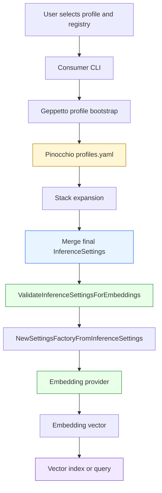

# Geppetto Embedding Profiles - Profile-Backed Vector Search

This project adds a profile-backed embedding path to Geppetto and Pinocchio. The central result is that a consumer application can request embeddings by selecting an engine profile, while provider credentials and base URLs remain in the shared profile registry. The implementation makes embeddings behave like the rest of Geppetto's provider configuration: applications select profiles; Geppetto resolves final settings; provider factories consume those settings.

> [!summary]
> The project establishes three working rules:
> 1. Embedding credentials come from Geppetto/Pinocchio profiles, not from consumer application key flags.
> 2. Chat profiles and embedding profiles are different profile shapes, even when they share the same provider base profile.
> 3. Vector indexes must record and check embedding provider, model, and dimensions before search.

## Why this project exists

The immediate failure was a vector-search command that selected the Pinocchio profile `gpt-5-low` and then failed during OpenAI embedding provider creation. The command had the right registry source, but it selected the wrong kind of profile. `gpt-5-low` is a chat profile: it stacks `openai-responses-base`, inherits the OpenAI key, and configures chat settings such as `chat.engine: gpt-5`. It does not define `inference_settings.embeddings`, so it does not say which embedding provider, model, or dimensions should be used.

The correct fix was not to add provider-key flags to Readwise Viewer or any other consumer. That would create a second credential path and make every application responsible for provider-specific configuration. The correct fix was to define embedding profiles in the same registry model that already stores chat provider configuration. An embedding profile stacks a base credential profile, then adds the embedding-specific fields that the embedding factory needs.

The project therefore answers one architectural question: how should applications ask for embeddings without owning provider credentials? The answer is now concrete. Applications load profile registries, resolve the selected profile stack, validate that the final `InferenceSettings` are embedding-capable, and call `embeddings.NewSettingsFactoryFromInferenceSettings`.

## Current project status

The Geppetto side is implemented and smoke-tested. The Pinocchio runtime registry has permanent embedding profiles. The remaining work is downstream integration in consumers such as Readwise Viewer.

Completed in Geppetto:

- `ValidateInferenceSettingsForEmbeddings` validates final merged inference settings before provider construction.
- Engine profile stack tests prove OpenAI embedding profiles inherit keys and Ollama embedding profiles inherit base URLs.
- The embeddings documentation explains profile-backed usage and the chat-profile versus embedding-profile failure mode.
- Example embedding profile fixtures exist under `examples/js/geppetto/profiles/40-embeddings.yaml`.
- A small smoke CLI exists at `cmd/examples/embedding-profile-smoke`.
- Active examples and docs were cleaned up so they do not teach direct OpenAI environment-key handling.

Completed in the Pinocchio runtime registry:

- `openai-embedding-small`
- `openai-embedding-large`
- `ollama-nomic-embedding`
- `ollama-all-minilm-embedding`

Verified smoke tests:

```bash
cd /home/manuel/workspaces/2026-05-23/add-embeddings-profiles/geppetto

go run ./cmd/examples/embedding-profile-smoke \
  --profile openai-embedding-small \
  --text "permanent profile smoke" \
  --json
```

The OpenAI profile produced a 1536-dimensional vector with `text-embedding-3-small` and confirmed that the OpenAI key was configured through the profile stack.

```bash
go run ./cmd/examples/embedding-profile-smoke \
  --profile ollama-nomic-embedding \
  --text "permanent ollama profile smoke" \
  --json
```

The Ollama profile produced a 768-dimensional vector with `nomic-embed-text` and confirmed that the local base URL was configured.

## Project shape

The project has four layers. Each layer has one responsibility, and the boundaries matter.

| Layer | Responsibility | Important files or locations |
|---|---|---|
| Runtime profile registry | Stores base credential profiles, chat profiles, and embedding profiles. | `~/.config/pinocchio/profiles.yaml` |
| Geppetto profile resolution | Loads registries, expands stacks, and merges final `InferenceSettings`. | `pkg/engineprofiles/*`, `pkg/cli/bootstrap/*` |
| Geppetto embeddings package | Validates embedding settings and constructs OpenAI or Ollama providers. | `pkg/embeddings/settings_validation.go`, `pkg/embeddings/settings_factory.go` |
| Consumer applications | Select profiles, run preflight checks, generate embeddings, and manage indexes. | downstream apps such as Readwise Viewer |

The important point is that provider credentials do not cross the boundary into consumer-specific flags. A consumer may expose `--profile` and `--profile-registries`. It should not expose `--openai-api-key` merely because it needs embeddings.

## Architecture



The profile registry is the source of provider facts. The selected profile may be an embedding profile itself, or it may be a base profile combined with an embedding overlay during a smoke test. In the durable operational path, the selected profile should already contain `inference_settings.embeddings`.

The final settings must contain two pieces of information:

```yaml
inference_settings:
  api:
    api_keys:
      openai-api-key: <configured in the profile registry>
    base_urls:
      ollama-base-url: http://localhost:11434
  embeddings:
    type: openai
    engine: text-embedding-3-small
    dimensions: 1536
```

Only some fields are needed for a given provider. OpenAI requires a key. Ollama requires a model and dimensions, and it uses a default or explicit base URL. The code validates the provider-specific requirements after profile stack resolution because the raw embedding profile may inherit credentials from a base profile.

## The core implementation path

The consumer integration path is short because Geppetto owns the provider resolution work.

```go
resolved, err := profilebootstrap.ResolveCLIEngineSettings(ctx, parsedValues)
if err != nil {
    return err
}
defer resolved.Close()

if err := embeddings.ValidateInferenceSettingsForEmbeddings(resolved.FinalInferenceSettings); err != nil {
    return err
}

factory := embeddings.NewSettingsFactoryFromInferenceSettings(resolved.FinalInferenceSettings)
provider, err := factory.NewProvider()
if err != nil {
    return err
}

vector, err := provider.GenerateEmbedding(ctx, text)
if err != nil {
    return err
}
```

This sequence encodes the project boundary. The application does not read provider keys. The application does not decide how OpenAI or Ollama settings are represented. The application selects a profile, validates that the resolved profile is usable for embeddings, and then uses the provider returned by Geppetto.

The validation helper is intentionally placed above provider construction. The low-level provider may return an error such as `no API key provided for OpenAI`. That error is technically correct, but it does not teach the user how to fix a profile selection problem. The validation helper can say that the selected profile is missing `inference_settings.embeddings`, or that an OpenAI embedding profile did not stack an OpenAI base profile.

## Profile shapes

The permanent Pinocchio profiles now use the following conceptual shapes.

### OpenAI small embedding profile

```yaml
profiles:
  openai-embedding-small:
    stack:
      - profile_slug: openai-responses-base
    inference_settings:
      embeddings:
        type: openai
        engine: text-embedding-3-small
        dimensions: 1536
        cache_type: file
        cache_directory: ./.geppetto/embeddings-cache/openai-text-embedding-3-small
```

This profile does not duplicate the provider key. It stacks `openai-responses-base`, which already owns the OpenAI credential. The embedding profile adds model, provider type, dimensions, and cache settings.

### OpenAI large embedding profile

```yaml
profiles:
  openai-embedding-large:
    stack:
      - profile_slug: openai-responses-base
    inference_settings:
      embeddings:
        type: openai
        engine: text-embedding-3-large
        dimensions: 3072
```

This profile is not interchangeable with the small profile for an existing vector index. It produces vectors with a different dimensionality. A vector index created with 1536-dimensional vectors must not be queried with 3072-dimensional vectors.

### Ollama local embedding profile

```yaml
profiles:
  ollama-nomic-embedding:
    inference_settings:
      api:
        base_urls:
          ollama-base-url: http://localhost:11434
      embeddings:
        type: ollama
        engine: nomic-embed-text
        dimensions: 768
```

This profile is useful for local smoke tests and private workflows. It does not require an OpenAI key. It does require that Ollama is running and that the model is installed.

## Validation rules

The validation helper checks final merged settings. That timing is important. Raw YAML does not know what a stack will contribute. Final settings do.

```go
func ValidateInferenceSettingsForEmbeddings(s *settings.InferenceSettings) error {
    if s == nil { /* reject */ }
    if s.Embeddings == nil { /* reject */ }
    if s.Embeddings.Type == "" { /* reject */ }
    if s.Embeddings.Engine == "" { /* reject */ }

    switch s.Embeddings.Type {
    case "openai":
        require s.API.APIKeys["openai-api-key"]
    case "ollama":
        require s.Embeddings.Dimensions != 0
    default:
        reject unsupported provider
    }
}
```

The helper does not create providers. It only checks whether provider creation has enough information to proceed. That makes it safe to use as a preflight step in commands that might otherwise send private document text to a provider.

## Smoke CLI

The smoke CLI is the shortest way to check the system from the terminal.

```bash
cd /home/manuel/workspaces/2026-05-23/add-embeddings-profiles/geppetto

go run ./cmd/examples/embedding-profile-smoke \
  --profile openai-embedding-small \
  --text "hello" \
  --json
```

The output is designed to reveal configuration facts without revealing secrets.

```json
{
  "profile": "openai-embedding-small",
  "profile_registries": "/home/manuel/.config/pinocchio/profiles.yaml",
  "provider_type": "openai",
  "model": "text-embedding-3-small",
  "configured_dimensions": 1536,
  "actual_dimensions": 1536,
  "key_configured": true,
  "preview": [0.030441284, -0.003643036, -0.027694702]
}
```

The preview confirms that a vector was generated. The dimension fields confirm that the returned vector matches the selected profile. The `key_configured` field confirms presence, not value.

The same tool can test local embeddings:

```bash
go run ./cmd/examples/embedding-profile-smoke \
  --profile ollama-nomic-embedding \
  --text "hello" \
  --json
```

For registries that have a base credential profile but no permanent embedding profile, the tool also supports a temporary overlay mode. That mode was useful during implementation, but the permanent profile path is now the preferred test.

## What changed in the repository

The implementation landed as a sequence of focused commits on the Geppetto branch.

| Commit | Purpose |
|---|---|
| `3cb6ce8b` | Created the ticket and initial design guide. |
| `bf38f712` | Added embedding stack tests and validation helper. |
| `ad68622f` | Documented profile-backed embeddings. |
| `8d045bb8` | Added example embedding profile registry fixture. |
| `25a97f2e` | Removed OpenAI environment-key examples and routed active examples through profiles. |
| `913a4c66` | Added the profile-backed embedding smoke CLI. |
| `13d436e0` | Recorded verification of permanent Pinocchio embedding profiles. |

The most important code locations are:

- `/home/manuel/workspaces/2026-05-23/add-embeddings-profiles/geppetto/pkg/embeddings/settings_validation.go`
- `/home/manuel/workspaces/2026-05-23/add-embeddings-profiles/geppetto/pkg/embeddings/settings_validation_test.go`
- `/home/manuel/workspaces/2026-05-23/add-embeddings-profiles/geppetto/pkg/engineprofiles/stack_merge_embeddings_test.go`
- `/home/manuel/workspaces/2026-05-23/add-embeddings-profiles/geppetto/cmd/examples/embedding-profile-smoke/main.go`
- `/home/manuel/workspaces/2026-05-23/add-embeddings-profiles/geppetto/examples/js/geppetto/profiles/40-embeddings.yaml`
- `/home/manuel/workspaces/2026-05-23/add-embeddings-profiles/geppetto/pkg/doc/topics/06-embeddings.md`

The ticket documentation lives at:

- `/home/manuel/workspaces/2026-05-23/add-embeddings-profiles/geppetto/ttmp/2026/05/23/GEP-EMBPROF-001--embedding-profiles-for-geppetto-and-pinocchio-registries/design-doc/01-embedding-profiles-analysis-design-and-implementation-guide.md`
- `/home/manuel/workspaces/2026-05-23/add-embeddings-profiles/geppetto/ttmp/2026/05/23/GEP-EMBPROF-001--embedding-profiles-for-geppetto-and-pinocchio-registries/reference/01-diary.md`

## How to test the project

Start with the Geppetto smoke CLI. It proves that profile resolution and provider construction work before testing a downstream application.

```bash
cd /home/manuel/workspaces/2026-05-23/add-embeddings-profiles/geppetto

go run ./cmd/examples/embedding-profile-smoke \
  --profile openai-embedding-small \
  --text "profile smoke" \
  --json
```

Then test local embeddings if Ollama is running:

```bash
go run ./cmd/examples/embedding-profile-smoke \
  --profile ollama-nomic-embedding \
  --text "local profile smoke" \
  --json
```

Then run focused package tests:

```bash
go test ./cmd/examples/embedding-profile-smoke ./pkg/embeddings ./pkg/engineprofiles -count=1
```

Then run the repository tests before merging or rebasing:

```bash
go test ./... -count=1
```

A downstream application test should use the same profile registry and profile name. For Readwise Viewer, the intended shape is:

```bash
readwise-viewer search \
  --mode vector \
  --q "sqlite" \
  --profile-registries ~/.config/pinocchio/profiles.yaml \
  --profile openai-embedding-small
```

For a local privacy-preserving test:

```bash
readwise-viewer search \
  --mode vector \
  --q "sqlite" \
  --profile-registries ~/.config/pinocchio/profiles.yaml \
  --profile ollama-nomic-embedding
```

## Failure modes to preserve

The project is mainly about preventing ambiguous failures. The important failures should become explicit.

| Failure | Correct diagnosis | Correct user-facing guidance |
|---|---|---|
| User selects `gpt-5-low` for vector search. | The selected profile is chat-capable but not embedding-capable. | Select `openai-embedding-small`, `openai-embedding-large`, or a local Ollama embedding profile. |
| OpenAI embedding profile has no key after resolution. | The profile did not stack an OpenAI base profile or the base profile is incomplete. | Stack `openai-responses-base` or another OpenAI base profile that provides `api.api_keys.openai-api-key`. |
| Ollama profile has zero dimensions. | The profile does not define the expected vector size. | Add `embeddings.dimensions` for the selected Ollama model. |
| Query profile dimensions differ from index dimensions. | The selected embedding model is incompatible with the existing vector index. | Rebuild the index or select the same profile used at indexing time. |
| OpenAI and Ollama profiles both work but produce different dimensions. | This is expected because the models define different vector spaces. | Store provider, model, dimensions, and profile slug in index metadata. |

The most important downstream behavior is the first row. If a user selects a chat profile for vector search, the application should not ask for a key. It should report that the profile is not embedding-capable.

## Downstream integration plan

The next project step is not another Geppetto feature. The next step is to wire downstream consumers to the profile-backed embedding path.

### 1. Update the consumer dependency

The consumer needs a Geppetto version that contains:

- `embeddings.ValidateInferenceSettingsForEmbeddings`
- `embeddings.NewSettingsFactoryFromInferenceSettings`
- profile decoding with `inference_settings.api`
- embedding config support in `InferenceSettings`

### 2. Resolve profiles before building providers

The consumer should use its existing profile bootstrap path or add one if it is missing. The resulting code should be recognizable:

```go
resolved, err := profilebootstrap.ResolveCLIEngineSettings(ctx, parsedValues)
if err != nil { return err }
defer resolved.Close()

if err := embeddings.ValidateInferenceSettingsForEmbeddings(resolved.FinalInferenceSettings); err != nil {
    return err
}

provider, err := embeddings.NewSettingsFactoryFromInferenceSettings(resolved.FinalInferenceSettings).NewProvider()
if err != nil { return err }
```

### 3. Add index metadata

Every vector index should store the embedding profile facts used during indexing.

```yaml
embedding:
  profile: openai-embedding-small
  provider: openai
  model: text-embedding-3-small
  dimensions: 1536
  registry: ~/.config/pinocchio/profiles.yaml
```

Before vector search, the application should compare the selected profile against the index metadata. If the dimensions differ, the application should refuse the search. If the model differs but dimensions match, the application should still warn or refuse unless the index explicitly allows mixed models.

### 4. Add a preflight command

A preflight command lets a user check configuration before sending document text or rebuilding an index.

```bash
readwise-viewer embeddings test \
  --profile-registries ~/.config/pinocchio/profiles.yaml \
  --profile openai-embedding-small \
  --text "hello" \
  --json
```

The output should include provider, model, dimensions, key/base-url presence, and a vector length. It should not include provider key values.

## Open questions

- Should `openai-embedding-small` become the default profile for vector search, or should local Ollama be the default because document embedding can send private text to a remote provider?
- Should cache directories in shared profiles be interpreted relative to the caller working directory, the registry file, or an application data directory?
- Should Geppetto promote `cmd/examples/embedding-profile-smoke` into a first-class CLI command?
- Should downstream vector indexes allow same-dimension model changes, or should they require exact provider/model/profile identity?
- Should `ValidateInferenceSettingsForEmbeddings` require explicit OpenAI dimensions, or continue allowing the lower-level OpenAI default while recommending explicit profile dimensions?

## Near-term next steps

1. Update Readwise Viewer or the immediate consumer to depend on the Geppetto branch containing the embedding profile work.
2. Replace any consumer-specific provider-key handling with profile resolution.
3. Add a consumer preflight command using the same structure as `cmd/examples/embedding-profile-smoke`.
4. Store embedding metadata in the vector index.
5. Rebuild an index with `openai-embedding-small` and run the original vector search command.
6. Run the same workflow with `ollama-nomic-embedding` to verify local embedding behavior.
7. Improve the error for chat-profile selection so `gpt-5-low` produces a profile-shape error, not a provider-key error.

## Working rule

Embedding workflows should be profile-first. A command may expose profile selection and registry selection. It may expose chat-layer or embedding-layer overrides through Geppetto settings when the application deliberately supports overrides. It should not create a second provider credential system. Once credentials can enter through more than one path, tests may pass for the wrong reason and users will receive errors that point at keys instead of profile shape.
