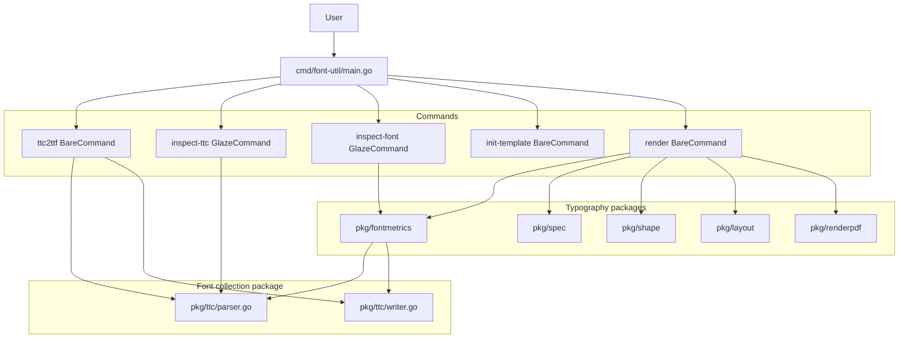
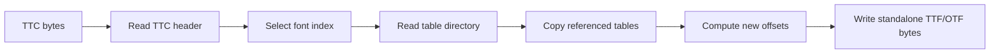
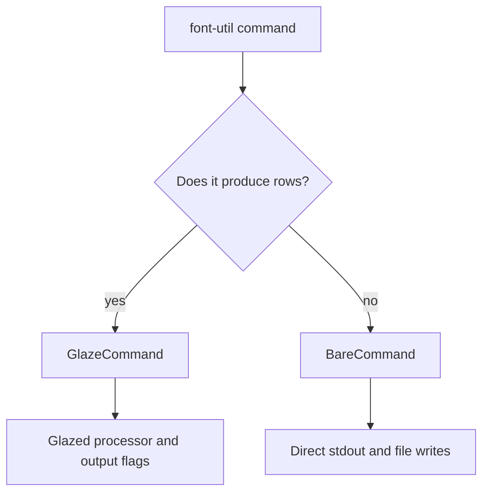
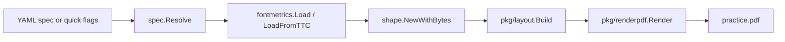

# font-util: TTC Extraction and Typography Practice CLI

`font-util` is a Go command-line tool for working with font files. The project began as a bare go-go-golems template and became a five-command CLI that can inspect TrueType collections, extract standalone fonts, inspect metrics and shaping behavior, generate typography practice templates, and render practice-sheet PDFs. The implementation is a useful study in where a Glazed command should produce structured rows and where a command should remain a bare file-writing operation.

> [!summary]
> The project has three important technical identities:
> 1. It implements a binary TTC/OTC reader and standalone font writer in Go.
> 2. It integrates the older `typo-copy-generator` project as reusable packages and CLI commands.
> 3. It uses Glazed selectively: structured output is kept for inspection commands, while file-producing commands are implemented as bare commands.

The final repository is at `/home/manuel/code/wesen/go-go-golems/font-util`. The main implementation work lives under `cmd/font-util/cmds/`, `pkg/ttc/`, `pkg/fontmetrics/`, `pkg/spec/`, `pkg/shape/`, `pkg/layout/`, and `pkg/renderpdf/`. The design and implementation diary live under `ttmp/2026/05/23/FONT-001--build-font-util-general-purpose-font-tool-with-glazed-commands-first-verb-ttc-to-ttf/`.

## Why this project exists

Font collections are common on macOS and in professional typography workflows. A `.ttc` file can contain several fonts that share tables. This is efficient for distribution, but many downstream tools expect an individual `.ttf` or `.otf` file. The first practical need was therefore simple: take a collection file such as `GillSans.ttc`, enumerate its member fonts, and extract each member as a standalone file.

The second need came from a nearby project, `/home/manuel/code/wesen/2026-05-22--typo-copy-generator`. That project already knew how to inspect font metrics, shape text with HarfBuzz-compatible Go packages, lay out copy-practice sheets, and render PDFs. The implementation was useful, but it lived as a separate CLI. `font-util` became the place where these capabilities could be consolidated under one binary.

The third need was architectural. The go-go-golems ecosystem uses Glazed for commands that emit structured data. Some `font-util` commands naturally produce rows. `inspect-ttc` and `inspect-font` should support `--output json`, `--fields`, CSV, YAML, and table output. Other commands write files. `ttc2ttf`, `init-template`, and `render` should not show dozens of Glazed output flags because their main side effect is a filesystem write. The implementation therefore separates structured commands from bare commands explicitly.

## Current project status

The project is implemented and pushed. It has five user-facing commands:

| Command | Command kind | Purpose | Structured output |
|---|---:|---|---|
| `ttc2ttf` | BareCommand | Extract fonts from a TTC/OTC collection, or list them with `--list`. | No |
| `inspect-ttc` | GlazeCommand | Emit one row per font in a collection. | Yes |
| `inspect-font` | GlazeCommand | Emit metrics and optional shaping examples for one font. | Yes |
| `init-template` | BareCommand | Write a starter YAML practice-sheet template. | No |
| `render` | BareCommand | Render a typography practice PDF, or emit layout JSON with `--dry-run`. | No |

The test suite covers the TTC parser and writer, in-memory extraction, collection loading, layout, shaping, PDF rendering helpers, spec validation, and command helper behavior. At the time of writing, `go test ./...` passes across all packages, and `golangci-lint run` reports zero issues.

The important commits from the implementation sequence are:

```text
774777e  project skeleton, module rename, Glazed CLI setup
ff638bb  TTC parser, TTF writer, first ttc2ttf integration
fc16756  typo-copy-generator packages and commands
9df66be  remove structured output from bare commands
19dcc1c  in-memory TTC extraction and --font-index
3c7cf2e  inspect-ttc, --list, OTC/CFF extension handling, native TTC collection loading
```

## Project shape

The implementation has three layers. The command layer translates CLI flags into calls into domain packages. The font binary layer parses and writes font collection data. The typography layer loads fonts, computes metrics, shapes text, builds page layouts, and renders PDFs.



The package boundaries are deliberate:

- `pkg/ttc` owns TTC and OTC binary structure. It knows about headers, offset tables, table records, collection member offsets, and reassembly into standalone font bytes.
- `pkg/fontmetrics` owns loading an individual font or a font selected from a collection and extracting usable metrics.
- `pkg/shape` owns shaping text into glyph runs. It uses `github.com/go-text/typesetting/harfbuzz` where possible and falls back to `sfnt` glyph lookup and kerning.
- `pkg/spec` owns the YAML worksheet format and defaulting rules.
- `pkg/layout` owns page and row geometry.
- `pkg/renderpdf` owns PDF drawing, including helper lines and glyph outlines.
- `cmd/font-util/cmds` owns command definitions, flag schemas, and the decision between `BareCommand` and `GlazeCommand`.

This division keeps binary font extraction independent from PDF rendering and keeps CLI concerns out of the core packages.

## The TTC file model

A TrueType Collection begins with a collection header. The header contains a magic tag, version numbers, the number of fonts, and an array of offsets. Each offset points to a normal SFNT offset table. From that point onward, each member font looks like a regular font header plus a table directory, except that table data may be shared with other fonts in the collection.

The parser in `pkg/ttc/parser.go` reads exactly those structures:

```go
type TTCHeader struct {
    Tag          string
    MajorVersion uint16
    MinorVersion uint16
    NumFonts     uint32
    FontOffsets  []uint32
}

type FontHeader struct {
    SFNTVersion   uint32
    NumTables     uint16
    SearchRange   uint16
    EntrySelector uint16
    RangeShift    uint16
    TableRecords  []TableRecord
}

type TableRecord struct {
    TagBytes [4]byte
    CheckSum uint32
    Offset   uint32
    Length   uint32
}
```

The parser does not treat a TTC as a high-level font object. It treats it as a byte-addressed binary file. That matters because extraction is not just parsing. Extraction must produce a new standalone file with a new offset table and new table offsets. A parsed `sfnt.Font` is useful for reading metrics and glyphs, but it is not enough to write the original tables back out as a standalone file.

The top-level parse path is short and explicit:

```go
func Parse(data []byte) (*TTCFile, error) {
    if len(data) < 12 { ... }

    tag := string(data[0:4])
    if tag != TTCTag { ... }

    header := TTCHeader{
        Tag:          tag,
        MajorVersion: binary.BigEndian.Uint16(data[4:6]),
        MinorVersion: binary.BigEndian.Uint16(data[6:8]),
        NumFonts:     binary.BigEndian.Uint32(data[8:12]),
    }

    header.FontOffsets = make([]uint32, header.NumFonts)
    for i := uint32(0); i < header.NumFonts; i++ {
        offset := 12 + i*4
        header.FontOffsets[i] = binary.BigEndian.Uint32(data[offset : offset+4])
    }

    for i, fontOffset := range header.FontOffsets {
        fontEntry, err := parseFontEntry(data, fontOffset, i)
        ...
    }
}
```

The checks around every offset are as important as the reads themselves. A font file is external binary input. Every slice boundary must be derived from file length checks, not from trust in header values. `parseFontEntry` validates that each table record is present and that each table's declared `Offset + Length` lies within the source file.

## Extracting one font from a collection

The central extraction problem is offset translation. A table record inside a TTC points to an offset in the original collection file. A standalone TTF or OTF must point to an offset in the new output file. The data bytes can be copied verbatim, but the table directory must be rewritten.

The writer in `pkg/ttc/writer.go` implements the extraction in two forms:

- `ExtractFontBytes(ttcData []byte, font FontEntry) ([]byte, error)` returns a standalone font as a byte slice.
- `ExtractFont(ttcData []byte, font FontEntry, outputPath string) error` writes those bytes to disk.

The in-memory function is the primary implementation. The file-writing function delegates to it.

```go
func ExtractFont(ttcData []byte, font FontEntry, outputPath string) error {
    output, err := ExtractFontBytes(ttcData, font)
    if err != nil {
        return err
    }

    dir := filepath.Dir(outputPath)
    if dir != "" && dir != "." {
        if err := os.MkdirAll(dir, 0755); err != nil { ... }
    }

    return os.WriteFile(outputPath, output, 0644)
}
```

`ExtractFontBytes` follows a fixed sequence:

1. Compute the size of the new offset table and table directory: `12 + numTables * 16`.
2. Iterate through each source table record.
3. Copy the table bytes from the source collection.
4. Assign the table's new offset in the output file.
5. Advance the output cursor by the table length rounded up to a four-byte boundary.
6. Write the new offset table.
7. Write the new table directory with translated offsets.
8. Copy each table's data to its new offset.

The important part is that table bytes are copied, not interpreted. The code does not need to understand `glyf`, `loca`, `cmap`, `name`, `OS/2`, or `head` contents in order to extract the font. It needs to understand the SFNT container.



The output file extension is derived from the font's SFNT version. TrueType fonts use `0x00010000` and are written as `.ttf`. CFF-based OpenType fonts use `0x4F54544F`, the bytes for `OTTO`, and are written as `.otf`. This logic lives in `ExtractAllFonts`:

```go
ext := ".ttf"
if font.Header.SFNTVersion == 0x4F54544F {
    ext = ".otf"
}
filename := fmt.Sprintf("%s%s", font.Name, ext)
```

The extraction algorithm does not otherwise care whether the outline data is TrueType glyph data or CFF data. The SFNT container layout is the same for the purposes of table directory rewriting.

## Naming extracted files

The output filename is taken from the `name` table. The parser prefers Name ID 6, the PostScript name, because it is intended to be a stable technical identifier for the font. In the test files, this yields names such as `GillSans-Bold`, `Futura-CondensedMedium`, and `Didot-Italic`.

The `name` table is itself a binary table. It contains a header, a list of name records, and a string storage area. The implementation looks for Windows platform Unicode records first and Mac Roman records as a fallback:

```go
isWindows := platformID == 3 && encodingID == 1
isMac := platformID == 1 && encodingID == 0

if !isWindows && !isMac {
    continue
}

strStart := nameTableOffset + stringOffset + strOffset
strEnd := strStart + uint32(length)
raw := data[strStart:strEnd]

if isWindows {
    result = decodeUTF16BE(raw)
} else {
    result = string(raw)
}
```

The Windows records are decoded as UTF-16BE. The code then sanitizes the result so it is safe as a filename. This is not cosmetic. A font's internal display name may contain spaces or characters that should not be written directly into a filename. The sanitized PostScript name gives the command predictable output paths.

## Why `ExtractFontBytes` exists

The first working version wrote extracted fonts to temporary files when another package needed to inspect a font from a TTC. That worked, but it introduced unnecessary filesystem work. It also made command code handle temporary file cleanup. The final implementation adds `ExtractFontBytes`, which returns the reassembled standalone font directly in memory.

This change made three parts of the system cleaner:

- `ttc2ttf` still writes files, but it uses the same in-memory extraction path as all other users.
- `fontmetrics.LoadFromTTC` can get raw standalone font bytes without touching disk.
- Tests can compare file extraction and memory extraction byte-for-byte.

The test `TestExtractFontBytesVersusFile` is important because it proves the refactor did not create a second subtly different extraction path. It extracts the same font both ways and compares the output bytes.

## Loading metrics from a TTC

`pkg/fontmetrics` originally loaded a single font with `sfnt.Parse`. That fails for collections because `sfnt.Parse` expects one font file, not a TTC. The final implementation adds `LoadFromTTC`.

The correct implementation uses two sources of information:

1. `opentype.ParseCollection(data)` returns a collection and can return the selected `*sfnt.Font` with `coll.Font(fontIndex)`.
2. `ttc.ExtractFontBytes(data, ttcFile.Fonts[fontIndex])` returns standalone bytes for the selected font, so `parseOS2` reads the right `OS/2` table.

The second point is easy to miss. `parseOS2` expects the bytes for one font whose table directory starts at byte zero. If it receives the entire TTC, it may read the wrong table directory. The implementation therefore uses `opentype.ParseCollection` for the live `sfnt.Font`, and the local extractor for the raw bytes used by OS/2 metrics.

```go
func LoadFromTTC(data []byte, fontIndex int) (*Loaded, error) {
    coll, err := opentype.ParseCollection(data)
    ...
    f, err := coll.Font(fontIndex)
    ...

    ttcFile, err := ttc.Parse(data)
    ...
    fontBytes, err := ttc.ExtractFontBytes(data, ttcFile.Fonts[fontIndex])
    ...

    m, err := Extract(fontBytes, f)
    ...
    return &Loaded{Bytes: fontBytes, Font: f, Metrics: m}, nil
}
```

This design is slightly more work than using only `opentype.ParseCollection`, but it produces correct OS/2 metrics for the selected collection member. A run against `GillSans.ttc --font-index 7` returns `Gill Sans Light` with `source=os2`, which verifies that the selected font's table data is being read.

## The command design: BareCommand versus GlazeCommand

The most important command-layer decision was not the syntax of any individual flag. It was the decision to use two command interfaces.

A `GlazeCommand` is appropriate when the command produces rows. The command gives rows to a Glazed processor, and the user can choose `--output json`, `--fields`, `--filter`, and related transformations. `inspect-font` and `inspect-ttc` fit this model because they produce structured facts.

A `BareCommand` is appropriate when the command performs a side effect and prints human status text. `ttc2ttf`, `init-template`, and `render` fit this model because they write files. Adding sixty output-format flags to these commands makes the help harder to read and implies capabilities that are not meaningful for the command.

The implementation makes the distinction explicit with interface assertions:

```go
var _ cmds.BareCommand = (*Ttc2TtfCommand)(nil)
var _ cmds.BareCommand = (*InitTemplateCommand)(nil)
var _ cmds.BareCommand = (*RenderCommand)(nil)

var _ cmds.GlazeCommand = (*InspectFontCommand)(nil)
var _ cmds.GlazeCommand = (*InspectTtcCommand)(nil)
```

This matters because Glazed's Cobra builder automatically adds the Glazed output section for commands that implement `cmds.GlazeCommand`. A command that accidentally implements `RunIntoGlazeProcessor` receives the full output flag suite. The final refactor changed the bare commands to implement `Run(ctx, values)` instead. Their help now shows only their own flags, general command settings, and global logging flags.



The practical result is visible in the CLI:

- `font-util inspect-ttc GillSans.ttc --output json` is useful and supported.
- `font-util render --output json` is not part of the interface because rendering writes a PDF.
- `font-util render --dry-run` emits JSON directly because that mode is a debugging view of the layout document, not a table-processing pipeline.

## Integrating the typography practice generator

The older `typo-copy-generator` project was integrated by copying its internal packages into `pkg/` and fixing imports. This was not just a CLI wrapper. The copied code became reusable library packages inside `font-util`.

The copied packages are:

| Package | Responsibility |
|---|---|
| `pkg/fontmetrics` | Load fonts and extract metrics such as units per em, ascender, descender, x-height, cap height, and glyph count. |
| `pkg/spec` | Parse and validate the YAML worksheet format, apply defaults, and resolve lengths to points. |
| `pkg/shape` | Shape text into glyph runs using `go-text/typesetting/harfbuzz`, with an SFNT fallback. |
| `pkg/layout` | Convert a resolved sheet spec into pages, rows, baselines, item positions, and blank practice rows. |
| `pkg/renderpdf` | Render the laid-out document to PDF using `github.com/go-pdf/fpdf` and vector glyph outlines. |

The rendering pipeline is sequential:



The `render` command supports both template mode and quick mode. Template mode reads YAML. Quick mode builds a minimal `spec.SheetSpec` from CLI flags. Both paths converge before layout:

```go
if s.YamlTemplate != "" {
    sheetSpec, err = spec.Load(s.YamlTemplate)
} else {
    items := splitCSV(firstNonEmpty(s.Text, s.Glyphs))
    row := spec.RowSpec{Items: items, BlankLines: blankLinesPtr}
    sheetSpec = spec.SheetSpec{
        Version:  1,
        Font:     s.Font,
        Output:   firstNonEmpty(s.Out, "practice.pdf"),
        Sections: []spec.SectionSpec{{Title: "Practice", Rows: []spec.RowSpec{row}}},
    }
    spec.ApplyDefaults(&sheetSpec)
    sheetSpec.Layout.Wrap = true
}
```

The command then loads the font, shapes the text, builds the layout, and either writes a PDF or emits JSON when `--dry-run` is set.

## Text shaping and vector rendering

The shaping package chooses HarfBuzz-compatible shaping when possible:

```go
func NewWithBytes(data []byte, f *sfnt.Font, m fontmetrics.Metrics) Shaper {
    s := New(f, m)
    if face, err := gtfont.ParseTTF(bytes.NewReader(data)); err == nil {
        s.hbFace = face
    }
    return s
}
```

When HarfBuzz-compatible shaping is available, strings such as `fi` and `office` can produce ligature glyph IDs. The renderer then draws those glyphs directly as vector outlines with `sfnt.LoadGlyph`, rather than relying on a PDF viewer to shape text. That is a necessary design choice because the output is a practice sheet, not normal selectable text. The visual forms must be placed exactly at the intended positions.

The renderer turns each shaped run into a sequence of glyph drawings:

```go
func drawRun(pdf *fpdf.Fpdf, font *sfnt.Font, m fontmetrics.Metrics,
    pointSize, x, baseline float64, glyphs []shape.Glyph) {

    cursor := x
    for _, g := range glyphs {
        drawGlyph(pdf, font, m, pointSize, g.GlyphID, cursor+g.XOffsetPt, baseline)
        cursor += g.XAdvancePt
    }
}
```

`drawGlyph` loads the outline segments and writes path commands into the PDF. Quadratic curves are converted to cubic curves because PDF path drawing uses cubic Beziers for this operation. This is a low-level rendering path, but it gives the project control over helper lines, model glyph opacity, baseline placement, and blank rows.

## The worksheet spec and layout model

The YAML spec gives the rendering command a stable input format. It describes the font, output file, page, style, layout, shaping options, and sections. Each section contains rows. Rows contain text items and optional blank practice lines.

A starter template is produced by `init-template` through `spec.Starter`. The default sheet includes one section for kerning and ligatures and one section for free practice. Defaults are applied by `spec.ApplyDefaults`, which fills in page size, margins, point size, helper lines, layout gaps, and shaping features.

The layout package converts this resolved spec into a document:

```go
type Document struct {
    PageSizeName string
    PageWidth    float64
    PageHeight   float64
    Pages        []Page
    Metrics      fontmetrics.Metrics
}

type Row struct {
    Section   string
    BaselineY float64
    LeftX     float64
    RightX    float64
    PointSize float64
    Model     bool
    Items     []Item
}
```

The layout algorithm computes row height from font metrics and point size. It alternates model rows and blank practice rows. When wrapping is enabled, a row of items can become multiple model rows, each followed by its own blank rows. In cell mode, items are chunked into columns and centered within cells.

The test names reveal the intended behavior:

- `TestRowWrapAlternatesModelAndBlankRows`
- `TestCellsChunkIntoModelAndBlankRows`

These tests matter because layout bugs are visual. A PDF can be generated successfully while still being pedagogically wrong: missing blank rows, wrong row order, or unexpected wrapping can make the sheet unusable.

## User-facing command examples

The current command set is best understood by the data each command owns.

`inspect-ttc` reads collection structure and produces one row per member font:

```bash
font-util inspect-ttc GillSans.ttc
```

Example fields:

```text
index | name                    | sfnt_type | tables | output_ext
0     | GillSans                | TrueType  | 21     | .ttf
1     | GillSans-Bold           | TrueType  | 19     | .ttf
...
```

`ttc2ttf --list` uses the same parser, but prints human text without invoking Glazed output:

```bash
font-util ttc2ttf GillSans.ttc --list
```

`inspect-font` inspects one font. For a TTC, `--font-index` selects the member font:

```bash
font-util inspect-font GillSans.ttc --font-index 7 --output table
```

The command uses `fontmetrics.LoadFromTTC`, which uses `opentype.ParseCollection` for the selected `sfnt.Font` and local extraction for correct OS/2 metrics.

`render` uses the same `--font-index` flag:

```bash
font-util render --font GillSans.ttc --font-index 1 --text "Bold" --out /tmp/bold.pdf
```

`init-template` writes a YAML file and does not use structured output:

```bash
font-util init-template --font ./font.otf --out practice.yaml --pdf-out practice.pdf
```

## Tests as executable documentation

The test suite is part of the project explanation because it fixes the intended behavior in code. The TTC tests use real collection files when they are present in the repository working directory: `Didot.ttc`, `Futura.ttc`, and `GillSans.ttc`. These files are ignored by Git because they are binary test inputs, but they were used during implementation to validate real macOS font collections.

Important tests include:

| Test | What it proves |
|---|---|
| `TestParseDidotTTC`, `TestParseFuturaTTC`, `TestParseGillSansTTC` | The parser reads real TTC headers, member offsets, names, and table counts. |
| `TestExtractDidotRoundTrip` | The writer produces a standalone file with a valid SFNT header and expected table count. |
| `TestExtractFontBytesVersusFile` | In-memory extraction and file extraction produce identical bytes. |
| `TestLoadFromTTC` | `fontmetrics.LoadFromTTC` loads selected collection members and reads OS/2 metrics. |
| `TestLoadFontTTCWithIndex` | Command helpers select the expected Gill Sans fonts by index. |
| `TestHarfbuzzShaperRuns` | The shaping path uses the HarfBuzz-compatible engine on Go Regular. |
| `TestRowWrapAlternatesModelAndBlankRows` | Row layout preserves the model/blank row sequence. |
| `TestCellsChunkIntoModelAndBlankRows` | Cell layout chunks items and preserves blank rows. |

The tests show the system's main correctness criteria: parse the collection, preserve member font data, expose the correct member by index, produce valid metrics, shape text, and render a document.

## Failure modes and design corrections

Several implementation corrections shaped the final design.

The first correction was the difference between parsing and extracting. `golang.org/x/image/font/opentype.ParseCollection` can parse a TTC and return a selected font, but it does not serialize a standalone TTF. Extraction still requires local SFNT container rewriting. This is why `pkg/ttc` exists.

The second correction was OS/2 metrics in `LoadFromTTC`. Passing the whole TTC byte slice to `Extract` allowed the selected `sfnt.Font` to provide some metrics, but `parseOS2` looked at the wrong byte layout. The fix was to extract the selected font's standalone bytes and pass those bytes to `Extract` together with the selected `*sfnt.Font`.

The third correction was command type. Initially the file-writing commands implemented `RunIntoGlazeProcessor`, which made them `GlazeCommand`s. Glazed then added structured output flags automatically. The final code uses `cmds.BareCommand` for file-writing commands and `cmds.GlazeCommand` only for commands that emit rows.

The fourth correction was the `--template` flag. Glazed already has template-related flags. The render command uses `--yaml-template` to avoid collisions and to name the input format precisely.

## Current limitations

The project is functional, but there are still bounded areas for improvement.

The `head` table `checkSumAdjustment` is not recomputed after extraction. The current extraction copies tables verbatim and rewrites only the offset table and directory. The produced fonts validate with normal tooling in the tested cases, but a stricter validator may require recomputing the whole-font checksum adjustment.

The name extraction path supports Windows Unicode records and has a Mac Roman fallback. The Mac Roman fallback currently treats bytes as a simple string. Full Mac Roman decoding would be better for legacy fonts.

`LoadFromTTC` parses the collection with `opentype.ParseCollection` and also parses it with `pkg/ttc` to extract raw member bytes. This double parse is acceptable for CLI use and keeps the code clear. If performance becomes important for very large collections, the extraction metadata could be shared.

The CLI tests exercise helpers and package behavior. There is room for tests that execute the compiled Cobra commands end to end, especially for `render --dry-run`, `inspect-ttc --output json`, and `ttc2ttf --list`.

## Near-term next steps

The next useful steps are small and technical:

- Recompute `head.checkSumAdjustment` after extraction and add a validator-backed test.
- Add full Mac Roman decoding for legacy name table records.
- Add end-to-end Cobra command tests for all five commands.
- Add an explicit `--font-name` selector for TTC files in addition to `--font-index`.
- Add an `inspect-font --all` mode for TTC files that emits metrics for every member font.

## Project working rule

The central rule for future work is simple: keep row-producing inspection commands as `GlazeCommand`s and keep file-producing commands as `BareCommand`s. A command should not expose structured output flags unless it produces structured rows as its primary result. This keeps the CLI readable and makes each command's output contract clear.

The same rule applies inside the packages. `pkg/ttc` should remain a binary container package. It should not learn about PDF rendering. `pkg/renderpdf` should remain a rendering package. It should not parse TTC headers. The current implementation is useful because each package owns one part of the system and exposes a narrow API to the command layer.
