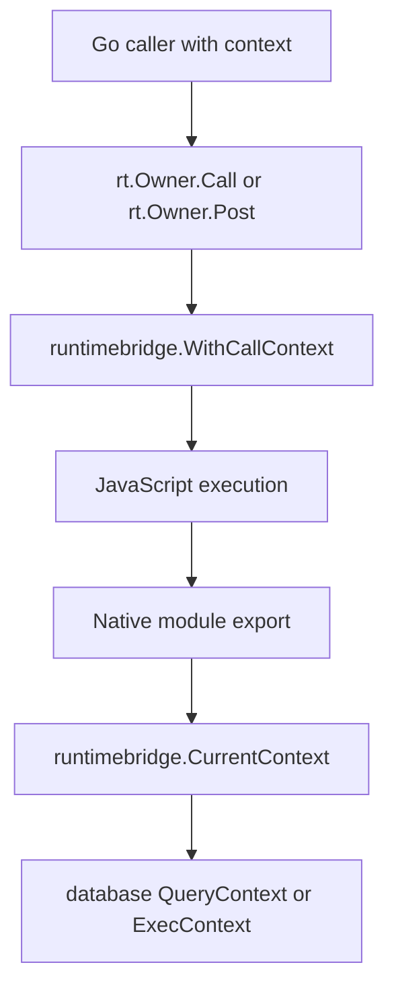

# Review - go-go-goja PR 38 - UIDSL attrs and per-call context propagation

This review explains PR 38 in `go-go-goja` from the point of view of a reviewer who needs to understand the architecture before deciding what to approve, question, or test. The PR contains two mostly independent changes. The first adds a per-call `context.Context` surface for native modules running inside an owned `goja.Runtime`. The second changes the `uidsl` HTML node representation so element attributes are normalized once into `[]Attr` and then rendered directly.

The PR description also describes the `uidsl` module as newly introduced. In the current diff against `origin/main`, the module already exists. The reviewed diff is therefore not the first introduction of the module; it is a representation and rendering cleanup for the module, plus tests and benchmarks. Reviewers should read the PR title and body with that distinction in mind.

> [!summary]
> The main review question is whether the new request-context bridge is safe as a runtime-wide mechanism for native modules.
> The most important correctness follow-up is to check `rows.Err()` after database row iteration now that query cancellation is part of the feature.
> The most important compatibility follow-up is to decide whether changing `runtimebridge.Bindings.Owner` and `uidsl.Element.Attrs` is acceptable for downstream Go callers.
> Local validation passed with `go test ./... -count=1`, while GitHub reports a failing Dependency Review check that should be resolved before merge.

## Review verdict

The implementation is coherent and the tests cover the intended happy paths. The context bridge has a clean direction: callers provide a context to `runtimeowner.Runner.Call`, native modules retrieve that context through `runtimebridge.CurrentContext`, and context-aware modules pass it to their blocking or I/O-facing operations. That is the right shape for server-side use, especially for HTTP handlers where request cancellation, deadlines, and trace values should reach native module code without being exposed as JavaScript API details.

The PR is not a simple mechanical change. It changes public Go-facing shapes in two places, and it makes cancellation semantics observable in the database module. I would review it as a feature PR with compatibility impact, not as a pure internal refactor. I would not merge it until the Dependency Review failure is understood, and I would strongly consider adding the missing `rows.Err()` check in `DBModule.QueryContext` before merge.

## What changed, at the architectural level

The runtime owner pattern already controls how Go code enters the `goja.Runtime`. The owner runs JavaScript work on the runtime's allowed execution path, and the rest of the system calls into it through `Call` and `Post`. PR 38 adds one more responsibility to that path: while an owned call is executing, the runtime bridge stores the call's context in a per-VM stack.



The important design choice is that JavaScript authors do not receive a Go context object. Context remains a Go-side execution property. Native module authors can opt into it by calling `runtimebridge.CurrentContext(vm)`. This keeps JavaScript APIs stable while allowing database drivers, HTTP clients, filesystem work, tracing integrations, or other native code to inherit request scope.

The `uidsl` change is different. It moves attribute interpretation from render time to construction time. Before the PR, an element carried `Attrs map[string]any`, and rendering repeatedly sorted keys, interpreted booleans, interpreted class/style helpers, and emitted strings. After the PR, an element carries `Attrs []Attr`, where each attribute is already normalized into either a string-valued attribute or a boolean attribute.

```go
type Attr struct {
    Key   string
    Value string
    Bool  bool
}

type Element struct {
    Tag      string
    Attrs    []Attr
    Children []Node
}
```

This is a meaningful data-model change. It improves the hot render path, but it also changes the Go API for callers that construct `uidsl.Element` values directly.

## The context propagation path

The main implementation lives in `pkg/runtimebridge/runtimebridge.go` and `pkg/runtimeowner/runner.go`.

`runtimebridge.CurrentContext` defines the lookup order:

```go
func CurrentContext(vm *goja.Runtime) context.Context {
    if vm == nil {
        return context.Background()
    }
    if st, ok := lookupCallContextStack(vm); ok {
        if ctx, ok := st.peek(); ok && ctx != nil {
            return ctx
        }
    }
    if bindings, ok := Lookup(vm); ok && bindings.Context != nil {
        return bindings.Context
    }
    return context.Background()
}
```

The lookup order matters. A currently executing `Call` or `Post` wins. If no call context is active, the runtime lifecycle context registered in `runtimebridge.Bindings` is used. If the VM has no bindings, the function returns `context.Background()`.

The stack is pushed in `WithCallContext` and popped with `defer`:

```go
func WithCallContext(vm *goja.Runtime, ctx context.Context, fn func() (any, error)) (any, error) {
    if vm == nil {
        return nil, errors.New("runtimebridge: nil runtime")
    }
    if fn == nil {
        return nil, errors.New("runtimebridge: nil function")
    }
    if ctx == nil {
        ctx = CurrentContext(vm)
    }
    st := getCallContextStack(vm)
    st.push(ctx)
    defer st.pop()
    return fn()
}
```

That `defer` is important. It means normal returns, errors, and panics all restore the previous context. The tests cover fallback behavior, nested context restoration, and panic cleanup in `pkg/runtimebridge/runtimebridge_test.go`.

`runtimeowner` then wraps both call forms:

```go
func (r *runner) invoke(ctx context.Context, op string, fn CallFunc) (any, error) {
    return runtimebridge.WithCallContext(r.vm, ctx, func() (any, error) {
        if !r.opts.RecoverPanics {
            return fn(ctx, r.vm)
        }
        // panic recovery path omitted here
        ret, err = fn(ctx, r.vm)
        return ret, err
    })
}

func (r *runner) invokePost(ctx context.Context, op string, fn PostFunc) {
    _ = runtimebridge.WithCallContextVoid(r.vm, ctx, func() error {
        fn(ctx, r.vm)
        return nil
    })
}
```

The reviewer should check this in `pkg/runtimeowner/runner.go`, especially lines around `invoke` and `invokePost`. Those are the places where the runtime-owner invariant and the new context-stack invariant meet.

## How the database module uses the new context

The database module is the first consumer of the context bridge. Its JavaScript exports now wrap the old methods and pass `runtimebridge.CurrentContext(vm)` into new context-aware methods:

```go
modules.SetExport(exports, m.Name(), "query", func(query string, args ...any) ([]map[string]any, error) {
    return m.QueryContext(runtimebridge.CurrentContext(vm), query, args...)
})
modules.SetExport(exports, m.Name(), "exec", func(query string, args ...any) (map[string]any, error) {
    return m.ExecContext(runtimebridge.CurrentContext(vm), query, args...)
})
```

The module adds a new optional interface:

```go
type QueryExecerContext interface {
    QueryContext(ctx context.Context, query string, args ...any) (*sql.Rows, error)
    ExecContext(ctx context.Context, query string, args ...any) (sql.Result, error)
}
```

The dispatch functions prefer context-aware operations when available and fall back to the legacy interface otherwise:

```go
func queryRows(ctx context.Context, qe QueryExecer, query string, args ...any) (*sql.Rows, error) {
    if ctx == nil {
        ctx = context.Background()
    }
    if qec, ok := qe.(QueryExecerContext); ok {
        return qec.QueryContext(ctx, query, args...)
    }
    return qe.Query(query, args...)
}
```

This is a good compatibility design for `*sql.DB`, because `*sql.DB` implements both context-aware methods. It is also a reasonable design for simple test doubles and existing embedders because `Query` and `Exec` still work.

The important review point is row iteration. `QueryContext` currently checks the error returned by `queryRows`, scans every row, and returns the result. It does not call `rows.Err()` after the loop. With context-aware SQL, cancellation may surface after iteration begins. The method should contain a post-loop check:

```go
for rows.Next() {
    // scan row
}
if err := rows.Err(); err != nil {
    return nil, err
}
```

This was already a database correctness issue before the PR, but the PR makes it more important because cancellation propagation is one of the feature's stated goals. A query can begin successfully, then the context can be canceled while rows are being read. Without checking `rows.Err()`, the caller may receive a partial result without an error.

## How to review the `uidsl` attribute change

The `uidsl` refactor changes when attributes are interpreted. The constructor path now decides whether the first argument is attributes, converts the attribute map into an ordered `[]Attr`, and stores that list on the element:

```go
func elementFromCall(vm *goja.Runtime, tag string, call goja.FunctionCall) *Element {
    var attrs []Attr
    args := call.Arguments
    if len(args) > 0 {
        if decoded, ok := attrsFromValue(vm, args[0]); ok {
            attrs = decoded
            args = args[1:]
        }
    }
    return &Element{Tag: tag, Attrs: attrs, Children: nodesFromArgs(args)}
}
```

Rendering becomes a direct walk over the normalized list:

```go
func renderAttrs(b *bytes.Buffer, attrs []Attr) {
    for _, attr := range attrs {
        if attr.Key == "" {
            continue
        }
        b.WriteByte(' ')
        b.WriteString(attr.Key)
        if attr.Bool {
            continue
        }
        b.WriteString("=\"")
        b.WriteString(html.EscapeString(attr.Value))
        b.WriteByte('"')
    }
}
```

The review question is not whether `[]Attr` is faster in isolation. It almost certainly reduces work in repeated render paths because render no longer sorts and interprets maps. The review question is whether construction-time normalization preserves all the semantics that JavaScript users expect.

The new compatibility test is useful because it states the intended policy:

- `hidden: true` renders as `hidden`.
- `draggable: false`, `title: null`, and `role: undefined` are omitted.
- `value: ""` is preserved as `value=""`.
- `class: ["base", false, "extra", ""]` becomes `class="base extra"`.
- object-style `style` is sorted and rendered deterministically.

That is a precise contract. Reviewers should decide whether boolean false should be omitted for every attribute. HTML boolean attributes should behave that way. Some ARIA or data attributes may need the literal value `"false"`; callers can still pass the string `"false"` instead of the boolean `false`, but the module documentation should make that distinction clear.

## Public API and downstream compatibility

There are two compatibility impacts to review.

First, `runtimebridge.Bindings.Owner` changed from the full `runtimeowner.Runner` type to a narrow `runtimebridge.OwnerRunner` interface with only `Post`. The code introduces an adapter in `engine/factory.go`:

```go
type runtimebridgeOwner struct {
    owner runtimeowner.Runner
}

func (o runtimebridgeOwner) Post(ctx context.Context, op string, fn func(context.Context, *goja.Runtime)) error {
    return o.owner.Post(ctx, op, runtimeowner.PostFunc(fn))
}
```

This removes an import cycle and keeps `runtimebridge` independent from `runtimeowner`. That is a good package-boundary decision. It is still a public API change. Any external module that did `bindings.Owner.Call(...)` will no longer compile. The repository itself only uses `bindings.Owner.Post` in async modules, so local code is fine. A reviewer should decide whether this repository treats `runtimebridge.Bindings` as public API or internal construction detail.

Second, `uidsl.Element.Attrs` changed from `map[string]any` to `[]Attr`. The PR adds an exported helper:

```go
func Attrs(attrs map[string]any) []Attr {
    return attrsFromMap(attrs)
}
```

That helper gives Go callers a direct migration path:

```go
&Element{
    Tag: "div",
    Attrs: uidsl.Attrs(map[string]any{"class": "notice", "hidden": true}),
    Children: []uidsl.Node{&uidsl.Text{Value: "hello"}},
}
```

The helper is enough for internal use, but it is not a transparent compatibility shim. Existing Go callers constructing `Element{Attrs: map[string]any{...}}` must change.

## Test coverage assessment

The PR adds focused tests in the right places.

`pkg/runtimebridge/runtimebridge_test.go` covers fallback to the runtime lifecycle context, nested context restoration, and stack cleanup after panic. `pkg/runtimeowner/runner_test.go` covers `Runner.Call` exposing the call context through `runtimebridge.CurrentContext`. `modules/database/database_test.go` proves that JavaScript `exec()` receives a request-scoped context through a preconfigured database module and that the legacy `QueryExecer` path still works. `modules/uidsl/attrs_compat_test.go` states the new attribute contract for escaping, booleans, omission, and child-versus-attribute disambiguation.

The missing test I would add is a database query cancellation test that proves cancellation during row iteration returns an error. This likely requires a controllable driver-level test because the module returns `*sql.Rows` directly. If that test is too expensive, the minimum code-level fix is still the `rows.Err()` check after iteration.

A second useful test would show `CurrentContext` after an owner call has completed. The bridge tests already prove pop after panic and nested restoration, but a runtimeowner-level test that calls `CurrentContext(vm)` after `Call` returns would document the externally visible invariant.

## CI and local validation

I ran the full test suite locally from `/home/manuel/code/wesen/go-go-golems/go-go-goja`:

```bash
go test ./... -count=1
```

Result: all packages passed.

I also ran a focused package set before the full suite:

```bash
go test ./pkg/runtimebridge ./pkg/runtimeowner ./modules/database ./modules/uidsl -count=1
```

Result: all packages passed.

GitHub currently reports one failing check:

```text
Dependency Review    fail
Analyze              pass
TruffleHog           pass
inspector-validation pass
lint                 pass
docker               pass
test                 pass
Go Vulnerability     pass
GoSec                pass
CodeQL               pass
```

The PR includes dependency bumps in `go.mod`: `golang.org/x/net`, `golang.org/x/crypto`, `golang.org/x/sys`, `golang.org/x/term`, and `golang.org/x/text`. Because the vulnerability and GoSec jobs pass, the Dependency Review failure may be policy-related rather than a direct vulnerability. It still needs to be read and resolved before merge.

## Suggested review order

Start with the runtime path. Read `pkg/runtimeowner/runner.go` around `invoke` and `invokePost`, then read `pkg/runtimebridge/runtimebridge.go` from `CurrentContext` through the stack helpers. The goal is to verify that every JavaScript-entering owner call pushes the intended context and always pops it.

Then read the database module. Focus on `Loader`, `QueryContext`, `ExecContext`, `queryRows`, and `execResult`. The main question is whether database work now observes request cancellation correctly. Add the `rows.Err()` check to your review checklist.

Then read the `uidsl` representation change. Start with `modules/uidsl/node.go`, then `module.go`, then `render.go`. The goal is to confirm that attribute normalization happens exactly once, that child detection still works, and that the new `Attrs` helper is sufficient for Go callers.

Finally, read tests as specifications. The tests are not only validation; they state the intended behavior. If you disagree with the policy encoded by `attrs_compat_test.go`, the implementation is not the only thing to change. The test contract should change too.

## Concrete review checklist

- Confirm that `runtimebridge.CurrentContext(vm)` must only be used while operating under the runtime-owner execution discipline.
- Confirm that `runtimebridge.Bindings.Owner` narrowing from full runner to `Post`-only interface is an acceptable public API change.
- Add or request a `rows.Err()` check after the `DBModule.QueryContext` row loop.
- Decide whether `QueryExecerContext` should require both `QueryContext` and `ExecContext`, or whether separate optional interfaces would better support partial implementations.
- Confirm that omitting all boolean `false` attributes is the intended `uidsl` policy, especially for ARIA-style attributes where a literal false value can be meaningful.
- Confirm that downstream Go callers can migrate from `Element.Attrs map[string]any` to `Element.Attrs []Attr` using `uidsl.Attrs(...)`.
- Resolve the GitHub Dependency Review failure before merge.

## Files worth reading

- `/home/manuel/code/wesen/go-go-golems/go-go-goja/pkg/runtimebridge/runtimebridge.go`
- `/home/manuel/code/wesen/go-go-golems/go-go-goja/pkg/runtimeowner/runner.go`
- `/home/manuel/code/wesen/go-go-golems/go-go-goja/engine/factory.go`
- `/home/manuel/code/wesen/go-go-golems/go-go-goja/modules/database/database.go`
- `/home/manuel/code/wesen/go-go-golems/go-go-goja/modules/uidsl/node.go`
- `/home/manuel/code/wesen/go-go-golems/go-go-goja/modules/uidsl/module.go`
- `/home/manuel/code/wesen/go-go-golems/go-go-goja/modules/uidsl/render.go`
- `/home/manuel/code/wesen/go-go-golems/go-go-goja/modules/uidsl/attrs_compat_test.go`
- `/home/manuel/code/wesen/go-go-golems/go-go-goja/modules/uidsl/attrs_bench_test.go`

## Final guidance

This PR is a good candidate for merge after review cleanup. The runtime context bridge has the right shape and is covered by targeted tests. The database module integration demonstrates why the bridge exists. The `uidsl` attribute refactor simplifies the renderer and makes attribute behavior more explicit.

The safest merge path is to treat the PR as three review decisions rather than one. Approve the context bridge if the owner-thread invariant is clear. Approve the database integration after adding the `rows.Err()` check or explicitly accepting the existing behavior. Approve the `uidsl` refactor after deciding that the `Element.Attrs` API change and boolean attribute policy are intentional. Then resolve the Dependency Review failure and merge with confidence.

```bash
# Commands used for this review
cd /home/manuel/code/wesen/go-go-golems/go-go-goja
git diff --stat origin/main...HEAD
go test ./pkg/runtimebridge ./pkg/runtimeowner ./modules/database ./modules/uidsl -count=1
go test ./... -count=1
gh pr checks 38
```

## Related PR metadata

- PR: https://github.com/go-go-golems/go-go-goja/pull/38
- Title: `feat: Add uidsl module and per-call context propagation`
- Base: `origin/main`
- Head reviewed locally: `dfab58e` on `wesen/main`
- Changed files: 17
- Diff size: 702 additions, 99 deletions
- Local test result: pass
- GitHub check caveat: Dependency Review failing at review time

## Appendix: PR commit sequence

```text
4b7aa26 feat: propagate owner call context to native modules
2bc72d5 perf: avoid double export for ui attrs
9083b8f perf: render ui attrs from attr list
dfab58e :arrow_up: Bump go.net
```

The commit sequence explains why the PR has two identities. The first commit adds the runtime and database context mechanism. The middle commits optimize and clarify `uidsl` attribute handling. The final commit updates dependencies, which is probably connected to the failing Dependency Review check and should be examined separately.

The review should be updated if the PR receives additional commits after `dfab58e`.
