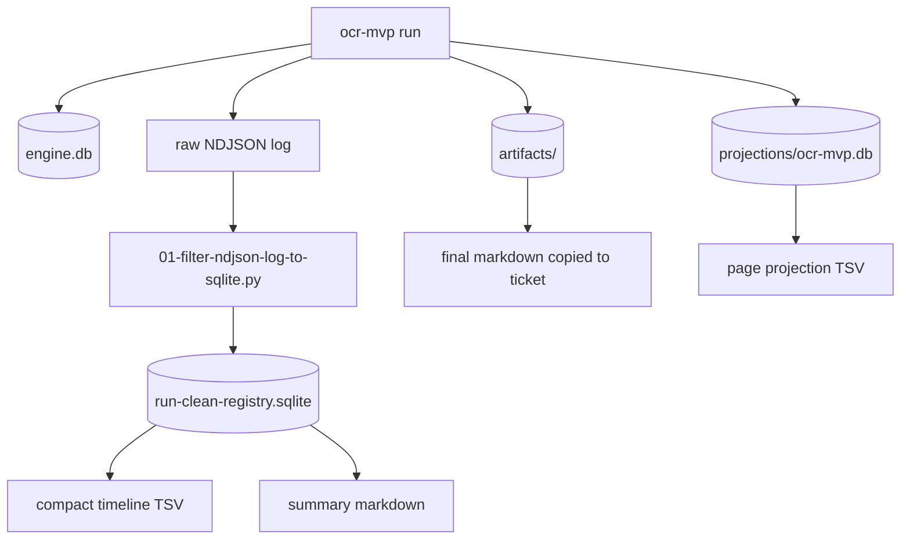

# Book OCR Quality Lab: Baseline Runs, SQLite Log Filtering, and Experiment Provenance

This report explains the work done after the OCR MVP proved that `scraper` could run real provider-backed page OCR. The next problem was not whether the system could call a model. The next problem was whether the system could support repeatable quality experiments on a real book, preserve evidence, reduce noisy logs, and give a future reviewer enough structure to understand what happened.

The concrete ticket is `BOOK-OCR-HQ-001`, stored at:

```text
/home/manuel/workspaces/2026-05-20/book-ocr/2026-05-20--book-ocr/ttmp/2026/05/24/BOOK-OCR-HQ-001--high-quality-book-ocr-experiment-system
```

The first experiment processed pages 1-30 of:

```text
/home/manuel/code/wesen/claw-stuff/output/books/presentation-based-uis/pages
```

The successful run used the `gpt-5-nano-low` profile through a clean temporary Pinocchio profile registry and produced a 30-page markdown artifact. The main optimization in this phase was log handling: provider streaming logs created thousands of Server-Sent Event trace rows, so the work introduced a SQLite-backed log filtering path that preserves full logs while producing compact summaries and queryable timelines.

> [!summary]
> 1. `BOOK-OCR-HQ-001` turns book OCR from a one-off run into an experiment workspace with manifests, prompts, outputs, logs, and diary entries.
> 2. The first default-registry baseline failed because the local Pinocchio profile file has duplicate `gpt-5-nano-low` keys; the successful run used a clean temporary registry.
> 3. The successful 30-page run produced 8687 log lines, of which 8443 were trace-level SSE deltas; SQLite filtering reduced normal inspection to 69 non-trace workflow events.

## Why this work was needed

A durable OCR runtime is only useful if the work can be inspected later. The OCR MVP already had a workflow package, a CLI, a Geppetto-backed OCR client, page artifacts, and projection rows. That made it possible to process real pages. It did not yet make it easy to conduct quality experiments.

Quality experiments need stable evidence. When a prompt changes, the system must preserve the previous prompt, the previous output, and the failure notes. When a provider call fails, the system must preserve the error without burying it in terminal scrollback. When a run succeeds, the output needs to be copied into a named experiment folder so a reviewer can compare it with later runs.

This phase created that structure. It did not try to solve all OCR quality problems at once. It established the first baseline and improved the experiment feedback loop.

## The experiment workspace

The ticket workspace has a design guide, a diary, tasks, changelog entries, and experiment folders. The experiment folder contract is:

```text
experiments/001-baseline-single-page/
├── manifest.yaml
├── prompts/
│   └── 01-page-prompt.md
├── outputs/
│   ├── 01-final-baseline-clean.md
│   ├── pages-clean.tsv
│   └── timeline-clean.tsv
├── logs/
│   ├── run.log
│   ├── run-clean-registry.log
│   ├── run-clean-registry.sqlite
│   ├── run-failed-duplicate-profile.sqlite
│   ├── 01-run-clean-registry-summary.md
│   └── 02-run-failed-duplicate-profile-summary.md
└── notes.md
```

Each file has a distinct role:

| File | Purpose |
| --- | --- |
| `manifest.yaml` | Records page range, profile choices, strategy, output locations, and quality checks. |
| `prompts/01-page-prompt.md` | Records which prompt was used for the baseline. |
| `outputs/01-final-baseline-clean.md` | Stores the assembled 30-page markdown artifact from the successful run. |
| `outputs/pages-clean.tsv` | Stores page projection rows exported from `projections/ocr-mvp.db`. |
| `outputs/timeline-clean.tsv` | Stores compact workflow events exported from the log SQLite database. |
| `logs/run-clean-registry.log` | Preserves the full successful provider run log, including noisy trace rows. |
| `logs/run-clean-registry.sqlite` | Stores parsed log rows for SQL filtering. |
| `logs/01-run-clean-registry-summary.md` | Presents the compact log summary for normal review. |
| `notes.md` | Records the experiment outcome and next review task. |

The important point is that the run is not just an artifact in `/tmp`. The result is copied into the ticket, and the run evidence is summarized in a form that can be reviewed without re-running the provider calls.

## The baseline run

The intended baseline command was a straightforward 30-page run:

```bash
cd /home/manuel/workspaces/2026-05-20/book-ocr/scraper

go run ./cmd/ocr-mvp run \
  --book-id presentation-based-uis-hq-001-baseline \
  --image-dir /home/manuel/code/wesen/claw-stuff/output/books/presentation-based-uis/pages \
  --work-dir /tmp/book-ocr-hq-001/001-baseline-single-page \
  --start-page 1 \
  --end-page 30 \
  --profile gpt-5-nano-low \
  --max-workers 2
```

That first attempt failed before any useful OCR output was produced. The failure was not an OCR prompt failure. It was profile configuration failure.

The local Pinocchio profile registry contained two `gpt-5-nano-low` keys:

```text
/home/manuel/.config/pinocchio/profiles.yaml
181:  gpt-5-nano-low:
278:  gpt-5-nano-low:
```

The YAML loader rejected the duplicate key:

```text
yaml: unmarshal errors:
  line 278: mapping key "gpt-5-nano-low" already defined at line 181
```

The useful result of this failure was operational knowledge: live OCR experiments should either clean the local profile file or pass an explicit clean registry. For this run, I created a temporary registry under `/tmp/book-ocr-hq-001/profiles-clean.yaml` containing only the needed OpenAI Responses base profile plus `gpt-5-mini-low` and one `gpt-5-nano-low` profile. That file was intentionally not committed because profile registries can contain credentials or sensitive provider settings.

The successful command used the explicit registry:

```bash
go run ./cmd/ocr-mvp run \
  --book-id presentation-based-uis-hq-001-baseline-clean \
  --image-dir /home/manuel/code/wesen/claw-stuff/output/books/presentation-based-uis/pages \
  --work-dir /tmp/book-ocr-hq-001/001-baseline-single-page-clean \
  --start-page 1 \
  --end-page 30 \
  --profile gpt-5-nano-low \
  --profile-registries /tmp/book-ocr-hq-001/profiles-clean.yaml \
  --max-workers 2
```

The run completed successfully:

```text
workflow_id: ocr-mvp-593bf5b6-19c6-4c8c-b631-b48a2d1aba78
status: succeeded
page_count: 30
final_markdown_chars: 43857
final_artifact: /tmp/book-ocr-hq-001/001-baseline-single-page-clean/artifacts/assemble-markdown/artifact/001
```

The copied ticket artifact is:

```text
BOOK-OCR-HQ-001/experiments/001-baseline-single-page/outputs/01-final-baseline-clean.md
```

## The log problem

The successful run generated a large provider log. The size was not caused by workflow state. It was caused by streaming provider traces. The model client emitted one trace row for many small text deltas during Server-Sent Event streaming.

The successful log summary is:

```text
Total lines loaded: 8687
None lines: 20
debug lines: 155
info lines: 69
trace lines: 8443
Non-trace workflow events: 69
Warning/error/failure rows: 0
```

The raw trace rows are useful when debugging the provider adapter, but they are not useful for normal OCR experiment review. They hide the workflow timeline, make terminal output hard to read, and make it difficult to see the difference between a workflow failure and normal streaming output.

The optimization was to stop treating the terminal log as the primary review artifact. The raw log remains available. The review path goes through SQLite.

## SQLite log filtering

The script is stored at:

```text
BOOK-OCR-HQ-001/scripts/01-filter-ndjson-log-to-sqlite.py
```

The script reads a log file line by line. If a line is JSON, it extracts common fields. If a line is not JSON, it stores the raw line with `parsed = 0`. This matters because the CLI prints both structured zerolog rows and plain status lines such as `status=running processed=...`.

The table schema is deliberately flat:

```sql
create table log_events (
    line_no integer primary key,
    level text,
    event text,
    workflow_id text,
    op_id text,
    site text,
    queue text,
    attempt integer,
    workflow_status text,
    message text,
    error_code text,
    retryable text,
    time text,
    raw text not null,
    parsed integer not null
);
```

The script adds indexes for common review queries:

```sql
create index idx_log_level on log_events(level);
create index idx_log_event on log_events(event);
create index idx_log_op on log_events(op_id);
create index idx_log_workflow on log_events(workflow_id);
```

The central review query suppresses trace rows and shows only workflow events:

```sql
select line_no, time, level, event, op_id, attempt, message
from log_events
where coalesce(event, '') != ''
  and level != 'trace'
order by line_no;
```

The failure query is similarly direct:

```sql
select line_no, time, op_id, attempt, error_code, message
from log_events
where level in ('warn','error')
   or event like '%failed%'
order by line_no;
```

The successful run had zero rows in the failure query. The failed registry run had rows pointing to `ocr_geppetto_failed`, and the page projection database preserved the real underlying message: the duplicate profile key in the Pinocchio registry.

## What the compact timeline showed

The compact timeline made the run understandable. It showed one `discover-pages` step, thirty `ocr-page-NNN` steps, and one `assemble-markdown` step.

A representative part of the timeline is:

```text
1:  info workflow_created
2:  info workflow_updated
4:  info op_leased op=discover-pages attempt=1
5:  info op_succeeded op=discover-pages attempt=1
7:  info op_leased op=ocr-page-001 attempt=1
40: info op_succeeded op=ocr-page-001 attempt=1
41: info op_leased op=ocr-page-002 attempt=1
58: info op_succeeded op=ocr-page-002 attempt=1
...
8681: info op_succeeded op=ocr-page-030 attempt=1
8683: info op_leased op=assemble-markdown attempt=1
8684: info op_succeeded op=assemble-markdown attempt=1
8685: info workflow_updated
```

The one notable workflow event was page 007:

```text
ocr-page-007 attempt=1 op_retried
ocr-page-007 attempt=2 op_succeeded
```

That retry did not prevent workflow success. This is exactly the kind of signal the workflow runtime should preserve. A single transient provider issue should not invalidate the run; it should be visible, counted, and inspectable.

## Data flow after the optimization

The experiment now has two data flows: execution and review.



Execution writes runtime state. Review reads runtime state and copies stable evidence into the ticket. That distinction is important. The runtime work directory can remain in `/tmp`, but the ticket contains the reviewable outputs.

## Why the SQLite step is better than grepping

The first way to reduce a large log is to use `grep -v trace`. That helps for a single question, but it does not create a reusable review artifact. SQLite gives the experiment a stable inspection surface.

The practical advantages are specific:

- The full raw line is preserved, so filtering is reversible.
- Structured fields are extracted once and queried many times.
- The same database can answer workflow, failure, retry, and timing questions.
- Compact summaries can be regenerated without re-running OCR.
- A future script can join log events with page projection rows.

The current table is intentionally simple. It is not a logging platform. It is an experiment artifact format.

## The profile registry issue

The duplicate `gpt-5-nano-low` profile is a configuration hygiene problem. It is separate from the OCR code. The OCR client correctly asked Pinocchio to resolve the profile. Pinocchio correctly rejected invalid YAML. The problem was that the default local registry had a duplicate mapping key.

The temporary workaround was correct for an experiment:

1. Preserve the failed run evidence.
2. Create a clean temporary registry.
3. Pass it explicitly with `--profile-registries`.
4. Do not commit the temporary registry.
5. Record the configuration failure in the diary.

The long-term fix is to clean `/home/manuel/.config/pinocchio/profiles.yaml` carefully, without committing secrets or rewriting unrelated profile entries.

## The state of the first 30-page baseline

The baseline now exists and can be reviewed. The copied markdown artifact has 462 lines and 43857 characters. The next task is not to run another model immediately. The next task is to read the baseline and classify failures.

The review should answer questions like:

- Did the title page become text or a figure description?
- Did blank pages produce the desired marker or unwanted explanation?
- Are running headers and page numbers suppressed consistently?
- Are figures and captions represented with enough detail?
- Are paragraphs split across page boundaries?
- Are section headings stable across pages?
- Are tables or diagrams present in the first 30 pages, and did the prompt handle them?

The ticket already defines later experiments for context windows and chunk-level continuity passes. Those should be driven by observed baseline failures, not by assumptions.

## Implementation details worth preserving

The most important implementation detail is that the OCR workflow and the experiment harness should remain separate.

The workflow runtime should answer operational questions:

- Which steps exist?
- Which steps succeeded?
- Which steps failed or retried?
- Where are the artifacts?
- What does the page projection say?

The experiment harness should answer research questions:

- Which prompt was used?
- Which profile was used?
- Which pages were processed?
- What did the output look like?
- What failed qualitatively?
- What should the next experiment change?

The code boundary follows that distinction:

```text
scraper/pkg/workflows/ocrmvp/      # runtime workflow package
scraper/cmd/ocr-mvp/               # execution and operator CLI
ttmp/.../BOOK-OCR-HQ-001/scripts/  # experiment-specific analysis scripts
ttmp/.../BOOK-OCR-HQ-001/experiments/ # experiment evidence and outputs
```

This is a useful rule for future work. Do not put every experiment idea into the workflow package immediately. First run experiments in ticket scripts and folders. Promote code into `scraper` only after the shape stabilizes.

## Current file references

Primary ticket files:

```text
/home/manuel/workspaces/2026-05-20/book-ocr/2026-05-20--book-ocr/ttmp/2026/05/24/BOOK-OCR-HQ-001--high-quality-book-ocr-experiment-system/design-doc/01-high-quality-book-ocr-experiment-system.md
/home/manuel/workspaces/2026-05-20/book-ocr/2026-05-20--book-ocr/ttmp/2026/05/24/BOOK-OCR-HQ-001--high-quality-book-ocr-experiment-system/reference/01-experiment-diary.md
/home/manuel/workspaces/2026-05-20/book-ocr/2026-05-20--book-ocr/ttmp/2026/05/24/BOOK-OCR-HQ-001--high-quality-book-ocr-experiment-system/experiments/001-baseline-single-page/notes.md
```

Baseline evidence:

```text
/home/manuel/workspaces/2026-05-20/book-ocr/2026-05-20--book-ocr/ttmp/2026/05/24/BOOK-OCR-HQ-001--high-quality-book-ocr-experiment-system/experiments/001-baseline-single-page/outputs/01-final-baseline-clean.md
/home/manuel/workspaces/2026-05-20/book-ocr/2026-05-20--book-ocr/ttmp/2026/05/24/BOOK-OCR-HQ-001--high-quality-book-ocr-experiment-system/experiments/001-baseline-single-page/outputs/pages-clean.tsv
/home/manuel/workspaces/2026-05-20/book-ocr/2026-05-20--book-ocr/ttmp/2026/05/24/BOOK-OCR-HQ-001--high-quality-book-ocr-experiment-system/experiments/001-baseline-single-page/outputs/timeline-clean.tsv
/home/manuel/workspaces/2026-05-20/book-ocr/2026-05-20--book-ocr/ttmp/2026/05/24/BOOK-OCR-HQ-001--high-quality-book-ocr-experiment-system/experiments/001-baseline-single-page/logs/run-clean-registry.sqlite
/home/manuel/workspaces/2026-05-20/book-ocr/2026-05-20--book-ocr/ttmp/2026/05/24/BOOK-OCR-HQ-001--high-quality-book-ocr-experiment-system/experiments/001-baseline-single-page/logs/01-run-clean-registry-summary.md
```

Script:

```text
/home/manuel/workspaces/2026-05-20/book-ocr/2026-05-20--book-ocr/ttmp/2026/05/24/BOOK-OCR-HQ-001--high-quality-book-ocr-experiment-system/scripts/01-filter-ndjson-log-to-sqlite.py
```

Runtime code:

```text
/home/manuel/workspaces/2026-05-20/book-ocr/scraper/pkg/workflows/ocrmvp
/home/manuel/workspaces/2026-05-20/book-ocr/scraper/pkg/workflow
/home/manuel/workspaces/2026-05-20/book-ocr/scraper/cmd/ocr-mvp/main.go
```

## Next steps

The next work should proceed in this order:

1. Review `outputs/01-final-baseline-clean.md` page by page.
2. Create a failure taxonomy in the experiment notes.
3. Decide the first prompt change based on observed failures.
4. Run a targeted prompt experiment before reprocessing all 30 pages.
5. Add a context-window experiment only after the single-page failure modes are known.
6. Add a chunk continuity pass after page-level transcription is stable enough to revise.
7. Keep using SQLite summaries for logs so provider traces do not dominate review.

The key rule is to improve one part of the system at a time. The baseline run proved that the workflow can process the first 30 pages. The log filtering proved that the evidence can be made reviewable. The next task is quality classification.
