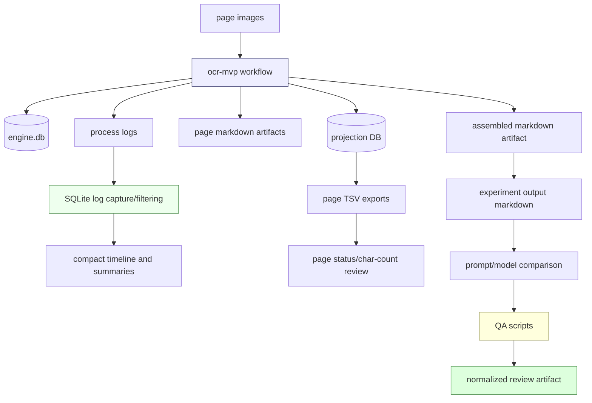
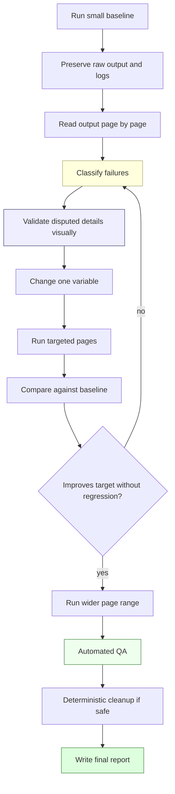
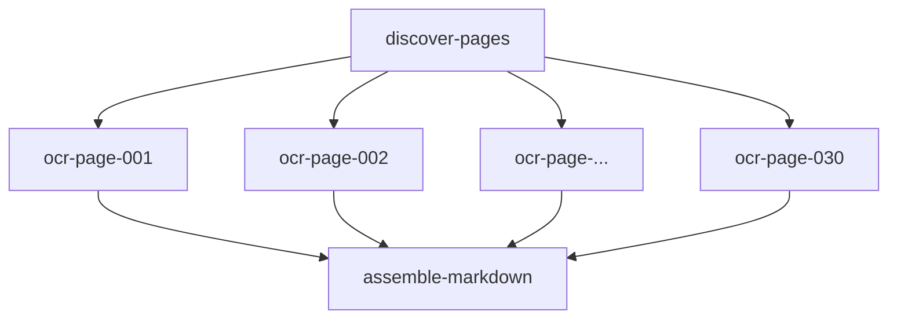
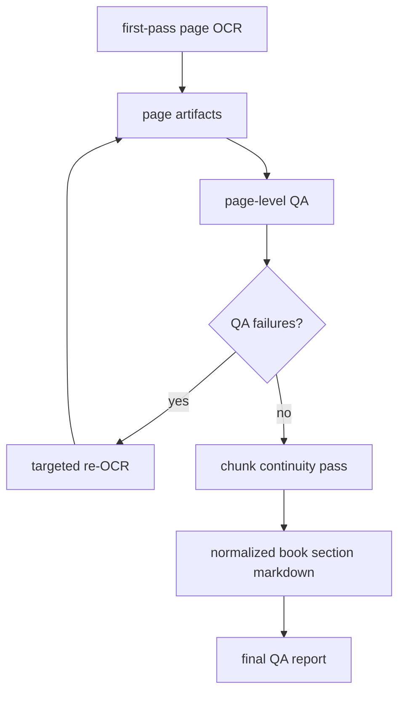
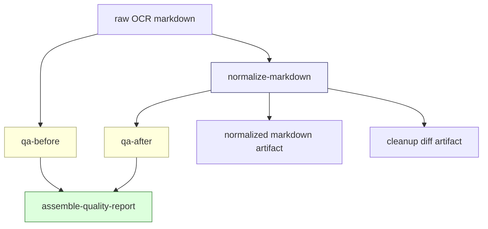
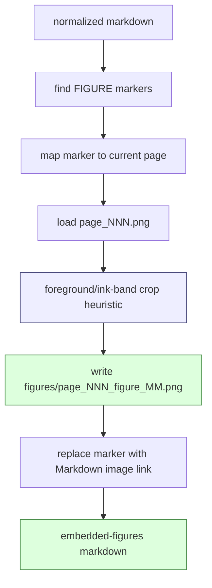

# Book OCR Quality Lab: Prompt Optimization, SQLite Log Filtering, and Experiment Provenance

This report documents the full quality loop for `BOOK-OCR-HQ-001`, the experiment that turned the OCR MVP into a structured book OCR quality lab for the first 30 pages of MIT Technical Report 794, *Presentation Based User Interfaces* by Eugene C. Ciccarelli IV.

The important outcome is not just that the first 30 pages were OCRed. The important outcome is that the process became measurable and repeatable. Each run has a manifest, prompt record, logs, SQLite summaries, exported projections, markdown artifacts, comparison notes, diary entries, and final QA. The work progressed from a successful but uneven baseline to a selected high-quality artifact through a sequence of prompt, model, logging, vision-validation, and deterministic cleanup experiments.

> [!summary]
> 1. The quality loop started with a 30-page `gpt-5-nano-low` baseline and exposed concrete failures: list-page style drift, title/blank-page policy ambiguity, noisy SSE logs, and book-specific OCR mistakes.
> 2. The optimization loop improved one failure class at a time: first page-type rules, then list-page diplomatic transcription, then model selection, then a Report 794 lexicon, then deterministic QA and cleanup.
> 3. The selected raw OCR output is Experiment 007; the selected deterministic text cleanup is Experiment 008, which normalizes list-page dot leaders without hiding the raw model output.
> 4. The follow-up `OCR-QUALITY-WORKERS-001` ticket promoted the Python QA/cleanup scripts into Go workflow-native workers, added bounded surrounding-page OCR context, and produced a current embedded-figure review artifact.
> 5. The reusable lesson is that prompt optimization should be run as an evidence-preserving experiment system, not as a sequence of unrecorded prompt edits.

## Concrete locations

The ticket workspace is:

```text
/home/manuel/workspaces/2026-05-20/book-ocr/2026-05-20--book-ocr/ttmp/2026/05/24/BOOK-OCR-HQ-001--high-quality-book-ocr-experiment-system
```

The source page images are:

```text
/home/manuel/code/wesen/claw-stuff/output/books/presentation-based-uis/pages
```

The workflow implementation is in:

```text
/home/manuel/workspaces/2026-05-20/book-ocr/scraper/pkg/workflows/ocrmvp
/home/manuel/workspaces/2026-05-20/book-ocr/scraper/cmd/ocr-mvp/main.go
```

The final report in the ticket is:

```text
/home/manuel/workspaces/2026-05-20/book-ocr/2026-05-20--book-ocr/ttmp/2026/05/24/BOOK-OCR-HQ-001--high-quality-book-ocr-experiment-system/analysis/01-final-ocr-quality-report.md
```

The best raw model output is:

```text
experiments/007-quality-v4-mini-pages-001-030/outputs/01-final-quality-v4-mini-pages-001-030.md
```

The best deterministic text-only review artifact from `BOOK-OCR-HQ-001` is:

```text
experiments/008-deterministic-continuity-cleanup/outputs/02-final-quality-v4-mini-pages-001-030-normalized.md
```

The current embedded-figure review artifact from the follow-up `OCR-QUALITY-WORKERS-001` ticket is:

```text
/home/manuel/workspaces/2026-05-20/book-ocr/2026-05-20--book-ocr/ttmp/2026/05/24/OCR-QUALITY-WORKERS-001--port-ocr-qa-and-cleanup-scripts-to-go-workflow-workers/experiments/001-go-quality-pass-embedded-figures/outputs/02-embedded-figures.md
```

## The problem this project actually solved

The OCR MVP had already proven that `scraper` could call Geppetto directly, resolve Pinocchio profiles, process page images, store page artifacts, assemble markdown, and expose operator commands. That was necessary infrastructure. It was not sufficient for high-quality book OCR.

High-quality book OCR is a different class of problem. It is not solved by one successful provider call. A successful provider call can still produce output that is inconsistent, hard to inspect, or subtly wrong. The quality problem includes at least five separate concerns:

1. **Transcription fidelity**: visible text should be captured accurately.
2. **Page-type policy**: title pages, intentionally blank pages, table-of-contents pages, figure-list pages, prose pages, and diagram pages need different output rules.
3. **Cross-page consistency**: pages that form one logical structure should not drift in style from page to page.
4. **Operational evidence**: prompts, logs, artifacts, failures, and retries must be preserved.
5. **Review ergonomics**: outputs must be easy to compare, query, and audit without re-running expensive provider calls.

The quality lab was created because these concerns cannot be handled by terminal scrollback and ad hoc prompt changes. They require a controlled experiment loop.

## High-level pipeline

The final system has three layers: workflow execution, experiment evidence, and quality review.



The workflow is responsible for execution. The experiment folders are responsible for provenance. The QA scripts are responsible for repeatable checks. Keeping those roles separate was one of the main reasons the work stayed understandable.

## Experiment directory contract

The ticket eventually accumulated many experiment folders. Each experiment is a durable unit of evidence, not just a temporary run.

A representative folder contains:

```text
experiments/007-quality-v4-mini-pages-001-030/
├── manifest.yaml
├── prompts/
│   └── 01-quality-v4-report794-lexicon-prompt.md
├── logs/
│   ├── run-capture.sqlite
│   └── 01-run-capture-summary.md
├── outputs/
│   ├── 01-final-quality-v4-mini-pages-001-030.md
│   ├── pages.tsv
│   └── timeline.tsv
└── notes.md
```

The contract matters because prompt optimization is otherwise impossible to reconstruct. A future reviewer must be able to answer:

- Which model was used?
- Which prompt version was used?
- Which pages were processed?
- Which profile registry was used?
- Where is the raw output?
- Where are the logs?
- Which failures were observed?
- Why was the next experiment different?

The manifest answers the setup questions. The prompt file answers the input question. The output artifact answers the result question. The logs and projections answer operational questions. The notes answer quality questions.

## The first baseline and the profile registry failure

The intended baseline was a direct 30-page run with `gpt-5-nano-low` and the initial universal OCR prompt:

```bash
cd /home/manuel/workspaces/2026-05-20/book-ocr/scraper

go run ./cmd/ocr-mvp run \
  --book-id presentation-based-uis-hq-001-baseline \
  --image-dir /home/manuel/code/wesen/claw-stuff/output/books/presentation-based-uis/pages \
  --work-dir /tmp/book-ocr-hq-001/001-baseline-single-page \
  --start-page 1 \
  --end-page 30 \
  --profile gpt-5-nano-low \
  --max-workers 2
```

That first run failed before meaningful OCR output. The local Pinocchio profile registry had duplicate `gpt-5-nano-low` keys:

```text
yaml: unmarshal errors:
  line 278: mapping key "gpt-5-nano-low" already defined at line 181
```

This failure was useful. It separated infrastructure configuration failure from OCR quality failure. The OCR workflow had not failed because the prompt was bad or the model could not read pages. It failed because the profile registry was invalid.

The correct experiment response was:

1. Preserve the failed log.
2. Convert the failed log into SQLite.
3. Record the error in the diary.
4. Create a temporary clean profile registry.
5. Re-run with `--profile-registries /tmp/book-ocr-hq-001/profiles-clean.yaml`.
6. Do not commit the temporary profile registry, because profile files can contain sensitive provider settings.

The successful baseline command became:

```bash
go run ./cmd/ocr-mvp run \
  --book-id presentation-based-uis-hq-001-baseline-clean \
  --image-dir /home/manuel/code/wesen/claw-stuff/output/books/presentation-based-uis/pages \
  --work-dir /tmp/book-ocr-hq-001/001-baseline-single-page-clean \
  --start-page 1 \
  --end-page 30 \
  --profile gpt-5-nano-low \
  --profile-registries /tmp/book-ocr-hq-001/profiles-clean.yaml \
  --max-workers 2
```

The baseline completed:

```text
workflow_id: ocr-mvp-593bf5b6-19c6-4c8c-b631-b48a2d1aba78
status: succeeded
page_count: 30
final_markdown_chars: 43857
```

The copied baseline artifact is:

```text
experiments/001-baseline-single-page/outputs/01-final-baseline-clean.md
```

## The first major operational lesson: logs must become data

The baseline run produced a log with 8687 lines. Most of those lines were not useful for human quality review.

The summary was:

```text
Total lines loaded: 8687
trace lines: 8443
non-trace workflow events: 69
warning/error/failure rows: 0
```

The trace rows were provider streaming deltas. They are useful for debugging the provider adapter. They are not useful when reviewing whether the Table of Contents is formatted correctly.

The first log filter script was:

```text
scripts/01-filter-ndjson-log-to-sqlite.py
```

It loads raw NDJSON-style logs into SQLite using a flat table:

```sql
create table log_events (
    line_no integer primary key,
    level text,
    event text,
    workflow_id text,
    op_id text,
    site text,
    queue text,
    attempt integer,
    workflow_status text,
    message text,
    error_code text,
    retryable text,
    time text,
    raw text not null,
    parsed integer not null
);
```

The useful review query is simple:

```sql
select line_no, time, level, event, op_id, attempt, message
from log_events
where coalesce(event, '') != ''
  and level != 'trace'
order by line_no;
```

The failure query is also simple:

```sql
select line_no, time, op_id, attempt, error_code, message
from log_events
where level in ('warn','error')
   or event like '%failed%'
order by line_no;
```

This was the first important pattern: do not inspect noisy OCR runs through terminal output. Capture logs as data, then query them.

Later, after more live runs produced too much terminal output, this idea was pushed one step earlier in the pipeline with:

```text
scripts/02-run-ocr-capture-log.py
```

That script runs the command and stores stdout/stderr lines directly in SQLite while only printing compact progress. The command pattern became:

```bash
python3 scripts/02-run-ocr-capture-log.py logs/run-capture.sqlite -- \
  go run ./cmd/ocr-mvp run ... --log-level warn
```

The OCR CLI also gained `--log-level`, so noisy zerolog trace/debug/info rows could be suppressed at source:

```text
--log-level warn
```

This two-part logging change mattered for the rest of the optimization loop. Without it, every provider run would have produced too much terminal noise to inspect comfortably.

## Baseline quality assessment

After the baseline succeeded, the next step was not another run. The next step was to read the output.

The key baseline problems were in the front matter and list pages:

- The Table of Contents pages used inconsistent structure.
- Page 6 used one style; page 7 used another.
- Chapter headings drifted between markdown headings, bullets, and plain text.
- The Table of Figures pages changed formatting across pages 8 and 9.
- Figure entries did not preserve one stable `Figure N-M: Title ... page` style.
- Blank/title-page policy was ambiguous.
- Footer folios and visible page numbers needed explicit rules.

This is the point where prompt optimization became grounded in evidence. The issue was not "make OCR better". The issue was a concrete set of page-type and continuity failures.

The important pages were:

```text
page_001.png  title page
page_002.png  intentionally blank page with visible sentence
page_006.png  Table of Contents, first page
page_007.png  Table of Contents continuation
page_008.png  Table of Figures, first page
page_009.png  Table of Figures continuation
```

The vision tool was used to validate pages 6-9. That validation confirmed that the OCR review was not just a text-format preference. The scan itself had visible list structures, page numbers, and labels that needed to be preserved consistently.

## Prompt v2: page-type rules

The first prompt improvement was `ocr-quality-v2`.

The goal of v2 was to encode page-type policy directly into the OCR prompt. The baseline prompt was too generic. It told the model to transcribe a scanned page into clean markdown, preserve headings and paragraphs, avoid standalone page numbers, and insert image markers. That was enough to get text. It was not enough to handle front matter.

The v2 prompt added explicit rules for:

- title pages;
- blank or intentionally blank pages;
- Table of Contents pages;
- Table of Figures pages;
- body text;
- figures and diagrams;
- tables;
- markdown style;
- footer/page-number exclusion;
- a quality checklist.

The targeted v2 experiment was:

```text
experiments/002-quality-v2-targeted
page_range: 1-9
profile: gpt-5-nano-low
prompt_version: ocr-quality-v2
```

v2 improved several things:

- Page 2 became `[BLANK PAGE]` in one run instead of a prose explanation.
- Page 8 stopped using markdown bullets for the Table of Figures.
- Page 9 kept a more similar non-bullet figure-entry style.
- A misspelling of `Ciccarelli` was fixed.
- The title page was no longer replaced with an image marker.

But v2 also exposed new problems:

- Page 1 became too visually literal: `Presentation / Based User / Interfaces` was split across lines.
- Page 7 duplicated `Chapter Six: Constructing Presentation Systems`.
- Table of Contents continuation style was still not fully stable.
- Page-number fidelity still needed verification.

This was an important prompt-optimization lesson: a prompt that fixes one policy can create a new policy error. The right response is not to throw away the whole experiment. The right response is to classify the new failure.

v2 showed that page-type specificity helped. It also showed that the prompt needed a stronger distinction between *visual layout preservation* and *readable text normalization*.

## Prompt v3: list-page diplomatic transcription

The next prompt was `ocr-quality-v3-list-diplomatic`.

The purpose of v3 was narrower than v2. It focused on list pages. The prompt instructed the model to treat Table of Contents and Table of Figures pages as diplomatic plain-text lists:

- no markdown bullets;
- no markdown headings for list rows;
- one entry per visible row;
- preserve chapter titles, section numbers, figure labels, punctuation, dot leaders or spacing, and final page numbers;
- continuation pages must use the same style as the first list page;
- never duplicate a chapter title line.

It also added a normalization policy:

- prefer readable markdown over visual line wrapping for normal prose;
- join wrapped title lines when they are clearly one phrase;
- do not duplicate a line unless it is visibly repeated.

The v3 targeted run with `gpt-5-nano-low` was:

```text
experiments/003-quality-v3-list-diplomatic
page_range: 1-9
profile: gpt-5-nano-low
prompt_version: ocr-quality-v3-list-diplomatic
```

v3 improved structure:

- Page 1 became a readable title page: `Presentation Based User Interfaces`.
- Page 6 became a plain-text Table of Contents.
- Page 7 no longer duplicated the Chapter Six line.
- Page 8 and page 9 became plain-text Table of Figures pages.

But v3 with `gpt-5-nano-low` still made visual-recognition mistakes:

- `Figure 4-1: Dired Model` had the wrong page number in one output.
- `Steamer` became `Streamer`.
- `PSBase` became `PPSBase`.
- Some acronym casing remained fragile.

At this point the failure class changed. The prompt policy was better. The remaining defects were small visual-recognition and domain-vocabulary errors.

## Vision validation of the hard details

The vision tool was then used to check the specific disputed details.

For page 002, the question was whether the page was truly blank. The answer was no: the page visibly contains:

```text
This blank page was inserted to preserve pagination.
```

That changed the blank-page policy. A truly blank page can become `[BLANK PAGE]`. An intentionally blank page with a visible sentence should transcribe the visible sentence.

For page 006, the vision tool confirmed:

```text
Chapter One: Introduction and Overview — page 8
1.1 The Primitive Presentation System Model — page 9
```

For page 008, it confirmed:

```text
Figure 4-1: Dired Model — page 72
Figure 4-9: Sample Steamer Schematic — page 91
Figure 5-1: PSBase Support of PPS Components — page 101
```

These observations became requirements for the next iterations. They also became expected strings in the final QA script.

## Model comparison: nano versus mini

The next experiment changed the model while keeping the v3 prompt.

The targeted list-page model comparison was:

```text
experiments/004-quality-v3-mini-list-pages
page_range: 6-9
profile: gpt-5-mini-low
prompt_version: ocr-quality-v3-list-diplomatic
```

The result was better than `gpt-5-nano-low` on the hard list pages. The model captured the validated terms and page numbers more reliably:

```text
Figure 4-1: Dired Model ... 72
Figure 4-9: Sample Steamer Schematic ... 91
Figure 5-1: PSBase Support of PPS Components ... 101
```

Then the same model/prompt combination was run over pages 1-9:

```text
experiments/005-quality-v3-mini-frontmatter
page_range: 1-9
profile: gpt-5-mini-low
prompt_version: ocr-quality-v3-list-diplomatic
```

That full front-matter run was mostly strong, but still produced a case regression:

```text
DiRed
```

This was the next lesson: even after model selection improves visual fidelity, known book-specific terms need to be stabilized. The right response was not another generic prompt. The right response was a small lexicon.

## Prompt v4: Report 794 lexicon

The final prompt iteration was `ocr-quality-v4-report794-lexicon`.

It kept the v3 list-page rules and added a book-specific vocabulary:

```text
The report title is "Presentation Based User Interfaces".
The author is "Eugene C. Ciccarelli IV" or "Eugene Charles Ciccarelli IV" when visible.
Use "PSBase" for the presentation system base acronym.
Use "PPS" only for the Primitive Presentation System acronym, for example "PPS Model" or "PPSCalc".
Use "Dired" exactly, not "DiRed".
Use "Steamer" exactly, not "Streamer".
Use "Zmacs" exactly.
Use "Xerox Star" exactly.
```

It also refined the blank-page rule:

```text
Blank page with no visible text: output exactly [BLANK PAGE].
Intentionally blank page with a visible sentence: transcribe the visible sentence exactly; do not replace it with [BLANK PAGE].
```

This is the kind of prompt change that should be made only after observation. A book-specific lexicon is powerful, but it should not be guessed too early. It should be added once the output shows repeated domain-vocabulary mistakes.

The targeted v4 run was:

```text
experiments/006-quality-v4-lexicon-list-pages
page_range: 6-9
profile: gpt-5-mini-low
prompt_version: ocr-quality-v4-report794-lexicon
```

It fixed the known list-page vocabulary problems.

Then the full first-30-page v4 run was:

```text
experiments/007-quality-v4-mini-pages-001-030
page_range: 1-30
profile: gpt-5-mini-low
prompt_version: ocr-quality-v4-report794-lexicon
```

The run completed successfully:

```text
run id: ocr-mvp-4c5c9406-926a-4ecd-a6b2-e8fedba847d8
page_count: 30
projection rows: 30 done
final_markdown_chars: 51063
```

The selected raw output is:

```text
experiments/007-quality-v4-mini-pages-001-030/outputs/01-final-quality-v4-mini-pages-001-030.md
```

## What improved by the end

The final v4 mini output improved the observed failures in a concrete way.

### Title page

The earlier title-page issue was that the model could either treat the page as an image-like object or preserve visual line breaks too literally.

The selected output gives readable text:

```text
Technical Report 794

Presentation Based User Interfaces

Eugene C. Ciccarelli IV

MIT Artificial Intelligence Laboratory
```

### Intentionally blank page

The final rule distinguishes between truly blank pages and visible blank-page notices.

The selected output for page 002 is:

```text
This blank page was inserted to preserve pagination.
```

That matches the scan according to vision validation.

### Table of Contents

The baseline had style drift. The final output uses a plain-text list rather than markdown bullets or headings:

```text
Chapter One: Introduction and Overview..........................................................8
1.1 The Primitive Presentation System Model....................................................9
1.2 Constructing Larger Presentation System Models......................................16
```

The deterministic cleanup later normalizes this for review:

```text
Chapter One: Introduction and Overview ... 8
1.1 The Primitive Presentation System Model ... 9
1.2 Constructing Larger Presentation System Models ... 16
```

### Table of Figures

The final output preserves the validated hard entries:

```text
Figure 4-1: Dired Model .................................................. 72
Figure 4-9: Sample Steamer Schematic .................................... 91
Figure 5-1: PSBase Support of PPS Components ............................ 101
```

The normalized review artifact renders these as:

```text
Figure 4-1: Dired Model ... 72
Figure 4-9: Sample Steamer Schematic ... 91
Figure 5-1: PSBase Support of PPS Components ... 101
```

### Known bad terms

The final QA checked for known regressions:

```text
DiRed
Streamer
PPSBase
Ciccarrelli
[IMAGE:
```

The final selected output had zero hits.

### Diagram pages

The final output uses concise figure markers for diagrams. Vision spot-checking confirmed that pages 13 and 15 had the expected captions and major labels.

For page 013:

```text
Figure 1-1: A Rudimentary User Interface
[FIGURE: Diagram showing users represented by circles labeled "T" connected to an Application Data Base with arrows labeled "queries", "observables", and "commands"]
```

For page 015:

```text
Figure 1-2: The Representation Shift Model
```

with the major diagram concepts visible in the scan: Presenter, Recognizer, Presentation Data Base, Application Data Base, Presentation Editor, GET-DB, LOAD-DB, and All info in DB.

## Deterministic QA and cleanup

After Experiment 007, the next step was deliberately not another OCR prompt. The result was already good enough that further prompt changes risked regressions.

The remaining issue was review ergonomics. Dot leaders were irregular because the model tried to approximate the visual alignment from the scan. That is understandable OCR behavior, but it makes the markdown harder to read and compare.

Experiment 008 added two scripts:

```text
scripts/03-qa-ocr-markdown.py
scripts/04-normalize-ocr-markdown.py
```

The QA script checks:

- page marker count and continuity;
- known bad terms;
- expected strings;
- adjacent duplicate non-empty lines;
- list-page markdown bullet drift;
- list-page markdown heading drift;
- figure marker count.

The cleanup script does one narrow transformation: it normalizes list-page dot leaders on pages 006-009.

The transformation is auditable:

```text
Figure 4-1: Dired Model .................................................. 72
```

becomes:

```text
Figure 4-1: Dired Model ... 72
```

The cleanup does not call a model. It does not rewrite prose. It writes a patch:

```text
experiments/008-deterministic-continuity-cleanup/outputs/03-cleanup-diff.patch
```

The normalized review artifact is:

```text
experiments/008-deterministic-continuity-cleanup/outputs/02-final-quality-v4-mini-pages-001-030-normalized.md
```

Both pre-cleanup and post-cleanup QA passed:

```text
Page markers found: 30
Expected page markers: 30
Figure markers: 2
Known bad term checks: pass
Expected string checks: pass
Adjacent duplicate non-empty lines: pass
List pages 006-009: no markdown bullets, no markdown headings
```

## The final selected artifacts

There are two selected artifacts, because they serve different purposes.

Use this for exact model provenance:

```text
experiments/007-quality-v4-mini-pages-001-030/outputs/01-final-quality-v4-mini-pages-001-030.md
```

Use this for human review and downstream markdown reading:

```text
experiments/008-deterministic-continuity-cleanup/outputs/02-final-quality-v4-mini-pages-001-030-normalized.md
```

This distinction is important. The normalized artifact is not a replacement for raw evidence. It is a review derivative. The raw artifact remains the record of what the model produced.

## The prompt optimization loop as a reusable method

The most reusable part of this work is the optimization loop. The sequence should be repeated for future OCR prompt work.



The concrete rules are below.

### Rule 1: Start with an intentionally boring baseline

The baseline should be simple. It should not include every possible trick. The purpose is to reveal failure modes.

For this project, the baseline was the original universal OCR prompt with `gpt-5-nano-low`. It was not perfect, but it provided a stable comparison target.

Do not skip the baseline. Without it, there is no evidence that later complexity helped.

### Rule 2: Preserve the failed runs

The duplicate profile registry failure was preserved. That mattered because it prevented confusion later. The failure was configuration-related, not OCR-quality-related.

Failed runs should produce artifacts too:

- failed log SQLite database;
- failure summary;
- diary entry;
- error message copied verbatim.

A failed run can still teach something operational.

### Rule 3: Convert logs into queryable data

Provider logs can be too large for normal review. In this project, one successful run had 8443 trace-level SSE rows.

The rule for future work is:

```text
Never use terminal scrollback as the primary evidence store for OCR experiments.
```

Use SQLite capture/filtering. Keep full raw logs. Query them into summaries.

### Rule 4: Do not optimize from vibes

Every prompt change should be tied to a named failure.

Examples from this project:

| Failure | Prompt/model response |
| --- | --- |
| Title page became image-like or too visually split | Add title/front-matter rules and readable-title normalization. |
| Page 002 was treated as blank even though it has visible text | Distinguish truly blank pages from visible intentionally-blank notices. |
| ToC/ToF pages drifted between markdown styles | Add diplomatic list-page rules. |
| Chapter Six duplicated | Add explicit no-duplicate-line rule for list pages. |
| `Steamer` became `Streamer` | Add Report 794 lexicon. |
| `Dired` became `DiRed` | Add Report 794 lexicon and use `gpt-5-mini-low`. |
| Dot leaders were irregular | Use deterministic cleanup, not another OCR prompt. |

This is the central discipline: change one thing because one observed thing failed.

### Rule 5: Use targeted runs before full runs

The expensive mistake is to rerun 30 or 200 pages after every prompt edit. Most prompt changes should be tested on the pages that expose the failure.

For this project:

- pages 1-9 were enough for front matter;
- pages 6-9 were enough for Table of Contents / Table of Figures;
- pages 13 and 15 were useful for diagram spot-checking;
- page 30 checked the Chapter Two transition.

Only after v4 performed well on targeted pages did it make sense to run pages 1-30.

### Rule 6: Separate prompt-policy failures from model-capacity failures

This was one of the most important discoveries.

v2 and v3 fixed prompt-policy failures. They taught the model what kind of output was wanted.

After that, the remaining defects were small recognition mistakes:

- page numbers;
- acronym spelling;
- capitalization of known names.

Those improved by switching from `gpt-5-nano-low` to `gpt-5-mini-low` and adding a book-specific lexicon.

If a prompt clearly expresses the policy and the model still misreads small text, more prompt wording may not be the right fix. Use a better model, add a lexicon, or add post-OCR QA.

### Rule 7: Use vision validation on disputed details

The vision tool was not used to inspect every page. It was used when a detail mattered:

- Is page 002 blank or does it contain a sentence?
- Is `Dired Model` on page 72 or 75?
- Is it `Steamer` or `Streamer`?
- Is it `PSBase` or `PPSBase`?
- Do diagram pages contain the major labels the OCR described?

That is the correct role for visual validation during prompt optimization. Use it to resolve concrete uncertainty.

### Rule 8: Add deterministic cleanup only after the raw OCR stabilizes

The dot-leader cleanup came at the end. It would have been premature at the beginning.

At the beginning, the system still had transcription and style failures. At the end, the remaining problem was representation: the raw output had irregular but mostly correct dot leaders.

A deterministic cleanup pass is appropriate when:

- the raw content is good;
- the cleanup rule is narrow;
- the diff is preserved;
- QA is run before and after;
- the raw artifact remains available.

It is not appropriate for silently fixing uncertain OCR content.

### Rule 9: Keep diary entries at experiment boundaries

The diary was not just administrative. It recorded why each iteration happened. That matters because prompt optimization involves many near-misses.

A useful diary entry should include:

- what changed;
- why it changed;
- what worked;
- what failed;
- exact errors;
- exact commands;
- what needs review;
- next-step rationale.

This made it possible to write the final report without reconstructing the process from memory.

## Implementation details

### OCR prompt dispatch

The prompt versions live in:

```text
scraper/pkg/workflows/ocrmvp/prompt.go
```

The structure is deliberately simple:

```go
func RenderPagePrompt(input PageOCRInput) string {
    version := normalizePromptVersion(input.PromptVersion)
    switch version {
    case PromptVersionQualityV4Report794Lexicon:
        return renderQualityV4Report794LexiconPrompt(input, version)
    case PromptVersionQualityV3ListDiplomatic:
        return renderQualityV3ListDiplomaticPrompt(input, version)
    case PromptVersionQualityV2:
        return renderQualityV2Prompt(input, version)
    default:
        return renderUniversalV1Prompt(input, version)
    }
}
```

This made experiments selectable from the CLI without editing code between runs:

```bash
--prompt-version ocr-quality-v4-report794-lexicon
```

The CLI flag is in:

```text
scraper/cmd/ocr-mvp/main.go
```

### Runtime execution shape

The OCR workflow has a simple DAG shape:



Each page step writes markdown and projection data. The assemble step gathers page outputs into one markdown artifact.

### Direct log capture

The direct capture script stores process output into SQLite:

```text
scripts/02-run-ocr-capture-log.py
```

It preserves both JSON and non-JSON lines. This matters because the CLI prints plain status lines such as:

```text
started run ocr-mvp-...
status=running processed=...
assemble result: {...}
```

Those lines are not zerolog JSON, but they are operationally useful.

### QA script

The QA script is intentionally conservative:

```text
scripts/03-qa-ocr-markdown.py
```

It should not claim the OCR is perfect. It should report likely regressions.

Its checks are simple:

```python
KNOWN_BAD_TERMS = [
    "DiRed",
    "Streamer",
    "PPSBase",
    "Ciccarrelli",
    "[IMAGE:",
]

EXPECTED_STRINGS = [
    "Presentation Based User Interfaces",
    "This blank page was inserted to preserve pagination.",
    "Figure 4-1: Dired Model",
    "Figure 4-9: Sample Steamer Schematic",
    "Figure 5-1: PSBase Support of PPS Components",
    "Chapter Two",
    "The Primitive Presentation System (PPS) Model",
    "2.1 PPSCalc",
]
```

This is not a general OCR metric. It is a regression test for known failure classes.

### Cleanup script

The cleanup script is also narrow:

```text
scripts/04-normalize-ocr-markdown.py
```

The core line normalization is:

```python
return f"{label} ... {page}"
```

for list-page rows that already have dot leaders or large spacing before a page number.

This kind of deterministic cleanup is safe because it does not decide what the text says. It only normalizes how known list rows connect labels to page numbers.

## Failure modes spotted during the loop

The work surfaced several useful OCR failure modes.

### Failure mode: visible intentionally blank page treated as blank

The model can obey a blank-page rule too strongly. Page 002 is visually a blank-page notice, not a truly blank page. The correct output is the visible sentence.

Future prompt rule:

```text
Blank page with no visible text: output [BLANK PAGE].
Intentionally blank page with visible text: transcribe the visible text.
```

### Failure mode: table/list pages become markdown outlines

A model trained to produce clean markdown may turn a Table of Contents into markdown headings or bullets. That is not always desired. For OCR, a Table of Contents is often best represented as a plain-text diplomatic list.

Future prompt rule:

```text
Table of Contents and Table of Figures pages are list transcriptions, not markdown outlines.
```

### Failure mode: continuation pages drift

Page 7 and page 9 do not necessarily repeat the heading from page 6 and page 8. The model may invent continuity headings or change style.

Future prompt rule:

```text
If a continuation page does not visibly repeat a heading, do not invent one. Keep the same row style as the previous list page.
```

### Failure mode: known acronyms are close to other known acronyms

`PSBase` and `PPS` both occur in this report. A naive correction rule could break one while fixing the other. The v4 prompt explicitly says:

```text
Use PSBase for the presentation system base acronym.
Use PPS only for the Primitive Presentation System acronym, for example PPS Model or PPSCalc.
```

This is a pattern for lexicons: include disambiguation, not just a list of preferred spellings.

### Failure mode: small text page numbers drift

Even with a good prompt, small ToC/ToF page numbers are easy to misread. This is where model selection helped.

Future rule:

```text
If the page is list-heavy and page-number accuracy matters, test a stronger model on the hard list pages before running the whole book.
```

### Failure mode: log noise hides useful retries

The baseline had an `ocr-page-007` retry. That is important, but it is easy to miss inside thousands of SSE trace rows.

Future rule:

```text
Always summarize retries/failures from structured logs or projections, not by scrolling raw logs.
```

## What to do next time

For the next prompt-optimization project, use this sequence.

### Step 1: Build an experiment folder before running the model

Create:

```text
experiments/NNN-short-name/
├── manifest.yaml
├── prompts/
├── logs/
├── outputs/
└── notes.md
```

Do this before running the command. Do not rely on `/tmp` as the only evidence store.

### Step 2: Run a small baseline

Start with a simple prompt and a small page range that includes the hard page types.

For a book, include:

- title page;
- blank or intentionally blank page;
- table of contents;
- table of figures;
- first prose chapter page;
- at least one diagram page;
- at least one page transition.

### Step 3: Capture logs into SQLite from the beginning

Use direct capture:

```bash
python3 scripts/02-run-ocr-capture-log.py logs/run-capture.sqlite -- \
  go run ./cmd/ocr-mvp run ... --log-level warn
```

Do not wait until logs become annoying.

### Step 4: Read the output manually

Automated QA cannot replace manual reading. Read the output and write down concrete defects. Do not change the prompt yet.

Useful categories:

- page-type policy;
- heading policy;
- list/table policy;
- figure/caption policy;
- footer/page-number policy;
- known vocabulary;
- line wrapping;
- duplicate lines;
- invented text;
- omitted visible text.

### Step 5: Use vision validation for disputed details

Ask the vision tool narrow questions:

- "Is this page actually blank?"
- "What is the page number for this ToC entry?"
- "Is the word Steamer or Streamer?"
- "Does this figure caption exist?"

Do not ask it to generally grade the whole output unless the question is scoped.

### Step 6: Change exactly one main variable

One experiment should primarily change one thing:

- prompt policy;
- model profile;
- page range;
- context strategy;
- cleanup pass.

If multiple things change, the result is harder to interpret.

### Step 7: Run targeted pages first

Use the smallest page set that contains the failure. For this project, pages 6-9 were enough for list-page work.

### Step 8: Promote only after targeted success

Only run 30 pages or the full book after the targeted run improves the failure without introducing obvious regressions.

### Step 9: Add QA checks from observed failures

QA should start from actual failures. In this project, the final bad-term checks came from real observed regressions:

```text
DiRed
Streamer
PPSBase
Ciccarrelli
[IMAGE:
```

Do not make QA too abstract too early. Start with concrete regressions.

### Step 10: Preserve raw and cleaned outputs separately

If a cleanup pass is added, keep:

- raw model output;
- normalized output;
- diff;
- QA before cleanup;
- QA after cleanup.

This prevents deterministic cleanup from becoming hidden editing.

## What should be built next

The next quality jump should be a real continuity workflow rather than another prompt tweak.

The design should look like this:



The continuity pass should receive:

- the raw page markdown;
- page numbers;
- neighboring page text;
- known vocabulary;
- table/list page classifications;
- figure/caption markers;
- QA findings.

It should produce:

- cleaned section-level markdown;
- a patch or structured edit list;
- warnings for uncertain corrections;
- updated QA results.

The key is that the second pass should not silently rewrite OCR. It should be an auditable transformation.

## Follow-up: porting the quality loop into Go workers

After `BOOK-OCR-HQ-001` closed, the next improvement was to promote the successful Python experiment scripts into first-class Go workflow workers. This happened in the follow-up ticket:

```text
/home/manuel/workspaces/2026-05-20/book-ocr/2026-05-20--book-ocr/ttmp/2026/05/24/OCR-QUALITY-WORKERS-001--port-ocr-qa-and-cleanup-scripts-to-go-workflow-workers
```

The important shift is that QA and cleanup are no longer external scripts that happen to inspect a markdown file. They are now workflow-native steps that can be registered, run, retried, inspected, and preserved through the same artifact machinery as the OCR workflow itself.

The new package is:

```text
/home/manuel/workspaces/2026-05-20/book-ocr/scraper/pkg/workflows/ocrquality
```

It currently provides:

- page-aware markdown splitting;
- OCR markdown QA checks;
- known bad term checks;
- expected string checks;
- adjacent duplicate line checks;
- list-page markdown bullet/heading drift checks;
- deterministic list-page dot-leader normalization;
- NDJSON/plain log import summaries with optional SQLite output;
- an `ocr-quality` workflow package;
- a CLI entry point through `ocr-mvp quality-pass`.

The quality-pass command is intentionally shaped like the experiment scripts, but it writes both local files and workflow artifacts:

```bash
go run ./cmd/ocr-mvp quality-pass \
  --markdown RAW.md \
  --output-dir OUT \
  --work-dir WORK \
  --book-id presentation-based-uis-hq-007-v4-mini-30 \
  --expected-pages 30
```

The workflow shape is:



This matters because the OCR system can now treat quality checks as part of the workflow graph. The next natural step is to use typed QA findings to decide which pages should be retried, which pages should be manually reviewed, and which pages can move into a continuity or section-level cleanup pass.

## Follow-up: bounded surrounding-page context for OCR

The follow-up work also added a bounded context mechanism to the OCR MVP. The new `--context-window` option lets each target page include previous and next page images in the Geppetto multimodal call. The prompt explicitly says that the first image is the target page and any additional images are context only.

The command shape is:

```bash
go run ./cmd/ocr-mvp run \
  --book-id presentation-based-uis-context-window-test \
  --image-dir /home/manuel/code/wesen/claw-stuff/output/books/presentation-based-uis/pages \
  --start-page 6 \
  --end-page 9 \
  --profile gpt-5-mini-low \
  --profile-registries /tmp/book-ocr-hq-001/profiles-clean.yaml \
  --prompt-version ocr-quality-v4-report794-lexicon \
  --context-window 1 \
  --log-level warn
```

This is a continuity lever, not a default policy change. It is useful for tables of contents, continued lists, and pages where a heading or figure reference depends on neighboring pages. It is also risky: a model can accidentally transcribe text from a context page. For that reason, the default remains `--context-window 0`, and context-window runs should be compared against the v4 mini baseline with both automated QA and visual spot checks.

The relevant implementation paths are:

```text
scraper/pkg/workflows/ocrmvp/types.go
scraper/pkg/workflows/ocrmvp/discover.go
scraper/pkg/workflows/ocrmvp/geppetto_ocr.go
scraper/pkg/workflows/ocrmvp/prompt.go
scraper/cmd/ocr-mvp/main.go
```

## Follow-up: embedded extracted figures

The other major improvement was embedded figure extraction. The first 30-page OCR artifact contained two figure markers. The text-only artifact preserved them as semantic placeholders, but a high-quality book OCR output should preserve the visual diagrams themselves.

The new figure worker scans normalized markdown for figure markers, tracks the current page marker, loads the corresponding source page image, crops a figure region, writes a PNG into a `figures/` directory, and replaces the marker with a normal Markdown image link.

The current embedded artifact is:

```text
/home/manuel/workspaces/2026-05-20/book-ocr/2026-05-20--book-ocr/ttmp/2026/05/24/OCR-QUALITY-WORKERS-001--port-ocr-qa-and-cleanup-scripts-to-go-workflow-workers/experiments/001-go-quality-pass-embedded-figures/outputs/02-embedded-figures.md
```

The extracted figure images are:

```text
/home/manuel/workspaces/2026-05-20/book-ocr/2026-05-20--book-ocr/ttmp/2026/05/24/OCR-QUALITY-WORKERS-001--port-ocr-qa-and-cleanup-scripts-to-go-workflow-workers/experiments/001-go-quality-pass-embedded-figures/outputs/figures/page_013_figure_01.png
/home/manuel/workspaces/2026-05-20/book-ocr/2026-05-20--book-ocr/ttmp/2026/05/24/OCR-QUALITY-WORKERS-001--port-ocr-qa-and-cleanup-scripts-to-go-workflow-workers/experiments/001-go-quality-pass-embedded-figures/outputs/figures/page_021_figure_01.png
```

The Markdown now contains ordinary image links:

```markdown


```

The command used for the embedded-figure pass was:

```bash
go run ./cmd/ocr-mvp quality-pass \
  --markdown /home/manuel/workspaces/2026-05-20/book-ocr/2026-05-20--book-ocr/ttmp/2026/05/24/BOOK-OCR-HQ-001--high-quality-book-ocr-experiment-system/experiments/007-quality-v4-mini-pages-001-030/outputs/01-final-quality-v4-mini-pages-001-030.md \
  --output-dir /tmp/ocr-quality-go-figures/out \
  --work-dir /tmp/ocr-quality-go-figures/work \
  --book-id presentation-based-uis-hq-007-v4-mini-30 \
  --expected-pages 30 \
  --image-dir /home/manuel/code/wesen/claw-stuff/output/books/presentation-based-uis/pages \
  --embed-figures
```

The figure cropper went through several iterations. The first version used a broad non-white bounding box and included page margins, scanner artifacts, and page numbers. The second focused on the dominant ink band but cut off important parts of Figure 1-4. The final first-pass version uses meaningful image ink bands with footer suppression so that page numbers are removed while the full diagrams remain visible.



The final crops were checked with the vision tool. The check confirmed that the page numbers and footers were removed and that the complete diagrams remained present. This is good enough for the current first-30-page artifact, but it is not yet a full-book figure segmentation system.

## Segmentation improvements still needed

The current figure extraction is a first pass. It is a page-level crop heuristic, not a semantic figure detector. That is acceptable for the two simple figure pages in the first 30 pages. It will not be sufficient for the full book without more segmentation work.

The next segmentation improvements should be:

1. **Connected-component candidate extraction.** Threshold the image, remove noise, find connected components, merge nearby components into candidate regions, and score them by size, density, aspect ratio, and distance from page furniture.
2. **Explicit page-furniture suppression.** Detect recurring bottom page numbers, running headers, punch-hole shadows, scanner borders, and margin artifacts instead of relying only on fixed cutoffs.
3. **Caption-aware matching.** Use OCR text or markdown captions to match `Figure 1-4` style markers to nearby visual regions.
4. **Multiple figures per page.** Emit `FigureExtraction[]` candidates rather than assuming one large page crop per marker.
5. **Debug overlays.** For every extracted figure, write a sidecar JSON and an overlay PNG showing candidate regions, ignored footer zones, and the selected rectangle.
6. **Figure QA warnings.** Flag crops that are too large, too small, too blank, too close to the full page, likely include a footer, or fail to match the number of figure markers.
7. **Optional enhancement pass.** Preserve raw crops but optionally emit contrast-enhanced crops for faint diagrams.

The desired future figure artifact shape is:

```text
figures/page_013_figure_01.raw.png
figures/page_013_figure_01.enhanced.png
figures/page_013_figure_01.json
figures/page_013_figure_01.debug.png
```

The JSON sidecar should record the source page, crop rectangle, method, warnings, and confidence. The debug overlay should make segmentation failures inspectable without re-running the workflow.

## Updated final state

`BOOK-OCR-HQ-001` is complete, and `OCR-QUALITY-WORKERS-001` has promoted the most valuable follow-up pieces into Go workflow infrastructure.

The ticket is closed. `docmgr doctor` passes. All code and documentation changes were committed.

Important commits in the docs repository include:

```text
97f1259 Diary: record OCR v4 quality run
4957796 Diary: add OCR QA cleanup pass
f828196 Docs: finalize OCR quality report
3b0e7bb Docs: close OCR quality ticket
```

Important scraper commits include:

```text
6e05ee1 Add OCR quality v3 list prompt
8e76419 Add Report 794 OCR lexicon prompt
eb19a40 Add OCR quality workflow workers
509c8f5 Add OCR figure embedding worker
5c044e6 Add frontmatter to OCR quality reports
```

Important follow-up docs commits include:

```text
a97496d Docs: plan OCR quality workers
a564c8e Docs: record OCR figure embedding pass
```

The selected text-only review artifact is:

```text
/home/manuel/workspaces/2026-05-20/book-ocr/2026-05-20--book-ocr/ttmp/2026/05/24/BOOK-OCR-HQ-001--high-quality-book-ocr-experiment-system/experiments/008-deterministic-continuity-cleanup/outputs/02-final-quality-v4-mini-pages-001-030-normalized.md
```

The raw provenance artifact is:

```text
/home/manuel/workspaces/2026-05-20/book-ocr/2026-05-20--book-ocr/ttmp/2026/05/24/BOOK-OCR-HQ-001--high-quality-book-ocr-experiment-system/experiments/007-quality-v4-mini-pages-001-030/outputs/01-final-quality-v4-mini-pages-001-030.md
```

The current embedded-figure review artifact is:

```text
/home/manuel/workspaces/2026-05-20/book-ocr/2026-05-20--book-ocr/ttmp/2026/05/24/OCR-QUALITY-WORKERS-001--port-ocr-qa-and-cleanup-scripts-to-go-workflow-workers/experiments/001-go-quality-pass-embedded-figures/outputs/02-embedded-figures.md
```

The final lesson is straightforward: prompt optimization worked because it was treated as an experiment system. The prompt text mattered, but the surrounding process mattered just as much: preserve evidence, inspect failures, validate visually, change one thing at a time, run targeted pages first, finish with repeatable QA, and then promote successful scripts into workflow-native workers.
