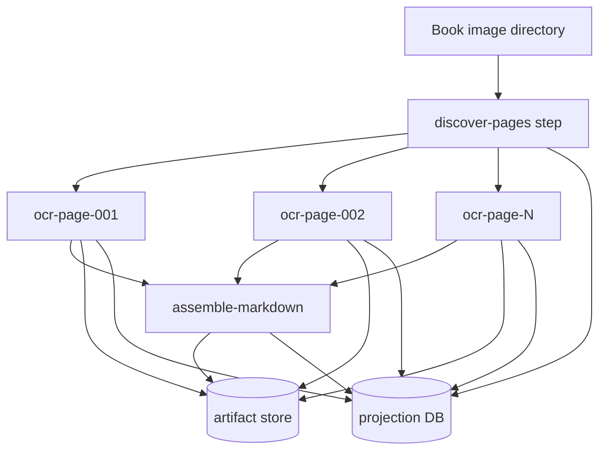
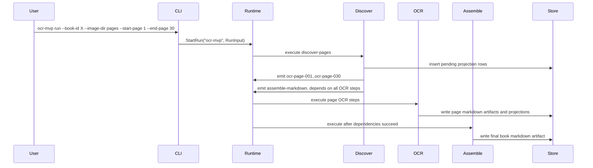
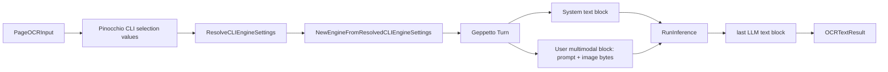
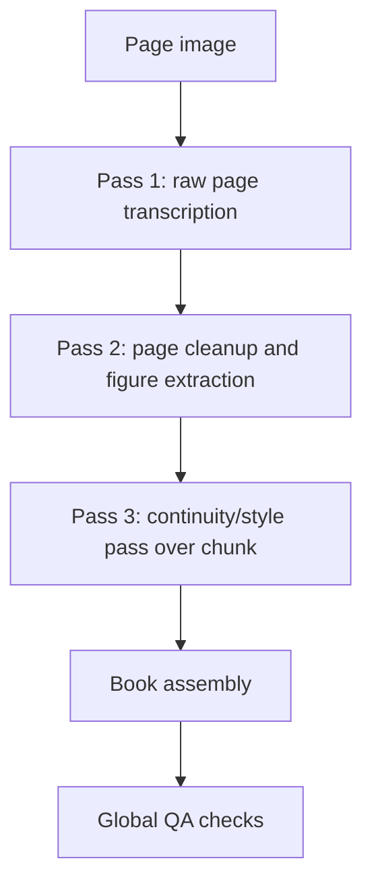
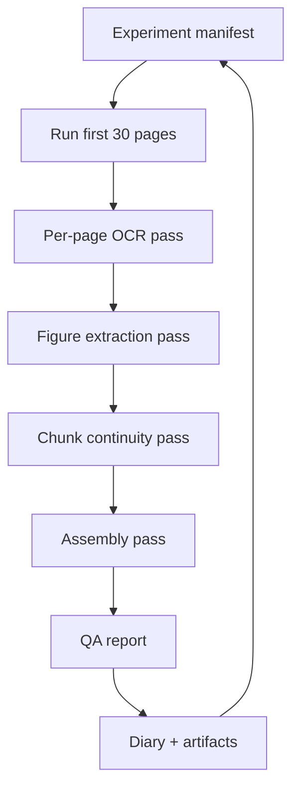

# Building Book OCR on the Scraper Job System: Workflow Runtime Deep Dive

This is the Book OCR workflow integration branch of the [[scraper]] project map.

This note is a deep technical report on turning `scraper` from a scraping-oriented durable job engine into a workflow runtime that can run book OCR campaigns. The concrete implementation lives in `/home/manuel/workspaces/2026-05-20/book-ocr/scraper`, and the first OCR workflow package lives under `scraper/pkg/workflows/ocrmvp`.

> [!summary]
> 1. The important shift was from "enqueue jobs" to "run inspectable workflows": a book is a workflow, each page is a step, artifacts are first-class outputs, and projections are queryable operator state.
> 2. The OCR MVP proves the runtime with a real Geppetto/Pinocchio-backed provider path and a dry-run path for deterministic tests.
> 3. The next frontier is quality, not plumbing: prompts, page context, multi-page continuity, figures, chunking, evaluation, and retry workflows.

## Why this report exists

Book OCR looks deceptively simple. The naive version is a loop: render pages, send each page image to a model, concatenate the model outputs. That loop works for a ten-page smoke test, but it breaks down when the goal is a high-quality book transcription. Books have running headers, footnotes, diagrams, mathematical notation, front matter, blank pages, page numbers, hyphenation, paragraph continuations, section titles, and style conventions that span many pages. A good OCR system must remember what it is doing.

The work captured here created the foundation for that system. Instead of writing one Python script per experiment, we made OCR a durable workflow package inside `scraper`. That means the system can know which pages succeeded, which failed, which prompt version produced each artifact, which model profile was used, and how to retry a single page without throwing away the whole run.

This report explains the architecture as if the reader is joining the project now. It is not just a changelog. It is a map of the mental model, the runtime, the OCR package, the provider integration, and the quality work that should happen next.

## The core mental model

A book OCR campaign is not one job. It is a small graph of jobs with durable state.



The runtime stores scheduling state in `engine.db`. Each step result is durable. Large outputs go into an external artifact store. Human-facing page state goes into a projection database. This separation matters because the scheduler, the artifact reader, and the operator view have different jobs.

| Concern | Storage | Why it exists |
| --- | --- | --- |
| Workflow and step status | `engine.db` | Lets the scheduler lease work, retry failures, and mark workflows terminal. |
| Page markdown and final book markdown | `artifacts/` | Keeps large generated text out of the engine DB while preserving durable references. |
| Page-level operator state | `projections/ocr-mvp.db` | Lets humans ask: which pages are done, failed, blank, or suspicious? |
| Prompt/model provenance | Step input, step metadata, projection columns, artifacts | Lets experiments be compared rather than guessed about. |

The important design decision is that workflow steps are not anonymous tasks. They have stable names such as `discover-pages`, `ocr-page-047`, and `assemble-markdown`. A failed page can be retried by name. A page projection row can point back to the exact step and artifact. This is the difference between a script and an operator-friendly workflow.

## From scraper engine to workflow runtime

The original scraper engine already had many of the hard parts: durable workflows, operations, queues, leases, retry state, and an engine view service. The new workflow API wraps those internals in a smaller Go-facing surface.

The files to read first are:

- `/home/manuel/workspaces/2026-05-20/book-ocr/scraper/pkg/workflow/runtime.go`
- `/home/manuel/workspaces/2026-05-20/book-ocr/scraper/pkg/workflow/package.go`
- `/home/manuel/workspaces/2026-05-20/book-ocr/scraper/pkg/workflow/context.go`
- `/home/manuel/workspaces/2026-05-20/book-ocr/scraper/pkg/workflow/executor.go`
- `/home/manuel/workspaces/2026-05-20/book-ocr/scraper/pkg/workflow/artifact_store.go`
- `/home/manuel/workspaces/2026-05-20/book-ocr/scraper/pkg/workflow/projection_store.go`
- `/home/manuel/workspaces/2026-05-20/book-ocr/scraper/pkg/workflow/operators.go`

The runtime API is intentionally small. A package registers an entrypoint and executors. The entrypoint creates initial steps. Executors read typed input, do work, write results, optionally emit more steps, and optionally write artifacts or projections.

In pseudocode, a workflow package looks like this:

```go
func Register(rt *workflow.Runtime, cfg Config) error {
    rt.RegisterPackage(Package())
    rt.RegisterExecutor(DiscoverPagesExecutor(cfg.ProjectionName))
    rt.RegisterExecutor(OCRPageExecutor(cfg.ProjectionName, cfg.Client))
    rt.RegisterExecutor(AssembleMarkdownExecutor(cfg.ProjectionName))
    return nil
}

func Package() *workflow.Package {
    return workflow.NewPackage("ocr-mvp").
        Entrypoint(workflow.EntrypointFunc[RunInput](func(ctx context.Context, run *workflow.RunBuilder, input RunInput) error {
            run.Metadata("book_id", input.BookID)
            _, err := run.Step("discover-pages", input, workflow.StepOpts{
                Kind:  KindDiscoverPages,
                Queue: QueueControl,
            })
            return err
        })).
        Build()
}
```

Notice what is absent. The package does not manually insert SQL rows. It does not know how leases work. It does not know which worker will run a step. It describes the workflow in domain terms: discover pages, OCR pages, assemble markdown.

## The OCR MVP package

The OCR MVP lives in `/home/manuel/workspaces/2026-05-20/book-ocr/scraper/pkg/workflows/ocrmvp`. Its type definitions are in `types.go`.

The run input is the public contract:

```go
type RunInput struct {
    BookID            string   `json:"book_id"`
    ImageDir          string   `json:"image_dir"`
    PageGlob          string   `json:"page_glob,omitempty"`
    StartPage         int      `json:"start_page,omitempty"`
    EndPage           int      `json:"end_page,omitempty"`
    Profile           string   `json:"profile,omitempty"`
    ProfileRegistries []string `json:"profile_registries,omitempty"`
    PromptVersion     string   `json:"prompt_version,omitempty"`
    DryRun            bool     `json:"dry_run,omitempty"`
}
```

This contract encodes the first useful boundary: PDF rendering is out of scope. The workflow consumes a directory of page images, typically named `page_001.png`, `page_002.png`, and so on. That keeps the first implementation focused on OCR quality rather than document rendering.

The step graph is produced dynamically. `discover-pages` reads the directory, infers page numbers, filters by `StartPage` and `EndPage`, seeds the projection database with pending page rows, emits one OCR step per page, and emits one assembly step that depends on all page OCR steps.



The current assembly step is deliberately simple. It reads dependency results, sorts by page number, and concatenates page markdown with page comments:

```markdown
<!-- page:001 -->

...

<!-- page:002 -->

...
```

This is enough to prove the runtime and to inspect page outputs. It is not yet enough for high-quality book production, because it does not repair cross-page continuity, normalize figure references, merge broken paragraphs, or apply a style pass. Those are the next experiments.

## Provider integration: Geppetto and Pinocchio

The live OCR client is in `geppetto_ocr.go`. It is intentionally not a shell-out to `pinocchio`. It uses Pinocchio's profile bootstrap code directly, then builds a Geppetto engine and runs inference on a multimodal turn.

The path is:



This detail matters because profile resolution is part of user ergonomics. The workflow should honor the same default registries, config files, environment variables, and profile names that Pinocchio users already rely on. The `RunInput.Profile` field is optional. If it is empty, the resolver uses Pinocchio's normal defaults.

The current page prompt is in `prompt.go`:

```text
Transcribe this scanned book/report page into clean markdown.

Rules:
1. Output only markdown. No commentary.
2. Preserve headings, paragraphs, footnotes, citations, math, code, and tables.
3. If the page is blank, output an empty string.
4. If an image/figure/diagram appears, insert exactly one single-line marker:
   [IMAGE: concise description of what the figure shows]
5. Do not include standalone page numbers.
6. Do not duplicate text.
7. Do not add text that is not visible on the page.
```

A live two-page smoke test on `/home/manuel/code/wesen/claw-stuff/output/books/presentation-based-uis/pages` succeeded with the default configured OpenAI Responses-backed `gpt-5-nano` path. Page 1 was recognized as a title page, page 2 as a blank pagination page, and the final artifact was written to `/tmp/ocr-mvp-live-presentation-two-pages/artifacts/assemble-markdown/artifact/001`.

The important lesson from that test is that provider wiring works. It also revealed the next quality issue: the model described the title page as `[IMAGE: ...]` instead of transcribing only the visible text. That is not a runtime bug. It is a prompt and evaluation problem.

## The operator surface

The OCR CLI lives in `/home/manuel/workspaces/2026-05-20/book-ocr/scraper/cmd/ocr-mvp/main.go`. It is intentionally small and separate from the main scraper CLI while the workflow is still experimental.

The command supports:

```bash
go run ./cmd/ocr-mvp run \
  --book-id presentation-based-uis \
  --image-dir /path/to/pages \
  --work-dir /tmp/ocr-work \
  --profile gpt-5-nano-low \
  --start-page 1 \
  --end-page 30 \
  --max-workers 2
```

Operator commands reuse the same work directory:

```bash
go run ./cmd/ocr-mvp status --work-dir /tmp/ocr-work --run-id RUN_ID
go run ./cmd/ocr-mvp pages  --work-dir /tmp/ocr-work --book-id presentation-based-uis
go run ./cmd/ocr-mvp retry  --work-dir /tmp/ocr-work --run-id RUN_ID --step-id ocr-page-017
go run ./cmd/ocr-mvp cancel --work-dir /tmp/ocr-work --run-id RUN_ID
```

This is the minimum useful operational loop. Run the workflow, inspect pages, retry the failed or low-quality steps, and keep the artifacts. The UI/API integration is not first-class yet. The persistence model is ready for it, but the existing scraper web UI does not yet have an OCR-specific trigger page, page projection view, artifact viewer, or retry buttons.

## Testing strategy

The project has two testing modes, and both are necessary.

The first is deterministic testing with a fake OCR client. That is how `package_test.go` verifies page discovery, workflow execution, artifact writing, projection updates, and final assembly without provider credentials. These tests should remain fast and boring. If they fail, the runtime or package logic is broken.

The second is opt-in live testing. Live provider calls are expensive, slower, and dependent on local credentials and profile configuration. They should not run during normal `go test ./...`. The current live smoke path is a manual CLI run or the guarded test in `geppetto_ocr_test.go`.

The working rule is simple:

- Use fake OCR to test workflow mechanics.
- Use live OCR to test provider integration and quality.
- Record live experiment outputs in named work directories so they can be inspected later.

## What makes high-quality OCR different

The MVP proves that the machine can turn page images into markdown. High quality requires a second layer of thinking. A book is not a bag of pages; it is a sequence.

The next system should introduce at least four additional ideas.

### 1. Page context windows

A page often starts mid-sentence or ends mid-paragraph. A single-page prompt cannot always know whether to add a paragraph break, continue a bullet list, or preserve a hyphenated word. A better strategy is to give each page a small context envelope:

```text
previous page tail: last 300-800 characters of accepted markdown
current page image: page N
next page hint: optional OCR draft or image thumbnail for page N+1
style guide: current book-level transcription conventions
```

The page output should still be page-local, but the model should know enough to avoid obvious continuity mistakes.

### 2. Multi-pass transcription

The first model call should not be responsible for everything. A robust pipeline separates concerns:



Pass 1 should be conservative: transcribe what is visible. Pass 2 can normalize markdown and extract figure descriptions. Pass 3 can repair cross-page style and continuity over a 3-10 page chunk. Global QA can look for missing pages, duplicated headers, inconsistent heading levels, and suspiciously short outputs.

### 3. Figure extraction as structured data

The current `[IMAGE: ...]` marker is useful but too weak. A better figure representation has structure:

```json
{
  "figure_id": "page-012-figure-01",
  "page": 12,
  "kind": "diagram",
  "bbox_hint": "center of page",
  "caption_text": "Figure 3: ...",
  "description": "A block diagram showing ...",
  "referenced_by_text": true
}
```

The markdown can still contain a readable marker, but the projection/artifact layer should keep the structured figure metadata. That lets an operator review figures separately from prose.

### 4. Experiment provenance

Prompt iteration without provenance becomes folklore. Every experiment should write down:

- prompt version,
- profile,
- page range,
- chunking strategy,
- number of calls per page,
- artifacts produced,
- observed failures,
- qualitative score,
- what changed in the next run.

The workflow runtime already has the right places for this: step metadata, projection rows, artifact metadata, and the ticket diary.

## Recommended next architecture for quality experiments

The next ticket should not replace the MVP. It should build a quality lab around it.



A good experiment directory might look like this:

```text
ttmp/.../BOOK-OCR-HQ-001/
├── design-doc/
│   └── 01-high-quality-book-ocr-system.md
├── reference/
│   └── 01-diary.md
├── experiments/
│   ├── 001-baseline-single-page/
│   │   ├── manifest.yaml
│   │   ├── prompts/
│   │   ├── outputs/
│   │   ├── logs/
│   │   └── notes.md
│   ├── 002-context-window/
│   └── 003-chunk-style-pass/
└── scripts/
    ├── 01-run-experiment.sh
    └── 02-summarize-quality.py
```

The manifest should be explicit:

```yaml
experiment_id: 002-context-window
book_id: presentation-based-uis
pages: 1-30
profile: gpt-5-mini-low
strategy:
  page_pass: image-plus-previous-tail
  previous_tail_chars: 800
  chunk_pass: 5 pages
  figure_mode: structured-json-plus-marker
metrics:
  manual_review_pages: [1, 2, 3, 10, 20, 30]
  checks:
    - missing_page_markers
    - duplicate_running_headers
    - suspicious_short_pages
    - unclosed_code_blocks
```

## Failure modes to watch

The first live smoke test already showed one quality failure: the prompt allowed the model to classify a title page as an image. Future experiments should look for these recurring problems:

- Title pages become image descriptions instead of text.
- Blank pages produce explanatory prose instead of empty output or a controlled marker.
- Running headers and footers are included inconsistently.
- Page numbers leak into the markdown.
- Paragraphs split across pages become two unrelated paragraphs.
- Hyphenated line endings are preserved when they should be joined, or joined when they are real hyphenated terms.
- Figures are described but captions are lost.
- Tables collapse into unreadable prose.
- Headings drift in level across pages.
- Footnotes lose their anchor relationship.
- The model invents connective text to make pages read smoothly.

A useful OCR lab makes these failures visible. It should not rely on a human remembering what looked wrong in a terminal scrollback.

## Working rules for the next phase

The next phase should follow these rules:

- Start with the first 30 pages, not the whole book.
- Keep every experiment in its own folder.
- Save prompts, raw outputs, cleaned outputs, logs, and review notes.
- Use `gpt-5-nano-low` for cheap baseline experiments and `gpt-5-mini-low` when quality or reasoning seems insufficient.
- Do not judge quality only by whether the workflow succeeded. A successful workflow can produce bad OCR.
- Do not overwrite artifacts from earlier prompt versions. Compare them.
- Add structure before adding cleverness: experiment manifests, page projections, and QA reports first; complex multi-agent flows later.

## Current status

The foundation is working.

Implemented commits in `scraper` include:

- `bc6baa2` — workflow executor facade
- `4dd7846` — workflow runtime skeleton
- `18cda60` — operator controls
- `35165de` — artifact store
- `0292d2c` — projection store
- `f827d63` — OCR MVP workflow skeleton
- `0f3b045` — Geppetto OCR client
- `6a21bc3` — profile selection wiring tests
- `8a067f9` — OCR MVP CLI
- `5d0934a` — OCR MVP operator subcommands

The main remaining gaps are deliberate:

- OCR is not yet wired into the main scraper web UI.
- The prompt is still a baseline prompt.
- Assembly is concatenation, not a continuity-aware book-building pass.
- Figures are text markers, not structured extracted objects.
- There is no formal quality scoring harness yet.

Those gaps are the right next work. The runtime foundation is no longer the bottleneck; quality iteration is.

## Near-term next steps

1. Create a new high-quality OCR ticket and experiment workspace.
2. Write a design guide that explains the system to a new intern.
3. Run baseline `gpt-5-nano-low` or `gpt-5-mini-low` OCR on pages 1-30.
4. Review outputs and record failures in the diary.
5. Iterate on prompts and context windows.
6. Add a chunk continuity pass.
7. Add structured figure extraction.
8. Produce a first high-quality 30-page markdown artifact plus a QA report.

## Related project files

- `/home/manuel/workspaces/2026-05-20/book-ocr/scraper/pkg/workflow/runtime.go`
- `/home/manuel/workspaces/2026-05-20/book-ocr/scraper/pkg/workflow/package.go`
- `/home/manuel/workspaces/2026-05-20/book-ocr/scraper/pkg/workflow/context.go`
- `/home/manuel/workspaces/2026-05-20/book-ocr/scraper/pkg/workflow/artifact_store.go`
- `/home/manuel/workspaces/2026-05-20/book-ocr/scraper/pkg/workflow/projection_store.go`
- `/home/manuel/workspaces/2026-05-20/book-ocr/scraper/pkg/workflow/operators.go`
- `/home/manuel/workspaces/2026-05-20/book-ocr/scraper/pkg/workflows/ocrmvp/package.go`
- `/home/manuel/workspaces/2026-05-20/book-ocr/scraper/pkg/workflows/ocrmvp/discover.go`
- `/home/manuel/workspaces/2026-05-20/book-ocr/scraper/pkg/workflows/ocrmvp/executors.go`
- `/home/manuel/workspaces/2026-05-20/book-ocr/scraper/pkg/workflows/ocrmvp/geppetto_ocr.go`
- `/home/manuel/workspaces/2026-05-20/book-ocr/scraper/cmd/ocr-mvp/main.go`
- `/home/manuel/workspaces/2026-05-20/book-ocr/2026-05-20--book-ocr/ttmp/2026/05/24/SCRAPER-JOBS-001--general-purpose-task-workflow-job-system-for-scraper`
- `/home/manuel/workspaces/2026-05-20/book-ocr/2026-05-20--book-ocr/ttmp/2026/05/24/OCR-MVP-001--implement-simple-mvp-ocr-workflow-with-new-workflow-api`
