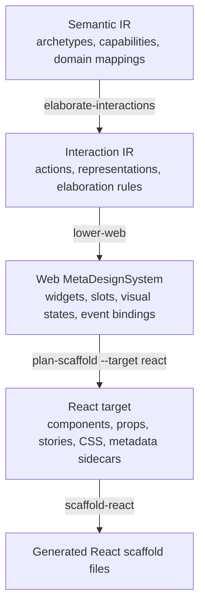

# DMETA Compiler Refactor: Hard Cut to Interaction IR, Web MetaDesignSystem, and React Target

This report explains how the DMETA package was rearchitected from a semantic model plus generic widget generator into a layered design-system compiler. The result is a pipeline with explicit source packages, intermediate representations, lowering passes, target configuration, and provenance-carrying React scaffold output. The work was implemented as a hard cutover. The old `scaffold-instance` command and generic widget renderer were removed rather than kept as compatibility paths.

The central implementation change is simple to state and important to understand: widgets no longer belong to the universal DMETA layer. Universal DMETA now stops at semantic facts and modality-neutral interaction obligations. Web owns Web widgets, slots, visual states, and event bindings. React owns React components, props, files, Storybook stories, CSS modules, and metadata sidecars.

> [!summary]
> - The package now flows through `Semantic IR -> Interaction IR -> Web MetaDesignSystem -> React target` instead of `Semantic IR -> generic widget templates -> React-ish scaffolds`.
> - Interaction IR defines modality-neutral `Action` and `Representation` catalogs plus elaboration rules. It does not mention cards, rows, buttons, CSS, Storybook, or React.
> - The Web MetaDesignSystem owns Web widget templates, lowering rules, slots, visual states, and event bindings. React is a target below Web, not the meaning of DMETA widgets.
> - The old `scaffold-instance` command and generic widget renderer were removed. The active flow is now `plan-instance`, `elaborate-interactions`, `lower-web`, `plan-scaffold --target react`, and `scaffold-react`.

This is not a proposal document. It is an implementation report. It records the final architecture, the code paths that implement it, the validation commands that prove it works, and the design constraints that shaped the hard cutover.

## Why this refactor was necessary

The pre-refactor system had valuable pieces. It had a semantic model, archetype inheritance, capability inheritance, domain examples, Web-oriented widget templates, instance manifests, scaffold generation, and a promoted Street Deli React application. The system was already moving in the right direction: data described semantic structure, instance manifests selected concrete templates, and generated scaffolds carried enough metadata to guide promotion into maintained components.

The problem was that the layers were collapsed. A widget template was treated as a universal DMETA artifact. That made the system work for a React mobile prototype, but it also meant that upstream schema names were doing target-specific work. A semantic capability could lead too directly to a visual artifact. A domain object could become a card, row, badge, or drawer without an explicit intermediate layer describing the user-facing interaction obligation.

The hard architectural rule introduced by this refactor is:

```text
Universal DMETA layers do not define widgets.
```

Universal DMETA layers define semantic facts and interaction obligations. A Web MetaDesignSystem can lower those obligations into Web widgets. A React target can lower Web obligations into React files. Other MetaDesignSystems can be added later without inheriting Web vocabulary.

The main design pressure came from the Street Deli example. A `MenuItem` in the Street Deli model is a semantic subject. It has identity, a label, composition parts, dietary information, configuration options, and availability. The Web application may represent it as a composition card and a customizer. A different interaction system might use a command, formatter, recognizer, terminal row, or another non-Web construct. If the universal layer says `composition_card`, it has already chosen Web UI. The refactor removes that premature decision.

## The new pipeline

The implemented pipeline is now explicit:



Each arrow is implemented by code and exposed through a command. This matters because it makes every transformation inspectable. A developer can validate the source packages, inspect interaction obligations, inspect Web obligations, inspect React plans, and only then write files.

The active commands are:

```bash
go run ./cmd/dmeta validate-ir --root ./sources/dmeta-ir --include-info --output table

go run ./cmd/dmeta validate-interactions \
  --root ./sources/dmeta-ir \
  --include-info \
  --output table

go run ./cmd/dmeta elaborate-interactions \
  --root ./examples/street-deli-ordering \
  --interactions-root ./sources/dmeta-ir \
  --output table

go run ./cmd/dmeta lower-web \
  --root ./examples/street-deli-ordering \
  --interactions-root ./sources/dmeta-ir \
  --web-root ./examples/street-deli-ordering/meta-design-systems/web \
  --output table

go run ./cmd/dmeta plan-scaffold \
  --instance ./examples/street-deli-ordering/instantiations/street-deli-ordering.yaml \
  --target react \
  --output yaml

go run ./cmd/dmeta scaffold-react \
  --instance ./examples/street-deli-ordering/instantiations/street-deli-ordering.yaml \
  --dry-run \
  --output table
```

The removed command is also part of the architecture:

```text
scaffold-instance: removed
```

Removing it prevents the old generic-widget path from remaining an attractive but incorrect default. The CLI now presents target-aware commands instead of a universal widget scaffold command.

## Layer 1: Semantic IR remains the source of domain meaning

The semantic layer still carries archetypes, capabilities, and domain examples. It is implemented through the existing validator package and source files under:

```text
sources/dmeta-ir/core-model/
examples/street-deli-ordering/core-model/
```

The semantic layer answers questions about what a domain subject is and what projections it exposes. It does not answer how Web should render that subject.

A Street Deli `MenuItem` now maps to concrete semantic descendants and concrete capabilities. This was an important validation correction during the refactor. Once the split core-model loader started loading `files.domain_example`, the validator correctly rejected stale mappings to abstract concepts such as `Composition` and `composable`. The domain example was updated to map to concrete descendants:

```yaml
MenuItem:
  description: Composable food item on the menu.
  archetypes:
    - MenuItem
    - ActionSpec
  capabilities:
    ingredient_composable:
      parts: ingredients
      part_count: ingredient_count
      required_roles:
        - structural
        - protein
      ingredient_roles: ingredient_roles
    configurable:
      config_options:
        - name: size
          values: [half, whole]
          default: whole
    dietary:
      dietary_tags: item_dietary_tags
      allergen_contains: item_allergens
```

That correction is not a cosmetic schema change. It enforces a compiler invariant: domain mappings point at concrete semantic facts. Abstract roots organize inheritance. Concrete descendants participate in domain examples and downstream passes.

The semantic validator still resolves inheritance for archetypes and capabilities. That resolution is used by the next layer. A domain type mapped to `ingredient_composable` should still satisfy a selector that asks for `composable`, because `ingredient_composable` inherits from the more general capability. The same applies to concrete archetypes that inherit from abstract parents.

The important implementation files for this layer are:

```text
pkg/dmeta/validator/model.go
pkg/dmeta/validator/load.go
pkg/dmeta/validator/inheritance.go
pkg/dmeta/validator/validate.go
```

The semantic layer is the only layer that should define semantic archetypes and capabilities. It is not responsible for slots, visual states, React props, or generated files.

## Layer 2: Interaction IR makes actions and representations explicit

The new Interaction IR is under:

```text
sources/dmeta-ir/interactions/
  00-index.yaml
  actions.yaml
  representations.yaml
  elaboration-rules.yaml
```

The Go package is:

```text
pkg/dmeta/interaction/
  model.go
  load.go
  validate.go
  elaborate.go
```

Interaction IR exists because semantic facts are not yet UI artifacts. A domain type with `stateful` and `temporal` capabilities implies that the user may need to see lifecycle progress. That obligation is not a Web widget yet. It is a modality-neutral representation obligation.

The central model types are `Action`, `Representation`, and `ElaborationRule`:

```go
type Action struct {
    Description     string             `yaml:"description"`
    LongDescription string             `yaml:"long_description"`
    Extends         []string           `yaml:"extends"`
    Abstract        bool               `yaml:"abstract"`
    Intent          string             `yaml:"intent"`
    Subjects        []SemanticSelector `yaml:"subjects"`
    Inputs          map[string]ActionInput `yaml:"inputs"`
    Effects         ActionEffects      `yaml:"effects"`
    Safety          ActionSafety       `yaml:"safety"`
}

type Representation struct {
    Description     string                `yaml:"description"`
    LongDescription string                `yaml:"long_description"`
    Extends         []string              `yaml:"extends"`
    Abstract        bool                  `yaml:"abstract"`
    Intent          string                `yaml:"intent"`
    Subjects        []SemanticSelector    `yaml:"subjects"`
    Exposes         RepresentationExposes `yaml:"exposes"`
    SupportsActions []string              `yaml:"supports_actions"`
}

type ElaborationRule struct {
    ID          string           `yaml:"id"`
    When        SemanticSelector `yaml:"when"`
    Emits       RuleEmits        `yaml:"emits"`
    Description string           `yaml:"description"`
}
```

The root types `Action` and `Representation` are abstract. Concrete descendants include actions such as `inspect_subject`, `filter_by_dietary`, `remove_part`, `apply_substitution`, and `submit_order`; representations include `compact_reference`, `state_indicator`, `composition_summary`, `ingredient_composition_row`, `substitution_candidate`, and `order_lifecycle_progress`.

The validator checks the shape of the Interaction IR package before elaboration runs. It enforces:

- the abstract `Action` root exists;
- the abstract `Representation` root exists;
- non-root definitions declare `extends`;
- parent references are known;
- inheritance graphs are acyclic;
- representations do not support unknown or abstract actions;
- elaboration rules do not emit unknown or abstract actions or representations.

The elaboration pass then builds domain facts and applies rules. The key flow is:

```text
DomainType
  -> direct archetype facts
  -> inherited archetype facts
  -> direct capability facts
  -> inherited capability facts
  -> default capabilities from archetypes
  -> rule matches
  -> action and representation obligations
```

The practical output is visible through:

```bash
go run ./cmd/dmeta elaborate-interactions \
  --root ./examples/street-deli-ordering \
  --interactions-root ./sources/dmeta-ir \
  --output table
```

For Street Deli, this emits obligations such as:

| Domain type | Representation | Action | Source rule |
|---|---|---|---|
| `MenuItem` | `composition_summary` | `remove_part`, `add_part` | `composable_to_composition_views` |
| `MenuItem` | `configuration_summary` | `change_config` | `configurable_to_configuration_summary` |
| `Order` | `state_indicator` | `filter_by_state` | `stateful_to_state_indicator` |
| `SubstitutionRule` | `substitution_candidate` | `apply_substitution`, `reject_substitution` | `substitutable_to_substitution_candidate` |
| `SubstitutionRule` | `substitution_price_delta` | none | `price_aware_substitution_to_price_delta` |

This table is the first concrete payoff of the compiler structure. It shows that the system can derive interaction requirements from semantic facts without choosing Web widgets.

## Layer 3: The Web MetaDesignSystem owns Web-specific concepts

The Web MetaDesignSystem now lives under:

```text
sources/dmeta-ir/meta-design-systems/web/
examples/street-deli-ordering/meta-design-systems/web/
```

The global Web package defines reusable Web templates and generic Web lowering rules. The Street Deli Web package defines local Web templates and local lowering rules for the mobile ordering flow.

The Go package is:

```text
pkg/dmeta/metadesign/web/
  model.go
  load.go
  validate.go
  lower.go
```

The Web model introduces Web-specific concepts:

```go
type LoweringRule struct {
    ID          string           `yaml:"id"`
    Description string           `yaml:"description"`
    When        LoweringSelector `yaml:"when"`
    Emits       LoweringEmits    `yaml:"emits"`
}

type LoweringSelector struct {
    DomainTypes     []string `yaml:"domain_types"`
    Representations []string `yaml:"representations"`
    Actions         []string `yaml:"actions"`
}

type LoweringEmits struct {
    WidgetTemplates []string `yaml:"widget_templates"`
    Slots           []string `yaml:"slots"`
    VisualStates    []string `yaml:"visual_states"`
    EventBindings   []string `yaml:"event_bindings"`
}
```

This is the exact point where widgets enter the architecture. Not before. A lowering rule can say that `composition_summary` plus `dietary_summary` lowers to `deli.composition_card`, because that is a Web MetaDesignSystem decision.

A Street Deli local lowering rule looks like this:

```yaml
- id: composition_summary_to_deli_card
  description: Composable menu/order items need a tappable composition card.
  when:
    representations: [composition_summary, dietary_summary]
  emits:
    widget_templates: [deli.composition_card]
    slots: [title, description, price, dietary_tags, primary_image]
    visual_states: [default, selected, unavailable]
    event_bindings: [inspect_subject]
```

Another rule maps substitution obligations to a Web widget:

```yaml
- id: substitution_candidate_to_deli_chip
  description: Substitution candidates become suggested replacement chips.
  when:
    representations: [substitution_candidate]
    actions: [apply_substitution, reject_substitution, see_alternatives]
  emits:
    widget_templates: [deli.substitution_chip]
    slots: [candidate_label, rationale, price_delta, apply_control]
    visual_states: [suggested, applied, rejected]
    event_bindings: [apply_substitution, reject_substitution, see_alternatives]
```

The lowering output is inspectable:

```bash
go run ./cmd/dmeta lower-web \
  --root ./examples/street-deli-ordering \
  --interactions-root ./sources/dmeta-ir \
  --web-root ./examples/street-deli-ordering/meta-design-systems/web \
  --output table
```

The output includes rows with this shape:

```text
example: street_deli_ordering
domain_type: MenuItem
widget_template: deli.composition_card
source_rule: composition_summary_to_deli_card
source_representations: composition_summary,dietary_summary
source_actions:
slots: title,description,price,dietary_tags,primary_image
visual_states: default,selected,unavailable
event_bindings: inspect_subject
```

The result is Web-specific but not React-specific. It names Web widget templates, slots, visual states, and event bindings. It does not name `.tsx` files, hooks, reducers, CSS modules, or Storybook stories. Those belong to the React target.

## Layer 4: React is a target under Web

React target configuration lives under the Web MetaDesignSystem:

```text
sources/dmeta-ir/meta-design-systems/web/targets/react.yaml
```

The Go package is:

```text
pkg/dmeta/generator/react/
  model.go
  plan.go
  render.go
  render_test.go
  write.go
```

The target file defines the output defaults, file kinds, and provenance fields:

```yaml
schema_version: 0
artifact_type: dmeta_web_react_target
id: react
name: React Target for the Web MetaDesignSystem
defaults:
  output_dir: ./generated/react
  package_name: dmeta-web-react
  style: css_modules
  storybook: true
  metadata_sidecars: true
file_kinds:
  - component
  - types
  - metadata
  - stories
  - barrel
  - adapter_todo
  - readme
  - package_index
provenance:
  meta_design_system: web
  codegen_target: react
  source_passes:
    - semantic-ir
    - interaction-elaboration
    - web-lowering
    - react-planning
```

The target plan is represented by `ScaffoldPlan`, `ComponentPlan`, and `PlannedFile`:

```go
type ScaffoldPlan struct {
    InstanceID       string
    TargetID         string
    MetaDesignSystem string
    OutputDir        string
    PackageName      string
    Components       []ComponentPlan
    Files            []PlannedFile
}

type ComponentPlan struct {
    TemplateID              string
    ComponentName           string
    Variant                 string
    Slots                   []string
    VisualStates            []string
    EventBindings           []string
    RealizesActions         []string
    RealizesRepresentations []string
    SourceDomainTypes       []string
    SourceRules             []string
    Files                   []PlannedFile
}
```

The planner reads the hard-cut instance manifest, derives semantic and interaction facts, runs Web lowering, then attaches selected component aliases from the instance manifest. The instance still chooses that `deli.composition_card` should become `StreetDeliCompositionCard`; the meaning and provenance come from Web obligations.

The planning command is:

```bash
go run ./cmd/dmeta plan-scaffold \
  --instance ./examples/street-deli-ordering/instantiations/street-deli-ordering.yaml \
  --target react \
  --output yaml
```

A component plan for `StreetDeliCompositionCard` contains:

```yaml
row_kind: component
instance: street_deli_ordering
target: react
meta_design_system: web
template: deli.composition_card
component: StreetDeliCompositionCard
variant: mobile_default
representations: composition_summary,dietary_summary
actions: inspect_subject
domain_types: MenuItem,OrderItem
source_rules: composition_summary_to_deli_card
slots: description,dietary_tags,price,primary_image,title
visual_states: default,selected,unavailable
event_bindings: inspect_subject
file_count: 8
```

The renderer then turns that plan into files. The `scaffold-react` command supports dry-run and write modes:

```bash
go run ./cmd/dmeta scaffold-react \
  --instance ./examples/street-deli-ordering/instantiations/street-deli-ordering.yaml \
  --dry-run \
  --output table
```

The dry run plans 65 files for the Street Deli instance: a package index plus eight component directories with component, types, metadata, Storybook, CSS module, barrel, adapter TODO, and README files.

The React output is intentionally separate from the promoted application:

```text
examples/street-deli-ordering/generated/react/
```

The maintained React application remains under:

```text
examples/street-deli-ordering/www/mobile-react/
```

This separation is part of the generation contract. Generated scaffolds are reviewable starting points. Promoted code remains maintained code and should not be overwritten by broad regeneration.

## The hard-cut instance manifest

The instance manifest changed from a generic widget-generation shape into an explicit compiler-target shape. The active Street Deli manifest is:

```yaml
schema_version: 0
artifact_type: dmeta_instance
id: street_deli_ordering
name: Street Deli Ordering
semantic_root: ..
interactions_root: ../../../sources/dmeta-ir
meta_design_systems:
  web:
    root: ../meta-design-systems/web
    global_root: ../../../sources/dmeta-ir/meta-design-systems/web
    template_files:
      - ../meta-design-systems/web/widgets/menu-browsing.yaml
      - ../meta-design-systems/web/widgets/item-cards.yaml
      - ../meta-design-systems/web/widgets/customization.yaml
      - ../meta-design-systems/web/widgets/modifiers.yaml
      - ../meta-design-systems/web/widgets/substitutions.yaml
      - ../meta-design-systems/web/widgets/ordering.yaml
      - ../meta-design-systems/web/widgets/availability.yaml
      - ../meta-design-systems/web/widgets/tracking.yaml
targets:
  react:
    target_file: ../../../sources/dmeta-ir/meta-design-systems/web/targets/react.yaml
    output_dir: ../generated/react
    package_name: street-deli-ordering-react
```

The old fields were removed:

```text
instance_root: removed
core_model_root: removed
template_sources: removed
generation: removed
```

The new names describe compiler inputs directly:

| Field | Meaning |
|---|---|
| `semantic_root` | The package whose archetypes, capabilities, and domain examples are elaborated. |
| `interactions_root` | The package containing Interaction IR action, representation, and rule catalogs. |
| `meta_design_systems.web.root` | The local Web MetaDesignSystem package used for Web lowering. |
| `meta_design_systems.web.template_files` | Local Web widget template files available to `plan-instance`. |
| `targets.react.target_file` | The React target configuration under the Web MetaDesignSystem. |
| `targets.react.output_dir` | The target-specific generated React output directory. |
| `targets.react.package_name` | The generated React package name. |

This is the manifest-level expression of the architecture. An instance is not a generic widget generation job. It is a concrete selection of semantic package, interaction package, MetaDesignSystem package, and target package.

## The removal of generic widget codegen

The hard cutover removed the old generic scaffold command and renderer. These files were deleted:

```text
pkg/dmeta/cmds/scaffold_instance.go
pkg/dmeta/generator/widgets/render.go
pkg/dmeta/generator/widgets/render_test.go
pkg/dmeta/generator/widgets/write.go
```

The remaining instance-selection code was renamed from:

```text
pkg/dmeta/generator/widgets/
```

to:

```text
pkg/dmeta/instance/
```

This rename matters because package names teach architecture. The old name said that instance planning belonged to a widget generator. The new name says that instance planning is its own concern. It loads manifests, validates selected and excluded templates, checks component aliases, and supports downstream target planning. It does not render React files.

The root CLI now lists:

```text
plan-instance
plan-scaffold
scaffold-react
```

It does not list `scaffold-instance`. Running the old command fails:

```text
Error: unknown command "scaffold-instance" for "dmeta"
```

That failure is intentional. A deprecated alias would keep the old architecture alive. The project is still experimental enough that a hard cut is cheaper and clearer than compatibility support.

## Removing universal generation policy from widgets

The pre-refactor widget model included `WidgetGenerationPolicy` in the universal validator model. Web widget templates could declare fields such as:

```yaml
generation:
  scaffold_mode: adapter_todos
  emit_semantic_metadata: true
  emit_doc_comments: true
  emit_adapter_todos: true
  strict_projection_adapter: false
```

Those fields were removed from active Web templates and from `pkg/dmeta/validator/model.go`. React generation policy now belongs to the React target configuration and renderer path.

This changed projection-hint validation. Previously, a widget could enable strict projection adapter mode, and unresolved required projection hints could become errors. With universal generation policy removed, unresolved projection hints are global authoring warnings. A target can add stricter checks later, but the universal validator should not decide React adapter strictness.

The remaining validation rule is simpler:

```text
A projection hint should resolve to a known effective capability projection.
If it does not, validation reports a warning.
```

This is the correct universal behavior. The semantic and Web layers can warn that a hint is unresolved. The React target can later decide whether unresolved hints are fatal for a particular generated artifact.

## Provenance is now a first-class output

The React renderer produces metadata sidecars that preserve the full path from semantic source to target file. A sidecar for `StreetDeliCompositionCard` has this shape:

```json
{
  "generatedBy": "dmeta scaffold-react",
  "metaDesignSystem": "web",
  "codegenTarget": "react",
  "componentName": "StreetDeliCompositionCard",
  "templateId": "deli.composition_card",
  "variant": "mobile_default",
  "realizes": {
    "representations": ["composition_summary", "dietary_summary"],
    "actions": ["inspect_subject"]
  },
  "web": {
    "slots": ["description", "dietary_tags", "price", "primary_image", "title"],
    "visualStates": ["default", "selected", "unavailable"],
    "eventBindings": ["inspect_subject"]
  },
  "provenance": {
    "domainTypes": ["MenuItem", "OrderItem"],
    "sourceRules": ["composition_summary_to_deli_card"],
    "passes": ["semantic-ir", "interaction-elaboration", "web-lowering", "react-planning"]
  }
}
```

The generated component shells also include data attributes:

```tsx
<section
  data-dmeta-meta-design-system="web"
  data-dmeta-codegen-target="react"
  data-dmeta-widget-template="deli.composition_card"
  data-dmeta-representations="composition_summary,dietary_summary"
  data-dmeta-actions="inspect_subject"
  data-dmeta-visual-state={visualState}
>
```

These fields make the generated artifact auditable. A reviewer can answer:

- Which Web template produced this component?
- Which Interaction IR representations does it realize?
- Which actions are bound as event affordances?
- Which Web lowering rule selected it?
- Which domain types caused it to appear?
- Which compiler passes contributed to this output?

That information was previously scattered across widget templates, instance manifests, and generated comments. It is now explicit target metadata.

## The implementation sequence

The refactor was implemented in a sequence of small, validated commits. The sequence matters because each step created a new boundary before the next step depended on it.

### 1. Move widgets under the Web MetaDesignSystem

The first cut moved widget templates away from the top-level DMETA IR package and under:

```text
sources/dmeta-ir/meta-design-systems/web/widgets/
examples/street-deli-ordering/meta-design-systems/web/widgets/
```

The old top-level widget files were removed. The artifact type changed from a generic widget-template package to Web-specific widget-template artifacts. This step established the rule that widgets are Web artifacts.

### 2. Seed Interaction IR catalogs

The next step added `actions.yaml`, `representations.yaml`, and `elaboration-rules.yaml` under `sources/dmeta-ir/interactions/`. This created the missing modality-neutral layer between semantic facts and Web UI obligations.

### 3. Add Interaction IR loading and validation

The `pkg/dmeta/interaction` package introduced Go models, loaders, and validators. The new `validate-interactions` command made the IR package independently checkable.

### 4. Implement semantic-to-interaction elaboration

The `elaborate-interactions` command connected semantic domain mappings to Interaction IR obligations. This step also fixed `files.domain_example` loading and exposed stale abstract domain mappings in Street Deli, which were then corrected.

### 5. Add Web lowering

The `pkg/dmeta/metadesign/web` package and `lower-web` command lowered interaction obligations to Web widget obligations. This is where slots, visual states, and event bindings entered the pipeline.

### 6. Add React scaffold planning

The React target planner consumed Web obligations and instance-selected component aliases. It produced component plans and planned files without writing anything.

### 7. Add React rendering and writing

The React target renderer added metadata sidecars, components, types, Storybook stories, CSS modules, barrels, adapter TODO files, READMEs, and package index files. The `scaffold-react` command added dry-run and write behavior.

### 8. Hard-cut instance manifests and remove the old scaffold command

The instance manifests were migrated to explicit `semantic_root`, `interactions_root`, `meta_design_systems.web`, and `targets.react` fields. `scaffold-instance` and the generic widget renderer were removed.

### 9. Rename instance planning and remove universal generation policy

The remaining instance/catalog planner moved to `pkg/dmeta/instance`. Universal `WidgetGenerationPolicy` and active Web template `generation` blocks were removed.

The resulting commit history preserves the progression:

```text
7a86716 DMETA-COMPILER-MDS: move widgets under web metadesign system
032c3e7 DMETA-COMPILER-MDS: seed interaction IR catalogs
ce60506 DMETA-COMPILER-MDS: add interaction IR validation
acc409f DMETA-COMPILER-MDS: elaborate semantic facts into interactions
b7b1c94 DMETA-COMPILER-MDS: lower interactions into web obligations
47c7863 DMETA-COMPILER-MDS: plan react scaffolds from web obligations
ac86631 DMETA-COMPILER-MDS: scaffold react target files
2b2da3c DMETA-COMPILER-MDS: hard cut instance manifests to react target
d81c452 DMETA-COMPILER-MDS: rename instance planning and remove widget generation policy
```

## How the commands relate to the code

The command surface is now a readable map of the compiler pipeline.

| Command | Primary package | Responsibility |
|---|---|---|
| `validate-ir` | `pkg/dmeta/validator` | Validate semantic package, design language, and Web template references. |
| `validate-interactions` | `pkg/dmeta/interaction` | Validate action/representation roots, inheritance, references, and rule emissions. |
| `elaborate-interactions` | `pkg/dmeta/interaction` | Build domain facts and emit action/representation obligations. |
| `lower-web` | `pkg/dmeta/metadesign/web` | Lower Interaction IR obligations into Web widget obligations. |
| `plan-instance` | `pkg/dmeta/instance` | Validate selected/excluded Web templates and component aliases. |
| `plan-scaffold --target react` | `pkg/dmeta/generator/react` | Plan React components and files from Web obligations. |
| `scaffold-react` | `pkg/dmeta/generator/react` | Render and optionally write React target files. |

The commands are deliberately narrow. Each one has a clear input and output. This makes it possible to debug the pipeline by stopping after any pass.

For example, if `StreetDeliSubstitutionChip` is not planned, the debugging sequence is direct:

1. Check whether `SubstitutionRule` maps to concrete semantic capabilities.
2. Check whether `elaborate-interactions` emits `substitution_candidate` and substitution actions.
3. Check whether `lower-web` emits `deli.substitution_chip`.
4. Check whether the instance selects `deli.substitution_chip` with an alias.
5. Check whether `plan-scaffold --target react` attaches the Web obligation to the selected alias.
6. Check whether `scaffold-react --dry-run` plans the files.

There is no need to inspect a monolithic generator to infer which phase failed.

## What changed in the Street Deli example

The Street Deli example is still the acceptance test. The promoted React application remains separate from generated scaffolds, and the selected widgets are still the same eight main mobile ordering widgets:

```text
StreetDeliMenuBrowser
StreetDeliCompositionCard
StreetDeliCompositionCustomizer
StreetDeliIngredientRow
StreetDeliSubstitutionChip
StreetDeliOrderCart
StreetDeliOrderTracker
StreetDeliRoleTag
```

What changed is the explanation for why those widgets exist. They are no longer selected directly from semantic context. They are selected because semantic facts elaborate into interaction obligations, interaction obligations lower into Web obligations, and the instance chooses component aliases for selected Web templates.

The Street Deli local Web lowering rules now include the mapping for all selected widgets. For example:

| Selected widget | Source obligation pattern |
|---|---|
| `deli.menu_browser` | `MenuItem` with `composition_summary` and `dietary_summary` |
| `deli.composition_card` | `composition_summary` and `dietary_summary` |
| `deli.composition_customizer` | `composition_breakdown`, `configuration_summary`, and edit actions |
| `deli.ingredient_row` | `ingredient_composition_row`, `role_label`, and remove/undo/alternative actions |
| `deli.substitution_chip` | `substitution_candidate` and substitution actions |
| `deli.order_cart` | `OrderItem` composition/configuration summary |
| `deli.order_tracker` | `Order` state indicator |
| `deli.role_tag` | ingredient role obligations |

The result is a more auditable system. The selected widget list is still explicit, but it no longer carries all the meaning by itself.

## Failure modes the refactor removed

The refactor removed several concrete failure modes.

### Failure mode: generic widgets become universal semantics

Before the hard cut, a reader could interpret widget templates as part of the universal DMETA IR. That would make it reasonable to add more universal widget concepts. The new directory structure prevents that:

```text
sources/dmeta-ir/meta-design-systems/web/widgets/
```

The path says that widgets belong to Web. If a future CLIM or CLI target appears, it should define its own MetaDesignSystem package rather than share Web widgets.

### Failure mode: React policy appears in Web templates

The old `generation` blocks allowed Web templates to declare React scaffold behavior. That made Web templates partly target-specific. Removing `generation` from active Web templates fixes the ownership boundary. Web templates define Web concepts. React target files define React target policy.

### Failure mode: instance manifests hide compiler inputs

The old manifest used `template_sources` and `generation`. Those names described a generator workflow, not a compiler pipeline. The new manifest names show the actual inputs:

```text
semantic_root
interactions_root
meta_design_systems.web
targets.react
```

A reader can now see which package feeds each layer.

### Failure mode: one command hides multiple passes

The old `scaffold-instance` command loaded templates, resolved selection, rendered files, and wrote output. The new command set exposes planning, lowering, rendering, and writing separately. Developers can inspect obligations before files are produced.

### Failure mode: promoted code is confused with generated code

Generated output now defaults to:

```text
examples/street-deli-ordering/generated/react/
```

Promoted code remains under:

```text
examples/street-deli-ordering/www/mobile-react/
```

The separation supports review. Generated scaffolds can be regenerated and inspected. Promoted code is maintained code.

## Current validation status

The hard-cut implementation was validated with the active command set:

```bash
go test ./pkg/dmeta/generator/react/... ./pkg/dmeta/... ./cmd/dmeta -count=1

go run ./cmd/dmeta validate-ir \
  --root ./sources/dmeta-ir \
  --include-info \
  --output table

go run ./cmd/dmeta validate-ir \
  --root ./examples/street-deli-ordering \
  --include-info \
  --output table

go run ./cmd/dmeta plan-instance \
  --instance ./examples/street-deli-ordering/instantiations/street-deli-ordering.yaml \
  --output table

go run ./cmd/dmeta plan-instance \
  --instance ./examples/street-deli-ordering/instantiations/street-deli-coffee-counter.yaml \
  --output table

go run ./cmd/dmeta plan-scaffold \
  --instance ./examples/street-deli-ordering/instantiations/street-deli-ordering.yaml \
  --target react \
  --output yaml

go run ./cmd/dmeta scaffold-react \
  --instance ./examples/street-deli-ordering/instantiations/street-deli-ordering.yaml \
  --dry-run \
  --output table
```

The key outcomes were:

- all Go package tests passed;
- global semantic/Web validation passed;
- Street Deli validation passed;
- both Street Deli instance manifests planned successfully;
- React scaffold planning produced eight component rows;
- `scaffold-react --dry-run` planned 65 files;
- `scaffold-instance` is no longer available.

## Remaining work

The hard cutover is complete enough to establish the new architecture, but there are still cleanup and strengthening tasks.

### Add explicit manifest schema validation

The instance loader now expects hard-cut fields, but validation should produce clear findings for missing fields. The required fields are:

```text
semantic_root
interactions_root
meta_design_systems.web.root
meta_design_systems.web.template_files
targets.react.target_file
targets.react.output_dir
targets.react.package_name
```

This should be part of `pkg/dmeta/instance` rather than hidden inside planner errors.

### Move stricter projection checks into React target policy

Universal validation now reports unresolved projection hints as warnings. If React generation needs strict adapter behavior, the React target should own that policy. The correct place is `sources/dmeta-ir/meta-design-systems/web/targets/react.yaml`, not Web widget templates and not the universal validator.

### Compile a temporary generated React package

`scaffold-react --dry-run` proves planned writes. Metadata writing was tested in a temporary directory. The next stronger target validation would generate a temporary React package and run TypeScript against it. That requires a minimal generated package configuration or integration with the existing `www/mobile-react` toolchain without overwriting promoted components.

### Update current design docs

Some design docs are intentionally historical or transitional. Current docs should be updated so they no longer recommend keeping `scaffold-instance` temporarily. Historical ticket archives can remain unchanged, but active guidance should match the hard-cut state.

### Add a second MetaDesignSystem

The architecture now has a clear extension point. The next proof would be a small non-Web MetaDesignSystem, likely CLIM or CLI. It should consume the same Interaction IR obligations and define a different target-specific lowering path. That would validate that Interaction IR is not Web-specific.

## Working rules for future DMETA changes

The following rules should guide future changes to the package:

- Semantic IR may define archetypes, capabilities, projections, and domain examples. It must not define Web widgets, React components, CSS, Storybook, or visual states.
- Interaction IR may define actions, representations, semantic selectors, action effects, representation projections, and elaboration rules. It must remain modality-neutral.
- Web MetaDesignSystem may define Web widgets, slots, visual states, layout concepts, event bindings, and Web lowering rules.
- React target code may define component names, props, file plans, stories, CSS modules, metadata sidecars, and write behavior.
- Instance manifests should identify the semantic package, interaction package, MetaDesignSystem package, and target package explicitly.
- Generated output should stay separate from promoted maintained code.
- Compatibility aliases should not be added unless there is a concrete external user requirement. The current package is still experimental enough to prefer hard cuts and clear schema changes.

These rules are the main result of the refactor. They are more important than any single command or file. They make the package easier to extend because every new feature has a defined owner.

## Related files

The main implementation paths are:

```text
/home/manuel/code/wesen/go-go-golems/dmeta/sources/dmeta-ir/interactions/
/home/manuel/code/wesen/go-go-golems/dmeta/sources/dmeta-ir/meta-design-systems/web/
/home/manuel/code/wesen/go-go-golems/dmeta/examples/street-deli-ordering/meta-design-systems/web/
/home/manuel/code/wesen/go-go-golems/dmeta/examples/street-deli-ordering/instantiations/street-deli-ordering.yaml
/home/manuel/code/wesen/go-go-golems/dmeta/pkg/dmeta/interaction/
/home/manuel/code/wesen/go-go-golems/dmeta/pkg/dmeta/metadesign/web/
/home/manuel/code/wesen/go-go-golems/dmeta/pkg/dmeta/generator/react/
/home/manuel/code/wesen/go-go-golems/dmeta/pkg/dmeta/instance/
/home/manuel/code/wesen/go-go-golems/dmeta/pkg/dmeta/cmds/
```

Related vault notes:

- [[ARTICLE - DMETA Design System Factory - From Semantic Schemas to Generated React Widgets]]
- [[ARTICLE - DMETA as a Design System Compiler - Layered IRs and MetaDesignSystems]]

The first article explains the earlier reflection-first widget factory and Street Deli migration. The second article proposed the compiler-aligned architecture. This report records the implementation of that architecture in the `dmeta` package.
