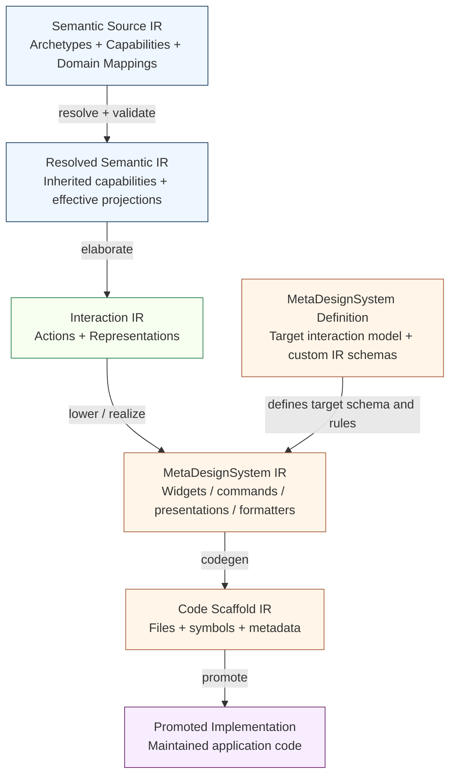

# DMETA as a Design System Compiler: Layered IRs, Interaction Representations, and MetaDesignSystems

This note proposes a refined architecture for DMETA. The central claim is that DMETA should be treated as a **design system compiler**: a sequence of typed intermediate representations, validation passes, elaboration passes, lowering passes, and code generation passes that transform high-level semantic design intent into concrete implementation starting points. The compiler framing gives the project a precise vocabulary for concepts that are currently present but partially collapsed into each other: archetypes, capabilities, presentations, widget templates, instance manifests, generated scaffolds, and manually promoted components.

The current DMETA system already has several strong pieces: explicit semantic archetype inheritance, capability inheritance, domain mappings, widget template catalogs, instance manifests, scaffold generation, and provenance-carrying React output. The main architectural gap is that the model moves too directly from **semantic objects** into **presentations**. The word `presentation` currently does too much work. It names a reusable semantic display intent, a design-system-specific rendering choice, and in some contexts a concrete graphical UI artifact. That is workable for a mobile/web React target, but it becomes imprecise when the same semantic layer should feed CLIM-style presentation systems, command-line interfaces, terminal TUIs, voice systems, or other non-graphical interaction environments.

> [!summary]
> This proposal preserves four main ideas:
> 1. DMETA should be organized as a layered compiler pipeline. Each layer should have its own IR, schema, validation rules, lowering rules, provenance metadata, and tooling.
> 2. Archetypes and capabilities remain the semantic source layer. They should not directly decide that something is a card, row, badge, button, command, recognizer, or voice prompt.
> 3. A new modality-neutral **Interaction IR** should sit between semantics and concrete design systems. It should define **Actions** and **Representations** grounded in intent, semantic selectors, projections, constraints, and natural-language rationale.
> 4. A **MetaDesignSystem** should own the final mapping from actions and representations into a particular interaction technology: mobile/web widgets, CLIM presentations and translators, CLI commands and formatters, voice intents, or another target-specific IR.

This article is a technical proposal and reference document. It uses the current DMETA repository as the starting point, especially the existing semantic model under `/home/manuel/code/wesen/go-go-golems/dmeta/sources/dmeta-ir/`, the Street Deli example under `/home/manuel/code/wesen/go-go-golems/dmeta/examples/street-deli-ordering/`, and the generated/promoted React widget workflow described in [[ARTICLE - DMETA Design System Factory - From Semantic Schemas to Generated React Widgets]].

## Why this note exists

DMETA is already more than a widget generator. It contains a semantic model, an inheritance system, validation commands, design-language artifacts, widget template catalogs, instance manifests, and generated code. These pieces form a pipeline, but the pipeline needs a cleaner conceptual model before it can scale to multiple target interaction systems.

The immediate pressure comes from the Street Deli work. The mobile React application validates the usefulness of reflection-first widget scaffolds: eight selected widget templates produce meaningful scaffolds, and those scaffolds can be manually promoted into working React components while retaining semantic metadata. At the same time, the Street Deli example also exposes a limitation. The same semantic object can be realized as a React card, a CLIM presentation object, a CLI output record, a TUI list item, or a voice prompt. If the upstream IR says `presentation: composition_card`, it has already chosen a graphical framing. That choice belongs later in the pipeline.

A second pressure comes from terminology. The project uses words such as `promote`, `generate`, `map`, `select`, and `presentation` in overlapping ways. Compiler construction provides a useful reference vocabulary: **IR**, **pass**, **analysis**, **elaboration**, **lowering**, **specialization**, **realization**, **code generation**, **source map**, and **debug metadata**. These terms make it easier to discuss transformations without conflating different stages.

The purpose of this note is to define that vocabulary and propose a revised layered architecture.

## Current DMETA baseline

The current DMETA system has three important parts that should be preserved.

First, DMETA has a semantic model based on **archetypes** and **capabilities**. Archetypes describe recurring semantic roles such as `Actor`, `WorkItem`, `Resource`, `Event`, `TimelineSpan`, `ActionSpec`, `ActionInvocation`, `Composition`, `Ingredient`, `Order`, and `Substitution`. Capabilities describe reusable affordances or projection bundles such as `identifiable`, `labelable`, `stateful`, `temporal`, `inspectable`, `relatable`, `composable`, `ingredient_composable`, `substitutable`, `dietary`, and `configurable`.

The base archetype file already encodes an explicit abstract/concrete distinction:

```yaml
archetypes:
  Archetype:
    abstract: true
    description: Root semantic role class.
    extends: []

  Entity:
    extends:
      - Archetype
    abstract: true
    description: Base semantic thing with identity, labels, inspection, and relation affordances.

  WorkItem:
    extends:
      - Entity
    description: Unit of work that can be tracked, progressed, completed, failed, retried, or inspected.
```

The validator already enforces one important rule: domain examples should not map concrete domain types directly to abstract archetypes or abstract capabilities. A domain type should not say it is merely `Entity`; it should map to a concrete descendant such as `WorkItem`, `Resource`, `ActionInvocation`, `Ingredient`, or a domain-specific descendant.

Second, DMETA has widget template catalogs and instance manifests. The Street Deli instance selects templates such as `deli.menu_browser`, `deli.composition_card`, `deli.composition_customizer`, `deli.ingredient_row`, `deli.substitution_chip`, `deli.order_cart`, `deli.order_tracker`, and `deli.role_tag`:

```yaml
selected_templates:
  - template: deli.composition_customizer
    as: StreetDeliCompositionCustomizer
    variant: bottom_sheet
    reason: Ingredient removal and intelligent substitutions are the core sandwich customization workflow.

  - template: deli.substitution_chip
    as: StreetDeliSubstitutionChip
    variant: mobile_default
    reason: Replacement suggestions need a compact reusable action presentation.
```

The existing `plan-instance` command validates selection and exclusion decisions. The `scaffold-instance` command writes generated widget scaffolds. These scaffolds include semantic context, projection hints, adapter TODOs, metadata sidecars, and Storybook placeholders.

Third, DMETA has a working promotion workflow. Generated scaffolds are not treated as final code. They are starting points. In the Street Deli React implementation, generated templates were promoted into maintained React components under:

```text
examples/street-deli-ordering/www/mobile-react/src/widgets/
```

The current promotion step is partly manual and partly LLM-assisted. It converts a reflection-first scaffold into a real implementation with concrete props, state wiring, CSS modules, tests or stories, and runtime behavior. This use of the word `promote` should remain, but it should be reserved for that specific transition: generated or scaffolded artifact to maintained implementation.

## The current muddiness around presentations

The main conceptual problem is that `presentation` currently lives too high in the model.

A capability such as `stateful` currently says it has presentations such as `status_badge` and `state_cell`:

```yaml
stateful:
  extends:
    - Capability
  description: Subject has state/status that can be shown, filtered, and acted on.
  projections:
    state:
      type: string
      required: true
      description: Canonical state value.
  presentations:
    - status_badge
    - state_cell
  actions:
    - filter_by_state
```

This is useful for a graphical UI. It is less useful as a universal semantic layer. A badge is a graphical object. A cell assumes a table-like layout. A CLIM system may realize state as a presentation type plus a translator. A CLI system may realize state as a column in a formatter, a filter flag, or a structured JSON field. A voice system may realize state as a spoken phrase and a confirmation question. These are not all the same kind of artifact.

The upstream semantic fact is not `status_badge`. The upstream semantic fact is closer to:

```text
A stateful subject exposes a state representation that supports scanning, filtering, explanation, and state-specific actions.
```

That fact should be represented in a modality-neutral **Representation IR**. Only later should a mobile/web MetaDesignSystem lower that representation into `StatusBadge`, `StateCell`, `OrderTrackerStep`, or another concrete UI element.

The same issue appears in Street Deli. `composition_card`, `ingredient_list`, and `substitution_badge` are useful names for the current mobile/web target, but the semantic intent is more general:

- A menu item has a compact orderable summary.
- A composition has a role-aware part breakdown.
- A substitution candidate explains what role it preserves, what dietary constraints it satisfies, and what price delta it introduces.
- An order has a lifecycle progress representation.

Those are interaction representations. They are not necessarily cards, lists, badges, or status bars.

## Compiler vocabulary for DMETA

The compiler vocabulary is useful because it distinguishes transformation roles that are currently blended together.

| Compiler term | Meaning in compiler construction | DMETA use |
|---|---|---|
| Source language | The user-authored input language. | YAML semantic schemas, domain mappings, interaction definitions, MetaDesignSystem definitions, instance manifests. |
| IR | Intermediate representation used between source and target. | Archetype/capability IR, Interaction IR, MetaDesignSystem IR, code scaffold IR. |
| Pass | A transformation or analysis step over an IR. | Resolve inheritance, validate mappings, elaborate interactions, lower to mobile/web widgets, generate React code. |
| Analysis pass | Reads IR and produces facts without necessarily rewriting it. | Validate references, compute effective inherited capabilities, detect abstract mappings, check required projections. |
| Normalization pass | Converts many equivalent source forms into one canonical form. | Sort inherited capabilities, expand shorthand selectors, canonicalize ids and references. |
| Elaboration pass | Makes implicit structure explicit while staying near the same conceptual level. | Turn `ingredient_composable + dietary + substitutable` into explicit representations and actions such as `composition_breakdown`, `substitution_candidate`, and `apply_substitution`. |
| Lowering pass | Converts a higher-level IR into a more concrete lower-level IR. | Lower Interaction IR into mobile/web widget IR, CLIM command/presentation IR, or CLI command IR. |
| Specialization | Binds a generic definition to a narrower domain or context. | Specialize `composition_breakdown` for Street Deli ingredients and sandwich roles. |
| Instantiation | Creates a concrete selected instance from a template. | Instantiate `deli.composition_customizer` as `StreetDeliCompositionCustomizer`. |
| Realization | Implements an abstract interaction concept in a target MetaDesignSystem. | Realize `substitution_candidate` as a React chip, a CLIM presentation, or a CLI table row. |
| Code generation | Emits source code or scaffold files from IR. | Emit TypeScript types, React component scaffolds, metadata files, Storybook stories. |
| Source map / provenance | Metadata that traces output back to input origins. | Trace a React widget to its template, representation, actions, capabilities, archetypes, and domain mappings. |
| Promotion | Not the generic compiler word for IR transformation. In DMETA it should mean accepting a generated scaffold as maintained code. | Convert generated `StreetDeliSubstitutionChip` scaffold into a hand-maintained React component. |

The most important distinction is between **elaboration** and **lowering**.

Elaboration makes implied structure explicit. For example, if a subject is `inspectable`, `identifiable`, and `labelable`, an elaboration pass can derive that it supports a compact reference representation, an inspect action, and a copy-reference action. The result is still modality-neutral.

Lowering moves into a more target-specific IR. For example, a mobile/web lowering pass can turn a compact reference representation into a pill, link, card header, table cell, or list item slot depending on context. A CLIM lowering pass can turn the same compact reference representation into a presentation type and translator set.

## Proposed layered architecture

The refined DMETA architecture should be organized as a series of explicit IR layers.



Each layer has a different job.

1. The **Semantic Source IR** defines what kinds of things exist and what capabilities they expose.
2. The **Resolved Semantic IR** computes inherited facts, effective projections, and validated domain mappings.
3. The **Interaction IR** defines modality-neutral actions and representations over semantic subjects.
4. The **MetaDesignSystem definition** defines a target family of interaction systems and its own custom IR schemas.
5. The **MetaDesignSystem IR** realizes interaction actions and representations as target-specific artifacts.
6. The **Code Scaffold IR** describes concrete files, imports, exported symbols, metadata sidecars, stories, and code-generation targets.
7. The **Promoted Implementation** is maintained application code.

The pipeline should support deterministic passes and manual/LLM-assisted passes. Deterministic passes are appropriate for inheritance resolution, schema validation, reference checking, projection requirement checking, and template file emission. Manual or LLM-assisted passes are appropriate when the transformation depends on product judgment, visual hierarchy, copywriting, interaction prioritization, or domain-specific interpretation of intent. Both kinds of passes should write provenance metadata.

## Layer 1: Semantic Source IR

The current archetype and capability system remains the correct foundation. It expresses reusable semantic structure without committing to a final interaction modality.

The Street Deli example shows why this layer is useful. `MenuItem` is not merely a record with a name and price. It is mapped to semantic roles:

```yaml
MenuItem:
  description: Composable food item on the menu.
  archetypes:
    - Composition
    - ActionSpec
  capabilities:
    identifiable:
      id: menu_item_id
    labelable:
      label: item_name
      subtitle: description
    composable:
      parts: ingredients
      part_count: ingredient_count
      required_roles:
        - structural
        - protein
    configurable:
      config_options:
        - name: size
          values: [half, whole]
          default: whole
    dietary:
      dietary_tags: item_dietary_tags
      allergen_contains: item_allergens
```

This mapping lets DMETA reason about `MenuItem` without hard-coding Street Deli UI. A `MenuItem` can be identified, labeled, configured, inspected, ordered, composed from parts, filtered by dietary constraints, and connected to substitution behavior.

The same semantic model supports non-food examples. A logistics `Shipment`, a build-system `BuildJob`, and a deli `Order` can all map to `WorkItem` when they expose state, time, relation, inspection, and action semantics. That does not mean they share the same UI. It means they share enough interaction structure to pass through common elaboration rules.

This layer should continue to support:

- `abstract: true` on archetypes and capabilities.
- Explicit `extends` declarations.
- Validation that concrete domain types do not map directly to abstract taxonomy nodes.
- Effective inherited capabilities and projections.
- Domain examples that map application fields to capability projections.
- Generated TypeScript ancestry metadata such as `isArchetypeA(child, ancestor)` and `isCapabilityA(child, ancestor)`.

The main change is that fields such as `presentations` and `actions` should gradually move out of capabilities or be reinterpreted as references into the new Interaction IR. A capability can imply possible interactions, but it should not directly choose the target-specific shape of those interactions.

## Layer 2: Resolved Semantic IR

The source YAML is author-friendly. Tools need a normalized form. The resolved semantic IR is the output of an analysis and normalization pass over the source IR.

This pass should compute:

- Full archetype ancestry.
- Full capability ancestry.
- Effective capabilities for each archetype.
- Effective projections for each capability.
- Effective semantic selectors for each domain type.
- Errors for unknown references.
- Errors for abstract archetype or capability mappings.
- Errors for missing required projection mappings.
- Warnings for unused definitions or overly broad mappings.

The current `validate-ir` command already performs part of this job. The refined architecture should make the resolved IR an explicit artifact, even if it is initially only produced in memory. Once explicit, it can be inspected, diffed, visualized, cached, and passed to downstream elaboration tools.

A normalized record for Street Deli `OrderItem` might look conceptually like this:

```yaml
resolved_domain_types:
  OrderItem:
    source_path: examples/street-deli-ordering/core-model/street-deli-ordering.yaml
    archetypes:
      declared:
        - WorkItem
        - Composition
      effective:
        - Archetype
        - Entity
        - WorkItem
        - Composition
    capabilities:
      effective:
        identifiable:
          projections:
            id: order_item_id
        labelable:
          projections:
            label: item_name
            subtitle: config_summary
        stateful:
          inherited_from: WorkItem
        temporal:
          inherited_from: WorkItem
        composable:
          projections:
            parts: ingredients
        configurable:
          projections:
            config_options: selected_config_options
```

This resolved form is not the final application model. It is the checked semantic input for elaborating interaction-level obligations.

## Layer 3: Interaction IR

The new Interaction IR is the key addition. It should define **Actions** and **Representations** in a modality-neutral way.

An action is a named operation that a user or system may invoke over semantic subjects. It is not a button, command-line subcommand, keyboard shortcut, callback prop, CLIM command, or voice intent. Those are target-specific realizations of an action.

A representation is a named way of making semantic information available for interaction. It is not a card, row, chip, badge, table cell, voice phrase, or CLIM presentation object. Those are target-specific realizations of a representation.

The Interaction IR should be formal enough to validate and transform, but rich enough to preserve intent. Natural-language fields are first-class because they guide manual and LLM-assisted lowering. They should not be the only contract.

A first schema sketch:

```yaml
schema_version: 0
artifact_type: dmeta_interaction_ir
summary: Modality-neutral actions and representations derived from semantic subjects.

actions:
  inspect_subject:
    abstract: false
    intent: Open or otherwise expose additional detail about a semantic subject without mutating it.
    subjects:
      any_capabilities: [inspectable]
    inputs:
      subject_ref:
        type: SemanticRef
        required: true
    effects:
      scope: navigation_or_local_view
      mutates_backend: false
    result:
      kind: inspection_surface
    notes: This action may lower to a drawer, route, CLIM command, CLI inspect subcommand, or voice follow-up.

  apply_substitution:
    abstract: false
    intent: Apply a selected replacement candidate to a mutable composition draft.
    subjects:
      all_capabilities: [substitutable]
      related_capabilities: [composable]
    inputs:
      composition_ref:
        type: SemanticRef
        required: true
      original_part_ref:
        type: SemanticRef
        required: true
      replacement_candidate_ref:
        type: SemanticRef
        required: true
    effects:
      scope: local_draft_or_order_item
      mutates_backend: false
    result:
      kind: updated_composition
    safety:
      requires_confirmation: false
      reversible: true

representations:
  compact_reference:
    abstract: false
    intent: Identify a subject compactly while preserving access to stable identity and inspection.
    subjects:
      all_capabilities: [identifiable, labelable]
    exposes:
      required_projections:
        - identifiable.id
        - labelable.label
      optional_projections:
        - labelable.subtitle
    supports_actions:
      - copy_reference
      - inspect_subject
    constraints:
      density: compact
      should_preserve_identity: true

  composition_breakdown:
    abstract: false
    intent: Expose the parts of a composition, their functional roles, and the integrity constraints affected by removal or substitution.
    subjects:
      all_capabilities: [composable]
      any_capabilities: [ingredient_composable]
    exposes:
      required_projections:
        - composable.parts
      recommended_projections:
        - role_composable.role_profile
        - ingredient_composable.ingredient_roles
    supports_actions:
      - remove_part
      - add_part
      - apply_substitution
    constraints:
      preserve_part_roles: true
      explain_removed_roles: true
```

The exact field names can change. The important separation should remain:

- A **representation** says what semantic information must be made interactable.
- An **action** says what operation can occur over semantic subjects.
- Neither concept chooses a target modality.

### Representation is not presentation

The distinction between representation and presentation should be strict.

A representation belongs to the shared interaction layer:

```text
composition_breakdown
state_indicator
compact_reference
substitution_candidate
order_lifecycle_progress
filter_criterion_summary
```

A presentation belongs to a MetaDesignSystem-specific layer:

```text
React card
React chip
table cell
bottom sheet
CLIM presentation type
CLIM translator
CLI table formatter
CLI flag
voice prompt
TUI list row
```

The current `presentation` vocabulary can be migrated gradually. Some current presentation names are actually representations and should move upward. Other current presentation names are target-specific widgets and should move downward into a mobile/web MetaDesignSystem.

A useful migration table:

| Current term | Better upstream concept | Better target-specific concept |
|---|---|---|
| `compact_ref` | `compact_reference` representation | pill, link, CLIM presentation object, CLI id formatter |
| `status_badge` | `state_indicator` representation | badge, table cell, CLIM printer, voice phrase |
| `composition_card` | `composition_summary` representation | mobile card, desktop panel, CLI record block |
| `ingredient_list` | `composition_breakdown` representation | list, checklist, CLIM accepted values, CLI table |
| `substitution_badge` | `substitution_candidate` representation | chip, row, tooltip, command candidate |
| `detail_panel` | `inspection_representation` or `inspect_subject` action result | drawer, route, modal, CLI inspect output |

The names do not need to be finalized immediately. What matters is that DMETA stops treating graphical presentation names as the universal bridge between semantics and implementation.

## Elaboration: deriving interaction obligations

Elaboration is the pass that turns resolved semantic facts into explicit interaction definitions. It does not choose React, CLIM, CLI, voice, or any other target. It fills in the interaction consequences of the semantic model.

For example, from this semantic fact:

```text
A subject is identifiable + labelable + inspectable.
```

The elaboration pass can derive:

```yaml
representations:
  - compact_reference
  - inspection_entrypoint

actions:
  - copy_reference
  - inspect_subject
```

From this Street Deli fact:

```text
A subject is ingredient_composable + dietary + configurable.
```

The elaboration pass can derive:

```yaml
representations:
  - composition_summary
  - composition_breakdown
  - dietary_constraint_summary
  - configuration_summary

actions:
  - remove_part
  - add_part
  - change_config
  - filter_by_dietary
```

From this fact:

```text
A subject is role_preserving_substitutable + dietary_substitutable + price_aware_substitutable.
```

The elaboration pass can derive:

```yaml
representations:
  - substitution_candidate
  - substitution_explanation
  - substitution_price_delta
  - substitution_dietary_warning

actions:
  - apply_substitution
  - reject_substitution
  - see_alternatives
```

The output of elaboration should be inspectable. It should not be hidden inside the widget generator. A developer should be able to run a command and see the interaction obligations inferred for a domain:

```text
dmeta elaborate-interactions \
  --root ./examples/street-deli-ordering \
  --output table
```

Expected conceptual output:

```text
subject      representation                 source capabilities                         actions
MenuItem     composition_summary             labelable, measurable, ingredient_composable select_subject, inspect_subject
MenuItem     composition_breakdown           ingredient_composable, dietary              remove_part, apply_substitution
Ingredient   compact_reference               identifiable, labelable                     copy_reference, inspect_subject
SubRule      substitution_candidate          role_preserving_substitutable, dietary       apply_substitution, see_alternatives
Order        order_lifecycle_progress        stateful, temporal                          inspect_subject, return_to_menu
```

This pass is where the current `presentations` and `actions` fields on capabilities can be reinterpreted. Instead of saying `stateful` has a `status_badge`, the semantic model can say `stateful` implies a `state_indicator` representation and `filter_by_state` action. The mobile/web backend can later realize `state_indicator` as a badge, stepper, row cell, or status block.

## Abstract and concrete definitions at every layer

The current core model already has `abstract: true` for archetypes and capabilities. The same distinction should exist in Interaction IR and MetaDesignSystem IR.

The reason is simple: each layer will contain reusable taxonomy nodes and selectable concrete definitions. Tools need to know which definitions may be assigned directly, selected directly, lowered directly, or generated directly.

A representation hierarchy might look like this:

```yaml
representations:
  object_reference:
    abstract: true
    intent: Base representation for referring to a semantic subject.
    subjects:
      any_capabilities: [identifiable]

  compact_reference:
    extends: [object_reference]
    abstract: false
    intent: Compact identity representation suitable for dense contexts.
    subjects:
      all_capabilities: [identifiable, labelable]

  expanded_reference:
    extends: [object_reference]
    abstract: false
    intent: Larger reference representation that includes label, subtitle, state, and relation hints.
```

An action hierarchy might look like this:

```yaml
actions:
  mutate_composition:
    abstract: true
    intent: Base action for changing a mutable composition draft.
    subjects:
      any_capabilities: [composable]

  remove_part:
    extends: [mutate_composition]
    abstract: false
    intent: Remove a part from a composition draft while preserving traceability of the removed role.

  apply_substitution:
    extends: [mutate_composition]
    abstract: false
    intent: Replace a removed or selected part with a compatible substitution candidate.
```

A mobile/web MetaDesignSystem might also distinguish abstract widget families from concrete selectable templates:

```yaml
widget_templates:
  mobile_web.composition_surface:
    abstract: true
    purpose: Base family for graphical composition editing surfaces.

  mobile_web.composition_card:
    extends: [mobile_web.composition_surface]
    abstract: false
    selectable: true
    realizes:
      representations: [composition_summary]

  mobile_web.composition_customizer_sheet:
    extends: [mobile_web.composition_surface]
    abstract: false
    selectable: true
    realizes:
      representations: [composition_breakdown, substitution_candidate]
      actions: [remove_part, apply_substitution, change_config]
```

The validator should enforce layer-appropriate rules:

- Domain types must not map directly to abstract archetypes or abstract capabilities.
- Interaction elaboration must not emit abstract representations or abstract actions as final obligations.
- Instance manifests must not select abstract widget templates.
- Lowering rules may match abstract parents but must emit concrete target artifacts.
- Code generation must only write files for concrete selected artifacts.

This generalizes the existing `abstract` rule from the semantic layer to the entire compiler pipeline.

## Layer 4: MetaDesignSystem definitions

A **MetaDesignSystem** is a formal description of a family of target interaction systems. It consumes Interaction IR and defines how actions and representations are realized into a lower-level, target-specific IR.

A MetaDesignSystem should include:

- An id and purpose.
- The modalities it targets.
- The IR schemas it owns.
- The primitive concepts of that target system.
- Lowering rules from Interaction IR to target IR.
- Validation rules for target IR.
- Common reusable target artifacts.
- Code generation backends.
- Provenance rules.

A schema sketch:

```yaml
schema_version: 0
artifact_type: dmeta_meta_design_system
id: mobile_web
name: Mobile/Web Graphical UI MetaDesignSystem
summary: Realizes modality-neutral actions and representations as responsive graphical widgets, routes, surfaces, and event bindings.

consumes:
  artifact_types:
    - dmeta_interaction_ir
    - dmeta_resolved_semantic_ir

owned_ir_schemas:
  widget_templates: ./schemas/mobile-web-widget-template.schema.yaml
  layout_surfaces: ./schemas/mobile-web-layout-surface.schema.yaml
  state_bindings: ./schemas/mobile-web-state-binding.schema.yaml
  interaction_bindings: ./schemas/mobile-web-interaction-binding.schema.yaml

primitive_concepts:
  visual_components:
    - widget
    - surface
    - slot
    - layout_region
  interaction_events:
    - click
    - tap
    - submit
    - keyboard_shortcut
  state_concepts:
    - local_draft
    - route_state
    - app_store
    - backend_mutation

lowering_rules:
  - id: composition_summary_to_card
    when:
      representation: composition_summary
      context:
        density: mobile
    emits:
      widget_template: mobile_web.composition_card
      required_slots:
        - title
        - price
        - part_summary
        - dietary_tags

codegen_targets:
  - react_typescript
  - storybook
  - css_modules
```

A CLIM-oriented MetaDesignSystem would own a different IR:

```yaml
schema_version: 0
artifact_type: dmeta_meta_design_system
id: clim_presentation_ui
name: CLIM Presentation-Based UI MetaDesignSystem
summary: Realizes actions and representations as presentation types, commands, translators, recognizers, and present/accept methods.

owned_ir_schemas:
  presentation_types: ./schemas/clim-presentation-type.schema.yaml
  commands: ./schemas/clim-command.schema.yaml
  translators: ./schemas/clim-translator.schema.yaml
  recognizers: ./schemas/clim-recognizer.schema.yaml
  views: ./schemas/clim-view.schema.yaml

primitive_concepts:
  objects:
    - presentation_type
    - presentation_object
  operations:
    - command
    - translator
    - recognizer
    - accept_method
    - present_method

lowering_rules:
  - id: compact_reference_to_presentation_type
    when:
      representation: compact_reference
    emits:
      presentation_type: semantic_object_reference
      present_method: compact_present
      translators:
        - inspect_subject_translator
        - copy_reference_translator
```

A CLI MetaDesignSystem would use another IR again:

```yaml
schema_version: 0
artifact_type: dmeta_meta_design_system
id: cli
name: Command-Line Interface MetaDesignSystem
summary: Realizes actions and representations as commands, flags, arguments, output formatters, and structured result schemas.

owned_ir_schemas:
  commands: ./schemas/cli-command.schema.yaml
  output_formatters: ./schemas/cli-output-formatter.schema.yaml
  selectors: ./schemas/cli-selector.schema.yaml

lowering_rules:
  - id: inspect_subject_to_subcommand
    when:
      action: inspect_subject
    emits:
      command_family: inspect
      accepts_selector: semantic_ref
      output_representation: inspection_output
```

The key rule is that each MetaDesignSystem is allowed to be opinionated. The semantic layer should remain modality-neutral, but a mobile/web MetaDesignSystem can talk about widgets, surfaces, cards, CSS tokens, route state, Storybook stories, and React props. A CLIM MetaDesignSystem can talk about presentation types, commands, translators, recognizers, and accept/present methods. A CLI MetaDesignSystem can talk about commands, flags, stdout formats, exit codes, and JSON output.

## Layer 5: MetaDesignSystem IR

The MetaDesignSystem IR is the target-specific language produced by lowering. This layer is where the current widget templates belong.

The existing Street Deli widget template for `deli.composition_customizer` is already close to a mobile/web MetaDesignSystem artifact:

```yaml
- id: deli.composition_customizer
  name: CompositionCustomizer
  classification:
    level: organism
    role: item_customizer
  intent:
    purpose: Render the menu-item customization surface with ingredients, substitutions, configuration controls, dietary summary, and add-to-order action.
  consumes:
    archetypes:
      - Composition
    presentations:
      - composition_detail
      - ingredient_list
      - substitution_badge
    capabilities:
      - composable
      - substitutable
      - configurable
      - dietary
  semantic_context:
    archetypes:
      - ProductComposition
    capabilities:
      - ingredient_composable
      - role_preserving_substitutable
      - configurable
      - dietary
```

In the revised architecture, this template should not directly consume `presentations`. It should realize interaction representations and actions:

```yaml
- id: deli.mobile_web.composition_customizer
  abstract: false
  selectable: true
  meta_design_system: mobile_web
  name: CompositionCustomizer
  classification:
    level: organism
    role: item_customizer

  realizes:
    representations:
      - composition_breakdown
      - substitution_candidate
      - dietary_constraint_summary
      - configuration_summary
    actions:
      - remove_part
      - apply_substitution
      - change_config
      - add_to_order

  semantic_selectors:
    subjects:
      - all_archetypes: [ProductComposition]
        all_capabilities:
          - ingredient_composable
          - configurable
          - dietary

  target_contract:
    props:
      item:
        type: MenuItemDetailViewModel
        required: true
      draft:
        type: CustomizationDraft
        required: true
    callbacks:
      onRemoveIngredient:
        action: remove_part
      onApplySubstitution:
        action: apply_substitution
      onAddToOrder:
        action: add_to_order
```

This version makes the template's role clearer. It is not the first place where the concept of substitution appears. It is the mobile/web realization of previously elaborated substitution interactions.

## Layer 6: Code Scaffold IR and code generation

Code generation should be described as its own backend. It consumes MetaDesignSystem IR and writes concrete files.

For the mobile/web React backend, code generation may emit:

- TypeScript component files.
- TypeScript type files.
- CSS module files.
- Metadata sidecars.
- Storybook stories.
- Barrel exports.
- Runtime data attributes.
- TODO comments for adapter boundaries.

A scaffold output description should be an explicit IR artifact before files are written:

```yaml
schema_version: 0
artifact_type: dmeta_code_scaffold_plan
id: street_deli_ordering.mobile_web.react

files:
  - path: src/widgets/StreetDeliCompositionCard/StreetDeliCompositionCard.tsx
    kind: react_component
    symbol: StreetDeliCompositionCard
    source:
      widget_template: deli.mobile_web.composition_card
      representations:
        - composition_summary
      actions:
        - select_subject
      archetypes:
        - ProductComposition
      capabilities:
        - ingredient_composable
        - dietary

  - path: src/widgets/StreetDeliCompositionCard/StreetDeliCompositionCard.stories.tsx
    kind: storybook_stories
    source:
      widget_template: deli.mobile_web.composition_card
```

The file-writing step is then a deterministic codegen pass over this plan.

This separation matters because it creates a place to inspect the generation decision before writing code. It also creates a stable artifact that can be tested. The generator can snapshot the scaffold plan and assert that `composition_summary` lowers to `StreetDeliCompositionCard` with the expected props, stories, metadata, and provenance.

## Promotion as a narrow DMETA term

The word `promote` should remain in DMETA, but it should have a narrow meaning.

Do not use `promote` for every IR transformation. Use compiler terms instead:

- Use `elaborate` when implicit semantic consequences become explicit interaction definitions.
- Use `lower` when a higher-level IR becomes a more concrete IR.
- Use `specialize` when a generic definition is bound to a narrower domain.
- Use `instantiate` when a selected concrete template becomes a named component in an instance manifest.
- Use `generate` when files are emitted.
- Use `promote` when a generated scaffold becomes maintained implementation code.

In the Street Deli React app, this means:

```text
Semantic model
  -> elaborated interaction definitions
  -> lowered mobile/web widget templates
  -> generated React scaffolds
  -> promoted React components
```

The promoted components are the files under:

```text
examples/street-deli-ordering/www/mobile-react/src/widgets/
```

A promoted component should retain metadata linking it to its sources, but it is no longer disposable generator output. It is owned application code. Future generator runs should not overwrite it unless the project explicitly chooses a regeneration strategy.

## Concrete Street Deli pipeline

The Street Deli application is a useful end-to-end example because it contains semantic structure, non-trivial interaction, and concrete generated widgets.

### Semantic source

The domain contains `MenuItem`, `Ingredient`, `SubstitutionRule`, `Order`, and `OrderItem`. These are mapped to archetypes and capabilities:

| Domain type | Archetypes | Important capabilities |
|---|---|---|
| `MenuItem` | `Composition`, `ActionSpec` | `identifiable`, `labelable`, `composable`, `configurable`, `dietary` |
| `Ingredient` | `Resource` | `identifiable`, `labelable`, `dietary`, `available` |
| `SubstitutionRule` | `Substitution`, `Relation` | `substitutable`, `relatable`, `dietary_substitutable`, `price_aware_substitutable` |
| `Order` | `WorkItem`, `TimelineSpan` | `stateful`, `temporal`, `relatable`, `actionable` |
| `OrderItem` | `WorkItem`, `Composition` | `composable`, `configurable`, `stateful`, `temporal` |

These mappings do not say anything about React, mobile screens, bottom sheets, chips, or Storybook.

### Elaborated interaction layer

The elaboration pass can derive interaction definitions:

```yaml
representations:
  menu_item_orderable_summary:
    intent: Summarize an orderable menu item with identity, label, description, price, dietary constraints, and composition hints.
    subjects:
      all_capabilities: [identifiable, labelable, composable, dietary]
    supports_actions:
      - select_menu_item
      - inspect_subject

  ingredient_composition_row:
    intent: Represent one composition part, its functional roles, dietary metadata, and whether it has been removed or substituted.
    subjects:
      all_archetypes: [Ingredient]
      related_subject:
        all_capabilities: [ingredient_composable]
    supports_actions:
      - remove_part
      - undo_remove_part
      - see_substitution_candidates

  substitution_candidate:
    intent: Explain one candidate replacement by role preservation, dietary compatibility, allergen risk, flavor fit, and price delta.
    subjects:
      all_capabilities: [role_preserving_substitutable]
    supports_actions:
      - apply_substitution
      - reject_substitution
      - see_alternatives

  order_lifecycle_progress:
    intent: Represent the current lifecycle phase of an order and the remaining steps before pickup.
    subjects:
      all_archetypes: [Order]
      all_capabilities: [stateful, temporal]
    supports_actions:
      - inspect_subject
      - return_to_menu
```

Actions are also explicit:

```yaml
actions:
  select_menu_item:
    intent: Begin customization or ordering for a selected menu item.
    effects:
      scope: local_navigation
      mutates_backend: false

  remove_part:
    intent: Mark a composition part as removed while preserving its original role contribution for substitution reasoning.
    effects:
      scope: local_draft
      mutates_backend: false
      reversible: true

  apply_substitution:
    intent: Replace a removed part with a candidate that preserves selected composition roles and satisfies active constraints.
    effects:
      scope: local_draft
      mutates_backend: false
      reversible: true

  submit_order:
    intent: Commit the configured cart as an order and enter lifecycle tracking.
    effects:
      scope: backend_mutation
      mutates_backend: true
      requires_confirmation: true
```

This layer can be shared by multiple targets.

### Mobile/web lowering

The mobile/web MetaDesignSystem lowers the interaction layer into widget templates:

| Interaction representation | Mobile/web realization | Current promoted component |
|---|---|---|
| `menu_item_orderable_summary` | menu browser item card / composition card | `StreetDeliCompositionCard` |
| `composition_breakdown` | customizer ingredient section | `StreetDeliCompositionCustomizer` |
| `ingredient_composition_row` | ingredient row with remove/undo control | `StreetDeliIngredientRow` |
| `substitution_candidate` | tappable suggestion chip | `StreetDeliSubstitutionChip` |
| `order_cart_summary` | cart review surface | `StreetDeliOrderCart` |
| `order_lifecycle_progress` | four-step order tracker | `StreetDeliOrderTracker` |
| `role_label` | role tag pill | `StreetDeliRoleTag` |

A lowering record might look like this:

```yaml
lowering_results:
  - representation: substitution_candidate
    actions:
      - apply_substitution
      - see_alternatives
    target:
      meta_design_system: mobile_web
      widget_template: deli.mobile_web.substitution_chip
      component_name: StreetDeliSubstitutionChip
    rationale: Mobile ordering needs a compact tap target for the best candidate while preserving access to alternatives.
```

### CLIM lowering

The same interaction layer can lower to a CLIM-style MetaDesignSystem without passing through cards or chips.

```yaml
presentation_types:
  - id: deli_ingredient
    realizes:
      representations:
        - compact_reference
        - ingredient_composition_row
    subject:
      archetype: Ingredient
    present_methods:
      - compact_ingredient_present
      - ingredient_with_roles_present

commands:
  - id: remove_ingredient
    realizes_action: remove_part
    arguments:
      ingredient:
        presentation_type: deli_ingredient
      composition:
        presentation_type: deli_composition

translators:
  - id: ingredient_to_remove_ingredient_command
    from_presentation_type: deli_ingredient
    to_command: remove_ingredient
    gesture: select_remove
    when:
      active_context:
        representation: composition_breakdown

  - id: substitution_candidate_to_apply_command
    from_presentation_type: deli_substitution_candidate
    to_command: apply_substitution
    gesture: accept_candidate
```

The CLIM target is not a secondary graphical version of the React target. It is a different MetaDesignSystem with its own primitive objects and validation rules. The shared part is the semantic and interaction IR above it.

### CLI lowering

A CLI target might lower the same actions and representations into commands and output formats:

```yaml
commands:
  - name: menu list
    realizes_representation: menu_item_orderable_summary
    output:
      formatter: menu_item_table

  - name: item inspect
    realizes_action: inspect_subject
    arguments:
      item_id:
        type: string
        selector: MenuItem.identifiable.id

  - name: item substitute
    realizes_action: apply_substitution
    arguments:
      item_id:
        type: string
      remove:
        type: string
      with:
        type: string
```

The CLI output may still use the same semantic provenance. The command `item substitute --remove cheese --with avocado` can be traced to the `apply_substitution` action, the `substitution_candidate` representation, the `substitutable` capability, and the `Substitution` archetype.

## Provenance and source maps

Every lowering and code generation step should preserve provenance. This is the design-system equivalent of compiler debug metadata or source maps.

A promoted React component should be traceable back to:

- The instance manifest selection.
- The MetaDesignSystem widget template.
- The interaction representations it realizes.
- The actions it exposes.
- The semantic archetypes and capabilities it depends on.
- The domain types that satisfy those selectors.
- The source YAML files and line numbers when available.

A metadata sidecar might contain:

```yaml
component: StreetDeliSubstitutionChip
artifact_type: promoted_component_metadata

provenance:
  instance: street_deli_ordering
  meta_design_system: mobile_web
  widget_template: deli.mobile_web.substitution_chip
  lowerer: mobile_web_widget_lowerer_v0
  generated_from:
    representations:
      - substitution_candidate
      - substitution_price_delta
    actions:
      - apply_substitution
      - see_alternatives
    archetypes:
      - Substitution
      - Ingredient
    capabilities:
      - role_preserving_substitutable
      - dietary_substitutable
      - price_aware_substitutable
    domain_types:
      - SubstitutionRule
      - Ingredient

promotion:
  status: promoted
  owner: application
  notes: Concrete React implementation uses CSS modules and normalized candidate view models.
```

Runtime DOM attributes can carry a smaller version:

```html
<button
  data-dmeta-component="StreetDeliSubstitutionChip"
  data-dmeta-representation="substitution_candidate"
  data-dmeta-action="apply_substitution"
  data-dmeta-archetypes="Substitution Ingredient"
  data-dmeta-capabilities="role_preserving_substitutable dietary_substitutable price_aware_substitutable"
>
  Avocado · no charge
</button>
```

This metadata is useful for inspection tools, visual audits, Storybook documentation, regression testing, and future reverse-lifting work. If a developer starts from a rendered widget, they should be able to ask: which semantic contract produced this artifact?

## Deterministic passes and manual/LLM-assisted passes

The pipeline should explicitly distinguish deterministic compiler passes from manual or LLM-assisted passes.

Deterministic passes are appropriate when the input-output relationship is governed by formal rules:

- Resolve inheritance.
- Validate references.
- Reject abstract mappings.
- Check required projections.
- Normalize selectors.
- Compute effective semantic contexts.
- Emit metadata sidecars.
- Generate boilerplate code from a selected template.
- Verify that a selected widget realizes declared actions and representations.

Manual or LLM-assisted passes are appropriate when the transformation requires judgment:

- Naming a new representation.
- Deciding whether two similar representations should merge or remain separate.
- Choosing which actions should be first-class in an interface.
- Deciding whether a representation should be realized as one widget or several widgets.
- Writing user-facing copy.
- Selecting visual hierarchy in a dense layout.
- Promoting a scaffold into maintained code.
- Refactoring a generated prop contract into an application-specific view model.

The system should not pretend that every step is deterministic. It should instead make both classes of work explicit. The output of a manual pass should still be recorded in IR form where possible. If an LLM helps lower `composition_breakdown` into a mobile customizer, the resulting YAML should record the selected realizations, rationale, and source references.

A useful pass record:

```yaml
pass_record:
  id: street_deli_mobile_web_lowering_2026_05_24
  kind: lowering
  deterministic: false
  assisted_by: llm_and_human_review
  input_artifacts:
    - resolved_semantic_ir: street_deli_ordering.resolved.yaml
    - interaction_ir: street_deli_ordering.interactions.yaml
    - meta_design_system: mobile_web.yaml
  output_artifacts:
    - widget_ir: street_deli_ordering.mobile_web.widgets.yaml
  decisions:
    - representation: substitution_candidate
      decision: Lower to chip for primary suggestion and defer full candidate list to detail sheet.
      rationale: Mobile flow needs a compact first action but must preserve access to alternatives.
```

This makes non-deterministic decisions reviewable instead of hidden in generated code.

## Validation rules for the refined pipeline

Each layer should have its own validator. A single `validate-ir` command can orchestrate them, but the errors should identify the layer where the problem occurs.

Semantic validation should check:

- Unknown archetype references.
- Unknown capability references.
- Cycles in inheritance.
- Abstract domain mappings.
- Missing required projections.
- Inconsistent projection types.

Interaction validation should check:

- Unknown action or representation references.
- Abstract actions emitted as concrete obligations.
- Abstract representations emitted as concrete obligations.
- Actions whose subject selectors cannot match any domain type.
- Representations whose required projections are not available from any matching subject.
- Action inputs that do not resolve to semantic references or declared scalar types.

MetaDesignSystem validation should check:

- Lowering rules that reference unknown interaction definitions.
- Target artifacts that claim to realize representations but omit required projections.
- Target artifacts that expose actions without target-specific triggers or command paths.
- Selected templates that are abstract or non-selectable.
- Duplicate concrete component names.
- Required adaptation points missing from instance manifests.

Code scaffold validation should check:

- File path collisions.
- Missing generated exports.
- Metadata sidecars that fail to cite source artifacts.
- Storybook story coverage for selected widgets.
- Runtime data attribute consistency when applicable.

Promotion validation should check:

- Promoted code still exports the expected component symbol.
- Promoted code still carries metadata or data attributes required by the MetaDesignSystem.
- Storybook stories still build.
- The generated contract and promoted prop contract have a documented adaptation boundary.

The current commands provide a starting point:

```bash
go run ./cmd/dmeta validate-ir \
  --root ./examples/street-deli-ordering \
  --include-info \
  --output table

go run ./cmd/dmeta plan-instance \
  --instance ./examples/street-deli-ordering/instantiations/street-deli-ordering.yaml \
  --output table
```

The refined system can add commands such as:

```bash
dmeta resolve-semantic \
  --root ./examples/street-deli-ordering \
  --output yaml

dmeta elaborate-interactions \
  --root ./examples/street-deli-ordering \
  --output yaml

dmeta lower-meta-design-system \
  --interaction-ir ./examples/street-deli-ordering/generated/interactions.yaml \
  --meta-design-system ./sources/dmeta-ir/meta-design-systems/mobile-web.yaml \
  --instance ./examples/street-deli-ordering/instantiations/street-deli-ordering.yaml \
  --output yaml
```

The exact CLI shape can change. The important point is that each transformation becomes a named pass with inspectable input and output.

## Visualizing the pipeline

The layered architecture should support visualization. This is not a documentation luxury. It is a way to inspect compiler state.

Useful views include:

- Archetype inheritance graph.
- Capability inheritance graph.
- Domain type to semantic selector matrix.
- Capability projection coverage table.
- Elaborated action graph.
- Representation-to-action matrix.
- Representation-to-MetaDesignSystem realization matrix.
- Instance manifest selection graph.
- Widget-to-source provenance graph.

A representation-to-widget view for Street Deli might look like this:

| Representation | Actions | Mobile/web widget | Source semantic facts |
|---|---|---|---|
| `menu_item_orderable_summary` | `select_menu_item`, `inspect_subject` | `StreetDeliCompositionCard` | `MenuItem`, `Composition`, `labelable`, `dietary` |
| `composition_breakdown` | `remove_part`, `apply_substitution` | `StreetDeliCompositionCustomizer` | `ProductComposition`, `ingredient_composable` |
| `ingredient_composition_row` | `remove_part`, `undo_remove_part` | `StreetDeliIngredientRow` | `Ingredient`, `Resource`, `dietary` |
| `substitution_candidate` | `apply_substitution`, `see_alternatives` | `StreetDeliSubstitutionChip` | `SubstitutionRule`, `role_preserving_substitutable` |
| `order_lifecycle_progress` | `return_to_menu`, `inspect_subject` | `StreetDeliOrderTracker` | `Order`, `WorkItem`, `TimelineSpan`, `stateful`, `temporal` |

The purpose of the table is not only documentation. It should be derivable from IR and used as a validation target. If a representation has no realization in a selected MetaDesignSystem, the planner should report it. If a widget claims to realize an action but no action binding exists, the planner should report it.

## How this changes the existing DMETA files

The existing repository does not need to be rewritten all at once. The migration can be incremental.

### Current structure

The current structure includes:

```text
sources/dmeta-ir/
  01-core-model.yaml
  core-model/
    archetypes.yaml
    capabilities.yaml
    presentations.yaml
  02-design-language.yaml
  03-widgets.yaml
  widget-templates/
    *.yaml

examples/street-deli-ordering/
  core-model/
    archetypes.yaml
    capabilities.yaml
    presentations.yaml
    street-deli-ordering.yaml
  widget-templates/
    *.yaml
  instantiations/
    street-deli-ordering.yaml
  generated/widgets/
  www/mobile-react/src/widgets/
```

### Proposed staged structure

A future structure could be:

```text
sources/dmeta-ir/
  semantic/
    archetypes.yaml
    capabilities.yaml
    domain-example.schema.yaml
  interactions/
    actions.yaml
    representations.yaml
    elaboration-rules.yaml
  meta-design-systems/
    mobile-web/
      meta-design-system.yaml
      schemas/
        widget-template.schema.yaml
        surface.schema.yaml
        action-binding.schema.yaml
      common-widgets.yaml
      lowering-rules.yaml
    clim/
      meta-design-system.yaml
      schemas/
        presentation-type.schema.yaml
        command.schema.yaml
        translator.schema.yaml
      common-presentations.yaml
      lowering-rules.yaml

examples/street-deli-ordering/
  semantic/
    archetypes.yaml
    capabilities.yaml
    domain.yaml
  interactions/
    street-deli-actions.yaml
    street-deli-representations.yaml
  meta-design-system-instances/
    mobile-web.yaml
    clim.yaml
  generated/
    resolved-semantic.yaml
    elaborated-interactions.yaml
    mobile-web-widget-ir.yaml
    react-scaffold-plan.yaml
```

This structure separates the shared semantic vocabulary, the shared interaction vocabulary, and target-specific MetaDesignSystems.

### Migration step 1: introduce vocabulary without breaking files

The first migration step can be documentation-only plus metadata additions. Existing `presentations` can remain, but new docs and templates should explain whether a name is actually:

- a modality-neutral representation,
- a mobile/web presentation realization,
- a CLIM presentation concept,
- or a legacy bridge term.

### Migration step 2: add Interaction IR as a parallel artifact

Add `interactions/actions.yaml` and `interactions/representations.yaml`. Initially, these can duplicate current capability `actions` and `presentations` in a cleaner form.

Example:

```yaml
representations:
  state_indicator:
    migrated_from_presentations:
      - status_badge
      - state_cell
    subjects:
      all_capabilities: [stateful]
```

### Migration step 3: update widget templates to realize representations/actions

Add a new `realizes` block to widget templates while keeping the current `consumes` block for compatibility:

```yaml
realizes:
  representations:
    - composition_breakdown
    - substitution_candidate
  actions:
    - remove_part
    - apply_substitution
```

The planner can warn when `realizes` is missing and eventually require it.

### Migration step 4: create a mobile/web MetaDesignSystem package

Move global widget-template concepts under a `mobile-web` MetaDesignSystem package. The existing widget templates are already close to this shape. The migration is mostly conceptual and structural.

### Migration step 5: add abstract/concrete validation to widget templates

Add `abstract`, `selectable`, and possibly `lowerable` to widget templates:

```yaml
id: mobile_web.composition_surface
abstract: true
selectable: false

id: deli.mobile_web.composition_customizer
extends: [mobile_web.composition_surface]
abstract: false
selectable: true
```

Then update `plan-instance` to reject abstract selected templates.

### Migration step 6: make pass outputs explicit

Expose resolved semantic IR, elaborated interaction IR, lowerer output, and scaffold plan as inspectable YAML artifacts. They may be generated into `generated/` and ignored or committed depending on project policy.

## Design rules for future DMETA work

The following rules should guide future implementation.

1. **Do not put target-specific UI nouns in the semantic layer.** Words such as card, badge, drawer, table cell, bottom sheet, and button belong to a MetaDesignSystem unless they are explicitly part of a target-specific package.

2. **Use representations for modality-neutral interaction exposure.** A representation should state what semantic information is exposed and why, not how pixels, commands, or utterances are arranged.

3. **Use actions for semantic operations.** An action should describe the operation, subject selectors, inputs, effects, and result. Gestures, callbacks, command names, and keyboard shortcuts belong later.

4. **Make every transformation a named pass.** If a step changes one IR into another, name it as `resolve`, `elaborate`, `lower`, `specialize`, `instantiate`, `generate`, or `promote`.

5. **Reserve promotion for maintained code.** Generated scaffolds are not promoted until they become owned implementation artifacts.

6. **Preserve provenance through every layer.** Every concrete widget, command, translator, formatter, or generated file should be traceable back to representations, actions, capabilities, archetypes, and domain mappings.

7. **Represent manual judgment explicitly.** LLM-assisted or human-assisted lowering decisions should produce reviewable artifacts with rationale fields.

8. **Support abstract/concrete distinctions at every layer.** Abstract definitions are useful for inheritance and matching. Concrete definitions are selectable, lowerable, and generatable.

9. **Let MetaDesignSystems be specific.** A mobile/web MetaDesignSystem should use mobile/web concepts. A CLIM MetaDesignSystem should use CLIM concepts. The shared layer should not force them into one vocabulary.

10. **Validate at the boundary between every layer.** A clean compiler pipeline fails early and reports which layer is inconsistent.

## Concrete example: no cheese to avocado

The substitution flow is the clearest example because it crosses every layer.

### Semantic source

The semantic model says that a sandwich composition has parts and roles. Cheese may fill richness, moisture, and umami roles. Avocado may fill richness and moisture. A dairy-free customer removing cheese creates a role-preservation problem and a dietary constraint.

Relevant semantic pieces:

```yaml
Ingredient:
  archetypes: [Resource]
  capabilities:
    identifiable:
      id: ingredient_id
    labelable:
      label: ingredient_name
    dietary:
      dietary_tags: ingredient_dietary_tags

SubstitutionRule:
  archetypes: [Substitution, Relation]
  capabilities:
    substitutable:
      replaces: original_ingredient_id
      replacement_candidates: ranked_alternatives
      role_preservation: preserved_roles
      dietary_compatibility: compatible_dietary_tags
      price_delta_cents: price_change
      auto_suggest: is_auto_suggest
```

### Elaborated interaction

The elaboration pass derives a representation and actions:

```yaml
representations:
  substitution_candidate:
    intent: Explain why a replacement can stand in for a removed part under active constraints.
    exposes:
      required_projections:
        - substitutable.replaces
        - substitutable.replacement_candidates
      recommended_projections:
        - substitutable.role_preservation
        - substitutable.dietary_compatibility
        - substitutable.price_delta_cents
    supports_actions:
      - apply_substitution
      - see_alternatives

actions:
  apply_substitution:
    intent: Replace the removed part with the selected candidate in the composition draft.
```

### Mobile/web realization

The mobile/web lowerer realizes the candidate as a chip in the customizer:

```yaml
widget: StreetDeliSubstitutionChip
realizes:
  representations:
    - substitution_candidate
  actions:
    - apply_substitution
    - see_alternatives
target_contract:
  props:
    candidate:
      type: SubstitutionCandidateViewModel
    onApply:
      action: apply_substitution
```

The promoted React code can render:

```text
Avocado · no charge
Adds richness + moisture · dairy-free
```

The chip is only one realization. It should not be the upstream concept.

### CLIM realization

A CLIM lowerer can realize the same candidate as a presentation object with translators:

```yaml
presentation_type: deli_substitution_candidate
realizes:
  representations:
    - substitution_candidate
translators:
  - to_command: apply_substitution
    gesture: accept_candidate
  - to_command: inspect_substitution
    gesture: inspect
```

### CLI realization

A CLI lowerer can realize the same candidate as tabular output and an `apply` command:

```text
$ deli item substitutions --item classic-blta --remove cheese
candidate        roles                 dietary      delta
avocado          richness, moisture    dairy_free   +$1.00
hummus           moisture, umami       dairy_free    $0.00

$ deli item substitute --item classic-blta --remove cheese --with avocado
```

All three targets share the same semantic and interaction source. They differ only after the MetaDesignSystem lowering step.

## The role of natural language fields

DMETA should keep natural-language fields. They are not a weakness in the IR. They are a necessary part of a design compiler that includes human and LLM-assisted passes.

Fields such as `intent`, `purpose`, `notes`, `rationale`, `avoid_when`, and `selection_questions` serve several functions:

- They explain why a definition exists.
- They guide LLM-assisted lowering.
- They help reviewers detect incorrect deterministic mappings.
- They preserve product reasoning that cannot be inferred from type signatures.
- They improve generated docs and Storybook pages.

The rule should be: natural language can guide a pass, but formal fields should carry the contract that validators need.

For example, this is not sufficient as a formal definition:

```yaml
intent: Show useful substitution choices to the user.
```

This is better:

```yaml
intent: Show useful substitution choices to the user.
subjects:
  all_capabilities:
    - role_preserving_substitutable
exposes:
  required_projections:
    - substitutable.replacement_candidates
  recommended_projections:
    - substitutable.role_preservation
    - substitutable.dietary_compatibility
supports_actions:
  - apply_substitution
  - see_alternatives
```

The first line helps humans and LLMs. The formal fields help tools.

## Relationship to the existing reflection-first scaffold philosophy

The proposed compiler architecture keeps the reflection-first scaffold philosophy. It makes the philosophy more precise.

A reflection-first scaffold should not pretend that the generator knows the final component design. It should carry enough semantic and interaction context for a human or LLM to implement the component correctly.

Under the revised architecture, a scaffold should reflect:

- Source archetypes.
- Source capabilities.
- Elaborated representations.
- Supported actions.
- Target MetaDesignSystem artifact.
- Projection hints.
- Adapter boundary.
- Generation policy.
- Promotion status.

A generated scaffold comment should evolve from:

```ts
/**
 * Semantic context: ProductComposition + ingredient_composable + dietary.
 * Projection hints: ingredient_composable.parts, dietary.dietary_tags.
 */
```

to:

```ts
/**
 * DMETA source map:
 * - Archetypes: ProductComposition
 * - Capabilities: ingredient_composable, dietary
 * - Representations: composition_summary
 * - Actions: select_menu_item, inspect_subject
 * - MetaDesignSystem: mobile_web
 * - Template: deli.mobile_web.composition_card
 *
 * Adapter boundary:
 * Receives a normalized MenuItemViewModel. Does not parse raw YAML or own backend side effects.
 */
```

This is more useful because it tells the implementor not only what semantic facts exist, but which interaction obligations the component is meant to realize.

## Relationship to design language

The current DMETA design-language IR includes typography, density, color, borders, spacing, elevation, layout, presentation recipes, interaction states, and lint rules. This layer remains important, but it should be scoped to target families.

Some design-language concepts are general enough to share across graphical MetaDesignSystems:

- Density.
- Typography roles.
- Spacing scales.
- Semantic color tones.
- Interaction states.
- Data attributes.

Other concepts are target-specific:

- CSS custom properties.
- React class names.
- Mobile breakpoints.
- Desktop table row heights.
- CLIM present methods.
- CLI output table formats.
- Voice prompt timing.

The refined architecture should allow design language to be attached to a MetaDesignSystem instead of being treated as a universal layer. A mobile/web MetaDesignSystem can import a graphical design language. A CLI MetaDesignSystem can define output styles, verbosity levels, table formats, and JSON schemas. A CLIM MetaDesignSystem can define presentation type display policies and command menu behavior.

The semantic and interaction layers should not require a graphical design language to exist.

## Naming recommendations

The naming scheme should make the layer visible.

Recommended artifact names:

| Layer | Artifact type | Example path |
|---|---|---|
| Semantic source | `dmeta_archetypes`, `dmeta_capabilities`, `dmeta_domain_example` | `semantic/archetypes.yaml` |
| Resolved semantic | `dmeta_resolved_semantic_ir` | `generated/resolved-semantic.yaml` |
| Interaction | `dmeta_interaction_actions`, `dmeta_interaction_representations` | `interactions/actions.yaml` |
| Elaborated interaction | `dmeta_elaborated_interaction_ir` | `generated/elaborated-interactions.yaml` |
| MetaDesignSystem definition | `dmeta_meta_design_system` | `meta-design-systems/mobile-web/meta-design-system.yaml` |
| Target IR | `dmeta_mobile_web_widget_ir`, `dmeta_clim_presentation_ir` | `generated/mobile-web-widget-ir.yaml` |
| Scaffold plan | `dmeta_code_scaffold_plan` | `generated/react-scaffold-plan.yaml` |
| Promoted implementation metadata | `dmeta_promoted_artifact_metadata` | `src/widgets/*/*.metadata.ts` or `.yaml` |

Recommended transformation verbs:

| Verb | Use it for | Do not use it for |
|---|---|---|
| `resolve` | Computing inherited facts and canonical references. | Choosing UI artifacts. |
| `validate` | Checking IR consistency. | Changing design intent. |
| `elaborate` | Making implicit semantic interactions explicit. | Emitting React code. |
| `lower` | Moving from abstract IR to target-specific IR. | Manual code ownership. |
| `specialize` | Binding a generic definition to a domain-specific variant. | File generation. |
| `instantiate` | Selecting a template as a named concrete artifact. | Source-to-source rewriting. |
| `generate` | Writing code or scaffold files. | Human refinement. |
| `promote` | Accepting generated code as maintained implementation. | Any generic IR-to-IR pass. |
| `lift` | Inferring higher-level IR from lower-level artifacts. | Normal forward generation. |

## Implementation sequence

A practical implementation plan should start small.

### Step 1: Document the compiler vocabulary in the DMETA repo

Add a design doc that defines the vocabulary from this article. The repo should have a short canonical glossary so future docs do not reintroduce ambiguous meanings for `presentation`, `promote`, or `lower`.

### Step 2: Add `abstract` and `selectable` to widget templates

This is a direct fix for the current abstract/concrete gap in the widget template layer. It can be implemented before the full Interaction IR exists.

Validation rule:

```text
plan-instance must reject selected_templates entries where the referenced template has abstract: true or selectable: false.
```

### Step 3: Add `realizes` to widget templates

Add optional fields:

```yaml
realizes:
  representations: []
  actions: []
```

Initially these can be documentation-only. Then `plan-instance` can warn when selected templates lack `realizes` metadata.

### Step 4: Introduce first Interaction IR files

Create a small global representation/action catalog:

```text
sources/dmeta-ir/interactions/actions.yaml
sources/dmeta-ir/interactions/representations.yaml
```

Start with concepts already present in capabilities:

- `compact_reference`
- `state_indicator`
- `inspection_entrypoint`
- `composition_summary`
- `composition_breakdown`
- `substitution_candidate`
- `filter_criterion_summary`

And actions:

- `inspect_subject`
- `copy_reference`
- `filter_by_state`
- `remove_part`
- `apply_substitution`
- `see_alternatives`

### Step 5: Add an elaboration prototype

Implement an `elaborate-interactions` command that reads resolved capabilities and emits a table or YAML list of candidate representations/actions. The first version can be rule-based and conservative.

Example rule:

```yaml
- when:
    all_capabilities: [identifiable, labelable]
  emits:
    representations: [compact_reference]
    actions: [copy_reference]

- when:
    all_capabilities: [inspectable]
  emits:
    actions: [inspect_subject]

- when:
    all_capabilities: [ingredient_composable]
  emits:
    representations: [composition_breakdown]
    actions: [remove_part, add_part]
```

### Step 6: Define `mobile_web` as the first MetaDesignSystem

Move the current widget template concept under a mobile/web package. This does not require deleting current files immediately. It can start as a parallel package that references current templates.

### Step 7: Lower Street Deli through the new path

Use Street Deli as the acceptance test. The target is to reproduce the same eight selected widgets through the new chain:

```text
semantic IR
  -> resolved semantic IR
  -> elaborated interaction IR
  -> mobile_web widget IR
  -> React scaffold plan
  -> generated scaffolds
```

If the new pipeline cannot explain the current eight widgets, the abstraction is wrong or incomplete.

## Open questions

Several design decisions remain open.

1. Should `actions` live entirely in Interaction IR, or should capabilities keep a lightweight `implies_actions` field that points into Interaction IR?
2. Should `representations` be globally shared, domain-local, or both? The likely answer is both: global representations for common interaction shapes and local representations for domain-specific concepts.
3. Should `presentation` remain as a term only inside CLIM and graphical MetaDesignSystems, or should it be retired from the shared vocabulary entirely?
4. How much of lowering should be deterministic? Some mappings are straightforward, but high-quality UI design often requires judgment.
5. Should pass outputs be committed, cached, or generated on demand? For review-heavy workflows, committing generated IR snapshots may be valuable.
6. How should source line numbers be preserved through YAML parsing so provenance can point to exact source locations?
7. What is the minimum useful schema for a MetaDesignSystem definition? It should be formal enough to validate but not so heavy that every target requires a large framework.
8. Can promoted implementations be lifted back into updated MetaDesignSystem IR? This would support round-tripping from code to design metadata.

## Final reference model

The refined DMETA model can be summarized as:

```text
Semantic Source IR
  Archetypes, capabilities, domain mappings.
  Says what things are and what they can expose.

Resolved Semantic IR
  Effective inherited facts, projection mappings, validation results.
  Says what is true after inheritance and type checking.

Interaction IR
  Actions and representations.
  Says what users/systems can do and what semantic information must be made interactable.

MetaDesignSystem Definition
  Target interaction family and custom IR schemas.
  Says what kinds of concrete artifacts exist for a modality or platform.

MetaDesignSystem IR
  Widgets, commands, presentations, translators, formatters, surfaces, bindings.
  Says how interaction concepts are realized in the target system.

Code Scaffold IR
  Files, symbols, exports, metadata, stories, adapter TODOs.
  Says what code should be emitted.

Promoted Implementation
  Maintained application code.
  Says what actually ships and evolves under human ownership.
```

This model does not discard the current DMETA work. It gives it a more precise frame. Archetypes and capabilities remain the semantic foundation. Widget templates remain valuable, but they become artifacts of a mobile/web MetaDesignSystem rather than the universal next step after semantics. Presentations are no longer the shared bridge. The shared bridge becomes Actions and Representations.

The compiler vocabulary matters because it keeps each transition honest. Elaboration is not lowering. Lowering is not code generation. Code generation is not promotion. Promotion is not a generic transformation. Once those distinctions are clear, DMETA can grow beyond React widget scaffolds into a system that can target multiple interaction paradigms while preserving traceable semantic intent from the first YAML file to the final application artifact.
