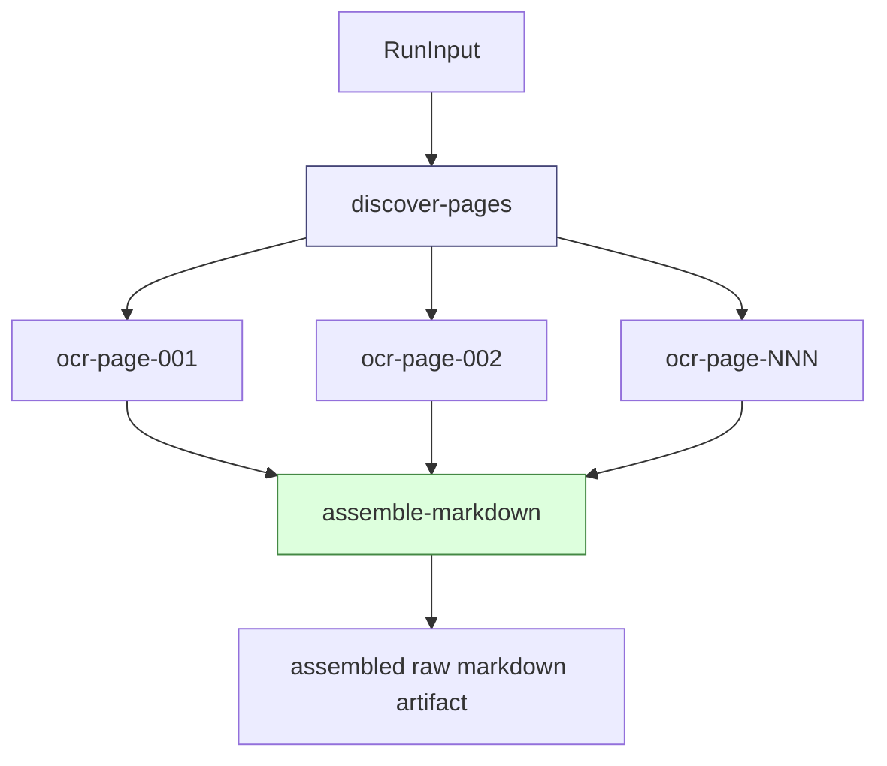
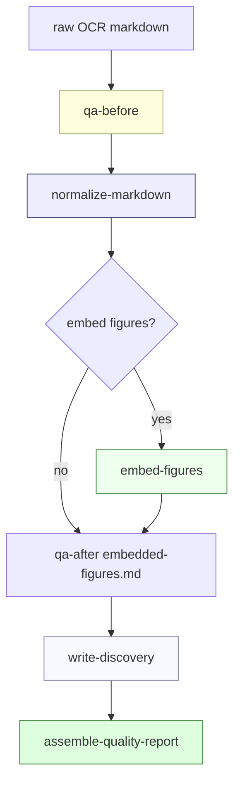
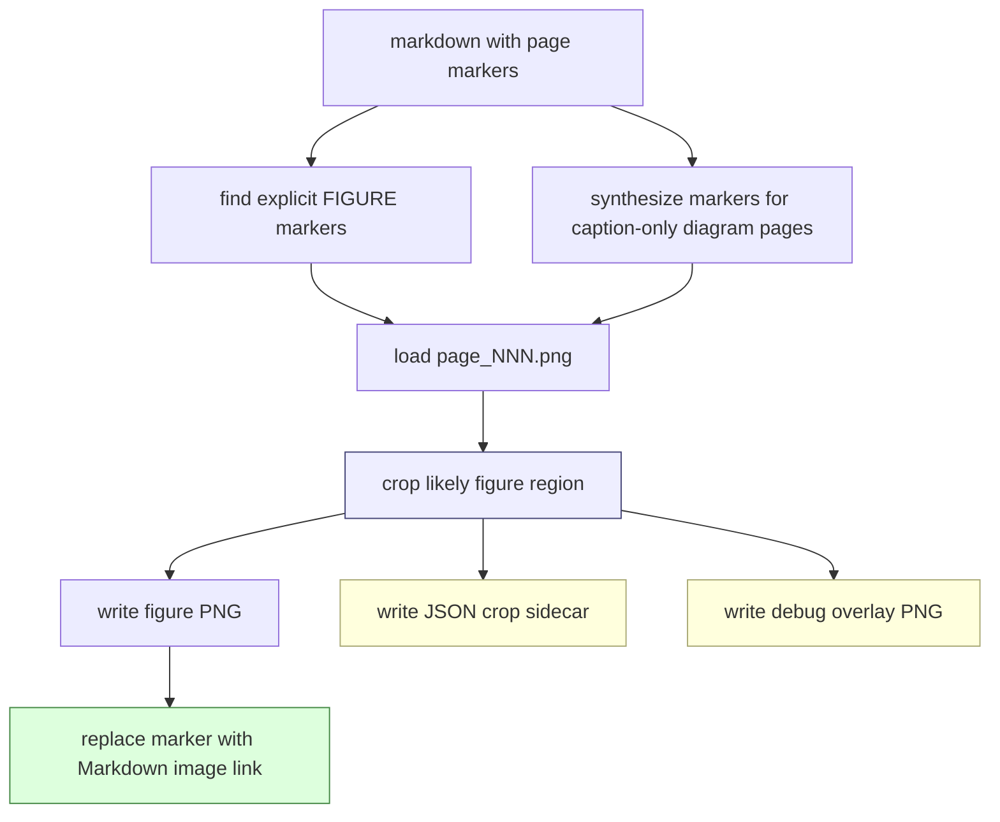
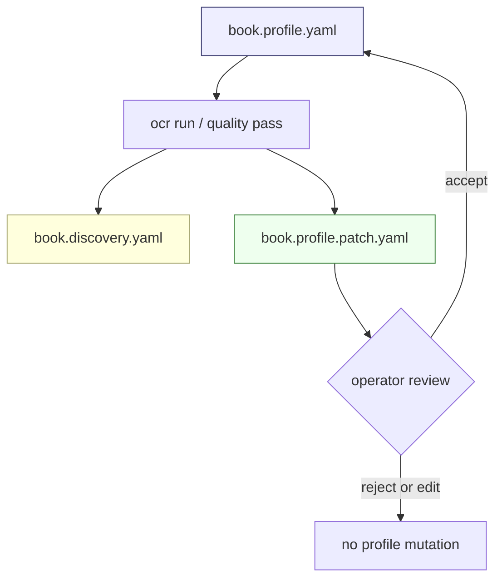

# Decoupling Book OCR from Report 794: Scraper Workflow Runtime and Generic OCR Pipelines

This report explains how the book OCR system evolved from a successful Report 794 experiment into a more general architecture. The central design goal is now clear: `scraper/` should be a generic workflow and OCR runtime, while the sibling `2026-05-20--book-ocr/` repository should own concrete book policy, profiles, prompts, QA expectations, experiments, and final artifacts.

The technical lesson is that high-quality OCR is not a single model call. It is a workflow: page discovery, page-level OCR, artifact storage, projection updates, quality checks, deterministic cleanup, figure extraction, discovery-state generation, and reviewable profile updates. The Scraper job system gives this workflow a durable execution model. The book OCR repository gives each book a durable policy model.

> [!summary]
> 1. `scraper/` now provides the reusable execution substrate: workflow packages, typed executors, durable steps, artifact storage, projection stores, operator commands, and generic OCR/quality workers.
> 2. Report 794-specific policy currently exists in a few places inside `scraper/`; the next architectural step is to move that policy into `2026-05-20--book-ocr/books/report-794/` as profile YAML, prompt files, QA files, and experiment manifests.
> 3. The profile/discovery/patch model separates stable human-curated policy from machine-updated observations and reviewable proposed changes.
> 4. The result is a reusable book OCR platform: each book supplies policy; `scraper` supplies execution.

## Concrete locations

Main workspace:

```text
/home/manuel/workspaces/2026-05-20/book-ocr
```

Generic runtime and OCR implementation:

```text
/home/manuel/workspaces/2026-05-20/book-ocr/scraper
```

Book OCR project and ticket repository:

```text
/home/manuel/workspaces/2026-05-20/book-ocr/2026-05-20--book-ocr
```

Externalization ticket:

```text
/home/manuel/workspaces/2026-05-20/book-ocr/2026-05-20--book-ocr/ttmp/2026/05/24/BOOK-OCR-EXTERNALIZE-001--move-book-specific-ocr-policy-out-of-scraper-into-book-ocr-repository
```

Externalization design guide:

```text
/home/manuel/workspaces/2026-05-20/book-ocr/2026-05-20--book-ocr/ttmp/2026/05/24/BOOK-OCR-EXTERNALIZE-001--move-book-specific-ocr-policy-out-of-scraper-into-book-ocr-repository/design-doc/01-externalizing-book-ocr-policy-from-scraper-design-and-implementation-guide.md
```

Current best embedded Report 794 artifact:

```text
/home/manuel/workspaces/2026-05-20/book-ocr/2026-05-20--book-ocr/ttmp/2026/05/24/OCR-QUALITY-WORKERS-001--port-ocr-qa-and-cleanup-scripts-to-go-workflow-workers/experiments/002-figure-aware-marker-recovery/outputs/02-embedded-figures.md
```

## The problem: a generic runtime acquired book-specific knowledge

The first goal was to prove that `scraper` could run OCR as a workflow. That part succeeded. The system can discover page images, schedule one OCR step per page, call Geppetto directly, store per-page markdown artifacts, assemble the final document, run quality checks, normalize list pages, extract figures, and write discovery artifacts. Those are generic capabilities.

The second goal was to make the first 30 pages of MIT Technical Report 794 look good. That also succeeded, but it introduced book-specific knowledge into generic code. During prompt optimization, the system learned about `PSBase`, `PPS`, `Dired`, `Steamer`, `Zmacs`, list pages 6 through 9, Figure 1-2 and Figure 1-3 as full-page diagrams, and several recurring OCR mistakes. That knowledge belongs to the Report 794 book project. It should not become part of the reusable `scraper` runtime.

This is the boundary that matters:

```text
Generic runtime capability: "Run OCR on pages and store artifacts."
Book-specific policy:       "For Report 794, preserve PSBase, Dired, and Steamer exactly."
```

The first statement belongs in `scraper`. The second belongs in `2026-05-20--book-ocr/books/report-794/`.

## The Scraper workflow runtime in one pass

The Scraper job system is a durable workflow runtime. A workflow is composed of steps. Each step has a kind, input, queue, retry policy, dependencies, records, artifacts, and result data. The runtime does not care whether a step fetches a web page, transcribes a book page, imports a log file, or extracts a figure. It cares that the step can be scheduled, leased, executed, retried, and inspected.

The important generic package is:

```text
scraper/pkg/workflow
```

The key concepts are:

| Concept | Role |
|---|---|
| `workflow.Package` | Declares a workflow package and its entrypoint. |
| `workflow.RunBuilder` | Builds a graph of steps for one workflow run. |
| `workflow.StepOpts` | Describes step kind, queue, dependencies, and retry policy. |
| `workflow.Executor` | Runs one kind of step. |
| `workflow.NewTypedExecutor[I]` | Adapts a typed Go function into a workflow executor. |
| `workflow.StepContext` | Gives executors access to input, result storage, artifacts, dependencies, projections, and records. |
| `workflow.ArtifactStore` | Stores large outputs outside the engine database while preserving references. |
| `workflow.ProjectionStore` | Stores queryable read models such as page status projections. |

A typed executor has the shape:

```go
func SomeExecutor() workflow.Executor {
    return workflow.NewTypedExecutor(SomeKind, func(ctx context.Context, step *workflow.StepContext, input SomeInput) error {
        // read input
        // do work
        // store artifacts
        // store typed result
        return step.Result(SomeResult{...})
    })
}
```

The design is important because it gives OCR the same operational properties as any other workflow. Page OCR is not a hidden loop inside a shell script. Each page is a step. Each step can be retried. Each page writes artifacts. Each result is inspectable. The operator can ask what ran, what failed, what was produced, and which inputs produced it.

## The OCR workflow: pages become durable artifacts

The OCR workflow package lives in:

```text
scraper/pkg/workflows/ocrmvp
```

Despite the `mvp` name, the package now contains the central page OCR workflow. Its public input is `RunInput`:

```go
type RunInput struct {
    BookID            string   `json:"book_id"`
    ImageDir          string   `json:"image_dir"`
    PageGlob          string   `json:"page_glob,omitempty"`
    StartPage         int      `json:"start_page,omitempty"`
    EndPage           int      `json:"end_page,omitempty"`
    Profile           string   `json:"profile,omitempty"`
    ProfileRegistries []string `json:"profile_registries,omitempty"`
    PromptVersion     string   `json:"prompt_version,omitempty"`
    ContextWindow     int      `json:"context_window,omitempty"`
    DryRun            bool     `json:"dry_run,omitempty"`
}
```

The workflow graph is simple and effective:



The `discover-pages` step inspects the image directory and schedules one `ocr-page-NNN` step per page. Each page step receives a `PageOCRInput` with the target image path, prompt version, model profile, and optional surrounding context images. The `assemble-markdown` step depends on every page step and writes a single markdown artifact with page markers.

The page OCR step uses the `OCRClient` interface:

```go
type OCRClient interface {
    OCRPage(ctx context.Context, input PageOCRInput, imageBytes []byte) (OCRTextResult, error)
}
```

The live implementation is Geppetto-backed. It resolves Pinocchio profiles through the proper profile bootstrap path, builds a multimodal model turn, passes the target page image first, includes optional context images after it, and extracts the final assistant text. This is generic OCR infrastructure. It should not know that a book contains `PSBase` or `Dired`.

## The quality workflow: raw OCR becomes reviewable output

The quality workflow package lives in:

```text
scraper/pkg/workflows/ocrquality
```

It starts from an existing markdown file. It does not call the model. It checks, normalizes, enriches, and reports.

The current quality graph is:



The quality workflow currently performs these tasks:

- Count and validate page markers.
- Check known bad terms.
- Check expected strings.
- Detect adjacent duplicate lines.
- Check list pages for markdown heading/bullet drift.
- Normalize list-page dot leaders.
- Extract and embed figure crops from source page images.
- Write figure crop sidecars and debug overlays.
- Write `book.discovery.yaml` and `book.profile.patch.yaml`.
- Write a compact quality report.

This is the point where the runtime becomes a learning system. The workflow does not only produce a final markdown file. It also produces observations about the book.

## Figure extraction as a concrete example of workflow leverage

Figure extraction shows why the workflow model matters. In the first OCR outputs, Figure 1-1 and Figure 1-4 had usable figure markers, but Figure 1-2 and Figure 1-3 were full-page diagrams transcribed as plain diagram text. The system improved in two places:

1. The OCR prompt gained a figure-aware contract: full-page diagrams must emit `[FIGURE: ...]` markers.
2. The quality worker gained a deterministic recovery pass: caption-only diagram pages can synthesize missing markers when the page structure looks diagram-like.

The figure worker now performs this sequence:



A generated figure bundle now looks like this:

```text
page_015_figure_01.png
page_015_figure_01.json
page_015_figure_01.debug.png
```

The PNG is the crop. The JSON sidecar records how the crop was produced. The debug overlay shows the selected rectangle on the original page. This is an example of how the workflow system supports auditability: the final artifact is useful for readers, while the sidecars are useful for reviewers and future algorithms.

## Profile, discovery, and patch files

The system now uses three conceptual layers for book knowledge:

```text
book.profile.yaml          # stable human-curated policy
book.discovery.yaml        # machine-updated observations
book.profile.patch.yaml    # proposed profile changes for review
```

The stable profile is policy. It says what the OCR system should know before a run: book family, vocabulary, page-type rules, prompt policy, QA policy, normalization policy, figure policy, and context policy.

The discovery file is evidence. It records what the workflow observed: inferred diagram pages, extracted figures, crop rectangles, QA findings, vocabulary candidates, and warnings.

The patch file is a proposed promotion. It says which discoveries may be worth adding to the stable profile. It should not be applied automatically.



This model keeps learning and policy separate. A workflow can learn during execution without silently rewriting the canonical profile.

## What must move out of `scraper`

The externalization work begins from a concrete inventory. The following items are currently in `scraper` but belong in `2026-05-20--book-ocr`.

| Current item | Current location | Target |
|---|---|---|
| Built-in `Report794()` profile | `scraper/pkg/workflows/bookprofile/profile.go` | `2026-05-20--book-ocr/books/report-794/book.profile.yaml` |
| Report 794 vocabulary | `ocrmvp/prompt.go`, `bookprofile/profile.go` | `books/report-794/book.profile.yaml` |
| Known bad terms | `ocrquality/markdown.go`, `bookprofile/profile.go` | `books/report-794/qa/known-bad-terms.txt` |
| Expected strings | `ocrquality/markdown.go`, `bookprofile/profile.go` | `books/report-794/qa/expected-strings.txt` |
| List pages | `ocrquality/markdown.go`, `bookprofile/profile.go` | `books/report-794/book.profile.yaml` |
| Required figure captions | `bookprofile/profile.go` | `books/report-794/qa/required-figures.yaml` |
| Report 794 prompt text | `ocrmvp/prompt.go` | `books/report-794/prompts/ocr-page-figure-aware.md` |

The schema types remain in `scraper`. The data moves out.

## Target repository layout

The durable book project should look like this:

```text
2026-05-20--book-ocr/
└── books/
    └── report-794/
        ├── README.md
        ├── book.profile.yaml
        ├── book.discovery.yaml
        ├── book.profile.patch.yaml
        ├── prompts/
        │   ├── ocr-page.md
        │   ├── ocr-page-figure-aware.md
        │   └── continuity-pass.md
        ├── qa/
        │   ├── expected-strings.txt
        │   ├── known-bad-terms.txt
        │   └── required-figures.yaml
        ├── manifests/
        │   └── first-30-pages.yaml
        └── experiments/
            └── README.md
```

Tickets still matter. Ticket experiment folders are historical evidence. The `books/report-794/` folder is the current durable configuration for the book. The two serve different purposes.

## Why a file boundary is better than a Go dependency

The `2026-05-20--book-ocr` repository should not become a Go package imported by `scraper`. That would couple the generic runtime to one project repository. A file boundary is simpler and more durable.

The command line should make the boundary explicit:

```bash
ocr-mvp quality-pass \
  --book-profile /home/manuel/workspaces/2026-05-20/book-ocr/2026-05-20--book-ocr/books/report-794/book.profile.yaml \
  --markdown RAW.md \
  --output-dir OUT \
  --image-dir /home/manuel/code/wesen/claw-stuff/output/books/presentation-based-uis/pages \
  --embed-figures
```

The runtime loads the profile file. The profile file may reference prompt and QA files relative to its own directory. `scraper` does not know where the repository lives beyond the path passed by the operator.

## The implementation path

The migration should be incremental. The first step is not to delete code. The first step is to add an external profile that reproduces current behavior.

### Phase 1: Add external Report 794 files

Create:

```text
2026-05-20--book-ocr/books/report-794/book.profile.yaml
2026-05-20--book-ocr/books/report-794/prompts/ocr-page-figure-aware.md
2026-05-20--book-ocr/books/report-794/qa/known-bad-terms.txt
2026-05-20--book-ocr/books/report-794/qa/expected-strings.txt
2026-05-20--book-ocr/books/report-794/qa/required-figures.yaml
```

The external files should match the current built-in behavior. This phase is data-only.

### Phase 2: Expand profile-relative paths

The current `bookprofile.Profile` supports inline values. It should also support relative file references:

```go
type PromptPolicy struct {
    BaseTemplate string `yaml:"base_template,omitempty"`
    TemplatePath string `yaml:"template_path,omitempty"`
}

type QAPolicy struct {
    ExpectedStrings []string `yaml:"expected_strings,omitempty"`
    ExpectedStringsPath string `yaml:"expected_strings_path,omitempty"`
    RequiredFiguresPath string `yaml:"required_figures_path,omitempty"`
}
```

The loader should resolve paths relative to the profile file:

```go
func Load(path string) (Profile, error) {
    body := os.ReadFile(path)
    profile := yaml.Unmarshal(body)
    base := filepath.Dir(path)
    expandRelativeReferences(&profile, base)
    return profile, nil
}
```

### Phase 3: Use `--book-profile` in smoke tests

Once relative file expansion works, the quality-pass smoke test should use the external profile path instead of relying on `bookID == report-794`.

```bash
go run ./cmd/ocr-mvp quality-pass \
  --book-profile /home/manuel/workspaces/2026-05-20/book-ocr/2026-05-20--book-ocr/books/report-794/book.profile.yaml \
  --markdown /home/manuel/workspaces/2026-05-20/book-ocr/2026-05-20--book-ocr/ttmp/2026/05/24/BOOK-OCR-HQ-001--high-quality-book-ocr-experiment-system/experiments/007-quality-v4-mini-pages-001-030/outputs/01-final-quality-v4-mini-pages-001-030.md \
  --output-dir /tmp/ocr-quality-external-profile/out \
  --work-dir /tmp/ocr-quality-external-profile/work \
  --image-dir /home/manuel/code/wesen/claw-stuff/output/books/presentation-based-uis/pages \
  --embed-figures
```

### Phase 4: Remove built-in Report 794 production defaults

After the external profile passes smoke tests, remove production `Report794()` resolution from `scraper`. Tests may keep fixtures, but runtime behavior should be profile-file driven.

```go
func Resolve(bookID, profilePath string) (Profile, bool, error) {
    if profilePath != "" {
        return Load(profilePath)
    }
    return Profile{}, false, nil
}
```

### Phase 5: Move Report 794 prompt text out of Go

This is the hardest phase. The prompt renderer should support external prompt templates. The generic prompt builder can still live in Go, but Report 794 vocabulary and policy text should come from profile and prompt files.

The future rendering path should look like:

```go
func RenderPagePromptFromProfile(input PromptInput) string {
    template := input.Profile.Prompt.Template
    data := PromptData{
        BookID: input.BookID,
        PageNumber: fmt.Sprintf("%03d", input.PageNumber),
        Vocabulary: input.Profile.Vocabulary,
        PageType: input.PageType,
        HasContext: len(input.ContextBefore)+len(input.ContextAfter) > 0,
    }
    return ExecuteTemplate(template, data)
}
```

## What readers should learn from this design

The reusable idea is not specific to OCR. A workflow runtime should know how to run work, store evidence, retry failures, and expose operator controls. It should not accumulate domain facts for every workload that uses it. The correct boundary is a contract: typed inputs, typed results, artifact references, profile files, and discovery files.

The OCR pipeline demonstrates this boundary in a concrete way:

- The runtime schedules and executes steps.
- The OCR package converts page images into markdown artifacts.
- The quality package checks, normalizes, and enriches markdown.
- The profile file supplies book-specific policy.
- The discovery file records what the workflow learned.
- The patch file proposes policy updates for human review.

A new book should not require new Go constants in `scraper`. It should require a new folder under `books/`, a profile, prompt files, QA expectations, and experiments.

## Current status

The externalization design is complete in `BOOK-OCR-EXTERNALIZE-001`. The next implementation step is Phase 1: create the external `books/report-794/` folder and copy the current Report 794 policy out of Go into data files.

The important distinction is now explicit:

```text
scraper/                  generic runtime and OCR machinery
2026-05-20--book-ocr/     concrete book policy and evidence
```

This is the boundary that lets the same OCR pipeline process Report 794 today and other books later without turning the runtime into a repository of book-specific exceptions.
