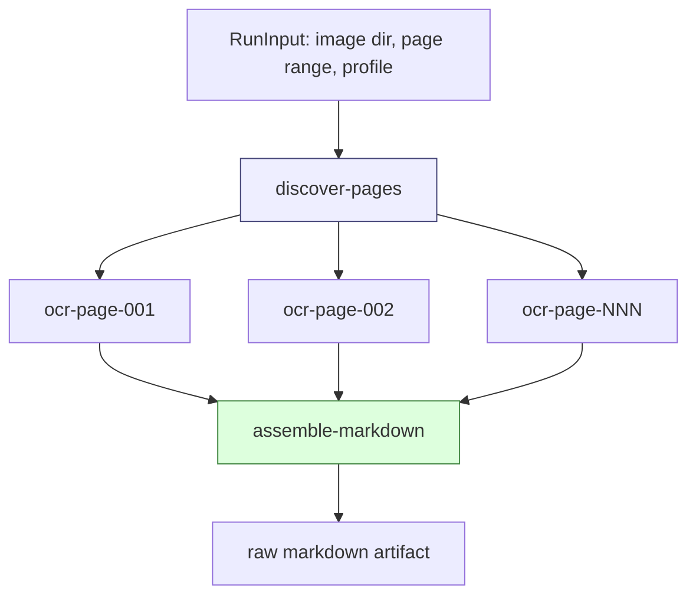
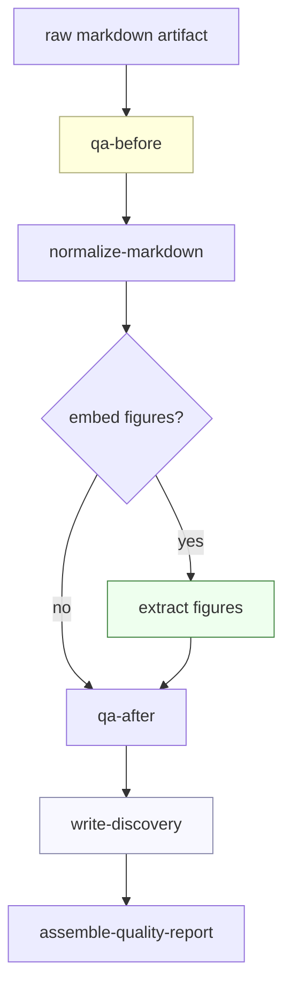

# Extracting Book OCR from Scraper: Workflow Runtime Boundaries and External OCR Pipelines

The corrected architectural goal is stronger than moving Report 794-specific constants out of `scraper/`. The goal is to move **all OCR and book-OCR functionality** out of `scraper/` and into the sibling `2026-05-20--book-ocr/` repository. `scraper/` should keep the workflow management, execution, scheduling, job queue, artifact, projection, retry, and operator mechanisms. The OCR pipelines should become an external workflow application that imports and uses those mechanisms.

This matters because OCR is not part of the core identity of `scraper`. OCR is a workload. It exercises the workflow runtime well: it has many page-level jobs, provider calls, artifacts, retries, quality checks, image extraction, discovery state, and review loops. But those are reasons to use the runtime, not reasons to place OCR inside the runtime repository.

> [!summary]
> 1. `scraper/` should be reduced to the reusable workflow/job system: durable runs, steps, queues, executors, artifacts, projections, retries, and operator controls.
> 2. `2026-05-20--book-ocr/` should own the OCR application: page discovery, Geppetto OCR calls, prompt rendering, book profiles, QA, normalization, figure extraction, discovery files, patch proposals, experiments, and CLIs.
> 3. The correct boundary is a Go API plus file contracts. `book-ocr` imports `scraper/pkg/workflow`; `scraper` does not import or know about OCR.
> 4. Report 794 becomes one book profile inside the external OCR application, not a special case inside the workflow runtime.

## The corrected boundary

The previous design separated generic OCR machinery from Report 794 policy. That was an improvement, but it kept too much in `scraper`: the OCR workflow package, the quality workflow package, the book profile package, the Geppetto OCR client, the figure extraction code, and the `ocr-mvp` CLI. The user clarified that this is still too much. `scraper` should not become a generic OCR framework. It should remain a generic workflow/job system.

The corrected boundary is:

```text
scraper/
  workflow management and job execution only

2026-05-20--book-ocr/
  all OCR and book-OCR functionality
```

This does not make the OCR work less reusable. It makes the dependency direction explicit. The external OCR application can still be reusable for many books. It simply lives outside the runtime repository.

## What remains in `scraper/`

The following packages and capabilities should remain in `scraper/` because they are workload-independent:

| Capability | Why it belongs in `scraper` |
|---|---|
| Durable workflow runs | Any workload needs persistent run state. |
| Step scheduling and leasing | Any workload needs safe concurrent workers. |
| Queue names and retry policies | Any workload may need controlled execution. |
| Typed executor API | External applications need a way to register Go step handlers. |
| Artifact storage | Any workload can produce large outputs. |
| Projection storage | Any workload can maintain queryable read models. |
| Dependency result loading | Workflow steps often depend on previous step outputs. |
| Operator controls | Retry, cancel, status, and inspection are runtime features. |
| Generic runtime CLI/server, if present | Runtime operations are not OCR-specific. |

The important package is:

```text
scraper/pkg/workflow
```

The stable public API should include:

```go
type Runtime struct { ... }
type Package struct { ... }
type RunBuilder struct { ... }
type Executor interface { ... }
type StepContext struct { ... }

func NewTypedExecutor[I any](kind string, fn func(context.Context, *StepContext, I) error) Executor
func NewPackage(name string) *PackageBuilder
```

The runtime should not contain names like `ocr-mvp`, `ocr-quality`, `report-794`, `PSBase`, or `Dired`. Those names are application names or book facts.

## What moves to `2026-05-20--book-ocr/`

All OCR-specific packages should move out of `scraper`:

| Current location in `scraper` | New owner |
|---|---|
| `scraper/pkg/workflows/ocrmvp` | `2026-05-20--book-ocr/internal/ocr/workflow` or `pkg/ocr/workflow` |
| `scraper/pkg/workflows/ocrquality` | `2026-05-20--book-ocr/internal/ocr/quality` or `pkg/ocr/quality` |
| `scraper/pkg/workflows/bookprofile` | `2026-05-20--book-ocr/internal/bookprofile` or `pkg/bookprofile` |
| `scraper/cmd/ocr-mvp` | `2026-05-20--book-ocr/cmd/book-ocr` |
| Geppetto OCR client | `2026-05-20--book-ocr/internal/ocr/geppetto` |
| Prompt versions and renderers | `2026-05-20--book-ocr/internal/ocr/prompts` plus `books/*/prompts` |
| QA defaults and markdown checks | `2026-05-20--book-ocr/internal/ocr/quality` |
| Figure extraction and sidecars | `2026-05-20--book-ocr/internal/ocr/figures` |
| Book profiles and discoveries | `2026-05-20--book-ocr/books/<book-id>/` |

The external OCR application should import the workflow runtime:

```go
import "github.com/go-go-golems/scraper/pkg/workflow"
```

Then it registers its own packages:

```go
func main() {
    rt := newRuntime(...)
    ocr.Register(rt, ocr.Config{Client: geppetto.NewClient(...)})
    quality.Register(rt)
    runCLI(rt)
}
```

The direction matters. `book-ocr` depends on `scraper`. `scraper` does not depend on `book-ocr`.

## Why the OCR pipeline is a good workload for the Scraper job system

OCR has the shape of a workflow. A book is a collection of pages. Each page can be processed independently for first-pass OCR, but the final document depends on all pages. Quality checks and figure extraction depend on the assembled markdown and source images. Discovery state depends on quality and extraction results. This produces a graph, not a single function call.

The page OCR graph is:



The quality graph is:



The Scraper runtime gives this graph durable execution. It provides step identities, dependency tracking, retry policy, worker queues, artifact storage, and status inspection. The OCR application provides the domain logic for each step.

## The teaching point: workflow runtime versus workflow application

A workflow runtime answers a narrow set of questions:

- What workflow runs exist?
- Which steps are ready?
- Which worker can lease a step?
- What input does a step receive?
- What output did it produce?
- Which artifacts did it store?
- What should be retried or cancelled?

A workflow application answers domain questions:

- How do we discover page images?
- How do we prompt a model for OCR?
- Which terms should be protected for this book?
- How do we detect figure pages?
- How do we normalize table-of-contents pages?
- Which figures should be embedded?
- Which pages should be retried?

These are different responsibilities. The OCR code became useful precisely because the runtime did not need to understand OCR. The next step is to make the repository boundary match that conceptual boundary.

## The external `book-ocr` application shape

The `2026-05-20--book-ocr` repository should become a small Go application that imports the workflow runtime. A practical layout is:

```text
2026-05-20--book-ocr/
├── go.mod
├── cmd/
│   └── book-ocr/
│       └── main.go
├── internal/
│   ├── ocr/
│   │   ├── workflow/
│   │   │   ├── types.go
│   │   │   ├── package.go
│   │   │   ├── discover.go
│   │   │   ├── executors.go
│   │   │   └── projection.go
│   │   ├── geppetto/
│   │   │   └── client.go
│   │   ├── prompts/
│   │   │   └── render.go
│   │   ├── quality/
│   │   │   ├── package.go
│   │   │   ├── qa.go
│   │   │   ├── normalize.go
│   │   │   └── logimport.go
│   │   └── figures/
│   │       ├── extract.go
│   │       └── sidecar.go
│   └── bookprofile/
│       ├── profile.go
│       └── discovery.go
└── books/
    └── report-794/
        ├── book.profile.yaml
        ├── book.discovery.yaml
        ├── book.profile.patch.yaml
        ├── prompts/
        ├── qa/
        └── manifests/
```

This layout makes the OCR application independent from `scraper` internals except for the public workflow API. It also makes the Report 794 assets ordinary project files, not Go constants.

## The `book-ocr` module boundary

The external repository should get its own `go.mod`:

```go
module github.com/go-go-golems/book-ocr

require github.com/go-go-golems/scraper v0.0.0

replace github.com/go-go-golems/scraper => ../scraper
```

During local development, the `replace` directive points at the sibling checkout. Later, `scraper` can be versioned. The important requirement is that `book-ocr` should compile against exported `scraper/pkg/workflow` APIs rather than reaching into unexported runtime internals.

If a needed runtime function is not exported cleanly, the right fix is not to keep OCR inside `scraper`. The right fix is to promote that runtime function into a stable workflow API.

## How a workflow package registers from outside `scraper`

The OCR application can keep the same workflow structure after moving. The registration code remains almost identical; only the import paths change.

Pseudocode:

```go
package ocrworkflow

import "github.com/go-go-golems/scraper/pkg/workflow"

const PackageName = "book-ocr/page-ocr"

func Register(rt *workflow.Runtime, cfg Config) error {
    if err := rt.RegisterPackage(Package()); err != nil {
        return err
    }
    for _, executor := range []workflow.Executor{
        DiscoverPagesExecutor(),
        OCRPageExecutor(cfg.Client),
        AssembleMarkdownExecutor(),
    } {
        if err := rt.RegisterExecutor(executor); err != nil {
            return err
        }
    }
    return nil
}
```

The runtime sees package names and executor kinds. It does not need to know they are OCR-related.

## How the CLI should change

The current CLI is:

```text
scraper/cmd/ocr-mvp
```

That should move to:

```text
2026-05-20--book-ocr/cmd/book-ocr
```

The external CLI should still expose the commands that made the workflow useful:

```bash
book-ocr run --book-profile books/report-794/book.profile.yaml --image-dir pages ...
book-ocr quality-pass --book-profile books/report-794/book.profile.yaml --markdown raw.md ...
book-ocr status --work-dir WORK --run-id RUN
book-ocr pages --work-dir WORK --book-id BOOK
book-ocr retry --work-dir WORK --run-id RUN --step-id STEP
book-ocr cancel --work-dir WORK --run-id RUN
```

The command names become OCR-specific because the CLI is now in the OCR application. `scraper` can keep generic runtime inspection commands, but it should not ship an OCR CLI.

## Book profiles live with the OCR application

Once OCR moves out, `bookprofile` is no longer a `scraper` package. It belongs to the OCR application, because it describes OCR policy, not job execution.

A stable book profile answers questions such as:

- What kind of book is this?
- Which terms must be preserved exactly?
- Which pages are table-of-contents pages?
- Which figures are expected?
- Which prompt template should be used?
- Which normalization rules apply?

The profile/discovery/patch model remains valid:

```text
book.profile.yaml          # curated policy
book.discovery.yaml        # machine observations
book.profile.patch.yaml    # proposed changes for review
```

The difference is ownership. These files and their schema move into `book-ocr`, not `scraper`.

## Figure sidecars remain OCR-domain artifacts

The figure sidecar work should move with the figure extraction package. A sidecar is not a workflow-runtime concept. The runtime only sees artifacts. The OCR application decides that every figure crop should produce:

```text
page_015_figure_01.png
page_015_figure_01.json
page_015_figure_01.debug.png
```

The runtime stores these files as artifacts. It does not interpret their OCR-specific meaning.

This distinction is important. Artifact storage is generic. Crop metadata is OCR-domain data.

## Implementation phases

### Phase 1: Prepare `book-ocr` as a Go module

Create a `go.mod` in `2026-05-20--book-ocr` and add a local replace to `../scraper`.

```bash
cd /home/manuel/workspaces/2026-05-20/book-ocr/2026-05-20--book-ocr
go mod init github.com/go-go-golems/book-ocr
go mod edit -replace github.com/go-go-golems/scraper=../scraper
```

The first commit should contain only module setup and a minimal `cmd/book-ocr` skeleton that can import `scraper/pkg/workflow`.

### Phase 2: Move OCR workflow package

Move the current OCR workflow code:

```text
from: scraper/pkg/workflows/ocrmvp
to:   2026-05-20--book-ocr/internal/ocr/workflow
```

Change package names from `ocrmvp` to something like `ocrworkflow`. Update imports so the package imports `github.com/go-go-golems/scraper/pkg/workflow`.

The goal of this phase is compile parity. Do not redesign prompts or profiles yet.

### Phase 3: Move Geppetto OCR client

Move the Geppetto-specific client out of `scraper`:

```text
from: scraper/pkg/workflows/ocrmvp/geppetto_ocr.go
to:   2026-05-20--book-ocr/internal/ocr/geppetto/client.go
```

This keeps model-provider concerns in the OCR application. `scraper` should not import Geppetto because workflow execution does not require a model provider.

### Phase 4: Move quality workflow package

Move:

```text
from: scraper/pkg/workflows/ocrquality
to:   2026-05-20--book-ocr/internal/ocr/quality
```

This includes QA, normalization, log import, figure extraction, sidecars, debug overlays, and discovery writing. These are OCR-domain workflows.

### Phase 5: Move book profiles and prompt policy

Move:

```text
from: scraper/pkg/workflows/bookprofile
to:   2026-05-20--book-ocr/internal/bookprofile
```

Add durable profile files:

```text
2026-05-20--book-ocr/books/report-794/book.profile.yaml
2026-05-20--book-ocr/books/report-794/prompts/ocr-page-figure-aware.md
2026-05-20--book-ocr/books/report-794/qa/known-bad-terms.txt
2026-05-20--book-ocr/books/report-794/qa/expected-strings.txt
```

At this point, all OCR policy and schema should be outside `scraper`.

### Phase 6: Move CLI

Move:

```text
from: scraper/cmd/ocr-mvp
to:   2026-05-20--book-ocr/cmd/book-ocr
```

The CLI should construct a `workflow.Runtime`, register the external OCR workflow packages, and expose OCR-specific operator commands.

### Phase 7: Delete OCR packages from `scraper`

After external tests pass, remove:

```text
scraper/pkg/workflows/ocrmvp
scraper/pkg/workflows/ocrquality
scraper/pkg/workflows/bookprofile
scraper/cmd/ocr-mvp
```

Run full scraper tests. If scraper tests fail because they depended on OCR packages, move those tests to `book-ocr`.

### Phase 8: Stabilize the runtime API

The move will reveal which workflow APIs are truly public. Stabilize those APIs in `scraper/pkg/workflow`. If `book-ocr` needs to reach into `scraper/pkg/engine/...` internals, that is a sign that `pkg/workflow` needs a public wrapper.

## What this teaches about the Scraper job system

The Scraper job system is useful because it separates execution semantics from workload semantics. Execution semantics are things like leases, queues, dependencies, retries, artifacts, and status. Workload semantics are things like OCR prompts, figure crops, page classifications, and vocabulary.

A well-designed workflow runtime lets external applications bring their own domain semantics. The runtime provides the execution guarantees. The application provides the work.

The book OCR pipeline is a strong example because it uses many runtime features:

- Page OCR uses dynamic fan-out from `discover-pages` to `ocr-page-NNN` steps.
- Assembly uses dependency barriers: final markdown waits for all pages.
- Quality pass uses deterministic dependent steps: QA, normalize, embed, report.
- Figure extraction uses artifact storage for images, JSON sidecars, and debug overlays.
- Discovery files use structured dependency results to learn from previous steps.
- Operator commands use workflow IDs and step IDs to inspect and control runs.

None of those features require OCR to live in `scraper`. They require `scraper` to provide a strong workflow API.

## Current correction to the project direction

The earlier report framed the target as keeping generic OCR workflows in `scraper` and moving only Report 794 policy out. That was too narrow. The corrected target is:

```text
scraper/                  workflow runtime and job queue mechanisms only
2026-05-20--book-ocr/     all OCR workflows, CLIs, profiles, prompts, QA, figures, and experiments
```

This is the cleaner architecture. It keeps the runtime general and lets the OCR application evolve quickly without turning `scraper` into an OCR product.
