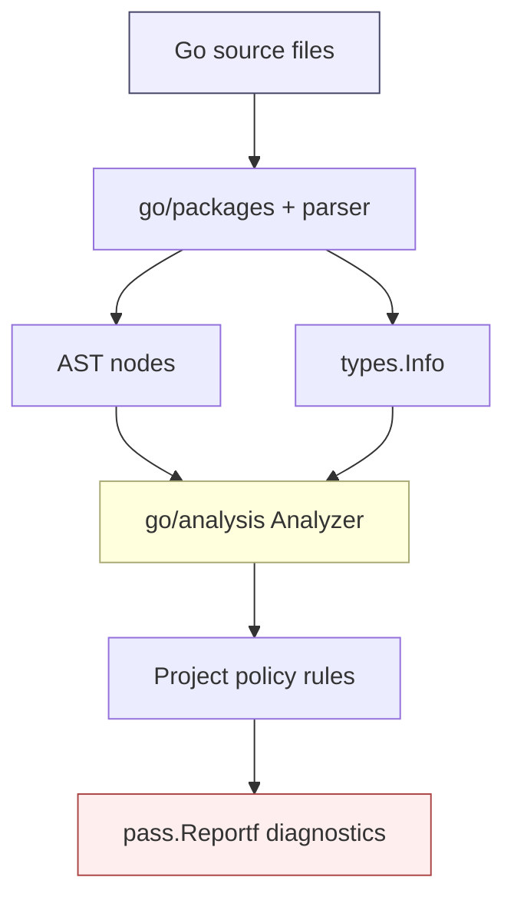
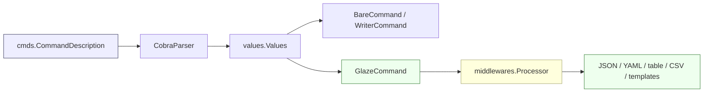
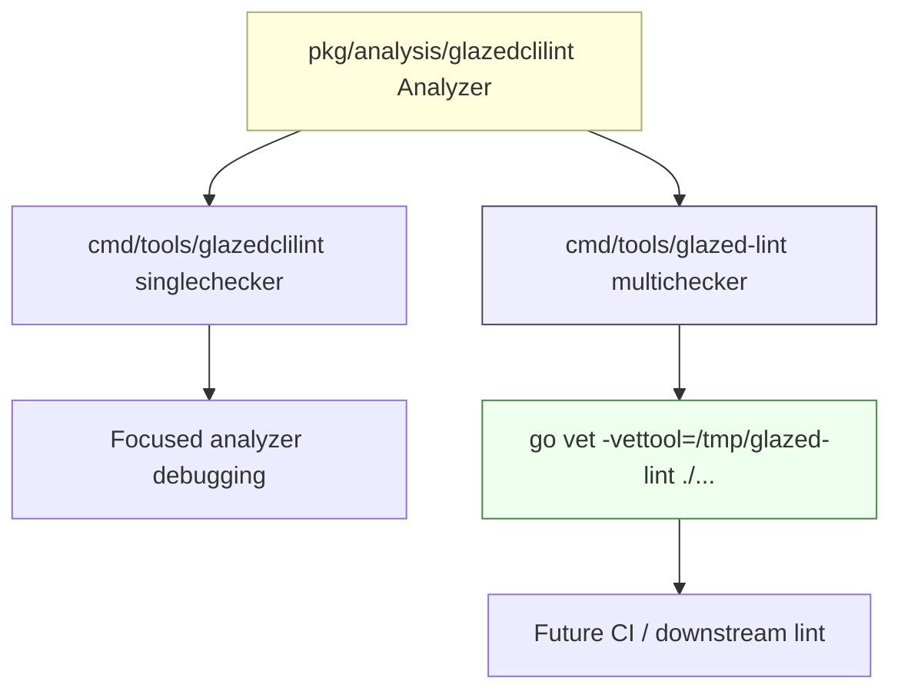

# Implementing Go Analysis Linters: The Glazed CLI Linter Deep Dive

A linter is a small compiler with an opinion. It reads source code, reconstructs enough of the program's meaning to recognize a pattern, and then reports when that pattern violates a local rule. The most useful linters are not generic style police. They encode the facts that a project has learned the hard way: which APIs bypass its architecture, which shortcuts produce confusing behavior, and which conventions make future changes safer.

This report explains how the new Glazed CLI linter was built, but it also uses that project as a concrete path into Go's `go/analysis` framework. The goal is to teach the general pattern first, then show how the Glazed-specific rules fall out of that pattern.

> [!summary]
> The Glazed CLI linter is a custom `go vet` analyzer that enforces three project conventions: avoid direct `os.Getenv` in CLI code, avoid raw Cobra/go flag definitions in Glazed verbs, and do not expose Glazed output flags on commands that do not emit structured rows.
>
> The implementation lives in `pkg/analysis/glazedclilint`, is packaged through both a singlechecker and a multichecker command, has `analysistest` fixtures, and is documented through an embedded Glazed help entry.
>
> The interesting lesson is not just the three checks. It is the shape of a maintainable linter: define a policy, match code by semantic identity rather than text, build small fixtures, run it as a vettool, and treat initial failures as an audit report before making the rule mandatory.

## Project report

The project took place in the Glazed repository at:

```text
/home/manuel/workspaces/2026-05-24/add-glazed-linters/glazed
```

The working branch is:

```text
task/add-glazed-linters
```

The immediate request was to add a linting tool specifically for Glazed that identifies three situations:

1. direct use of `os.Getenv`,
2. adding Glazed output sections to a CLI verb that does not output structured data through the Glazed framework,
3. using raw Cobra flags, `pflag`, or the standard Go `flag` package in CLI verbs.

The work began as a docmgr ticket with an intern-oriented design guide, then moved into implementation. The relevant ticket is:

```text
glazed/ttmp/2026/05/24/GLZ-CLI-LINT--design-glazed-cli-linting-rules
```

The implementation commits currently on the branch are:

```text
2a5ae41 docs: plan glazed CLI linter
c657de3 lint: add glazed CLI analyzer
6ea21db docs: record glazed CLI linter implementation
77a8311 lint: migrate selected CLI findings
```

The main files added by the implementation are:

```text
Makefile
cmd/tools/glazed-lint/main.go
cmd/tools/glazedclilint/main.go
pkg/analysis/glazedclilint/analyzer.go
pkg/analysis/glazedclilint/analyzer_test.go
pkg/analysis/glazedclilint/testdata/src/a/a.go
pkg/doc/topics/31-glazed-cli-lint.md
```

The branch also includes a follow-up migration commit, `77a8311`, which converts selected existing findings in `cmd/build-web`, `cmd/docsctl`, `cmd/examples/config-plan`, `cmd/glaze/cmds/html`, and `cmd/glaze/cmds/markdown`. After that migration, running `make glazed-lint` still reports remaining findings in:

```text
cmd/examples/sources-example/main.go
pkg/cmds/sources/vault.go
pkg/help/render.go
```

That remaining failure is a useful result, not a defect in the analyzer. New linters often begin life as audit tools. They show the project what already violates the new rule. Only after those findings are fixed, narrowed, or intentionally allowlisted should the tool become part of the default `make lint` path.

## Why projects need custom linters

Most language tooling enforces language rules. The compiler tells you whether code is valid Go. `go vet` and `staticcheck` tell you whether code is suspicious according to broadly useful patterns. A project-specific linter answers a different question: does this code violate the architecture of this project?

That distinction matters. The following code compiles:

```go
cmd.Flags().StringVar(&address, "address", ":8088", "Address to listen on")
```

It is normal Cobra. It is not a language error, and it is not generally wrong. But in a Glazed CLI verb it bypasses the command schema. The flag will not be represented as a `fields.Definition`; it will not participate in the same schema printing, config/env/default source chain, or generated command descriptions as the rest of the framework. The problem is not Go. The problem is local architecture.

The same is true for direct environment reads:

```go
pager := os.Getenv("PAGER")
```

This is legal Go. It is also sometimes the right thing in a low-level adapter. But in a command configuration path it hides an input from the Glazed parser. It does not show up in help, cannot be explained by `--print-schema`, and does not participate in the same precedence model as command flags, config files, env sources, and defaults.

Custom linters are how a project makes these local rules executable. They move knowledge from review comments into repeatable tooling.

## The mental model: a linter is a query over typed syntax

The first idea to internalize is that a Go analyzer does not have to guess from raw text. It can see both syntax and types.

A text search can find this:

```go
os.Getenv("PAGER")
```

but it may miss this:

```go
operating "os"

operating.Getenv("PAGER")
```

A type-aware analyzer sees both calls as the same function: a function named `Getenv` from package path `os`. That is why the Glazed linter matches by resolved object identity rather than import spelling.

The `go/analysis` framework gives an analyzer a `Pass`. The pass contains parsed files, type information, positions, imports, and a way to report diagnostics. The analyzer asks questions like:

- Is this AST node a function call?
- Which function does this selector resolve to?
- Is the receiver type `*pflag.FlagSet`?
- Does this command type have a method named `RunIntoGlazeProcessor`?
- Is this file generated, a test file, or part of an allowlisted framework bridge package?

That is the core loop. A linter is a set of typed queries over the syntax tree.



## The Glazed command model the linter protects

The linter exists because Glazed has a particular command architecture. A command is not just a Cobra command with flags. It is a `cmds.CommandDescription` plus one of the Glazed command interfaces.

A typical command declares flags like this:

```go
cmds.NewCommandDescription(
    "serve",
    cmds.WithFlags(
        fields.New(
            "address",
            fields.TypeString,
            fields.WithDefault(":8088"),
            fields.WithHelp("Address to listen on"),
        ),
    ),
)
```

The framework then turns those fields into Cobra flags, parses runtime values, and resolves sources in an ordered chain. A field can come from the command line, positional arguments, environment variables, config files, or defaults. Because the field is part of the schema, it can also appear in help pages, generated command descriptions, aliases, and debug output.

At execution time, a command usually fits one of three shapes:

| Command interface | What it means | Output responsibility |
|---|---|---|
| `cmds.BareCommand` | The command performs side effects or controls its own behavior. | The command owns output and side effects. |
| `cmds.WriterCommand` | The command writes classic text or bytes. | The command writes to an `io.Writer`. |
| `cmds.GlazeCommand` | The command emits structured rows. | The command calls `gp.AddRow` through `RunIntoGlazeProcessor`. |

The Glazed output section belongs to the third shape. It provides flags such as `--output`, `--fields`, `--jq`, sorting, templating, and skip/limit. Those flags only make sense if the command emits rows through the Glazed processor pipeline.



If a command exposes Glazed output flags but never emits rows, the user gets a false promise. They can pass `--output json`, but the command may still print text, start a server, or do something else entirely. The linter catches that mismatch.

## The three Glazed linter rules

The analyzer is implemented in:

```text
pkg/analysis/glazedclilint/analyzer.go
```

It exports a standard `analysis.Analyzer`:

```go
var Analyzer = &analysis.Analyzer{
    Name:     "glazedclilint",
    Doc:      "enforce Glazed CLI policy: avoid raw env reads, raw flag APIs, and Glazed output flags on non-row commands",
    Requires: []*analysis.Analyzer{inspect.Analyzer},
    Run:      run,
}
```

The analyzer uses `inspect.Analyzer` for efficient AST traversal and `pass.TypesInfo` for semantic matching. The file is about 400 lines, which is a reasonable size for a first project-specific analyzer: large enough to include real logic and small enough to audit in one sitting.

### Rule 1: direct `os.Getenv`

The environment rule is the simplest one. It visits call expressions and asks: does this call resolve to the function `os.Getenv`?

The important part is semantic identity. The analyzer does not care whether the import is written as `os`, `operating`, or something else. It resolves the selector to a `*types.Func` and checks the package path and function name.

Pseudocode:

```text
for each CallExpr:
    fn = resolved function called by expression
    if fn.package == "os" and fn.name == "Getenv":
        report diagnostic
```

This catches both:

```go
os.Getenv("PAGER")
```

and:

```go
operating "os"
operating.Getenv("HOME")
```

The test fixture in `pkg/analysis/glazedclilint/testdata/src/a/a.go` includes both cases:

```go
func badEnv() string {
    return os.Getenv("PAGER") // want `use Glazed config/env middleware`
}

func badAliasedEnv() string {
    return operating.Getenv("HOME") // want `use Glazed config/env middleware`
}
```

This rule teaches a general linter lesson: if the thing you care about has a type identity, match the type identity. Text is a last resort.

### Rule 2: raw Cobra, pflag, and Go `flag` APIs

The raw flag rule has two shapes.

The first shape is a package-level flag call:

```go
flag.String("config", "", "config file")
pflag.String("profile", "", "profile")
```

The analyzer resolves the called function and checks whether it comes from package `flag` or `github.com/spf13/pflag`, then checks whether the function name is one of the flag-definition names.

The second shape is a method call on a flag set:

```go
cmd.Flags().StringVar(&address, "address", ":8080", "listen address")
cmd.PersistentFlags().Bool("verbose", false, "verbose")
```

This is trickier. The analyzer resolves the selected method and then checks the receiver expression's type. If the receiver is a `*github.com/spf13/pflag.FlagSet` and the method name is a flag-definition method, the analyzer reports it.

Pseudocode:

```text
for each CallExpr:
    fn = resolved function or method

    if fn.package in {"flag", "github.com/spf13/pflag"}:
        if fn.name in flag-definition-names:
            report

    if fn.name in flag-definition-names:
        if receiver type is *pflag.FlagSet:
            report
```

The rule deliberately reports `cmd.Flags().StringVar` because Cobra's `Flags()` method returns a pflag flag set. It does not need a special Cobra-only detector; the pflag receiver type is the stable fact.

This is another general lesson: sometimes the best way to detect an API family is not to match the top-level object (`cobra.Command`) but the object that actually receives the forbidden method (`pflag.FlagSet`).

### Rule 3: Glazed output sections on non-row commands

The Glazed-section rule is the most interesting because it is not purely local to one call. It has to connect several facts inside a constructor:

1. A local variable is initialized with `settings.NewGlazedSection()` or `settings.NewGlazedSchema()`.
2. That variable is passed to `cmds.WithSections(...)`.
3. The constructor returns a specific command type.
4. That command type does or does not implement `RunIntoGlazeProcessor`.

A simplified bad example looks like this:

```go
type TextCommand struct {
    *cmds.CommandDescription
}

func NewTextCommand() (*TextCommand, error) {
    glazedSection, _ := settings.NewGlazedSection()
    return &TextCommand{
        CommandDescription: cmds.NewCommandDescription(
            "text",
            cmds.WithSections(glazedSection),
        ),
    }, nil
}

func (c *TextCommand) RunIntoWriter(ctx context.Context, parsed *values.Values, w io.Writer) error {
    return nil
}
```

This command has a Glazed output section, but it is a writer command, not a row-emitting command. The linter reports the `cmds.WithSections(glazedSection)` use.

The rule works in two passes over each function body:

```text
infer command return type from function signature
if returned type has RunIntoGlazeProcessor:
    skip this function

for statements in function body:
    if assignment RHS is settings.NewGlazedSection/NewGlazedSchema:
        remember the LHS variable object

for calls in function body:
    if call is cmds.WithSections(...):
        if any argument is a remembered Glazed section variable:
            report
```

The method check uses the command type's method set. It asks whether the pointer-to-command type has a method named `RunIntoGlazeProcessor` with three parameters and one result. This is deliberately light. The first version does not need to rebuild the exact interface type from all imported packages; it only needs to distinguish row-emitting commands from classic commands.

This rule teaches the central lesson of practical static analysis: start with the common shape. You do not need to solve every possible Go program on the first pass. You need to catch the constructors the codebase actually writes, cover them with fixtures, and extend the inference when a real missed case appears.

## Packaging: singlechecker and multichecker

A Go analyzer is a library value. To run it from the command line, you wrap it in a driver. The Glazed project now has two drivers.

The focused driver lives at:

```text
cmd/tools/glazedclilint/main.go
```

It uses `singlechecker`:

```go
func main() {
    singlechecker.Main(glazedclilint.Analyzer)
}
```

This is useful while developing one analyzer. It keeps the command small and makes it easy to test one rule set.

The bundled driver lives at:

```text
cmd/tools/glazed-lint/main.go
```

It uses `multichecker`:

```go
func main() {
    multichecker.Main(
        glazedclilint.Analyzer,
    )
}
```

This is the shape that scales. If Glazed later adds more custom analyzers, they can be registered in the same `glazed-lint` command. Downstream repositories can build one vettool and run all Glazed-specific checks.



The Makefile targets are:

```make
GLAZED_LINT_BIN ?= /tmp/glazed-lint
GLAZEDCLILINT_BIN ?= /tmp/glazedclilint

glazed-lint-build:
	go build -o $(GLAZED_LINT_BIN) ./cmd/tools/glazed-lint

glazed-lint: glazed-lint-build
	go vet -vettool=$(GLAZED_LINT_BIN) ./cmd/... ./pkg/...

glazedclilint:
	go build -o $(GLAZEDCLILINT_BIN) ./cmd/tools/glazedclilint
	go vet -vettool=$(GLAZEDCLILINT_BIN) ./cmd/... ./pkg/...
```

The default `lint` target was not changed. That restraint is important. A new policy linter should first be useful as an audit tool. Once the existing findings are handled, it can become mandatory.

## Testing a linter with analysistest

A linter needs tests for both sides of each rule: the bad pattern should be reported, and the good pattern should not. Go's `analysistest` package supports this by compiling miniature packages under `testdata/src` and matching diagnostics against `// want` comments.

The Glazed test entry point is short:

```go
func TestAnalyzer(t *testing.T) {
    analysistest.Run(t, analysistest.TestData(), Analyzer, "a")
}
```

The fixture file is the real specification. It includes examples such as:

```go
func badCobraFlagMethod() *cobra.Command {
    var address string
    cmd := &cobra.Command{}
    cmd.Flags().StringVar(&address, "address", ":8080", "listen address") // want `define CLI flags with cmds.WithFlags`
    cmd.PersistentFlags().Bool("verbose", false, "verbose")               // want `define CLI flags with cmds.WithFlags`
    return cmd
}
```

and:

```go
type RowsCommand struct {
    *cmds.CommandDescription
}

func NewRowsCommand() (*RowsCommand, error) {
    glazedSection, _ := settings.NewGlazedSection()
    return &RowsCommand{
        CommandDescription: cmds.NewCommandDescription(
            "rows",
            cmds.WithSections(glazedSection),
        ),
    }, nil
}

func (c *RowsCommand) RunIntoGlazeProcessor(ctx context.Context, parsed *values.Values, gp middlewares.Processor) error {
    return nil
}
```

The second example should not report. It attaches a Glazed section, but the command implements the row-emitting method. That negative case is as important as the positive case. A linter that only knows how to reject code will quickly become unusable.

The fixtures also include generated and test files. By default, the analyzer skips `_test.go` files and files with the standard `Code generated ... DO NOT EDIT` marker. This prevents policy checks from interfering with test scaffolding and generated code.

## The subtle part: allowlists are not excuses

Every real static analyzer needs escape hatches. The question is where to put them.

The Glazed analyzer has flags:

```text
-allow-tests
-allow-generated
-allow-paths
```

The default path allowlist includes framework bridge packages such as `pkg/cli/`, `pkg/cmds/fields/`, `pkg/cmds/logging/`, `pkg/help/cmd/`, and `pkg/analysis/`. These are not arbitrary exceptions. They are places where raw Cobra, pflag, or analyzer flags are part of building the framework itself.

That distinction matters. An allowlist should mean "this file implements the bridge that user code should not bypass." It should not mean "this user-facing command was inconvenient to migrate."

There was one subtle testing failure here. Adding `pkg/analysis/` to the allowlist stopped the analyzer from flagging its own configuration flags, which was correct. But the analysistest fixture paths also live under `pkg/analysis/.../testdata/src/...`, so the test diagnostics disappeared. The fix was to not apply production path allowlists to files under `/testdata/src/`.

That small failure captures a general rule: test fixtures often mimic production import paths, but they should not inherit production allowlist behavior unless the test is specifically about allowlisting.

## Reading the current audit output

After the selected migration commit, `make glazed-lint` still reports:

```text
cmd/examples/sources-example/main.go:120:2: define CLI flags with cmds.WithFlags(fields.New(...)) instead of raw Cobra/pflag/flag APIs
cmd/examples/sources-example/main.go:121:2: define CLI flags with cmds.WithFlags(fields.New(...)) instead of raw Cobra/pflag/flag APIs
cmd/examples/sources-example/main.go:122:2: define CLI flags with cmds.WithFlags(fields.New(...)) instead of raw Cobra/pflag/flag APIs
cmd/examples/sources-example/main.go:123:2: define CLI flags with cmds.WithFlags(fields.New(...)) instead of raw Cobra/pflag/flag APIs
pkg/cmds/sources/vault.go:385:12: use Glazed config/env middleware or an explicit command field instead of os.Getenv in CLI code
pkg/cmds/sources/vault.go:416:15: use Glazed config/env middleware or an explicit command field instead of os.Getenv in CLI code
pkg/help/render.go:36:5: use Glazed config/env middleware or an explicit command field instead of os.Getenv in CLI code
```

This output is a map of remaining decisions.

The `sources-example` findings are likely a straightforward migration target or a candidate for excluding example code from strict enforcement. The Vault source findings are more nuanced: `pkg/cmds/sources/vault.go` is a configuration-source implementation, not an ordinary user-facing command. It may deserve a narrow allowlist if those reads are the correct low-level integration point. The `pkg/help/render.go` finding is another question of intent: if `GLAMOUR_STYLE` is truly a rendering-library environment convention, the project should decide whether to turn it into a Glazed option or allow it as a narrow framework integration.

A good linter does not remove judgment. It moves judgment to a smaller, clearer set of decisions.

## How to implement a project-specific Go linter

The Glazed work suggests a repeatable sequence for future linters.

### 1. Write the policy in ordinary language

Before writing code, say what is wrong and why. A good linter rule has a reason that a reviewer can agree with.

Weak policy:

```text
Do not use os.Getenv.
```

Better policy:

```text
Do not use os.Getenv in CLI command code because it hides configuration from the Glazed command schema and source precedence model. Framework source implementations may be allowlisted when they deliberately bridge environment variables into the parser.
```

The second version tells you how to design diagnostics, tests, and exceptions.

### 2. Choose the semantic fact to match

Ask what fact makes the pattern bad.

| Policy | Semantic fact to match |
|---|---|
| No direct env reads | Called function is `os.Getenv`. |
| No raw flags | Called function or method defines flags through `flag`, `pflag`, or `*pflag.FlagSet`. |
| No Glazed output on non-row commands | Constructor adds a Glazed section and returned command type lacks `RunIntoGlazeProcessor`. |

Text matching is tempting because it is fast. It is also brittle. Prefer `types.Object`, package paths, receiver types, and method sets whenever possible.

### 3. Implement the smallest useful traversal

Most rules start with one of these loops:

```go
insp.Preorder([]ast.Node{(*ast.CallExpr)(nil)}, func(n ast.Node) {
    call := n.(*ast.CallExpr)
    // inspect call
})
```

or:

```go
for _, file := range pass.Files {
    ast.Inspect(file, func(n ast.Node) bool {
        fn, ok := n.(*ast.FuncDecl)
        if !ok { return true }
        // inspect function body
        return false
    })
}
```

Use call-level traversal when one expression is enough. Use function-level traversal when you need to connect facts across a constructor.

### 4. Report a fix-oriented diagnostic

A diagnostic should say what to do next. The Glazed messages are deliberately prescriptive:

```text
use Glazed config/env middleware or an explicit command field instead of os.Getenv in CLI code
```

```text
define CLI flags with cmds.WithFlags(fields.New(...)) instead of raw Cobra/pflag/flag APIs
```

```text
this command exposes Glazed output flags but does not implement RunIntoGlazeProcessor
```

The message is not just "bad." It points to the architectural replacement.

### 5. Build tests as examples

The tests should read like a small textbook of forbidden and allowed patterns. For each rule, include:

- one obvious bad case,
- one alias or type-resolution case,
- one allowed case,
- one edge case such as generated or test files.

The fixture becomes documentation. Future maintainers can read `testdata/src/a/a.go` and understand the rule faster than by reading the analyzer.

### 6. Run it as an audit before enforcing it

A new linter usually finds existing violations. That is good. The first run tells you whether the policy is too broad, where the codebase has drifted, and which exceptions are legitimate.

Do not wire a new analyzer into default CI until you can answer these questions:

- Which findings are true violations?
- Which findings are framework bridge code?
- Which findings should be fixed now?
- Which findings should be turned into narrow allowlist entries?
- Does the diagnostic explain the correct migration path?

## Tricky implementation details

### The called function is not always the syntax you see

Generic calls and selector expressions can wrap the real function expression. The analyzer handles `IndexExpr` and `IndexListExpr` before looking for selectors. This is the same habit used in mature analyzers: normalize the syntax first, then ask for the semantic object.

### Receiver type checks are stronger than method-name checks

Many packages can have a method named `String` or `Bool`. The raw flag rule only reports when the receiver is a `*pflag.FlagSet`, or when the package-level function comes from `flag` or `pflag`. That prevents the analyzer from treating ordinary methods named `String` as flag definitions.

### Constructor inference is intentionally conservative

The Glazed-section rule infers the command type from the function result type. It handles common constructors like:

```go
func NewTextCommand() (*TextCommand, error) { ... }
```

This is enough for the project's current style. If a future command hides its type behind an interface or helper, the analyzer may miss it. That is acceptable for v1. Static analysis should grow from real examples, not from imagined completeness.

### Generated and test code need different defaults

Test files often intentionally exercise forbidden patterns. Generated files should not be manually edited to satisfy project style. Skipping them by default keeps the linter focused on source code that humans own.

## The help entry as part of the feature

The Glazed help entry lives at:

```text
pkg/doc/topics/31-glazed-cli-lint.md
```

This matters because tooling is only useful when people can discover how to run it and what to do with its output. The help page explains:

- what `glazedclilint` checks,
- how to run the singlechecker and multichecker tools,
- what analyzer flags exist,
- how to fix each diagnostic,
- how to troubleshoot framework false positives,
- which related Glazed help topics explain command authoring and middlewares.

The page is embedded automatically through the existing `pkg/doc/doc.go` `go:embed *` wiring. It was verified with:

```bash
go run ./cmd/glaze help glazed-cli-lint
```

A help page is not decorative. For a project-specific linter, it is part of the interface.

## Recommended rollout path

The branch is not done merely because the analyzer exists. The tool now has to move from "works" to "trusted."

A safe rollout path is:

1. Keep `make glazed-lint` as an explicit audit target.
2. Triage the remaining findings.
3. Fix straightforward command migrations.
4. Add narrow allowlist entries only for true framework bridge code.
5. Re-run the target until it passes.
6. Add `glazed-lint` to default `make lint`.
7. Teach downstream repositories, such as Pinocchio, to install `github.com/go-go-golems/glazed/cmd/tools/glazed-lint` at the Glazed module version rather than `@latest`.

The last point matters. A downstream repository should not install a moving linter from `@latest`; that creates CI drift. It should install the vettool that corresponds to the Glazed version in its `go.mod`, with a workspace fallback for local development.

## Working rules for future linter work

The practical rules are simple, but they are worth writing down.

- Match semantic identity, not spelling, whenever the Go type checker can tell you what something is.
- Make diagnostics prescriptive. The message should point to the project-approved replacement.
- Test allowed patterns as carefully as forbidden patterns.
- Keep allowlists narrow and explain what architectural boundary they represent.
- Treat the first full-repo run as an audit, not a failure of the tool.
- Do not add a custom linter to default CI until the existing codebase is clean or intentionally allowlisted.
- Document the linter as a user-facing tool, because contributors need to understand its purpose before they will trust it.

## Related project files

- `/home/manuel/workspaces/2026-05-24/add-glazed-linters/glazed/pkg/analysis/glazedclilint/analyzer.go`
- `/home/manuel/workspaces/2026-05-24/add-glazed-linters/glazed/pkg/analysis/glazedclilint/testdata/src/a/a.go`
- `/home/manuel/workspaces/2026-05-24/add-glazed-linters/glazed/cmd/tools/glazedclilint/main.go`
- `/home/manuel/workspaces/2026-05-24/add-glazed-linters/glazed/cmd/tools/glazed-lint/main.go`
- `/home/manuel/workspaces/2026-05-24/add-glazed-linters/glazed/pkg/doc/topics/31-glazed-cli-lint.md`
- `/home/manuel/workspaces/2026-05-24/add-glazed-linters/glazed/ttmp/2026/05/24/GLZ-CLI-LINT--design-glazed-cli-linting-rules/design-doc/01-glazed-cli-linting-rules-analysis-and-implementation-guide.md`
- `/home/manuel/workspaces/2026-05-24/add-glazed-linters/glazed/ttmp/2026/05/24/GLZ-CLI-LINT--design-glazed-cli-linting-rules/reference/01-investigation-diary.md`

## Related notes

- [[ARTICLE - Playbook - Self-Contained Go Wasm and JavaScript Browser Applications]] — an example of the durable playbook style used for reusable engineering knowledge.
- [[PROJ - ZK Tool]] — an example of project-report structure and frontmatter-heavy project documentation.
