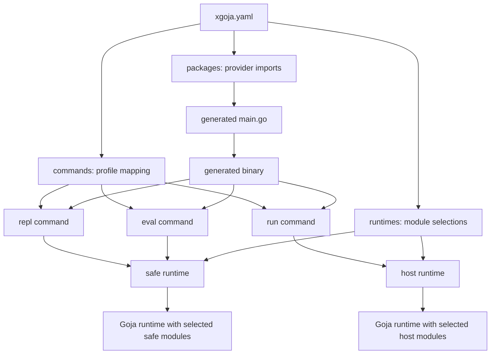
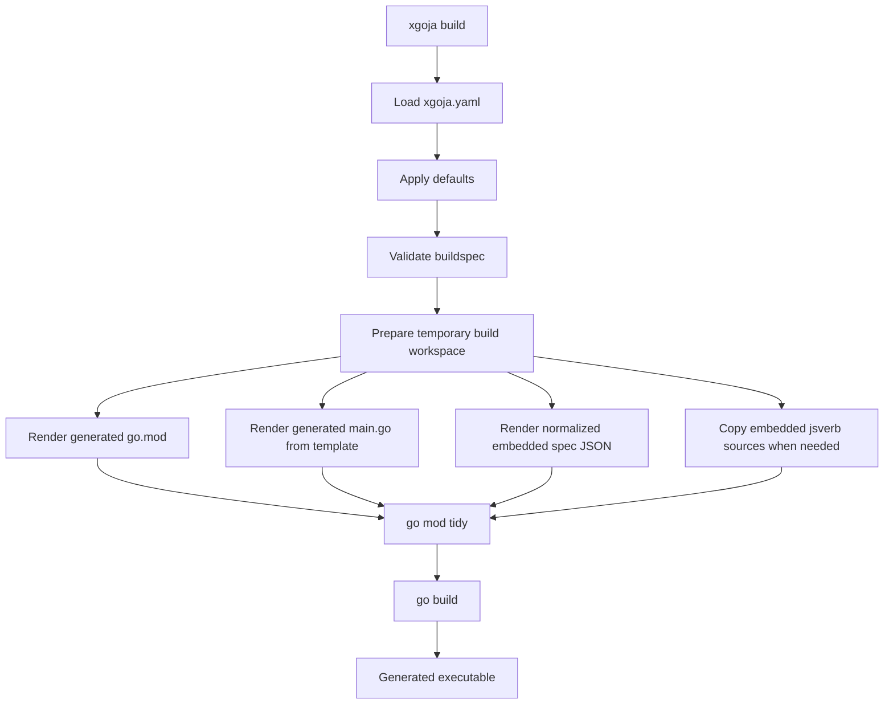

# xgoja: Generated Goja Applications, Provider Architecture, and Runtime Profiles

`xgoja` is a build tool for creating Goja-powered command-line applications. It reads a declarative `xgoja.yaml` file, generates a small Go program, imports selected provider packages, embeds a normalized runtime specification, and compiles a normal Go binary. The generated binary can evaluate JavaScript, run JavaScript files, start an interactive terminal REPL, list compiled-in provider modules, and mount JavaScript verbs as Glazed/Cobra commands.

This report explains the project as a system. It starts with the problem `xgoja` solves, then builds the model from the build specification to generated source, provider registration, runtime creation, command execution, JavaScript verb mounting, and first-party provider packages. The goal is to make the design understandable enough that a reader can extend it without reconstructing the design from commit history.

> [!summary]
> - `xgoja` uses compile-time composition for Go-backed JavaScript modules. Provider packages are ordinary Go imports in generated source, not dynamically loaded native plugins.
> - The buildspec separates **build-time package selection** from **runtime profile selection**. A module can be compiled into the binary without being visible to every command.
> - Generated binaries delegate reusable behavior to `pkg/xgoja/app`. The generated `main.go` stays thin: register providers, decode the embedded spec, build a root command, and execute it.
> - Provider packages expose Goja modules through `providerapi.Register`. Runtime profiles select provider modules and assign JavaScript `require(...)` names.
> - `xgoja` supports one-shot `eval`, file-based `run`, rich terminal `repl`, module listing, and mounted `jsverbs`; it also supports standalone, Cobra, and adapter target modes.

## Why xgoja exists

Goja applications often need JavaScript extension points and Go-backed native capabilities at the same time. JavaScript files can be loaded from disk or embedded into a binary. Go modules that implement native JavaScript bindings have a different constraint: they must be compiled into the process. A Go-backed `require("database")` module, a custom application API, or a hardware-specific module cannot be added to an already-built binary without moving into Go plugin loading and all the ABI, package identity, version, and deployment constraints that come with that approach.

`xgoja` chooses a simpler boundary. It composes Go modules at source level and then runs the normal Go toolchain. The user writes a build specification. The builder generates Go source that imports the requested providers. The generated program calls each provider's registration function, embeds the normalized spec, and delegates runtime behavior to the xgoja app package. The final artifact is a normal executable.

This decision shapes the whole system. `xgoja` is not a dynamic native plugin loader. It is a generator for custom Goja applications. The generated binary is allowed to load JavaScript dynamically, but its Go-backed module set is determined at build time.

## The basic user workflow

A user starts with a YAML file. The file names the generated application, lists provider packages, defines runtime profiles, and maps generated commands to runtime profiles.

```yaml
name: example-app
target:
  kind: xgoja
  output: dist/example-app
packages:
  - id: go-go-goja-core
    import: github.com/go-go-golems/go-go-goja/pkg/xgoja/providers/core
runtimes:
  main:
    modules:
      - package: go-go-goja-core
        name: path
        as: path
      - package: go-go-goja-core
        name: yaml
        as: yaml
commands:
  eval:
    enabled: true
    runtime: main
  run:
    enabled: true
    runtime: main
  repl:
    enabled: true
    runtime: main
```

The common command sequence is:

```bash
xgoja doctor -f xgoja.yaml
xgoja list-modules -f xgoja.yaml
xgoja build -f xgoja.yaml --xgoja-replace /path/to/go-go-goja --keep-work
./dist/example-app eval 'require("path").basename("/tmp/report.txt")'
./dist/example-app run ./script.js
./dist/example-app repl
```

`doctor` validates the spec. `list-modules` shows the runtime profile selections. `build` creates and compiles the generated program. The generated program then exposes its own command surface.

## Build-time selection and runtime selection

The most important design rule in `xgoja` is that provider packages and runtime profiles are separate decisions.

A provider package listed under `packages:` is compiled into the generated binary. That means the Go code is present and its registration function can contribute modules to the provider registry. This does not mean every command can require every module from that provider.

A runtime profile listed under `runtimes:` chooses which modules are installed into a fresh Goja runtime for a particular command. A command under `commands:` names the runtime profile it uses.



This separation makes capability boundaries explicit. A binary can contain both safe and host-capability providers, while `eval` uses only the safe profile and `run` uses a profile that includes host modules.

The `examples/xgoja/multiple-runtimes/` example demonstrates this directly. Its `eval` command uses a `safe` runtime that has `path` and `yaml`, while its `run` command uses a `host` runtime that includes `fs`.

```yaml
runtimes:
  safe:
    modules:
      - package: go-go-goja-core
        name: path
        as: path
      - package: go-go-goja-core
        name: yaml
        as: yaml
  host:
    modules:
      - package: go-go-goja-core
        name: path
        as: path
      - package: go-go-goja-host
        name: fs
        as: fs
        config:
          allow: true
commands:
  eval:
    enabled: true
    runtime: safe
  run:
    enabled: true
    runtime: host
  repl:
    enabled: true
    runtime: safe
```

The smoke test asserts three facts:

```bash
# Works: eval uses the safe runtime and safe includes path.
./dist/multiple-runtimes eval 'require("path").basename("/tmp/safe.txt")'

# Fails: eval uses the safe runtime and safe does not include fs.
./dist/multiple-runtimes eval 'require("fs")'

# Works: run uses the host runtime and host includes fs.
./dist/multiple-runtimes run scripts/host-run.js
```

This is the core xgoja model in one example.

## Project layout

`xgoja` lives inside the `go-go-goja` repository. The implementation is divided so that builder-only code stays under `cmd/xgoja/internal`, while generated binaries import stable public packages under `pkg/xgoja`.

```text
cmd/xgoja/
  root.go                     # builder CLI root and bundled help wiring
  cmd_build.go                # xgoja build command
  cmd_doctor.go               # buildspec validation command
  cmd_inspect.go              # generated-source inspection command
  cmd_list_modules.go         # runtime profile listing command
  doc/                        # bundled Glazed help pages for the builder
  internal/
    buildspec/                # YAML schema, defaults, validation
    buildexec/                # go mod/go build execution helpers
    generate/                 # go.mod, main.go, embedded source generation

pkg/xgoja/
  providerapi/                # public provider registration contract
  app/                        # generated-runtime command and runtime support
  doc/                        # bundled help for generated binaries
  providers/
    core/                     # first-party safe/core provider
    host/                     # guarded host-capability provider
  testprovider/               # fixture provider used by generated-build tests
  testadapter/                # adapter target test fixture
  testcobra/                  # cobra target test fixture

examples/xgoja/
  runtime-filesystem/         # runtime filesystem jsverbs
  embedded-jsverbs/           # local jsverbs embedded into generated binary
  provider-shipped-jsverbs/   # provider-shipped jsverbs
  core-provider/              # first-party core provider smoke
  host-provider/              # guarded host provider smoke
  multiple-runtimes/          # command-to-runtime-profile boundary smoke
```

The package boundary matters. `cmd/xgoja/internal/buildspec` is allowed to be builder-only because generated binaries do not import it. `pkg/xgoja/providerapi` and `pkg/xgoja/app` are public because generated programs and provider packages import them from temporary build modules.

## The buildspec schema

The buildspec has five central sections.

| Section | Purpose |
| --- | --- |
| `target` | Defines the generated binary shape and output path. |
| `packages` | Lists provider packages to import and register at build time. |
| `runtimes` | Defines named module selections for command invocations. |
| `commands` | Enables generated commands and maps each command to a runtime profile. |
| `jsverbs` | Defines JavaScript verb sources to mount under the generated jsverb command. |

The command section currently distinguishes one-shot evaluation from the rich REPL.

```yaml
commands:
  eval:
    enabled: true
    runtime: main
    name: eval
  run:
    enabled: true
    runtime: main
    name: run
  repl:
    enabled: true
    runtime: main
    name: repl
  jsverbs:
    enabled: true
    runtime: main
    name: verbs
```

This naming is deliberate. `eval` evaluates one JavaScript source string. `run` executes a JavaScript file and installs script-local module roots. `repl` starts the rich Bubble Tea terminal REPL. `jsverbs` mounts JavaScript-defined functions as CLI commands.

The builder validates the structure before generation. Validation checks include package uniqueness, known runtime package IDs, duplicate runtime aliases, command runtime references, supported target kinds, and JavaScript verb source shape.

## Provider packages

A provider package is a Go package that registers one provider ID and a set of modules or verb sources. The registration function is usually named `Register`.

```go
func Register(registry *providerapi.Registry) error {
    return registry.Package("fixture",
        providerapi.Module{
            Name:        "hello",
            DefaultAs:   "hello",
            Description: "Example module",
            New: func(ctx providerapi.ModuleContext) (require.ModuleLoader, error) {
                return func(vm *goja.Runtime, module *goja.Object) {
                    exports := module.Get("exports").(*goja.Object)
                    _ = exports.Set("greet", func(name string) string {
                        return "hello " + name
                    })
                }, nil
            },
        },
    )
}
```

The first argument to `registry.Package` is the provider package ID. In the current implementation, the ID used in `xgoja.yaml` must match that provider ID.

```yaml
packages:
  - id: fixture
    import: github.com/go-go-golems/go-go-goja/pkg/xgoja/testprovider
```

A provider module does not receive a raw Goja runtime when it is registered. It receives a `providerapi.ModuleContext` when xgoja is constructing a particular runtime profile. The context includes:

- `Context`, the runtime creation context,
- `Name`, the provider module name,
- `As`, the JavaScript alias chosen by the runtime profile,
- `Config`, the JSON-marshaled module config from the buildspec,
- `Host`, a placeholder for live host services in target-mode integrations.

The module factory returns a `require.ModuleLoader`. xgoja then registers that loader under the runtime profile's alias.

## Runtime creation

Generated commands create fresh runtimes through `pkg/xgoja/app.RuntimeFactory`. The factory looks up the runtime profile, resolves each selected provider module, adapts the provider module into `engine.RuntimeModuleSpec`, and asks the engine builder to construct a runtime.

The important part of `pkg/xgoja/app/factory.go` is the adapter from provider module to engine runtime module:

```go
type providerRuntimeModuleSpec struct {
    instance ModuleInstance
    module   providerapi.Module
}

func (s providerRuntimeModuleSpec) RegisterRuntimeModule(ctx *engine.RuntimeModuleContext, reg *require.Registry) error {
    config, err := json.Marshal(s.instance.Config)
    if err != nil {
        return fmt.Errorf("marshal config for %s.%s: %w", s.instance.Package, s.instance.Name, err)
    }
    loader, err := s.module.New(providerapi.ModuleContext{
        Context: ctx.Context,
        Name:    s.instance.Name,
        As:      s.instance.Alias(),
        Config:  config,
    })
    if err != nil {
        return fmt.Errorf("create module %s.%s: %w", s.instance.Package, s.instance.Name, err)
    }
    reg.RegisterNativeModule(s.instance.Alias(), loader)
    return nil
}
```

The runtime factory disables implicit defaults:

```go
builder := engine.NewBuilder(
    engine.WithImplicitDefaultRegistryModules(false),
    engine.WithDataOnlyDefaultRegistryModules(false),
).WithModules(modules...)
```

That is a policy decision. A generated xgoja binary should not silently expose default modules beyond the runtime profile. If a command needs `fs`, `database`, or any other module, the buildspec should say so.

## Generated source

`xgoja` generates a small Go program. The generated source is now rendered through an embedded Go template rather than a long sequence of string writes. The generated `main.go` has a stable shape:

```go
func main() {
    registry := providerapi.NewRegistry()
    must(providerA.Register(registry))
    must(providerB.Register(registry))

    root, err := app.NewRootCommand(app.Options{
        Providers: registry,
        SpecJSON: embeddedSpecJSON,
        EmbeddedJSVerbs: embeddedJSVerbs,
    })
    must(err)

    if err := root.Execute(); err != nil {
        fmt.Fprintln(os.Stderr, err)
        os.Exit(1)
    }
}
```

In target modes, the generated program still registers providers and decodes the embedded spec, but it attaches generated xgoja commands to a target Cobra root or hands an `app.Host` to an adapter package.

The generated source has three responsibilities:

1. Import provider packages and any target package.
2. Register providers into a `providerapi.Registry`.
3. Construct and execute the correct root command.

Reusable behavior belongs in `pkg/xgoja/app`, not in generated source.

## Generated command surface

A pure generated xgoja binary can expose these commands.

| Command family | Config key | Implementation role |
| --- | --- | --- |
| One-shot eval | `commands.eval` | Evaluate a JavaScript string in a fresh runtime profile. |
| File run | `commands.run` | Execute a JavaScript file with script-local module roots. |
| Interactive REPL | `commands.repl` | Start a Bubble Tea REPL backed by a runtime profile. |
| Modules listing | always attached as `modules` | List provider modules registered in the generated binary. |
| JavaScript verbs | `commands.jsverbs` | Mount discovered JS verb functions as Glazed/Cobra subcommands. |
| Help/logging | installed by framework setup | Add Glazed help pages and logging flags to generated binaries. |

The host object attaches these commands:

```go
func (h *Host) AttachDefaultCommands(root *cobra.Command) {
    if h.Spec.Commands.Eval.Enabled {
        h.AttachEval(root)
    }
    if h.Spec.Commands.Run.Enabled {
        h.AttachRun(root)
    }
    if h.Spec.Commands.Repl.Enabled {
        h.AttachRepl(root)
    }
    h.AttachModules(root)
    if h.Spec.Commands.JSVerbs.Enabled {
        h.AttachVerbs(root)
    }
}
```

The command surface is spec-driven. If `commands.repl.enabled` is false, the rich REPL command is not attached. If `commands.eval.name` is set to another name, the one-shot evaluation command uses that name.

## Script execution

The generated `run` command exists because evaluating a string and executing a file have different module-resolution requirements. A file often contains relative imports.

```js
const helper = require("./helper")
const path = require("path")
```

The generated `run` command creates a runtime through the runtime factory and passes require options derived from the script path. That lets sibling `require("./helper")` resolve relative to the script file while preserving the runtime profile's provider module policy.

The result is that `run` behaves like a script entrypoint, not just `eval` with file contents pasted into a string.

## The rich REPL

The generated `repl` command starts a Bubble Tea terminal UI. It uses the same runtime profile mechanism as other commands, but wraps the selected runtime in a Bobatea-compatible JavaScript evaluator. The evaluator is given the VM from an xgoja-created `engine.Runtime`, so provider modules and runtime-owner bindings remain consistent with the selected profile.

This command is intentionally named `repl`, while one-shot execution is named `eval`. That distinction matters because a REPL is more than a single expression evaluator. It has interactive input, multiline behavior, completion, help drawer integration, and terminal lifecycle.

In automated tests, the implementation validates command construction and help output rather than launching a real terminal UI. Manual use starts the program normally:

```bash
./dist/example-app repl
```

## JavaScript verbs

`jsverbs` let JavaScript files define CLI commands. xgoja supports three source modes.

| Source mode | Buildspec shape | Runtime behavior |
| --- | --- | --- |
| Runtime filesystem | `path: ./verbs`, `embed: false` | The generated binary scans files from disk when it starts. |
| Embedded local | `path: ./verbs`, `embed: true` | xgoja copies files into the generated workspace and embeds them with `go:embed`. |
| Provider-shipped | `package: fixture`, `source: verbs` | A provider exposes an embedded filesystem as a `VerbSource`. |

A generated `verbs` command scans the configured sources, builds Glazed commands for each discovered verb, and invokes JavaScript through an xgoja runtime profile. If a verb needs provider modules, it receives the modules selected by `commands.jsverbs.runtime`.

The provider-shipped case is important because it lets a provider package ship native modules and JavaScript commands together. A provider can embed files and register them like this:

```go
//go:embed verbs/*.js
var verbsFS embed.FS

func Register(registry *providerapi.Registry) error {
    return registry.Package("fixture",
        providerapi.Module{...},
        providerapi.VerbSource{
            Name: "verbs",
            Root: "verbs",
            FS:   verbsFS,
        },
    )
}
```

The buildspec mounts that source with:

```yaml
commands:
  jsverbs:
    enabled: true
    runtime: repl
    name: verbs
jsverbs:
  - id: provider-defaults
    package: fixture
    source: verbs
```

The examples under `examples/xgoja/runtime-filesystem`, `examples/xgoja/embedded-jsverbs`, and `examples/xgoja/provider-shipped-jsverbs` each test one source mode.

## Target modes

The default target mode is `xgoja`, which creates a standalone generated root command. Two additional modes allow generated xgoja functionality to attach to existing Go applications.

| Target kind | Purpose |
| --- | --- |
| `xgoja` | Generate a standalone command-line binary. |
| `cobra` | Import an existing package, call its root constructor, and attach xgoja commands to that root. |
| `adapter` | Import an adapter package that receives an `*app.Host` and returns a root command. |

Cobra mode is useful when an application already has a root command and wants xgoja-generated commands added to it. Adapter mode is more flexible because the target package can decide exactly where and how the generated commands are mounted.

The generated source remains thin in all modes. It still imports providers, registers them, decodes the embedded spec, constructs an `app.Host`, and lets either xgoja or the target package handle command assembly.

## First-party providers

The project now includes first-party providers under `pkg/xgoja/providers`.

### Core provider

`pkg/xgoja/providers/core` registers safe, data-oriented modules under provider ID `go-go-goja-core`.

Current modules:

- `path`
- `node:path`
- `yaml`
- `crypto`
- `node:crypto`
- `time`
- `timer`
- `events`
- `node:events`

These modules are adapted from the existing `modules.NativeModule` registry. The provider imports the module packages for their `init()` registration, looks up each named module, and wraps its loader in a `providerapi.Module`.

This provider is useful for scripts that need common transformations and helpers but should not receive filesystem, process, or database access.

### Host provider

`pkg/xgoja/providers/host` registers host-capability modules under provider ID `go-go-goja-host`.

Current modules:

- `fs`
- `node:fs`
- `exec`
- `database`
- `db`

This provider is deliberately separate from the core provider. The modules can touch the host filesystem, run host processes, or open databases, so their configuration is explicit.

```yaml
runtimes:
  host:
    modules:
      - package: go-go-goja-host
        name: fs
        as: fs
        config:
          allow: true
      - package: go-go-goja-host
        name: exec
        as: exec
        config:
          allow: true
          allowedCommands:
            - echo
      - package: go-go-goja-host
        name: database
        as: database
        config:
          allowConfigure: true
```

The current security behavior is precise but not comprehensive:

- `fs` requires `config.allow: true`, but it is not path-sandboxed.
- `exec` requires `config.allow: true`, and `allowedCommands` can restrict exact command names.
- `database` disables JavaScript `configure()` unless `config.allowConfigure: true` is set.

This is an acknowledgement-and-policy layer, not a complete sandbox. That distinction should remain visible in documentation and examples.

## Examples as executable documentation

The `examples/xgoja` directory is part of the design, not just a demonstration folder. Each example is a runnable test of one concept.

| Example | What it proves |
| --- | --- |
| `runtime-filesystem` | A generated binary can scan JavaScript verb files from disk at runtime. |
| `embedded-jsverbs` | Local JavaScript verb files can be copied into the generated workspace and embedded into the final binary. |
| `provider-shipped-jsverbs` | A provider package can ship JavaScript verb sources and expose them to the generated binary. |
| `core-provider` | The first-party core provider works through generated `eval`, `run`, and `repl` commands. |
| `host-provider` | Guarded `fs`, `exec`, and `database` host modules work with explicit config. |
| `multiple-runtimes` | Different generated commands can use different runtime profiles in one binary. |

A useful validation loop is:

```bash
for dir in \
  runtime-filesystem \
  embedded-jsverbs \
  provider-shipped-jsverbs \
  core-provider \
  host-provider \
  multiple-runtimes; do
  make -C examples/xgoja/$dir smoke
done
```

The examples also document local-development constraints. When building from a checkout, use `--xgoja-replace` so generated temporary modules import the current local repository instead of a released module version.

## How to write a provider

A provider should be small, explicit, and testable in a generated binary. The authoring sequence is:

1. Choose a provider package ID.
2. Export `Register(*providerapi.Registry) error`.
3. Register each module with a stable module name.
4. Decode module config in the `New` function, not later during JavaScript execution.
5. Return a `require.ModuleLoader`.
6. Add a generated xgoja smoke example or generated-build test.
7. Document dangerous capabilities.

A minimal provider has this structure:

```go
func Register(registry *providerapi.Registry) error {
    return registry.Package("my-provider",
        providerapi.Module{
            Name:        "hello",
            DefaultAs:   "hello",
            Description: "Greeting module",
            New: func(ctx providerapi.ModuleContext) (require.ModuleLoader, error) {
                return func(vm *goja.Runtime, module *goja.Object) {
                    exports := module.Get("exports").(*goja.Object)
                    _ = exports.Set("greet", func(name string) string {
                        return "hello " + name
                    })
                }, nil
            },
        },
    )
}
```

The most common failure is a mismatch between the provider ID and the buildspec package ID. If the provider calls `registry.Package("my-provider", ...)`, then the spec should use:

```yaml
packages:
  - id: my-provider
    import: github.com/example/project/pkg/myprovider
```

If the ID does not match, generated runtime creation fails with an error like:

```text
runtime main references unknown provider module core.path
```

The CLI help page `xgoja help providers` now explains this provider-authoring workflow in more detail.

## Implementation sequence for the builder

The builder command follows a stable sequence.



This pipeline keeps errors inspectable. With `--keep-work`, the generated workspace remains on disk. A build failure can then be debugged by inspecting generated `go.mod`, generated `main.go`, copied embedded sources, and the embedded spec.

## How xgoja should be used

Use `xgoja` when the desired artifact is a custom Goja application with a declared module surface.

Good use cases include:

- a project-specific JavaScript automation CLI with Go-backed APIs,
- a generated CLI that exposes safe modules for one command and host modules for another,
- a distributable binary with embedded JavaScript verb commands,
- an existing Cobra application that wants to attach generated JavaScript execution commands,
- a provider package that ships both native Go modules and higher-level JS verbs.

Avoid using `xgoja` when:

- the goal is runtime loading of arbitrary Go packages,
- the module set must change without rebuilding the binary,
- the required isolation boundary is a security sandbox rather than a command/runtime profile boundary,
- the application needs an external process plugin system instead of in-process Goja modules.

`xgoja` gives explicit composition and repeatable builds. It does not replace operating-system sandboxing, process isolation, or policy enforcement around dangerous host operations.

## Testing strategy

The project uses several levels of validation.

| Test layer | Purpose |
| --- | --- |
| Buildspec tests | Verify YAML loading, defaults, validation, and schema behavior. |
| Generated source tests | Render temporary generated binaries and execute commands. |
| App package tests | Exercise generated runtime support without invoking the full builder path. |
| Provider tests | Verify provider registration and guard behavior. |
| Example smokes | Build real generated binaries from real example specs. |
| Pre-commit/pre-push hooks | Run lint, generation, and full test suite before commits and pushes. |

The generated-build tests are important because they catch errors that unit tests cannot see: import paths, `go.mod` replacement behavior, generated source syntax, public package boundaries, and target-mode integration.

The examples are important because they test the user workflow. A feature that only works through a unit test but cannot be expressed in `xgoja.yaml` is not complete.

## Current constraints and known pressure points

The current implementation is functional, but several constraints should remain visible.

### Workspace dependency mismatch

The active workspace has a known mismatch when not using `GOWORK=off`: local workspace replacement of `github.com/dop251/goja` can conflict with `goja_nodejs` expectations. Focused validation and example smokes therefore use `GOWORK=off`.

This is a workspace issue, not an xgoja design requirement. Generated builds can work normally when their module graph is coherent.

### Provider ID semantics

Today `packages[].id` must match the provider package ID registered by `registry.Package(...)`. This is explicit, but it means the field is not merely a local alias. The docs should keep saying this until or unless the provider API grows a separate aliasing mechanism.

### Host provider guard scope

The host provider has useful guard switches, but it is not a full sandbox. `fs` is not path-restricted. `exec.allowedCommands` is an exact command-name allow-list, not a complete process policy. `database.allowConfigure` controls whether JavaScript can call `configure`, but the underlying database driver and DSN still matter.

### Config schemas are descriptive

`providerapi.Module.ConfigSchema` exists as provider metadata. It is useful for documentation and future tooling, but the important enforcement still happens in the provider's `New` function. Providers should decode config and fail closed.

## Future work

The next development areas are straightforward.

### Provider catalog

The repository now has first-party providers. The broader XGOJA-006 plan is to convert existing Goja-binding packages in sibling repositories into providers. A provider catalog should classify candidates by implementation pattern, package boundary, and security class.

### More provider implementations

Good candidates include:

- `cozodb-goja` for CozoDB access,
- `workspace-manager` for workspace APIs,
- `pinocchio` for agent/project scripting,
- `geppetto` for inference APIs,
- `loupedeck` for UI/device modules,
- `goja-github-actions` for GitHub Actions-style modules.

Some candidates live under `internal/` packages or require live host services. Those should not be forced into the provider model until their public boundaries are clear.

### Stronger host policies

The host provider can grow stronger controls:

- filesystem root restrictions,
- read-only filesystem modes,
- command path normalization before allow-list checks,
- database DSN allow-lists,
- environment-variable policy for credentials.

These policies belong in providers because providers know the capability they expose.

### Generated app polish

Generated binaries already have Glazed help, logging, `eval`, `run`, rich `repl`, module listing, and jsverbs. Further polish can include more runtime help topics, better command examples, richer module listing output, and provider config inspection.

## Working rules for extending xgoja

The following rules preserve the architecture:

- Keep generated `main.go` thin. Put reusable behavior in `pkg/xgoja/app`.
- Keep buildspec parsing and validation in `cmd/xgoja/internal/buildspec`; generated binaries should consume normalized JSON through `pkg/xgoja/app.Spec`.
- Do not silently install default modules into generated runtimes. Runtime profiles should define the module surface.
- Treat provider packages as public APIs. Module names, provider IDs, config fields, and verb source names become buildspec surface area.
- Add generated-binary smokes for new behavior. A feature is not done until it works through `xgoja.yaml` and the generated executable.
- Keep host-capability providers separate from safe providers. Dangerous modules should require explicit config.
- Record schema changes in docs and examples immediately. The buildspec is the user's interface.

## Related files and commands

Important source files:

```text
cmd/xgoja/root.go
cmd/xgoja/cmd_build.go
cmd/xgoja/internal/buildspec/spec.go
cmd/xgoja/internal/buildspec/load.go
cmd/xgoja/internal/buildspec/validate.go
cmd/xgoja/internal/generate/main.go
cmd/xgoja/internal/generate/templates/main.go.tmpl
pkg/xgoja/providerapi/registry.go
pkg/xgoja/providerapi/module.go
pkg/xgoja/app/factory.go
pkg/xgoja/app/host.go
pkg/xgoja/app/root.go
pkg/xgoja/app/run.go
pkg/xgoja/app/tui.go
pkg/xgoja/providers/core/core.go
pkg/xgoja/providers/host/host.go
pkg/jsverbs/runtime.go
pkg/jsverbs/command.go
pkg/jsverbs/scan.go
```

Useful commands:

```bash
# Builder help
GOWORK=off go run ./cmd/xgoja help overview
GOWORK=off go run ./cmd/xgoja help buildspec
GOWORK=off go run ./cmd/xgoja help providers

# Focused tests
GOWORK=off go test ./cmd/xgoja ./cmd/xgoja/internal/buildspec ./cmd/xgoja/internal/generate ./pkg/xgoja/app ./pkg/xgoja/providerapi ./pkg/xgoja/providers/core ./pkg/xgoja/providers/host -count=1

# Example smokes
for dir in runtime-filesystem embedded-jsverbs provider-shipped-jsverbs core-provider host-provider multiple-runtimes; do
  make -C examples/xgoja/$dir smoke
done
```

## Closing

`xgoja` is now a coherent generated-application system. It has a declarative buildspec, a provider API, generated source rendering, runtime-profile-based module selection, generated command support, JavaScript verb mounting, first-party provider packages, and executable examples. The most important idea is the separation between what is compiled into the binary and what a command can require at runtime. That separation gives the system its main engineering property: Go-backed capabilities are composed by normal Go builds, while JavaScript execution remains controlled by explicit runtime profiles.

Future work should preserve that property. New providers, target integrations, jsverb sources, and command modes should make their capabilities visible in the buildspec, should fail closed when configuration is unsafe, and should be validated through generated binaries rather than only through library-level tests.
