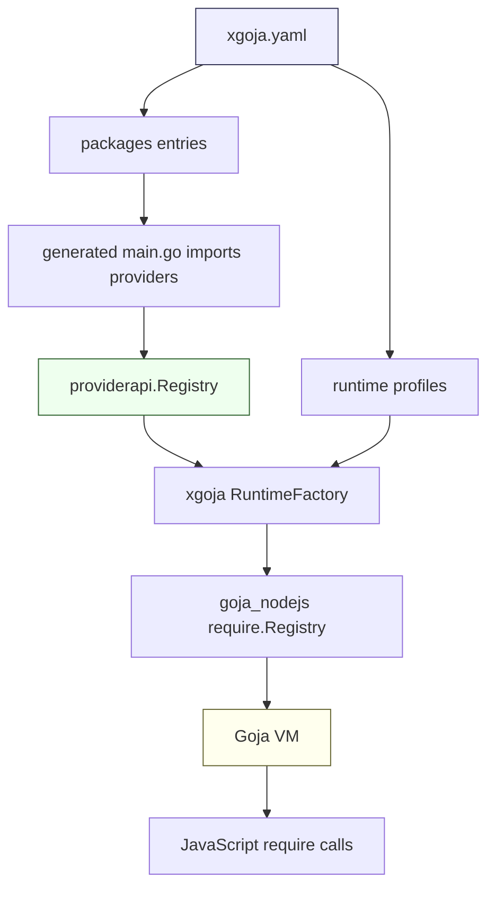
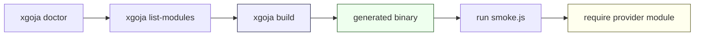

# XGoja Provider Support - Third-Party Package Rollout

This report records the work that added xgoja provider support to several third-party Go packages that already expose Go functionality to JavaScript through Goja. The immediate implementation covered `workspace-manager`, `goja-git`, `loupedeck`, `geppetto`, and `go-minitrace`. The durable design lesson is that xgoja provider support is not a single wrapper shape. It is a small set of adapter patterns for turning existing Goja module surfaces into explicit provider packages that generated xgoja binaries can import and select from runtime profiles.

> [!summary]
> The provider rollout established three implementation patterns:
> 1. simple loader providers for existing CommonJS-style modules,
> 2. guarded host-capability providers for modules that mutate local state,
> 3. host-services providers for modules that need live runtime state such as SQL connections, inference registries, or application services.

## Why this project exists

`xgoja` generates Go binaries that run JavaScript against Go-backed Goja modules. Before this work, the generated binaries could use first-party provider packages in `go-go-goja`, but several sibling projects still kept their JavaScript bindings inside their own runtime bootstraps. That meant their APIs were reusable in theory but not composable through an xgoja build specification.

The provider model solves that by making each package expose a stable registration function:

```go
func Register(registry *providerapi.Registry) error
```

The generated binary imports provider packages, calls their registration functions, and then uses `xgoja.yaml` runtime profiles to decide which modules are available to a command invocation. The important distinction is that importing a provider package only compiles capabilities into the binary. A runtime profile still decides which modules JavaScript can `require(...)`.

This distinction matters because the target packages do not all have the same safety profile. `workspace-manager` can operate on workspaces and repositories. `goja-git` can create and mutate Git repositories. `loupedeck` can eventually control hardware. `geppetto` can reach LLM engines and tool registries. `go-minitrace` needs access to an open database connection. Provider support therefore had to preserve explicit selection, explicit config, and explicit host-service boundaries.

## Current project status

The first provider rollout is implemented and committed across the sibling repositories. The docmgr ticket `XGOJA-007` was closed after the implementation, diary updates, generated smoke examples, and a small xgoja generator fix.

Implemented provider packages:

| Repository | Provider path | Provider ID | Module names | Current shape |
| --- | --- | --- | --- | --- |
| `workspace-manager` | `pkg/wsmjs/provider` | `workspace-manager` | `wsm` | Config-only provider around an existing loader. |
| `goja-git` | `pkg/provider` | `goja-git` | `git` | Guarded provider around a new CommonJS loader. |
| `loupedeck` | `pkg/xgoja/provider` and `runtime/js/provider` | `loupedeck` | `loupedeck/easing`, `loupedeck/gfx` | Safe subset provider for modules that do not need live hardware. |
| `geppetto` | `pkg/js/modules/geppetto/provider` | `geppetto` | `geppetto` | Host-services provider around the rich Geppetto module. |
| `go-minitrace` | `pkg/minitracejs/provider` | `go-minitrace` | `minitrace` | Host-services provider around an extracted query module. |

Key implementation commits:

| Repository | Commit | Purpose |
| --- | --- | --- |
| `workspace-manager` | `6bce6b0` | Added provider and `NewLoader` for `require("wsm")`. |
| `workspace-manager` | `e7b39e9` | Added the `go-go-goja` provider API dependency. |
| `workspace-manager` | `55e2856` | Added generated xgoja smoke example. |
| `goja-git` | `3e28e43` | Added provider, moved Git JS API into `pkg/gitjs`, and added loader support. |
| `goja-git` | `42fe88e` | Added the `go-go-goja` provider API dependency. |
| `goja-git` | `eefd185` | Moved provider under `pkg/provider` and added generated xgoja smoke example. |
| `loupedeck` | `5086665` | Added safe-module provider and updated for `go-go-goja v0.4.17`. |
| `loupedeck` | `2c43f39` | Added public provider wrapper and generated xgoja smoke example. |
| `geppetto` | `8229070e` | Added host-services provider and migrated affected engine API use. |
| `go-minitrace` | `6c0c1b8` | Extracted `pkg/minitracejs` and added host-services provider. |
| `go-go-goja` | `879075f` | Fixed generated `go.mod` relative provider `replace` handling. |

## The core model

A provider is a package-level catalog of Goja modules. It is not a runtime. It does not execute JavaScript by itself. It gives xgoja enough information to construct a runtime later.

The runtime path has four stages:

1. The build specification lists provider packages under `packages`.
2. The generated `main.go` imports those packages and calls `Register`.
3. The provider registry contains module factories keyed by provider ID and module name.
4. A runtime profile selects concrete module instances and aliases.



The main API lives in `go-go-goja/pkg/xgoja/providerapi`:

```go
type ModuleContext struct {
    Context context.Context
    Name    string
    As      string
    Config  json.RawMessage
    Host    HostServices
}

type Module struct {
    Name         string
    DefaultAs    string
    Description  string
    ConfigSchema json.RawMessage
    New          ModuleFactory
}

type ModuleFactory func(ModuleContext) (require.ModuleLoader, error)
```

A provider module factory receives normalized config and returns a `require.ModuleLoader`. This is the adapter boundary. Everything on the provider side should be explicit: module name, default alias, config schema, validation, and host-service requirements.

## Implementation pattern 1: existing module, new provider

`workspace-manager` already had the right internal shape. The existing module registered `require("wsm")` through `Register(reg, opts)`, and an unexported module type already had a loader method. The provider work extracted that loader into a public function.

The useful transformation was small:

```go
func NewLoader(opts Options) require.ModuleLoader {
    mod := &module{opts: opts}
    return mod.Loader
}

func Register(reg *require.Registry, opts Options) {
    if reg == nil {
        return
    }
    reg.RegisterNativeModule(ModuleName, NewLoader(opts))
}
```

The provider then decodes optional config and returns the existing loader:

```go
func Register(registry *providerapi.Registry) error {
    return registry.Package("workspace-manager", providerapi.Module{
        Name:        "wsm",
        DefaultAs:   "wsm",
        Description: "Workspace Manager automation module exposed as require(\"wsm\").",
        New: func(ctx providerapi.ModuleContext) (require.ModuleLoader, error) {
            opts, err := optionsFromConfig(ctx.Config)
            if err != nil {
                return nil, err
            }
            return wsmmodule.NewLoader(opts), nil
        },
    })
}
```

This pattern should be the default for any package that already has a CommonJS-style module. It preserves existing behavior and moves only the loader boundary into public API.

Key files:

- `/home/manuel/workspaces/2026-05-24/add-js-providers/workspace-manager/pkg/wsmjs/module/module.go`
- `/home/manuel/workspaces/2026-05-24/add-js-providers/workspace-manager/pkg/wsmjs/provider/provider.go`
- `/home/manuel/workspaces/2026-05-24/add-js-providers/workspace-manager/examples/xgoja/wsm-provider/xgoja.yaml`

## Implementation pattern 2: global object converted to a module

`goja-git` did not start as a CommonJS module. It installed a global `git` object into a Goja runtime. That shape works for a dedicated CLI, but it does not fit xgoja because xgoja runtime profiles select `require(...)` modules.

The conversion split object construction from installation:

```go
func NewGitObject(rt *goja.Runtime) *goja.Object {
    m := &GitModule{rt: rt}
    gitObj := rt.NewObject()
    _ = gitObj.Set("open", m.Open)
    _ = gitObj.Set("init", m.Init)
    return gitObj
}

func NewLoader() require.ModuleLoader {
    return func(rt *goja.Runtime, moduleObj *goja.Object) {
        exports := moduleObj.Get("exports").(*goja.Object)
        gitObj := NewGitObject(rt)
        _ = exports.Set("open", gitObj.Get("open"))
        _ = exports.Set("init", gitObj.Get("init"))
    }
}

func InstallGit(rt *goja.Runtime) {
    _ = rt.Set("git", NewGitObject(rt))
}
```

This preserves the old CLI behavior while adding a module loader for xgoja. The provider requires `allowWrite: true` because the module can create and mutate repositories. This guard is not a path sandbox; it is an explicit acknowledgement gate.

Key files:

- `/home/manuel/workspaces/2026-05-24/add-js-providers/goja-git/pkg/gitjs/gitmodule.go`
- `/home/manuel/workspaces/2026-05-24/add-js-providers/goja-git/pkg/provider/provider.go`
- `/home/manuel/workspaces/2026-05-24/add-js-providers/goja-git/examples/xgoja/git-provider/xgoja.yaml`

## Implementation pattern 3: expose only the safe subset first

`loupedeck` has a multi-module JavaScript runtime. Some modules are pure helpers, and some require live hardware, runtime owner callbacks, or a Loupedeck environment. Exposing all modules in the first provider would have hidden too many host assumptions behind one package import.

The implemented provider exposes only the safe subset:

```go
func Register(registry *providerapi.Registry) error {
    return registry.Package("loupedeck",
        moduleEntry("loupedeck/easing", "Easing functions...", module_easing.Loader),
        moduleEntry("loupedeck/gfx", "Offscreen drawing surfaces...", module_gfx.Loader),
    )
}
```

The `module_easing` and `module_gfx` packages were refactored to expose loader factories. A public wrapper under `pkg/xgoja/provider` delegates to `runtime/js/provider`, which gives generated binaries a stable public import path.

The important decision was to not expose `loupedeck/ui`, `loupedeck/present`, `loupedeck/metrics`, or the hardware event modules yet. Those modules require a host environment. They belong in a later host-services provider design rather than in the safe provider.

Key files:

- `/home/manuel/workspaces/2026-05-24/add-js-providers/loupedeck/runtime/js/module_easing/module.go`
- `/home/manuel/workspaces/2026-05-24/add-js-providers/loupedeck/runtime/js/module_gfx/module.go`
- `/home/manuel/workspaces/2026-05-24/add-js-providers/loupedeck/runtime/js/provider/provider.go`
- `/home/manuel/workspaces/2026-05-24/add-js-providers/loupedeck/pkg/xgoja/provider/provider.go`
- `/home/manuel/workspaces/2026-05-24/add-js-providers/loupedeck/examples/xgoja/loupedeck-provider/xgoja.yaml`

## Implementation pattern 4: host-services providers

`geppetto` and `go-minitrace` cannot be represented as static modules alone. They need live state that belongs to the host application.

`geppetto` needs an options object with runner, tool registry, profile registry, middleware definitions, event sinks, and other inference-related services. The provider therefore defines a host interface:

```go
type HostServices interface {
    GeppettoOptions(ctx context.Context, cfg Config) (geppettomodule.Options, error)
}
```

The provider decodes static config first, then asks the host to construct module options:

```go
New: func(ctx providerapi.ModuleContext) (require.ModuleLoader, error) {
    cfg, err := decodeConfig(ctx.Config)
    if err != nil {
        return nil, err
    }
    host, ok := ctx.Host.(HostServices)
    if !ok || host == nil {
        return nil, fmt.Errorf("geppetto provider requires geppetto provider HostServices")
    }
    opts, err := host.GeppettoOptions(ctx.Context, cfg)
    if err != nil {
        return nil, err
    }
    return geppettomodule.NewLoader(opts), nil
}
```

`go-minitrace` follows the same rule. The JavaScript module needs an open SQL connection and runtime metadata. The provider defines a host interface with `Conn`, `RuntimeSettings`, and `CommandName`:

```go
type HostServices interface {
    Conn() *sql.Conn
    RuntimeSettings() minitracejs.RuntimeSettings
    CommandName() string
}
```

The module loader moved out of `cmd/.../query/js_runtime.go` into a public package, `pkg/minitracejs`. The command-local runtime still uses the loader, and xgoja can now use the provider when a host supplies the SQL connection.

Key files:

- `/home/manuel/workspaces/2026-05-24/add-js-providers/geppetto/pkg/js/modules/geppetto/module.go`
- `/home/manuel/workspaces/2026-05-24/add-js-providers/geppetto/pkg/js/modules/geppetto/provider/provider.go`
- `/home/manuel/workspaces/2026-05-24/add-js-providers/go-minitrace/pkg/minitracejs/module.go`
- `/home/manuel/workspaces/2026-05-24/add-js-providers/go-minitrace/pkg/minitracejs/provider/provider.go`
- `/home/manuel/workspaces/2026-05-24/add-js-providers/go-minitrace/cmd/go-minitrace/cmds/query/js_runtime.go`

## Generated smoke tests

The provider rollout included generated xgoja smoke examples for the providers that can run without live host services:

```bash
cd workspace-manager && make -C examples/xgoja/wsm-provider smoke
cd goja-git && make -C examples/xgoja/git-provider smoke
cd loupedeck && make -C examples/xgoja/loupedeck-provider smoke
```

These smoke tests run the full generated-binary path:



The smoke work also found and fixed a generator bug in `go-go-goja`. Relative provider `replace` paths were written directly into the generated `go.mod`, but generated builds happen in a temporary directory. A spec such as this:

```yaml
packages:
  - id: workspace-manager
    import: github.com/go-go-golems/workspace-manager/pkg/wsmjs/provider
    version: v0.0.0
    replace: ../../..
```

must resolve `../../..` relative to the source `xgoja.yaml`, not relative to `/tmp/xgoja-build-*`. The fix in `go-go-goja/cmd/xgoja/internal/generate/gomod.go` resolves relative package replacements against `spec.BaseDir` before rendering generated `go.mod`.

## Provider package path rule

One concrete rule emerged from the `goja-git` smoke example. A provider package path should make it easy for xgoja to infer the Go module root. The generator recognizes subpackage markers such as `/pkg/`, `/cmd/`, and `/internal/` when deciding which module path to require and replace.

The final `goja-git` provider path is:

```text
github.com/go-go-golems/goja-git/pkg/provider
```

That lets xgoja infer the module root:

```text
github.com/go-go-golems/goja-git
```

A provider path such as `github.com/go-go-golems/goja-git/provider` is ambiguous under the current heuristic because it does not contain a recognized module-root marker. For future providers, prefer one of these shapes:

- `pkg/xgoja/provider`
- `pkg/<domain>/provider`
- `pkg/provider`

Do not place provider packages under arbitrary module-root subdirectories unless the generator's module-root inference is updated to understand that convention.

## What changed in the dependency model

Several repositories had to adopt `github.com/go-go-golems/go-go-goja v0.4.17` because that release contains the xgoja provider API. This also required accepting Go toolchain and dependency updates. The dependency updates were not purely mechanical in all repositories because `go-go-goja` engine APIs had evolved.

Two migrations were notable:

- `loupedeck` moved from older runtime module registrar naming to the current `RegisterRuntimeModule` / `WithModules` shape.
- `geppetto` updated older engine references such as `ModuleSpec` and manual default-module setup to the current runtime-module builder model.

These migrations are part of the provider rollout because generated xgoja providers must compile outside the local `go.work` file. Workspace-only validation is not enough for a provider package that a generated module will import.

## What remains incomplete

The provider layer is now present, but it does not solve every runtime integration problem.

The open items are specific:

- Generated xgoja examples do not yet exercise `geppetto` or `go-minitrace` because both require provider `HostServices`.
- `goja-git` uses an `allowWrite` acknowledgement but does not yet implement a path-root sandbox.
- `loupedeck` exposes only `easing` and `gfx`; hardware and environment modules need a host-services design.
- `go-minitrace` has a host-services provider but not a config-only read-only database opening mode.
- xgoja does not yet have a general model for third-party packages to contribute full custom CLI command trees that run JavaScript inside package-specific contexts.

That last point became the next design topic. The provider work made modules reusable. The next step is to design how xgoja should generate custom CLI verbs for packages that already run JavaScript inside domain-specific hosts such as Loupedeck scenes, Discord bots, CSS visual diff workflows, and minitrace query commands.

## Working rules for future provider work

The provider rollout produced a small set of rules that should guide future work.

- A provider should expose the smallest coherent module set that can be selected safely by a runtime profile.
- Existing `Register(reg, opts)` APIs should gain `NewLoader(opts)` rather than being replaced.
- Global-object APIs should be split into object construction and CommonJS loader installation.
- Dangerous capabilities should fail closed during module factory construction.
- Live application state should pass through typed `HostServices`, not global variables.
- Provider packages should live under a path that xgoja can map back to the module root.
- Generated xgoja smoke tests are required for config-only providers and safe providers.
- Host-services providers need focused unit tests now and generated-host tests after xgoja gains a host command extension model.

## Related docs and tickets

- `XGOJA-007` in `/home/manuel/workspaces/2026-05-24/add-js-providers/go-go-goja/ttmp/2026/05/24/XGOJA-007--add-xgoja-providers-across-sibling-packages`
- `go-go-goja/cmd/xgoja/doc/04-providers.md`
- `go-go-goja/pkg/xgoja/providerapi/module.go`
- `go-go-goja/pkg/xgoja/providerapi/registry.go`
- `go-go-goja/pkg/xgoja/app/factory.go`
- `go-go-goja/cmd/xgoja/internal/generate/gomod.go`

## Near-term next steps

The next project should define how xgoja lets third-party packages provide custom CLI verbs, not only modules. That design needs to account for packages that scan JavaScript repositories, derive command schemas from JavaScript metadata, and execute commands in domain-specific runtimes.

The provider work supplies the lower layer. It gives generated binaries modules. The custom-CLI-verb design must define the next layer: command discovery, command mounting, host-service construction, runtime invocation, and output handling for package-specific JavaScript sandboxes.
