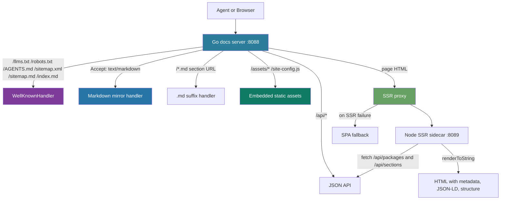

# Agent a14y for Go-Hosted React Docs

This article explains how the docsctl documentation browser was converted from a JavaScript-only React SPA into an agent-readable documentation site. The work started with a failing a14y score: the site returned an empty SPA shell for every documentation page and also returned that same HTML shell for agent-discovery files such as `/llms.txt`, `/robots.txt`, `/AGENTS.md`, `/sitemap.xml`, and `/sitemap.md`. The browser could render the site after JavaScript loaded. An agent fetching the same URLs saw almost no useful content.

The result of the local implementation work was a page-mode a14y score increase from **42/100** to **97/100**. The improvement did not come from one large rewrite. It came from placing the right responsibilities at the right layer: the Go server now handles agent-facing files and Markdown mirrors, the Node SSR sidecar provides HTML metadata and server-rendered structure, and the development workflow includes browser checks so content-type regressions are caught before they become invisible production failures.

> [!summary]
> The central lesson is that agent readability is a server contract, not a frontend enhancement. A React app can remain the interactive UI, but agents need stable HTTP responses: text files must be text, sitemaps must be XML or Markdown, HTML pages must contain metadata and structure, and Markdown mirrors must be reachable without JavaScript.

## Why this work was necessary

The docs browser is a Go-hosted React application. The Go server provides JSON endpoints under `/api/*`, and the frontend uses React Router to display package/version/section URLs such as:

```text
/glazed/_/sections/build-first-command
/pinocchio/v1.2.15/sections/geppetto-js-api-getting-started
```

Before the a14y work, all non-API paths fell through to the SPA fallback. That fallback served `index.html` so the browser could load JavaScript, hydrate the app, fetch data, and render documentation. This behavior is correct for a browser. It is insufficient for agents.

The initial a14y audit exposed the problem directly:

```text
Agent Readability Score: 42/100
17 failing checks

Representative failures:
- /llms.txt existed but returned text/html
- /sitemap.xml existed but returned HTML instead of XML
- /AGENTS.md existed but had no Markdown sections
- HTML pages had no parseable JSON-LD
- HTML pages had no headings in the initial response
- Markdown mirrors were missing or did not negotiate via Accept: text/markdown
```

A browser turns an SPA shell into a page. An agent often evaluates the HTTP response before client-side JavaScript runs. The server therefore has to provide meaningful responses at fetch time.

## The target contract

The a14y conversion work established a server-side contract for the documentation browser. The contract is independent of React and describes what a caller can expect from the site over HTTP.

| URL or request | Required behavior | Why it matters |
|---|---|---|
| `/` | Return HTML with metadata, headings, JSON-LD, canonical link, Markdown alternate link | Agents need a structured entry point |
| `/llms.txt` | Return `text/plain` with overview and links | LLM discovery convention |
| `/robots.txt` | Return `text/plain` with AI crawler permissions and sitemap pointer | Crawler policy discovery |
| `/AGENTS.md` | Return Markdown with installation, usage, API, and package sections | Agent operating instructions |
| `/sitemap.xml` | Return valid XML urlset with lastmod fields | Standard crawler discovery |
| `/sitemap.md` | Return Markdown sitemap with headings and links | Human- and agent-readable index |
| `/index.md` | Return Markdown mirror of the root page with frontmatter | Markdown mirror for the homepage |
| `/{pkg}/{ver}/sections/{slug}` | Return HTML page via SSR proxy | Human/browser route |
| `/{pkg}/{ver}/sections/{slug}.md` | Return raw Markdown section content | Agent-readable section route |
| `Accept: text/markdown` on a page URL | Return Markdown equivalent | Content negotiation for agents |

The important shift is that documentation is no longer only a frontend state. It is also an HTTP resource graph. Agents can discover it through indexes, request Markdown directly, and parse metadata without executing JavaScript.

## Architecture after the conversion

The final architecture has three server-side layers: the Go docs server, the well-known/Markdown handlers, and the Node SSR sidecar.



The routing order matters. If `/llms.txt` reaches the SPA fallback, the site fails a14y even if the React app works perfectly. If `/assets/main.js` reaches the SSR proxy, the browser receives HTML with a JavaScript URL and fails to load the application. The order must be explicit:

```text
Incoming request
  ├─ /api/*                         → API handler
  ├─ well-known agent file           → WellKnownHandler
  ├─ .md section URL                 → Markdown mirror
  ├─ Accept: text/markdown           → Markdown mirror
  ├─ static asset                    → embedded static file handler
  ├─ page request with SSR enabled   → SSR sidecar proxy
  └─ fallback                        → SPA shell
```

This ordering is the practical heart of the conversion. Agent support is not a separate service. It is a set of routing commitments that must sit before the SPA fallback.

## Step 1: Establishing the baseline with the a14y skill

The a14y skill changes the shape of the work. Instead of guessing which files agents might want, the audit reports concrete checks with names, expected behavior, and observed behavior. The local workflow was:

```bash
# Start the local docs stack
devctl up --force

# Audit the local main site, not the SSR sidecar directly
npx a14y check http://localhost:8088 --mode page
npx a14y check http://localhost:8088 --mode site
```

The distinction between `:8088` and `:8089` matters:

| Port | Process | Should agents use it? | Role |
|---|---|---:|---|
| `localhost:8088` | Go docs server | Yes | Main site, API, well-known files, Markdown mirrors, SSR proxy |
| `localhost:8089` | Node SSR sidecar | No | Internal renderer used by the Go server |

The audit must target `localhost:8088`, because that is the public contract. Auditing `localhost:8089` would test the renderer in isolation and miss the Go server's routing behavior.

The first useful finding was that the site checks and page checks fail for different reasons. Site checks failed because agent discovery files returned HTML. Page checks failed because HTML pages lacked metadata, headings, structured data, and Markdown mirrors.

## Step 2: Serving well-known agent files from Go

The first implementation phase introduced `pkg/help/server/wellknown.go`. This handler generates agent-facing files from the live help database.

The handler has a simple shape:

```go
var wellKnownPaths = map[string]string{
    "/llms.txt":    "text/plain; charset=utf-8",
    "/robots.txt":  "text/plain; charset=utf-8",
    "/AGENTS.md":   "text/markdown; charset=utf-8",
    "/sitemap.xml": "application/xml; charset=utf-8",
    "/sitemap.md":  "text/markdown; charset=utf-8",
    "/index.md":    "text/markdown; charset=utf-8",
}

type WellKnownHandler struct {
    deps HandlerDeps
}

func (h *WellKnownHandler) CanHandle(path string) bool {
    _, ok := wellKnownPaths[path]
    return ok
}
```

The server checks this handler before the SSR proxy and before the SPA fallback:

```go
if wellKnownHandler.CanHandle(cleanPath) {
    wellKnownHandler.ServeHTTP(w, r)
    return
}
```

Each generated file has a distinct job.

### `/llms.txt`

`llms.txt` gives agents an entry point into the documentation graph. It includes a site description, package list, and top-level section links.

```markdown
# Glazed Help Browser

> Documentation browser for the Glazed CLI framework and Go-Go-Golems tools.

## Packages

- [glazed](http://localhost:8088/glazed/_): 74 sections
- [pinocchio](http://localhost:8088/pinocchio/_): 54 sections

## Sections

- [Build Your First Glazed Command](http://localhost:8088/glazed/_/sections/build-first-command.md): Quick hands-on tutorial...
```

The later `.md` suffix change is important. The a14y `llms-txt.md-extensions` check expects Markdown links to point to Markdown resources. Linking to `/sections/foo` sends the agent to HTML. Linking to `/sections/foo.md` sends the agent to raw Markdown.

### `/AGENTS.md`

`AGENTS.md` is not a marketing page. It is an operating guide. The generated content includes installation, usage, API, and package sections:

```markdown
# AGENTS.md

## How to install

```bash
go install github.com/go-go-golems/glazed/cmd/glaze@latest
```

## How to use

Browse documentation at http://localhost:8088.
URL scheme: `/{package}/{version}/sections/{slug}`.
Append `.md` to any section URL for raw Markdown.

## API

- `GET /api/packages` — list all packages and versions
- `GET /api/sections?package=X&version=Y` — list sections
- `GET /api/sections/{slug}?package=X&version=Y` — get section content
```

This makes the site self-describing for coding agents. A future agent can fetch `/AGENTS.md`, understand the URL scheme, discover the API, and know that `.md` suffix URLs are the preferred plain-text representation.

### `/sitemap.xml` and `/sitemap.md`

The XML sitemap satisfies standard crawler requirements. The Markdown sitemap provides a readable index that agents can parse without XML tooling.

The Markdown sitemap groups top-level sections by package:

```markdown
# Sitemap

## glazed

- [Build Your First Glazed Command](http://localhost:8088/glazed/_/sections/build-first-command.md)
- [Config Files Quickstart](http://localhost:8088/glazed/_/sections/config-files-quickstart.md)

## pinocchio

- [Geppetto JS API Getting Started](http://localhost:8088/pinocchio/v1.2.15/sections/geppetto-js-api-getting-started.md)
```

The conversion from HTML shell to real well-known files moved the page-mode score from **55/100** to **76/100**.

## Step 3: Adding Markdown mirrors and content negotiation

Agent-readable documentation should not require HTML parsing. The docsctl URL scheme therefore gained two Markdown access paths:

```text
/glazed/_/sections/jq-filter          → HTML page
/glazed/_/sections/jq-filter.md       → Markdown mirror
```

The server also supports content negotiation:

```bash
curl -H 'Accept: text/markdown' \
  http://localhost:8088/glazed/_/sections/jq-filter
```

The handler extracts package, version, and slug from the semantic URL:

```go
func parseSectionURL(path string) (string, string, string, bool) {
    parts := strings.Split(strings.Trim(path, "/"), "/")
    if len(parts) >= 4 && parts[2] == "sections" {
        return parts[0], parts[1], parts[3], true
    }
    return "", "", "", false
}
```

For `.md` suffix URLs, the server strips the suffix and resolves the normal section URL:

```go
func isMarkdownSuffixURL(path string) (pkgName, version, slug string, ok bool) {
    if !strings.HasSuffix(path, ".md") {
        return "", "", "", false
    }
    withoutMd := strings.TrimSuffix(path, ".md")
    return parseSectionURL(withoutMd)
}
```

The response includes YAML frontmatter and a canonical `Link` header:

```http
HTTP/1.1 200 OK
Content-Type: text/markdown; charset=utf-8
Link: <http://localhost:8088/glazed/_/sections/jq-filter>; rel="canonical"
```

```markdown
---
title: Use jq to filter out rows
description: ...
doc_version: 1
last_updated: 2026-05-25
---

# Use jq to filter out rows

...
```

This fixed the Markdown mirror checks:

- `markdown.alternate-link`
- `markdown.frontmatter`
- `markdown.canonical-header`
- `markdown.content-negotiation`
- `markdown.sitemap-section`

The page score moved from **76/100** to the low 80s once content negotiation and alternate links were in place.

## Step 4: Enriching SSR HTML for agents

The SSR sidecar already injected canonical links and Open Graph metadata. The a14y work added structured data and additional HTML structure.

The generated `<head>` now includes:

```html
<meta name="description" content="Documentation browser for the Glazed CLI framework and Go-Go-Golems tools." />
<meta property="og:title" content="Glazed Help Browser" />
<meta property="og:description" content="Documentation browser for the Glazed CLI framework and Go-Go-Golems tools." />
<link rel="canonical" href="https://docs.yolo.scapegoat.dev/" />
<link rel="alternate" type="text/markdown" href="https://docs.yolo.scapegoat.dev/index.md" />
<script type="application/ld+json">...</script>
<script type="application/ld+json">...</script>
```

Two JSON-LD blocks are emitted:

1. `WebPage`, with `name`, `description`, `url`, and `dateModified`
2. `BreadcrumbList`, with the root/package/section path when available

The relevant generator logic in `web/server.mjs`:

```javascript
const jsonLd = {
  '@context': 'https://schema.org',
  '@type': 'WebPage',
  'name': title,
  'description': description,
  'url': `${BASE_URL}${url.split('#')[0]}`,
  'dateModified': new Date().toISOString().split('T')[0],
};

const breadcrumbLd = {
  '@context': 'https://schema.org',
  '@type': 'BreadcrumbList',
  'itemListElement': breadcrumbItems,
};
```

The a14y checks that this resolved:

- `html.json-ld`
- `html.json-ld.date-modified`
- `html.json-ld.breadcrumb`

## Step 5: Adding HTML structure without breaking the UI

The SSR app initially rendered a shell with very little textual structure. The a14y checker reported:

```text
html.headings — only 0 headings
html.text-ratio — 12.9%
html.glossary-link — no glossary/terminology link
```

The first fix added a `<noscript>` fallback with headings, package links, and sitemap links. This improved text ratio but did not satisfy the headings check, because the checker did not count headings inside `<noscript>`.

The working fix added visually hidden headings and a glossary link before the React root:

```html
<h1 class="sr-only">Glazed Help Browser</h1>
<h2 class="sr-only">Packages</h2>
<h3 class="sr-only">Available packages</h3>
<a class="sr-only" href="/AGENTS.md">Terminology & Glossary</a>
<div id="root">...</div>
```

The implementation currently uses inline `sr-only` styles because the HTML is generated by the SSR sidecar, not by the React component tree:

```javascript
const srOnly = 'style="position:absolute;width:1px;height:1px;padding:0;margin:-1px;overflow:hidden;clip:rect(0,0,0,0);white-space:nowrap;border:0"';
```

This resolved:

- `html.headings`
- `html.text-ratio`
- `html.glossary-link`

The visually hidden content must remain minimal. It should describe the page and expose navigation structure; it should not duplicate the entire documentation body.

## The regression that browser checks caught

One bug made the site unusable in the browser while the server-side checks looked promising. The browser console showed:

```text
Loading module from “http://localhost:8088/assets/main-Bds3JEJk.js” was blocked because of a disallowed MIME type (“text/html”).
The stylesheet http://localhost:8088/assets/main-B1h0h9DU.css was not loaded because its MIME type, “text/html”, is not “text/css”.
Uncaught SyntaxError: expected expression, got '<' site-config.js:1:1
```

The cause was routing order. Once the SSR proxy was introduced, static asset paths such as `/assets/main-Bds3JEJk.js` and `/site-config.js` were treated like page requests. They went through the SSR sidecar, which returned HTML. The browser then tried to execute HTML as JavaScript and load HTML as CSS.

The fix was to recognize static assets before the SSR proxy:

```go
func isStaticAsset(path string) bool {
    if strings.HasPrefix(path, "/assets/") {
        return true
    }
    switch path {
    case "/site-config.js", "/favicon.ico", "/favicon.svg":
        return true
    }
    for _, ext := range []string{".js", ".css", ".svg", ".png", ".jpg", ".ico", ".woff", ".woff2"} {
        if strings.HasSuffix(path, ext) {
            return true
        }
    }
    return false
}
```

And route those paths directly to the embedded static file handler:

```go
if isStaticAsset(cleanPath) {
    spaHandler.ServeHTTP(w, r)
    return
}
```

This bug is the reason browser checks belong in the workflow. a14y tells us whether agents can read the site. Playwright tells us whether humans can still use it.

The lightweight check is:

```text
1. Open http://localhost:8088/
2. Confirm it redirects/navigates to /glazed/_
3. Confirm the documentation tree renders
4. Click a section such as “Build Your First Glazed Command”
5. Confirm the section page renders
6. Check console errors; missing external fonts are tolerable, MIME errors are not
```

The Playwright accessibility snapshot confirmed that the React app loaded and rendered the documentation tree and package index after the static asset fix.

## Score progression

The a14y score improved in distinct phases.

| Phase | Main change | Page score |
|---|---|---:|
| Baseline | SPA shell only | 42/100 |
| SSR metadata | canonical, OG tags, meta description, lang | 55/100 |
| Well-known files | llms.txt, robots.txt, AGENTS.md, sitemap.xml, sitemap.md, index.md | 76/100 |
| Markdown negotiation | Accept: text/markdown and Markdown mirrors | 82/100 |
| JSON-LD + text ratio | WebPage JSON-LD, noscript fallback | 83/100 |
| Breadcrumb + glossary | BreadcrumbList, glossary link | 91/100 |
| Headings + canonical header | visible-to-agent headings, Link canonical header | 97/100 |

The final remaining failure was:

```text
llms-txt.md-extensions — links in llms.txt are not .md/.mdx
```

That failure is resolved by switching `llms.txt` section links from HTML URLs to `.md` mirror URLs and by serving `.md` suffix routes. This is the correct shape because it preserves the human URL while giving agents a direct Markdown representation.

## Working rules for future a14y work

The implementation produced a set of rules that should apply to future Go-hosted docs sites.

1. **Agent files must be served before the SPA fallback.** If `/llms.txt` or `/sitemap.xml` reaches React routing, the server contract is already wrong.

2. **Static assets must bypass the SSR proxy.** The SSR renderer returns HTML. It must never handle `/assets/*.js`, `/assets/*.css`, or `/site-config.js`.

3. **Markdown mirrors should be addressable, not only negotiable.** `Accept: text/markdown` is useful, but `.md` suffix URLs are easier for agents to discover and share.

4. **HTML pages need both metadata and structure.** Meta tags alone improve discovery, but headings, JSON-LD, BreadcrumbList, and glossary links improve comprehension.

5. **a14y and Playwright test different contracts.** a14y verifies agent readability. Playwright verifies browser usability. Both are needed after routing changes.

6. **Scores should be recorded after each phase.** The score progression shows which changes actually moved the metric and prevents later regressions from being dismissed as subjective.

## Implementation files

| File | Role |
|---|---|
| `pkg/help/server/wellknown.go` | Generates well-known files, Markdown mirrors, `.md` suffix content |
| `pkg/help/server/serve.go` | Defines routing order: API, well-known, Markdown, static assets, SSR, SPA fallback |
| `web/server.mjs` | SSR HTML enrichment: meta tags, alternate Markdown link, JSON-LD, breadcrumbs, noscript fallback, hidden headings |
| `plugins/glazed.py` | devctl process plan for Go docs server and Node SSR sidecar |
| `.devctl.yaml` | Plugin wiring for local `devctl up` testing |
| `ttmp/.../DOCSCTL-A14Y/reference/01-diary.md` | Step-by-step implementation diary and score history |

## Near-term cleanup

The conversion works and the score target was exceeded, but there are still useful cleanups:

- Move inline `sr-only` CSS from `server.mjs` into a small reusable CSS rule if the server-rendered head can safely reference it.
- Add unit tests for `WellKnownHandler`, `.md` suffix handling, and `isStaticAsset`.
- Add a scripted Playwright smoke test that asserts JS/CSS MIME types and clicks a section link.
- Add the current a14y score history to a durable project-facing document such as `AGENTS.md` or the ticket changelog.
- Run the full site-mode audit after `.md` suffix links are fully wired so the site crawl uses Markdown mirrors where appropriate.

## Closing

The docsctl a14y conversion shows that agent readability is mostly about server behavior. React remains the UI. The Go server defines the resource graph. The SSR sidecar enriches HTML responses. Markdown mirrors give agents a stable plain-text representation. The development loop needs both a14y and browser checks because the same routing changes that help agents can break static asset loading if they are ordered incorrectly.

The implementation target was 80/100. The local page-mode score reached 97/100. The difference came from treating every a14y failure as a concrete HTTP contract violation and fixing it at the layer that owns that contract.
