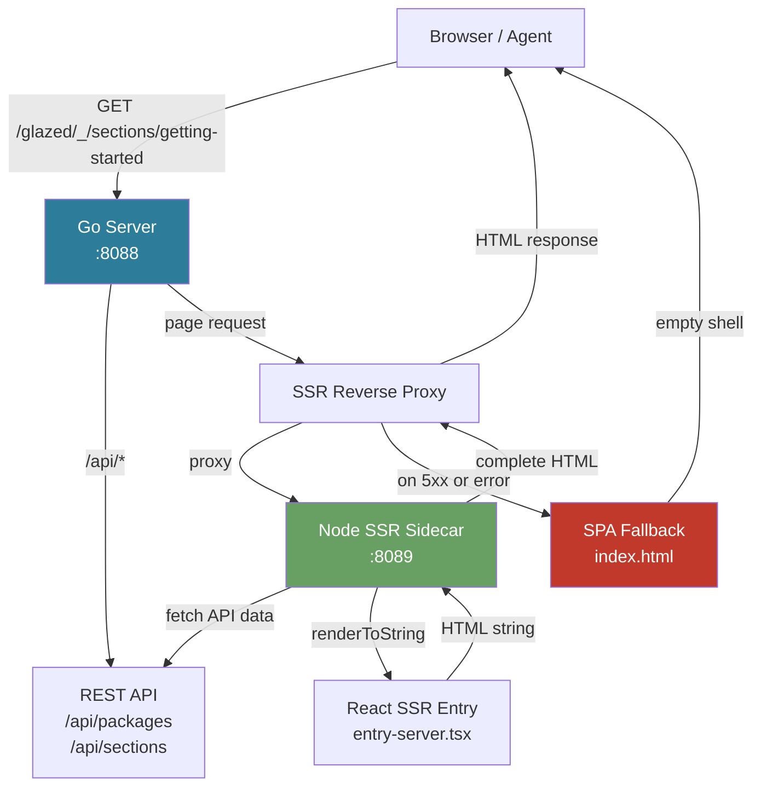
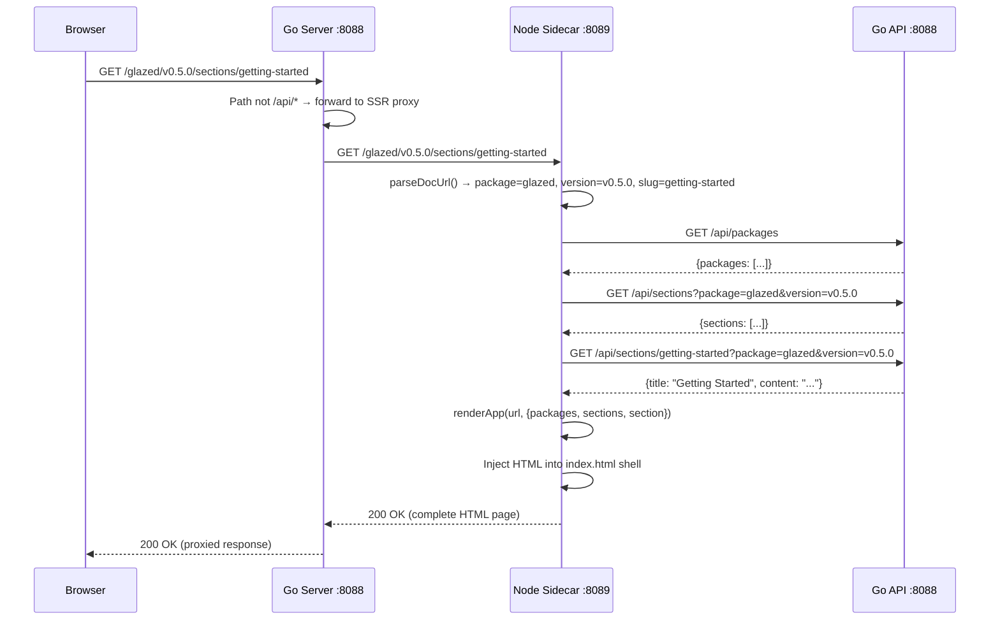

# SSR Sidecar for Go-Hosted React SPAs

This article is a technical deep dive into adding server-side rendering to a Go-hosted React single-page application. The reference implementation is the docsctl docs browser, a React app served by a Go HTTP server that previously returned an empty `<div id="root"></div>` for every page request. The article covers the architecture decision, the four components that had to be built, three runtime bugs that blocked the system from working, and the dev environment orchestration that makes local testing tractable.

The pattern described here — a Node.js SSR sidecar that renders React to HTML, paired with a Go reverse proxy that falls back to the SPA shell when the sidecar is unavailable — applies to any Go server that hosts a React SPA and needs server-rendered HTML for SEO, social previews, or agent readability.

> [!summary]
> This article covers four key ideas:
> 1. The SSR sidecar pattern: why a separate Node process renders React rather than embedding V8 or using WASM
> 2. The request lifecycle: how the Go server proxies page requests to the sidecar and falls back to the SPA shell on failure
> 3. Three runtime bugs that blocked SSR from working: ESM import hoisting, Express 5 breaking changes, and the dual-React-instance problem
> 4. The devctl plugin that orchestrates the two-process development environment with health checks and process supervision

## Why this note exists

The docsctl docs browser at docs.yolo.scapegoat.dev scored 42/100 on the a14y (agent readability) audit. The root cause was that the Go server served an empty React SPA shell for every URL — including URLs that agents request for metadata, such as `/llms.txt`, `/robots.txt`, and `/AGENTS.md`. The SPA shell is a valid HTML page, but it contains no content that an agent can parse. The fix requires the server to return meaningful HTML for page requests, which means rendering React on the server side.

This article records the full implementation: what was built, what broke, and why each design decision was made. A future reader working on a Go + React project that needs SSR will encounter the same class of bugs and the same architectural trade-offs.

## When to use this pattern

Use the SSR sidecar pattern when:

- A Go HTTP server hosts a React single-page application
- The SPA needs server-rendered HTML for SEO, social previews, or agent readability
- The Go server cannot embed a JavaScript runtime (V8, goja) because the React component tree uses hooks, context, and browser APIs that require a real DOM or a full Node.js environment
- The deployment target supports sidecar containers (Kubernetes, k3s) or can run a Node process alongside the Go server

Do not use this pattern when:

- Build-time pre-rendering is sufficient (static sites with known routes)
- The React app is simple enough to render with a minimal JS runtime embedded in Go
- Binary size constraints prevent shipping a Node.js runtime
- The deployment environment cannot run Node.js

## Architecture

The system has four components: the React SPA client build, the SSR entry point, the Express SSR server, and the Go reverse proxy. Each has a specific responsibility in the rendering pipeline.



The request flow is:

1. A browser or agent sends a page request to the Go server on port 8088
2. The Go server checks the path: `/api/*` routes go to the REST API handler; all other routes go to the SSR proxy
3. The SSR proxy forwards the request to the Node sidecar on port 8089
4. The sidecar parses the URL, fetches data from the Go API, renders React to HTML, and returns a complete HTML page
5. If the sidecar is unavailable or returns a 5xx error, the proxy falls back to serving the SPA shell (index.html)

The fallback behavior is a deliberate design choice. The SPA shell is always functional — it just lacks server-rendered content. When the SSR sidecar is down, the browser still loads the React app and fetches data client-side. The user experience degrades gracefully.

### Why a sidecar, not an embedded runtime

Three alternatives were considered before choosing the sidecar pattern.

**Embedded V8 (e.g. v8go).** Embedding V8 in the Go process would avoid the network hop and the separate process. But the React component tree uses hooks, context, and browser APIs (`window`, `document`, `location`). V8 does not provide these. Providing polyfills for the full browser API surface that React and its ecosystem expect is impractical. The maintenance burden would be high: every React update might use new browser APIs.

**Embedded goja.** Goja is a Go-native ECMAScript runtime. It is suitable for simple scripting but does not support ES modules, `import`, or the module resolution that a Vite-built React bundle requires. Porting the React ecosystem to run under goja would be a separate project.

**WASM (wasmer/wazero).** Compiling QuickJS or a similar runtime to WASM and running it from Go avoids the CGO dependency. But WASM runtimes do not provide the DOM, and the polyfill problem is the same as with V8. WASM also adds cold-start latency that makes per-request rendering expensive.

The sidecar pattern uses Node.js, which already provides the full API surface that React expects. The cost is an extra process and a network hop. In a Kubernetes deployment, the sidecar runs in the same pod as the Go server, so the network hop is localhost and the process lifecycle is managed by the container runtime.

**Build-time pre-rendering** was also considered but rejected because the docsctl server supports `--reload-interval` for live-reloading documentation from a directory. Pre-rendered pages would go stale between reloads. The SSR sidecar renders on each request, so it always reflects the current data.

## Component 1: The SSR entry point

The SSR entry point is `entry-server.tsx`. It exports a single function, `renderApp`, that takes a URL and returns an HTML string.

```typescript
// web/src/entry-server.tsx (simplified)
import { renderToString } from 'react-dom/server';
import { StaticRouter } from 'react-router-dom/server';
import { Provider } from 'react-redux';
import { configureStore } from '@reduxjs/toolkit';
import { helpApi } from './services/api';
import App from './App';

export function renderApp(url: string, data: PrefetchedData): SSRResult {
  const store = configureStore({
    reducer: { [helpApi.reducerPath]: helpApi.reducer },
    middleware: (m: any) => m().concat(helpApi.middleware),
  });

  const html = renderToString(
    <React.StrictMode>
      <Provider store={store}>
        <StaticRouter location={url}>
          <App />
        </StaticRouter>
      </Provider>
    </React.StrictMode>
  );

  return { html };
}
```

Two design decisions in this code are worth explaining.

**Fresh store per request.** The Redux store is created fresh for each SSR request. The alternative — sharing a store across requests — would cause data leaks between concurrent requests. RTK Query caches API responses in the store; sharing the store would mean one user's data could appear in another user's rendered page.

**No cache pre-population.** The current implementation does not pre-populate the RTK Query cache with the data fetched by the SSR server. Instead, `renderToString` renders the component tree in its "loading" state. This means the SSR HTML shows the app skeleton (sidebar, header, content area) but not the actual documentation content. The content loads client-side via hydration. This is a deliberate trade-off: pre-populating the cache requires interfacing with RTK Query's internal cache API, which is complex and fragile. The skeleton rendering already provides the SEO and a14y benefits that motivated the work — the HTML shell contains meaningful metadata, and the page structure renders immediately.

## Component 2: The Express SSR server

The SSR server is `server.mjs`, an Express application that receives page requests from the Go proxy, fetches data from the Go API, renders React to HTML, and injects the result into the HTML shell.

```javascript
// web/server.mjs (simplified)
const SSR_PORT = parseInt(process.env.SSR_PORT || '8089', 10);
const API_BASE = process.env.API_BASE || 'http://localhost:8088/api';

// Window mock must be set up BEFORE the dynamic import of the SSR bundle.
if (typeof globalThis.window === 'undefined') {
  globalThis.window = {
    __GLAZE_SITE_CONFIG__: {
      mode: 'server',
      apiBaseUrl: API_BASE,
    },
    location: { pathname: '/' },
  };
}

const { renderApp } = await import('./dist/ssr/entry-server.js');

const app = express();
app.get('/health', (_req, res) => res.json({ ok: true }));

app.get('{*path}', async (req, res) => {
  const url = req.originalUrl;
  const { packageName, version, slug } = parseDocUrl(url);

  const packages = await fetchAPI('/packages');
  const sections = packageName
    ? await fetchAPI(`/sections?package=${packageName}&version=${version}`)
    : null;
  const section = slug
    ? await fetchAPI(`/sections/${slug}?package=${packageName}&version=${version}`)
    : null;

  const { html } = renderApp(url, { packages, sections, section });
  // ... inject html into the index.html shell ...
});
```

### Bug 1: ESM import hoisting and the window mock

The first version of `server.mjs` used a static import for the SSR bundle:

```javascript
import { renderApp } from './dist/ssr/entry-server.js';
```

This crashed at startup with `ReferenceError: window is not defined`. The cause is ESM import hoisting: static imports are resolved before any runtime code executes. Even though the `window` mock assignment appeared before the import statement in the source file, the JavaScript engine hoists the import to the top of the module, executing it before the mock is set up.

The SSR bundle transitively imports `api.ts`, which reads `window.__GLAZE_SITE_CONFIG__` and `window.location.pathname` at module-load time:

```typescript
// web/src/services/api.ts (top-level code that executes at import time)
const runtimeConfig = getRuntimeConfig();          // reads window.__GLAZE_SITE_CONFIG__
const baseUrl = resolveRuntimeBaseUrl(window.location.pathname, runtimeConfig);
```

The fix is to use a dynamic import, which executes at runtime, not at module-load time:

```javascript
// Set up the mock FIRST
if (typeof globalThis.window === 'undefined') {
  globalThis.window = { /* ... */ };
}

// THEN import the SSR bundle (runs at runtime, after the mock)
const { renderApp } = await import('./dist/ssr/entry-server.js');
```

Top-level `await` in an ES module makes this pattern clean. The `await import()` call blocks until the module is loaded, and by that point the `window` mock is already in place.

### Bug 2: Express 5 wildcard route syntax

Express 5 changed the wildcard route syntax. In Express 4, `app.get('*')` matches all GET requests. In Express 5, the same code throws:

```
PathError: Missing parameter name at index 1: *
```

Express 5 requires named wildcards. The fix is:

```javascript
// Express 4 (broken in Express 5)
app.get('*', handler);

// Express 5
app.get('{*path}', handler);
```

The `path` parameter captures the matched path in `req.params.path`. This is a breaking change that the Express migration guide documents, but it is easy to miss when upgrading from Express 4.

## Component 3: The Vite SSR build configuration

The Vite build produces two outputs: the client bundle (for the browser) and the SSR bundle (for Node.js). The SSR build configuration determines which packages are bundled into the SSR output and which are externalized (left as `import` statements that Node resolves at runtime).

```typescript
// web/vite.config.ts
export default defineConfig({
  // ...
  ssr: {
    noExternal: [
      'react',
      'react-dom',
      'react-router-dom',
      '@reduxjs/toolkit',
      'react-redux',
      'use-sync-external-store',
    ],
  },
});
```

The `noExternal` list tells Vite to bundle these packages into the SSR output instead of leaving them as external imports. The decision about which packages to include is driven by one rule: any package that uses React internals (hooks, context, reconciler) must be bundled.

### Bug 3: The dual-React-instance problem

The initial `noExternal` list included `react-dom`, `react-router-dom`, `@reduxjs/toolkit`, and `react-redux`, but not `react`. The SSR build passed. The Express server started. But every render request crashed with:

```
Invalid hook call. Hooks can only be called inside of the body of a function component.
This could happen for one of the following reasons:
1. You might have mismatching versions of React and the renderer
2. You might be breaking the Rules of Hooks
3. You might have more than one copy of React in the same app
```

The error message is accurate: reason 3 is the cause. Here is what happened.

The Vite SSR build externalized `react` (because it was not in the `noExternal` list). The SSR bundle contains an `import` statement for `react` that Node resolves at runtime. Node's module resolution found `react` in `/home/manuel/node_modules/react/` — a globally-installed copy. The SSR bundle also bundled `react-dom` and `@reduxjs/toolkit`, which internally import `react`. Because Vite bundled these packages, their `react` import resolved to the copy inside the SSR bundle. This created two React instances:

1. The `react` imported by the SSR bundle's top-level code → resolved from `node_modules/react/` (global)
2. The `react` imported by the bundled `react-dom` and `@reduxjs/toolkit` → resolved from within the SSR bundle

React's hook system uses a global dispatcher that is set by the renderer (`react-dom`). When two React instances exist, the component tree uses one instance's `useState`/`useRef` but the renderer sets the dispatcher on the other instance. The result is `useRef` returning `null` because the dispatcher is not set on the instance the component is using.

The fix is to add `react` to the `noExternal` list so that Vite bundles `react` into the SSR output. The bundled `react` is the only instance, and all consumers (components, the renderer, RTK Query) use it.

The same problem applies to `use-sync-external-store`, which is a dependency of `@reduxjs/toolkit`. It calls `React.useSyncExternalStore` internally, and if it resolves `React` from a different instance, the same hook mismatch occurs. Adding `use-sync-external-store` to `noExternal` ensures it uses the bundled React.

The rule: when building an SSR bundle with Vite, the `noExternal` list must include `react` and every package that depends on React internals. The error message from React ("you might have more than one copy of React") is the authoritative diagnostic.

## Component 4: The Go reverse proxy

The Go server acts as a reverse proxy for page requests, forwarding them to the SSR sidecar and falling back to the SPA shell on failure.

```go
// pkg/help/server/serve.go (simplified)
func newSSRProxy(ssrURL string, spaHandler http.Handler) http.Handler {
    ssrEndpoint, _ := url.Parse(ssrURL)
    proxy := &http.Client{Timeout: 10 * time.Second}

    return http.HandlerFunc(func(w http.ResponseWriter, r *http.Request) {
        proxyURL := ssrEndpoint.ResolveReference(
            &url.URL{Path: r.URL.Path, RawQuery: r.URL.RawQuery},
        )

        proxyReq, _ := http.NewRequestWithContext(
            r.Context(), r.Method, proxyURL.String(), nil,
        )
        // Forward headers
        for _, h := range []string{"Accept", "Accept-Language", "User-Agent", "Cookie"} {
            if v := r.Header.Get(h); v != "" {
                proxyReq.Header.Set(h, v)
            }
        }

        resp, err := proxy.Do(proxyReq) // #nosec G704
        if err != nil {
            spaHandler.ServeHTTP(w, r) // sidecar unavailable
            return
        }
        defer resp.Body.Close()

        if resp.StatusCode >= 500 {
            spaHandler.ServeHTTP(w, r) // sidecar error
            return
        }

        // Copy response from sidecar to client
        for k, vs := range resp.Header {
            for _, v := range vs {
                w.Header().Add(k, v)
            }
        }
        w.WriteHeader(resp.StatusCode)
        io.Copy(w, resp.Body)
    })
}
```

The proxy is configured via the `--ssr-url` flag. When the flag is not set, the Go server serves the SPA shell directly (no proxy, no sidecar). When the flag is set, every non-`/api` request goes through the proxy.

### The fallback chain

The proxy has three failure modes, each handled differently:

| Failure mode | Symptom | Proxy behavior |
|---|---|---|
| Sidecar unavailable | Connection refused, timeout | Fall back to SPA shell |
| Sidecar returns 5xx | SSR render error, internal error | Fall back to SPA shell |
| Sidecar returns 2xx/3xx/4xx | Normal response | Pass through to client |

The 2xx–4xx pass-through is important. A 404 from the sidecar should reach the client as a 404, not be converted to a SPA shell. The SPA shell is only served when the sidecar is known to be broken (connection error) or has an internal error (5xx).

The `#nosec G704` annotation suppresses a gosec false positive. The rule G704 flags potential SSRF via taint analysis, but the `ssrURL` comes from the `--ssr-url` CLI flag (admin-controlled), not from user input. An admin who can set CLI flags already has full control over the process.

### The route handler composition

The Go server composes three handlers into a single `http.HandlerFunc`:

```go
return http.HandlerFunc(func(w http.ResponseWriter, r *http.Request) {
    cleanPath := stdpath.Clean("/" + r.URL.Path)

    if cleanPath == "/api" || strings.HasPrefix(cleanPath, "/api/") {
        apiHandler.ServeHTTP(w, r)
        return
    }

    if ssrProxy != nil {
        ssrProxy.ServeHTTP(w, r)
        return
    }

    spaHandler.ServeHTTP(w, r)
})
```

The routing priority is: API first, then SSR proxy, then SPA fallback. API routes never go through the proxy because the SSR sidecar calls the API directly to fetch data. Routing API requests through the proxy would create a loop: the proxy sends the request to the sidecar, the sidecar fetches data from the API, and the API request goes through the proxy again.

## The devctl plugin: two-process orchestration

Running the SSR stack locally requires three steps: build the web assets, start the Node sidecar, and start the Go server with `--ssr-url`. The devctl plugin automates this with process supervision and health checks.

### Plugin protocol

The devctl plugin uses the NDJSON stdio protocol v2. The plugin emits a handshake frame on stdout, then reads request frames from stdin and writes response frames to stdout. All logs go to stderr.

```python
# plugins/glazed.py (simplified)
def emit(obj):
    sys.stdout.write(json.dumps(obj) + "\n")
    sys.stdout.flush()

emit({
    "type": "handshake",
    "protocol_version": "v2",
    "plugin_name": "glazed",
    "capabilities": {"ops": ["config.mutate", "validate.run", "launch.plan"]},
})

for line in sys.stdin:
    req = json.loads(line)
    op = req.get("op", "")
    # ... handle config.mutate, validate.run, launch.plan ...
```

### The launch plan

The `launch.plan` op returns service specifications that devctl supervises. The key design decisions:

1. The SSR sidecar starts first and must be healthy before the Go server starts (devctl starts services in list order)
2. The Go server build step is in the service command itself, not in a separate build phase — this keeps the devctl workflow simple
3. The SSR build is conditional: the sidecar checks if `dist/ssr/entry-server.js` exists and runs `pnpm build:all` only if it does not

```python
# launch.plan response (simplified)
{
    "services": [
        {
            "name": "glazed.ssr-sidecar",
            "cwd": "web",
            "command": ["bash", "-lc",
                "mkdir -p dist && "
                "if [ ! -f dist/ssr/entry-server.js ]; then pnpm build:all; fi && "
                "exec node server.mjs"],
            "env": {"SSR_PORT": "8089", "API_BASE": "http://127.0.0.1:8088/api"},
            "health": {"type": "http", "url": "http://127.0.0.1:8089/health"},
        },
        {
            "name": "glazed.docs-server",
            "command": ["bash", "-lc",
                "go build -o .bin/glaze ./cmd/glaze && "
                "exec .bin/glaze serve "
                "  --from-sqlite-dir /tmp/help-dbs "
                "  --address :8088 "
                "  --ssr-url http://127.0.0.1:8089"],
            "health": {"type": "http", "url": "http://127.0.0.1:8088/api/packages"},
        },
    ]
}
```

The `exec` in the bash command replaces the shell process with the target process. This matters for signal handling: `devctl down` sends SIGTERM to the process group, and `exec` ensures the signal reaches the actual server process rather than the bash wrapper.

### Validation checks

The `validate.run` op checks for required tools and missing directories:

```python
# Validation checks
errors = []
if not shutil.which("go"):
    errors.append({"code": "E_MISSING_TOOL", "message": "go not on PATH"})
if not shutil.which("node"):
    errors.append({"code": "E_MISSING_TOOL", "message": "node not on PATH"})
if not shutil.which("pnpm"):
    errors.append({"code": "E_MISSING_TOOL", "message": "pnpm not on PATH"})
if not os.path.isdir(os.path.join(repo_root, "web", "node_modules")):
    warnings.append({"code": "W_MISSING_DIR", "message": "run 'cd web && pnpm install'"})
```

The validation runs before `devctl up`. If `go`, `node`, or `pnpm` are missing, the user sees an actionable error before any process starts.

### The dev workflow

```bash
devctl plan        # Show the computed config and service plan
devctl up          # Start both services with health checks
devctl status      # Check if services are alive
devctl logs --service glazed.ssr-sidecar --stderr --follow  # Tail SSR logs
devctl down        # Stop all services
```

This replaces the manual workflow of: build the Go binary, build the web assets, start the Node sidecar in one terminal, start the Go server in another terminal, and remember the correct `--ssr-url` flag value.

## The request lifecycle, traced end-to-end

When a browser requests `http://docs.yolo.scapegoat.dev/glazed/v0.5.0/sections/getting-started`, the following sequence occurs:



The sidecar makes three API calls per page request: one for the package list (used by the sidebar), one for the section list (used by the navigation tree), and one for the specific section content (used by the content area). These calls are sequential and go to the Go server's API handler on localhost, so latency is low.

## Common failure modes

### Sidecar crash loop

If the sidecar crashes on startup (e.g. due to a missing dependency or a syntax error in the SSR bundle), the Go server's proxy falls back to the SPA shell on every request. The site remains functional, but no server-rendered HTML is served. The symptom is that `devctl status` shows the SSR sidecar as not alive, and the Go server logs show "SSR proxy: sidecar unavailable, falling back to SPA" on every request.

**Diagnosis:** Check `devctl logs --service glazed.ssr-sidecar --stderr`. The crash reason is logged there.

**Common causes:** Missing `window` mock (Bug 1), Express 5 syntax error (Bug 2), dual React instance (Bug 3), or a stale SSR bundle that does not match the current source code.

### Stale SSR bundle

The SSR bundle is built separately from the client bundle. If the source code changes but the SSR bundle is not rebuilt, the server-rendered HTML will not match the client-side JavaScript. This causes React hydration mismatches: React warns that the server HTML does not match the client render, and it discards the server HTML in favor of a fresh client render.

**Fix:** Run `pnpm build:all` (both client and SSR) after changing React source code. The devctl plugin checks for the existence of `dist/ssr/entry-server.js` but not its freshness. A future improvement would be to check file modification times.

### API unreachable from sidecar

If the Go server is not running when the sidecar starts, or if `API_BASE` is misconfigured, the sidecar's `fetchAPI` calls fail silently (returning `null`). The render still succeeds, but the SSR HTML shows the "loading" skeleton instead of content. The client-side hydration then fetches the data successfully, and the content appears after a brief flash.

**Fix:** Verify `API_BASE` in the sidecar's environment. The devctl plugin sets it to `http://127.0.0.1:8088/api` by default. The Go server must be running and serving `/api/packages` successfully before the sidecar can fetch data.

## Working rules

These are the stable engineering rules that emerged from the implementation:

1. **Bundle React into the SSR output.** Never externalize `react` in a Vite SSR build. The dual-instance problem is the single most common SSR bug in the React ecosystem. Include `react` and every package that uses React internals in `ssr.noExternal`.

2. **Use dynamic import for code that needs browser globals.** ESM static imports are hoisted. If the imported module references `window`, `document`, or `location` at module-load time, use `await import()` and set up mocks before the import call.

3. **Fall back to the SPA shell, never to an error page.** When the SSR sidecar is unavailable, the user should see the functional SPA, not a 502 error page. The SPA shell loads the React app, which fetches data client-side. The experience degrades but does not break.

4. **Health-check both processes.** The SSR sidecar has a `/health` endpoint. The Go server has `/api/packages`. The devctl plugin uses HTTP health checks to verify that both processes are ready before reporting success.

5. **Start the sidecar before the Go server.** The Go server's proxy returns the SPA shell if the sidecar is not available. Starting the sidecar first ensures that the first page request the Go server receives can be proxied to an already-running sidecar.

## Implementation files

The key files in the reference implementation, with their responsibilities:

| File | Responsibility |
|---|---|
| `web/src/entry-server.tsx` | SSR entry point: `renderApp()` using StaticRouter + renderToString |
| `web/src/entry-client.tsx` | Client hydration entry point: `hydrateRoot()` |
| `web/src/main.tsx` | Dev-mode entry point: `createRoot()` (no SSR) |
| `web/server.mjs` | Express SSR server: window mock, dynamic import, API pre-fetch, HTML injection |
| `web/vite.config.ts` | SSR build config: `ssr.noExternal` list |
| `pkg/help/server/serve.go` | Go reverse proxy: `--ssr-url` flag, `newSSRProxy()`, fallback chain |
| `plugins/glazed.py` | devctl plugin: config.mutate, validate.run, launch.plan |
| `.devctl.yaml` | Plugin wiring: id, path, args, priority |

## Open questions

- **Full SSR content rendering.** The current implementation renders the app skeleton but not the actual documentation content. Pre-populating the RTK Query cache in `entry-server.tsx` would produce fully-rendered HTML, but it requires interfacing with RTK Query's internal cache API. The complexity is not yet justified by the use case.

- **Streaming SSR.** `renderToString` blocks until the entire component tree is rendered. For large pages, this could add latency. React 18's `renderToPipeableStream` streams HTML to the client as components render, reducing time-to-first-byte. The migration is straightforward but not yet necessary.

- **SSR Dockerfile for k3s.** The local dev environment uses the devctl plugin. The production deployment needs a Dockerfile that builds the SSR bundle and runs the Node sidecar alongside the Go server in a k3s pod. The ArgoCD deployment config will need a sidecar container spec.

## Near-term next steps

1. Run the a14y audit against the SSR-enabled server to measure the score improvement from 42/100
2. Implement the DOCSCTL-A14Y Phase 1 plan: serve well-known files (`/llms.txt`, `/robots.txt`, `/AGENTS.md`, `/sitemap.xml`) from the Go server instead of routing them to the SPA shell
3. Create the SSR Dockerfile for k3s deployment
4. Add unit tests for the Go reverse proxy (`newSSRProxy` with `httptest.Server`)
