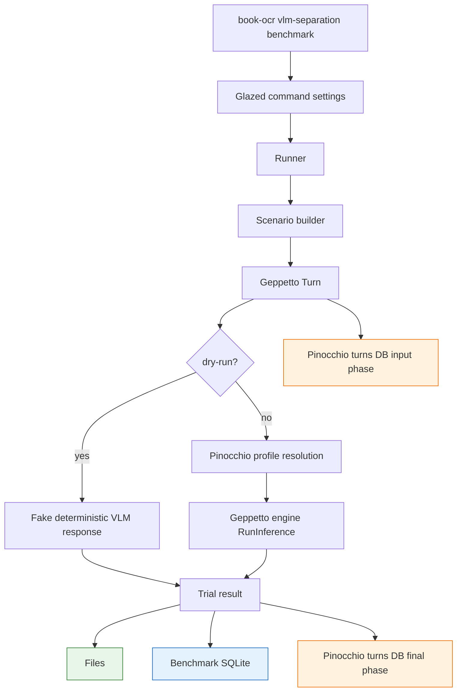

# VLM Separation Benchmark for Book OCR

The Book OCR pipeline now has a benchmark for a specific failure mode: a vision-language model receives several page images and is instructed to transcribe only one of them, but it imports text, captions, or diagram content from the neighboring images. This article explains why the benchmark was built, how it is implemented, what it records, and what the first live run tells us about prompt and block-layout design.

> [!summary]
> - The full-book OCR run showed adjacent-page contamination when neighboring page PNGs were included as context images.
> - The new `book-ocr vlm-separation benchmark` command tests whether prompt and Geppetto block layout affect target-page isolation.
> - The benchmark writes three evidence layers: human-readable files, benchmark SQLite tables, and Pinocchio-compatible Geppetto turn snapshots.
> - The first live run suggests that multi-block labeled input is worth further testing, but the response schema needs stronger enforcement before large benchmark batches.

## Why this note exists

The previous Book OCR work successfully moved OCR out of `scraper` and into the external `book-ocr` application. That architectural boundary is correct: `scraper` remains a workflow runtime, while OCR becomes a workflow application. After that extraction, the full 202-page Report 794 conversion ran through the external command and produced a complete artifact. The run had 202 page markers and 75 extracted figure crops.

The full artifact was not acceptable as final text. The main problem was not a missing page or a failed worker. The problem was content isolation. The OCR command had been run with neighboring page images as context. The prompt told the model that the first image was the target page and the other images were only context. The resulting book contained duplicated adjacent figure captions and false figure markers. Page 12, for example, referenced Figure 1-1 in prose; page 13 contained the actual Figure 1-1 diagram. The output created a figure marker for page 12 as if the figure were physically present there.

That failure led to an important design question. Should the production pipeline simply stop sending neighboring page images, or can better prompting and better Geppetto turn structure make multi-image context safe enough for some cases? The benchmark exists to answer that question with measured outputs rather than assumptions.

## The target-page isolation problem

A page OCR call has one primary obligation: output only the visible content of the target page. Context may help with terminology, line continuation, and list style, but it must not change which page is being transcribed.

The problematic run violated this invariant. The output contained adjacent duplicate captions such as:

```text
[12, 13] Figure 1-1: A Rudimentary User Interface
[31, 32] Figure 2-2: PPSCalc -- Formula Display
[31, 32] Figure 2-3: PPSCalc -- Value Display
[59, 60] Figure 3-2: Extension with Both Planning and Immediate Changes
[60, 61] Figure 3-3: Command Data Base Extension
```

This class of error is different from ordinary OCR noise. If a word is misread, a later cleanup pass may repair it. If content from page N+1 is moved into page N, the book structure itself becomes unreliable. Page-level provenance, figure extraction, cross-references, and downstream review all depend on the page boundary being stable.

The current OCR code path that made this possible is in:

```text
/home/manuel/workspaces/2026-05-20/book-ocr/2026-05-20--book-ocr/internal/ocrmvp/geppetto_ocr.go
```

The current `multimodalImages` function builds an image list where the target page comes first and context page images follow. Those images are then passed together in a Geppetto user multimodal block. The model sees all images. The instruction says to transcribe only the target image, but the visual content of the context pages is still available to the model.

## The benchmark command

The benchmark command is:

```bash
book-ocr vlm-separation benchmark
```

It lives in:

```text
/home/manuel/workspaces/2026-05-20/book-ocr/2026-05-20--book-ocr/internal/vlmseparation
```

The entry point is a Glazed command:

```text
internal/vlmseparation/command.go
```

It is registered under the existing `book-ocr` CLI in:

```text
cmd/book-ocr/main.go
```

The command accepts a book ID, image directory, target pages, scenario names, model profile, output directory, result SQLite path, and turns DB path. Normal tests use `--dry-run=true`, which is the default. Live benchmarking is explicit and opt-in with `--dry-run=false`.

A dry-run command looks like this:

```bash
go run ./cmd/book-ocr vlm-separation benchmark \
  --book-id report-794 \
  --image-dir /home/manuel/code/wesen/claw-stuff/output/books/presentation-based-uis/pages \
  --target-pages 12,13 \
  --scenarios target-only,single-block-target-first,multi-block-labeled \
  --out-dir /tmp/book-ocr-vlm-separation-dry \
  --dry-run \
  --output json
```

A live run uses the same command shape and adds a Pinocchio profile:

```bash
go run ./cmd/book-ocr vlm-separation benchmark \
  --dry-run=false \
  --book-id report-794 \
  --image-dir /home/manuel/code/wesen/claw-stuff/output/books/presentation-based-uis/pages \
  --target-pages 12,13 \
  --scenarios target-only,single-block-target-first,multi-block-labeled \
  --profile gpt-5-mini-low \
  --profile-registries /tmp/book-ocr-hq-001/profiles-clean.yaml \
  --out-dir /tmp/book-ocr-vlm-separation-live-001 \
  --output table
```

The command is deliberately a benchmark rather than a production OCR path. Its job is to construct controlled turns, run them, store the evidence, and make scenario comparison possible.

## What the scenarios test

The benchmark currently tests several block-layout scenarios. Each scenario answers a different question about how the VLM receives images and instructions.

| Scenario | Purpose | Turn shape |
|---|---|---|
| `target-only` | Establish the baseline with no image context. | One multimodal user block with one target image. |
| `single-block-target-first` | Reproduce the current OCR layout. | One multimodal user block with target, previous, and next images. |
| `single-block-labeled-images` | Test whether richer image metadata helps inside one block. | One multimodal user block with role/page metadata. |
| `multi-block-labeled` | Test whether text blocks separating image blocks improve isolation. | Multiple user blocks: target image block, separator text, context image blocks. |
| `context-first-negative-control` | Measure order sensitivity in an intentionally risky layout. | Context images before target image. |
| `target-plus-text-context` | Test the safer alternative of text context instead of image context. | Text context plus one target image. |

The most important comparison in the first run was between `single-block-target-first` and `multi-block-labeled`. Both provide context images, but they present them differently. The first keeps all images in one multimodal block. The second uses a sequence of user blocks, with explicit text around the target image and explicit text around context images.

The multi-block layout is built in `internal/vlmseparation/scenarios.go`. Conceptually it creates a turn like this:

```text
system: benchmark OCR contract
user text: The next image block is the ONLY OCR target.
user multimodal: TARGET PAGE 013 + target image
user text: The following images are context only. Do not transcribe them.
user multimodal: PREVIOUS CONTEXT PAGE 012 + previous image
user multimodal: NEXT CONTEXT PAGE 014 + next image
user text: Return JSON for the target page only.
```

This is not a guarantee that the provider will isolate images. It is an experimental condition. The benchmark records whether the condition performs better than the current single-block layout.

## Architecture

The benchmark has four layers: command parsing, scenario construction, execution, and persistence. The command is Glazed so that trial results can be emitted as rows and rendered through standard output formats. The scenario layer builds Geppetto turns. The runner executes either fake dry-run responses or live model calls. The persistence layer writes files, result tables, and turns.



The important design decision is that the benchmark uses two SQLite databases by default:

```text
results.sqlite   benchmark-specific run/trial/metric tables
turns.db         Pinocchio-compatible Geppetto turn store
```

The turns database reuses Pinocchio's schema. It contains the canonical turn/block tables:

```text
turns
blocks
turn_block_membership
```

The benchmark database contains experiment analytics:

```text
benchmark_runs
benchmark_trials
trial_metrics
```

Keeping the two databases separate avoids modifying Pinocchio's canonical turn-store schema while still giving the benchmark queryable run and metric tables.

## The persistence model

Each trial writes evidence in three forms.

First, it writes files under the output directory:

```text
<out-dir>/
  manifest.json
  scenarios.json
  summary.json
  summary.md
  results.sqlite
  turns.db
  trials/
    trial-0001/
      turn-input.yaml
      turn-final.yaml
      response.txt
      response.json
      metrics.json
      trial.json
```

Second, it writes benchmark rows to `results.sqlite`. These rows make it easy to compare scenario outcomes without reading every response file:

```sql
select
  t.id,
  t.scenario,
  t.target_page,
  t.status,
  m.json_parse_ok,
  m.expected_phrase_hits,
  m.expected_phrase_total,
  m.forbidden_phrase_hits,
  m.forbidden_caption_hits,
  m.suspected_bleed,
  m.target_only_score
from benchmark_trials t
join trial_metrics m on t.id = m.trial_id
order by t.id;
```

Third, it writes Geppetto turns to the Pinocchio turn store. The turn store is not only a log of model text. It records the block layout that created the model request. This matters because the experimental variable is the turn structure itself.

A useful turn-store query is:

```sql
select session_id, turn_id, runtime_key
from turns
order by session_id;
```

For the first live run, this produced one turn per page/scenario pair:

```text
page:012:scenario:multi-block-labeled        trial:trial-0003  book-ocr/vlm-separation/multi-block-labeled
page:012:scenario:single-block-target-first  trial:trial-0002  book-ocr/vlm-separation/single-block-target-first
page:012:scenario:target-only                trial:trial-0001  book-ocr/vlm-separation/target-only
page:013:scenario:multi-block-labeled        trial:trial-0006  book-ocr/vlm-separation/multi-block-labeled
page:013:scenario:single-block-target-first  trial:trial-0005  book-ocr/vlm-separation/single-block-target-first
page:013:scenario:target-only                trial:trial-0004  book-ocr/vlm-separation/target-only
```

## Scoring

The first scoring implementation is intentionally simple. It is not a general OCR quality metric. It is a target-isolation metric for selected pages.

Each page can have an oracle:

```go
type PageOracle struct {
    TargetPage        int
    ExpectedPhrases   []string
    ForbiddenPhrases  []string
    ExpectedCaptions  []string
    ForbiddenCaptions []string
}
```

For page 12, the oracle expects prose about the rudimentary interface and representation shift. It forbids the physical Figure 1-1 caption because that caption belongs to page 13 in the scanned pages:

```go
PageOracle{
    TargetPage: 12,
    ExpectedPhrases: []string{
        "A Rudimentary User Interface",
        "Representation Shift",
    },
    ForbiddenCaptions: []string{
        "Figure 1-1: A Rudimentary User Interface",
    },
}
```

The scorer checks whether expected phrases appear and whether forbidden phrases or captions appear. It also tracks whether the model returned parseable JSON. The current metric is useful for smoke testing, but the first live run showed that it is not yet robust enough. Some live responses contained valid JSON syntax but used fields with the wrong shapes or unexpected names. Those responses were marked `parse_failed` even when their text was useful.

That distinction matters. A benchmark can fail because the model copied from a context image. It can also fail because the benchmark schema is too weakly enforced. These are different issues and should be reported separately.

## The first live run

The first live run used:

```text
model/profile: gpt-5-mini-low
pages:         12, 13
scenarios:     target-only, single-block-target-first, multi-block-labeled
output:        /tmp/book-ocr-vlm-separation-live-001
```

The live run completed six trials. It also exposed a command integration issue: the nested Glazed command did not initialize logging because it was launched from the older manual `book-ocr` CLI. Provider trace deltas printed to the terminal. This was fixed afterward in:

```text
internal/vlmseparation/command.go
```

The fix adds Glazed logging flags to the `vlm-separation` Cobra root and calls `logging.InitLoggerFromCobra` in `PersistentPreRunE`.

The result table from `results.sqlite` was:

| Trial | Scenario | Page | Status | JSON parse | Expected hits | Expected total | Forbidden hits | Suspected bleed | Score |
|---|---|---:|---|---|---:|---:|---:|---|---:|
| trial-0001 | target-only | 12 | parse_failed | false | 2 | 2 | 0 | false | 0.75 |
| trial-0002 | single-block-target-first | 12 | succeeded | true | 0 | 2 | 0 | false | 0.00 |
| trial-0003 | multi-block-labeled | 12 | succeeded | true | 2 | 2 | 0 | false | 1.00 |
| trial-0004 | target-only | 13 | parse_failed | false | 4 | 4 | 0 | false | 0.75 |
| trial-0005 | single-block-target-first | 13 | succeeded | true | 0 | 4 | 0 | false | 0.00 |
| trial-0006 | multi-block-labeled | 13 | succeeded | true | 3 | 4 | 0 | false | 0.75 |

The live run also wrote turn-store evidence:

```text
turns:                 6
blocks:                34
turn_block_membership: 56
```

The first conclusion is narrow. In this small run, `multi-block-labeled` performed better than `single-block-target-first` under the current scorer. The result is not strong enough to declare multi-image context safe. It is strong enough to justify further testing with stricter schema enforcement and a larger page set.

## What the raw responses show

The response files show two separate problems.

The target-only responses often contained the right text but did not match the benchmark schema exactly. Page 12 target-only returned JSON-like content with fields such as:

```json
{
  "target_page": "012",
  "transcribed_page_identity": "Page 10 (scanned page)",
  "content_markers": [
    "A Rudimentary User Interface.",
    "Representation Shift."
  ],
  "transcription": "..."
}
```

The benchmark expected `target_page` as a number, `transcribed_page_identity` as an object, and `content_markers` as an object. The response therefore failed strict parsing. It still contained useful target-page content.

The `single-block-target-first` trials returned parseable JSON but used unexpected simplified fields such as `text`. Under the current scorer, those outputs did not populate expected marker fields and scored 0. That may indicate weaker compliance with the requested output contract rather than pure OCR failure.

The `multi-block-labeled` trials matched the schema closely enough to score well. Page 12 scored 1.0. Page 13 scored 0.75 because it captured the figure content but did not hit every expected phrase under the current oracle.

The raw responses did not show a forbidden Figure 1-1 caption leaking into page 12 in the small set. That is important, but it is not enough. The original full-book failure happened over 202 pages with many figure-adjacent contexts. A two-page, three-scenario run is a smoke test, not a final evaluation.

## Why Geppetto turns are the right evidence unit

The benchmark is testing more than prompt text. It is testing how the model reacts to the structure of the input. A flat log that stores only the final response would lose the central experimental variable.

A Geppetto turn preserves:

- the system block,
- the user text blocks,
- the user multimodal blocks,
- the image payload structure,
- the assistant response block,
- runtime and inference metadata.

That is why the benchmark writes both `turn-input.yaml` and `turn-final.yaml` for every trial and also stores the same snapshots through Pinocchio's turn store. The file artifacts are easy to inspect in an editor. The turn database is easy to query across many runs.

The relevant persistence wrapper is:

```text
internal/vlmseparation/turns.go
```

It reuses:

```go
github.com/go-go-golems/pinocchio/pkg/persistence/chatstore
```

The benchmark does not invent a new turns schema. It adds separate benchmark result tables for run/trial/metric data.

## Implementation details

The implementation is intentionally split into small files. Each file has one main responsibility:

| File | Responsibility |
|---|---|
| `types.go` | Run, trial, scenario, response, metric, and oracle data contracts. |
| `oracle.go` | Scenario normalization, page parsing, and page oracle definitions. |
| `scoring.go` | Parse model JSON and compute target-isolation metrics. |
| `scenarios.go` | Construct Geppetto turns for each block-layout scenario. |
| `runner.go` | Orchestrate trials, call fake or live inference, and connect persistence layers. |
| `files.go` | Write manifest, scenarios, trial artifacts, turns, and summaries as files. |
| `sqlite.go` | Manage benchmark-specific SQLite tables. |
| `turns.go` | Reuse Pinocchio `chatstore.SQLiteTurnStore` for turn snapshots. |
| `command.go` | Expose the benchmark as a Glazed command. |

The runner's core loop is simple. It constructs a manifest, inserts a benchmark run row, iterates page/scenario pairs, runs each trial, writes evidence, and emits a summary.

```go
func (r *Runner) Run(ctx context.Context) (*RunResult, error) {
    manifest := RunManifest{...}
    r.Files.WriteManifest(manifest)
    r.DB.InsertRun(ctx, manifest)

    for _, page := range r.Config.TargetPages {
        for _, scenario := range r.Scenarios {
            trial := NewTrial(page, scenario)
            result, err := r.RunTrial(ctx, trial)
            if err != nil {
                result = TrialResultFromError(trial, err)
            }
            r.DB.InsertTrial(ctx, result)
            results = append(results, result)
        }
    }

    summary := Summarize(results)
    r.Files.WriteSummary(summary)
    r.DB.CompleteRun(ctx, manifest.ID, summary)
    return &RunResult{Manifest: manifest, Trials: results, Summary: summary}, nil
}
```

Each trial saves the input turn before inference and the final turn after inference:

```go
turn, err := BuildTurnForScenario(input)
requestPath, err := r.Files.WriteTurn(trial.ID, "turn-input.yaml", turn)
r.Turns.Save(ctx, input.SessionID, input.TurnID, "input", turn)

if r.Config.DryRun {
    updated = fakeVLMResponse(turn, input)
} else {
    updated, err = r.Engine.RunInference(ctx, turn)
}

r.Files.WriteTurn(trial.ID, "turn-final.yaml", updated)
r.Turns.Save(ctx, input.SessionID, input.TurnID, "final", updated)
```

The `input` and `final` phases are important. The input phase answers, “What exactly did we ask the model to process?” The final phase answers, “What did the model append to the same turn?” For this benchmark, both questions are required.

## What should change next

The next implementation step should be response contract enforcement. The benchmark currently asks for strict JSON, but it does not use provider-native structured output. The first live run showed that some responses are semantically useful but structurally incompatible with the scorer.

The next version should add one of these mechanisms:

1. Use Geppetto's structured-output configuration if the active provider path supports it.
2. Add a repair parser that accepts common schema variants and records a `schema_repaired=true` metric.
3. Add a second text-only normalization pass over the response before scoring.

The cleanest direction is provider-native structured output. The benchmark is already using Geppetto turns, so the structured-output setting can become part of the turn data. That would make the model contract explicit and reduce parse noise.

After schema enforcement improves, the live benchmark should expand to the known risky page set:

```text
12,13,31,32,42,43,59,60,87,88,97,98,112,113,115,116
```

The larger run should include at least:

```text
target-only
single-block-target-first
multi-block-labeled
target-plus-text-context
```

The result should be reviewed in two ways: metrics from SQLite and raw turn/response inspection for sampled failures.

## Working rules

The benchmark establishes several working rules for future OCR work.

- Primary page OCR should not assume neighboring page PNGs are safe until the benchmark shows that a scenario is reliable over many risky pages.
- Multi-block labeled input may improve compliance, but it should be measured under strict schema output before being used in production OCR.
- Text-only context remains the safer default for production. It gives the model continuity information without exposing neighboring visual content.
- Every live benchmark run should preserve files, benchmark SQLite rows, and turns DB snapshots. Without the turn snapshots, block-layout regressions are hard to diagnose.
- Parse failures and context bleed are separate failure classes. A benchmark report should not collapse them into one score.

## Related implementation artifacts

Book OCR repository:

```text
/home/manuel/workspaces/2026-05-20/book-ocr/2026-05-20--book-ocr
```

Benchmark implementation:

```text
internal/vlmseparation/command.go
internal/vlmseparation/scenarios.go
internal/vlmseparation/runner.go
internal/vlmseparation/sqlite.go
internal/vlmseparation/turns.go
internal/vlmseparation/scoring.go
internal/vlmseparation/oracle.go
```

Ticket documentation:

```text
ttmp/2026/05/25/BOOK-OCR-VLM-SEPARATION-001--investigate-vlm-multi-page-input-separation-for-book-ocr/design-doc/01-vlm-multi-page-separation-benchmark-design-and-implementation-guide.md
ttmp/2026/05/25/BOOK-OCR-VLM-SEPARATION-001--investigate-vlm-multi-page-input-separation-for-book-ocr/reference/01-diary.md
```

Live benchmark artifacts:

```text
/tmp/book-ocr-vlm-separation-live-001/results.sqlite
/tmp/book-ocr-vlm-separation-live-001/turns.db
/tmp/book-ocr-vlm-separation-live-001/trials/trial-000*/response.txt
```

## Current status

The benchmark is implemented and validated in dry-run mode. A first live smoke run completed with six trials. The tool successfully captured files, benchmark SQLite rows, and Pinocchio turn snapshots. The first result favors `multi-block-labeled` over `single-block-target-first` in a small sample, but the benchmark response schema must be made stricter before the result can guide production OCR policy.

The correct near-term path is not to rerun the whole book. It is to strengthen the benchmark contract, run a broader live benchmark on known risky pages, and only then decide whether any image-context scenario is safe enough for production OCR.
