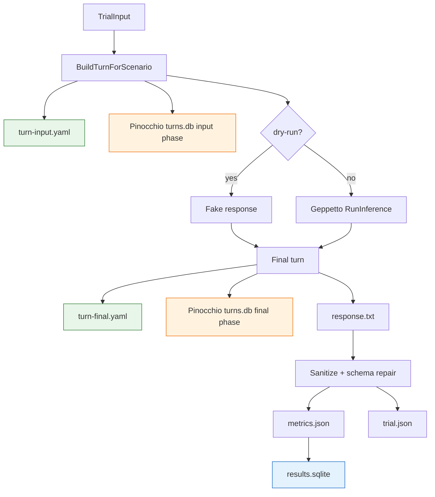

# VLM Separation Benchmark for Book OCR

This article explains the VLM separation benchmark built for the Book OCR project. The benchmark answers one specific question: when a vision-language model receives a target page image and neighboring page context, does it keep the target page boundary intact, or does it import text, captions, and figures from adjacent images?

The question came from a real production failure. A full 202-page OCR run of Report 794 completed successfully as a workflow, but the generated Markdown contained duplicated adjacent figure captions. The workflow had not lost data. The model had crossed page boundaries. That is a different class of error from ordinary OCR noise, because it changes page provenance.

> [!summary]
> - The benchmark compares prompt/block layouts for target-page isolation: target-only, single multimodal block with target first, multi-block labeled images, and target image plus text-only context.
> - The implementation stores three evidence layers: files for human inspection, benchmark SQLite tables for analysis, and Pinocchio-compatible Geppetto turn snapshots for replay/debugging.
> - The parser now uses `github.com/go-go-golems/sanitize/pkg/json` plus schema repair, so live model schema drift does not get confused with target/context bleed.
> - The broad risky-page live run covered 16 target pages and 4 scenarios. After retrying two transient TLS failures, all 64 logical trials completed and none showed forbidden-caption bleed under the current oracle.
> - The production recommendation remains conservative: primary OCR should use target-page-only images; text-only context is acceptable; neighboring page images should stay in diagnostic/benchmark paths until larger evidence supports them.

## 1. The failure that motivated the benchmark

The Book OCR project first validated the generic workflow runtime by running OCR workflows over Report 794, *Presentation Based User Interfaces*. After the OCR code was moved out of `scraper` and into the external `book-ocr` application, the full book was converted through the external command. The run produced complete page coverage and a final Markdown artifact.

The artifact was structurally complete but not textually safe. The OCR command had been run with neighboring page images as context. The prompt told the model that the first image was the target page and the remaining images were context only. The model sometimes copied adjacent-page visual content into the target page output anyway.

The most visible symptoms were duplicated adjacent figure captions:

```text
[12, 13]   Figure 1-1: A Rudimentary User Interface
[31, 32]   Figure 2-2: PPSCalc -- Formula Display
[31, 32]   Figure 2-3: PPSCalc -- Value Display
[42, 43]   Figure 2-9: Presenter Parts
[59, 60]   Figure 3-2: Extension with Both Planning and Immediate Changes
[60, 61]   Figure 3-3: Command Data Base Extension
[87, 88]   Figure 4-6: Xerox Star -- Property Sheet
[97, 98]   Figure 4-12: Sample of Steamer Icons
[112, 113] Figure 5-6: Command Description Support
[115, 116] Figure 5-7: Reference Resolution
```

The page 12/13 case made the problem concrete. Page 12 contains prose that references Figure 1-1. Page 13 contains the actual Figure 1-1 diagram. The full-book artifact created a figure marker for page 12 as if the figure were physically present there. That is not just a caption transcription error. It is a provenance error.

A page OCR call has one primary invariant:

```text
Only content visibly present on the target page may appear in the target page output.
```

The VLM separation benchmark was built to test how robust that invariant is under different prompt and block layouts.

## 2. The engineering question

The production pipeline needs an answer to a practical design question:

```text
Should OCR ever send neighboring page images to the VLM, or should page OCR be target-image-only with at most text context?
```

There are three plausible policies.

| Policy | What the OCR call sees | Benefit | Risk |
|---|---|---|---|
| Target-image-only | Only the target page PNG. | Strong page provenance. | Less context for continuation, terminology, and figure references. |
| Target image plus text context | Target page PNG plus neighboring page text summaries. | Gives continuity without exposing neighboring visual content. | Text context can still bias wording if used carelessly. |
| Target image plus neighboring page images | Target page PNG plus previous/next PNGs. | Gives the model complete local visual context. | The model can copy adjacent captions, diagrams, or labels. |

The full-book regression showed that the third policy is unsafe when implemented naively. The benchmark asks whether better input structure can make it safer, and whether the evidence is strong enough to change the production policy.

## 3. The benchmark package

The benchmark lives in the external OCR application repository:

```text
/home/manuel/workspaces/2026-05-20/book-ocr/2026-05-20--book-ocr/internal/vlmseparation
```

The command is registered under:

```text
book-ocr vlm-separation
```

The key files are:

| File | Responsibility |
|---|---|
| `command.go` | Glazed command wiring for `benchmark` and `rescore`. |
| `types.go` | Run, trial, scenario, metric, oracle, and response structs. |
| `oracle.go` | Risky-page presets and expected/forbidden phrase oracles. |
| `scenarios.go` | Geppetto turn construction for each prompt/block layout. |
| `runner.go` | Trial orchestration, live/fake inference, and artifact persistence. |
| `scoring.go` | JSON extraction, sanitize-backed repair, schema repair, phrase scoring. |
| `sqlite.go` | Benchmark-specific SQLite schema and metric persistence. |
| `turns.go` | Pinocchio-compatible Geppetto turn storage. |
| `files.go` | Manifest, scenario, response, metric, turn, and summary files. |
| `rescore.go` | Replay saved provider outputs through the current parser/scorer. |

The package is deliberately separate from the generic workflow runtime. The runtime remains in `scraper/pkg/workflow`. The benchmark is Book OCR application logic.

## 4. The two commands

The benchmark has two important commands.

### `benchmark`

`benchmark` constructs turns, optionally calls a live model, writes artifacts, and emits one row per trial.

```bash
go run ./cmd/book-ocr vlm-separation benchmark \
  --dry-run=false \
  --book-id report-794 \
  --image-dir /home/manuel/code/wesen/claw-stuff/output/books/presentation-based-uis/pages \
  --preset report794-figure-adjacent \
  --scenarios target-only,single-block-target-first,multi-block-labeled,target-plus-text-context \
  --profile gpt-5-mini-low \
  --profile-registries /tmp/book-ocr-hq-001/profiles-clean.yaml \
  --out-dir /tmp/book-ocr-vlm-separation-live-risky-pages \
  --output table
```

Normal tests and smoke runs use `--dry-run=true`. Live runs require `--dry-run=false`. This is intentional. Provider calls should never be accidental in a unit test or local smoke test.

### `rescore`

`rescore` replays saved responses through the current parser and scorer. It does not call the provider.

```bash
go run ./cmd/book-ocr vlm-separation rescore \
  --out-dir /tmp/book-ocr-vlm-separation-live-risky-pages \
  --output table
```

This command matters because provider output and benchmark scoring are different kinds of data. Provider output is the observation. Metrics are a projection over that observation. When the parser or scorer improves, the correct operation is to re-score the saved observation, not to ask the provider a different question.

## 5. The output directory contract

Every run writes a self-contained output directory:

```text
<out-dir>/
  manifest.json
  scenarios.json
  summary.json
  summary.md
  results.sqlite
  turns.db
  trials/
    trial-0001/
      turn-input.yaml
      turn-final.yaml
      response.txt
      response.json
      metrics.json
      trial.json
```

Each file answers a different question.

| File | Question answered |
|---|---|
| `manifest.json` | What run configuration created this output directory? |
| `scenarios.json` | Which scenario definitions were active? |
| `turn-input.yaml` | What exact Geppetto turn was sent before inference? |
| `turn-final.yaml` | What did the model append to that turn? |
| `response.txt` | What raw text did the provider return? |
| `response.json` | What canonical `BenchmarkResponse` did the parser derive? |
| `metrics.json` | How did the scorer evaluate this response? |
| `trial.json` | What complete trial metadata should be preserved? |
| `results.sqlite` | How can we query the run across all trials? |
| `turns.db` | How can we inspect turns using Pinocchio's turn-store schema? |

This structure supports two workflows. A human can open a single trial directory and inspect the exact prompt, response, and score. A script can query `results.sqlite` to compare scenario behavior across pages.

## 6. The scenario model

A scenario is a controlled input layout. The page, neighboring images, oracle, model profile, and scoring code stay fixed. The scenario changes how the target and context are presented to the model.

The current scenarios are:

| Scenario | What it sends | Why it exists |
|---|---|---|
| `target-only` | One target image. | Establishes the isolation baseline. |
| `single-block-target-first` | Target, previous, and next images in one multimodal block. | Recreates the risky production style in a controlled benchmark. |
| `single-block-labeled-images` | One multimodal block with richer image metadata. | Tests whether metadata helps without changing block shape. |
| `multi-block-labeled` | Separate user blocks for target image and context images. | Tests whether block separation and explicit boundary text improve isolation. |
| `context-first-negative-control` | Context images before target image. | Tests order sensitivity in an intentionally risky layout. |
| `target-plus-text-context` | Neighboring text context plus target image only. | Tests the safer production candidate. |

The broad live run used four scenarios:

```text
target-only
single-block-target-first
multi-block-labeled
target-plus-text-context
```

### Target-only

`target-only` is the control. The model sees one page image and cannot visually copy neighboring pages.

```go
img, err := imagePayload(input.TargetImagePath, "target", input.TargetPage)
turns.AppendBlock(turn, turns.NewUserMultimodalBlock(
    targetOnlyPrompt(input),
    []map[string]any{img},
))
```

If this scenario fails by copying a neighboring caption, the problem is not image-context bleed. It is either the oracle, the source page itself, or the model hallucinating from learned priors.

### Single-block target-first

`single-block-target-first` approximates the original risky layout. It sends target, previous, and next images together in one multimodal block.

```go
images, err := contextImagePayloads(input, []string{"target", "previous", "next"})
turns.AppendBlock(turn, turns.NewUserMultimodalBlock(singleBlockPrompt(input), images))
```

The prompt says that the first image is the only target. The model still receives all image content in one block.

### Multi-block labeled

`multi-block-labeled` separates the target image and context images into different user blocks, with text boundaries between them.

```go
turns.AppendBlock(turn, turns.NewUserTextBlock(
    "The next image block is the ONLY OCR target. Transcribe only that target page.",
))
turns.AppendBlock(turn, turns.NewUserMultimodalBlock(
    fmt.Sprintf("TARGET PAGE %03d. OCR this image only.", input.TargetPage),
    []map[string]any{targetImage},
))
turns.AppendBlock(turn, turns.NewUserTextBlock(
    "The following image blocks are context only. Do not transcribe text, captions, labels, or figures from them.",
))
```

The purpose is not to guarantee separation. The purpose is to test whether the model follows a stronger turn structure more reliably than a flat multimodal block.

### Target plus text context

`target-plus-text-context` sends the target image and neighboring page text placeholders. In a production redesign, those placeholders would be replaced with previously computed structured OCR summaries.

```go
turns.AppendBlock(turn, turns.NewUserTextBlock(
    "Text-only context from neighboring pages. Use for terminology/style only; do not copy unless visible on target page.\n\n"+
    "Previous context:\n"+input.PreviousText+"\n\n"+
    "Next context:\n"+input.NextText,
))
turns.AppendBlock(turn, turns.NewUserMultimodalBlock(targetOnlyPrompt(input), []map[string]any{targetImage}))
```

This scenario tests the safer long-term design: OCR the target page image only, then use text context in later normalization or continuity passes.

## 7. Geppetto turns as the evidence unit

The benchmark is not only testing prompt text. It is testing the structure of a Geppetto turn. That is why the turn is the evidence unit.

A turn records:

- system text,
- user text blocks,
- user multimodal blocks,
- image payload metadata,
- model response blocks,
- runtime metadata,
- inference metadata when present.

The turn-store wrapper writes each turn through Pinocchio's existing SQLite turn store:

```go
return s.store.Save(
    ctx,
    s.convID,
    sessionID,
    turnID,
    phase,
    time.Now().UnixMilli(),
    string(payload),
    chatstore.TurnSaveOptions{RuntimeKey: runtimeKey, InferenceID: inferenceID},
)
```

The benchmark uses these identifiers:

```text
convID     = vlm-separation:<book-id>:<run-id>
sessionID  = page:<page>:scenario:<scenario>
turnID     = trial:<trial-id>
phase      = input or final
runtimeKey = book-ocr/vlm-separation/<scenario>
```

The broad live run wrote:

```text
turns:                 64
blocks:                348
turn_block_membership: 562
```

The turns DB is stored at:

```text
/tmp/book-ocr-vlm-separation-live-risky-pages/turns.db
```

A useful query is:

```sql
select session_id, turn_id, runtime_key
from turns
order by session_id;
```

This is useful during review because a bad score can be traced back to the exact block layout that produced it.

## 8. Benchmark SQLite schema

The benchmark stores analytics in a separate SQLite database:

```text
/tmp/book-ocr-vlm-separation-live-risky-pages/results.sqlite
```

The schema is intentionally separate from the Pinocchio turn store. The turn store preserves conversation/turn data. The benchmark DB preserves experiment projections.

The main tables are:

```sql
benchmark_runs(id, book_id, profile, prompt_version, started_at, completed_at, out_dir, turns_dsn, dry_run)
benchmark_trials(id, run_id, scenario, target_page, previous_page, next_page, status, request_path, response_path, parsed_response_path, metrics_path, turn_session_id, turn_id, started_at, completed_at, latency_ms, error)
trial_metrics(trial_id, json_parse_ok, json_sanitized, schema_repaired, parse_strategy, expected_phrase_hits, expected_phrase_total, forbidden_phrase_hits, forbidden_caption_hits, suspected_bleed, target_only_score, raw_json)
```

A common result query is:

```sql
select scenario,
       count(*) as n,
       sum(case when benchmark_trials.status = 'succeeded' then 1 else 0 end) as succeeded,
       sum(json_parse_ok) as parse_ok,
       sum(schema_repaired) as repaired,
       sum(suspected_bleed) as bleed,
       round(avg(target_only_score), 3) as avg_score,
       min(target_only_score) as min_score
from trial_metrics
join benchmark_trials on trial_metrics.trial_id = benchmark_trials.id
group by scenario
order by scenario;
```

The important design point is that metrics are derived. They can be rewritten by `rescore` when parsing or scoring logic improves.

## 9. The oracle layer

The benchmark needs to know what to look for on each page. That knowledge lives in `oracle.go` as `PageOracle` values.

```go
type PageOracle struct {
    TargetPage        int      `json:"target_page"`
    ExpectedPhrases   []string `json:"expected_phrases,omitempty"`
    ForbiddenPhrases  []string `json:"forbidden_phrases,omitempty"`
    ExpectedCaptions  []string `json:"expected_captions,omitempty"`
    ForbiddenCaptions []string `json:"forbidden_captions,omitempty"`
}
```

For a prose page adjacent to a figure, the oracle often expects prose phrases and forbids the neighboring figure caption. For a figure page, the oracle expects the visible caption and labels.

The broad risky-page preset is:

```text
12,13,31,32,42,43,59,60,87,88,97,98,112,113,115,116
```

The page choices came from two sources:

1. The full-book OCR artifact showed duplicate adjacent captions on these ranges.
2. A vision inspection pass confirmed which pages visibly contain figures and which pages are mostly prose for several ambiguous pairs.

Examples:

| Page | Expected | Forbidden |
|---:|---|---|
| 12 | `A Rudimentary User Interface`, `Representation Shift` | `Figure 1-1: A Rudimentary User Interface` |
| 13 | `Figure 1-1: A Rudimentary User Interface`, `Application Data Base` | — |
| 31 | `Figure 2-1: The Primitive Presentation System (PPS) Model` | `Figure 2-2`, `Figure 2-3` |
| 32 | `Figure 2-2`, `Figure 2-3`, `A1*B1`, `2375` | `Figure 2-1` |
| 43 | `domain collector`, `semantic presenter` | `Figure 2-9: Presenter Parts` |
| 88 | `Figure 4-6: Xerox Star -- Property Sheet`, `DOCUMENT PROPERTIES` | `Figure 4-7`, `Figure 4-8` |
| 116 | `Graphics Redisplay` | `Figure 5-7: Reference Resolution` |

The oracle is intentionally narrow. It is not a full OCR quality evaluator. It detects whether expected anchor phrases appear and whether forbidden adjacent captions appear.

## 10. Response parsing and sanitize-backed repair

The first live smoke run revealed a benchmark-harness problem. The model frequently returned useful JSON, but not always in the exact schema requested by the benchmark.

Examples included:

```json
{
  "target_page": "012",
  "transcribed_page_identity": "Page 10 (scanned page)",
  "content_markers": [
    "A Rudimentary User Interface.",
    "Representation Shift."
  ],
  "transcription": "..."
}
```

and:

```json
{
  "page": 13,
  "ocr": "Figure 1-1: A Rudimentary User Interface\nApplication Data Base"
}
```

Strict Go unmarshalling into the canonical struct is not enough for this. Unknown fields can be ignored. Wrongly shaped fields can fail the parse. Useful text can be present under `text`, `ocr`, or `ocr_text` instead of `transcription`.

The parser now uses a staged pipeline:

```text
raw provider text
  -> trim code fences
  -> extract the first JSON object
  -> attempt strict BenchmarkResponse parsing
  -> run jsonsanitize.Sanitize(...)
  -> attempt strict BenchmarkResponse parsing again
  -> repair common schema variants into BenchmarkResponse
  -> score
```

The repair path accepts common variants:

| Variant | Canonical interpretation |
|---|---|
| `target_page: "012"` | `TargetPage = 12` |
| `page` or `page_number` | `TargetPage` |
| `text`, `ocr`, `ocr_text`, `markdown`, `content` | `Transcription` |
| `content_markers` as an array | `UniquePhrases`, with figure-looking entries also copied to `FigureCaptions` |
| `transcribed_page_identity` as a string | `TitleOrCaptionLines` |
| `suspected_context_copy` as explanatory text | `Notes`, not a boolean bleed flag |

The metrics record how parsing happened:

```text
json_parse_ok
json_sanitized
schema_repaired
parse_strategy
```

The broad live run had many `schema-repair` parse strategies. This does not mean the JSON was malformed. It means the model often returned a useful but non-canonical schema shape.

## 11. Phrase scoring

The scorer computes a small target-isolation score.

```go
score := expected_hits / expected_total
score -= 0.5 * forbidden_hits
if !json_parse_ok {
    score -= 0.25
}
score = max(score, 0)
```

The scorer also normalizes whitespace before phrase matching. This became necessary because OCR of diagram labels often breaks phrases over lines:

```text
Application
Data
Base
```

The phrase oracle wants to match:

```text
Application Data Base
```

The scorer now uses:

```go
func normalizePhraseText(s string) string {
    return strings.Join(strings.Fields(strings.ToLower(s)), " ")
}
```

This change is important. Without whitespace normalization, a correct diagram transcription can receive a low score simply because line breaks split labels.

## 12. The broad risky-page live run

The broad run used 16 target pages and 4 scenarios:

```text
16 pages × 4 scenarios = 64 logical trials
```

Command:

```bash
go run ./cmd/book-ocr vlm-separation --log-level warn benchmark \
  --dry-run=false \
  --book-id report-794 \
  --image-dir /home/manuel/code/wesen/claw-stuff/output/books/presentation-based-uis/pages \
  --preset report794-figure-adjacent \
  --scenarios target-only,single-block-target-first,multi-block-labeled,target-plus-text-context \
  --profile gpt-5-mini-low \
  --profile-registries /tmp/book-ocr-hq-001/profiles-clean.yaml \
  --out-dir /tmp/book-ocr-vlm-separation-live-risky-pages \
  --output table
```

Run ID:

```text
vlmsep-4636c84d-e707-4b2c-8134-78e5bda15b9e
```

Output directory:

```text
/tmp/book-ocr-vlm-separation-live-risky-pages
```

Two live calls failed with transient TLS errors:

```text
trial-0023 page 43 multi-block-labeled       tls: bad record MAC
trial-0040 page 88 target-plus-text-context  tls: bad record MAC
```

Both were retried as separate one-trial runs. The page 88 retry succeeded immediately. The page 43 multi-block-labeled retry failed once with the same TLS error and then succeeded on the second retry. The final combined interpretation below uses the successful retries for those two logical cells.

Retry output directories:

```text
/tmp/book-ocr-vlm-separation-live-risky-pages-retry-43-mbl-2
/tmp/book-ocr-vlm-separation-live-risky-pages-retry-88-text
```

## 13. Broad-run results

After applying retries and rescoring all saved outputs with the current parser/scorer:

```text
logical trials:        64
successful trials:     64
parseable trials:      64
suspected bleed:       0
forbidden hits:        0
```

Scenario aggregates:

| Scenario | Trials | Successful | Average score | Minimum score | Suspected bleed |
|---|---:|---:|---:|---:|---:|
| `target-only` | 16 | 16 | 0.938 | 0.333 | 0 |
| `single-block-target-first` | 16 | 16 | 0.906 | 0.333 | 0 |
| `multi-block-labeled` | 16 | 16 | 0.938 | 0.333 | 0 |
| `target-plus-text-context` | 16 | 16 | 0.938 | 0.333 | 0 |

Page aggregates:

| Page | Average score across scenarios | Notes |
|---:|---:|---|
| 12 | 1.000 | Prose page adjacent to Figure 1-1; no forbidden caption copied. |
| 13 | 0.938 | Figure page; two scenarios missed one expected anchor but did not copy forbidden content. |
| 31 | 1.000 | Figure 2-1 page; no copied PPSCalc captions after oracle correction. |
| 32 | 1.000 | PPSCalc figure page; all scenarios hit expected anchors. |
| 42 | 1.000 | Presenter Parts figure page. |
| 43 | 1.000 | Prose page after retry; no Figure 2-9 bleed. |
| 59 | 0.667 | All scenarios missed one expected oracle anchor; no forbidden captions. |
| 60 | 1.000 | Prose page; no Figure 3-2 or Figure 3-3 bleed. |
| 87 | 1.000 | Prose page; no Xerox Star Figure 4-6 bleed. |
| 88 | 0.938 | Figure page; one scenario missed one expected anchor. |
| 97 | 1.000 | Steamer icon figure page. |
| 98 | 1.000 | Prose page; no Figure 4-12 bleed. |
| 112 | 1.000 | Command Description Support figure page after whitespace-normalized scoring. |
| 113 | 1.000 | Prose page; no Figure 5-6 bleed. |
| 115 | 1.000 | Reference Resolution figure page after whitespace-normalized scoring. |
| 116 | 0.333 | All scenarios hit only one of three expected anchors; no Figure 5-7 bleed. |

The most important result is not the average score. The most important result is the absence of forbidden-caption hits. The benchmark specifically targeted page pairs where the earlier full-book run had duplicated adjacent captions. Under the tested prompt layouts, model profile, parser repair, and oracles, the broad benchmark did not reproduce forbidden-caption bleed.

## 14. Interpreting the low scores

Some low scores are not evidence of context bleed.

Page 59 scored 0.667 in every scenario. This uniformity across scenarios suggests an oracle/anchor issue rather than a block-layout issue. If target-only, image-context, and text-context all miss the same anchor, the missing anchor probably was not a context separation effect.

Page 116 scored 0.333 in every scenario. The model consistently captured the page's opening material around Figure 5-7 references and `5.2 Graphics Redisplay`, but it did not hit two of the three expected anchors. Again, because all scenarios behaved the same way, the result is about expected-phrase coverage rather than image-context bleed.

The benchmark therefore separates three failure classes:

| Failure class | Symptom | Meaning |
|---|---|---|
| Context bleed | Forbidden neighboring caption appears. | Target boundary failed. |
| Coverage miss | Expected anchor absent, no forbidden content. | OCR or oracle coverage issue. |
| Harness failure | Missing response or parse failure. | Provider/transport/parser issue, not OCR content. |

The broad run showed coverage misses and transient transport failures. It did not show context bleed under the current oracle.

## 15. What the result does and does not prove

The result is encouraging but bounded.

It supports these statements:

- On the tested risky pages, `gpt-5-mini-low` did not copy the forbidden adjacent figure captions under the tested layouts.
- The previous full-book duplicated-caption failure is not automatically reproduced by every multi-image prompt layout.
- The repaired parser is necessary for reliable benchmark interpretation because schema drift is common in live responses.
- Text-only context performed as well as target-only on this benchmark after retries and rescoring.

It does not support these stronger statements:

- It does not prove neighboring page images are safe for production OCR.
- It does not prove a different model, provider, prompt, page type, or larger book will behave the same way.
- It does not prove `single-block-target-first` is a good production default.
- It does not replace page-level validation in the redesigned OCR pipeline.

The production design should still favor target-page-only primary OCR. The benchmark changes the confidence level around diagnostic and experimental image-context calls. It does not remove the need for a conservative production boundary.

## 16. How the benchmark was built

The implementation was built in layers. Each layer preserves a boundary that matters for later debugging.

### Layer 1: Scenario construction

`scenarios.go` converts a `TrialInput` into a Geppetto turn. This is where the experimental variable lives. The runner does not know whether a scenario uses one multimodal block or several blocks. It asks the scenario builder for a turn.

```go
func BuildTurnForScenario(input TrialInput) (*turns.Turn, error) {
    turn := &turns.Turn{ID: input.TurnID}
    turns.AppendBlock(turn, turns.NewSystemTextBlock(benchmarkSystemPrompt()))
    switch input.Scenario.Name {
    case ScenarioTargetOnly:
        ...
    case ScenarioSingleBlockTargetFirst:
        ...
    case ScenarioMultiBlockLabeled:
        ...
    }
    return turn, nil
}
```

This makes scenario changes reviewable. To understand a prompt-layout experiment, start in one file.

### Layer 2: Runner orchestration

`runner.go` owns the trial lifecycle:

```text
build TrialInput
build Geppetto turn
write turn-input.yaml
save input turn to turns.db
run fake or live inference
write turn-final.yaml
save final turn to turns.db
extract last LLM text
parse and score response
write trial artifacts
insert SQLite rows
```

The runner writes the input turn before inference. This is important because failed provider calls can still be debugged from `turn-input.yaml`. The broad run's two TLS failures both preserved their input turns.

### Layer 3: Response repair and scoring

`scoring.go` converts provider text into a canonical response and then into metrics. It deliberately records parser behavior as metrics. A repaired schema is not hidden.

```go
metrics.JSONSanitized = parseResult.Sanitized
metrics.SchemaRepaired = parseResult.SchemaRepaired
metrics.ParseStrategy = parseResult.Strategy
```

This makes later analysis possible. If one model always needs schema repair and another follows the schema strictly, that difference is visible in the database.

### Layer 4: Persistence

The benchmark writes both files and SQLite rows. The files are review artifacts. SQLite is the analysis surface.



### Layer 5: Rescoring

`rescore.go` makes metrics replayable:

```go
trial, err := readTrialResult(path)
rescored, err := rescoreTrialResult(trial)
files.WriteTrialArtifacts(&rescored)
db.InsertTrial(ctx, rescored)
```

This is the layer that allowed the first live run to be reinterpreted after response repair and phrase normalization were added.

## 17. How to inspect the broad run

Start with the summary:

```bash
jq . /tmp/book-ocr-vlm-separation-live-risky-pages/summary.json
```

Then query scenario aggregates:

```bash
sqlite3 -header -column /tmp/book-ocr-vlm-separation-live-risky-pages/results.sqlite '
select scenario,
       count(*) n,
       sum(case when bt.status = "succeeded" then 1 else 0 end) succeeded,
       sum(json_parse_ok) parse_ok,
       sum(schema_repaired) repaired,
       sum(suspected_bleed) bleed,
       round(avg(target_only_score), 3) avg_score,
       min(target_only_score) min_score
from trial_metrics tm
join benchmark_trials bt on tm.trial_id = bt.id
group by scenario
order by scenario;
'
```

Find low-scoring trials:

```bash
sqlite3 -header -column /tmp/book-ocr-vlm-separation-live-risky-pages/results.sqlite '
select bt.target_page,
       bt.scenario,
       bt.status,
       tm.expected_phrase_hits,
       tm.expected_phrase_total,
       tm.forbidden_phrase_hits,
       tm.target_only_score
from benchmark_trials bt
join trial_metrics tm on bt.id = tm.trial_id
where tm.target_only_score < 1
order by bt.target_page, bt.scenario;
'
```

Inspect a trial manually:

```bash
less /tmp/book-ocr-vlm-separation-live-risky-pages/trials/trial-0010/turn-input.yaml
less /tmp/book-ocr-vlm-separation-live-risky-pages/trials/trial-0010/response.txt
jq . /tmp/book-ocr-vlm-separation-live-risky-pages/trials/trial-0010/metrics.json
```

Inspect turn-store row counts:

```bash
sqlite3 /tmp/book-ocr-vlm-separation-live-risky-pages/turns.db '
select count(*) from turns;
select count(*) from blocks;
select count(*) from turn_block_membership;
'
```

## 18. What should change in production OCR

The benchmark supports a conservative production design.

### Primary page OCR should be target-image-only

The primary OCR call should transcribe only one page image. This gives the strongest page provenance. It makes every page artifact easier to audit. It also reduces the chance that a model copies an adjacent figure.

### Context should be text-first

Context is still useful. It should come from structured text outputs, not neighboring PNGs, in the normal path. A page pipeline can run:

```text
target-page OCR
  -> structured blocks
  -> deterministic Markdown rendering
  -> text-only continuity/normalization pass
  -> figure QA
```

The continuity pass can see prior/next text summaries. It should not need prior/next page images.

### Multi-image prompts should remain diagnostic

The broad benchmark did not reproduce forbidden-caption bleed, but image-context prompts still increase the amount of visual content available to the model. They should be used for benchmark and diagnostic questions, not for the default production transcription path.

### Validation should check forbidden adjacent captions

The benchmark oracle pattern should become part of production QA. If page N references Figure X and page N+1 contains Figure X, the renderer or validator should verify that page N did not gain a figure marker unless the figure is visibly present on page N.

## 19. Current status

The benchmark now has:

- dry-run validation,
- live benchmark execution,
- Glazed logging initialization,
- Pinocchio-compatible turn persistence,
- benchmark SQLite persistence,
- sanitize-backed JSON repair,
- schema repair for common live model variants,
- whitespace-normalized phrase scoring,
- saved-run rescoring,
- specialized oracles for the risky Report 794 page preset,
- a broad live run over 64 logical trials.

Recent implementation commits in `book-ocr`:

```text
050aab5 Expand VLM benchmark risky page oracles
c220e1b Harden VLM benchmark rescore parsing
d37143b Normalize VLM benchmark phrase scoring
b606549 Add VLM benchmark rescore command
```

Key output directories:

```text
/tmp/book-ocr-vlm-separation-live-risky-pages
/tmp/book-ocr-vlm-separation-live-risky-pages-retry-43-mbl-2
/tmp/book-ocr-vlm-separation-live-risky-pages-retry-88-text
```

## 20. Next steps

The next useful implementation step is a reporting command. `rescore` updates artifacts and emits trial rows, but it does not yet produce the grouped narrative tables used in this article.

A good `report` command would:

- read one or more benchmark output directories,
- optionally apply retry replacements,
- group by scenario and page,
- distinguish bleed, coverage misses, parse repair, and provider failures,
- write Markdown and JSON summaries,
- include links to the relevant trial directories.

The next useful OCR pipeline step is to apply the benchmark's lesson to the structured OCR redesign: target-page-only primary OCR, deterministic rendering, text-context normalization, and explicit validation gates for adjacent-page contamination.
