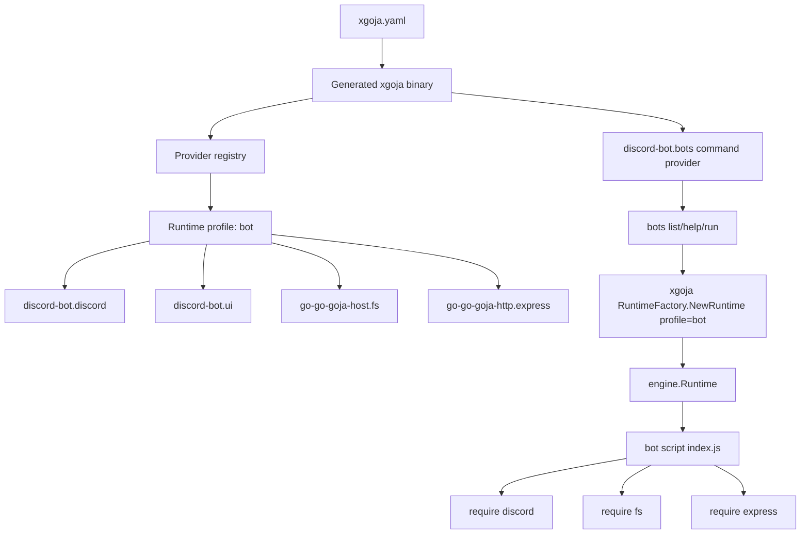
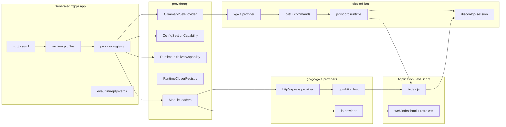

# xgoja Modules in Existing Runners: Discord Bot Case Study

This note explains the larger pattern behind the recent xgoja provider work: how to insert xgoja modules into an existing JavaScript runner without rewriting that runner around xgoja. The concrete example is `discord-bot`, but the point is broader. A package that already owns a JavaScript execution environment can become an xgoja participant by exposing modules, command providers, runtime configuration sections, and runtime initializers. Once it does, a generated xgoja binary can assemble that package with unrelated modules such as `fs` and `express` and make them run in one coherent Goja runtime.

> [!summary]
> - xgoja is best understood as a composition layer for Goja-powered JavaScript environments. It does not replace every runner; it gives runners a shared module and command-provider protocol.
> - The central abstraction is a runtime profile: a named set of provider modules plus provider capabilities. Commands, REPLs, evals, and package-owned runners all create runtimes from profiles.
> - The Discord bot example shows the hard case: an existing host-owned runner with its own CLI, bot discovery, script loading, Discord session lifecycle, and callbacks now receives xgoja-selected modules such as `fs` and `express`.
> - The pattern works because configuration, runtime creation, and lifecycle are separated. Glazed sections define flags; runtime initializers consume parsed values; runtime closers clean up host resources.

The source work happened across two repositories in `/home/manuel/workspaces/2026-05-24/add-js-providers`:

- `/home/manuel/workspaces/2026-05-24/add-js-providers/go-go-goja`
- `/home/manuel/workspaces/2026-05-24/add-js-providers/discord-bot`

The main ticket trail is in `go-go-goja/ttmp/2026/05/24` and `go-go-goja/ttmp/2026/05/25`, especially `XGOJA-008`, `XGOJA-009`, `XGOJA-010`, and `XGOJA-011`.

## Why this note exists

The obvious way to add a new JavaScript module to an existing runner is to open the runner, import the module, and wire it into that runner's Go code. That is also the path that leads to a dead end. If `discord-bot` learns about `express`, then every other host that wants HTTP has to learn about `express` too. If `loupedeck` learns about Discord, then every module combination becomes a bespoke integration. The more packages exist, the more cross-product glue appears.

The xgoja provider system is the alternative. Each package states what it can contribute:

- a CommonJS-style `require()` module;
- optional Glazed configuration sections;
- optional runtime initialization hooks;
- optional runtime lifecycle cleanup hooks;
- optional package-owned command sets.

The generated xgoja application reads a declarative spec, selects a runtime profile, and assembles these pieces. The host package still owns its domain. `discord-bot` still owns bot discovery, command synchronization, Discord sessions, and slash command dispatch. `go-go-goja` owns generic JavaScript runtime assembly and xgoja-owned modules such as `fs` and `express`. The two meet at a narrow interface: “give me a runtime for profile `bot`, with these require options, and initialize selected module capabilities from parsed command flags.”

That is the lesson worth preserving. Inserting xgoja into an existing runner is not mostly about adding `require()` loaders. It is about moving the boundary between *domain runtime ownership* and *module composition*.

## The smallest mental model

Imagine a generated binary named `xdiscord`. It is built from an `xgoja.yaml` file. The spec says:

```yaml
runtimes:
  bot:
    modules:
      - package: discord-bot
        name: discord
        as: discord
      - package: discord-bot
        name: ui
        as: ui
      - package: go-go-goja-host
        name: fs
        as: fs
      - package: go-go-goja-http
        name: express
        as: express

commandProviders:
  - package: discord-bot
    name: bots
    mount: bots
    runtimeProfile: bot
```

This should be read as two related statements.

The first statement is: “A runtime named `bot` contains four modules.” When code running in that runtime calls `require("discord")`, `require("ui")`, `require("fs")`, or `require("express")`, those names resolve to provider-supplied module loaders.

The second statement is: “The command tree under `bots` comes from `discord-bot`, but when those commands run JavaScript, they should use the `bot` runtime profile.” That means `discord-bot` does not have to hard-code `fs` or `express`. It asks xgoja to create a runtime for the configured profile.

The resulting shape is:



The key point is that the runtime profile is a named composition. It is not tied to one command. The same profile can power `eval`, `run`, `repl`, `jsverbs`, or a custom package-owned command provider. That shared profile is what lets a generated binary behave like a real application rather than a pile of ad hoc command flags.

## What xgoja contributes

xgoja contributes the application assembly layer. Its job is to load provider packages, validate the build spec, generate a binary, attach built-in and package-owned commands, and create runtimes from named profiles.

The important local files are:

- `go-go-goja/pkg/xgoja/providerapi/module.go`
- `go-go-goja/pkg/xgoja/providerapi/capabilities.go`
- `go-go-goja/pkg/xgoja/providerapi/commands.go`
- `go-go-goja/pkg/xgoja/app/module_sections.go`
- `go-go-goja/pkg/xgoja/app/command_providers.go`
- `go-go-goja/pkg/xgoja/app/root.go`
- `go-go-goja/pkg/xgoja/app/run.go`
- `go-go-goja/pkg/xgoja/app/tui.go`

The provider API starts with a plain module declaration. A provider module has a package ID, a module name, a default `require()` name, and a function that returns a `require.ModuleLoader`.

```go
type Module struct {
    Name        string
    DefaultAs   string
    Description string
    New         func(ModuleContext) (require.ModuleLoader, error)
}
```

That is enough for simple modules. The `fs` provider can be selected by a runtime profile and installed as a loader. But real host modules often need more than a loader. They need flags, typed settings, lifecycle hooks, or integration with an existing command tree. That is why the provider API grew capabilities.

```go
type ConfigSectionCapability interface {
    ModuleCapability
    ConfigSections(SectionContext) ([]schema.Section, error)
}

type RuntimeInitializerCapability interface {
    ModuleCapability
    InitRuntimeFromSections(context.Context, *values.Values, RuntimeHandle) error
}

type RuntimeCloserRegistry interface {
    AddCloser(func(context.Context) error) error
}
```

The design deliberately separates the three phases:

| Phase | Question | Example |
|---|---|---|
| Schema construction | What flags should this command expose? | `--http-enabled`, `--http-listen` |
| Runtime initialization | Given parsed flags, how should the runtime be configured? | Set the HTTP provider listen address and enable/disable server startup |
| Runtime execution | What happens when JS calls `require("express")`? | Create/register a `gojahttp.Host`, start the HTTP server, expose route functions |

This separation is what keeps xgoja composable. A command can attach sections before a runtime exists. A runtime initializer can configure state after flags are parsed. A module loader can finally expose the JavaScript API when code calls `require()`.

## Runtime profiles and module descriptors

A runtime profile is a named list of selected modules. Internally, xgoja resolves those selected modules into `ModuleDescriptor` values. The descriptor is not just “the module.” It is the selected module plus the capabilities attached by the provider package.

```go
type ModuleDescriptor struct {
    PackageID    string
    ModuleID     string
    As           string
    Module       Module
    Capabilities []ModuleCapability
}
```

The distinction matters. Consider the `go-go-goja-http` provider. The provider registers one module named `express`, but it also registers a package-level capability named `go-go-goja-http.config`. When the runtime profile selects `go-go-goja-http.express`, xgoja sees not only the loader for `require("express")`, but also the HTTP config section and runtime initializer.

The aggregation algorithm in `go-go-goja/pkg/xgoja/app/module_sections.go` has two jobs:

1. For a command that uses runtime profile `bot`, collect every `ConfigSectionCapability` from the selected modules and attach the resulting Glazed sections to the command description.
2. After the command has parsed values and created a runtime, call every `RuntimeInitializerCapability` for the selected modules.

In pseudocode, the built-in command path is:

```go
sections, descriptors := sectionsForRuntimeProfile(commandName, profile)
command.Description.SetSections(sections...)

func Run(ctx, parsedValues) error {
    rt := runtimeFactory.NewRuntime(ctx, profile)
    initRuntimeFromSections(ctx, parsedValues, rt, descriptors)
    // now evaluate JS, run a file, start REPL, or execute jsverbs
}
```

The important subtlety is that flags belong to commands, but module settings belong to modules. The command is only the place where flags are parsed. The module remains the owner of its schema and settings decoder.

## Built-in commands and package-owned commands

xgoja has built-in commands such as `eval`, `run`, `repl`, and `jsverbs`. Those commands are generic. They know how to create a runtime profile and execute JavaScript in a particular mode.

But some packages already have their own CLI semantics. `discord-bot` is the example. Its user-facing commands are not generic JavaScript commands; they are domain commands:

- list bot scripts;
- show bot help;
- run one bot against Discord;
- synchronize slash commands;
- dispatch Discord interactions.

For that, xgoja supports provider-owned command sets. A provider can return Glazed commands, and xgoja mounts them into the generated Cobra tree.

```go
type CommandSetProvider struct {
    Name         string
    DefaultMount string
    Description  string
    New          func(CommandSetContext) (*CommandSet, error)
}
```

The command set context contains the runtime factory and the selected module descriptors:

```go
type CommandSetContext struct {
    PackageID       string
    Name            string
    Mount           string
    RuntimeProfile  string
    Config          json.RawMessage
    Providers       *Registry
    RuntimeFactory  any
    SelectedModules []ModuleDescriptor
}
```

That context is what lets `discord-bot` keep its own CLI while still receiving xgoja-selected modules. The provider-owned command does not know the whole generated application. It receives exactly what it needs: its own JSON config, a runtime profile name, a runtime factory, and the selected module descriptors for that profile.

The mounting path was hardened during `XGOJA-009`. xgoja now wraps command descriptions rather than mutating provider-owned descriptions in place. This matters because providers may reuse command descriptions, and mount prefixing should be a host concern, not a mutation of the provider's internal objects.

## The Discord bot as the hard case

The Discord bot was the right proving ground because it already had a runner. It was not a blank xgoja application. Before xgoja, the package already had:

- `internal/jsdiscord`, the JavaScript runtime layer for bot scripts;
- `pkg/botcli`, a Glazed/Cobra command layer for listing, inspecting, and running bots;
- `internal/bot`, the Discord session and event dispatch layer;
- `discordgo.Session` lifecycle, slash command sync, and Discord event handlers.

The new xgoja adapter lives mostly in:

- `discord-bot/pkg/xgoja/provider/provider.go`
- `discord-bot/internal/jsdiscord/runtime.go`
- `discord-bot/internal/jsdiscord/host.go`
- `discord-bot/internal/jsdiscord/host_ops_channels.go`
- `discord-bot/internal/bot/bot.go`

The adapter registers two modules and one command provider:

```go
func Register(registry *providerapi.Registry) error {
    return registry.Package(PackageID,
        providerapi.Module{Name: "discord", ...},
        providerapi.Module{Name: "ui", ...},
        providerapi.CommandSetProvider{Name: "bots", ...},
    )
}
```

The modules are ordinary `require()` modules from the perspective of the JS script:

```js
const discord = require("discord")
const { defineBot } = discord
const ui = require("ui")
```

The command provider is what gives the generated xgoja binary domain commands:

```text
xdiscord bots list
xdiscord bots help fs-express-smoke
xdiscord bots fs-express-smoke run --sync-on-start --http-listen 127.0.0.1:8787
```

That last command is the interesting one. The `bots` command provider comes from `discord-bot`, but the `--http-listen` flag comes from the `go-go-goja-http` provider. The Discord package did not define that flag. It collected it from the selected runtime modules.

## How the Discord command provider receives xgoja modules

The command-provider bridge in `discord-bot/pkg/xgoja/provider/provider.go` does four things.

First, it decodes provider-local config from `xgoja.yaml`:

```yaml
commandProviders:
  - id: discord-bots
    package: discord-bot
    name: bots
    mount: bots
    runtimeProfile: bot
    config:
      workingDirectory: "."
      repositories:
        - ./bots
```

That config tells the Discord CLI where to find bot scripts.

Second, it collects module-provided sections from `ctx.SelectedModules`:

```go
sections, err := collectModuleSections(ctx.SelectedModules, profile, ctx.Name)
```

This is the same conceptual step used by built-in commands, but performed inside the package-owned command provider. If the selected runtime profile includes `go-go-goja-http.express`, then the `http` section is attached to the bot run command. If another future module contributes a `database` section or `loupedeck` section, the command provider can expose those flags without knowing their internals.

Third, it wraps bot commands so parsed Glazed values are available when the runtime is created:

```go
func (c valueBareCommand) Run(ctx context.Context, vals *values.Values) error {
    c.factory.setValues(vals)
    defer c.factory.setValues(nil)
    return c.command.(cmds.BareCommand).Run(ctx, vals)
}
```

This is necessary because the Discord runner creates the JavaScript runtime deeper in its own call stack. The xgoja adapter must carry parsed values from the Glazed command boundary down to runtime construction.

Fourth, it replaces the ordinary Discord JavaScript runtime factory with an xgoja-backed runtime factory:

```go
opts = append(opts, botcli.WithRuntimeFactory(
    xgojaBotRuntimeFactory{factory: factory, profile: profile, selectedModules: ctx.SelectedModules},
))
```

The result is that the existing Discord runner still calls “create a JS runtime for this bot script,” but the runtime it receives is now assembled by xgoja from the `bot` profile.

## The run path, step by step

When the live generated bot is started, the command is approximately:

```bash
cd discord-bot/examples/xgoja/discord-bot-provider
./dist/xdiscord bots fs-express-smoke run --sync-on-start --http-listen 127.0.0.1:8787
```

The path through the system is worth tracing carefully.

```mermaid
sequenceDiagram
    participant User
    participant Cobra as Cobra/Glazed command
    participant DBot as discord-bot command provider
    participant XFactory as xgoja RuntimeFactory
    participant Init as module initializers
    participant Host as jsdiscord.Host
    participant JS as bot index.js
    participant HTTP as gojahttp server
    participant Discord as discordgo.Session

    User->>Cobra: xdiscord bots fs-express-smoke run --http-listen 127.0.0.1:8787
    Cobra->>DBot: Run(ctx, parsed Glazed values)
    DBot->>DBot: Store parsed values during command execution
    DBot->>Host: LoadBot with xgoja runtime factory
    Host->>XFactory: NewRuntime(ctx, profile=bot, require options)
    XFactory->>XFactory: Register selected require loaders
    DBot->>Init: Init selected module capabilities from parsed values
    Init->>HTTP: Configure HTTP enabled/listen and closer
    Host->>JS: require bot script index.js
    JS->>HTTP: require("express"); app.get/post routes
    Host->>Discord: create/open session and set outbound ops
    User->>HTTP: Browser GET / or POST /say
    HTTP->>JS: Invoke route handler on Goja owner thread
    JS->>Discord: discord.channels.send(channelID, payload)
```

The phrase “on the Goja owner thread” is not decorative. Goja runtimes are not generally safe to use from arbitrary goroutines. The HTTP server receives requests in Go HTTP goroutines, but route handlers must execute in the runtime owner. `gojahttp.Host` is the bridge: it stores a runtime owner and uses that owner to call the JavaScript handler safely.

## The HTTP/Express provider

The HTTP provider lives in `go-go-goja/pkg/xgoja/providers/http/http.go`. It registers package ID `go-go-goja-http` and module `express`.

It contributes a Glazed config section:

```go
section, err := schema.NewSection(
    "http",
    "HTTP server",
    schema.WithPrefix("http-"),
    schema.WithFields(
        fields.New("enabled", fields.TypeBool, fields.WithDefault(true)),
        fields.New("listen", fields.TypeString, fields.WithDefault("127.0.0.1:8787")),
    ),
)
```

That becomes command flags such as:

```text
--http-enabled
--http-listen 127.0.0.1:8787
```

The initializer decodes the section into typed settings:

```go
cfg := settings{Enabled: false, Listen: "127.0.0.1:8787"}
if vals != nil {
    cfg.Enabled = true
    vals.DecodeSectionInto("http", &cfg)
}
entry.settings = normalizeSettings(cfg)
```

The `nil` values case is deliberate. Command discovery may construct runtimes before real parsed command values are available. If the provider started a listening HTTP server during discovery, commands like `bots list` and `bots help` would compete with the live bot for port `8787`. The fix is to treat `vals == nil` as a discovery/default-construction phase and keep HTTP disabled. When a real command run supplies parsed values, HTTP becomes enabled by default unless `--http-enabled=false` is provided.

The loader starts the server lazily when JavaScript actually requires `express`:

```go
func (c *capability) NewExpressLoader() require.ModuleLoader {
    return func(vm *goja.Runtime, moduleObj *goja.Object) {
        entry := c.entry(vm)
        host := ensureHost(entry)
        c.start(vm, entry)
        express.NewLoader(host)(vm, moduleObj)
    }
}
```

This means selecting `express` in a runtime profile is not enough to start a server by itself. The bot script must call `require("express")`. That is a good property: selected modules define availability, while JavaScript decides what it actually uses.

The provider also registers a runtime closer when possible:

```go
if closer, ok := handle.(providerapi.RuntimeCloserRegistry); ok {
    closer.AddCloser(func(ctx context.Context) error {
        return c.shutdownRuntime(ctx, handle.Runtime())
    })
}
```

This is how server lifecycle follows runtime lifecycle. When the bot shuts down and the runtime closes, the HTTP server shuts down too.

## Why Express belongs to xgoja, not discord-bot

The most important design rule in `XGOJA-011` was: `discord-bot` must not know about Express.

It is tempting to add HTTP directly to `discord-bot`. After all, the concrete demo is a Discord bot with a web form. But that would put the abstraction in the wrong package. Express is not a Discord concept. HTTP server lifecycle, route registration, request parsing, static file serving, and response rendering are general JavaScript runtime capabilities. They should be available to any xgoja runtime profile, not only Discord.

The correct split is:

| Package | Owns | Does not own |
|---|---|---|
| `go-go-goja` / xgoja HTTP provider | `express`, `gojahttp.Host`, HTTP listen flags, server lifecycle | Discord sessions, slash commands, bot discovery |
| `discord-bot` | `require("discord")`, bot definition API, Discord outbound API, `discordgo.Session` bridge | HTTP server, Express, browser UI framework |
| Bot script | The composition: require `discord`, `fs`, and `express`, then connect them | Go-side provider registration |

The sample bot script shows the boundary clearly:

```js
const discord = require("discord")
const fs = require("fs")
const express = require("express")

const app = express.app()

app.get("/", (_req, res) => {
  res.type("text/html; charset=utf-8").send(fs.readFileSync("./web/index.html", "utf8"))
})

app.post("/say", async (req, res) => {
  await discord.channels.send(req.body.channelId, { content: req.body.content })
  res.json({ ok: true })
})
```

This JavaScript is the only place where Express and Discord meet. That is the right place: application code composes capabilities; provider packages expose capabilities.

## The outbound Discord API

Before the HTTP integration, Discord operations existed mainly inside dispatch contexts. A slash command handler received `ctx.discord`, and that object could send messages or fetch Discord resources. That works for Discord callbacks but not for HTTP route handlers, timers, or other JavaScript callbacks that are not nested under a Discord event.

The new top-level API lives under `require("discord")`:

```js
const discord = require("discord")
await discord.channels.send(channelID, { content: "hello" })
const channels = await discord.channels.list()
```

The runtime side stores session-bound outbound operations in `RuntimeState`:

```go
type RuntimeState struct {
    moduleName     string
    store          *MemoryStore
    outboundMu     sync.RWMutex
    outbound       *DiscordOps
    defaultGuildID string
}
```

The live bot attaches those operations after the `discordgo.Session` exists:

```go
jsHost.SetSession(session, cfg.GuildID)
```

That call eventually installs functions implemented with `discordgo.Session`, such as `ChannelMessageSendComplex` and `GuildChannels`. The top-level JavaScript API checks whether the session-bound operations are available and returns a clear error if they are not.

This design avoids hidden globals. There is no `__discordOutboundSend`. The public contract is documented by the module shape: if JavaScript wants Discord outbound operations, it imports `discord` and uses `discord.channels.*`.

## Disk-backed UI assets and `fs`

The final demo serves a small retro Mac/System 1 inspired form. The important architectural detail is not the visual style; it is where the files live and how they are served.

The bot script uses `require("fs")`:

```js
function readAsset(name) {
  return fs.readFileSync(`./web/${name}`, "utf8")
}

app.get("/retro.css", (_req, res) => {
  res.type("text/css; charset=utf-8").send(readAsset("retro.css"))
})

app.get("/", (_req, res) => {
  res.type("text/html; charset=utf-8").send(readAsset("index.html"))
})
```

That means the page is not embedded into Go, not embedded into the Discord provider, and not hard-coded into the HTTP provider. It is a normal local web asset loaded by a JS script through an xgoja-mounted filesystem module.

The page calls `/channels` to populate a dropdown:

```js
const response = await fetch('/channels')
const payload = await response.json()
for (const channel of payload.channels) {
  select.append(new Option(`#${channel.name}`, channel.id))
}
```

The route uses `discord.channels.list()`:

```js
app.get("/channels", async (req, res) => {
  const channels = await discord.channels.list()
  const sendableTypes = new Set(["0", "5", "10", "11", "12"])
  const choices = channels
    .filter(channel => sendableTypes.has(String(channel.type)) || channel.thread)
    .map(channel => ({ id: channel.id, name: channel.name, type: channel.type }))
  res.json({ ok: true, channels: choices })
})
```

This is a compact demonstration of the whole system:

- `fs` comes from `go-go-goja-host`;
- `express` comes from `go-go-goja-http`;
- `discord` comes from `discord-bot`;
- all three run in one xgoja-created runtime;
- the host process is still the Discord bot runner;
- the browser UI is ordinary disk-backed HTML and CSS.

## How the generated example is shaped

The example lives at:

```text
/home/manuel/workspaces/2026-05-24/add-js-providers/discord-bot/examples/xgoja/discord-bot-provider
```

The important files are:

```text
xgoja.yaml                         # generated binary spec
Makefile                           # smoke/build/tmux commands
README.md                          # how to run the example
bots/fs-express-smoke/index.js     # bot script and HTTP routes
web/index.html                     # disk-backed retro form
web/retro.css                      # disk-backed CSS
bot-data/message.txt               # fs smoke data
```

The Makefile's smoke path validates several different layers:

```make
smoke: doctor build eval bots-list bots-help
```

- `doctor` validates the xgoja spec.
- `build` generates the binary.
- `eval` proves the runtime can require `discord` and `fs`.
- `bots-list` and `bots-help` prove the provider-owned Discord commands can discover and inspect bot scripts.

The live path is:

```bash
make -C examples/xgoja/discord-bot-provider tmux-run
```

That starts tmux session `xgoja-discord-bot`, sources the workspace `.envrc`, and runs:

```bash
./dist/xdiscord bots fs-express-smoke run --sync-on-start --http-listen 127.0.0.1:8787
```

Once running, the human-facing surfaces are:

```bash
curl http://127.0.0.1:8787/
curl http://127.0.0.1:8787/retro.css
curl http://127.0.0.1:8787/channels
curl -X POST http://127.0.0.1:8787/say \
  -H 'Content-Type: application/x-www-form-urlencoded' \
  --data 'channelId=<channel-id>&content=hello'
```

The Discord-facing surfaces are slash commands:

- `/ping`
- `/read-config`
- `/express-status`

The fact that these surfaces coexist is the point. One bot script owns both Discord commands and HTTP routes because the runtime has both Discord and Express modules.


## Concrete Discord bot example

The working example is small enough to read in one sitting. It is also useful because it shows the *entire* pattern in one place: declarative runtime composition in YAML, domain-specific bot code in JavaScript, disk-backed HTML/CSS assets through `fs`, and HTTP routes through `express`.

The live page looks like this:

![[xgoja-discord-retro-say-form.png|520]]

The image is intentionally plain. The point of the UI was not to build a sophisticated web app, but to prove that a generated xgoja Discord bot can serve a browser surface, load assets from disk, list Discord channels, and send messages from an HTTP callback.

### The xgoja spec

The generated binary is described by `discord-bot/examples/xgoja/discord-bot-provider/xgoja.yaml`. The important thing to notice is that `discord-bot` and `go-go-goja` providers sit next to each other. The Discord command provider owns `bots`, but the runtime profile selects modules from multiple packages.

```yaml
name: xdiscord
target:
  kind: xgoja
  output: dist/xdiscord
packages:
  - id: discord-bot
    import: github.com/go-go-golems/discord-bot/pkg/xgoja/provider
    replace: ../../..
  - id: go-go-goja-host
    import: github.com/go-go-golems/go-go-goja/pkg/xgoja/providers/host
    replace: ../../../../go-go-goja
  - id: go-go-goja-http
    import: github.com/go-go-golems/go-go-goja/pkg/xgoja/providers/http
    replace: ../../../../go-go-goja
runtimes:
  bot:
    modules:
      - package: discord-bot
        name: discord
        as: discord
      - package: discord-bot
        name: ui
        as: ui
      - package: go-go-goja-host
        name: fs
        as: fs
        config:
          allow: true
      - package: go-go-goja-http
        name: express
        as: express
        config:
          enabled: true
          listen: "127.0.0.1:8787"
commands:
  eval:
    enabled: true
    runtime: bot
  run:
    enabled: false
  repl:
    enabled: false
  jsverbs:
    enabled: false
commandProviders:
  - id: discord-bots
    package: discord-bot
    name: bots
    mount: bots
    runtimeProfile: bot
    config:
      workingDirectory: "."
      repositories:
        - ./bots
```

This file says something precise: the generated binary should have an `eval` command using the `bot` runtime profile, should not expose the generic `run`, `repl`, or `jsverbs` commands, and should mount the Discord package's bot commands under `bots`. It also says that when those bot commands need a JavaScript runtime, they should use the `bot` profile, which contains `discord`, `ui`, `fs`, and `express`.

### The JavaScript bot script

The bot script is `discord-bot/examples/xgoja/discord-bot-provider/bots/fs-express-smoke/index.js`. This is where the selected modules are composed. No Go code in `discord-bot` knows about the retro page. No Go code in the HTTP provider knows about Discord. The application script imports both and connects them.

```js
const discord = require("discord")
const { defineBot } = discord
const fs = require("fs")
const express = require("express")

const app = express.app()

function readAsset(name) {
  return fs.readFileSync(`./web/${name}`, "utf8")
}

app.get("/retro.css", (_req, res) => {
  res.type("text/css; charset=utf-8").send(readAsset("retro.css"))
})

app.get("/", (_req, res) => {
  res.type("text/html; charset=utf-8").send(readAsset("index.html"))
})

app.get("/channels", async (req, res) => {
  const guildId = req.query.guildId
  const channels = guildId ? await discord.channels.list(guildId) : await discord.channels.list()
  const sendableTypes = new Set(["0", "5", "10", "11", "12"])
  const choices = channels
    .filter((channel) => channel && channel.id && channel.name && (sendableTypes.has(String(channel.type)) || channel.thread))
    .map((channel) => ({
      id: channel.id,
      name: channel.name,
      type: channel.type,
      parentId: channel.parentID || "",
      position: channel.position || 0
    }))
    .sort((a, b) => a.position - b.position || a.name.localeCompare(b.name))
  res.json({ ok: true, channels: choices })
})

app.post("/say", async (req, res) => {
  const body = req.body || {}
  const channelId = body.channelId || req.query.channelId
  const content = body.content || body.message || "hello from xgoja express"
  if (!channelId) {
    res.status(400).json({ ok: false, error: "channelId is required" })
    return
  }
  await discord.channels.send(channelId, { content })
  res.json({ ok: true, channelId, content })
})

module.exports = defineBot(({ command, event, configure }) => {
  configure({
    name: "fs-express-smoke",
    description: "xgoja Discord bot smoke test using fs plus xgoja-owned Express HTTP routes"
  })

  event("ready", async (ctx) => {
    ctx.log.info("fs-express-smoke ready from generated xgoja runtime")
  })

  command("ping", { description: "Return a simple xgoja pong" }, async () => {
    return { content: "pong from xgoja discord-bot provider" }
  })

  command("read-config", { description: "Read a local file through require('fs')" }, async () => {
    const text = fs.readFileSync("./bot-data/message.txt", "utf8").trim()
    return { content: `config says: ${text}` }
  })

  command("express-status", { description: "Explain current express status" }, async () => {
    return { content: "express HTTP is available from the xgoja go-go-goja-http provider at GET /, GET /retro.css, GET /channels, and POST /say" }
  })
})
```

There are three important ideas packed into this short file.

First, the HTTP UI is just application JavaScript. The route handlers are declared by the bot script, not by the Discord provider or the HTTP provider. That keeps the generic providers reusable.

Second, assets are loaded from disk through `fs`. The HTML and CSS live under `web/`, and the route handler reads them at request time. This turns the example into an ordinary small web project rather than a giant embedded string.

Third, outbound Discord operations are available from the required `discord` module. The route handler can call `discord.channels.send(...)` even though it is not running inside a slash command callback. That is the reason the top-level Discord outbound API exists.

### The browser asset contract

The HTML page is intentionally conventional. It has a `<select>` for channels, a message `<textarea>`, and a submit handler that sends form-encoded data to `/say`.

```html
<form id="say-form" class="say-form" method="post" action="/say">
  <label>
    <span>Channel</span>
    <select id="channel-select" name="channelId" required>
      <option value="">Loading channels…</option>
    </select>
  </label>

  <details class="manual-channel">
    <summary>Manual channel ID</summary>
    <label>
      <span>Override Channel ID</span>
      <input id="manual-channel-id" type="text" inputmode="numeric" autocomplete="off" placeholder="123456789012345678">
    </label>
  </details>

  <label>
    <span>Message</span>
    <textarea name="content" rows="5" placeholder="hello from xgoja express" required></textarea>
  </label>

  <div class="button-row">
    <button type="submit">Say it</button>
    <button type="reset" class="secondary">Clear</button>
  </div>
</form>
```

The page loads channel names from `/channels`:

```js
async function loadChannels() {
  const response = await fetch('/channels')
  const payload = await response.json()
  select.replaceChildren()
  select.append(new Option('Choose a channel…', ''))
  for (const channel of payload.channels) {
    const label = `#${channel.name}${channel.type ? ` · ${channel.type}` : ''}`
    select.append(new Option(label, channel.id))
  }
}
```

This completes the chain from browser to Discord:

```mermaid
flowchart LR
    Browser[Browser form] -->|GET /channels| ExpressRoute[/channels route]
    ExpressRoute -->|discord.channels.list| DiscordSession[discordgo session]
    DiscordSession --> ExpressRoute
    ExpressRoute -->|channel names + IDs| Browser
    Browser -->|POST /say| SayRoute[/say route]
    SayRoute -->|discord.channels.send| DiscordAPI[Discord API]
```


## The general insertion pattern

The Discord case suggests a reusable sequence for adding xgoja to any existing Goja runner.

### 1. Identify what the host package owns

Start by drawing a hard boundary around the host domain. For `discord-bot`, the host owns Discord session lifecycle, slash command sync, bot script discovery, and dispatch. For a hypothetical database runner, the host might own connection pools and migrations. For a hardware runner, it might own device discovery and event loops.

Do not move those responsibilities into xgoja. xgoja should not become a dumping ground for domain logic.

### 2. Export the host's JavaScript module as a provider module

If the host already has a registrar, installer, or runtime setup function, extract a loader-like API that xgoja can call.

The Discord provider exposes:

```go
providerapi.Module{
    Name: "discord",
    New: func(ctx providerapi.ModuleContext) (require.ModuleLoader, error) {
        return jsdiscord.NewLoader(jsdiscord.Config{ModuleName: ctx.As}), nil
    },
}
```

The goal is not to erase the old API. Existing non-xgoja runners can keep using their old path. The provider module is an adapter.

### 3. Expose host commands as a command set provider when needed

If the existing runner has domain commands, expose them as Glazed commands through `CommandSetProvider`. Do not force users into generic `xgoja run` if the domain already has better verbs.

For Discord, `bots list`, `bots help`, and `bots run` are better than generic JS execution commands. The xgoja adapter preserves those commands.

### 4. Let selected modules contribute flags

If provider-owned commands create runtimes, they must aggregate selected module sections just like built-in commands do. Otherwise a command like `bots run` cannot expose `--http-listen`, even though the selected runtime profile contains the HTTP provider.

The pattern is:

```go
sections := collectModuleSections(ctx.SelectedModules, profile, ctx.Name)
for _, command := range commands {
    command.Description().SetSections(sections...)
}
```

### 5. Carry parsed values into runtime creation

Existing runners often create the JavaScript runtime deep inside their own execution path. That means parsed command values may not naturally be in scope when the runtime is created.

The Discord adapter wraps commands and stores parsed values for the duration of command execution. This is a pragmatic bridge. The invariant is simple: when a runtime is created as part of a command run, the adapter must be able to call module initializers with the values parsed by that command.

### 6. Initialize selected modules after runtime creation

Runtime creation installs loaders. Runtime initialization configures runtime-scoped resources from parsed values.

```go
rt := factory.NewRuntime(ctx, profile, opts...)
initSelectedModules(ctx, parsedValues, rt, selectedModules)
```

For HTTP, this is where `--http-listen` becomes runtime state. For future modules, this could configure database DSNs, device IDs, cache directories, or feature flags.

### 7. Keep cross-module composition in JavaScript

Do not teach providers about each other unless there is a true shared lower-level abstraction. The application script is the place where capabilities are composed.

The Discord/HTTP example composes modules in JS:

```js
const discord = require("discord")
const express = require("express")
const fs = require("fs")
```

The provider packages remain independent.

## Common failure modes

### Failure mode: the domain package learns about unrelated modules

The first wrong solution was to start adding Express-like behavior inside `discord-bot`. That works for one demo and fails as architecture. It creates a package dependency in the wrong direction and prevents other xgoja runtimes from using the same HTTP provider.

Rule: if a feature is a generic JavaScript runtime capability, make it an xgoja/go-go-goja provider. If a feature is a domain operation, keep it in the domain package.

### Failure mode: hidden globals instead of public module APIs

A hidden bridge such as `globalThis.__discordOutboundSend` is easy to wire and hard to maintain. It creates an undocumented side channel and makes JavaScript code depend on magic names.

Rule: expose capabilities through required modules. The public API is `require("discord").channels.send(...)`, not a global escape hatch.

### Failure mode: starting side effects during discovery

The HTTP provider initially exposed a subtle problem. Commands like `bots list` may load bot scripts to inspect metadata. If that load starts an HTTP server on the default port, then discovery commands can collide with the live server.

Rule: separate discovery/default construction from real command execution. In the current HTTP provider, `vals == nil` means “do not enable the server yet.” Real command execution supplies parsed values and enables HTTP by default.

### Failure mode: command schemas do not match runtime overrides

Runtime-profile schemas are static at command construction time. If a command is configured for runtime profile `bot`, it exposes the sections for `bot`. A later runtime override should not reshape the command's flags dynamically. That kind of dynamic schema would make help output, shell completion, and validation hard to reason about.

Rule: choose a command's runtime profile before building its schema.

### Failure mode: mutating provider-owned commands while mounting

Mounting provider commands under a prefix such as `bots` should not mutate the provider's command descriptions in place. The fix in `XGOJA-009` was to wrap and clone descriptions.

Rule: the generated host may adapt provider commands at the boundary, but it should avoid mutating provider-owned objects.

### Failure mode: released dependency lag

The `discord-bot` provider depends on xgoja command-provider APIs that were implemented locally after the released `go-go-goja v0.4.17`. It works in the workspace and generated example via local `replace`, but a standalone build against the old release will fail.

Rule: once the provider API stabilizes, release/tag `go-go-goja` so downstream adapters can build without workspace-local replaces.

## A compact architecture diagram

The whole pattern can be summarized as a set of ownership boundaries:



The arrows are not “imports” in the Go sense; they are responsibility flows. The generated xgoja app discovers providers. Providers expose capabilities. The Discord command provider asks xgoja for a runtime. The bot script composes modules.

## What this allows

The immediate result is a generated Discord bot binary that can run JavaScript bot scripts with xgoja-selected modules. But the broader result is more important.

This architecture allows:

- existing Goja hosts to opt into xgoja without surrendering their domain-specific CLIs;
- independent packages to ship modules that compose in generated binaries;
- module authors to add Glazed flags without editing every command that might use the module;
- runtime resources such as HTTP servers to follow runtime lifecycle;
- JavaScript application code to compose host capabilities directly;
- generated binaries to feel like real domain applications, not generic JS shells.

The Discord example is now a small multi-surface application:

- Slash commands run through Discord.
- HTTP routes run through xgoja-owned Express.
- HTML and CSS are loaded from disk through xgoja `fs`.
- Browser form submissions call `POST /say`.
- `POST /say` sends Discord messages through `discord.channels.send`.
- `GET /channels` lists guild channels through `discord.channels.list`.

No single Go package hard-codes the whole cross-product. That is the architectural win.

## How to read the code when extending it

If you are adding another host environment, start with these files:

1. Read `go-go-goja/pkg/xgoja/providerapi/capabilities.go`. This defines the optional capability model.
2. Read `go-go-goja/pkg/xgoja/app/module_sections.go`. This shows how built-in commands aggregate sections and initialize modules.
3. Read `go-go-goja/pkg/xgoja/app/command_providers.go`. This shows how package-owned command sets are mounted and how selected modules are passed to them.
4. Read `discord-bot/pkg/xgoja/provider/provider.go`. This is the best current example of adapting an existing runner.
5. Read `go-go-goja/pkg/xgoja/providers/http/http.go`. This is the best current example of a module that has both flags and lifecycle.
6. Read `discord-bot/examples/xgoja/discord-bot-provider/xgoja.yaml`. This is the concrete assembly spec.

The extension recipe is:

```text
1. Create provider package.
2. Register one or more modules.
3. Register capabilities if the module needs flags, initialization, or cleanup.
4. Register a command set provider if the package owns domain commands.
5. In the command provider, collect selected module sections.
6. Wrap commands if parsed values must travel down into runtime creation.
7. Replace the host runtime factory with an xgoja-backed factory.
8. Keep semantic composition in JavaScript.
9. Add a generated example that proves the package works outside tests.
```

## Current status

The pattern is implemented and validated in the local workspace.

Important commits in `go-go-goja` include:

- `cc6c65f feat: add xgoja provider module capabilities`
- `3001169 feat: add xgoja runtime section aggregation helpers`
- `723a9b9 feat: add xgoja command set providers`
- `81313c0 feat: add module sections to xgoja eval`
- `8f4f14d feat: add xgoja http express provider`
- `528c352 fix: keep xgoja http disabled during discovery`

Important commits in `discord-bot` include:

- `3a8958f feat: add xgoja provider for discord bots`
- `74aaf8e feat: initialize selected xgoja modules for bot commands`
- `33fa401 feat: add top-level discord outbound api`
- `110dced feat: run discord xgoja example with express`
- `711aefc feat: add channel picker to discord say form`

The live generated bot has been run in tmux session `xgoja-discord-bot`, with HTTP on `127.0.0.1:8787`.

## Open questions and next steps

The pattern is working, but several engineering questions remain.

The first is versioning. The provider APIs used by `discord-bot` need a `go-go-goja` release tag so downstream packages can build outside the local workspace without `replace` directives.

The second is capability granularity. Capabilities are currently package-scoped and attached to selected modules from that package. That has been sufficient so far, but more complex packages may need module-specific capabilities or capability filtering.

The third is lifecycle observability. Runtime closers work, but long-running generated binaries would benefit from clearer logs around which module started which resource, on which address, and when it shut down.

The fourth is schema composition ergonomics. Built-in commands and the Discord command provider now both aggregate sections. If more command providers need the same helper, it may be worth moving some of the section aggregation helper logic into a shared providerapi/app utility rather than duplicating it across adapters.

The fifth is documentation for module authors. The examples are good, but the provider authoring story should eventually have a dedicated “choose your capability” guide: simple loader, loader plus flags, loader plus lifecycle, command provider, host-runtime adapter, and so on.

## Working rules

The durable rules from this work are:

- Keep domain packages domain-specific. `discord-bot` owns Discord, not Express.
- Put generic runtime capabilities in xgoja/go-go-goja providers.
- Use runtime profiles as the composition boundary.
- Let modules own their Glazed config sections and typed settings decoding.
- Initialize runtime capabilities after command values are parsed, not during schema construction.
- Treat `require()` as the JavaScript composition surface.
- Avoid hidden globals for cross-module communication.
- Make generated examples prove the real integration, not only the provider registration.
- Test discovery commands separately from long-running commands because discovery can accidentally trigger side effects.
- Commit docs and diary updates alongside implementation slices, because the architecture is subtle enough that code alone does not preserve the reasoning.

The final lesson is simple: xgoja is not merely a way to put more modules into a JavaScript runtime. It is a way to let independently owned Go packages participate in one generated JavaScript application without collapsing their boundaries. The Discord bot example matters because it proves the hard case: an existing runner, with its own lifecycle and its own command model, can accept externally selected modules and still remain itself.
