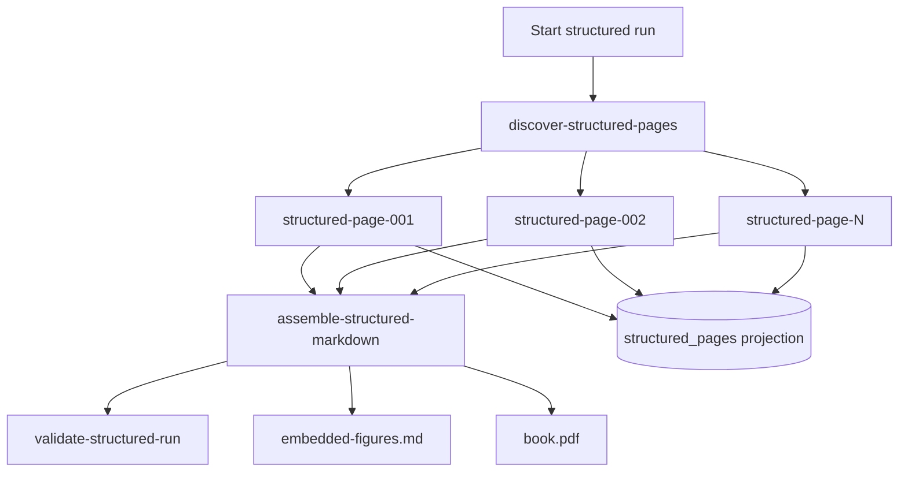

# Book OCR Project Report

This report documents the Book OCR project as it stands after the structured workflow and PDF repair work. It covers the full arc of the project: the generic workflow runtime in `scraper`, the extraction of OCR into the separate `book-ocr` application, the high-quality OCR experiments for Report 794, the diagnosis of neighboring-page context bleed, the structured target-page-only pipeline, workflow-backed execution, figure extraction, PDF rendering, targeted page repair, and the manual validation loop we worked through today.

The project is not only an OCR pipeline. It is an engineering exercise in turning model calls into durable, inspectable, recoverable production work. The important result is a system where every page has raw model evidence, structured JSON, rendered Markdown, validation metadata, persisted Geppetto turns, workflow state, projection state, and final review artifacts. The current review artifact is a full-book PDF generated from structured OCR Markdown:

```text
/tmp/book-ocr-structured-workflow-full-live-w4-figures/book.pdf
```

The current full-book Markdown source for that PDF is:

```text
/tmp/book-ocr-structured-workflow-full-live-w4-figures/embedded-figures.md
```

> [!summary]
> - The project began as a validation workload for a durable workflow runtime and became a complete OCR application for a 202-page scanned technical report.
> - The main architectural correction was the move from freeform Markdown OCR with neighboring page image context to target-page-only structured JSON plus deterministic Markdown rendering.
> - The workflow-backed pipeline now discovers pages, runs page OCR in parallel, retries transient provider failures, assembles Markdown, validates the run, extracts/embeds figures, renders a PDF, and supports targeted reruns of selected pages.
> - Today’s work focused on manual PDF repair: adding workflow PDF rendering, adding a targeted rerun operator, preventing table-like figures from being duplicated as image crops, rendering Common Lisp listings as fenced `common-lisp` code blocks, and reprocessing only the affected pages.

## 1. The problem the project solves

A scanned technical book is a difficult OCR target because its pages contain multiple kinds of information. Report 794, *Presentation Based User Interfaces*, includes ordinary prose, front matter, tables of contents, figure lists, diagrams, spreadsheet-like examples, interface screenshots, Common Lisp and Lisp Machine Lisp code listings, captions, page footers, and section headings. A useful OCR output must preserve the prose, but it must also preserve the structure of the technical material. A spreadsheet figure should become a readable table when its cells are legible. A Lisp definition should become a code block, not a paragraph. A diagram should remain a figure when its visual structure carries meaning. A caption should identify the correct page-local figure and should not be copied from an adjacent page.

The initial OCR problem was therefore not simply “convert images to text.” It was to build a system that can produce a reviewable book artifact with enough provenance to understand and repair errors. The project had to answer operational questions and document-quality questions at the same time:

| Question | Why it matters |
|---|---|
| Did every page run? | A final book artifact is incomplete if any page was skipped. |
| Did each model call see only the intended target page? | Page-boundary correctness is required for reliable figure and caption extraction. |
| Can transient provider failures be retried? | Long OCR runs must survive TLS errors, rate limits, and provider interruptions. |
| Can a human inspect raw responses? | Structured parsing failures and model drift must be debuggable. |
| Can selected pages be repaired without rerunning the whole book? | Manual review usually finds localized defects after an expensive full run. |
| Can final output be rendered to PDF from the same workflow? | PDF review is the practical validation surface for a scanned book. |

This combination shaped the architecture. OCR became a workflow application rather than a single script. The workflow runtime records steps, leases, retries, artifacts, and projections. The OCR application records page artifacts and model turns. The renderer turns structured OCR into deterministic Markdown. The validator checks aggregate properties such as page count, adjacent duplicate captions, and short pages. The PDF render step gives a human reviewer the actual object they need to inspect.

## 2. Repository layout and boundary decisions

The workspace has two main repositories:

```text
/home/manuel/workspaces/2026-05-20/book-ocr/scraper
/home/manuel/workspaces/2026-05-20/book-ocr/2026-05-20--book-ocr
```

The `scraper` repository owns the generic workflow runtime. It should know nothing about OCR. Its relevant package is:

```text
/home/manuel/workspaces/2026-05-20/book-ocr/scraper/pkg/workflow
```

The `2026-05-20--book-ocr` repository owns the OCR application. Its module path is:

```text
github.com/go-go-golems/book-ocr
```

It imports the workflow runtime through a local replace:

```text
github.com/go-go-golems/scraper => ../scraper
```

This separation was an important project decision. Earlier OCR prototypes lived in `scraper` because the workflow runtime needed a realistic application to validate it. Once the runtime abstractions became stable enough, OCR was extracted into its own application repository. The boundary is now:

```text
scraper/pkg/workflow
  durable execution, steps, queues, leases, retries, artifacts, projections, operator controls

book-ocr/internal/*
  OCR discovery, prompts, Geppetto client, structured OCR, validation, figure extraction, PDF rendering
```

This boundary keeps the runtime reusable. If the OCR application needs a runtime capability, the right fix is to expose a stable workflow API in `scraper/pkg/workflow`, not to move OCR logic back into `scraper`.

The main `book-ocr` implementation directories are:

```text
internal/ocrmvp          # original freeform OCR workflow application
internal/ocrquality      # normalization, QA, figure extraction, sidecars, reports
internal/bookprofile     # book profile/discovery/patch support
internal/ocrpipeline     # structured OCR contracts, client, renderer, workflow package
internal/ocrvalidation   # deterministic validation helpers
internal/vlmseparation   # diagnostic VLM separation benchmark
cmd/book-ocr             # CLI surface
```

The current work is concentrated in `internal/ocrpipeline` and `cmd/book-ocr`, but the project still relies on `internal/ocrquality` for figure crop extraction and Markdown image embedding.

## 3. Why a workflow runtime was necessary

A full-book OCR run is long-running, expensive, and failure-prone. A direct command loop can call the model for each page, but it has poor operational properties. If page 84 fails after 83 successful calls, the direct loop must either restart or implement its own resume logic. If a provider returns a transient TLS error, the direct loop must implement retry policy. If a page later needs repair, the direct loop has no durable graph explaining which downstream outputs depend on that page.

The workflow runtime solves this class of problem by making work explicit. A run contains ops. Ops have kinds, queues, inputs, dependencies, retry policy, status, results, emitted child ops, and artifacts. Workers lease ops from queues. Each completed op stores structured result JSON. Operators can inspect status, retry failed steps, cancel runs, or resume workers.

The OCR workload validated several runtime features:

- Page OCR needs a dedicated vision queue because page calls are the parallel unit.
- Assembly and validation should run only after all page steps succeed.
- Artifacts must be stored with content type and kind so that raw Markdown, structured JSON, validation JSON, figure images, sidecars, debug overlays, and PDFs can be distinguished.
- Projection state is needed because generic workflow state is not enough for page-level operator questions.
- Retry and targeted reprocessing must be durable because provider failures and manual review defects are normal events, not exceptional design failures.

The current structured workflow graph is simple enough to understand and rich enough to be operationally useful:



The graph defines the dependency order. The projection defines the OCR-specific read model. The artifacts define what a reviewer and future debugging session can inspect.

## 4. The first freeform OCR path and its limitation

The first OCR implementation was freeform. It asked a vision model to produce Markdown directly from page images. This was valuable because it quickly proved the end-to-end shape:

```text
page discovery -> model OCR -> per-page Markdown -> assembly -> quality pass -> figure extraction
```

The freeform pipeline produced useful early artifacts. It supported prompt versions, model profile selection, page discovery, quality normalization, figure marker extraction, sidecar metadata, debug overlays, and final embedded Markdown. The key prompt iterations included:

```text
ocr-quality-v2
ocr-quality-v3-list-diplomatic
ocr-quality-v4-report794-lexicon
ocr-quality-v5-figure-aware
```

The freeform path also produced the first full-book run. That run completed 202 pages and generated:

```text
/home/manuel/workspaces/2026-05-20/book-ocr/2026-05-20--book-ocr/ttmp/2026/05/25/BOOK-OCR-FULL-001--convert-full-presentation-based-user-interfaces-book/experiments/001-full-book-v5-mini/outputs/quality-pass/03-embedded-figures.md
```

Operationally, that was a success. Textually, it exposed the most important failure of the project. The freeform run used `--context-window 1`, and neighboring context meant neighboring page PNG images. The model was instructed to treat the first image as the target page and neighboring images as context only. It still copied adjacent visual content into the target page output.

A concrete example was pages 12 and 13. Page 12 is prose referencing Figure 1-1. Page 13 contains the actual Figure 1-1 diagram. The freeform full-book output produced a false page 12 figure crop. Similar adjacent duplicate captions appeared throughout the book. This was not a simple formatting issue. It violated page provenance.

The lesson was direct:

```text
Primary production OCR must see exactly one target page image.
```

Neighboring image context can be used in diagnostic benchmarks, but it must not write final page Markdown. Production OCR needs target-page-only vision, structured output, deterministic rendering, and validation that catches adjacent duplicate figure captions.

## 5. The VLM separation benchmark

Before abandoning all multi-image context experiments, the project introduced a diagnostic VLM separation benchmark. The benchmark tested whether prompt and block layout could reliably separate a target page image from neighboring context images. It used saved Geppetto/Pinocchio turns for replay and stored analytics separately from the production OCR pipeline.

The benchmark package is:

```text
internal/vlmseparation
```

It added commands such as:

```bash
book-ocr vlm-separation benchmark
book-ocr vlm-separation rescore
book-ocr vlm-separation report
```

The broad risky-page benchmark eventually showed no forbidden-caption bleed under the tested scenarios and oracles, but that result did not change production policy. A benchmark can show that a model behaved correctly on a selected set of cases. It does not make neighboring image context safe as the primary production transcription path. The benchmark became a diagnostic tool. The production pipeline stayed target-page-only.

This distinction is one of the central engineering rules of the project:

```text
Diagnostic VLM calls may test context separation.
Production OCR calls must not use neighboring page PNGs to produce final Markdown.
```

## 6. Structured OCR as the production boundary

The structured pipeline was designed to move model output to a safer boundary. Instead of asking the model to write final Markdown, the model returns JSON. Go code parses, repairs limited schema drift, validates, and renders Markdown deterministically.

The core contract is `StructuredPageOCR` in:

```text
internal/ocrpipeline/types.go
```

Conceptually, the model returns:

```go
type StructuredPageOCR struct {
    SchemaVersion string
    BookID        string
    PageNumber    int
    PageType      PageType
    Blocks        []OCRBlock
    Warnings      []Warning
}

type OCRBlock struct {
    ID          string
    Type        BlockType
    Text        string
    Level       int
    Items       []ListItem
    Table       *TableBlock
    Caption     string
    Description string
    DiagramText []string
    Confidence  string
    Warnings    []Warning
}
```

The block types currently include:

```text
heading
paragraph
list
table
code
figure
footnote
page_footer
blank
```

This schema gives the renderer enough information to make stable decisions. Tables are not left as model-written Markdown. A table block contains headers and rows. Code blocks are not ordinary paragraphs. A code block is rendered as a fenced `common-lisp` block. Figure blocks can carry captions, descriptions, and optional diagram text. Page footers can be tracked but suppressed in final rendering by default.

The model boundary is now:

```text
page PNG -> StructuredPageOCR JSON
```

The renderer boundary is:

```text
StructuredPageOCR -> deterministic Markdown
```

This separation is the reason today’s repairs were possible. We could change prompt rules, rerun selected pages, adjust renderer behavior for table-like figures, and regenerate the PDF without changing the entire system.

## 7. Target-page-only Geppetto calls and turn persistence

The live structured OCR client uses Geppetto directly, not a shell call to Pinocchio. It resolves profiles through Pinocchio’s profile bootstrap package, builds a turn, calls `RunInference`, and stores the exact input and final turns.

The relevant files are:

```text
internal/ocrpipeline/client.go
internal/ocrpipeline/session.go
internal/ocrpipeline/structured_ocr.go
```

The input turn construction enforces one image:

```go
turn := &turns.Turn{ID: PageTurnID(input.PageNumber, 1, "structured-ocr")}
turns.AppendBlock(turn, turns.NewSystemTextBlock(StructuredOCRSystemPrompt))
images := []map[string]any{{
    "media_type": mediaTypeFromImagePath(input.ImagePath),
    "content":    append([]byte(nil), imageBytes...),
    "detail":     "high",
    "role":       "target",
    "page":       input.PageNumber,
}}
turns.AppendBlock(turn, turns.NewUserMultimodalBlock(RenderStructuredOCRPrompt(input), images))
```

The page runner then asserts:

```go
if CountTurnImages(result.InputTurn) != 1 {
    return error
}
```

Turn persistence uses Pinocchio’s `chatstore.SQLiteTurnStore`. The identifier scheme is:

```text
convID    = book-ocr:<book-id>:<run-id>
sessionID = page:<NNN>
turnID    = page:<NNN>:01-structured-ocr
phase     = input or final
```

This matters because it gives a future reviewer a durable record of what the model saw and what it returned. The per-page files are human-friendly artifacts. The turn store is a structured replay/debug store.

A successful page writes:

```text
pages/page_NNN/01-turn-input.yaml
pages/page_NNN/02-turn-final.yaml
pages/page_NNN/03-raw-response.json
pages/page_NNN/04-structured.json
pages/page_NNN/05-rendered.md
pages/page_NNN/06-validation.json
```

If parsing fails, the raw response is still written before the error is returned. That ordering is critical. A failed parse is still useful evidence.

## 8. Parser repair and schema drift

Live structured OCR responses drift. The parser had to accept recurring variants without losing provenance or inventing content. The repairs are intentionally limited. They make known structural variants parseable, but they do not manufacture new OCR text.

Observed variants included:

- `page_number` as a string such as `"032"`.
- invalid leading-zero numbers such as `032`.
- `diagram_text` as a string rather than an array.
- list items as strings rather than objects.
- figure metadata nested under a `figure` object.
- figure captions emitted as heading blocks immediately before figure blocks.

The repair policy is:

```text
Preserve raw response.
Accept common shape drift.
Repair structure when the needed text is already present.
Do not silently invent content.
```

This policy became important today as well. Some pages were already recognized structurally as code blocks after rerun. Other pages had been recognized as figure blocks before the prompt was tightened. The repair path could not fix those semantically wrong classifications by itself. They needed reruns with better prompt instructions and, in some cases, renderer/post-processing changes.

## 9. Deterministic Markdown rendering

The renderer is in:

```text
internal/ocrpipeline/renderer.go
```

It is the production write boundary for final Markdown. It emits a source page marker, then renders each block type according to deterministic rules.

The page marker is:

```markdown
<!-- page:032 -->
```

This marker is used by assembly, validation, and human debugging. The marker is currently an HTML comment, so it does not appear visibly in the PDF. Manual review showed that this can be confusing because Okular’s physical PDF page number does not match the source page number. A future review option should render visible source page headings.

Table rendering is deterministic:

```markdown
|  | A | B | C |
| --- | --- | --- | --- |
| 1 | 100 | 20 | A1*B1 |
| 2 | 75 | 5 | A2*B2 |
| 3 |  |  | C1+C2 |
```

Code rendering now uses Common Lisp fences:

```markdown
```common-lisp
(def-template-presentation-style HOST-INFO HOST nil
  ("Host "
   (:name nil)
   "  Time: "
   (:current-time digital-clock-no-border)
   ";  "
   (:load-averages host-info-load-averages)
   ";  "
   (:number-of-jobs nil)
   " jobs.")
 :horizontal-layout :border-box)
```
```

Figure rendering has become more nuanced. A figure block may be rendered as a caption plus image marker, but not every figure block should result in an image in the PDF. If a figure is primarily a spreadsheet/table and the next block is the table transcription, the renderer suppresses the image marker. If a figure is primarily textual code or a simple boxed text presentation, the renderer can suppress the image and emit a textual fallback.

This renderer behavior is not a replacement for better model output. It is a final protection against duplicating content as images when the structured content is already available.

## 10. Figure extraction and why today found a post-processing bug

Figure extraction originally came from the freeform quality pipeline. It looked for markers such as:

```markdown
[FIGURE: Diagram showing ...]
```

It then cropped the corresponding source page PNG, wrote figure files, sidecars, and debug overlays, and replaced the marker with a Markdown image link:

```markdown

```

The structured workflow reused this existing path. The structured renderer emits figure markers for figure blocks. The assemble step optionally calls `ocrquality.EmbedExtractedFigures` and writes:

```text
embedded-figures.md
figures/page_NNN_figure_MM.png
figures/page_NNN_figure_MM.json
figures/page_NNN_figure_MM.debug.png
```

Today’s manual review showed that this reuse had a second-order failure. Some spreadsheet-like figures had already been recognized as tables. The per-page `05-rendered.md` contained a table. But the quality figure embedding pass saw captions and synthesized missing figure markers, producing image links anyway. The final PDF showed large images for Figures 2-12 and 2-13 even though the tables were already present.

The fix was two-part:

1. The structured renderer suppresses image markers when a table-like figure is followed by a table block.
2. `ocrquality.synthesizeMissingFigureMarkers` now refuses to synthesize figure markers on pages that already contain Markdown tables.

The second fix was the decisive one for the PDF. It shows why artifact inspection at each stage matters. The page JSON was reasonable. The page rendered Markdown was reasonable. The final embedded Markdown was wrong because a later post-processing heuristic was too aggressive.

The repaired page 48 now renders the spreadsheet content as tables:

```markdown
Figure 2-12: PPSCalc -- Formula Moved

|  | A | B | C |
| --- | --- | --- | --- |
| 1 | 100 | 20 | A1*B1 |
| 2 | 75 | 5 | A2*B2 |
| 3 | C1+C2 |  |  |
```

The validation command used after the fix was:

```bash
rg '^!\[.*(Spreadsheet|spreadsheet|columns A B C|PPSCalc)' \
  /tmp/book-ocr-structured-workflow-full-live-w4-figures/embedded-figures.md
```

It returned no matches after the table-figure fixes.

## 11. Workflow-backed structured OCR

The structured workflow package lives in:

```text
internal/ocrpipeline/workflow_types.go
internal/ocrpipeline/workflow_package.go
internal/ocrpipeline/workflow_projection.go
internal/ocrpipeline/workflow_executors.go
```

The workflow package defines step kinds and queues:

```go
const (
    StructuredPackageName     = "book-ocr/structured"
    StructuredProjectionName  = "book_ocr_structured"
    KindStructuredDiscover    = "book-ocr/structured/discover-pages"
    KindStructuredPage        = "book-ocr/structured/ocr-page"
    KindStructuredAssemble    = "book-ocr/structured/assemble-markdown"
    KindStructuredValidate    = "book-ocr/structured/validate-run"
    QueueStructuredControl    = "structured-control"
    QueueStructuredVision     = "structured-vision"
    QueueStructuredAssemble   = "structured-assemble"
    QueueStructuredValidation = "structured-validation"
)
```

The discover step expands a run into one page step per page. Each page step calls `RunStructuredPage`. Assembly reads page result paths and concatenates rendered Markdown in page order. Validation reads the assembled Markdown and projection state.

The full-book run uses:

```bash
book-ocr structured-run \
  --book-id report-794-structured-workflow-full-live-w4-figures \
  --image-dir /home/manuel/code/wesen/claw-stuff/output/books/presentation-based-uis/pages \
  --start-page 1 \
  --end-page 202 \
  --work-dir /tmp/book-ocr-structured-workflow-full-live-w4-figures \
  --profile gpt-5-mini-low \
  --profile-registries /tmp/book-ocr-hq-001/profiles-clean.yaml \
  --dry-run=false \
  --expected-pages 202 \
  --max-workers 4 \
  --embed-figures \
  --render-pdf \
  --min-rendered-bytes 200 \
  --log-level warn
```

The current full-book run ID is:

```text
book-ocr/structured-499f1718-bfb6-4135-a52f-56d35001d0bd
```

The workflow produced a complete 202-page run. It also encountered provider/TLS problems during the first attempt. The workflow allowed failed page steps to be retried and the run to continue. This is exactly the class of operational behavior the runtime was meant to support.

## 12. Projection state and page status

The workflow engine records generic op state. Operators also need OCR-specific state. The structured projection database is:

```text
/tmp/book-ocr-structured-workflow-full-live-w4-figures/projections/book_ocr_structured.db
```

The `structured_pages` projection records:

- book id,
- page number,
- image path,
- status,
- step id,
- page artifact paths,
- warning count,
- table count,
- figure count,
- rendered byte count,
- error code and message.

The command:

```bash
book-ocr structured-pages \
  --work-dir /tmp/book-ocr-structured-workflow-full-live-w4-figures \
  --book-id report-794-structured-workflow-full-live-w4-figures \
  --limit 20
```

answers OCR-domain questions that generic workflow status cannot answer. For example, a workflow can say “the run succeeded.” The projection can say “page 132 succeeded, has one code block, has zero figures, and rendered to N bytes.”

This separation is useful. Runtime state answers whether work completed. Projection state answers what the work means in the OCR domain.

## 13. Validation gates

Validation began with basic checks and has become more useful over time. The current structured validation includes:

- expected page count,
- adjacent duplicate figure captions,
- per-page warnings such as missing figure captions,
- short-page warnings through `--min-rendered-bytes`,
- empty code/list/table warnings.

The current validation report is:

```text
/tmp/book-ocr-structured-workflow-full-live-w4-figures/validation-report.json
```

Earlier full-book validation showed:

```json
{
  "page_count": 202,
  "expected_pages": 202,
  "warning_count": 21,
  "short_pages": 21,
  "adjacent_duplicate_captions": 0
}
```

The short-page warnings are not failures. They are review signals. A page can be short because it is a blank page, a diagram page, a chapter title page, or a real OCR miss. The next validation improvement should be page-type-aware completeness checking.

The work today points to another validation need: code-fence audits. We should scan the final Markdown for Lisp-looking definitions outside fenced code blocks. A simple first pass can search outside fences for lines matching:

```text
^\s*\(def
^\s*\(defmethod
^\s*\(defvar
:[A-Z0-9-]+
\(send .+\)
```

A useful report would list source page markers and line numbers where code-like content appears in prose. That would reduce reliance on manual discovery.

## 14. Workflow PDF rendering

Before today, PDF rendering was an ad hoc `pandoc` command. The command worked, but it was outside the workflow. Today, PDF rendering became part of structured assembly.

The new `structured-run` flags are:

```text
--render-pdf
--pdf-path
--pandoc-path
```

The assemble step now uses the assembled Markdown or embedded-figures Markdown as the PDF source. If figure embedding is enabled, the PDF is rendered from `embedded-figures.md`. The output defaults to:

```text
<work-dir>/book.pdf
```

The implementation invokes `pandoc` with `xelatex`:

```go
cmd := exec.CommandContext(ctx, pandocPath,
    markdownPath,
    "--from", "markdown+raw_html",
    "--pdf-engine=xelatex",
    "-V", "geometry:margin=0.8in",
    "-V", "mainfont=DejaVu Serif",
    "-V", "monofont=DejaVu Sans Mono",
    "-o", pdfPath,
)
```

The PDF is stored as a workflow artifact with kind:

```text
structured-rendered-pdf
```

This change matters because the PDF is not an incidental byproduct. It is the main manual validation surface. The workflow should produce it from the same state that produced the final Markdown, and it should be reproducible when targeted pages are rerun.

## 15. Targeted page reruns

Manual review rarely finds an error that requires rerunning the whole book. Today’s review found localized problems: specific pages where table-like figures were still images, and specific pages where Common Lisp code was not fenced. Rerunning all 202 pages would waste provider calls and risk introducing new model variability.

The new command is:

```bash
book-ocr structured-rerun-pages \
  --work-dir DIR \
  --run-id RUN_ID \
  --pages 20,30,31 \
  --render-pdf \
  --max-workers 2
```

The operator works by requeueing selected page ops and downstream ops in the existing workflow database. The first version had a subtle bug: it marked downstream assemble and validate ops `ready` at the same time as the page ops. That allowed assembly to run before rerun pages finished, producing stale final Markdown. Today this was fixed by marking downstream ops `pending`. The scheduler releases them once their dependencies are succeeded.

The corrected state transition is:

```text
selected structured-page-NNN ops -> ready
downstream assemble/validate ops -> pending
workflow -> running
```

This is the right dependency behavior. It also shows that targeted reprocessing should eventually become a first-class workflow runtime operator rather than direct CLI SQL. The current CLI implementation is useful and practical. The future runtime API should expose a supported reset/reprocess operation.

## 16. Today’s manual PDF repair loop

Today’s work was a concrete example of model-output engineering plus workflow repair. The review loop was:

1. Render the current full-book Markdown to PDF.
2. Open the PDF in Okular.
3. User identifies pages/snippets that are visually wrong.
4. Map the PDF evidence back to source page markers and page artifact directories.
5. Inspect `04-structured.json`, `05-rendered.md`, `embedded-figures.md`, and `pdftotext` output.
6. Decide whether the issue is prompt, renderer, figure embedding, PDF conversion, or workflow stale assembly.
7. Make the smallest code/prompt/workflow fix that addresses the class of error.
8. Rerun only affected pages or reassemble only when possible.
9. Regenerate PDF and reopen it.
10. Record the step in the diary.

This loop identified several distinct failure classes.

### 16.1 Spreadsheet figures duplicated as images

The user reported that figures on PDF pages 30 and 31 were still images, even though they should be tables. Initial inspection of source pages 20, 30, and 31 suggested those source pages were fine. The mismatch came from PDF physical page numbers not matching source page markers. The problematic pages corresponded to source page 48 and similar spreadsheet figure pages.

The structured JSON already had table blocks. The final embedded Markdown still had image links because the figure embedding pass synthesized markers from captions. The fixes were:

```text
8825cd2 Suppress duplicate images for table figures
ff48bd4 Avoid synthesizing figures for rendered tables
```

The final validation check ensured that PPSCalc spreadsheet image refs were gone:

```bash
rg '^!\[.*(Spreadsheet|spreadsheet|columns A B C|PPSCalc)' embedded-figures.md
```

### 16.2 Code listings kept as figures

The user supplied screenshots showing code listings on source pages around 120, 121, 123, and 138. These should be Common Lisp code blocks, not figure images. The structured prompt was tightened to state that the book’s code is Common Lisp / Lisp Machine Lisp and that code listings should preserve parentheses, keywords, quotes, comments, line breaks, and indentation.

The renderer was changed from `text` fences to `common-lisp` fences:

```text
c74f34e Render structured code as Common Lisp
```

The affected pages were rerun:

```text
120, 121, 123, 138, 174, 176, 178, 180
```

This repaired major examples such as:

```text
def-graphics-presentation-style CLOCK
def-sequence-presentation-style SET-NOTATION
def-template-presentation-style USER-AT-HOST
def-move-recognition-rule move-document-to-printer
defmethod (TEXT-PRESENTATION ...)
def-graphics-presentation-style DOCUMENT-ICON
def-template-presentation-style HOST-INFO
```

### 16.3 More Lisp definitions rendered as prose

The user later pasted additional examples from Open/Close Mechanism, phrasal presenter dictionary entries, move recognition, and command sets. These were mapped to source pages:

```text
132, 140, 179, 181, 182
```

Those pages were rerun. The resulting Markdown now contains `common-lisp` fences for the cited definitions:

```bash
rg '```common-lisp|def-open-close-presentation-style|PHRASAL-PRESENTER-DICTIONARY|RECOGNIZE-MAIL-FILE|FILE-COMMAND-SET|SHORT-FILE-COMMAND-SET' \
  /tmp/book-ocr-structured-workflow-full-live-w4-figures/embedded-figures.md
```

### 16.4 Workflow race in targeted rerun

The manual repair loop exposed a workflow bug. The first targeted rerun operator could requeue page ops and downstream ops at the same time. Assembly sometimes ran before the new page artifacts were written, so the final Markdown remained stale even though per-page artifacts were correct. The fix was to set downstream ops to `pending` and allow dependency resolution to release them only after selected page steps succeeded.

This is a valuable operational lesson. Targeted repair is not just a matter of changing status flags. It must preserve dependency semantics.

## 17. Current artifact state

The current review directory is:

```text
/tmp/book-ocr-structured-workflow-full-live-w4-figures
```

Important files:

```text
/tmp/book-ocr-structured-workflow-full-live-w4-figures/assembled.md
/tmp/book-ocr-structured-workflow-full-live-w4-figures/embedded-figures.md
/tmp/book-ocr-structured-workflow-full-live-w4-figures/book.pdf
/tmp/book-ocr-structured-workflow-full-live-w4-figures/validation-report.json
/tmp/book-ocr-structured-workflow-full-live-w4-figures/engine.db
/tmp/book-ocr-structured-workflow-full-live-w4-figures/turns.db
/tmp/book-ocr-structured-workflow-full-live-w4-figures/projections/book_ocr_structured.db
```

The PDF was regenerated and opened in Okular after the latest code-focused rerun. Its current size is approximately:

```text
11M
```

The current code history around today’s work is:

```text
3b6b777 Docs: record additional Lisp listing rerun
1d6dcd2 Docs: record Common Lisp code PDF fix
c74f34e Render structured code as Common Lisp
a1f2758 Suppress images for textual code figures
6856369 Docs: record table figure PDF fix
ff48bd4 Avoid synthesizing figures for rendered tables
8825cd2 Suppress duplicate images for table figures
7f9a55b Add structured targeted rerun operator
f493cde Docs: record targeted rerun and PDF workflow
52eba49 Render structured OCR PDF in workflow
c38acd7 Docs: record structured figure classification fix
a576e96 Tighten structured OCR text figure classification
f03d9ba Docs: record structured figure embedding
600dbc7 Embed figures in structured OCR assembly
```

The diary for this work is:

```text
/home/manuel/workspaces/2026-05-20/book-ocr/2026-05-20--book-ocr/ttmp/2026/05/25/BOOK-OCR-STRUCTURED-WORKFLOW-001--promote-structured-ocr-to-workflow-runtime/reference/01-diary.md
```

## 18. How to inspect the current run

The first inspection command is workflow status:

```bash
book-ocr status \
  --work-dir /tmp/book-ocr-structured-workflow-full-live-w4-figures \
  --run-id book-ocr/structured-499f1718-bfb6-4135-a52f-56d35001d0bd
```

Page projection status:

```bash
book-ocr structured-pages \
  --work-dir /tmp/book-ocr-structured-workflow-full-live-w4-figures \
  --book-id report-794-structured-workflow-full-live-w4-figures \
  --limit 20
```

Search for remaining code-like prose:

```bash
rg '^\s*\(def|defmethod|defvar|def-template|def-graphics|def-open-close|def-move' \
  /tmp/book-ocr-structured-workflow-full-live-w4-figures/embedded-figures.md
```

Search for code-like image captions that should probably not remain images:

```bash
rg '^!\[.*(Code|code|Lisp|definition|presentation style|recognition|def)' \
  /tmp/book-ocr-structured-workflow-full-live-w4-figures/embedded-figures.md
```

Search for table-like image captions that should probably be rendered as tables:

```bash
rg '^!\[.*(Spreadsheet|spreadsheet|columns A B C|PPSCalc|table|grid)' \
  /tmp/book-ocr-structured-workflow-full-live-w4-figures/embedded-figures.md
```

Map a source page to its artifacts:

```text
/tmp/book-ocr-structured-workflow-full-live-w4-figures/pages/page_NNN/03-raw-response.json
/tmp/book-ocr-structured-workflow-full-live-w4-figures/pages/page_NNN/04-structured.json
/tmp/book-ocr-structured-workflow-full-live-w4-figures/pages/page_NNN/05-rendered.md
/tmp/book-ocr-structured-workflow-full-live-w4-figures/pages/page_NNN/06-validation.json
```

The important review discipline is to inspect the right stage. If a page is wrong in `04-structured.json`, the model/prompt/page call needs repair. If it is right in `04-structured.json` but wrong in `05-rendered.md`, the renderer needs repair. If it is right in `05-rendered.md` but wrong in `embedded-figures.md`, the figure embedding pass needs repair. If it is right in Markdown but wrong in PDF, the Pandoc/LaTeX rendering path needs repair.

## 19. Pseudocode for the current repair operator

The targeted rerun command is intentionally narrow. It resets selected page ops and downstream ops inside one existing workflow. It does not add new pages to a run. It does not rewrite the original graph. It reprocesses already-known page steps.

The intended behavior is:

```text
input: run id, work dir, pages, render pdf flag
open engine.db
mark workflow running
for each selected page:
    delete any stale lease
    set structured-page-NNN status = ready
    reset retry state
set assemble-structured-markdown status = pending
set validate-structured-run status = pending
optionally patch assemble input to render_pdf = true
resume workers
```

The dependency-sensitive part is the downstream state:

```text
page ops -> ready
assemble/validate -> pending
```

If downstream ops were set to `ready`, assembly could run before rerun pages complete. That bug was observed and fixed today. The corrected design preserves dependency semantics.

A future workflow runtime API should expose this as a supported operator:

```go
type ResetStepInput struct {
    WorkflowID model.WorkflowID
    OpIDs      []model.OpID
    Downstream []model.OpID
    Mode       ResetMode // retry failed, reprocess succeeded, reset downstream
}
```

The runtime should own the state transition invariants rather than leaving direct SQL in an application command.

## 20. Current open problems

The project is now strong enough to support efficient manual repair, but several open problems remain.

### 20.1 Code-fence audit

Manual review keeps finding code-like content outside code blocks. The next improvement should be an audit that reports source pages where Lisp-looking lines appear outside fenced code blocks. The audit should ignore inline code references in prose, but it should flag multi-line definitions and block-like snippets.

A first version can be heuristic:

```text
Track whether the current line is inside a fenced code block.
If outside a fence and a line starts with '(' followed by def/defmethod/defvar/defun/def-command, flag it.
If outside a fence and several nearby lines contain :KEYWORD or balanced Lisp lists, flag the region.
Report source page marker and line number.
```

The report can feed targeted reruns.

### 20.2 Visible source page markers in PDF

PDF physical page numbers do not match source page markers. This caused confusion today. The source markers exist in Markdown as HTML comments, but they are invisible in the PDF. A review-oriented PDF mode should render visible source page markers, perhaps as small gray headings:

```markdown
<div class="source-page-marker">Source page 048</div>
```

The production Markdown can keep comments. The review PDF can include visible markers.

### 20.3 Page-type-aware completeness validation

Short pages are currently flagged with a byte threshold. This is useful but coarse. The validation should consider page type. A blank page, title page, diagram page, and dense prose page have different expected lengths.

A better report would include:

```text
page number
page type
rendered bytes
block counts by type
figure count
table count
code count
warning codes
whether page is below threshold for its type
```

### 20.4 Figure/text classification audit

The table and code repairs show that figure extraction needs guardrails. A validation pass should flag image links whose alt text contains words such as `spreadsheet`, `table`, `code`, `definition`, or `listing`. Some of those images may be valid screenshots, but they are review suspects.

### 20.5 OCR fidelity for Common Lisp

The current code blocks are much better visually and structurally, but OCR fidelity still needs review. Common Lisp is sensitive to:

- parentheses,
- quote characters,
- package prefixes,
- keyword colons,
- `*earmuff*` variable names,
- `#'` function quote syntax,
- line breaks in long forms.

Manual review should focus on those characters. A future validation pass could run a loose Lisp tokenizer to detect obvious balance errors.

## 21. Engineering lessons from the project

The project produced several stable engineering rules.

### Rule 1: final OCR should be target-page-only

A model may understand instructions about target and context images, but production OCR should not rely on that behavior for final text. Page provenance is a hard requirement. The structured primary call sees exactly one target page image.

### Rule 2: model output should stop at a structured boundary

Markdown is too broad as a model output contract. It mixes recognition, interpretation, layout, and rendering. A structured JSON boundary lets Go own deterministic rendering and validation.

### Rule 3: preserve raw evidence before parsing

A parser failure should not destroy the model response. Raw responses, input turns, final turns, structured JSON, rendered Markdown, and validation JSON should be separate artifacts.

### Rule 4: workflow state and domain projection state are different

The workflow engine knows whether an op succeeded. OCR operators need to know which page, how many figures, how many tables, how many warnings, and where the rendered Markdown is. That belongs in a projection.

### Rule 5: final review happens in the artifact humans inspect

A Markdown artifact can look correct while the PDF is wrong because of figure embedding or Pandoc behavior. The workflow should render the PDF so manual validation uses an artifact produced from the same state.

### Rule 6: targeted repair is essential

Manual review finds local defects. The system must support reprocessing selected pages and rebuilding downstream artifacts without rerunning the whole book.

### Rule 7: validation should encode every repeated manual finding

If the reviewer finds the same class of defect twice, it should become a validation report item. Spreadsheet images, code-like prose, empty code blocks, and short pages are all examples.

## 22. The current command set

The most important commands are:

```bash
# One page, useful for prompt/debug iteration.
book-ocr structured-page \
  --book-id report-794 \
  --page 132 \
  --image /home/manuel/code/wesen/claw-stuff/output/books/presentation-based-uis/pages/page_132.png \
  --work-dir /tmp/page-132 \
  --profile gpt-5-mini-low \
  --profile-registries /tmp/book-ocr-hq-001/profiles-clean.yaml \
  --dry-run=false

# Full structured workflow run.
book-ocr structured-run \
  --book-id report-794-structured-workflow-full-live-w4-figures \
  --image-dir /home/manuel/code/wesen/claw-stuff/output/books/presentation-based-uis/pages \
  --start-page 1 \
  --end-page 202 \
  --work-dir /tmp/book-ocr-structured-workflow-full-live-w4-figures \
  --profile gpt-5-mini-low \
  --profile-registries /tmp/book-ocr-hq-001/profiles-clean.yaml \
  --expected-pages 202 \
  --embed-figures \
  --render-pdf \
  --min-rendered-bytes 200

# Targeted repair of selected source pages.
book-ocr structured-rerun-pages \
  --work-dir /tmp/book-ocr-structured-workflow-full-live-w4-figures \
  --run-id book-ocr/structured-499f1718-bfb6-4135-a52f-56d35001d0bd \
  --pages 132,140,179,181,182 \
  --render-pdf \
  --max-workers 2

# OCR-domain page status.
book-ocr structured-pages \
  --work-dir /tmp/book-ocr-structured-workflow-full-live-w4-figures \
  --book-id report-794-structured-workflow-full-live-w4-figures
```

The command surface now supports the core development loop: run, inspect, rerun selected pages, reassemble, render PDF, inspect again.

## 23. What should happen next

The next work should reduce the amount of manual discovery required. The system has enough artifacts to support automated audits. The next useful additions are:

1. A Lisp-outside-code audit that reports source pages and line numbers.
2. A table/code image audit that reports suspicious image links by alt text.
3. A visible-source-page review PDF mode.
4. A runtime-level reset/reprocess operator to replace CLI-local SQL in `structured-rerun-pages`.
5. A page-type-aware completeness report.
6. A small Common Lisp token/balance sanity check for fenced code blocks.

The project has reached the stage where the architecture is sound and most remaining defects are local quality issues. That is the right stage for audit tooling. The system should turn every repeated manual observation into a deterministic report.

## Related implementation files

```text
/home/manuel/workspaces/2026-05-20/book-ocr/2026-05-20--book-ocr/cmd/book-ocr/main.go
/home/manuel/workspaces/2026-05-20/book-ocr/2026-05-20--book-ocr/internal/ocrpipeline/types.go
/home/manuel/workspaces/2026-05-20/book-ocr/2026-05-20--book-ocr/internal/ocrpipeline/prompts.go
/home/manuel/workspaces/2026-05-20/book-ocr/2026-05-20--book-ocr/internal/ocrpipeline/client.go
/home/manuel/workspaces/2026-05-20/book-ocr/2026-05-20--book-ocr/internal/ocrpipeline/session.go
/home/manuel/workspaces/2026-05-20/book-ocr/2026-05-20--book-ocr/internal/ocrpipeline/structured_ocr.go
/home/manuel/workspaces/2026-05-20/book-ocr/2026-05-20--book-ocr/internal/ocrpipeline/renderer.go
/home/manuel/workspaces/2026-05-20/book-ocr/2026-05-20--book-ocr/internal/ocrpipeline/workflow_types.go
/home/manuel/workspaces/2026-05-20/book-ocr/2026-05-20--book-ocr/internal/ocrpipeline/workflow_package.go
/home/manuel/workspaces/2026-05-20/book-ocr/2026-05-20--book-ocr/internal/ocrpipeline/workflow_projection.go
/home/manuel/workspaces/2026-05-20/book-ocr/2026-05-20--book-ocr/internal/ocrpipeline/workflow_executors.go
/home/manuel/workspaces/2026-05-20/book-ocr/2026-05-20--book-ocr/internal/ocrquality/figures.go
/home/manuel/workspaces/2026-05-20/book-ocr/2026-05-20--book-ocr/internal/ocrvalidation/adjacent.go
/home/manuel/workspaces/2026-05-20/book-ocr/2026-05-20--book-ocr/internal/ocrvalidation/anchors.go
```

## Related project docs

```text
/home/manuel/workspaces/2026-05-20/book-ocr/2026-05-20--book-ocr/ttmp/2026/05/25/BOOK-OCR-PIPELINE-REDESIGN-001--redesign-book-ocr-pipeline-after-full-book-context-bleed/design-doc/01-structured-book-ocr-pipeline-redesign-and-implementation-guide.md
/home/manuel/workspaces/2026-05-20/book-ocr/2026-05-20--book-ocr/ttmp/2026/05/25/BOOK-OCR-STRUCTURED-WORKFLOW-001--promote-structured-ocr-to-workflow-runtime/design-doc/01-workflow-backed-structured-ocr-design-and-implementation-guide.md
/home/manuel/workspaces/2026-05-20/book-ocr/2026-05-20--book-ocr/ttmp/2026/05/25/BOOK-OCR-STRUCTURED-WORKFLOW-001--promote-structured-ocr-to-workflow-runtime/reference/01-diary.md
```

## Closing

The Book OCR project is now a full workflow-backed OCR system with a practical manual review and repair loop. It has moved from a freeform OCR experiment to a structured, target-page-only, artifact-rich pipeline. The most important current artifact is the regenerated PDF, but the most important engineering result is the surrounding system that can explain how that PDF was produced and can repair selected pages without discarding the rest of the run.

The work today sharpened the final mile of the pipeline. It showed that OCR quality is not only a prompt problem. Some failures come from model classification, some from renderer policy, some from figure post-processing, some from PDF generation, and some from workflow reset semantics. The current architecture makes those layers separable. That is why the project can keep improving without restarting from scratch.
