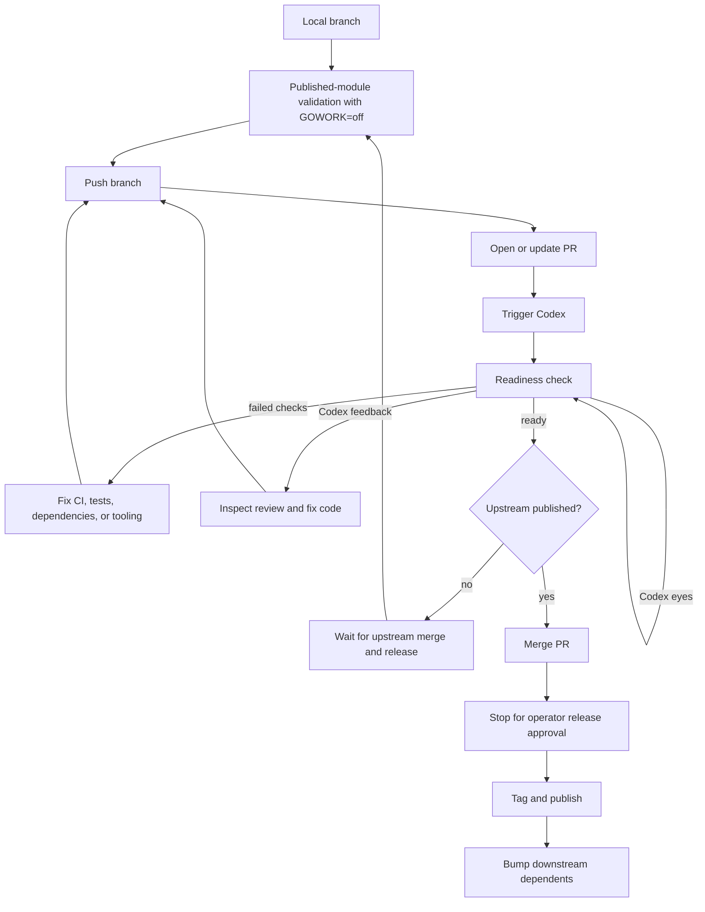

# Managing Go-Go-Golems Release Trains

A release train is the procedure for moving one change through several repositories that depend on each other. In the go-go-golems ecosystem, a change in `go-go-goja` can require follow-up work in `geppetto`, `pinocchio`, `discord-bot`, `go-minitrace`, `workspace-manager`, `goja-git`, `loupedeck`, and `css-visual-diff`. The technical problem is not only to update `go.mod`. The release train must prove that every downstream repository works with published module versions, that every pull request has completed CI, and that Codex review is either satisfied or explicitly addressed.

This chapter explains that procedure from first principles. By the end, the reader should understand why dependency order controls merge order, why `GOWORK=off` is required for downstream validation, how the readiness scripts classify pull requests, and how early downstream PRs can reduce review latency without violating release ordering.

> [!summary]
> - Build the release order from direct `github.com/go-go-golems/...` requirements in `go.mod`.
> - Validate downstream repositories with `GOWORK=off`; workspace tests are not enough for release readiness.
> - Treat CI status and Codex review status as separate gates.
> - Open downstream PRs early to collect feedback, but merge and publish in dependency order.
> - Stop after an upstream merge when an operator must approve the release tag before downstream bumps continue.

## 1. The release problem

A single-repository release has one main boundary: the repository being changed. A multi-repository release has two boundaries. The first is the source repository where the API or behavior changed. The second is the published module graph that downstream users resolve through `go.mod`. Most mistakes in ecosystem releases happen between those two boundaries. Code compiles in a local workspace, but downstream users cannot import it because the upstream tag was not published. A PR passes focused tests, but fails CI because the repository's Go version is behind the vulnerability database. A downstream branch is ready as code, but cannot merge because it depends on a Geppetto API that exists only in an unmerged branch.

The xgoja rollout made these boundaries explicit. `go-go-goja` introduced provider APIs and a runtime/context API cleanup. Geppetto had to adopt `runtimeowner.RuntimeOwner` and `runtimebridge.RuntimeServices`. Pinocchio had to update its JavaScript runtime creation path. Leaf repositories had to bump `go-go-goja` to the published version and validate generated xgoja providers. The work touched APIs, module versions, CI workflows, and code review automation.

The release train exists to keep those moving parts ordered.

## 2. The release train invariant

The invariant is simple:

> A repository may merge only after every upstream module version it requires has already been merged, tagged, and made visible to normal Go module resolution.

This invariant is stricter than “the code exists in a branch.” It is also stricter than “the PR is merged.” Go downstream users do not import a pull request; they import a module version. If a downstream PR needs `github.com/go-go-golems/go-go-goja@v0.6.0`, then `v0.6.0` must exist and be visible through:

```bash
GOWORK=off go list -m -versions github.com/go-go-golems/go-go-goja
```

Only then can the downstream repository prove its published dependency graph.

The operator may still open downstream PRs early. Early PRs are useful because CI and Codex can run while upstream release work continues. The invariant applies to merge and release, not to opening a review branch.

## 3. The tooling map

The release scripts live in:

```text
/home/manuel/code/wesen/go-go-golems/infra-tooling/scripts/go-go-golems/
```

The important scripts are:

| Script | Role |
| --- | --- |
| `00-pr-ready-check.sh` | Runs a one-shot readiness check for a single PR. |
| `01-pr-ready-check.py` | Implements the GitHub GraphQL query and readiness rules. |
| `02-trigger-codex-review.sh` | Posts `@codex review` on a PR. |
| `03-watch-codex-reactions.py` | Watches Codex reaction transitions. |
| `04-wait-pr-ready.sh` | Polls one PR until ready, timeout, or substantive Codex feedback. |
| `05-batch-pr-ready.sh` | Checks many PRs and prints a readiness table. |

The playbooks that define the process are:

```text
infra-tooling/docs/go-go-golems/package-publishing-release-train.md
infra-tooling/docs/go-go-golems/playbooks/pr-readiness-check-scripts.md
infra-tooling/docs/go-go-golems/logcopter-rollout-colleague-instructions.md
infra-tooling/docs/go-go-golems/glazed-linting-rollout-playbook.md
```

The scripts are deliberately small. They do not try to be a full release system. They automate the repeated checks and leave dependency-order judgment to the operator.

## 4. Build the dependency graph from `go.mod`

The first operation in a release train is to inspect direct go-go-golems dependencies. The command is:

```bash
awk '/^require[[:space:]]+github\.com\/go-go-golems\// { print $2 } /^[[:space:]]*github\.com\/go-go-golems\// { print $1 }' go.mod | sort -u
```

This command handles both single-line `require` statements and entries inside a `require (...)` block. It intentionally reads `go.mod` instead of a hand-maintained list. The dependency graph can change as repositories add or remove packages, and the release tooling should follow the file Go actually uses.

For the xgoja rollout, the inventory was:

| Repository | Relevant direct dependencies |
| --- | --- |
| `go-go-goja` | `geppetto`, `glazed`, `bobatea` |
| `geppetto` | `go-go-goja`, `glazed`, `go-emrichen`, `logcopter`, `sanitize` |
| `discord-bot` | `go-go-goja`, `glazed` |
| `go-minitrace` | `go-go-goja`, `glazed`, `clay` |
| `loupedeck` | `go-go-goja`, `glazed` |
| `workspace-manager` | `go-go-goja`, `glazed`, `clay` |
| `goja-git` | `go-go-goja` |
| `pinocchio` | `go-go-goja`, `geppetto`, `glazed`, `clay`, `logcopter`, `sessionstream`, others |
| `css-visual-diff` | `go-go-goja`, `geppetto`, `pinocchio`, `glazed` |

From this table, the release order follows:

```text
go-go-goja
  -> geppetto
      -> pinocchio
          -> css-visual-diff
  -> direct go-go-goja leaf repositories
      -> discord-bot
      -> go-minitrace
      -> loupedeck
      -> workspace-manager
      -> goja-git
```

The table is more important than the exact order shown here. If the dependencies change, the order changes. The method remains the same.

## 5. Replace stale bump targets with a graph-based bump

A repository-specific target such as `bump-glazed` is fragile because it usually contains a manually curated package list. The list becomes wrong as soon as the repository adds `go-go-goja`, removes `clay`, or introduces `logcopter`. The better target scans `go.mod` and bumps every direct go-go-golems dependency.

The release-safe version is:

```make
.PHONY: bump-go-go-golems
bump-go-go-golems:
	@deps="$$(awk '/^require[[:space:]]+github\.com\/go-go-golems\// { print $$2 } /^[[:space:]]*github\.com\/go-go-golems\// { print $$1 }' go.mod | sort -u)"; \
	if [ -z "$$deps" ]; then \
		echo "No github.com/go-go-golems dependencies in go.mod"; \
	else \
		echo "Bumping go-go-golems dependencies with GOWORK=off:"; \
		printf '  %s\n' $$deps; \
		for dep in $$deps; do GOWORK=off go get "$${dep}@latest"; done; \
	fi
	GOWORK=off go mod tidy
```

The important detail is `GOWORK=off`. During implementation, a local `go.work` file is helpful because it lets sibling repositories develop together. During release validation, the same `go.work` file can hide missing tags. Disabling it makes Go resolve dependencies as an external user would.

## 6. Why `GOWORK=off` changes the meaning of a test

Consider two commands:

```bash
go test ./...
GOWORK=off go test ./...
```

The first command may use local sibling checkouts. If `go-go-goja` has an untagged function and `pinocchio` calls that function, the workspace test can pass. The second command ignores the workspace and uses the versions in `go.mod`. If `pinocchio` still requires `go-go-goja v0.5.0`, and the function exists only in `v0.6.0`, the second command fails.

That failure is useful. It means the repository has not yet proved its published dependency graph.

For small repositories, the validation command can be broad:

```bash
GOWORK=off go test ./...
```

For repositories with hardware, browser, or long-running tests, use a focused suite that still disables the workspace:

```bash
GOWORK=off go test ./runtime/js ./runtime/js/provider ./cmd/loupedeck/cmds/verbs -count=1
GOWORK=off go test ./pkg/xgoja/provider ./internal/jsdiscord ./pkg/botcli -count=1
```

The test surface may vary. The published-module constraint should not.

## 7. Open downstream PRs early, merge them late

Early PRs reduce feedback latency. In the xgoja rollout, downstream PRs were opened for:

```text
geppetto          https://github.com/go-go-golems/geppetto/pull/362
discord-bot       https://github.com/go-go-golems/discord-bot/pull/9
go-minitrace      https://github.com/go-go-golems/go-minitrace/pull/11
loupedeck         https://github.com/go-go-golems/loupedeck/pull/3
workspace-manager https://github.com/go-go-golems/workspace-manager/pull/20
goja-git          https://github.com/go-go-golems/goja-git/pull/1
css-visual-diff   https://github.com/go-go-golems/css-visual-diff/pull/8
pinocchio         https://github.com/go-go-golems/pinocchio/pull/160
```

Some of these PRs were not mergeable yet. Pinocchio, for example, needed a Geppetto release containing the renamed `RuntimeOwner` option. Opening the PR early was still useful because CI immediately reported what else needed attention: logcopter tool setup, vulnerability checks, and published dependency mismatches.

The rule is:

> Opening a PR starts feedback. Merging a PR consumes published dependencies. These are different phases.

## 8. Trigger and interpret Codex review

Codex review is triggered with:

```bash
/home/manuel/code/wesen/go-go-golems/infra-tooling/scripts/go-go-golems/02-trigger-codex-review.sh \
  https://github.com/go-go-golems/<repo>/pull/<n>
```

The readiness checker treats two kinds of objects as Codex signals:

- a Codex-authored review or comment;
- a human `@codex review` trigger comment that has Codex reactions.

This matters because a review can be in progress before there is a Codex-authored review body. During that period the trigger comment may have an `EYES` reaction. An `EYES` reaction means the PR is not ready.

A satisfied Codex state is either a thumbs-up reaction or a satisfied Codex-authored body. A substantive Codex body means the PR needs operator action. The wait script now stops immediately in that case:

```text
Codex posted substantive review comments; stopping wait for operator action
```

This behavior prevents a wait loop from polling until timeout when the next step is to read and fix the review.

## 9. The PR readiness model

A PR is ready only when both status checks and Codex review are ready. The script checks:

- at least one status check exists;
- every check run is completed with `SUCCESS`, `SKIPPED`, or `NEUTRAL`;
- every legacy status context is successful;
- a Codex signal exists;
- the latest Codex signal has no `EYES` reaction;
- the latest Codex signal has a thumbs-up or satisfied body;
- a Codex-authored body is not substantive review feedback.

The single-PR command is:

```bash
/home/manuel/code/wesen/go-go-golems/infra-tooling/scripts/go-go-golems/00-pr-ready-check.sh \
  https://github.com/go-go-golems/geppetto/pull/362
```

The single-PR wait command is:

```bash
/home/manuel/code/wesen/go-go-golems/infra-tooling/scripts/go-go-golems/04-wait-pr-ready.sh \
  https://github.com/go-go-golems/geppetto/pull/362 30 1800
```

The batch command is:

```bash
/home/manuel/code/wesen/go-go-golems/infra-tooling/scripts/go-go-golems/05-batch-pr-ready.sh \
  /tmp/xgoja-release-prs.txt
```

The batch output is deliberately compact:

```text
STATUS           PR
------           --
READY            https://github.com/go-go-golems/geppetto/pull/362
WAITING_CODEX    https://github.com/go-go-golems/discord-bot/pull/9
WAITING_CHECKS   https://github.com/go-go-golems/workspace-manager/pull/20
FAILED_CHECKS    https://github.com/go-go-golems/goja-git/pull/1
CODEX_FEEDBACK   https://github.com/go-go-golems/css-visual-diff/pull/8
```

This table is an operator dashboard. It does not decide merge order. It tells the operator which PRs are waiting, which need fixes, and which are ready to merge when the dependency graph permits it.

## 10. A worked example: Geppetto PR 362

Geppetto was the first downstream repository after `go-go-goja`. It needed two changes:

1. adopt the renamed runtime owner API;
2. bump `go-go-goja` to `v0.6.0`.

Local validation used the published module:

```bash
GOWORK=off go get github.com/go-go-golems/go-go-goja@v0.6.0
GOWORK=off go mod tidy
GOWORK=off go test ./pkg/js/runtime ./pkg/js/modules/geppetto ./pkg/js/runtimebridge ./pkg/inference/tools/scopedjs -count=1
GOWORK=off go test ./... -count=1
```

Codex then found a real semantic bug. The first migration passed the same context as both startup and runtime lifetime:

```go
rt, err := factory.NewRuntime(
    gojengine.WithStartupContext(ctx),
    gojengine.WithLifetimeContext(ctx),
)
```

That code compiles, but it changes lifetime semantics. If `ctx` is request-scoped or timeout-scoped, canceling it after construction cancels the runtime lifetime. The correct Geppetto behavior is that the public `NewRuntime(ctx, opts)` uses `ctx` for construction and lets the runtime own its longer-lived lifetime unless an explicit lifetime is added later.

The fix was:

```go
rt, err := factory.NewRuntime(gojengine.WithStartupContext(ctx))
```

The regression test states the invariant directly:

```go
func TestNewRuntime_StartupContextDoesNotOwnRuntimeLifetime(t *testing.T) {
    startupCtx, cancel := context.WithCancel(context.Background())
    rt, err := NewRuntime(startupCtx, Options{})
    if err != nil {
        t.Fatalf("NewRuntime failed: %v", err)
    }
    defer func() { _ = rt.Close(context.Background()) }()

    cancel()

    select {
    case <-rt.Context().Done():
        t.Fatalf("runtime lifetime was canceled when startup context was canceled")
    default:
    }
}
```

After the fix, CI and Codex readiness passed. The PR was merged, and the process stopped before publishing a Geppetto release. That stop point matters because publishing Geppetto changes the dependency graph available to Pinocchio and css-visual-diff.

## 11. CI failures as release-train feedback

The downstream PRs revealed several common failure classes. These are not distractions from the release train; they are part of the release train.

### Go patch version and `govulncheck`

Several repositories failed `govulncheck` because their Go version was `1.26.1` or `1.26.2`, while the vulnerability database listed standard-library fixes in `1.26.3`.

Typical output:

```text
Vulnerability GO-2026-4971
Found in: net@go1.26.2
Fixed in: net@go1.26.3
```

The fix is to move the module to the patched Go version and tidy with workspace disabled:

```bash
go mod edit -go=1.26.3
GOWORK=off go mod tidy
GOWORK=off govulncheck ./...
```

Loupedeck also needed a dependency fix because it called vulnerable `golang.org/x/image` symbols:

```bash
GOWORK=off go get golang.org/x/image@v0.39.0
GOWORK=off go mod tidy
```

### golangci-lint built with an older Go version

Workspace Manager and goja-git failed lint because the action installed a linter built with an older Go version than the repository targeted:

```text
can't load config: the Go language version (go1.25) used to build golangci-lint is lower than the targeted Go version (1.26.1)
```

The fix was to update the lint action version:

```yaml
- name: golangci-lint
  uses: golangci/golangci-lint-action@v9
  with:
    version: v2.11.2
    args: --timeout=5m
```

A release train that changes Go versions should expect this class of failure.

### gosec action not using the configured Go toolchain

Workspace Manager used `securego/gosec@master`, which ran with Go `1.26.2` after `go.mod` required `1.26.3`. Package loading failed before gosec could analyze code.

The repair was to install gosec after `actions/setup-go`:

```yaml
- name: Install gosec
  run: go install github.com/securego/gosec/v2/cmd/gosec@latest

- name: Run Gosec Security Scanner
  run: gosec -exclude=G101,G304,G301,G306,G204,G703 -exclude-dir=.history ./...
```

This keeps gosec on the same Go toolchain selected for the repository.

### Dependency Review unsupported by repository settings

Discord Bot failed Dependency Review because GitHub dependency graph support was not enabled for the repository:

```text
Dependency review is not supported on this repository.
```

The long-term fix is to enable the dependency graph in GitHub repository settings. For the rollout, the workflow step was made non-blocking:

```yaml
- name: Dependency Review
  uses: actions/dependency-review-action@v4
  continue-on-error: true
  with:
    fail-on-severity: high
```

This should be recorded as operational debt. A non-blocking dependency review is not equivalent to a functioning dependency review.

### Repository-wide lint found dead code

Go-minitrace had dead helper functions in its JS query runtime path. Focused tests passed, but repository-wide lint failed with unused functions. The correct fix was to remove the dead helper path, not to silence the linter.

This is why early downstream PRs are valuable. They surface cleanup work before the merge step waits on them.

## 12. Commit structure during the rollout

The clearest rollout commits were small and purpose-specific:

```text
Bump go-go-goja runtime API
Fix xgoja rollout CI checks
Fix rollout lint and security checks
```

This structure makes review easier. A dependency bump commit can be inspected by looking at `go.mod` and `go.sum`. An API migration commit can be inspected by looking at type and call-site changes. A CI repair commit can be inspected by looking at workflows, Go version declarations, and linter fixes.

The rule is:

- Keep dependency bumps separate from semantic code changes when possible.
- Keep CI tooling fixes separate from provider feature work when possible.
- If a follow-up dependency bump is expected after an upstream release, say that in the PR body.

Pinocchio was opened early with that explicit caveat. It could receive Codex and CI feedback before Geppetto was published, but it was not a merge candidate until the Geppetto release existed.

## 13. The complete operator loop

The operator loop can be written as pseudocode:

```text
repositories = dependency_order(repos)

for repo in repositories:
    inspect go.mod for go-go-golems dependencies
    create or update branch
    bump required published upstream versions
    apply required API changes
    run GOWORK=off validation
    commit focused changes
    push branch
    open or update PR
    trigger Codex

while PRs remain:
    run batch readiness

    for each PR with CODEX_FEEDBACK:
        read review
        fix code or explain why not
        push
        trigger Codex again

    for each PR with FAILED_CHECKS:
        inspect failed check logs
        fix dependency, lint, test, or workflow problem
        push
        trigger Codex again

    for each READY PR in dependency order:
        if all required upstream versions are published:
            merge PR
            stop if operator release approval is required
            publish tag after approval
```

This loop is intentionally conservative. It avoids merging a downstream PR only because it is green. Green is necessary, but not sufficient; dependency order and published versions still matter.

## 14. State diagram



The diagram separates three forms of waiting:

- Waiting for checks means the PR may become ready without code changes.
- Waiting for Codex with an `EYES` reaction means the review is still running.
- Codex feedback or failed checks require a new commit.

## 15. What should improve in the tooling

The current scripts are useful, but the rollout exposed several improvements.

First, batch readiness should classify from JSON rather than grepping human output. The Python checker already has enough data to emit structured state:

```json
{
  "state": "codex_feedback",
  "ready": false,
  "terminal": true,
  "failedCheckKinds": ["lint", "govulncheck"]
}
```

Second, batch readiness should have a watch mode:

```bash
05-batch-pr-ready.sh /tmp/xgoja-release-prs.txt --watch --interval 30 --timeout 1800
```

The watch mode should keep polling non-terminal states, but it should not hide terminal states. `CODEX_FEEDBACK` and `FAILED_CHECKS` should remain visible until a new commit changes the PR state.

Third, Codex triggering should have a batch command:

```bash
06-batch-trigger-codex-review.sh /tmp/xgoja-release-prs.txt
```

Fourth, a release-train manifest would be more expressive than a plain PR list:

```yaml
- repo: geppetto
  pr: https://github.com/go-go-golems/geppetto/pull/362
  depends_on:
    - go-go-goja@v0.6.0
  stop_after_merge: true

- repo: pinocchio
  pr: https://github.com/go-go-golems/pinocchio/pull/160
  depends_on:
    - geppetto@next
  expected_until_release:
    - published geppetto RuntimeOwner API
```

A manifest would let the tool report release-train readiness, not only PR readiness.

## 16. Working rules

The rules to preserve are these:

- Build the release order from `go.mod`, not from memory.
- Use `GOWORK=off` for downstream validation.
- Publish upstream before merging downstream code that requires the new upstream version.
- Open downstream PRs early when review latency matters.
- Trigger Codex after every meaningful push.
- Stop waiting when Codex leaves substantive feedback.
- Treat Go patch versions, govulncheck, gosec, and golangci-lint versions as release-train concerns.
- Keep commits focused enough that dependency bumps, API migrations, and CI repairs can be reviewed separately.
- Merge in dependency order.
- Stop after merge before tagging when the release requires operator approval.

## 17. Final state of the xgoja case study

At the time this article was written, `go-go-goja v0.6.0` was published. Geppetto PR 362 was merged after fixing Codex feedback about runtime lifetime ownership. Downstream PRs were open for Discord Bot, go-minitrace, Loupedeck, Workspace Manager, goja-git, css-visual-diff, and Pinocchio. Several CI repairs had already been pushed across those PRs.

The important result is the repeatable process. The go-go-golems ecosystem now has a concrete pattern for multi-repository release work: dependency graph first, published-module validation, early downstream PRs, CI and Codex readiness gates, focused repair commits, dependency-order merges, and explicit release stop points.
