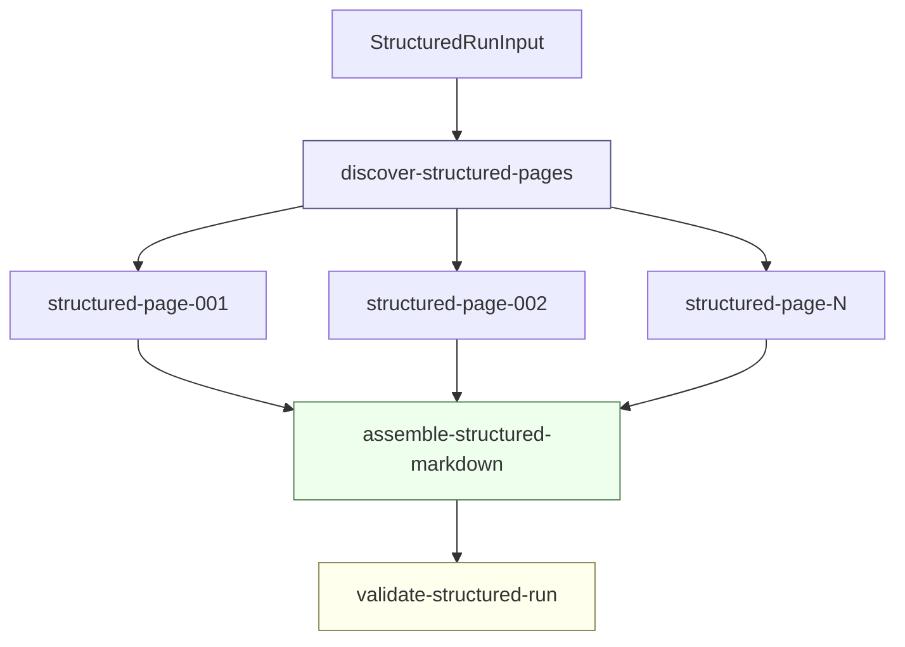

# Structured Book OCR

This article explains the structured Book OCR pipeline that grew out of the Report 794 OCR work. It covers the move from freeform Markdown OCR to target-page-only structured JSON, the deterministic renderer, the Geppetto/Pinocchio turn persistence layer, the first live table and figure-boundary validations, and the later promotion of the structured runner into the `scraper/pkg/workflow` runtime.

The central design point is precise: the model should observe a single target page image and return structured facts about that page. The final reader-facing Markdown should be written by Go code, not by the model. Once page OCR is represented as independent workflow steps, the workflow runtime can retry, resume, inspect, assemble, and validate runs without custom ad hoc control flow.

> [!summary]
> - The original freeform full-book OCR run was operationally complete but textually unsafe because neighboring page images caused adjacent figure-caption bleed.
> - The structured pipeline restores the page provenance invariant: primary OCR sees exactly one target page image, returns `StructuredPageOCR` JSON, and Go renders deterministic Markdown.
> - The page-level structured client now supports dry-run and live Geppetto execution, persists input/final turns through Pinocchio-compatible SQLite, repairs common JSON shape drift, and writes replayable per-page artifacts.
> - The structured runner has been promoted from a direct CLI loop into a workflow package with discover, page OCR, assemble, and validate steps, workflow artifacts, projection rows, retry policies, and operator-facing status.
> - The first 50-page live workflow-backed run with `--max-workers 4` succeeded with 50 page markers, 17 captioned figure blocks, 10 structured table blocks, 0 validation warnings, and 53 succeeded workflow ops.

## 1. Why this note exists

The Book OCR project started as a validation case for a generic workflow runtime. A scanned technical report, MIT Report 794 *Presentation Based User Interfaces*, provided a useful real-world workload: pages contain front matter, tables of contents, body prose, diagram pages, spreadsheet-like figures, figure captions, historical terminology, and enough page-boundary complexity to expose failures that small OCR demos do not reveal.

The early OCR workflow succeeded in a narrow operational sense. It could discover pages, call a vision-language model through Geppetto, store artifacts, assemble Markdown, run quality passes, and extract figures. The full 202-page run completed after one failed page was retried and an assembler step was repaired. The result had the expected number of page markers and a complete workflow trace.

The problem was not workflow completion. The problem was page provenance. The freeform OCR prompt had been run with neighboring page PNGs as context. The prompt told the model that the first image was the target page and the neighboring images were only context. The model still sometimes copied adjacent visual content into the target page output. Page 12 contained prose referencing Figure 1-1; page 13 contained the actual Figure 1-1 diagram. The full-book artifact created a figure marker for page 12. Similar adjacent duplicates appeared throughout the book.

This failure changed the architecture. It was no longer enough to improve the prompt. The pipeline needed a stronger boundary:

```text
Primary page OCR may use exactly one target page image.
Neighboring page images may be used in diagnostics and benchmarks, but not as final OCR input.
Final Markdown is rendered deterministically from structured blocks.
```

The structured OCR work described here is the implementation of that boundary.

## 2. The failure mode: workflow success is not OCR correctness

A workflow engine can tell us that every step ran. It cannot, by itself, tell us whether a vision model respected a page boundary. That distinction matters because OCR correctness has several layers.

| Layer | Question | Example failure |
|---|---|---|
| Runtime completion | Did all steps reach a terminal success state? | A page step fails after provider retries. |
| Page coverage | Did the final artifact contain all expected page markers? | A 202-page book produces 201 page markers. |
| Text fidelity | Did visible text get transcribed correctly? | `PSBase` becomes `PS Base`. |
| Page provenance | Did target page output contain only target page content? | Page 12 receives Figure 1-1 from page 13. |
| Rendering correctness | Did final Markdown encode the page structure correctly? | A table is rendered as ragged text instead of a Markdown table. |
| Reviewability | Can a human inspect raw inputs, raw model output, parsed data, warnings, and final output? | Only final Markdown exists; raw model response is lost. |

The freeform OCR workflow was strong on runtime completion and artifact assembly. It was weak on page provenance and deterministic rendering. The structured OCR work addresses those two weaknesses directly.

The risky part of neighboring image context is not that it always fails. The VLM separation benchmark later showed that several prompt/block layouts can avoid forbidden-caption bleed on a selected risky-page set. The production rule remains conservative because a final OCR artifact needs stronger guarantees than a benchmark sample. Diagnostic calls can explore multi-image separation. Production page OCR should not expose neighboring page pixels to the primary transcription call.

## 3. From freeform Markdown to structured page contracts

The original OCR client asked the model to produce Markdown. That seems convenient because Markdown is the final desired format. It is also the wrong boundary for a reliable pipeline. Markdown combines recognition, interpretation, layout policy, normalization, and final rendering in one model response. If a table is malformed, it is difficult to know whether the model failed to see the table or merely chose a poor Markdown representation. If a diagram includes both an image marker and a long transcription of labels, the renderer cannot reliably separate reader-facing content from debug content.

The structured pipeline splits the work into two stages:

```text
page PNG
  -> model returns StructuredPageOCR JSON
  -> Go validates and repairs limited schema drift
  -> Go renders final Markdown deterministically
```

The central type is `StructuredPageOCR` in:

```text
/home/manuel/workspaces/2026-05-20/book-ocr/2026-05-20--book-ocr/internal/ocrpipeline/types.go
```

The conceptual shape is:

```go
type StructuredPageOCR struct {
    SchemaVersion string
    BookID        string
    PageNumber    int
    PageType      PageType
    Blocks        []OCRBlock
    Warnings      []Warning
}

type OCRBlock struct {
    ID          string
    Type        BlockType
    Text        string
    Level       int
    Items       []ListItem
    Table       *TableBlock
    Caption     string
    Description string
    DiagramText []string
    Confidence  string
    Warnings    []Warning
}

type TableBlock struct {
    Headers []string
    Rows    [][]string
}
```

The block model is deliberately small. It does not attempt to represent every possible document-layout concept. It represents the concepts the pipeline needs to render stable Markdown and run deterministic checks:

- headings,
- paragraphs,
- lists,
- tables,
- figures,
- footnotes,
- page footers,
- blank pages.

This design matters for tables. In a freeform OCR prompt, the model may emit aligned text, partial Markdown, a prose description, or a table. In the structured contract, a visible spreadsheet-like grid should become a `table` block. The renderer then emits GitHub-flavored Markdown table syntax every time.

The renderer lives in:

```text
internal/ocrpipeline/renderer.go
```

It defines one reader-facing write boundary:

```text
StructuredPageOCR + optional FigureResolver + RenderOptions -> Markdown string
```

The renderer always emits a page marker:

```markdown
<!-- page:032 -->
```

It renders table blocks deterministically:

```markdown
|  | A | B | C |
| --- | --- | --- | --- |
| 1 | 100 | 20 | A1*B1 |
| 2 | 75 | 5 | A2*B2 |
| 3 |  |  | C1+C2 |
```

It also suppresses `diagram_text` by default. That is an important design choice. Diagram label transcription is useful debug information, but reader-facing Markdown should not contain both an embedded figure and a long, noisy diagram transcription unless a debug option asks for it.

## 4. Target-page-only OCR as a system invariant

The structured OCR client builds a Geppetto turn with exactly one image. This is not only a prompt instruction; it is an implementation invariant.

The relevant code is in:

```text
internal/ocrpipeline/client.go
```

The function `BuildStructuredOCRInputTurn` constructs the turn:

```go
turn := &turns.Turn{ID: PageTurnID(input.PageNumber, 1, "structured-ocr")}
turns.AppendBlock(turn, turns.NewSystemTextBlock(StructuredOCRSystemPrompt))
images := []map[string]any{{
    "media_type": mediaTypeFromImagePath(input.ImagePath),
    "content":    append([]byte(nil), imageBytes...),
    "detail":     "high",
    "role":       "target",
    "page":       input.PageNumber,
}}
turns.AppendBlock(turn, turns.NewUserMultimodalBlock(RenderStructuredOCRPrompt(input), images))
```

There is no `ContextBefore` and no `ContextAfter` in this call. The target page image is the only vision input. The code also has a `CountTurnImages` helper used by tests and runtime checks to ensure the input turn contains exactly one image.

The invariant is simple enough to state as a test requirement:

```text
For primary structured OCR, CountTurnImages(inputTurn) must equal 1.
```

This is the main difference between the new structured pipeline and the earlier `--context-window 1` freeform run. Text-only context may be added later as a separate phase, but primary vision OCR should remain target-image-only.

## 5. The page-level structured pipeline

The page-level pipeline is implemented by `RunStructuredPage` in:

```text
internal/ocrpipeline/structured_ocr.go
```

It is the core function used by the direct CLI command and by the workflow page executor. Its responsibilities are intentionally larger than a raw model call because a page OCR observation needs to be replayable. A successful page run writes six artifacts:

```text
pages/page_NNN/01-turn-input.yaml
pages/page_NNN/02-turn-final.yaml
pages/page_NNN/03-raw-response.json
pages/page_NNN/04-structured.json
pages/page_NNN/05-rendered.md
pages/page_NNN/06-validation.json
```

On parse or page-mismatch failure it also writes:

```text
pages/page_NNN/07-error.txt
```

The control flow is:

```text
read target image
open OCR turn store
call StructuredOCRClient
assert input turn has exactly one image
save input turn to turns.db
save final turn to turns.db
write input/final YAML artifacts
write raw response
parse StructuredPageOCR
repair limited schema drift
render deterministic Markdown
compute page validation
write structured JSON, rendered Markdown, validation JSON
return StructuredPageRunResult
```

In pseudocode:

```go
func RunStructuredPage(ctx, input, client) (result, error) {
    imageBytes := os.ReadFile(input.ImagePath)
    turnStore := OpenOCRTurnStore(input.WorkDir, input.BookID, input.RunID)

    observation := client.OCRPage(ctx, input, imageBytes)
    require CountTurnImages(observation.InputTurn) == 1

    turnStore.Save(pageSession, turnID, "input", observation.InputTurn)
    turnStore.Save(pageSession, turnID, "final", observation.FinalTurn)

    write("01-turn-input.yaml", observation.InputTurn)
    write("02-turn-final.yaml", observation.FinalTurn)
    write("03-raw-response.json", observation.RawResponse)

    page := ParseStructuredOCRResponse(observation.RawResponse)
    markdown := RenderPageMarkdown(page, nil, DefaultRenderOptions())
    validation := ValidateStructuredPage(page, markdown)

    write("04-structured.json", page)
    write("05-rendered.md", markdown)
    write("06-validation.json", validation)

    return result
}
```

This function is the reason the later workflow port was straightforward. A workflow executor can call one function and then store the resulting files as workflow artifacts and projection rows.

## 6. Geppetto calls and Pinocchio turn persistence

The live structured client is `GeppettoStructuredOCRClient` in:

```text
internal/ocrpipeline/client.go
```

It resolves the model profile using Pinocchio profile bootstrap:

```go
parsed, err := profilebootstrap.NewCLISelectionValues(profilebootstrap.CLISelectionInput{
    Profile:           input.Profile,
    ProfileRegistries: input.ProfileRegistries,
})
resolved, err := profilebootstrap.ResolveCLIEngineSettings(ctx, parsed)
eng, err := profilebootstrap.NewEngineFromResolvedCLIEngineSettings(resolved)
finalTurn, err := eng.RunInference(ctx, inputTurn)
```

The workflow does not shell out to a `pinocchio` command. It calls Geppetto directly and uses Pinocchio's profile registry logic to resolve the engine. That keeps OCR inside the Go process while preserving the profile configuration system already used by other tools.

The turn store wrapper lives in:

```text
internal/ocrpipeline/session.go
```

It stores turns using Pinocchio's `chatstore.SQLiteTurnStore`. The identifier scheme is:

```text
convID    = book-ocr:<book-id>:<run-id>
sessionID = page:<NNN>
turnID    = page:<NNN>:01-structured-ocr
phase     = input or final
```

A subtle point matters here. Pinocchio's `turns` table has one logical row for a `(conv_id, session_id, turn_id)` key. The `input` and `final` snapshots are represented in `turn_block_membership.phase`, not as two separate turn rows. Tests were written around that behavior after it was observed in practice.

This persistence layer gives future debugging a stable path:

```sql
select conv_id, session_id, turn_id, runtime_key, inference_id, updated_at_ms
from turns
order by updated_at_ms desc;

select phase, count(*)
from turn_block_membership
group by phase;
```

The page artifacts are for human review. The turn DB is for replaying and inspecting model interactions.

## 7. Parser repair: accepting model outputs without hiding evidence

Even with a strict JSON prompt, live model responses drift. The structured parser had to accept several recurring shapes without losing the raw response.

Observed variants included:

- `"page_number": 032`, which is invalid JSON because leading-zero numbers are not legal.
- `"page_number": "032"`, which is valid JSON but not the original Go type.
- `diagram_text` as a string rather than an array.
- list items as strings rather than `{ "text": ... }` objects.
- figure metadata nested under a `figure` object.
- figure captions emitted as heading blocks immediately before a figure block.

The repair code lives in:

```text
internal/ocrpipeline/types.go
internal/ocrpipeline/structured_ocr.go
```

The repair policy is deliberately limited. It accepts common shape drift but does not silently invent OCR content. For example, if a figure block has an empty caption and a neighboring heading block says `Figure 2-9: Presenter Parts`, the parser repairs the figure caption and drops the duplicate heading. That is a structural repair of data already present in the model response.

The raw response is always written first:

```text
03-raw-response.json
```

If parsing fails, the error is written to:

```text
07-error.txt
```

This ordering is important. A failed parse is still a useful model observation. The pipeline should not lose the response merely because the current parser cannot accept it.

## 8. The first structured page validations

The first implementation milestone was `structured-page --dry-run`. It used fake page 32 data to prove the artifact layout, turn persistence, JSON parsing, deterministic rendering, and Markdown table output without spending a live model call.

The second milestone was live page 32:

```bash
go run ./cmd/book-ocr structured-page \
  --book-id report-794 \
  --page 32 \
  --image /home/manuel/code/wesen/claw-stuff/output/books/presentation-based-uis/pages/page_032.png \
  --work-dir /tmp/book-ocr-structured-page-032-live-4 \
  --profile gpt-5-mini-low \
  --profile-registries /tmp/book-ocr-hq-001/profiles-clean.yaml \
  --dry-run=false \
  --log-level warn
```

The successful output included two tables:

```markdown
|  | A | B | C |
| --- | --- | --- | --- |
| 1 | 100 | 20 | A1*B1 |
| 2 | 75 | 5 | A2*B2 |
| 3 |  |  | C1+C2 |

|  | A | B | C |
| --- | --- | --- | --- |
| 1 | 100 | 20 | 2000 |
| 2 | 75 | 5 | 375 |
| 3 |  |  | 2375 |
```

This proved the table architecture. The model did not need to write Markdown tables directly. It only needed to return table blocks. Go rendered the tables.

The third milestone was the figure-boundary smoke set:

```text
12, 13, 42, 43, 115, 116
```

The expected behavior was page-local:

| Page | Expected structured behavior |
|---:|---|
| 12 | Prose may reference Figure 1-1, but no Figure 1-1 figure block. |
| 13 | Figure 1-1 figure block allowed. |
| 42 | Figure 2-9 figure block allowed. |
| 43 | Prose only; no Figure 2-9 figure block. |
| 115 | Figure 5-7 figure block allowed. |
| 116 | Prose may reference Figure 5-7, but no Figure 5-7 figure block. |

The live run satisfied the boundary rule. Pages 12, 43, and 116 did not produce false figure blocks. Pages 13, 42, and 115 produced figure blocks. Caption extraction initially needed repair, but the page-boundary invariant held.

## 9. Why the direct runner was not enough

The first multi-page structured runner was a direct CLI loop:

```text
discover pages
for each page:
  run structured page OCR
  append rendered Markdown
write assembled.md
write validation-report.json
```

It was useful because it let the project validate structured OCR quickly. It was not sufficient because it exited on the first page error. During the first-50 live structured run, three failures demonstrated the problem:

- page 6 exposed list-item schema drift,
- page 20 hit a transient provider TLS error,
- page 42 hit another transient provider TLS error.

The stopgap was `--resume=true`, which skipped page directories that already contained structured JSON, rendered Markdown, and validation JSON. That made the direct run practical, but it duplicated capabilities already present in the workflow runtime.

The workflow runtime is a better execution boundary because a page OCR call is naturally a step:

```text
input: book id, page number, image path, profile, work dir
work: call RunStructuredPage
output: structured JSON path, rendered Markdown path, validation path, artifact IDs, counts
retry: provider/network errors retry; parse/image errors can be permanent
```

Once page OCR is represented as independent workflow steps, the runtime can do the operational work:

- lease steps,
- run multiple page steps concurrently,
- retry transient failures,
- persist step results,
- expose status,
- allow manual retry,
- assemble only after dependencies succeed.

## 10. The workflow-backed structured OCR package

The workflow port lives in:

```text
internal/ocrpipeline/workflow_types.go
internal/ocrpipeline/workflow_package.go
internal/ocrpipeline/workflow_projection.go
internal/ocrpipeline/workflow_executors.go
```

The package constants define the workflow domain:

```go
const (
    StructuredPackageName     = "book-ocr/structured"
    StructuredProjectionName  = "book_ocr_structured"
    KindStructuredDiscover    = "book-ocr/structured/discover-pages"
    KindStructuredPage        = "book-ocr/structured/ocr-page"
    KindStructuredAssemble    = "book-ocr/structured/assemble-markdown"
    KindStructuredValidate    = "book-ocr/structured/validate-run"
    QueueStructuredControl    = "structured-control"
    QueueStructuredVision     = "structured-vision"
    QueueStructuredAssemble   = "structured-assemble"
    QueueStructuredValidation = "structured-validation"
)
```

The graph is:



The discover executor seeds projection rows and emits one page step per discovered image. Each page step receives a retry policy. The assemble step depends on all page steps. The validate step depends on the assemble step.

The workflow executor pseudocode is:

```go
func StructuredDiscoverExecutor(...) workflow.Executor {
    return workflow.NewTypedExecutor(KindStructuredDiscover, func(ctx, step, input) error {
        pages := DiscoverPageImages(input)
        for _, page := range pages {
            seedStructuredPage(projection, page, stepID)
            handle := step.Emit(stepID, pageInput, StepOpts{
                Kind:  KindStructuredPage,
                Queue: QueueStructuredVision,
                Retry: structuredOCRRetryPolicy(),
            })
            pageHandles = append(pageHandles, handle)
        }
        assemble := step.Emit("assemble-structured-markdown", assembleInput, DependsOn(pageHandles))
        step.Emit("validate-structured-run", validateInput, DependsOn(assemble))
        return step.Result(discoverResult)
    })
}
```

The page executor calls the same `RunStructuredPage` used by the direct CLI:

```go
pageResult, err := RunStructuredPage(ctx, input, client)
if err != nil {
    code := classifyStructuredPageErrorCode(err)
    markStructuredPageError(projection, input, code, err)
    return classifyStructuredPageError(err)
}
```

The executor then stores workflow artifacts for the structured JSON, rendered Markdown, and validation JSON, and updates the `structured_pages` projection row.

## 11. Projection state: page status as OCR-domain state

The workflow engine records generic step state. OCR operators also need OCR-domain state: which page, how many warnings, where the rendered Markdown is, how many table and figure blocks were detected, and what error code was attached to a failed page.

That is the purpose of the `structured_pages` projection in:

```text
internal/ocrpipeline/workflow_projection.go
```

The schema includes:

```sql
CREATE TABLE IF NOT EXISTS structured_pages (
  book_id TEXT NOT NULL,
  page_num INTEGER NOT NULL,
  image_path TEXT NOT NULL,
  status TEXT NOT NULL,
  step_id TEXT,
  page_dir TEXT,
  raw_response_path TEXT,
  structured_json_path TEXT,
  rendered_markdown_path TEXT,
  validation_json_path TEXT,
  structured_artifact_id TEXT,
  rendered_artifact_id TEXT,
  validation_artifact_id TEXT,
  warning_count INTEGER NOT NULL DEFAULT 0,
  table_count INTEGER NOT NULL DEFAULT 0,
  figure_count INTEGER NOT NULL DEFAULT 0,
  rendered_bytes INTEGER NOT NULL DEFAULT 0,
  error_code TEXT,
  error_message TEXT,
  updated_at TEXT NOT NULL,
  PRIMARY KEY(book_id, page_num)
);
```

A status command was added:

```bash
book-ocr structured-pages \
  --work-dir /tmp/book-ocr-structured-workflow-live-50-w4 \
  --book-id report-794-structured-workflow-live-50-w4 \
  --limit 5
```

The output is currently key-value oriented. It exposes the data needed to debug pages without opening SQLite manually:

```text
page_num=1 status=succeeded warning_count=0 table_count=0 figure_count=0 rendered_bytes=103 rendered_markdown_path=...
```

The projection is not a replacement for the workflow engine DB. It is an OCR-specific read model derived from workflow execution.

## 12. Retry, resume, and parallelism

The structured workflow page steps use an exponential retry policy:

```go
func structuredOCRRetryPolicy() model.RetryPolicy {
    return model.RetryPolicy{
        MaxAttempts:    3,
        BackoffKind:    model.BackoffKindExponential,
        InitialBackoff: time.Second,
        MaxBackoff:     30 * time.Second,
        Multiplier:     2,
    }
}
```

Errors are classified by `classifyStructuredPageError`. Provider and network failures are retryable. Image read failures, parse failures, and page mismatch failures are permanent in the initial implementation. That policy can be changed later, but the current behavior avoids repeatedly paying for model calls when the response shape is invalid and the raw response is already saved.

A deterministic retry test was added in:

```text
internal/ocrpipeline/workflow_retry_test.go
```

The test client fails once:

```go
if call == 1 {
    return StructuredOCRResult{}, fmt.Errorf("run structured OCR inference: transient test failure")
}
return DryRunStructuredOCRClient{}.OCRPage(ctx, input, imageBytes)
```

The workflow schedules the page step for retry, leases it again, succeeds on the second attempt, assembles the run, validates it, and marks the projection row as succeeded. This test matters because a live run that happens not to fail cannot prove retry behavior.

Parallelism comes from the workflow graph. After discovery, page steps are independent. The command-level flag `--max-workers` controls runtime worker concurrency and the structured vision queue concurrency. A 50-page live run with four workers succeeded:

```bash
go run ./cmd/book-ocr structured-run \
  --book-id report-794-structured-workflow-live-50-w4 \
  --image-dir /home/manuel/code/wesen/claw-stuff/output/books/presentation-based-uis/pages \
  --start-page 1 \
  --end-page 50 \
  --work-dir /tmp/book-ocr-structured-workflow-live-50-w4 \
  --profile gpt-5-mini-low \
  --profile-registries /tmp/book-ocr-hq-001/profiles-clean.yaml \
  --dry-run=false \
  --expected-pages 50 \
  --max-workers 4 \
  --log-level warn
```

The run produced:

```text
page markers: 50
assembled bytes: 78,976
Markdown table lines: 74
structured table blocks: 10
structured figure blocks: 17
figure blocks with captions: 17
validation warnings: 0
projection structured_pages: succeeded=50
engine ops: succeeded=53
turn rows: 50
turn phase memberships: input=200, final=200
```

The engine op count is the expected graph size:

```text
1 discover step
50 page OCR steps
1 assemble step
1 validate step
= 53 ops
```

## 13. Validation and production hardening

The first validation checks were structural:

- expected page count,
- adjacent duplicate figure captions,
- per-page warnings such as missing figure captions,
- successful page projection rows.

The next hardening step was completeness. The structured first-50 output was cleaner than freeform OCR for tables and page boundaries, but its prose volume was sometimes lower. A production pipeline needs to surface suspiciously short pages.

The new flag is:

```bash
--min-rendered-bytes N
```

If set, the validation step queries `structured_pages` for successful pages with `rendered_bytes` below `N` and writes them to `validation-report.json`:

```json
{
  "warning_count": 3,
  "short_pages": [
    {
      "page_number": 1,
      "rendered_bytes": 68,
      "rendered_markdown_path": "/tmp/.../pages/page_001/05-rendered.md"
    }
  ],
  "min_rendered_bytes": 100
}
```

This is not the final completeness system. It is the first useful gate. Future validation should use page type, expected anchors, previous baseline output, and book-specific oracles. A blank page and a dense prose page should not use the same threshold.

The remaining major production gap is figure image embedding. Structured OCR now detects figure blocks and captions. The old quality pipeline knows how to crop and embed figure images based on `[FIGURE: ...]` markers. The structured renderer currently emits figure captions and placeholder markers when no `FigureResolver` is supplied. The production target is:

```text
structured figure block
  -> figure resolver/cropper maps page + block ID to figure PNG
  -> renderer emits 
  -> sidecar/debug metadata preserves crop provenance
```

This should reuse the existing `internal/ocrquality/figures.go` extraction machinery where possible, but structured figure blocks give the pipeline a better starting point than marker-only freeform Markdown.

## 14. Current command surface

The main commands are now:

```bash
# One page, direct debugging path
go run ./cmd/book-ocr structured-page \
  --book-id report-794 \
  --page 32 \
  --image /path/to/page_032.png \
  --work-dir /tmp/page-032 \
  --dry-run=false \
  --profile gpt-5-mini-low \
  --profile-registries /tmp/book-ocr-hq-001/profiles-clean.yaml

# Multi-page workflow-backed run
go run ./cmd/book-ocr structured-run \
  --book-id report-794-structured-workflow-live-50-w4 \
  --image-dir /home/manuel/code/wesen/claw-stuff/output/books/presentation-based-uis/pages \
  --start-page 1 \
  --end-page 50 \
  --work-dir /tmp/book-ocr-structured-workflow-live-50-w4 \
  --dry-run=false \
  --profile gpt-5-mini-low \
  --profile-registries /tmp/book-ocr-hq-001/profiles-clean.yaml \
  --expected-pages 50 \
  --max-workers 4 \
  --log-level warn

# Workflow-level status
book-ocr status --work-dir DIR --run-id RUN_ID

# Manual retry of a failed page step
book-ocr retry --work-dir DIR --run-id RUN_ID --step-id structured-page-042

# Resume workers for an existing run
book-ocr resume --work-dir DIR --run-id RUN_ID

# OCR-domain page status
book-ocr structured-pages --work-dir DIR --book-id BOOK_ID --limit 20
```

The command surface is intentionally split. `status`, `retry`, `resume`, and `cancel` operate on the workflow runtime. `structured-pages` operates on the OCR projection.

## 15. What a new reader should understand

The structured OCR architecture has three separations that should remain intact.

First, page OCR and final Markdown rendering are separate. The model recognizes structured content. Go renders it. This is what makes Markdown tables reliable and prevents debug diagram text from leaking into the reader-facing output by default.

Second, diagnostic multi-image experiments and production page OCR are separate. The VLM separation benchmark can test whether models respect target/context labels. Production OCR uses exactly one target page image for primary transcription.

Third, page OCR logic and workflow execution are separate. `RunStructuredPage` knows how to process one page and write per-page artifacts. The workflow package knows how to discover pages, run page steps with retry, assemble results, validate runs, and expose operator state.

These separations make the system easier to improve. Figure embedding can be added at the renderer/resolver boundary. Prose completeness can be added in validation. Retry behavior can be tuned in workflow policy. The primary page OCR invariant remains stable while those pieces evolve.

## 16. Open work

The remaining work is production hardening rather than proof of concept.

- Figure image embedding should connect structured figure blocks to crop extraction and final Markdown image links.
- Completeness validation should become page-type-aware and should compare against expected anchors or prior baselines.
- Structured page status output should get a more readable table or JSON output mode.
- Full-book acceptance gates should be defined before another 202-page live run.
- A full-book structured workflow run should start with conservative concurrency and preserve all raw/structured/rendered/validation artifacts.

The system is now in the right architectural shape. The next work should make the acceptance criteria stronger.

## Related project artifacts

Primary repository:

```text
/home/manuel/workspaces/2026-05-20/book-ocr/2026-05-20--book-ocr
```

Key tickets:

```text
BOOK-OCR-PIPELINE-REDESIGN-001
BOOK-OCR-STRUCTURED-WORKFLOW-001
BOOK-OCR-VLM-SEPARATION-001
BOOK-OCR-FULL-001
```

Key implementation files:

```text
internal/ocrpipeline/types.go
internal/ocrpipeline/renderer.go
internal/ocrpipeline/session.go
internal/ocrpipeline/client.go
internal/ocrpipeline/prompts.go
internal/ocrpipeline/structured_ocr.go
internal/ocrpipeline/workflow_types.go
internal/ocrpipeline/workflow_package.go
internal/ocrpipeline/workflow_projection.go
internal/ocrpipeline/workflow_executors.go
internal/ocrpipeline/workflow_retry_test.go
cmd/book-ocr/main.go
```

Important live artifacts:

```text
/tmp/book-ocr-structured-workflow-live-50-w4/assembled.md
/tmp/book-ocr-structured-workflow-live-50-w4/validation-report.json
/tmp/book-ocr-structured-workflow-live-50-w4/engine.db
/tmp/book-ocr-structured-workflow-live-50-w4/projections/book_ocr_structured.db
/tmp/book-ocr-structured-workflow-live-50-w4/turns.db
```
