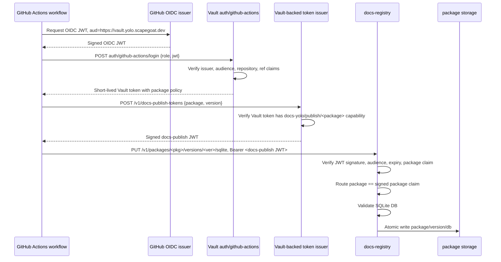
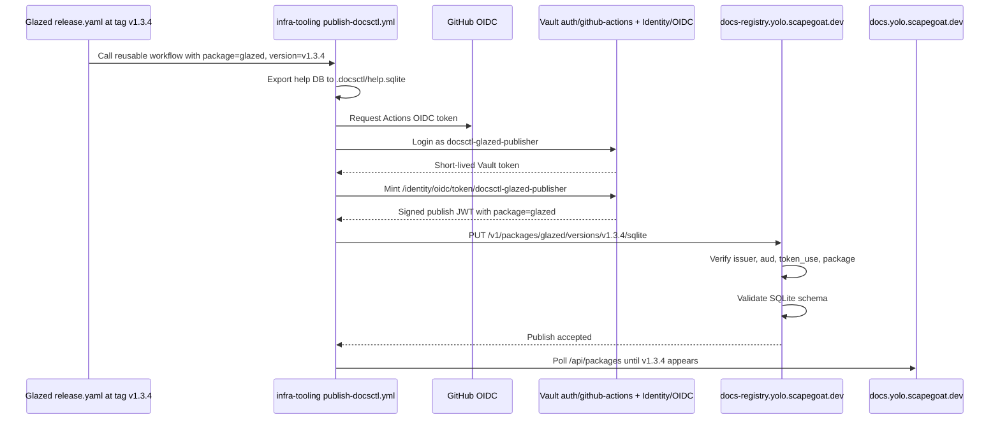
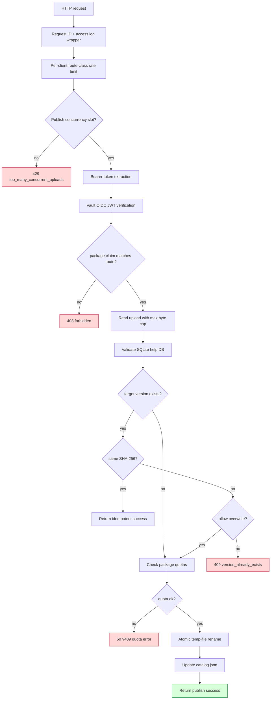
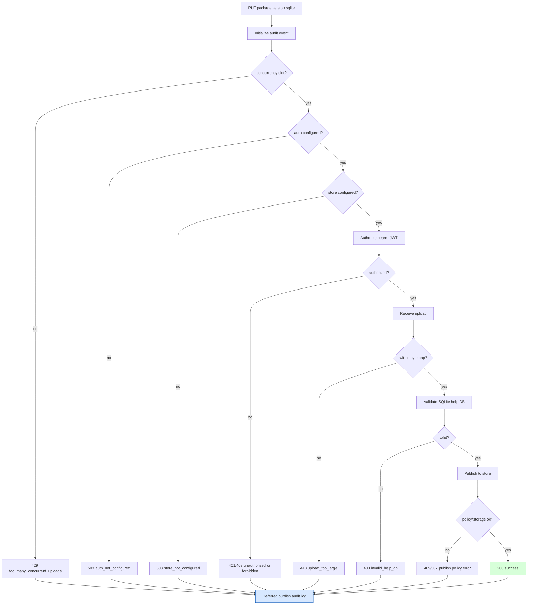
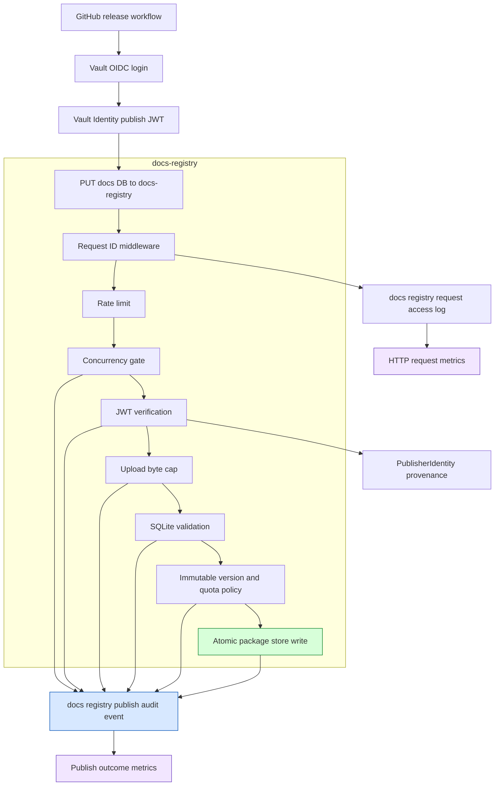

# Vault OIDC for CI/CD Docs Publishing: Designing Short-Lived Package-Scoped Credentials

This article explains how to design a CI/CD publishing system where GitHub Actions workflows upload versioned documentation artifacts to a registry, and every upload is authorized through short-lived, package-scoped credentials issued by Vault. The design eliminates long-lived repository secrets, gives each workflow an identity tied to its repository and branch, and lets the registry verify uploads without calling Vault on every request.

The reference system is `docs.yolo.scapegoat.dev`, a multi-package documentation hub built on the Glazed framework. Packages export their help content as SQLite databases in CI, upload those databases to a registry, and a browser serves them to readers. The question this article answers is: how does the registry know that a given upload is allowed, and how does it know that authorization without relying on static shared secrets?

> [!summary]
> - GitHub Actions can authenticate to Vault using OIDC identity tokens, without storing any Vault credentials in the repository. Vault validates the token claims and issues a short-lived Vault token with a narrow policy.
> - A package-scoped publish credential is a short-lived JWT whose claims include the package name, repository, ref, and audience. The registry verifies this JWT locally using Vault's public signing key.
> - The registry never calls Vault during normal upload authorization. It verifies the signed credential offline, checks that the package claim matches the upload route, and accepts or rejects before reading the upload body.
> - The authorization mapping lives in Vault roles and policies. Each role binds a repository and branch to a single package name. The registry does not need its own token catalog.

## Why this note exists

The `docs.yolo.scapegoat.dev` system already has a working publishing pipeline. Packages generate SQLite help databases, `docsctl publish` uploads them, the registry validates the schema, and the browser reloads new content. The missing piece is the authorization boundary. The initial implementation uses static bearer tokens stored in GitHub repository secrets. That approach works for bootstrapping but accumulates operational problems: token rotation, leak exposure, and the need to maintain a registry-side token catalog.

The Hetzner k3s platform already runs Vault with a proven GitHub Actions OIDC integration (documented in HK3S-0028 and the companion [[ARTICLE - Vault OIDC for GitHub Actions - Secretless CI GitOps]]). This article shows how to apply that integration to docs publishing, from the authentication handshake through the registry's JWT verification logic.

## When to use this pattern

Apply this pattern when your CI/CD system needs to authorize uploads to a central registry and the following conditions hold:

- Publishers run in GitHub Actions and can request OIDC identity tokens.
- You already operate Vault and are willing to expose its JWT auth endpoint over HTTPS.
- You want to avoid storing long-lived publish tokens in source repositories.
- Your registry should verify uploads without a runtime dependency on Vault availability.
- Each publisher should be scoped to a single package or a well-defined set of packages.

Do not use this pattern when:

- All publishers run inside the same trusted network and network locality is sufficient for authorization.
- Vault is not part of your platform and adding it would be disproportionate to the security requirement.
- The registry already uses a different identity provider (such as Sigstore or an external OIDC provider) and you want to stay within that provider's ecosystem.

## The core mental model

The publishing authorization model has three boundaries:

1. **GitHub asserts workflow identity.** When a GitHub Actions job runs with `id-token: write`, it can request a short-lived OIDC token from GitHub. That token contains claims about the repository, branch, event, commit SHA, and actor. GitHub signs it. The token is not a Vault token and it is not a docs publish credential. It is an identity assertion.

2. **Vault verifies the identity and authorizes a capability.** Vault's JWT auth method validates the GitHub OIDC token against a configured role. The role binds claims such as repository, branch, and event to a Vault policy. If the claims match, Vault issues a short-lived Vault token carrying that policy. The policy may grant access to a credential issuance endpoint.

3. **Vault issues a package-scoped publish credential.** The workflow uses its Vault token to request a publish JWT for a specific package. Vault (or a Vault-backed issuer service) signs a JWT whose claims include the package name, repository, ref, audience, and expiry. The workflow sends this JWT to the registry.

The registry then verifies the JWT offline. It checks the signature, the audience, the issuer, the expiry, and the package claim. If the package claim matches the upload route, authorization succeeds. The registry never calls Vault during this check.



The important property is that each boundary does one thing. GitHub asserts identity. Vault verifies identity and authorizes a narrow capability. The issuer mints a credential. The registry validates the credential. No component performs another component's job.

## The authorization problem in detail

Every upload to the registry must answer one question:

> Is this caller allowed to publish documentation for package `<package>` at version `<version>`?

With static tokens, the answer is based on a long-lived shared secret. The registry holds a hash table mapping token hashes to package names. When an upload arrives, the registry hashes the bearer token, looks it up, and checks whether the hash's package matches the route.

That model has three weaknesses. First, the token is long-lived. If it leaks through CI logs, repository settings, or a misconfigured workflow, an attacker can publish until the token is rotated. Second, the token does not carry provenance. It proves that the caller knows a secret, but not which workflow, which commit, or which branch produced the upload. Third, onboarding new packages requires operator intervention: create a token, store its hash in the registry catalog, rotate it later.

The OIDC model replaces all of that. The workflow's identity is derived from its GitHub Actions context. Vault maps that identity to a package capability. The registry verifies the capability offline. No shared secrets exist in any repository.

## The existing platform: what already works

The docs-yolo system and the k3s platform already provide the building blocks. Understanding what exists prevents redesigning what works.

### The registry already has an auth abstraction

The Glazed publishing package defines a `PublisherAuth` interface. The registry does not directly inspect token catalog internals. It calls `AuthorizePublish` with a raw bearer token and a `PublishRequest` containing the package name and version.

```go
type PublishRequest struct {
    PackageName string
    Version     string
}

type PublisherIdentity struct {
    Subject     string
    PackageName string
    Method      string
}

type PublisherAuth interface {
    AuthorizePublish(ctx context.Context, rawToken string, req PublishRequest) (*PublisherIdentity, error)
}
```

This interface is the seam to preserve. A JWT-based implementation satisfies the same contract. The registry handler does not change.

### The registry authorizes before reading the upload body

The upload route is:

```text
PUT /v1/packages/{package}/versions/{version}/sqlite
```

The handler extracts the package and version from the URL, builds a `PublishRequest`, and calls `AuthorizePublish` before receiving the upload body. Unauthorized callers are rejected without forcing the server to allocate a temporary file. This ordering is correct for a public or semi-public endpoint and should remain.

### SQLite validation and storage are separate from auth

After authorization, the registry receives the upload into a temporary file, validates the SQLite schema and metadata, and writes the DB atomically into the package store. The authorization project does not need to redesign validation or storage. It only needs to change how `AuthorizePublish` decides yes or no.

### The k3s platform already has GitHub Actions OIDC to Vault

HK3S-0028 established the pattern: GitHub Actions authenticates to Vault through `auth/github-actions`, a JWT auth mount configured with `https://token.actions.githubusercontent.com` as the issuer. The bootstrap script at `scripts/bootstrap-vault-github-actions-oidc.sh` creates the mount, configures the issuer, and writes role and policy files from the `vault/roles/github-actions/` and `vault/policies/github-actions/` directories.

The production roles are tightly bound. The bot-signup role, for example, accepts only tokens where:

- `repository_owner` is `wesen`
- `repository` is `wesen/2026-05-01--bot-signup`
- `ref` is `refs/heads/main`
- `event_name` is `push`
- `audience` is `https://vault.yolo.scapegoat.dev`

The TTL is 10 minutes, with a 30-minute maximum. The policy grants `read` on exactly one KV v2 path. This is the pattern to copy for docs publishing roles.

### The docs-yolo deployment currently uses a static publisher catalog

The production deployment mounts a `publishers.json` ConfigMap into the registry container. The ConfigMap currently contains an empty publisher list:

```json
{
  "publishers": []
}
```

The registry requires `--publisher-catalog /etc/docs-yolo/publishers.json` as a startup flag. The target design removes this dependency from production and replaces it with JWT verification configuration.

## The credential design

The registry-facing credential is a signed JWT. Its purpose is narrow: it proves that Vault authorized the bearer to publish a specific package. The registry verifies it locally and checks that its claims match the upload request.

### JWT claims

```json
{
  "iss": "https://vault.yolo.scapegoat.dev/v1/docs-yolo-publish",
  "sub": "repo:wesen/pinocchio:ref:refs/heads/main",
  "aud": ["docs-yolo-registry"],
  "exp": 1777777777,
  "nbf": 1777777477,
  "iat": 1777777477,
  "jti": "01J...",
  "repository_owner": "wesen",
  "repository": "wesen/pinocchio",
  "ref": "refs/heads/main",
  "event_name": "push",
  "workflow": "publish-docs.yml",
  "package": "pinocchio",
  "allowed_versions": ["*"]
}
```

Each claim has a purpose:

| Claim | Purpose |
|---|---|
| `iss` | The registry rejects tokens whose issuer does not match its configuration. |
| `sub` | Human-readable identity string for audit logs. |
| `aud` | The token must be intended for `docs-yolo-registry`. Prevents cross-service token reuse. |
| `exp` | Short expiry, typically 5–15 minutes, limits the window if the token is exposed. |
| `nbf` | Rejects tokens used before their valid time. |
| `iat` | Supports max-age enforcement and audit correlation. |
| `jti` | Unique identifier per token. Enables replay detection in a future enhancement. |
| `repository` | Which repository produced this credential. Audit and optional defense-in-depth. |
| `ref` | Which branch or tag triggered the workflow. Audit and optional defense-in-depth. |
| `event_name` | Which GitHub event triggered the workflow. The registry can reject non-`push` events. |
| `package` | The primary authorization claim. Must equal the upload route package. |
| `allowed_versions` | Optional glob pattern restricting which version strings this token may publish. |

### Registry verification rules

The registry must reject the upload unless all of the following hold:

1. The token is a syntactically valid JWT.
2. The signature verifies against the trusted issuer key material (a mounted public key or a JWKS endpoint).
3. `iss` equals the configured issuer string.
4. `aud` contains the configured audience, for example `docs-yolo-registry`.
5. `exp`, `nbf`, and `iat` are valid with small clock skew tolerance.
6. The `package` claim exists and passes `ValidatePackageName`.
7. The route `{package}` parameter equals the signed `package` claim. This is the core authorization check.
8. The route `{version}` parameter passes `ValidateVersion`.
9. Optionally, `repository`, `ref`, and `event_name` match a non-secret allowlist loaded from a ConfigMap, as a defense-in-depth layer.

The verification pseudocode:

```go
func (a *JWTPublisherAuth) AuthorizePublish(
    ctx context.Context,
    bearer string,
    req PublishRequest,
) (*PublisherIdentity, error) {
    if bearer == "" {
        return nil, ErrUnauthorized
    }
    if err := ValidatePackageVersion(req.PackageName, req.Version); err != nil {
        return nil, err
    }

    claims, err := a.VerifyAndDecode(ctx, bearer)
    if err != nil {
        return nil, ErrUnauthorized
    }
    if !claims.Audience.Contains(a.Audience) {
        return nil, ErrUnauthorized
    }
    if claims.Issuer != a.Issuer {
        return nil, ErrUnauthorized
    }
    if claims.Package != req.PackageName {
        return nil, ErrForbidden
    }
    if claims.Repository == "" || claims.Ref == "" {
        return nil, ErrUnauthorized
    }
    if claims.EventName != "push" {
        return nil, ErrForbidden
    }
    if a.Allowlist != nil &&
        !a.Allowlist.Allows(claims.Repository, claims.Ref, claims.Package) {
        return nil, ErrForbidden
    }

    return &PublisherIdentity{
        Subject:     claims.Subject,
        PackageName: claims.Package,
        Method:      "vault-jwt",
        Repository:  claims.Repository,
        Ref:         claims.Ref,
        Workflow:    claims.Workflow,
    }, nil
}
```

The important check is `claims.Package != req.PackageName`. The JWT claims a specific package. The upload route specifies a specific package. If they differ, the caller is trying to publish a package they were not authorized for. The registry must reject this regardless of any other claim.

## The Vault design

### Reuse the existing GitHub Actions auth mount

Do not create a new auth mount. `auth/github-actions` already exists and is configured with GitHub's issuer. The docs publishing roles live alongside the existing GitOps PR roles:

```text
vault/roles/github-actions/docs-publish-pinocchio.json
vault/roles/github-actions/docs-publish-glazed.json
vault/policies/github-actions/docs-publish-pinocchio.hcl
vault/policies/github-actions/docs-publish-glazed.hcl
```

### Role shape

Each package gets one role. The role binds the GitHub Actions OIDC token to a single repository, branch, event, and audience. If a repository owns multiple packages, create one role per package so that audit logs and policy names stay obvious.

```json
{
  "role_type": "jwt",
  "user_claim": "repository",
  "bound_audiences": ["https://vault.yolo.scapegoat.dev"],
  "bound_claims": {
    "repository_owner": "wesen",
    "repository": "wesen/pinocchio",
    "ref": "refs/heads/main",
    "event_name": "push"
  },
  "policies": ["gha-docs-publish-pinocchio"],
  "ttl": "10m",
  "max_ttl": "30m",
  "token_explicit_max_ttl": "30m"
}
```

For immutable version publishing (releases), bind to tag refs instead of branch refs:

```json
{
  "bound_claims": {
    "repository_owner": "wesen",
    "repository": "wesen/pinocchio",
    "ref_type": "tag",
    "event_name": "push"
  }
}
```

Do not allow arbitrary branches to publish immutable package versions. The role constraints should match the trust model: main-branch pushes for mutable docs, tag pushes for immutable releases.

### Policy shape

The policy grants access to a package-specific credential issuance endpoint. The literal path depends on the issuance mechanism (discussed next), but the intent is:

```hcl
path "docs-yolo-publish/issue/pinocchio" {
  capabilities = ["update"]
}

path "auth/token/lookup-self" {
  capabilities = ["read"]
}

path "auth/token/renew-self" {
  capabilities = ["update"]
}

path "auth/token/revoke-self" {
  capabilities = ["update"]
}
```

The path `docs-yolo-publish/issue/pinocchio` does not have to store real data. It is an authorization namespace. The issuer checks whether the caller's Vault token has `update` capability on that path before minting a publish JWT.

### Credential issuance mechanism

The registry-facing contract is a signed JWT. How Vault produces that JWT determines the implementation complexity and the security properties. There are three approaches, in order of preference.

**Option A: Vault identity tokens.** Vault's identity secrets engine can issue signed JWTs that encapsulate entity metadata. The workflow authenticates to Vault, and then requests an identity token whose claims include the entity aliases and metadata set by the GitHub Actions login. The registry verifies these tokens using Vault's JWKS endpoint.

This is the conceptually cleanest approach because Vault itself is the issuer and the policy engine. The claims are derived from the authenticated entity rather than from arbitrary caller-supplied input. The limitation is that identity tokens carry Vault's entity model, and custom application claims such as `package` and `allowed_versions` may need to be stored as entity metadata or aliases. Whether this works depends on the granularity of Vault's identity token claim customization.

**Option B: A small broker service backed by Vault Transit.** A `docs-token-issuer` service runs inside the cluster. It accepts a Vault token, verifies capabilities on the package-specific path, constructs the JWT claims, and asks Vault Transit to sign the canonical JWT input. The service returns the signed JWT.

This approach centralizes JWT construction server-side. The claim shape is fully controlled by the broker, not by the caller. `docsctl` stays simple: it receives a JWT and sends it to the registry. The downside is an additional service to deploy, monitor, and authenticate.

**Option C: `docsctl` constructs the JWT and asks Vault Transit to sign.** The workflow logs into Vault, and then `docsctl` builds the JWT header and payload locally, asks Vault Transit to sign the signing input, and assembles the compact JWT.

This approach requires no broker service. It is also the most dangerous if not constrained correctly. Vault Transit signs arbitrary bytes. If the signing key is generic and shared across packages, a compromised or misconfigured workflow could sign a JWT claiming any package. The mitigation is to use one Transit signing key per package and configure the registry to map key ID (`kid`) to the allowed package. Without per-package keys or an independent allowlist, raw transit signing from CI is unsafe.

**Recommended choice.** Start with Option B if Vault identity tokens do not support the required custom claims. Option B gives full control over claim construction, keeps CI scripts simple, and avoids the arbitrary-signing risk of Option C. If Vault identity tokens can be made to carry the `package` claim (for example, through entity metadata populated at login), Option A is preferable because it requires no additional service.

### The unsafe shortcut and why it matters

The distinction between Option B and Option C is subtle but important. Consider what happens if a workflow can ask Vault Transit to sign any bytes with a trusted key:

```text
Workflow builds: {"package": "glazed", ...}  (arbitrary claim)
Workflow asks Transit to sign those bytes
Transit signs because the workflow's policy grants "update" on the transit key path
Workflow now has a valid JWT claiming it can publish "glazed"
But the workflow's Vault role only authorizes it for "pinocchio"
```

The Vault role correctly constrains which Vault policies the workflow receives. But if the policy grants broad transit signing access and the registry trusts any JWT signed by that key, the role constraint is bypassed at the application layer. The signature is valid, but the claim is fabricated.

Three mitigations exist:

1. **Per-package signing keys.** Each package gets its own Transit key. The registry maps `kid` to package. A workflow authorized for `pinocchio` can only sign with the `pinocchio` key. A `glazed` claim signed with the `pinocchio` key would have the wrong `kid`.

2. **Broker with claim enforcement.** The broker constructs claims based on the Vault token's capabilities, not based on caller-supplied input. The workflow cannot inject a `package` claim for a different package because the broker will not construct it.

3. **Registry-side allowlist.** The registry checks `repository`, `ref`, and `package` against a non-secret ConfigMap that lists the authorized mapping. This is defense-in-depth: even if a JWT has a valid signature, the registry rejects it if the mapping does not match.

Option B provides mitigation 2 by construction. Option C requires mitigation 1 or 3 as an additional safeguard. Option A, if available, provides mitigation at the Vault layer because Vault controls the claims.

## The registry design

### Auth modes

The registry should support explicit auth modes selectable by configuration:

```text
--auth-mode static-token    # local development fallback
--auth-mode vault-jwt       # production
```

In production, the registry uses:

```text
--auth-mode vault-jwt
--jwt-issuer https://vault.yolo.scapegoat.dev/v1/docs-yolo-publish
--jwt-audience docs-yolo-registry
--jwt-jwks-url https://vault.yolo.scapegoat.dev/v1/docs-yolo-publish/.well-known/jwks.json
```

If JWKS is not available, a mounted public key works:

```text
--jwt-public-key /etc/docs-yolo-jwt/public.pem
```

The `--publisher-catalog` flag remains required only when `--auth-mode static-token` is selected.

### New types

```go
type JWTPublisherAuth struct {
    Issuer      string
    Audience    string
    KeySet      JWTKeySet
    Clock       func() time.Time
    MaxTokenAge time.Duration
    Leeway      time.Duration
    Allowlist   *PublishAllowlist // optional defense-in-depth
}

type PublishJWTClaims struct {
    jwt.RegisteredClaims
    Package         string `json:"package"`
    Repository      string `json:"repository"`
    RepositoryOwner string `json:"repository_owner,omitempty"`
    Ref             string `json:"ref"`
    EventName       string `json:"event_name"`
    Workflow        string `json:"workflow,omitempty"`
    AllowedVersions string `json:"allowed_versions,omitempty"`
}
```

Implementation notes:

- Use a maintained JOSE/JWT library. Do not implement signature verification by hand.
- Validate algorithms. Accept only configured algorithms such as `RS256` or `EdDSA`. Reject `none` unconditionally.
- Cache JWKS with a short TTL and refresh on unknown `kid`.
- Fail closed if JWKS cannot be loaded and no cached key is valid.

### Authorization preserves the existing handler shape

The registry handler does not change its control flow. It extracts the bearer token, calls `AuthorizePublish`, and proceeds or rejects:

```go
func (h *Handler) PublishSQLite(w http.ResponseWriter, r *http.Request) {
    packageName := r.PathValue("package")
    version := r.PathValue("version")
    token := bearerToken(r.Header.Get("Authorization"))

    identity, err := h.Auth.AuthorizePublish(r.Context(), token, PublishRequest{
        PackageName: packageName,
        Version:     version,
    })
    if err != nil {
        writeAuthError(w, err)
        return
    }

    // ... receive upload, validate SQLite, publish to store ...
}
```

The `PublisherAuth` interface is satisfied by either `StaticTokenAuth` or `JWTPublisherAuth`. The handler is agnostic to the auth mode.

## The `docsctl publish` design

### Credential modes

`docsctl publish` should support three credential modes:

1. `--publish-jwt` or `DOCS_YOLO_PUBLISH_JWT`: the caller already has a short-lived JWT.
2. `--publish-jwt-file`: file containing the JWT.
3. Vault OIDC helper mode: `docsctl` obtains the JWT by logging into Vault and requesting a publish credential.

The old `--token` flag remains as a deprecated alias for `--auth-mode static-token` only.

### GitHub Actions OIDC acquisition

In GitHub Actions, the workflow grants `id-token: write`. The workflow can either use `hashicorp/vault-action` or `docsctl` can request the GitHub OIDC token directly from the environment variables GitHub exposes:

```go
func requestGitHubOIDCToken(ctx context.Context, audience string) (string, error) {
    baseURL := os.Getenv("ACTIONS_ID_TOKEN_REQUEST_URL")
    requestToken := os.Getenv("ACTIONS_ID_TOKEN_REQUEST_TOKEN")
    if baseURL == "" || requestToken == "" {
        return "", errors.New("GitHub Actions OIDC environment not available")
    }
    url := baseURL + "&audience=" + url.QueryEscape(audience)
    req, _ := http.NewRequestWithContext(ctx, "GET", url, nil)
    req.Header.Set("Authorization", "Bearer "+requestToken)
    // ... fetch and decode {"value": "<jwt>"} ...
}
```

Then Vault login:

```go
func loginVaultGitHubActions(ctx context.Context, vaultAddr, authPath, role, oidcJWT string) (string, error) {
    body := map[string]string{"role": role, "jwt": oidcJWT}
    // POST vaultAddr + "/v1/auth/" + authPath + "/login"
    // return response.auth.client_token
}
```

Then credential issuance:

```go
func issueDocsPublishJWT(ctx context.Context, vaultAddr, vaultToken, issuePath, pkg string) (string, error) {
    body := map[string]string{"package": pkg, "audience": "docs-yolo-registry"}
    // POST vaultAddr + "/v1/" + issuePath
    // Header: X-Vault-Token: vaultToken
    // return response.data.jwt
}
```

### CI workflow sketch

```yaml
name: Publish docs

on:
  push:
    tags: ['v*']
  workflow_dispatch: {}

permissions:
  contents: read
  id-token: write

jobs:
  publish-docs:
    runs-on: ubuntu-latest
    steps:
      - uses: actions/checkout@v4

      - uses: actions/setup-go@v5
        with:
          go-version: '1.26.x'

      - name: Build help DB
        run: |
          go run ./cmd/pinocchio help export-sqlite --output ./pinocchio-help.db

      - name: Publish docs
        run: |
          go install github.com/go-go-golems/glazed/cmd/docsctl@latest
          docsctl publish \
            --server https://registry.docs.yolo.scapegoat.dev \
            --package pinocchio \
            --version "${GITHUB_REF_NAME}" \
            --file ./pinocchio-help.db \
            --auth-mode vault-jwt \
            --vault-addr https://vault.yolo.scapegoat.dev \
            --vault-auth-path github-actions \
            --vault-role docs-publish-pinocchio \
            --vault-audience https://vault.yolo.scapegoat.dev \
            --vault-issue-path docs-yolo-publish/issue/pinocchio
```

For the first rollout, prefer `workflow_dispatch` or tag-based publishing rather than every push to `main`. This limits blast radius while the auth integration is validated.

## Network topology: exposing the registry

The registry is currently a cluster-internal `ClusterIP` service. GitHub-hosted Actions runners cannot reach it directly. There are three options.

**Option R1: Public registry hostname with JWT auth.** Expose `https://registry.docs.yolo.scapegoat.dev` through an Ingress. JWT auth provides application-layer protection. Add ingress body size limits and rate limits. This is the simplest path for GitHub-hosted runners.

**Option R2: Self-hosted runner.** Run a GitHub Actions runner inside the cluster or private network. The registry stays internal. This reduces public attack surface but adds operational complexity for the runner infrastructure.

**Option R3: GitOps artifact PR.** CI opens a PR with the SQLite DB as an artifact. Argo CD syncs after merge. This avoids exposing the registry entirely, but binary SQLite DBs in Git are a poor fit, and the merge delay makes rapid iteration impractical.

For `docs.yolo.scapegoat.dev`, Option R1 is recommended. The registry already rejects unauthorized callers before reading the upload body. JWT auth is a strong application-layer gate. Ingress limits constrain abuse. The existing Traefik ingress controller and cert-manager infrastructure can create the registry hostname with the same pattern used for the browser.

Ingress manifest:

```yaml
apiVersion: networking.k8s.io/v1
kind: Ingress
metadata:
  name: docs-yolo-registry
  annotations:
    cert-manager.io/cluster-issuer: letsencrypt-prod
spec:
  ingressClassName: traefik
  tls:
    - hosts:
        - registry.docs.yolo.scapegoat.dev
      secretName: docs-yolo-registry-tls
  rules:
    - host: registry.docs.yolo.scapegoat.dev
      http:
        paths:
          - path: /
            pathType: Prefix
            backend:
              service:
                name: docs-yolo-registry
                port:
                  number: 80
```

## Deployment changes

### Current registry args (to be replaced)

```yaml
- --publisher-catalog
- /etc/docs-yolo/publishers.json
```

### Target registry args

```yaml
- --auth-mode
- vault-jwt
- --jwt-issuer
- https://vault.yolo.scapegoat.dev/v1/docs-yolo-publish
- --jwt-audience
- docs-yolo-registry
- --jwt-jwks-url
- https://vault.yolo.scapegoat.dev/v1/docs-yolo-publish/.well-keys/jwks.json
```

### What to remove

- The `docs-yolo-publisher-catalog` ConfigMap.
- The `--publisher-catalog` volume mount.
- The `publisher-catalog.yaml` entry from `kustomization.yaml`.

The static-token code path can remain in the binary for local development, but production should not depend on it.

## Implementation sequence

The implementation should proceed in five phases. Each phase preserves the invariant that a repository can publish only the package that Vault grants.

### Phase 0: Confirm the credential issuance mechanism

Decide whether Vault identity tokens support the required custom claims (`package`, `allowed_versions`). If yes, use Option A. If not, implement the broker service (Option B). Document the signing algorithm, issuer string, key distribution method, and token TTL.

Acceptance criteria: one command can produce a short-lived JWT with `package=pinocchio` after Vault OIDC login, and the JWT can be verified offline with public key material.

### Phase 1: Add JWT auth to the registry

Add `JWTPublisherAuth` to `pkg/help/publish/jwt_auth.go`. Add registry flags for `--auth-mode`, `--jwt-issuer`, `--jwt-audience`, `--jwt-jwks-url` or `--jwt-public-key`. Keep `--publisher-catalog` required only when `--auth-mode static-token`. Add unit tests covering:

| Test | Expected result |
|---|---|
| Valid token, matching package | success |
| Valid token, wrong route package | `ErrForbidden` |
| Expired token | `ErrUnauthorized` |
| Wrong audience | `ErrUnauthorized` |
| Wrong issuer | `ErrUnauthorized` |
| Missing `package` claim | `ErrUnauthorized` |
| `alg=none` | `ErrUnauthorized` |
| Unknown `kid` | `ErrUnauthorized` |

### Phase 2: Add Vault-aware publishing to `docsctl`

Add `--auth-mode vault-jwt` to `docsctl publish`. Add `--publish-jwt` and `--publish-jwt-file` flags. Add GitHub Actions OIDC token request and Vault login helpers. Preserve local DB validation before token issuance. Add tests with mocked GitHub OIDC and Vault responses.

### Phase 3: Add Vault roles and policies in the k3s repo

Add one role per package repository under `vault/roles/github-actions/`. Add matching policies under `vault/policies/github-actions/`. Run the bootstrap script. Validate with `vault read auth/github-actions/role/docs-publish-pinocchio`.

### Phase 4: Update docs-yolo deployment and CI

Change the registry auth mode to `vault-jwt` in the deployment manifest. Add the registry ingress. Remove the publisher catalog ConfigMap. Add a CI workflow for one pilot package (preferably `pinocchio`). Publish a test version and verify the browser shows it.

### Phase 5: Onboard remaining packages

Add roles and policies for `glazed` and any other packages. Publish real tag-based versions. Remove the static token code path from production configuration.

## Common failure modes

### `id-token: write` is missing from the workflow

The workflow cannot request a GitHub OIDC token. Vault will never receive a JWT, so login cannot proceed. The fix is to add `id-token: write` to the workflow's `permissions` block.

### The audience does not match

Vault checks `bound_audiences` on the role. The workflow's requested audience and the role's bound audience must match exactly. A mismatch produces a login failure, not a capability error.

### The branch or event does not match

Production roles accept only specific refs and events. A `workflow_dispatch`, `pull_request`, or feature-branch run will not match the role. That is intentional. If a package needs to publish from a different context, create a separate role with appropriate constraints.

### The Vault token has the wrong policy

A workflow may successfully log into Vault but lack the policy to access the credential issuance endpoint. The symptoms are a 403 from Vault when requesting the publish JWT. Verify that the role attaches the correct policy and the policy grants `update` on the correct path.

### The JWT package claim does not match the route

The registry rejects the upload with `ErrForbidden`. This happens when the caller has a valid JWT for one package but tries to upload to a different package route. The fix is to use the correct `--package` flag in `docsctl publish`.

### JWKS is unreachable

If the registry is configured with `--jwt-jwks-url` and cannot reach Vault, JWTs with unknown `kid` values will fail verification. Cached keys continue to work until their TTL expires. The registry should fail closed: if no valid key is available, reject the upload. Do not fall back to accepting unsigned or unverifiable tokens.

### JWT replay within TTL

A valid JWT can be reused within its TTL window. Because uploads are idempotent per package and version (they overwrite the same path atomically), replay produces the same result. The risk is unnecessary repeated work, not data corruption. A future enhancement can add an in-memory `jti` cache with a TTL matching the token expiry.

## Security properties

The completed system has these properties:

- GitHub Actions receives a Vault token only after Vault validates the GitHub OIDC token's issuer, audience, repository, ref, and event.
- The Vault token is short-lived: 10 minutes by default, 30 minutes maximum.
- Each Vault policy grants access to exactly one package-specific credential issuance path.
- The publish JWT is short-lived: typically 5–15 minutes.
- The registry verifies the JWT offline. Vault downtime does not prevent uploads that already hold valid credentials.
- The registry checks that the signed `package` claim equals the upload route package. A JWT for one package cannot be used to publish another.
- Pull request workflows do not match production publishing roles because the roles bind `event_name=push` and trusted refs only.
- Source repositories do not contain long-lived docs publish secrets.
- The registry rejects path traversal in package and version names before any filesystem operation.

## Package ownership as the source of truth

The mapping from repository to package name lives in Vault roles and policies. A GitOps-managed catalog can drive role creation:

```yaml
apiVersion: docs.yolo.scapegoat.dev/v1alpha1
kind: PackagePublisherCatalog
packages:
  pinocchio:
    displayName: Pinocchio
    ownerRepos:
      - wesen/pinocchio
    allowedRefs:
      - type: tag
        pattern: v*
    vaultRole: docs-publish-pinocchio
    vaultPolicy: gha-docs-publish-pinocchio
  glazed:
    displayName: Glazed
    ownerRepos:
      - wesen/glazed
    allowedRefs:
      - type: branch
        pattern: main
      - type: tag
        pattern: v*
    vaultRole: docs-publish-glazed
    vaultPolicy: gha-docs-publish-glazed
```

The catalog drives Vault role creation, policy creation, and onboarding documentation. It is not a runtime dependency of the registry. The registry verifies signed claims, not the catalog.

## Rollback plan

If JWT auth breaks in production:

1. Keep static-token auth available behind a configuration flag.
2. Switch `--auth-mode` back to `static-token` in the deployment.
3. Re-deploy with the known-good configuration.
4. Investigate the JWT failure mode (key rotation, JWKS unavailability, claim mismatch).
5. Fix and re-enable `vault-jwt` mode.

If the credential issuer breaks:

1. Reconfigure the registry to accept Vault client tokens directly (Phase 2 fallback, where the registry calls `sys/capabilities-self` on Vault).
2. Leave the issuer deployed but unused while investigating.

## Anti-patterns

### Using a single generic Transit signing key for all packages

This creates a single point of trust escalation. Any workflow that can sign with the generic key can forge a JWT claiming any package. Use per-package keys, a claim-enforcing broker, or Vault identity tokens.

### Accepting arbitrary `package` claims from caller-supplied input

The credential issuer must derive the `package` claim from the Vault token's policy, not from the HTTP request body. If the issuer trusts the caller to specify the package, the system degrades to self-attestation.

### Bypassing the registry to write directly to the PVC

The PVC is writable by the registry container. If a workflow or process writes directly to the PVC without going through the registry, the content is unvalidated and unaudited. The registry must be the only write path.

### Binding roles to `pull_request` events

Pull request workflows run untrusted code. A contributor can modify the workflow to exfiltrate any credential the workflow receives. Production publishing roles must bind to `push` events on trusted branches only.

### Storing the Vault token in the registry

In Phase 2 (where the registry calls Vault's `sys/capabilities-self`), the registry receives a Vault client token. That token should not be stored, logged, or reused beyond the single capabilities check. Phase 3 eliminates the need for the registry to handle Vault tokens at all by using signed JWTs instead.

## Working rules

- A repository can publish only the package that Vault grants to that repository, and the registry must independently verify that the upload route package equals the signed package claim.
- Every publish JWT must have a short expiry and a unique `jti`. The registry should reject tokens whose `exp` is more than a configured max age from `iat`.
- The registry must authorize before reading the upload body. An unauthorized caller should not force the server to allocate storage.
- The registry must validate the SQLite database after authorization and before writing to the package store. Invalid uploads are rejected, not stored.
- Vault roles must bind `event_name=push` and trusted refs. Do not bind production publishing roles to `pull_request`.
- The `--publisher-catalog` ConfigMap should not exist in production after the migration is complete.


## 2026-05-26 production implementation update

The design above has now been partially implemented and proven in production, with one important correction to the original architecture. The registry-facing credential is not issued by a custom broker service and it is not signed through raw Vault Transit. The production path uses **Vault Identity/OIDC tokens** directly. GitHub Actions first authenticates to Vault with GitHub's OIDC token. The resulting short-lived Vault token can then call Vault's Identity/OIDC token endpoint for one package-specific role. Vault returns an OIDC-compliant JWT whose issuer and signing keys are exposed through Vault's Identity OIDC discovery endpoints. `docs-registry` verifies that JWT offline through OIDC discovery and JWKS.

This keeps the clean property the design wanted: the registry does not need to call Vault during uploads. It also avoids the unsafe raw-Transit shortcut. Vault constructs and signs the publish token, Terraform defines the package-specific token roles, and the registry only accepts tokens with the correct issuer, audience, token purpose, and package claim.

> [!important]
> The implementation status is: **publishing is production-proven; full documentation-site SSR is not yet complete**. The publish path can mint a package-scoped JWT in a release workflow and upload docs to the public registry. The docs site now has an SSR sidecar and direct deep-link routing works, but the HTML is still largely an SSR shell plus metadata/preloaded JSON/hydration rather than a fully rendered static article/tree for every page.

### What changed from the initial design

The original design described several possible credential issuance mechanisms. Production chose Vault Identity/OIDC tokens, with these concrete values:

| Concern | Production value |
|---|---|
| Registry auth mode | `vault-oidc-jwt` |
| Registry issuer | `https://vault.yolo.scapegoat.dev/v1/identity/oidc` |
| Registry audience/client ID | `docs-registry` |
| Vault Identity issuer configuration | `https://vault.yolo.scapegoat.dev` |
| Discovery URL | `https://vault.yolo.scapegoat.dev/v1/identity/oidc/.well-known/openid-configuration` |
| JWKS URL | `https://vault.yolo.scapegoat.dev/v1/identity/oidc/.well-known/keys` |
| Publish token purpose claim | `token_use: docsctl-publish` |
| Package authorization claim | `package: <package>` |
| Registry upload endpoint | `PUT /v1/packages/{package}/versions/{version}/sqlite` |
| Public registry host | `https://docs-registry.yolo.scapegoat.dev` |

There are two issuer strings that look similar but are not interchangeable:

- Terraform configures Vault Identity/OIDC with the root issuer `https://vault.yolo.scapegoat.dev` because Vault's `vault_identity_oidc` resource accepts only a scheme, host, and optional port.
- The registry verifies tokens against the discovery issuer `https://vault.yolo.scapegoat.dev/v1/identity/oidc`, because that is what Vault advertises in the OIDC discovery document.

This mismatch was one of the first real implementation traps. Setting the Terraform issuer to `/v1/identity/oidc` failed with:

```text
invalid issuer, which must include only a scheme, host, and optional port (e.g. https://example.com:8200)
```

The second trap was Vault Identity token template syntax. Dynamic placeholders in the token template render JSON fragments. Quoting them produced invalid JSON during token issuance:

```text
error parsing template JSON: invalid character '"' after object key:value pair
```

The fix was to use unquoted dynamic placeholders in the Vault token templates where Vault expects to render JSON values.

### Implemented registry auth mode

The Glazed registry now has two auth modes:

```text
--auth-mode static-catalog
--auth-mode vault-oidc-jwt
```

`static-catalog` remains the default rollback/local-development path. Production uses `vault-oidc-jwt`:

```text
/usr/local/bin/docs-registry \
  --address :8090 \
  --package-root /var/lib/glazed-docs/packages \
  --auth-mode vault-oidc-jwt \
  --jwt-issuer https://vault.yolo.scapegoat.dev/v1/identity/oidc \
  --jwt-client-id docs-registry
```

The implementation lives in the Glazed repository:

- `/home/manuel/workspaces/2026-05-25/docsctl-cicd-deploy/glazed/pkg/help/publish/jwt_auth.go`
- `/home/manuel/workspaces/2026-05-25/docsctl-cicd-deploy/glazed/pkg/help/publish/jwt_auth_test.go`
- `/home/manuel/workspaces/2026-05-25/docsctl-cicd-deploy/glazed/cmd/docs-registry/main.go`

The registry verification rules are deliberately small and application-specific:

1. Verify the JWT through OIDC discovery and JWKS using `github.com/coreos/go-oidc/v3/oidc`.
2. Require the configured issuer.
3. Require the configured client ID / audience: `docs-registry`.
4. Require `token_use == "docsctl-publish"`.
5. Require a `package` claim.
6. Require the signed `package` claim to equal the `{package}` route parameter.

The unit tests cover the cases that matter for this authorization boundary: valid token, wrong package, wrong audience, wrong issuer, expired token, tampered token, missing `token_use`, and missing `package`. The most important test is the wrong-package case: a valid token for `pinocchio` must not publish `glazed`.

### Terraform shape for package-scoped Vault roles

Terraform now defines the docs publishing identity graph for the k3s Vault environment. The implementation is in:

- `/home/manuel/code/wesen/terraform/vault/github-actions/envs/k3s/main.tf`
- `/home/manuel/code/wesen/terraform/vault/github-actions/envs/k3s/variables.tf`

The current publisher set is:

| Package | Repository ID |
|---|---:|
| `glazed` | `565461475` |
| `pinocchio` | `802670903` |
| `remarquee` | `1116463013` |
| `sqleton` | `579241534` |

The numeric `repository_id` is intentionally used as a bound claim. Repository names can be renamed or, in some threat models, reused. Numeric repository IDs are more stable identifiers for GitHub repositories.

For each package, Terraform creates or manages:

- a Vault Identity/OIDC token role such as `docsctl-glazed-publisher`;
- a Vault policy that permits minting only that package's token role;
- a GitHub Actions JWT auth backend role that binds repository identity, release workflow context, and tag refs;
- a shared docs registry OIDC key and issuer configuration.

The final production binding is release-workflow/tag based. In other words, documentation publishing is not a random push-to-main side effect. It is part of the release workflow and uses the release tag as the documentation version. The Vault role binding allows workflow refs like:

```text
*/.github/workflows/release.yaml@refs/tags/v*
```

This is an important trust boundary. A publish token should be minted from the release workflow running at an immutable release tag, not from arbitrary pull requests or ad-hoc branch workflows.

### Reusable GitHub Actions workflow

The publish mechanics are centralized in a reusable workflow in infra-tooling:

- `/home/manuel/code/wesen/go-go-golems/infra-tooling/.github/workflows/publish-docsctl.yml`

The workflow does the following:

1. Checks out the package repository.
2. Sets up Go.
3. Computes package/version/export settings.
4. Installs `docsctl`.
5. Exports the help database to SQLite.
6. Logs into Vault with `hashicorp/vault-action@v3` using GitHub Actions OIDC.
7. Mints a Vault Identity/OIDC publish JWT from `/v1/identity/oidc/token/<role>`.
8. Masks the token in logs.
9. Decodes and prints non-sensitive JWT claims for auditability.
10. Runs `docsctl publish --token-file` against the public registry.
11. Verifies the package/version through the public docs API with retries.

The verification retry is not cosmetic. `docs-registry` writes the SQLite package immediately, but `docs-browser` reloads package files on an interval. The first verification implementation could publish successfully and then fail because `/api/packages` had not reloaded yet. The workflow now retries verification so the CI job matches the runtime behavior of the browser.

The verifier also had to be corrected for the deployed API shape. The live `/api/packages` endpoint returns an object like:

```json
{
  "packages": [
    {
      "name": "glazed",
      "versions": ["v1.3.4", "v1.3.3", "v1.2.15"],
      "latestVersion": "v1.3.4"
    }
  ],
  "defaultPackage": "glazed",
  "defaultVersion": "v1.3.4"
}
```

It is not a flat array of `{name, version}` rows. The initial verifier assumed the wrong shape and failed with:

```text
jq: error (at <stdin>:1): Cannot index array with string "name"
```

### Release-only publishing in Glazed

Glazed no longer uses a separate `release.published` workflow for docs publishing. The production approach embeds docs publishing into the existing release workflow:

- `/home/manuel/workspaces/2026-05-25/docsctl-cicd-deploy/glazed/.github/workflows/release.yaml`

The `publish-docs` job depends on the release build and calls the reusable infra-tooling workflow:

```yaml
publish-docs:
  needs: [goreleaser-merge]
  uses: go-go-golems/infra-tooling/.github/workflows/publish-docsctl.yml@main
  with:
    package_name: glazed
    package_version: ${{ github.ref_name }}
    export_command: go run ./cmd/glaze help export --format sqlite --output-path .docsctl/help.sqlite
    docsctl_install_command: go install github.com/go-go-golems/glazed/cmd/docsctl@latest
    vault_role: docsctl-glazed-publisher
    vault_token_role: docsctl-glazed-publisher
    registry_url: https://docs-registry.yolo.scapegoat.dev
    verify_packages_url: https://docs.yolo.scapegoat.dev/api/packages
```

The version is exactly the Git tag, for example `v1.3.4`. This keeps docs URLs aligned with GitHub Releases and Go module tags:

```text
https://docs.yolo.scapegoat.dev/glazed/v1.3.4/
```

A disabled template version of this job has also been added to `go-template`, so future Go-Go-Golems repositories receive the publishing pattern without accidentally enabling it before their Vault roles exist.

### Public registry ingress and TLS

The registry is now public because GitHub-hosted runners need to reach it:

```text
https://docs-registry.yolo.scapegoat.dev
```

The k3s deployment change lives in:

- `/home/manuel/code/wesen/2026-03-27--hetzner-k3s/gitops/kustomize/docs-yolo/ingress.yaml`
- `/home/manuel/code/wesen/2026-03-27--hetzner-k3s/gitops/kustomize/docs-yolo/deployment.yaml`

The registry host routes to the `docs-yolo-registry` service and uses a Let's Encrypt certificate in the `docs-yolo` namespace. The first live release proof exposed a TLS mistake: Traefik served its default certificate because the registry host was not listed as a TLS host in the Ingress. The failed publish showed:

```text
tls: failed to verify certificate: x509: certificate is valid for 0b396939a3d416d36559137df5d4c43c.c2f8d224a3626ef940df7a0249b2b1fd.traefik.default, not docs-registry.yolo.scapegoat.dev
```

The fix was to add `docs-registry.yolo.scapegoat.dev` to the Ingress TLS hosts and use the `docs-yolo-registry-tls` secret. After cert-manager issued the certificate, registry health returned:

```json
{"ok": true}
```

### Live proof

The full production path was proven with a real Glazed release:

- GitHub Actions run: `https://github.com/go-go-golems/glazed/actions/runs/26473600516`
- Successful docs job: `Publish docs / publish-docs`, job ID `77954577190`
- Published version: `glazed@v1.3.4`

The successful path was:



The publish JWT included non-sensitive audit claims such as:

- `iss`
- `aud`
- `token_use`
- `package`
- `repository`
- `repository_id`
- `workflow_ref`
- `job_workflow_ref`
- `run_id`

After cleanup of bootstrap `vtest` data, the live docs API reports:

```text
glazed:   v1.3.4, v1.3.3, v1.2.15    latest v1.3.4
pinocchio: v0.10.26                   latest v0.10.26
```

### The reader-side SSR side quest

The publishing pipeline stores versioned SQLite docs correctly, but that is only half of the docs system. The reader side is the browser at `docs.yolo.scapegoat.dev`. A separate follow-up ticket, `DOCSCTL-SSR-K3S`, investigated and deployed an SSR sidecar for the docs browser.

The current production reader deployment now has three containers in one pod:

| Container | Purpose |
|---|---|
| `docs-browser` | Go server for API, static assets, markdown mirrors, SPA fallback, and SSR proxy entrypoint. |
| `docs-registry` | Upload API for package SQLite databases, protected by Vault OIDC publish JWTs. |
| `docs-ssr` | Node SSR sidecar listening on localhost for page HTML rendering. |

The deployed images are currently immutable SHA tags:

```text
ghcr.io/go-go-golems/glazed:sha-a6d688b
ghcr.io/go-go-golems/glazed-ssr:sha-a6d688b
```

The `docs-browser` container points page requests at the sidecar:

```text
--ssr-url http://127.0.0.1:8089
```

This fixed the mechanical direct-link problems:

- production Vite assets now use root-relative `/assets/...` URLs;
- nested legacy asset paths such as `/glazed/v1.3.4/assets/main-eukdJBop.js` are normalized by the Go server;
- root and nested JavaScript asset requests return `content-type: text/javascript` instead of HTML;
- direct section URLs hydrate without module MIME errors;
- section markdown mirrors such as `/glazed/v1.3.4/sections/exposing-a-simple-sql-table.md` return Markdown.

However, this should not be confused with complete static article SSR. The current SSR implementation is still closer to:

```text
SSR shell + metadata + hidden/noscript aids + __PRELOADED_STATE__ + client hydration
```

than to:

```text
fully rendered documentation tree + fully rendered article body in initial curl HTML
```

The reason is in the React SSR entrypoint. `web/src/entry-server.tsx` creates a fresh Redux/RTK Query store for each render, but it does not yet populate that store from the prefetched packages/sections/section data before `renderToString()`. The Node sidecar fetches the data and serializes it into `__PRELOADED_STATE__`, but the React render path still largely depends on client-side hooks after hydration.

This is why a direct curl to a package URL such as:

```text
https://docs.yolo.scapegoat.dev/glazed/v1.2.15
```

returns HTML with scripts, metadata, and JSON, but not a rich static article/tree document. The page works in the browser after hydration, and section deep links are mechanically fixed, but the full data-backed React SSR pass remains unfinished.

The next reader-side phase is therefore:

1. Pass prefetched `packages`, `sections`, and `section` data into the SSR Redux/RTK Query cache.
2. Render `App` with that populated cache during `renderToString()`.
3. Serialize the exact matching client store state.
4. Initialize the browser store from that serialized state in `entry-client.tsx`.
5. Add curl-level acceptance tests that assert initial HTML contains visible tree nodes and article body text before JavaScript executes.

That distinction matters for this article because the publishing credential path is production-proven, but the public documentation consumption experience still has an SSR completeness gap.

### Current operational status

As of the end of the 2026-05-26 implementation session:

- The public registry is live at `https://docs-registry.yolo.scapegoat.dev`.
- Registry auth mode is `vault-oidc-jwt`.
- Glazed release publishing has succeeded end to end from GitHub Actions using Vault-issued package-scoped publish JWTs.
- `vtest` bootstrap docs were removed from live storage and the live catalog.
- `go-template` contains a disabled docs publishing job template for future repositories.
- The docs browser SSR sidecar is deployed, but full data-backed article/tree SSR remains future work.
- Public registry hardening is still incomplete: rate limits, request body limits, storage quotas, overwrite policy, and negative live auth tests should be added.

The remaining security validation work should include negative proofs for:

- wrong package claim;
- wrong repository;
- wrong workflow reference;
- wrong event/ref;
- expired token;
- tampered token;
- public unauthenticated upload attempts.


## 2026-05-27 registry hardening implementation update

The first production implementation proved that short-lived Vault Identity/OIDC publish JWTs work for release-tag docs publishing. The next question was operational: once `docs-registry.yolo.scapegoat.dev` is public, what stops accidental CI loops, malformed uploads, repeated overwrites, or valid publishers from exhausting disk? The hardening work so far answers that by adding bounded request handling and storage policy to the registry while keeping the public API stable.

The work is tracked in the `DOCSCTL-REGISTRY-HARDENING` ticket:

```text
/home/manuel/workspaces/2026-05-25/docsctl-cicd-deploy/glazed/ttmp/2026/05/26/DOCSCTL-REGISTRY-HARDENING--harden-public-docs-registry-publishing-endpoint
```

The intern-facing design guide is:

```text
/home/manuel/workspaces/2026-05-25/docsctl-cicd-deploy/glazed/ttmp/2026/05/26/DOCSCTL-REGISTRY-HARDENING--harden-public-docs-registry-publishing-endpoint/design-doc/01-docs-registry-hardening-analysis-design-and-implementation-guide.md
```

It was also uploaded to reMarkable as:

```text
/ai/2026/05/26/DOCSCTL-REGISTRY-HARDENING/DOCSCTL Registry Hardening Guide.pdf
```

### Phase 2: request bounds and access logging

The first hardening phase wrapped the existing registry handler with cheap request-level controls. The public upload contract did not change:

```http
PUT /v1/packages/{package}/versions/{version}/sqlite
Authorization: Bearer <vault-identity-oidc-publish-jwt>
```

Instead, the registry now adds operational guardrails around that route:

- `X-Request-ID` is accepted from the client or generated by the registry and returned on the response.
- Every request emits a structured `slog` access event with method, path, route class, status, response size, duration, client IP, remote address, and user agent.
- Client IP is derived from `X-Forwarded-For`, `X-Real-IP`, or `RemoteAddr`.
- Requests are classified as `publish`, `list`, `health`, or `other`.
- A simple in-process token bucket limits each `{client IP, route class}` pair.
- A publish semaphore limits concurrent upload/publish requests before the expensive path reads bodies, validates SQLite, or writes storage.

The implementation lives in:

```text
/home/manuel/workspaces/2026-05-25/docsctl-cicd-deploy/glazed/pkg/help/publish/registry_middleware.go
/home/manuel/workspaces/2026-05-25/docsctl-cicd-deploy/glazed/pkg/help/publish/registry.go
/home/manuel/workspaces/2026-05-25/docsctl-cicd-deploy/glazed/cmd/docs-registry/main.go
/home/manuel/workspaces/2026-05-25/docsctl-cicd-deploy/glazed/pkg/help/publish/registry_test.go
```

The new registry CLI flags are:

```text
--max-concurrent-uploads
--rate-limit-requests-per-minute
--rate-limit-burst
```

Production now sets these explicitly in GitOps rather than relying on source defaults:

```yaml
- --max-upload-bytes
- "67108864"
- --max-concurrent-uploads
- "2"
- --rate-limit-requests-per-minute
- "60"
- --rate-limit-burst
- "10"
```

The key implementation shape is intentionally simple:

```go
func (h *RegistryHandler) Handler() http.Handler {
    mux := http.NewServeMux()
    mux.HandleFunc("GET /healthz", h.handleHealth)
    mux.HandleFunc("GET /v1/packages", h.handleListPackages)
    mux.HandleFunc("PUT /v1/packages/{package}/versions/{version}/sqlite", h.handlePublishSQLite)

    var handler http.Handler = mux
    handler = withRateLimit(handler, NewSimpleRateLimiter(...))
    handler = withAccessLog(handler)
    handler = withRequestID(handler)
    return handler
}

func (h *RegistryHandler) handlePublishSQLite(w http.ResponseWriter, r *http.Request) {
    if !h.acquirePublishSlot() {
        writeRegistryError(w, http.StatusTooManyRequests,
            "too_many_concurrent_uploads", "too many concurrent uploads")
        return
    }
    defer h.releasePublishSlot()

    // Existing flow: auth, receive upload, validate SQLite, publish.
}
```

This is not a distributed rate limiter. It is appropriate for the current single-replica registry writing to a single PVC. If the registry is scaled horizontally, the rate-limiting layer should move to Traefik, Redis, or another shared limiter.

Phase 2 was implemented and deployed through these commits:

```text
Glazed f68238b  docs-registry: add request limits and access logs
Glazed e50da7e  DOCSCTL-REGISTRY-HARDENING: record phase 2 limits
Glazed c83456d  DOCSCTL-REGISTRY-HARDENING: record phase 2 rollout
k3s    99e3f5f  docs-yolo: deploy registry request limits
```

Production smoke checks confirmed:

```text
GET https://docs-registry.yolo.scapegoat.dev/healthz -> {"ok":true}
GET https://docs.yolo.scapegoat.dev/api/health -> {"ok":true,"sections":333}
X-Request-ID: hardening-smoke-1 is returned by the registry
```

Registry logs now include entries like:

```text
docs registry request request_id=hardening-smoke-2 method=GET path=/healthz route_class=health status=200 response_bytes=12 duration_ms=0 client_ip=10.42.0.1 remote_addr=10.42.0.205:47804 user_agent=curl/8.5.0
```

### Phase 3: immutable release versions and quotas

The second hardening phase changed the storage policy. Before this work, publishing a package/version twice replaced the database atomically. That is mechanically safe but operationally risky: release-tag documentation should not silently mutate. A URL such as:

```text
https://docs.yolo.scapegoat.dev/glazed/v1.3.4/
```

should refer to stable release documentation unless an operator deliberately performs an emergency overwrite.

The new policy is:

- If `{package}/{version}/{package}.db` does not exist, publish succeeds.
- If it exists and the incoming SQLite DB has the same SHA-256, publish succeeds as an idempotent retry.
- If it exists and the incoming SQLite DB has a different SHA-256, publish fails with `409 version_already_exists`.
- Different-content overwrite is possible only when the registry is explicitly started with `--allow-overwrite`.
- The registry can enforce a per-package byte quota with `--max-package-bytes`.
- The registry can enforce a per-package version count with `--max-versions-per-package`.

The implementation lives in:

```text
/home/manuel/workspaces/2026-05-25/docsctl-cicd-deploy/glazed/pkg/help/publish/directory_store.go
/home/manuel/workspaces/2026-05-25/docsctl-cicd-deploy/glazed/pkg/help/publish/publish_policy.go
/home/manuel/workspaces/2026-05-25/docsctl-cicd-deploy/glazed/pkg/help/publish/directory_store_test.go
/home/manuel/workspaces/2026-05-25/docsctl-cicd-deploy/glazed/pkg/help/publish/registry.go
/home/manuel/workspaces/2026-05-25/docsctl-cicd-deploy/glazed/cmd/docs-registry/main.go
```

The core logic is:

```go
func (s *DirectoryPackageStore) Publish(..., dbPath string, ...) (*PublishedPackage, error) {
    target := packageVersionTarget(packageName, version)
    newSize := stat(dbPath).Size()

    if exists(target) {
        if sha256(dbPath) == sha256(target) {
            return existingCatalogEntryOrReconstruct(...), nil
        }
        if !s.AllowOverwrite {
            return nil, VersionAlreadyExistsError{PackageName: packageName, Version: version}
        }
    }

    if err := s.checkQuota(root, packageName, version, newSize, existingInfo, replacing); err != nil {
        return nil, err
    }

    return atomicCopyAndRename(dbPath, target)
}
```

The new error contracts are stable JSON API responses:

```json
{"error":"version_already_exists","message":"glazed@v1.3.4 is already published with different content"}
```

```json
{"error":"quota_exceeded","message":"glazed would exceed configured storage quota"}
```

```json
{"error":"version_quota_exceeded","message":"glazed would exceed configured version quota"}
```

The test suite covers:

- different-content overwrite rejection;
- same-content idempotent retry acceptance;
- explicit overwrite override;
- byte quota rejection;
- version-count quota rejection;
- HTTP mapping for conflict and quota errors.

Phase 3 introduced a useful failure during pre-commit: `gosec` flagged new filesystem operations with `G703` path traversal warnings. The code already derives targets from validated package/version segments and checks that paths remain under the configured package root, but the static analyzer cannot infer all of that. The fix was to add targeted `#nosec G703` comments only at the filesystem operations whose inputs are constrained by those earlier validations.

The phase was implemented through:

```text
Glazed 4d519f8  docs-registry: enforce immutable versions and quotas
Glazed 1e27788  DOCSCTL-REGISTRY-HARDENING: record phase 3 policy
Glazed 94af442  DOCSCTL-REGISTRY-HARDENING: record phase 3 rollout
```

Production now runs the immutable/quota-capable image:

```text
docs-browser  ghcr.io/go-go-golems/glazed:sha-1e27788
docs-registry ghcr.io/go-go-golems/glazed:sha-1e27788
docs-ssr      ghcr.io/go-go-golems/glazed-ssr:sha-1e27788
```

The registry policy settings are explicit in k3s GitOps:

```yaml
- --allow-overwrite=false
- --max-package-bytes
- "536870912"
- --max-versions-per-package
- "25"
```

This rollout also exposed a Kubernetes/Cobra footgun. Passing a boolean flag as two arguments caused the registry to crashloop:

```yaml
- --allow-overwrite
- "false"
```

The logs showed:

```text
Too many arguments
Error: Too many arguments
```

The correct form is one argument:

```yaml
- --allow-overwrite=false
```

The recovery commits were:

```text
k3s c349919  docs-yolo: deploy immutable registry policy
k3s a702799  docs-yolo: fix registry boolean flag args
k3s 5f395e8  docs-yolo: pass overwrite flag with equals syntax
```

After recovery, Argo CD returned to a clean state:

```text
Synced Healthy Succeeded
```

### Current hardening status

As of this update, the registry has these production controls:

| Control | Status | Notes |
|---|---:|---|
| Vault Identity/OIDC publish JWT auth | Done | Registry validates issuer, audience, signature, expiry, `token_use`, and package claim. |
| Release-tag-only Vault roles | Done | Terraform binds repo ID, workflow ref, job workflow ref, event, and tag ref. |
| Explicit upload body cap | Done | `--max-upload-bytes 67108864`. |
| Request IDs | Done | `X-Request-ID` preserved/generated and returned. |
| Structured access logs | Done | One request log event per request. |
| Per-client route-class rate limit | Done | In-process token bucket; OK for current one-replica deployment. |
| Publish concurrency limit | Done | `--max-concurrent-uploads 2`. |
| Immutable release versions | Done | Different-content duplicate version publishes reject by default. |
| Same-SHA idempotent retries | Done | CI retries can succeed without mutating content. |
| Per-package byte quota | Done | `--max-package-bytes 536870912`. |
| Per-package version quota | Done | `--max-versions-per-package 25`. |
| Publish-specific JWT claim audit event | Not yet | Next Phase 4 work. |
| Metrics and alerting | Not yet | Phase 5 work. |
| Negative live auth proof suite | Not yet | Phase 6 work. |

The main remaining hardening work is no longer basic bounding or immutability. It is observability and proof: enrich the publish identity with non-sensitive claims, emit a publish-specific audit event, add metrics/alerts, and create a repeatable negative test suite for wrong package, tampered token, expired token, unauthenticated upload, and duplicate-version rejection.

### Updated mental model after hardening

The hardened registry pipeline is now better described as a sequence of gates. Cheap gates run before expensive gates; irreversible writes happen last.



This is the important architectural change: the registry is no longer only an auth-and-validation endpoint. It is also the policy authority for what a release documentation version means after publication.


## 2026-05-27 audit, metrics, and negative proof implementation update

The `DOCSCTL-REGISTRY-HARDENING` work has now moved beyond bounding and immutable storage policy into the parts that make the system explainable under production pressure: publish-specific audit events, low-cardinality metrics, alert sketches, and negative proof scaffolding. This is the phase where the registry stops merely enforcing rules and starts producing evidence about which rule fired, which workflow identity was involved, and which aggregate failure patterns deserve an operator's attention.

The important architectural distinction is that the registry now has two observability layers. The existing access log remains request-shaped: it records method, path, route class, status, response size, request ID, client IP, remote address, user agent, and duration. The new publish audit event is domain-shaped: it records the requested package and version, the publish outcome, stable error code, upload size, validation counts, stored SHA, and non-sensitive publisher provenance copied from the verified JWT. Metrics then aggregate the same outcome vocabulary into counters without copying high-cardinality provenance into time-series labels.

> [!summary]
> - Phase 4 added publish identity enrichment and one structured `docs registry publish` audit event for every publish attempt.
> - Phase 5 added `/metrics` with Prometheus text counters for HTTP requests and publish attempts, plus alert sketches and log-based fallback filters.
> - Phase 6 added stable negative response assertions, a negative proof plan, and a secret-free production-safe probe script.
> - These phases are implemented and documented locally but still need Phase 7 production rollout and evidence capture.

### Phase 4: publish identity enrichment and audit events

Phase 4 extended the registry's `PublisherIdentity` so the authorization layer no longer throws away safe provenance after verifying the Vault publish JWT. The identity now carries:

```go
type PublisherIdentity struct {
    Subject        string `json:"subject"`
    PackageName    string `json:"packageName"`
    Method         string `json:"method"`
    Repository     string `json:"repository,omitempty"`
    RepositoryID   string `json:"repositoryId,omitempty"`
    WorkflowRef    string `json:"workflowRef,omitempty"`
    JobWorkflowRef string `json:"jobWorkflowRef,omitempty"`
    RunID          string `json:"runId,omitempty"`
}
```

`JWTPublisherAuth.AuthorizePublish` copies these fields from the verified JWT claims only after OIDC discovery, JWKS signature verification, audience checking, expiry checking, `token_use == docsctl-publish`, and route package matching have succeeded. The registry still does not trust unsigned request metadata. The provenance exists because Vault minted it into the signed publish credential and the registry verified that credential offline.

A new `pkg/help/publish/audit.go` file defines the publish audit event and the `logPublishAudit` helper. The log message is intentionally stable:

```text
docs registry publish
```

Representative audit fields are:

```text
request_id, package, version, status, outcome, error_code,
duration_ms, content_length, upload_bytes, section_count, slug_count,
sha256, client_ip, remote_addr, user_agent,
subject, auth_method, identity_package, repository, repository_id,
workflow_ref, job_workflow_ref, run_id
```

The handler uses a deferred audit event in `handlePublishSQLite`. Each early return path sets `status`, `outcome`, and `error_code`; the deferred logger records the final event. This matters because the publish route has many rejection points:



The test suite now verifies that JWT identity fields propagate into `PublisherIdentity` and that publish audit logs do not leak bearer token material. The specific token string and the `Authorization` header name are absent from the captured JSON logs.

Implementation commits:

```text
Glazed 889dffe  docs-registry: add publish audit events
Glazed 47726e5  DOCSCTL-REGISTRY-HARDENING: record phase 4 audit events
```

Key files:

```text
/home/manuel/workspaces/2026-05-25/docsctl-cicd-deploy/glazed/pkg/help/publish/auth.go
/home/manuel/workspaces/2026-05-25/docsctl-cicd-deploy/glazed/pkg/help/publish/jwt_auth.go
/home/manuel/workspaces/2026-05-25/docsctl-cicd-deploy/glazed/pkg/help/publish/audit.go
/home/manuel/workspaces/2026-05-25/docsctl-cicd-deploy/glazed/pkg/help/publish/registry.go
/home/manuel/workspaces/2026-05-25/docsctl-cicd-deploy/glazed/pkg/help/publish/jwt_auth_test.go
/home/manuel/workspaces/2026-05-25/docsctl-cicd-deploy/glazed/pkg/help/publish/registry_test.go
```

### Phase 5: metrics and alert guidance

Phase 5 added a lightweight in-process metrics collector in `pkg/help/publish/metrics.go` and exposed it as `GET /metrics`. The output is Prometheus text format, but the implementation deliberately avoids a new metrics dependency. That is appropriate for the current production shape because the registry runs as one replica. If the registry later scales horizontally, Prometheus should scrape every pod and aggregate the counters across replicas.

The metrics are intentionally low-cardinality:

```text
# HELP docs_registry_http_requests_total Total docs-registry HTTP requests by route class, method, and status.
# TYPE docs_registry_http_requests_total counter
docs_registry_http_requests_total{route_class="publish",method="PUT",status="200"} 1

# HELP docs_registry_publish_attempts_total Total docs-registry publish attempts by package, outcome, and stable error code.
# TYPE docs_registry_publish_attempts_total counter
docs_registry_publish_attempts_total{package="glazed",outcome="success",error_code="none"} 1
```

The design deliberately excludes repository, workflow ref, job workflow ref, run ID, request ID, user agent, and client IP from metric labels. Those values are useful for forensics but dangerous for metrics cardinality. They remain available in structured logs. Metrics answer aggregate operational questions; logs answer incident-specific provenance questions.

The alert sketches added to the hardening guide are based on the stable status and error-code vocabulary:

```promql
sum(rate(docs_registry_http_requests_total{status=~"5.."}[5m])) > 0
```

```promql
sum(rate(docs_registry_publish_attempts_total{error_code=~"unauthorized|forbidden"}[5m])) > 0.05
```

```promql
sum(rate(docs_registry_publish_attempts_total{error_code="version_already_exists"}[5m])) > 0
```

```promql
sum(rate(docs_registry_publish_attempts_total{error_code=~"quota_exceeded|version_quota_exceeded"}[5m])) > 0
```

```promql
sum(rate(docs_registry_http_requests_total{status="429"}[5m])) > 0.1
```

If Prometheus scraping is not configured yet, the documented fallback is to alert on structured `docs registry publish` log events where `outcome="rejected"`, `status>=500`, or the `error_code` is one of `unauthorized`, `forbidden`, `version_already_exists`, `quota_exceeded`, `version_quota_exceeded`, or `too_many_concurrent_uploads`.

Implementation commits:

```text
Glazed ee4ffe6  docs-registry: expose publish metrics
Glazed 588360e  DOCSCTL-REGISTRY-HARDENING: record phase 5 metrics
```

Key files:

```text
/home/manuel/workspaces/2026-05-25/docsctl-cicd-deploy/glazed/pkg/help/publish/metrics.go
/home/manuel/workspaces/2026-05-25/docsctl-cicd-deploy/glazed/pkg/help/publish/registry.go
/home/manuel/workspaces/2026-05-25/docsctl-cicd-deploy/glazed/pkg/help/publish/registry_middleware.go
/home/manuel/workspaces/2026-05-25/docsctl-cicd-deploy/glazed/pkg/help/publish/registry_test.go
```

### Phase 6: negative proof coverage and safe production probes

Phase 6 turned the registry's rejection behavior into a more explicit proof surface. Several tests already exercised negative paths, but some of them asserted only HTTP status. They now also assert the stable JSON error code. This matters because CI clients, alert rules, and negative proof scripts should not have to parse prose error messages.

The HTTP-level negative response coverage now includes:

| Case | Expected status | Stable error code |
|---|---:|---|
| Missing bearer token | 401 | `unauthorized` |
| Token for another package | 403 | `forbidden` |
| Invalid SQLite body | 400 | `invalid_help_db` |
| Different-content duplicate version | 409 | `version_already_exists` |
| Package byte quota exceeded | 507 | `quota_exceeded` |

The JWT unit tests already cover additional verifier failures with a local test OIDC issuer:

- package mismatch;
- wrong audience;
- wrong issuer;
- expired token;
- tampered token;
- missing `token_use`;
- missing `package`.

The ticket now contains a dedicated negative proof plan:

```text
/home/manuel/workspaces/2026-05-25/docsctl-cicd-deploy/glazed/ttmp/2026/05/26/DOCSCTL-REGISTRY-HARDENING--harden-public-docs-registry-publishing-endpoint/sources/03-negative-proof-plan.md
```

It separates proof cases into three categories. Local automated tests cover registry and verifier behavior without production credentials. Production-safe probes cover only unauthenticated behavior and read-only endpoint checks. GitHub/Vault controlled proofs cover bound-claim failures that require a deliberately constrained workflow or Vault role.

The production-safe probe script is:

```text
/home/manuel/workspaces/2026-05-25/docsctl-cicd-deploy/glazed/ttmp/2026/05/26/DOCSCTL-REGISTRY-HARDENING--harden-public-docs-registry-publishing-endpoint/scripts/01-production-safe-negative-probes.sh
```

It intentionally does not read token environment variables and does not send an Authorization header. Its default checks are:

```bash
REGISTRY_URL=https://docs-registry.yolo.scapegoat.dev \
  ttmp/2026/05/26/DOCSCTL-REGISTRY-HARDENING--harden-public-docs-registry-publishing-endpoint/scripts/01-production-safe-negative-probes.sh
```

The script verifies:

- `GET /healthz` returns 200;
- unauthenticated `PUT /v1/packages/{package}/versions/{fresh-version}/sqlite` returns 401;
- `GET /metrics` returns 200 if metrics are publicly reachable, or reports a warning if metrics are later ingress-restricted.

The script sends only a tiny invalid body. Because the registry authorizes before reading and validating the upload, a missing bearer token should reject before storage can happen.

Implementation commits:

```text
Glazed 1e14425  docs-registry: cover negative publish responses
Glazed 312fa79  DOCSCTL-REGISTRY-HARDENING: record phase 6 negative proofs
```

### Current hardening status after Phases 4-6

The current hardening status has advanced from basic policy enforcement to auditability and proof readiness:

| Control | Status | Notes |
|---|---:|---|
| Vault Identity/OIDC publish JWT auth | Done | Registry validates issuer, audience, signature, expiry, `token_use`, and package claim. |
| Release-tag-only Vault roles | Done | Terraform binds repo ID, workflow ref, job workflow ref, event, and tag ref. |
| Explicit upload body cap | Done | `--max-upload-bytes 67108864`. |
| Request IDs | Done | `X-Request-ID` preserved/generated and returned. |
| Structured access logs | Done | One request log event per request. |
| Per-client route-class rate limit | Done | In-process token bucket; OK for current one-replica deployment. |
| Publish concurrency limit | Done | `--max-concurrent-uploads 2`. |
| Immutable release versions | Done | Different-content duplicate version publishes reject by default. |
| Same-SHA idempotent retries | Done | CI retries can succeed without mutating content. |
| Per-package byte quota | Done | `--max-package-bytes 536870912`. |
| Per-package version quota | Done | `--max-versions-per-package 25`. |
| Publish-specific JWT claim audit event | Done locally | Adds `docs registry publish` audit event with non-sensitive repository/workflow/run provenance. |
| Metrics and alerting | Done locally | Adds `/metrics`, request counters, publish outcome counters, alert sketches, and log fallback guidance. |
| Negative proof suite | Done locally | Adds stable error assertions, negative proof plan, and safe unauthenticated production probe script. |
| Production rollout for Phases 4-6 | Pending | Phase 7 should build/push/deploy and capture evidence. |

### Updated hardened pipeline after observability work

The registry is now best understood as a gated publish pipeline with three evidence streams: HTTP access logs, publish audit logs, and metrics counters.



This structure is useful during incidents. If a release workflow fails, the operator can check the CI error code, find the request ID, inspect the publish audit event for package/workflow/run provenance, and then look at aggregate metrics to determine whether this was isolated or part of a wider auth/policy/storage problem.

### Phase 7: production rollout, validation, and ticket closure

Phase 7 is now complete. The Phase 4-6 registry hardening code was pushed to `go-go-golems/glazed` `main`, built by the container workflow, deployed through the k3s GitOps repository, and validated against the live production endpoints.

The runtime image that matters for production is:

```text
ghcr.io/go-go-golems/glazed:sha-312fa79
```

That image contains the publish audit events, `/metrics`, metrics counters, and negative response behavior. The later Glazed commits `6a99c4c` and `a89fae4` fixed/recorded ticket artifacts only: the production-safe probe script cleanup and the final rollout evidence. They do not change registry runtime behavior.

The GitHub Actions container workflow succeeded:

```text
Workflow: Container image
Run ID: 26484320165
Job ID: 77988328251
Status: success
Images:
  ghcr.io/go-go-golems/glazed:sha-312fa79
  ghcr.io/go-go-golems/glazed-ssr:sha-312fa79
```

The k3s GitOps rollout was committed as:

```text
k3s 05deb9c  docs-yolo: deploy registry audit metrics proofs
```

After the Argo CD hard refresh and Deployment rollout, production reported:

```text
Synced Healthy Succeeded

docs-browser=ghcr.io/go-go-golems/glazed:sha-312fa79
docs-registry=ghcr.io/go-go-golems/glazed:sha-312fa79
docs-ssr=ghcr.io/go-go-golems/glazed-ssr:sha-312fa79
```

Health checks passed:

```text
https://docs-registry.yolo.scapegoat.dev/healthz -> {"ok":true}
https://docs.yolo.scapegoat.dev/api/health -> {"ok":true,"sections":333}
```

The production `/metrics` endpoint is reachable and shows both request and publish counters. After the safe unauthenticated negative probes, production exposed:

```text
docs_registry_http_requests_total{route_class="publish",method="PUT",status="401"} 2
docs_registry_publish_attempts_total{package="glazed",outcome="rejected",error_code="unauthorized"} 2
```

The production-safe negative probe script also succeeded after a small cleanup fix:

```text
OK: GET https://docs-registry.yolo.scapegoat.dev/healthz -> 200
OK: PUT https://docs-registry.yolo.scapegoat.dev/v1/packages/glazed/versions/negative-proof-20260527T010911Z/sqlite -> 401
OK: GET https://docs-registry.yolo.scapegoat.dev/metrics -> 200
```

The first run of that script proved the expected registry behavior but failed in its `EXIT` trap under `set -u`:

```text
tmp_body: unbound variable
```

The fix was to use a global cleanup variable rather than referencing a function-local variable from the trap:

```text
Glazed 6a99c4c  DOCSCTL-REGISTRY-HARDENING: fix negative probe cleanup
```

The registry audit log showed the expected publish-specific audit events for unauthenticated requests. The log lines included request ID, package, version, `status=401`, `outcome=rejected`, and `error_code=unauthorized`, while omitting bearer-token material entirely.

The docmgr ticket is now closed:

```text
DOCSCTL-REGISTRY-HARDENING
Status: complete
Tasks: 29 done / 0 open
Final docs commit: a89fae4  DOCSCTL-REGISTRY-HARDENING: record phase 7 rollout
Ticket close changelog: Closed after Phase 7 production rollout: audit events, metrics, negative proof probes, k3s deployment, and production validation evidence are complete.
```

The final hardening status is:

| Control | Status | Production evidence |
|---|---:|---|
| Vault Identity/OIDC publish JWT auth | Done | Live registry uses `--auth-mode vault-oidc-jwt`. |
| Release-tag-only Vault roles | Done | Terraform roles are applied; real Glazed release publishing already proved the happy path. |
| Request IDs and access logs | Done | `X-Request-ID` returned and request logs emitted. |
| Rate/concurrency limits | Done | Production args are explicit. |
| Immutable versions and quotas | Done | Production args are explicit; same-SHA retry and conflict behavior are tested. |
| Publish audit events | Done | Live unauthenticated probe emitted `docs registry publish` audit lines. |
| Metrics | Done | Live `/metrics` exposes request and publish counters. |
| Production-safe negative probe | Done | Live unauthenticated publish returns `401`. |
| Ticket documentation | Done | Design guide, diary, changelog, scripts, and rollout evidence are complete. |
| Ticket status | Complete | `DOCSCTL-REGISTRY-HARDENING` closed. |

Two follow-ups remain useful but are no longer blockers for this ticket. First, decide whether `/metrics` should remain publicly reachable or be restricted to in-cluster scraping. Second, if stronger production proof is desired, create controlled GitHub/Vault negative proof runs for wrong repository ID, workflow ref, job workflow ref, event, tag/ref shape, and package claim. Those proofs should capture status codes, stable error codes, request IDs, sanitized audit log lines, and metrics deltas, never raw OIDC or Vault tokens.

## Related notes

- [[ARTICLE - Vault OIDC for GitHub Actions - Secretless CI GitOps]] — the platform pattern for GitHub Actions OIDC to Vault that this design builds on.
- [[ARTICLE - Deploying Glazed Help Browser to Argo CD - Production Deep Dive]] — the initial deployment of the Glazed docs browser to the k3s cluster.
- The `GG-20260502-VAULT-OIDC-DOCS-PUBLISH` ticket in the Glazed docmgr workspace contains the full design documents and investigation diary.
- The `GG-20260502-DOCS-YOLO-MULTI-PACKAGE` ticket covers the multi-package registry architecture.
- The `HK3S-0028` ticket in the k3s docmgr workspace documents the original GitHub Actions OIDC to Vault integration.
