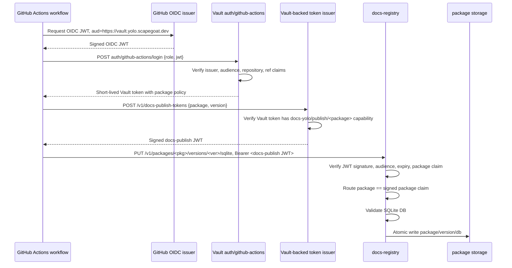

# Vault OIDC for CI/CD Docs Publishing: Designing Short-Lived Package-Scoped Credentials

This article explains how to design a CI/CD publishing system where GitHub Actions workflows upload versioned documentation artifacts to a registry, and every upload is authorized through short-lived, package-scoped credentials issued by Vault. The design eliminates long-lived repository secrets, gives each workflow an identity tied to its repository and branch, and lets the registry verify uploads without calling Vault on every request.

The reference system is `docs.yolo.scapegoat.dev`, a multi-package documentation hub built on the Glazed framework. Packages export their help content as SQLite databases in CI, upload those databases to a registry, and a browser serves them to readers. The question this article answers is: how does the registry know that a given upload is allowed, and how does it know that authorization without relying on static shared secrets?

> [!summary]
> - GitHub Actions can authenticate to Vault using OIDC identity tokens, without storing any Vault credentials in the repository. Vault validates the token claims and issues a short-lived Vault token with a narrow policy.
> - A package-scoped publish credential is a short-lived JWT whose claims include the package name, repository, ref, and audience. The registry verifies this JWT locally using Vault's public signing key.
> - The registry never calls Vault during normal upload authorization. It verifies the signed credential offline, checks that the package claim matches the upload route, and accepts or rejects before reading the upload body.
> - The authorization mapping lives in Vault roles and policies. Each role binds a repository and branch to a single package name. The registry does not need its own token catalog.

## Why this note exists

The `docs.yolo.scapegoat.dev` system already has a working publishing pipeline. Packages generate SQLite help databases, `docsctl publish` uploads them, the registry validates the schema, and the browser reloads new content. The missing piece is the authorization boundary. The initial implementation uses static bearer tokens stored in GitHub repository secrets. That approach works for bootstrapping but accumulates operational problems: token rotation, leak exposure, and the need to maintain a registry-side token catalog.

The Hetzner k3s platform already runs Vault with a proven GitHub Actions OIDC integration (documented in HK3S-0028 and the companion [[ARTICLE - Vault OIDC for GitHub Actions - Secretless CI GitOps]]). This article shows how to apply that integration to docs publishing, from the authentication handshake through the registry's JWT verification logic.

## When to use this pattern

Apply this pattern when your CI/CD system needs to authorize uploads to a central registry and the following conditions hold:

- Publishers run in GitHub Actions and can request OIDC identity tokens.
- You already operate Vault and are willing to expose its JWT auth endpoint over HTTPS.
- You want to avoid storing long-lived publish tokens in source repositories.
- Your registry should verify uploads without a runtime dependency on Vault availability.
- Each publisher should be scoped to a single package or a well-defined set of packages.

Do not use this pattern when:

- All publishers run inside the same trusted network and network locality is sufficient for authorization.
- Vault is not part of your platform and adding it would be disproportionate to the security requirement.
- The registry already uses a different identity provider (such as Sigstore or an external OIDC provider) and you want to stay within that provider's ecosystem.

## The core mental model

The publishing authorization model has three boundaries:

1. **GitHub asserts workflow identity.** When a GitHub Actions job runs with `id-token: write`, it can request a short-lived OIDC token from GitHub. That token contains claims about the repository, branch, event, commit SHA, and actor. GitHub signs it. The token is not a Vault token and it is not a docs publish credential. It is an identity assertion.

2. **Vault verifies the identity and authorizes a capability.** Vault's JWT auth method validates the GitHub OIDC token against a configured role. The role binds claims such as repository, branch, and event to a Vault policy. If the claims match, Vault issues a short-lived Vault token carrying that policy. The policy may grant access to a credential issuance endpoint.

3. **Vault issues a package-scoped publish credential.** The workflow uses its Vault token to request a publish JWT for a specific package. Vault (or a Vault-backed issuer service) signs a JWT whose claims include the package name, repository, ref, audience, and expiry. The workflow sends this JWT to the registry.

The registry then verifies the JWT offline. It checks the signature, the audience, the issuer, the expiry, and the package claim. If the package claim matches the upload route, authorization succeeds. The registry never calls Vault during this check.



The important property is that each boundary does one thing. GitHub asserts identity. Vault verifies identity and authorizes a narrow capability. The issuer mints a credential. The registry validates the credential. No component performs another component's job.

## The authorization problem in detail

Every upload to the registry must answer one question:

> Is this caller allowed to publish documentation for package `<package>` at version `<version>`?

With static tokens, the answer is based on a long-lived shared secret. The registry holds a hash table mapping token hashes to package names. When an upload arrives, the registry hashes the bearer token, looks it up, and checks whether the hash's package matches the route.

That model has three weaknesses. First, the token is long-lived. If it leaks through CI logs, repository settings, or a misconfigured workflow, an attacker can publish until the token is rotated. Second, the token does not carry provenance. It proves that the caller knows a secret, but not which workflow, which commit, or which branch produced the upload. Third, onboarding new packages requires operator intervention: create a token, store its hash in the registry catalog, rotate it later.

The OIDC model replaces all of that. The workflow's identity is derived from its GitHub Actions context. Vault maps that identity to a package capability. The registry verifies the capability offline. No shared secrets exist in any repository.

## The existing platform: what already works

The docs-yolo system and the k3s platform already provide the building blocks. Understanding what exists prevents redesigning what works.

### The registry already has an auth abstraction

The Glazed publishing package defines a `PublisherAuth` interface. The registry does not directly inspect token catalog internals. It calls `AuthorizePublish` with a raw bearer token and a `PublishRequest` containing the package name and version.

```go
type PublishRequest struct {
    PackageName string
    Version     string
}

type PublisherIdentity struct {
    Subject     string
    PackageName string
    Method      string
}

type PublisherAuth interface {
    AuthorizePublish(ctx context.Context, rawToken string, req PublishRequest) (*PublisherIdentity, error)
}
```

This interface is the seam to preserve. A JWT-based implementation satisfies the same contract. The registry handler does not change.

### The registry authorizes before reading the upload body

The upload route is:

```text
PUT /v1/packages/{package}/versions/{version}/sqlite
```

The handler extracts the package and version from the URL, builds a `PublishRequest`, and calls `AuthorizePublish` before receiving the upload body. Unauthorized callers are rejected without forcing the server to allocate a temporary file. This ordering is correct for a public or semi-public endpoint and should remain.

### SQLite validation and storage are separate from auth

After authorization, the registry receives the upload into a temporary file, validates the SQLite schema and metadata, and writes the DB atomically into the package store. The authorization project does not need to redesign validation or storage. It only needs to change how `AuthorizePublish` decides yes or no.

### The k3s platform already has GitHub Actions OIDC to Vault

HK3S-0028 established the pattern: GitHub Actions authenticates to Vault through `auth/github-actions`, a JWT auth mount configured with `https://token.actions.githubusercontent.com` as the issuer. The bootstrap script at `scripts/bootstrap-vault-github-actions-oidc.sh` creates the mount, configures the issuer, and writes role and policy files from the `vault/roles/github-actions/` and `vault/policies/github-actions/` directories.

The production roles are tightly bound. The bot-signup role, for example, accepts only tokens where:

- `repository_owner` is `wesen`
- `repository` is `wesen/2026-05-01--bot-signup`
- `ref` is `refs/heads/main`
- `event_name` is `push`
- `audience` is `https://vault.yolo.scapegoat.dev`

The TTL is 10 minutes, with a 30-minute maximum. The policy grants `read` on exactly one KV v2 path. This is the pattern to copy for docs publishing roles.

### The docs-yolo deployment currently uses a static publisher catalog

The production deployment mounts a `publishers.json` ConfigMap into the registry container. The ConfigMap currently contains an empty publisher list:

```json
{
  "publishers": []
}
```

The registry requires `--publisher-catalog /etc/docs-yolo/publishers.json` as a startup flag. The target design removes this dependency from production and replaces it with JWT verification configuration.

## The credential design

The registry-facing credential is a signed JWT. Its purpose is narrow: it proves that Vault authorized the bearer to publish a specific package. The registry verifies it locally and checks that its claims match the upload request.

### JWT claims

```json
{
  "iss": "https://vault.yolo.scapegoat.dev/v1/docs-yolo-publish",
  "sub": "repo:wesen/pinocchio:ref:refs/heads/main",
  "aud": ["docs-yolo-registry"],
  "exp": 1777777777,
  "nbf": 1777777477,
  "iat": 1777777477,
  "jti": "01J...",
  "repository_owner": "wesen",
  "repository": "wesen/pinocchio",
  "ref": "refs/heads/main",
  "event_name": "push",
  "workflow": "publish-docs.yml",
  "package": "pinocchio",
  "allowed_versions": ["*"]
}
```

Each claim has a purpose:

| Claim | Purpose |
|---|---|
| `iss` | The registry rejects tokens whose issuer does not match its configuration. |
| `sub` | Human-readable identity string for audit logs. |
| `aud` | The token must be intended for `docs-yolo-registry`. Prevents cross-service token reuse. |
| `exp` | Short expiry, typically 5–15 minutes, limits the window if the token is exposed. |
| `nbf` | Rejects tokens used before their valid time. |
| `iat` | Supports max-age enforcement and audit correlation. |
| `jti` | Unique identifier per token. Enables replay detection in a future enhancement. |
| `repository` | Which repository produced this credential. Audit and optional defense-in-depth. |
| `ref` | Which branch or tag triggered the workflow. Audit and optional defense-in-depth. |
| `event_name` | Which GitHub event triggered the workflow. The registry can reject non-`push` events. |
| `package` | The primary authorization claim. Must equal the upload route package. |
| `allowed_versions` | Optional glob pattern restricting which version strings this token may publish. |

### Registry verification rules

The registry must reject the upload unless all of the following hold:

1. The token is a syntactically valid JWT.
2. The signature verifies against the trusted issuer key material (a mounted public key or a JWKS endpoint).
3. `iss` equals the configured issuer string.
4. `aud` contains the configured audience, for example `docs-yolo-registry`.
5. `exp`, `nbf`, and `iat` are valid with small clock skew tolerance.
6. The `package` claim exists and passes `ValidatePackageName`.
7. The route `{package}` parameter equals the signed `package` claim. This is the core authorization check.
8. The route `{version}` parameter passes `ValidateVersion`.
9. Optionally, `repository`, `ref`, and `event_name` match a non-secret allowlist loaded from a ConfigMap, as a defense-in-depth layer.

The verification pseudocode:

```go
func (a *JWTPublisherAuth) AuthorizePublish(
    ctx context.Context,
    bearer string,
    req PublishRequest,
) (*PublisherIdentity, error) {
    if bearer == "" {
        return nil, ErrUnauthorized
    }
    if err := ValidatePackageVersion(req.PackageName, req.Version); err != nil {
        return nil, err
    }

    claims, err := a.VerifyAndDecode(ctx, bearer)
    if err != nil {
        return nil, ErrUnauthorized
    }
    if !claims.Audience.Contains(a.Audience) {
        return nil, ErrUnauthorized
    }
    if claims.Issuer != a.Issuer {
        return nil, ErrUnauthorized
    }
    if claims.Package != req.PackageName {
        return nil, ErrForbidden
    }
    if claims.Repository == "" || claims.Ref == "" {
        return nil, ErrUnauthorized
    }
    if claims.EventName != "push" {
        return nil, ErrForbidden
    }
    if a.Allowlist != nil &&
        !a.Allowlist.Allows(claims.Repository, claims.Ref, claims.Package) {
        return nil, ErrForbidden
    }

    return &PublisherIdentity{
        Subject:     claims.Subject,
        PackageName: claims.Package,
        Method:      "vault-jwt",
        Repository:  claims.Repository,
        Ref:         claims.Ref,
        Workflow:    claims.Workflow,
    }, nil
}
```

The important check is `claims.Package != req.PackageName`. The JWT claims a specific package. The upload route specifies a specific package. If they differ, the caller is trying to publish a package they were not authorized for. The registry must reject this regardless of any other claim.

## The Vault design

### Reuse the existing GitHub Actions auth mount

Do not create a new auth mount. `auth/github-actions` already exists and is configured with GitHub's issuer. The docs publishing roles live alongside the existing GitOps PR roles:

```text
vault/roles/github-actions/docs-publish-pinocchio.json
vault/roles/github-actions/docs-publish-glazed.json
vault/policies/github-actions/docs-publish-pinocchio.hcl
vault/policies/github-actions/docs-publish-glazed.hcl
```

### Role shape

Each package gets one role. The role binds the GitHub Actions OIDC token to a single repository, branch, event, and audience. If a repository owns multiple packages, create one role per package so that audit logs and policy names stay obvious.

```json
{
  "role_type": "jwt",
  "user_claim": "repository",
  "bound_audiences": ["https://vault.yolo.scapegoat.dev"],
  "bound_claims": {
    "repository_owner": "wesen",
    "repository": "wesen/pinocchio",
    "ref": "refs/heads/main",
    "event_name": "push"
  },
  "policies": ["gha-docs-publish-pinocchio"],
  "ttl": "10m",
  "max_ttl": "30m",
  "token_explicit_max_ttl": "30m"
}
```

For immutable version publishing (releases), bind to tag refs instead of branch refs:

```json
{
  "bound_claims": {
    "repository_owner": "wesen",
    "repository": "wesen/pinocchio",
    "ref_type": "tag",
    "event_name": "push"
  }
}
```

Do not allow arbitrary branches to publish immutable package versions. The role constraints should match the trust model: main-branch pushes for mutable docs, tag pushes for immutable releases.

### Policy shape

The policy grants access to a package-specific credential issuance endpoint. The literal path depends on the issuance mechanism (discussed next), but the intent is:

```hcl
path "docs-yolo-publish/issue/pinocchio" {
  capabilities = ["update"]
}

path "auth/token/lookup-self" {
  capabilities = ["read"]
}

path "auth/token/renew-self" {
  capabilities = ["update"]
}

path "auth/token/revoke-self" {
  capabilities = ["update"]
}
```

The path `docs-yolo-publish/issue/pinocchio` does not have to store real data. It is an authorization namespace. The issuer checks whether the caller's Vault token has `update` capability on that path before minting a publish JWT.

### Credential issuance mechanism

The registry-facing contract is a signed JWT. How Vault produces that JWT determines the implementation complexity and the security properties. There are three approaches, in order of preference.

**Option A: Vault identity tokens.** Vault's identity secrets engine can issue signed JWTs that encapsulate entity metadata. The workflow authenticates to Vault, and then requests an identity token whose claims include the entity aliases and metadata set by the GitHub Actions login. The registry verifies these tokens using Vault's JWKS endpoint.

This is the conceptually cleanest approach because Vault itself is the issuer and the policy engine. The claims are derived from the authenticated entity rather than from arbitrary caller-supplied input. The limitation is that identity tokens carry Vault's entity model, and custom application claims such as `package` and `allowed_versions` may need to be stored as entity metadata or aliases. Whether this works depends on the granularity of Vault's identity token claim customization.

**Option B: A small broker service backed by Vault Transit.** A `docs-token-issuer` service runs inside the cluster. It accepts a Vault token, verifies capabilities on the package-specific path, constructs the JWT claims, and asks Vault Transit to sign the canonical JWT input. The service returns the signed JWT.

This approach centralizes JWT construction server-side. The claim shape is fully controlled by the broker, not by the caller. `docsctl` stays simple: it receives a JWT and sends it to the registry. The downside is an additional service to deploy, monitor, and authenticate.

**Option C: `docsctl` constructs the JWT and asks Vault Transit to sign.** The workflow logs into Vault, and then `docsctl` builds the JWT header and payload locally, asks Vault Transit to sign the signing input, and assembles the compact JWT.

This approach requires no broker service. It is also the most dangerous if not constrained correctly. Vault Transit signs arbitrary bytes. If the signing key is generic and shared across packages, a compromised or misconfigured workflow could sign a JWT claiming any package. The mitigation is to use one Transit signing key per package and configure the registry to map key ID (`kid`) to the allowed package. Without per-package keys or an independent allowlist, raw transit signing from CI is unsafe.

**Recommended choice.** Start with Option B if Vault identity tokens do not support the required custom claims. Option B gives full control over claim construction, keeps CI scripts simple, and avoids the arbitrary-signing risk of Option C. If Vault identity tokens can be made to carry the `package` claim (for example, through entity metadata populated at login), Option A is preferable because it requires no additional service.

### The unsafe shortcut and why it matters

The distinction between Option B and Option C is subtle but important. Consider what happens if a workflow can ask Vault Transit to sign any bytes with a trusted key:

```text
Workflow builds: {"package": "glazed", ...}  (arbitrary claim)
Workflow asks Transit to sign those bytes
Transit signs because the workflow's policy grants "update" on the transit key path
Workflow now has a valid JWT claiming it can publish "glazed"
But the workflow's Vault role only authorizes it for "pinocchio"
```

The Vault role correctly constrains which Vault policies the workflow receives. But if the policy grants broad transit signing access and the registry trusts any JWT signed by that key, the role constraint is bypassed at the application layer. The signature is valid, but the claim is fabricated.

Three mitigations exist:

1. **Per-package signing keys.** Each package gets its own Transit key. The registry maps `kid` to package. A workflow authorized for `pinocchio` can only sign with the `pinocchio` key. A `glazed` claim signed with the `pinocchio` key would have the wrong `kid`.

2. **Broker with claim enforcement.** The broker constructs claims based on the Vault token's capabilities, not based on caller-supplied input. The workflow cannot inject a `package` claim for a different package because the broker will not construct it.

3. **Registry-side allowlist.** The registry checks `repository`, `ref`, and `package` against a non-secret ConfigMap that lists the authorized mapping. This is defense-in-depth: even if a JWT has a valid signature, the registry rejects it if the mapping does not match.

Option B provides mitigation 2 by construction. Option C requires mitigation 1 or 3 as an additional safeguard. Option A, if available, provides mitigation at the Vault layer because Vault controls the claims.

## The registry design

### Auth modes

The registry should support explicit auth modes selectable by configuration:

```text
--auth-mode static-token    # local development fallback
--auth-mode vault-jwt       # production
```

In production, the registry uses:

```text
--auth-mode vault-jwt
--jwt-issuer https://vault.yolo.scapegoat.dev/v1/docs-yolo-publish
--jwt-audience docs-yolo-registry
--jwt-jwks-url https://vault.yolo.scapegoat.dev/v1/docs-yolo-publish/.well-known/jwks.json
```

If JWKS is not available, a mounted public key works:

```text
--jwt-public-key /etc/docs-yolo-jwt/public.pem
```

The `--publisher-catalog` flag remains required only when `--auth-mode static-token` is selected.

### New types

```go
type JWTPublisherAuth struct {
    Issuer      string
    Audience    string
    KeySet      JWTKeySet
    Clock       func() time.Time
    MaxTokenAge time.Duration
    Leeway      time.Duration
    Allowlist   *PublishAllowlist // optional defense-in-depth
}

type PublishJWTClaims struct {
    jwt.RegisteredClaims
    Package         string `json:"package"`
    Repository      string `json:"repository"`
    RepositoryOwner string `json:"repository_owner,omitempty"`
    Ref             string `json:"ref"`
    EventName       string `json:"event_name"`
    Workflow        string `json:"workflow,omitempty"`
    AllowedVersions string `json:"allowed_versions,omitempty"`
}
```

Implementation notes:

- Use a maintained JOSE/JWT library. Do not implement signature verification by hand.
- Validate algorithms. Accept only configured algorithms such as `RS256` or `EdDSA`. Reject `none` unconditionally.
- Cache JWKS with a short TTL and refresh on unknown `kid`.
- Fail closed if JWKS cannot be loaded and no cached key is valid.

### Authorization preserves the existing handler shape

The registry handler does not change its control flow. It extracts the bearer token, calls `AuthorizePublish`, and proceeds or rejects:

```go
func (h *Handler) PublishSQLite(w http.ResponseWriter, r *http.Request) {
    packageName := r.PathValue("package")
    version := r.PathValue("version")
    token := bearerToken(r.Header.Get("Authorization"))

    identity, err := h.Auth.AuthorizePublish(r.Context(), token, PublishRequest{
        PackageName: packageName,
        Version:     version,
    })
    if err != nil {
        writeAuthError(w, err)
        return
    }

    // ... receive upload, validate SQLite, publish to store ...
}
```

The `PublisherAuth` interface is satisfied by either `StaticTokenAuth` or `JWTPublisherAuth`. The handler is agnostic to the auth mode.

## The `docsctl publish` design

### Credential modes

`docsctl publish` should support three credential modes:

1. `--publish-jwt` or `DOCS_YOLO_PUBLISH_JWT`: the caller already has a short-lived JWT.
2. `--publish-jwt-file`: file containing the JWT.
3. Vault OIDC helper mode: `docsctl` obtains the JWT by logging into Vault and requesting a publish credential.

The old `--token` flag remains as a deprecated alias for `--auth-mode static-token` only.

### GitHub Actions OIDC acquisition

In GitHub Actions, the workflow grants `id-token: write`. The workflow can either use `hashicorp/vault-action` or `docsctl` can request the GitHub OIDC token directly from the environment variables GitHub exposes:

```go
func requestGitHubOIDCToken(ctx context.Context, audience string) (string, error) {
    baseURL := os.Getenv("ACTIONS_ID_TOKEN_REQUEST_URL")
    requestToken := os.Getenv("ACTIONS_ID_TOKEN_REQUEST_TOKEN")
    if baseURL == "" || requestToken == "" {
        return "", errors.New("GitHub Actions OIDC environment not available")
    }
    url := baseURL + "&audience=" + url.QueryEscape(audience)
    req, _ := http.NewRequestWithContext(ctx, "GET", url, nil)
    req.Header.Set("Authorization", "Bearer "+requestToken)
    // ... fetch and decode {"value": "<jwt>"} ...
}
```

Then Vault login:

```go
func loginVaultGitHubActions(ctx context.Context, vaultAddr, authPath, role, oidcJWT string) (string, error) {
    body := map[string]string{"role": role, "jwt": oidcJWT}
    // POST vaultAddr + "/v1/auth/" + authPath + "/login"
    // return response.auth.client_token
}
```

Then credential issuance:

```go
func issueDocsPublishJWT(ctx context.Context, vaultAddr, vaultToken, issuePath, pkg string) (string, error) {
    body := map[string]string{"package": pkg, "audience": "docs-yolo-registry"}
    // POST vaultAddr + "/v1/" + issuePath
    // Header: X-Vault-Token: vaultToken
    // return response.data.jwt
}
```

### CI workflow sketch

```yaml
name: Publish docs

on:
  push:
    tags: ['v*']
  workflow_dispatch: {}

permissions:
  contents: read
  id-token: write

jobs:
  publish-docs:
    runs-on: ubuntu-latest
    steps:
      - uses: actions/checkout@v4

      - uses: actions/setup-go@v5
        with:
          go-version: '1.26.x'

      - name: Build help DB
        run: |
          go run ./cmd/pinocchio help export-sqlite --output ./pinocchio-help.db

      - name: Publish docs
        run: |
          go install github.com/go-go-golems/glazed/cmd/docsctl@latest
          docsctl publish \
            --server https://registry.docs.yolo.scapegoat.dev \
            --package pinocchio \
            --version "${GITHUB_REF_NAME}" \
            --file ./pinocchio-help.db \
            --auth-mode vault-jwt \
            --vault-addr https://vault.yolo.scapegoat.dev \
            --vault-auth-path github-actions \
            --vault-role docs-publish-pinocchio \
            --vault-audience https://vault.yolo.scapegoat.dev \
            --vault-issue-path docs-yolo-publish/issue/pinocchio
```

For the first rollout, prefer `workflow_dispatch` or tag-based publishing rather than every push to `main`. This limits blast radius while the auth integration is validated.

## Network topology: exposing the registry

The registry is currently a cluster-internal `ClusterIP` service. GitHub-hosted Actions runners cannot reach it directly. There are three options.

**Option R1: Public registry hostname with JWT auth.** Expose `https://registry.docs.yolo.scapegoat.dev` through an Ingress. JWT auth provides application-layer protection. Add ingress body size limits and rate limits. This is the simplest path for GitHub-hosted runners.

**Option R2: Self-hosted runner.** Run a GitHub Actions runner inside the cluster or private network. The registry stays internal. This reduces public attack surface but adds operational complexity for the runner infrastructure.

**Option R3: GitOps artifact PR.** CI opens a PR with the SQLite DB as an artifact. Argo CD syncs after merge. This avoids exposing the registry entirely, but binary SQLite DBs in Git are a poor fit, and the merge delay makes rapid iteration impractical.

For `docs.yolo.scapegoat.dev`, Option R1 is recommended. The registry already rejects unauthorized callers before reading the upload body. JWT auth is a strong application-layer gate. Ingress limits constrain abuse. The existing Traefik ingress controller and cert-manager infrastructure can create the registry hostname with the same pattern used for the browser.

Ingress manifest:

```yaml
apiVersion: networking.k8s.io/v1
kind: Ingress
metadata:
  name: docs-yolo-registry
  annotations:
    cert-manager.io/cluster-issuer: letsencrypt-prod
spec:
  ingressClassName: traefik
  tls:
    - hosts:
        - registry.docs.yolo.scapegoat.dev
      secretName: docs-yolo-registry-tls
  rules:
    - host: registry.docs.yolo.scapegoat.dev
      http:
        paths:
          - path: /
            pathType: Prefix
            backend:
              service:
                name: docs-yolo-registry
                port:
                  number: 80
```

## Deployment changes

### Current registry args (to be replaced)

```yaml
- --publisher-catalog
- /etc/docs-yolo/publishers.json
```

### Target registry args

```yaml
- --auth-mode
- vault-jwt
- --jwt-issuer
- https://vault.yolo.scapegoat.dev/v1/docs-yolo-publish
- --jwt-audience
- docs-yolo-registry
- --jwt-jwks-url
- https://vault.yolo.scapegoat.dev/v1/docs-yolo-publish/.well-keys/jwks.json
```

### What to remove

- The `docs-yolo-publisher-catalog` ConfigMap.
- The `--publisher-catalog` volume mount.
- The `publisher-catalog.yaml` entry from `kustomization.yaml`.

The static-token code path can remain in the binary for local development, but production should not depend on it.

## Implementation sequence

The implementation should proceed in five phases. Each phase preserves the invariant that a repository can publish only the package that Vault grants.

### Phase 0: Confirm the credential issuance mechanism

Decide whether Vault identity tokens support the required custom claims (`package`, `allowed_versions`). If yes, use Option A. If not, implement the broker service (Option B). Document the signing algorithm, issuer string, key distribution method, and token TTL.

Acceptance criteria: one command can produce a short-lived JWT with `package=pinocchio` after Vault OIDC login, and the JWT can be verified offline with public key material.

### Phase 1: Add JWT auth to the registry

Add `JWTPublisherAuth` to `pkg/help/publish/jwt_auth.go`. Add registry flags for `--auth-mode`, `--jwt-issuer`, `--jwt-audience`, `--jwt-jwks-url` or `--jwt-public-key`. Keep `--publisher-catalog` required only when `--auth-mode static-token`. Add unit tests covering:

| Test | Expected result |
|---|---|
| Valid token, matching package | success |
| Valid token, wrong route package | `ErrForbidden` |
| Expired token | `ErrUnauthorized` |
| Wrong audience | `ErrUnauthorized` |
| Wrong issuer | `ErrUnauthorized` |
| Missing `package` claim | `ErrUnauthorized` |
| `alg=none` | `ErrUnauthorized` |
| Unknown `kid` | `ErrUnauthorized` |

### Phase 2: Add Vault-aware publishing to `docsctl`

Add `--auth-mode vault-jwt` to `docsctl publish`. Add `--publish-jwt` and `--publish-jwt-file` flags. Add GitHub Actions OIDC token request and Vault login helpers. Preserve local DB validation before token issuance. Add tests with mocked GitHub OIDC and Vault responses.

### Phase 3: Add Vault roles and policies in the k3s repo

Add one role per package repository under `vault/roles/github-actions/`. Add matching policies under `vault/policies/github-actions/`. Run the bootstrap script. Validate with `vault read auth/github-actions/role/docs-publish-pinocchio`.

### Phase 4: Update docs-yolo deployment and CI

Change the registry auth mode to `vault-jwt` in the deployment manifest. Add the registry ingress. Remove the publisher catalog ConfigMap. Add a CI workflow for one pilot package (preferably `pinocchio`). Publish a test version and verify the browser shows it.

### Phase 5: Onboard remaining packages

Add roles and policies for `glazed` and any other packages. Publish real tag-based versions. Remove the static token code path from production configuration.

## Common failure modes

### `id-token: write` is missing from the workflow

The workflow cannot request a GitHub OIDC token. Vault will never receive a JWT, so login cannot proceed. The fix is to add `id-token: write` to the workflow's `permissions` block.

### The audience does not match

Vault checks `bound_audiences` on the role. The workflow's requested audience and the role's bound audience must match exactly. A mismatch produces a login failure, not a capability error.

### The branch or event does not match

Production roles accept only specific refs and events. A `workflow_dispatch`, `pull_request`, or feature-branch run will not match the role. That is intentional. If a package needs to publish from a different context, create a separate role with appropriate constraints.

### The Vault token has the wrong policy

A workflow may successfully log into Vault but lack the policy to access the credential issuance endpoint. The symptoms are a 403 from Vault when requesting the publish JWT. Verify that the role attaches the correct policy and the policy grants `update` on the correct path.

### The JWT package claim does not match the route

The registry rejects the upload with `ErrForbidden`. This happens when the caller has a valid JWT for one package but tries to upload to a different package route. The fix is to use the correct `--package` flag in `docsctl publish`.

### JWKS is unreachable

If the registry is configured with `--jwt-jwks-url` and cannot reach Vault, JWTs with unknown `kid` values will fail verification. Cached keys continue to work until their TTL expires. The registry should fail closed: if no valid key is available, reject the upload. Do not fall back to accepting unsigned or unverifiable tokens.

### JWT replay within TTL

A valid JWT can be reused within its TTL window. Because uploads are idempotent per package and version (they overwrite the same path atomically), replay produces the same result. The risk is unnecessary repeated work, not data corruption. A future enhancement can add an in-memory `jti` cache with a TTL matching the token expiry.

## Security properties

The completed system has these properties:

- GitHub Actions receives a Vault token only after Vault validates the GitHub OIDC token's issuer, audience, repository, ref, and event.
- The Vault token is short-lived: 10 minutes by default, 30 minutes maximum.
- Each Vault policy grants access to exactly one package-specific credential issuance path.
- The publish JWT is short-lived: typically 5–15 minutes.
- The registry verifies the JWT offline. Vault downtime does not prevent uploads that already hold valid credentials.
- The registry checks that the signed `package` claim equals the upload route package. A JWT for one package cannot be used to publish another.
- Pull request workflows do not match production publishing roles because the roles bind `event_name=push` and trusted refs only.
- Source repositories do not contain long-lived docs publish secrets.
- The registry rejects path traversal in package and version names before any filesystem operation.

## Package ownership as the source of truth

The mapping from repository to package name lives in Vault roles and policies. A GitOps-managed catalog can drive role creation:

```yaml
apiVersion: docs.yolo.scapegoat.dev/v1alpha1
kind: PackagePublisherCatalog
packages:
  pinocchio:
    displayName: Pinocchio
    ownerRepos:
      - wesen/pinocchio
    allowedRefs:
      - type: tag
        pattern: v*
    vaultRole: docs-publish-pinocchio
    vaultPolicy: gha-docs-publish-pinocchio
  glazed:
    displayName: Glazed
    ownerRepos:
      - wesen/glazed
    allowedRefs:
      - type: branch
        pattern: main
      - type: tag
        pattern: v*
    vaultRole: docs-publish-glazed
    vaultPolicy: gha-docs-publish-glazed
```

The catalog drives Vault role creation, policy creation, and onboarding documentation. It is not a runtime dependency of the registry. The registry verifies signed claims, not the catalog.

## Rollback plan

If JWT auth breaks in production:

1. Keep static-token auth available behind a configuration flag.
2. Switch `--auth-mode` back to `static-token` in the deployment.
3. Re-deploy with the known-good configuration.
4. Investigate the JWT failure mode (key rotation, JWKS unavailability, claim mismatch).
5. Fix and re-enable `vault-jwt` mode.

If the credential issuer breaks:

1. Reconfigure the registry to accept Vault client tokens directly (Phase 2 fallback, where the registry calls `sys/capabilities-self` on Vault).
2. Leave the issuer deployed but unused while investigating.

## Anti-patterns

### Using a single generic Transit signing key for all packages

This creates a single point of trust escalation. Any workflow that can sign with the generic key can forge a JWT claiming any package. Use per-package keys, a claim-enforcing broker, or Vault identity tokens.

### Accepting arbitrary `package` claims from caller-supplied input

The credential issuer must derive the `package` claim from the Vault token's policy, not from the HTTP request body. If the issuer trusts the caller to specify the package, the system degrades to self-attestation.

### Bypassing the registry to write directly to the PVC

The PVC is writable by the registry container. If a workflow or process writes directly to the PVC without going through the registry, the content is unvalidated and unaudited. The registry must be the only write path.

### Binding roles to `pull_request` events

Pull request workflows run untrusted code. A contributor can modify the workflow to exfiltrate any credential the workflow receives. Production publishing roles must bind to `push` events on trusted branches only.

### Storing the Vault token in the registry

In Phase 2 (where the registry calls Vault's `sys/capabilities-self`), the registry receives a Vault client token. That token should not be stored, logged, or reused beyond the single capabilities check. Phase 3 eliminates the need for the registry to handle Vault tokens at all by using signed JWTs instead.

## Working rules

- A repository can publish only the package that Vault grants to that repository, and the registry must independently verify that the upload route package equals the signed package claim.
- Every publish JWT must have a short expiry and a unique `jti`. The registry should reject tokens whose `exp` is more than a configured max age from `iat`.
- The registry must authorize before reading the upload body. An unauthorized caller should not force the server to allocate storage.
- The registry must validate the SQLite database after authorization and before writing to the package store. Invalid uploads are rejected, not stored.
- Vault roles must bind `event_name=push` and trusted refs. Do not bind production publishing roles to `pull_request`.
- The `--publisher-catalog` ConfigMap should not exist in production after the migration is complete.

## Related notes

- [[ARTICLE - Vault OIDC for GitHub Actions - Secretless CI GitOps]] — the platform pattern for GitHub Actions OIDC to Vault that this design builds on.
- [[ARTICLE - Deploying Glazed Help Browser to Argo CD - Production Deep Dive]] — the initial deployment of the Glazed docs browser to the k3s cluster.
- The `GG-20260502-VAULT-OIDC-DOCS-PUBLISH` ticket in the Glazed docmgr workspace contains the full design documents and investigation diary.
- The `GG-20260502-DOCS-YOLO-MULTI-PACKAGE` ticket covers the multi-package registry architecture.
- The `HK3S-0028` ticket in the k3s docmgr workspace documents the original GitHub Actions OIDC to Vault integration.
