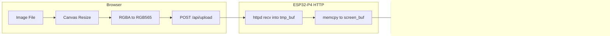

# ESP32-P4 MIPI DSI Image Blitter: Browser-to-Display Pipeline on the M5Stack Tab5

This is the browser-to-display rendering branch of the [[esp32]] project map.

This article documents the architecture, failure modes, and working patterns for streaming pixel data from a browser over WiFi to a 720x1280 MIPI DSI panel driven by an ESP32-P4. The system eliminates the traditional reflashing workflow: instead of compiling a UI into firmware, you open a web page, drag an image onto it, and the image appears on the physical display within seconds. The pipeline crosses five distinct domains — browser JavaScript, HTTP binary transfer, IDF embedded web serving, LVGL 9 rendering, and MIPI DSI panel driving — and each domain has its own constraints that shape the design.

> [!summary]
> This article captures four engineering lessons:
> 1. The IDF `EMBED_TXTFILES` build step corrupts multi-byte UTF-8 and appends NUL terminators — both break JavaScript at the browser.
> 2. LVGL 9 has a fundamentally different image descriptor API from LVGL 8, and the migration requires reading the actual header files.
> 3. ESP-Hosted WiFi initialization order matters: calling `apply_sta_config()` before `configure_apsta_mode()` causes a silent crash when NVS has saved credentials.
> 4. A dual-buffer upload strategy (receive into temporary SPIRAM, then memcpy to the screen buffer) prevents partial-overwrite artifacts during slow WiFi transfers.

## Why this note exists

The M5Stack Tab5 is a 10.1-inch tablet built around the ESP32-P4, a dual-core 400 MHz RISC-V SoC with hardware MIPI DSI support. Its 720x1280 display runs at 60 Hz over two DSI data lanes at 730 Mbps. Developing UI on this device traditionally requires reflashing the entire firmware each time a visual change is needed. The screen viewer firmware replaces that cycle with a web-based upload: any image, from any browser on the same network, rendered on the physical display in under ten seconds.

The implementation crossed enough non-obvious failure modes that recording the patterns serves future embedded projects. The article is not a tutorial; it is a technical record of what the system does, why it does it that way, and what breaks along the way.

## When to use this pattern

This architecture applies when you need to display arbitrary pixel content on a high-resolution embedded panel without recompiling firmware. Concretely:

- UI mockup preview on physical hardware during design iteration
- Remote signage or information display that updates over the network
- Any ESP32-P4 project with a MIPI DSI panel where you need to inspect how pixel data will render on the actual display
- Situations where the browser can do computational work (color conversion, resizing) to offload the microcontroller

## Architecture

The system has four layers, each with a single responsibility:



### Data flow

1. The browser loads an image file into an off-screen `<canvas>`, resizes it to 1280x720, and reads the raw RGBA pixel data via `getImageData()`.
2. A JavaScript function converts each pixel from 32-bit RGBA to 16-bit RGB565, emitting two bytes per pixel in little-endian order.
3. The resulting 1,843,200-byte `ArrayBuffer` is sent as a `POST /api/upload` request with `Content-Type: application/octet-stream`.
4. The ESP32 HTTP server receives the body into a temporary SPIRAM buffer, then copies it into the screen buffer. This avoids partial-frame artifacts: the display never sees a half-old, half-new image.
5. The receive-complete handler calls `display_app_invalidate()`, which acquires the LVGL lock, calls `lv_obj_invalidate()` on the fullscreen image object, and releases the lock.
6. LVGL's render loop redraws the image on the next frame. The LVGL image descriptor (`lv_image_dsc_t`) points directly at the SPIRAM screen buffer, so no intermediate copy is needed.

### Hardware context

The Tab5's display subsystem is not a simple SPI LCD. It involves:

| Component | Detail |
|-----------|--------|
| Panel | ST7123, 720x1280 portrait, RGB565 native format |
| Interface | MIPI DSI, 2 data lanes at 730 Mbps |
| SoC | ESP32-P4, dual-core RISC-V @ 400 MHz |
| WiFi | ESP32-C6 slave via ESP-Hosted over SDIO 4-bit @ 40 MHz |
| Display buffer | Dual-buffered, SPIRAM-backed, software rotation to landscape |
| Screen buffer | 1280x720x2 = 1,843,200 bytes in SPIRAM |

The ESP32-C6 runs the actual WiFi stack; the P4 communicates with it through the ESP-Hosted SDIO transport. This matters because any WiFi operation — connect, disconnect, retransmit — involves a round-trip across the SDIO bus to the C6 and back. Large uploads benefit from the 4-bit 40 MHz SDIO clock, but the path is not as simple as a direct WiFi peripheral.

## Implementation details

### The SPIRAM screen buffer and LVGL 9 image descriptor

The core data structure is a 1,843,200-byte buffer allocated in SPIRAM via `heap_caps_malloc(size, MALLOC_CAP_SPIRAM)`. This buffer is the single source of truth for what appears on screen. LVGL does not own this buffer; the application code writes pixel data into it, and LVGL reads from it during rendering.

The LVGL 9 image descriptor that points at this buffer is:

```c
s_screen_dsc.header.magic = LV_IMAGE_HEADER_MAGIC;
s_screen_dsc.header.cf = LV_COLOR_FORMAT_RGB565;
s_screen_dsc.header.flags = 0;
s_screen_dsc.header.w = 1280;
s_screen_dsc.header.h = 720;
s_screen_dsc.header.stride = 2560;   /* 1280 pixels * 2 bytes */
s_screen_dsc.data_size = 1843200;
s_screen_dsc.data = s_screen_buf;
```

This descriptor is not the same as LVGL 8. The LVGL 8 API used `LV_IMG_CF_TRUE_COLOR` and did not require a `magic` field or an explicit `stride`. In LVGL 9, the `header.magic` field must be set to `LV_IMAGE_HEADER_MAGIC` or the image will not render. The `header.cf` takes a `LV_COLOR_FORMAT_*` enum, not an `LV_IMG_CF_*` constant. The `header.stride` field specifies the number of bytes per row, which is `width * bytes_per_pixel`.

This API change is not prominently documented. The migration path requires reading `lv_image_dsc.h` directly.

### Display initialization sequence

The Tab5's display bring-up requires a specific initialization order, dictated by the hardware:

```c
bsp_i2c_init();                           /* Shared I2C bus              */
i2c_master_bus_handle_t i2c = bsp_i2c_get_handle();
bsp_io_expander_pi4ioe_init(i2c);         /* PI4IOE GPIO expanders      */
bsp_reset_tp();                           /* Reset touch/display lines   */
bsp_display_start_with_config(&cfg);      /* Start MIPI DSI + LVGL      */
lv_display_set_rotation(disp, LV_DISPLAY_ROTATION_90);  /* Landscape    */
bsp_display_backlight_on();               /* Enable backlight            */
```

The I2C bus must be initialized first because the PI4IOE GPIO expanders control the display power rails and reset lines. The `bsp_reset_tp()` call toggles the touch controller reset before the display starts, which prevents a stale touch controller state from interfering with the MIPI DSI link training.

The `LV_DISPLAY_ROTATION_90` setting tells LVGL to treat the 720x1280 portrait panel as a 1280x720 landscape display. The `sw_rotate` flag in the display configuration enables software rotation, meaning the LVGL render pipeline applies the rotation during drawing rather than requiring the application to pre-rotate pixel data.

### The dual-buffer upload strategy

Receiving 1.8 MB over WiFi into the screen buffer directly would create a visible artifact: the display would show a partially updated frame during the seconds-long transfer. The solution is a two-stage receive:

```c
uint8_t *recv_buf = heap_caps_malloc(expected, MALLOC_CAP_SPIRAM);
/* ... receive HTTP body into recv_buf ... */
memcpy(buf, recv_buf, received);   /* atomic copy to screen buffer */
free(recv_buf);
display_app_invalidate();          /* single invalidation after copy */
```

The temporary buffer is allocated in SPIRAM, so it does not compete with internal RAM. If SPIRAM allocation fails — which should not happen on a device with 32 MB of PSRAM — the code falls back to receiving directly into the screen buffer. This fallback produces visual artifacts but does not lose the upload.

The `display_app_invalidate()` call happens only after the full copy completes. LVGL then redraws the image object on the next frame, reading from the now-complete screen buffer. The user sees a single frame transition, not a progressive fill.

### Thread safety: the LVGL lock

LVGL runs its render loop on a dedicated FreeRTOS task, started by `bsp_display_start_with_config()`. Any operation that creates, modifies, or invalidates LVGL objects from a different task must acquire the LVGL lock first. The HTTP server runs on its own task, so the upload completion handler must lock before invalidating:

```c
void display_app_invalidate(void) {
    if (s_screen_img) {
        bsp_display_lock(0);
        lv_obj_invalidate(s_screen_img);
        bsp_display_unlock();
    }
}
```

The `0` argument to `bsp_display_lock()` maps to `lvgl_port_lock(0)`, which waits with a zero timeout — it returns immediately if the lock is not available. This design avoids deadlocks: the HTTP handler never blocks indefinitely waiting for the LVGL task. The tradeoff is that a failed lock acquisition silently drops the invalidation. In practice, the LVGL render task releases the lock frequently, and the next upload will trigger a new invalidation.

Without this lock, calling `lv_obj_invalidate()` from the HTTP task triggers an LVGL assertion:

```
assert failed: lv_inv_area lv_refr.c:178 (!disp->rendering_in_progress)
```

The assertion fires because the HTTP task modifies the invalidation state while the render task is actively drawing. The lock serializes these operations.

### HTTP server configuration for large uploads

The IDF `httpd` component defaults to a 5-second receive timeout (`recv_wait_timeout`). A 1.8 MB RGB565 frame transferred over WiFi at typical throughput (approximately 300-500 KB/s after ESP-Hosted SDIO overhead) takes 4-6 seconds. The default timeout is therefore too short: uploads fail with `httpd_sock_err: error in recv : 128`, which is `ETIMEDOUT`.

The fix is to set the timeout explicitly:

```c
httpd_config_t cfg = HTTPD_DEFAULT_CONFIG();
cfg.recv_wait_timeout = 30;
```

Thirty seconds provides comfortable headroom for network congestion and retransmissions. The `send_wait_timeout` does not need adjustment because the responses are small JSON payloads.

### Browser-side RGBA to RGB565 conversion

The browser does all the computational work before uploading. This is a deliberate design choice: the ESP32-P4 can decode PNGs using LVGL's built-in decoders, but that consumes CPU time and heap memory that could otherwise serve the display. Offloading conversion to the browser means the ESP32 receives ready-to-blit pixel data.

The conversion loop:

```javascript
function rgbaToRgb565(rgbaData, w, h) {
    const numPixels = w * h;
    const out = new Uint8Array(numPixels * 2);
    for (let i = 0; i < numPixels; i++) {
        const r = rgbaData[i * 4];
        const g = rgbaData[i * 4 + 1];
        const b = rgbaData[i * 4 + 2];
        const r5 = (r >> 3) & 0x1F;
        const g6 = (g >> 2) & 0x3F;
        const b5 = (b >> 3) & 0x1F;
        const rgb565 = (r5 << 11) | (g6 << 5) | b5;
        out[i * 2] = rgb565 & 0xFF;        // low byte
        out[i * 2 + 1] = (rgb565 >> 8) & 0xFF;  // high byte
    }
    return out;
}
```

RGB565 packs red into 5 bits (0-31), green into 6 bits (0-63), and blue into 5 bits (0-31). The bit shift `>> 3` maps an 8-bit channel value to a 5-bit value; `>> 2` maps to 6 bits for green. The two-byte output is written in little-endian order because the ESP32-P4 is a little-endian processor and the ST7123 panel's RGB565 mode expects the pixel data in the processor's native byte order.

The browser's `<canvas>` element handles the image loading and resizing. The `drawImage(img, 0, 0, 1280, 720)` call scales any input image to the target resolution. The `getImageData()` call then reads the raw RGBA bytes from the canvas.

## Common failure modes

### IDF EMBED_TXTFILES corrupts multi-byte UTF-8

The IDF build system provides `EMBED_TXTFILES` to embed text files into the firmware binary. It works by generating an assembly `.S` file that uses `.incbin` to include the raw file content, followed by a `.byte 0` NUL terminator. This approach has two problems for JavaScript files.

First, the `.incbin` directive includes raw bytes verbatim. When the source file contains multi-byte UTF-8 characters — an em-dash (U+2014, encoded as `e2 80 94`), a multiplication sign (U+00D7, encoded as `c3 97`), or emoji — the assembler passes the bytes through without interpretation. The JavaScript engine in the browser, however, interprets the bytes as UTF-8 and decodes them correctly. The real problem is that some build environments or intermediate tools may mangle the multi-byte sequences, particularly if the `.S` file passes through a codepage-sensitive path.

Second, the `.byte 0` NUL terminator appended by the IDF build is included in the `_end` symbol range. When the HTTP handler calculates the file length as `end - start`, the result includes this trailing NUL byte. JavaScript treats a NUL byte (`\0`) as an invalid token, so the entire script fails to parse. The browser sees "Invalid or unexpected token" and none of the JavaScript executes.

The fix is two-part:

1. Replace all non-ASCII characters in embedded text assets with ASCII equivalents. Em-dashes become hyphens, multiplication signs become `x`, emoji become text labels like `[OK]` and `[ERR]`. This eliminates the encoding risk entirely.

2. Strip the trailing NUL in the HTTP handler:

```c
size_t len = (size_t)(assets_app_js_end - assets_app_js_start);
if (len > 0 && assets_app_js_start[len - 1] == '\0') len--;
return httpd_resp_send(req, (const char *)assets_app_js_start, (ssize_t)len);
```

An alternative approach would be to use `EMBED_BINFILES` instead, which does not append a NUL terminator, and manage the file lengths explicitly. The NUL-stripping approach is simpler for existing projects.

### LVGL 8 to LVGL 9 image descriptor migration

LVGL 9 replaced the `LV_IMG_CF_*` color format constants with `LV_COLOR_FORMAT_*`. The image descriptor struct (`lv_image_dsc_t`) now requires:

- `header.magic = LV_IMAGE_HEADER_MAGIC` — a sentinel value that LVGL uses to validate the descriptor
- `header.cf = LV_COLOR_FORMAT_RGB565` — replaces `LV_IMG_CF_TRUE_COLOR`
- `header.stride` — bytes per row, which replaces the implicit calculation from `width * bpp`

Omitting any of these fields causes the image to either not render or to trigger an assertion. The `LV_IMAGE_HEADER_MAGIC` constant is not optional; it is checked by LVGL's internal image processing code.

The migration is not documented in a single migration guide. The fields were discovered by reading `lv_image_dsc.h` and comparing the LVGL 8 and LVGL 9 struct definitions.

### WiFi initialization order causes silent crash

The ESP-Hosted WiFi stack on the Tab5 requires a specific initialization order. The function `configure_apsta_mode()` calls `esp_wifi_set_mode(WIFI_MODE_APSTA)`, which sets the WiFi mode to access-point + station simultaneous mode. The function `apply_sta_config()` calls `esp_wifi_set_config(WIFI_IF_STA, &cfg)`, which configures the station interface with SSID and credentials.

If `apply_sta_config()` is called before `configure_apsta_mode()`, and NVS contains saved credentials from a previous boot, the call sequence triggers `ESP_ERR_WIFI_MODE (0x3005)`. This error code means the WiFi mode has not been set, so configuring the STA interface is invalid. The error propagates through `ESP_ERROR_CHECK` and causes an abort.

The correct order:

```c
ESP_ERROR_CHECK(configure_apsta_mode());   /* Set mode FIRST */
if (s_has_runtime_creds) {
    ESP_ERROR_CHECK(apply_sta_config());   /* THEN configure STA */
}
```

The bug is subtle because it only manifests when NVS has saved credentials. On a fresh device with no saved WiFi configuration, `s_has_runtime_creds` is false, the `apply_sta_config()` call is skipped, and the boot succeeds. The bug appears only after the user has configured WiFi once — which is exactly the state the device is in during normal operation.

### LVGL assertion during rendering_in_progress

Creating or modifying LVGL objects from a task that does not hold the LVGL lock triggers an assertion in `lv_refr.c`:

```
assert failed: lv_inv_area lv_refr.c:178 (!disp->rendering_in_progress)
```

This occurs because the LVGL render task runs continuously after `bsp_display_start_with_config()` returns. Any LVGL API call that modifies the widget tree or marks regions as dirty must be serialized with the render loop. The `bsp_display_lock(0)` / `bsp_display_unlock()` pair provides this serialization.

The assertion is not a race condition in the traditional sense. It is a violation of LVGL's single-threaded design contract: the library assumes that only one thread manipulates the widget tree at a time, and the lock enforces this assumption.

## Anti-patterns

### Receiving uploads directly into the screen buffer

It is tempting to skip the temporary buffer and receive HTTP data directly into the screen buffer:

```c
/* Anti-pattern: direct receive into screen buffer */
int n = httpd_req_recv(req, (char *)screen_buf + received, remaining);
```

This works for small payloads, but for a 1.8 MB frame transferred over WiFi at 300 KB/s, the receive takes 6 seconds. During those 6 seconds, LVGL is rendering from the screen buffer. The display shows a frame that is partially old data and partially new data, with a visible horizontal boundary that moves downward as the receive progresses. The result looks like a tearing artifact.

The dual-buffer approach — receive into a temporary buffer, then `memcpy` to the screen buffer — ensures that the display transitions from the old frame to the new frame in a single render pass.

### Assuming EMBED_TXTFILES produces clean text

The IDF documentation does not prominently warn that `EMBED_TXTFILES` appends a NUL terminator or that multi-byte UTF-8 characters may be corrupted in the assembly generation step. The pattern of embedding web assets directly into firmware is common in ESP32 projects, and the NUL-terminator issue affects any text format that does not tolerate trailing NUL bytes: JavaScript, JSON, CSS, SVG. The safe approach is to either strip the NUL at serving time (as shown above) or to use `EMBED_BINFILES` and manage lengths explicitly.

### Setting recv_wait_timeout to its default value

The default 5-second timeout in `httpd_config_t` is appropriate for small REST payloads but insufficient for any binary upload larger than a few hundred kilobytes. The timeout applies per `httpd_req_recv()` call, not to the entire request. A single TCP segment that arrives 5.1 seconds after the previous segment triggers the timeout and aborts the upload. Network jitter, WiFi retransmissions, and ESP-Hosted SDIO bus contention all contribute to inter-segment delays that exceed 5 seconds under load.

## Working rules

1. **Lock before you touch LVGL.** Any LVGL API call from a non-LVGL task must be wrapped in `bsp_display_lock()` / `bsp_display_unlock()`. This includes object creation, property setting, and invalidation.

2. **Strip NUL from EMBED_TXTFILES.** Always subtract the trailing NUL byte when serving embedded text assets over HTTP. The `_end` symbol includes it; the browser will choke on it.

3. **ASCII-only in embedded web assets.** Em-dashes, multiplication signs, and emoji break in the IDF assembly embedding path. Use ASCII equivalents.

4. **Set mode before configuring interfaces.** In the ESP-Hosted WiFi stack, `esp_wifi_set_mode()` must be called before `esp_wifi_set_config()`. The converse order works on a fresh device but crashes when NVS has saved credentials.

5. **Dual-buffer large uploads.** Receive into SPIRAM, memcpy to screen, then invalidate. Never let the display render from a buffer that is mid-receive.

6. **Set recv_wait_timeout generously.** For binary uploads over WiFi, 30 seconds is a practical minimum. The default 5 seconds will abort transfers that are simply slow, not broken.

7. **Test with saved NVS credentials.** Any WiFi initialization bug that only manifests when credentials exist will not be caught on a fresh device. Always test with a previously configured SSID/password in NVS.

## The complete API surface

| Method | Path | Request body | Response | Purpose |
|--------|------|-------------|----------|---------|
| GET | `/` | — | HTML | Web UI with drag-drop upload |
| GET | `/app.js` | — | JavaScript | Frontend conversion and upload logic |
| GET | `/api/health` | — | `{"ok":true}` | Liveness check |
| GET | `/api/screen` | — | `{"ok":true,"width":1280,"height":720,"format":"rgb565","buf_size":1843200,"has_image":bool}` | Screen metadata |
| POST | `/api/upload` | Raw RGB565 binary (1,843,200 bytes max) | `{"ok":true,"bytes_received":0}` | Blit pixel data to display |
| POST | `/api/clear` | — | `{"ok":true}` | Fill screen with black |

All responses include `Cache-Control: no-store` because the firmware is a single-instance device; caching would serve stale state.

## Pseudocode: the full upload pipeline

```
Browser:
  load image into <canvas> at 1280x720
  read RGBA pixel array via getImageData()
  for each pixel:
    r5 = (r >> 3) & 0x1F
    g6 = (g >> 2) & 0x3F
    b5 = (b >> 3) & 0x1F
    rgb565 = (r5 << 11) | (g6 << 5) | b5
    output[2i]   = low_byte(rgb565)
    output[2i+1] = high_byte(rgb565)
  POST /api/upload with output as binary body

ESP32 HTTP handler:
  allocate tmp_buf in SPIRAM (1,843,200 bytes)
  receive HTTP body into tmp_buf
  memcpy(screen_buf, tmp_buf, received)
  free(tmp_buf)
  zero-fill remaining bytes if received < expected
  acquire LVGL lock
  lv_obj_invalidate(screen_img)
  release LVGL lock
  return {"ok": true}

LVGL render task (on next frame):
  read screen_buf via lv_image_dsc_t
  apply ROTATION_90 (software)
  push pixels to MIPI DSI DPI panel
  ST7123 drives display at 60 Hz
```

## Open questions

- **RGB565 byte order verification.** The current implementation writes little-endian RGB565 (low byte first), matching the ESP32-P4's native endianness. The ST7123 datasheet specifies RGB565 pixel format but does not explicitly state byte order. A four-quadrant test pattern (red, green, blue, white) has been uploaded; visual confirmation from the physical display is pending.

- **PNG decode fallback.** The current pipeline requires browser-side conversion. Adding a `POST /api/upload-png` endpoint that uses LVGL's built-in PNG decoder would allow direct uploads from non-browser tools (curl, Python scripts). This has not been implemented.

- **Performance ceiling.** The 1.8 MB upload takes 4-6 seconds over WiFi STA. The SoftAP path may be faster because it eliminates the router hop. The ESP-Hosted SDIO bus at 4-bit 40 MHz has a theoretical maximum of 20 MB/s, but practical throughput depends on the C6's WiFi radio performance and the SDIO protocol overhead.

## Near-term next steps

- Visually verify RGB565 byte order with the quadrant test pattern on the physical display
- Test the drag-and-drop workflow from a real browser (not Playwright) with varied image types
- Add a `POST /api/upload-png` endpoint with LVGL PNG decode as a server-side alternative
- Rename leftover log tags (`tab5_text_echo_wifi`, `tab5_text_echo_console`) to match the viewer project
- Update the project README with build, flash, and usage instructions

## Related notes

- Ticket 0093 documentation: `/home/manuel/workspaces/2025-12-21/echo-base-documentation/esp32-s3-m5/ttmp/2026/05/27/0093--m5tab5-ui-screen-viewer-web-based-image-blit-to-display/`
- Design doc: `design-doc/01-ui-screen-viewer-design.md`
- Investigation diary: `reference/01-investigation-diary.md`
- Fork base: `0051-tab5-boot-logo/` (display + WiFi + HTTP + console, proven boot)
