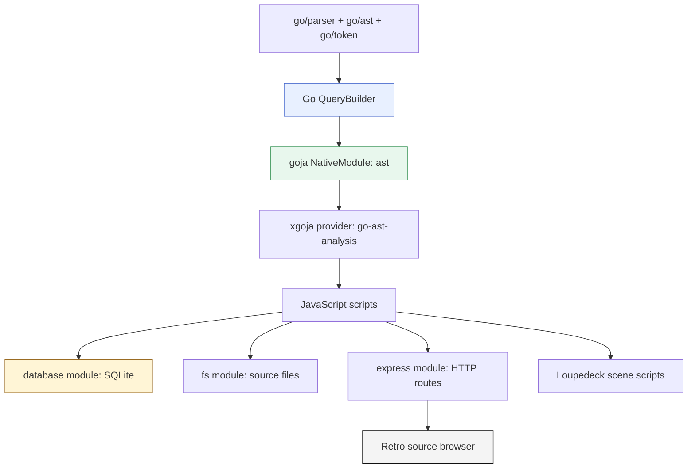

# Go AST Analysis: From JavaScript Bindings to a Web Source Browser

This report describes the `go-ast-analysis` project as it evolved from a Go package that exposes AST queries to JavaScript into a generated xgoja application with SQLite persistence, Loupedeck hardware interaction, and a live retro monochrome web source browser. The interesting part is not any single layer. The interesting part is that each layer keeps a narrow responsibility: Go owns parsing and typed query execution; JavaScript owns orchestration and presentation; xgoja turns the composition into standalone binaries.

> [!summary]
> - The core module parses Go packages with `go/parser` and exposes a Go-owned fluent query builder to JavaScript through goja.
> - xgoja packages that module into generated binaries, so the same AST surface works from scripts, jsverbs, SQLite workflows, Loupedeck scene scripts, and a web server.
> - The final browser uses `ast + db + fs + express`: JavaScript queries AST data, stores navigable definitions in SQLite, reads source files through the existing `fs` module, and serves a live code-navigation UI.
> - The project demonstrates a reusable pattern for moving from typed Go domain logic to scriptable JavaScript workflows without replacing either side with the other.

Repository:

```text
/home/manuel/code/wesen/2026-05-27--goja-ast-analysis
```

Current live demo:

```text
http://127.0.0.1:8787/
```

The server is running in tmux session `go-ast-site`.

## The final result

The web UI is a source browser for `/home/manuel/code/wesen/go-go-golems/go-go-goja/engine`. It indexes package definitions, lists source files, filters definitions by kind and search text, and jumps from a definition row to the corresponding source line.

![[go-ast-browser-01-file-list.png]]

The first view is file-first. The left pane shows the analyzed package summary, the Go files in the package, and the definitions for the selected file. The right pane renders the selected source file with line numbers. This matters because a code browser should not start as an empty search box. The user should see concrete files immediately.

![[go-ast-browser-02-runtime-methods.png]]

The second view filters definitions to methods matching `Runtime`. This shows the definition index as an interactive query result rather than a static report. The browser is still backed by SQLite, but all interaction happens through small JSON endpoints.

![[go-ast-browser-03-go-to-definition.png]]

The third view shows go-to-definition. A method row selects the file, requests a source snippet from the server, scrolls to the target line, and highlights it. Source text is read on demand by JavaScript through the existing `fs` module.

## Why this project is technically interesting

A common way to expose Go functionality to JavaScript is to write a thin wrapper around a few functions and return JSON. That works for simple tasks, but it becomes weak when JavaScript needs to compose domain-specific operations. If JavaScript builds raw query maps, then the Go side receives untyped data and has to reconstruct intent after the fact. The system becomes flexible but fragile.

`go-ast-analysis` takes a different path. JavaScript still controls the workflow, but the query object lives in Go. JavaScript calls methods on a fluent builder. The builder accumulates typed query state, validates that state, executes AST traversal, and returns plain result rows. The public API feels like JavaScript, but the correctness boundary stays in Go.

```javascript
const ast = require("ast")
const pkg = ast.parsePackage("/home/manuel/code/wesen/go-go-golems/go-go-goja/engine")

const methods = ast.query(pkg)
  .methods()
  .withReceiver("Runtime")
  .select("name", "receiver", "signature", "file", "line")
  .execute()
```

The design is small, but it scales. The same call shape works in a smoke script, a jsverb, a database ingestion script, a Loupedeck interaction handler, or an Express route registration script. The module does not know where its results will go. It only knows how to parse Go and answer AST questions.

## The architecture in one diagram



The arrows describe ownership of data flow. Go AST nodes do not cross into JavaScript. JavaScript receives handles, result objects, and rows. SQLite does not belong to the AST module. HTTP serving does not belong to the AST module. Hardware does not belong to the AST module. Those capabilities are separate modules composed at the xgoja runtime profile level.

This separation is why the project could grow without rewriting the core. Once `ast.query(pkg).functions().execute()` worked, every later feature used the same surface.

## Phase 1: Build the Go AST library first

The implementation starts in `pkg/go-ast-analysis`. The core files are conventional Go code:

| File | Responsibility |
|------|----------------|
| `types.go` | Package handles, query result structs, filters, and result map conversion. |
| `parse.go` | Parse a directory into a package handle with files and a token file set. |
| `builder.go` | Fluent query builder methods such as `Functions`, `Methods`, `Exported`, and `WithReceiver`. |
| `query.go` | Query execution, AST traversal, filtering, selection, and limits. |
| `inspect.go` | Conversion from `go/ast` nodes into queryable properties. |
| `module.go` | goja module wrapper and JavaScript object construction. |
| `provider.go` | xgoja provider registration, jsverbs, and command providers. |

The core type is `QueryBuilder`:

```go
type QueryBuilder struct {
    handle    *PackageHandle
    nodeKinds []string
    filters   []FilterClause
    selectors []string
    limit     int
}
```

The builder is intentionally stateful. Each method appends a constraint or selector. `Execute` validates the accumulated query and then walks the parsed files.

```go
func (b *QueryBuilder) Methods() *QueryBuilder {
    b.nodeKinds = append(b.nodeKinds, "method")
    return b
}

func (b *QueryBuilder) WithReceiver(typeName string) *QueryBuilder {
    b.filters = append(b.filters, FilterClause{
        Field: "receiver", Operator: "eq", Value: typeName,
    })
    return b
}
```

This gives JavaScript a fluent surface without making JavaScript responsible for the representation. The Go code can reject invalid queries before traversal. It can also normalize AST details into stable result fields such as `kind`, `name`, `receiver`, `file`, `line`, `signature`, and `exported`.

The key rule is that AST nodes are inspected in Go and projected into simple data before crossing the runtime boundary.

## Phase 2: Make the JavaScript API explicit

The first non-obvious lesson was that Go values exported through goja are not automatically good JavaScript APIs. A Go struct has Go-style field names. A Go method has Go naming conventions. A fluent JavaScript API needs lowerCamel method names, predictable objects, and chainable methods that return the same JavaScript object.

The final module therefore creates explicit JavaScript wrapper objects. `parsePackage` returns a plain object with public metadata plus an internal handle:

```javascript
{
  id: "...",
  name: "engine",
  dir: "/home/manuel/code/wesen/go-go-golems/go-go-goja/engine",
  fileCount: 17,
  __handle: <internal Go handle>
}
```

`ast.query(pkg)` extracts `__handle`, creates a Go `QueryBuilder`, and wraps it in a JavaScript object whose methods close over the Go builder. The wrapper is the public API. The Go struct is implementation state.

```go
func (m *Module) wrapBuilder(vm *goja.Runtime, b *QueryBuilder) goja.Value {
    obj := vm.NewObject()

    _ = obj.Set("methods", func() goja.Value {
        b.Methods()
        return obj
    })

    _ = obj.Set("withReceiver", func(typeName string) goja.Value {
        b.WithReceiver(typeName)
        return obj
    })

    _ = obj.Set("execute", func() (map[string]any, error) {
        results, err := b.Execute()
        if err != nil {
            return nil, err
        }
        return results.ToMap(), nil
    })

    return obj
}
```

This is the pattern that made the rest of the project stable. When a Go domain object needs a precise JavaScript shape, build that shape deliberately. Do not rely on reflection to accidentally produce the API you want.

## Phase 3: Package it as an xgoja provider

The xgoja provider makes the module available to generated binaries. The provider registers a package ID, a module, embedded jsverbs, and later a custom `web serve` command provider.

The runtime profile selects the module under the `ast` alias:

```yaml
runtimes:
  site:
    modules:
      - package: go-ast-analysis
        name: go-ast-analysis
        as: ast
```

This separation matters. A module can be compiled into a generated binary without being available to every runtime profile. Scripts get exactly the modules selected by their profile.

Provider-shipped jsverbs use the same API. A verb can parse a package, run a query, and return rows:

```javascript
function listFunctions(path, exported, limit) {
  const ast = require("ast")
  const pkg = ast.parsePackage(path)

  let q = ast.query(pkg).functions()
  if (exported) q = q.exported()

  return q
    .select("name", "signature", "file", "line", "doc")
    .limit(limit || 100)
    .execute()
    .items
}
```

The important correction here was metadata. The tested jsverb format uses sentinel calls like `__package__` and `__verb__`, not only comments. That gave the generated command tree the expected shape.

## Phase 4: Use SQLite from JavaScript, not Go

The first design included custom storage ideas. That was removed. SQLite persistence belongs in JavaScript because the existing `database` module already provides it. The AST module returns rows. The script decides what to persist.

```javascript
const ast = require("ast")
const db = require("db")

db.configure("sqlite3", dbPath)
db.exec("CREATE TABLE functions (name TEXT, exported BOOLEAN, file TEXT, line INTEGER, signature TEXT)")

const pkg = ast.parsePackage(engineDir)
const functions = ast.query(pkg)
  .functions()
  .select("name", "exported", "file", "line", "signature")
  .execute()

for (const fn of functions.items) {
  db.exec(
    "INSERT INTO functions (name, exported, file, line, signature) VALUES (?, ?, ?, ?, ?)",
    fn.name, fn.exported ? 1 : 0, fn.file, fn.line, fn.signature || ""
  )
}
```

This decision kept the Go library focused. It also made the examples more valuable because they demonstrate module composition. The generated binary is not an AST command with hard-coded storage. It is a JavaScript-capable runtime with AST, database, filesystem, HTTP, and hardware modules selected as needed.

## Phase 5: From route registration to a real web server

The first website example used `ast + db + fs + express` to register routes, but it used the built-in `xgoja run` command. That command executes a JavaScript module and closes the runtime. It proves that route registration works, but it does not keep the HTTP server alive for browser interaction.

The solution was to add a package-owned command provider: `web serve`. It creates the selected runtime profile, initializes provider capabilities such as HTTP, runs the server script, and then waits until Ctrl-C or an optional duration expires.

```text
./dist/go-ast-site web serve ./scripts/server.js --http-listen 127.0.0.1:8787
```

At a high level, the command does this:

```go
rt := runtimeFactory.NewRuntime(ctx, profile, requireRootsFromScript(script))
providerutil.InitRuntimeFromSections(ctx, vals, runtimeHandle{rt}, selectedModules)
rt.Require.Require(script)
waitUntilSignalOrDuration()
```

That one command changed the website example from a wiring smoke test into a live application.

## Phase 6: The browser data model

The final browser server script does four jobs:

1. Parse the target package with `ast.parsePackage`.
2. Query definitions with the fluent AST API.
3. Discover and read Go source files with the JavaScript `fs` module.
4. Store navigable metadata in SQLite and expose it over HTTP.

The schema is deliberately small:

```sql
CREATE TABLE summary (
  package TEXT,
  dir TEXT,
  files INTEGER,
  functions INTEGER,
  methods INTEGER,
  structs INTEGER,
  interfaces INTEGER
);

CREATE TABLE definitions (
  kind TEXT,
  name TEXT,
  receiver TEXT,
  file TEXT,
  relative_file TEXT,
  line INTEGER,
  signature TEXT,
  exported BOOLEAN
);

CREATE TABLE files (
  file TEXT,
  relative_file TEXT,
  lines INTEGER,
  bytes INTEGER,
  definitions INTEGER
);
```

The endpoints are similarly small:

| Endpoint | Purpose |
|----------|---------|
| `/api/summary` | Return package counts. |
| `/api/files` | Return the codebase file listing. |
| `/api/definitions` | Return definitions, optionally filtered by kind, search text, or file. |
| `/api/source` | Read a validated Go source file and return a snippet or full listing. |

The source endpoint has the most important safety invariant. The browser receives absolute file paths from AST results, but the server must not become a general file reader. The server resolves the path, checks it is inside the analyzed package directory, requires a `.go` suffix, verifies the file exists, and only then calls `fs.readFileSync`.

```javascript
function requireSourceFile(rawFile) {
  const file = path.resolve(rawFile)
  if (!isInside(engineDir, file)) throw new Error("source path outside analyzed package")
  if (!file.endsWith(".go")) throw new Error("source path must be a Go file")
  if (!fs.existsSync(file)) throw new Error("source path does not exist")
  return file
}
```

This is the same design principle as the core module: JavaScript can orchestrate, but boundaries should validate their inputs before doing privileged work.

## Phase 7: The client-side browser

The browser code is split into small files because each part has a different responsibility:

| File | Responsibility |
|------|----------------|
| `api.js` | Fetch JSON from `/api/summary`, `/api/files`, `/api/definitions`, and `/api/source`. |
| `highlight.js` | Render simple monochrome Go syntax highlighting. |
| `renderer.js` | Convert rows and snippets into DOM nodes. |
| `app.js` | Own UI state, filters, file selection, and go-to-definition behavior. |
| `views/html.js` | Emit the static page shell. |
| `views/css.js` | Define the retro monochrome visual system. |

The state model is intentionally plain:

```javascript
const state = {
  kind: 'all',
  q: '',
  selectedKey: '',
  selectedFile: '',
  files: [],
  definitions: [],
}
```

Selecting a file clears the selected definition, reloads definitions for that file, and asks `/api/source` for the full file. Selecting a definition updates both selected definition and selected file, then asks `/api/source` for a snippet centered on the target line.

```javascript
async function showFile(file) {
  state.selectedFile = file.relativeFile
  state.selectedKey = ''
  await loadDefinitions()
  const snippet = await ASTApi.source({ file: file.file, line: 1, radius: 'all' })
  ASTRenderer.source(title, location, sourceView, file.relativeFile, snippet)
}

async function goToDefinition(def, key) {
  state.selectedKey = key
  state.selectedFile = def.relativeFile
  const snippet = await ASTApi.source({ file: def.file, line: def.line, radius: 120 })
  ASTRenderer.source(title, location, sourceView, ASTRenderer.definitionLabel(def), snippet)
}
```

The syntax highlighter is intentionally simple. It tokenizes one line at a time and marks Go keywords, strings, comments, numbers, and likely type names. It is not a Go parser. That is acceptable for the current browser because the authoritative source structure comes from the AST index, not from the highlighter.

## Loupedeck as another frontend

The web UI was not the only frontend. The project also built a Loupedeck code-navigation prototype under `examples/xgoja/loupedeck-code-nav`. This was useful because it proved that the same AST module can be used in an event-driven hardware runtime.

The Loupedeck scripts were intentionally layered:

1. Log hardware interactions.
2. Change query state and print it.
3. Run AST queries from knobs, buttons, and touch events.
4. Render results on tiles.

The main issue was module visibility. The generated xgoja profile selected `ast`, but the Loupedeck `deck run` command used the Loupedeck raw scene runtime. That runtime registered Loupedeck modules but did not include the `ast` alias. The result was:

```text
GoError: Invalid module
```

The fix had two parts. `go-ast-analysis` registers an `ast` alias in the default module registry. The Loupedeck scene runtime allows the optional AST extension module from that registry without exposing the entire host module set. After that, `03-ast-query-console.js` could parse `go-go-goja/engine` and print query results from the hardware workflow.

This matters for the web UI because it confirms the architecture is not tied to browsers. The AST module is a reusable domain capability. The frontend can be a CLI, a jsverb, a database script, a web app, or a hardware surface.

## Loupedeck and web integration

The next step was to make the hardware and web interfaces cooperate rather than exist as separate demonstrations. The browser is the better surface for rendering source code. It has a large display, scrollable text, syntax highlighting, and enough room for a file list and a definition list. The Loupedeck is the better surface for tactile navigation. It has knobs, buttons, and touch tiles that can move through a result set without requiring focus in the browser.

The integration uses a local file-backed remote state channel. This is intentionally simple. The Loupedeck scene writes the currently selected definition to a JSON file. The web server exposes that JSON file through `/api/remote-state`. The browser polls the endpoint and jumps when the sequence number changes.

```mermaid
flowchart LR
    Deck[Loupedeck scene script]
    StateFile[dist/loupedeck-remote.json]
    Server[AST web server]
    Endpoint[/api/remote-state]
    Browser[Browser source pane]

    Deck -->|fs.writeFileSync| StateFile
    Server -->|fs.readFileSync| StateFile
    Server --> Endpoint
    Browser -->|poll every ~600ms| Endpoint
    Browser -->|load source snippet| Source[/api/source]

    style Deck fill:#f4f4f4,stroke:#111111
    style StateFile fill:#fff5d6,stroke:#9a6b22
    style Browser fill:#e8f0ff,stroke:#4466cc
```

The state file lives next to the web example's generated artifacts:

```text
examples/xgoja/ast-analysis-site/dist/loupedeck-remote.json
```

A typical payload looks like this:

```json
{
  "seq": 1,
  "source": "loupedeck",
  "reason": "knob1",
  "package": "engine",
  "kind": "method",
  "name": "NewRuntime",
  "receiver": "Factory",
  "label": "Factory.NewRuntime",
  "file": "/home/manuel/code/wesen/go-go-golems/go-go-goja/engine/factory.go",
  "relativeFile": "factory.go",
  "line": 183,
  "signature": "(*Factory) NewRuntime(opts ...RuntimeOption) (*Runtime, error)",
  "updatedAt": "2026-05-27T19:47:04.454Z"
}
```

The sequence number is the coordination mechanism. The browser remembers the last sequence it applied. Polling can happen repeatedly without disturbing local browser use; only a new sequence triggers a jump.

```javascript
async function pollRemoteState() {
  try {
    await showRemoteState(await window.ASTApi.remoteState())
  } finally {
    setTimeout(pollRemoteState, 600)
  }
}

async function showRemoteState(remote) {
  if (!remote || !remote.file || remote.seq === state.remoteSeq) return
  state.remoteSeq = remote.seq

  const snippet = await window.ASTApi.source({
    file: remote.file,
    line: remote.line || 1,
    radius: 120,
  })
  ASTRenderer.source(title, location, sourceView, remote.label, snippet)
}
```

The Loupedeck side is similarly direct. `05-web-remote-browser.js` parses the same package, builds a sorted definition list, tracks an index in a reactive signal, and writes the selected definition whenever the user moves or confirms the selection.

```javascript
function writeRemote(reason) {
  const def = selected()
  seq++
  fs.writeFileSync(remoteStatePath, JSON.stringify({
    seq,
    source: "loupedeck",
    reason,
    package: pkg.name,
    kind: def.kind,
    label: label(def),
    file: def.file,
    relativeFile: shortFile(def),
    line: def.line,
    signature: def.signature || "",
    updatedAt: new Date().toISOString(),
  }, null, 2), "utf8")
}
```

The controls are deliberately minimal:

| Control | Behavior |
|---------|----------|
| `Knob1` | Move one definition backward or forward. |
| `Knob2` | Move ten definitions backward or forward. |
| `Button1` | Resend the current selection. |
| Touch tiles | Resend the current selection. |
| `Circle` | Exit the scene. |

This turns the browser into the display and the Loupedeck into a navigation controller. The two processes do not share a runtime. They do not call each other. They communicate through a tiny state contract that can be inspected with `cat`, served over HTTP, and replaced later by a WebSocket or event stream if the interaction model proves useful.

The integration required one runtime change in the Loupedeck repository. The raw Loupedeck scene runtime already had to opt into the optional `ast` module so scene scripts could query Go definitions. The remote-control script also needs `fs` so it can write the state file. The scene runtime now allows the optional AST and filesystem modules without exposing the full host module registry.

```text
/home/manuel/code/wesen/go-go-golems/loupedeck/runtime/js/runtime.go
```

The successful live run looked like this:

```text
Found Loupedeck vendor=2ec2 product=0004 model="Loupedeck Live"
05-web-remote-browser ready for 140 definitions
WEB REMOTE initial factory_test.go:11 TestFactoryWithRequireOptions
```

That output is important because it proves the hardware path reached JavaScript execution, parsed the target package, built the definition list, wrote the first remote selection, and left the runner alive for knob and touch input.

## Failure modes and corrections

The project had several productive failures. They are worth recording because they describe the real contracts better than the final code alone.

| Failure | Cause | Correction |
|---------|-------|------------|
| Go structs did not expose the desired JavaScript shape. | goja reflection gives Go-shaped values, not a designed JS API. | Build explicit wrapper objects for package handles and builders. |
| jsverbs generated awkward commands. | The first metadata format was not the one the jsverbs scanner expected. | Use `__package__` and `__verb__` sentinel metadata. |
| SQLite started to drift into the Go module design. | Storage was treated as part of AST analysis. | Keep storage in JavaScript through the existing `database` module. |
| `xgoja run` closed the HTTP runtime. | Built-in run is one-shot. | Add package-owned `web serve` command provider. |
| Loupedeck could not `require("ast")`. | `deck run` used the Loupedeck raw scene runtime rather than the xgoja-selected module aliases. | Register `ast` alias and allow the optional module in the scene runtime. |
| Loupedeck could not initially drive the browser. | The web UI had no remote-control contract, and the scene runtime could not write the shared state file. | Add `/api/remote-state`, browser polling, `05-web-remote-browser.js`, and optional `fs` access in the scene runtime. |
| The file collector failed in the web UI. | The fs module returns `stat.isDir` and `stat.isFile`, not Node `Stats` methods. | Use field access instead of `stat.isDirectory()`. |
| Headless Snap Chromium produced blank screenshots. | DOM rendered, but the screenshot output was blank. | Capture screenshots with Playwright from an existing local `node_modules`. |

These failures show a recurring theme. The boundaries are explicit, and each boundary has its own contract. goja has a module contract. xgoja has a runtime profile contract. fs has its own stat shape. HTTP lifecycle differs between one-shot and long-running commands. Respecting those contracts made the system simpler.

## How to run it

Build and smoke test the site:

```bash
cd /home/manuel/code/wesen/2026-05-27--goja-ast-analysis
make -C examples/xgoja/ast-analysis-site smoke
```

Run the live web UI:

```bash
make -C examples/xgoja/ast-analysis-site serve
```

Or restart the tmux session:

```bash
tmux kill-session -t go-ast-site
cd /home/manuel/code/wesen/2026-05-27--goja-ast-analysis
tmux new-session -d -s go-ast-site -c examples/xgoja/ast-analysis-site 'make serve'
```

Useful validation endpoints:

```bash
curl -fsS http://127.0.0.1:8787/api/summary
curl -fsS http://127.0.0.1:8787/api/files
curl -fsS 'http://127.0.0.1:8787/api/definitions?file=factory.go'
```

Run the Loupedeck AST query script:

```bash
examples/xgoja/loupedeck-code-nav/dist/loupedeck-code-nav deck run \
  examples/xgoja/loupedeck-code-nav/scripts/03-ast-query-console.js \
  --duration 30s \
  --log-events
```

Run the Loupedeck-to-web remote browser script:

```bash
examples/xgoja/loupedeck-code-nav/dist/loupedeck-code-nav deck run \
  examples/xgoja/loupedeck-code-nav/scripts/05-web-remote-browser.js \
  --duration 0s \
  --log-events
```

Or run it in tmux alongside the web UI:

```bash
tmux new-session -d -s loupedeck-web-remote \
  -c /home/manuel/code/wesen/2026-05-27--goja-ast-analysis \
  'examples/xgoja/loupedeck-code-nav/dist/loupedeck-code-nav deck run examples/xgoja/loupedeck-code-nav/scripts/05-web-remote-browser.js --duration 0s --log-events'
```

## Current status

The current repository has working implementations for:

- pure Go AST query tests,
- goja JavaScript integration tests,
- xgoja provider registration,
- provider-shipped jsverbs,
- basic xgoja query examples,
- SQLite persistence examples,
- long-running Express web UI,
- Loupedeck AST interaction prototype,
- Loupedeck-to-web remote browsing through `05-web-remote-browser.js` and `/api/remote-state`,
- docmgr design docs and chronological diary,
- screenshot documentation for the web browser.

Recent commits in the project include:

```text
82d7545 Add long-running AST web UI command
7abdef8 Add AST site source definition APIs
c84194b Add retro source browser UI
a84ad90 Constrain retro AST browser viewport
bc1582f Show codebase files in AST browser
f7735da Diary: record AST browser file listing
270aea8 Add web remote state polling for Loupedeck
2fec625 Add Loupedeck remote control for AST browser
7b89f41 Diary: record Loupedeck web browsing bridge
```

The implementation is no longer only a binding experiment. It is a working pattern for turning typed Go analysis into scriptable, persistent, interactive tools.

## What should come next

The most direct next step is source-aware navigation. The server already knows definitions and source locations. The browser could turn identifiers in the source pane into links to matching definitions. That would move the UI from definition-list navigation to in-source navigation.

Other useful extensions:

- Add directory grouping in the file pane when analyzing larger codebases.
- Add permalinks such as `?file=factory.go&line=183`.
- Add keyboard navigation for the file and definition panes.
- Add call-site indexing so the browser can show where a function is used.
- Make the analyzed package path configurable through a safe command flag.
- Add a reproducible screenshot target to the Makefile.
- Replace the file-backed Loupedeck bridge with an event stream or WebSocket if the interaction model needs lower latency or bidirectional feedback.

The important constraint should remain: do not move orchestration into the Go module. The Go module should keep answering typed AST questions. JavaScript should keep composing those answers into storage, UI, hardware, and HTTP workflows.

## Closing

The project started with a narrow technical question: how should JavaScript query Go AST data without constructing unsafe query maps? The answer was a Go-owned fluent builder exposed through explicit goja wrapper objects. That answer was enough to unlock the rest of the system.

Once JavaScript could safely ask for functions, methods, structs, interfaces, imports, and calls, the same API became useful in several contexts. xgoja packaged it into generated binaries. SQLite stored the results. Express served them. The `fs` module read the source files. A browser rendered a code navigation UI. Loupedeck scripts drove the same queries from hardware input.

That is the central lesson of this project: a small, well-shaped runtime boundary can support a surprisingly rich set of tools. The boundary does not need to know every future frontend. It needs to expose the right capability with the right invariants.
