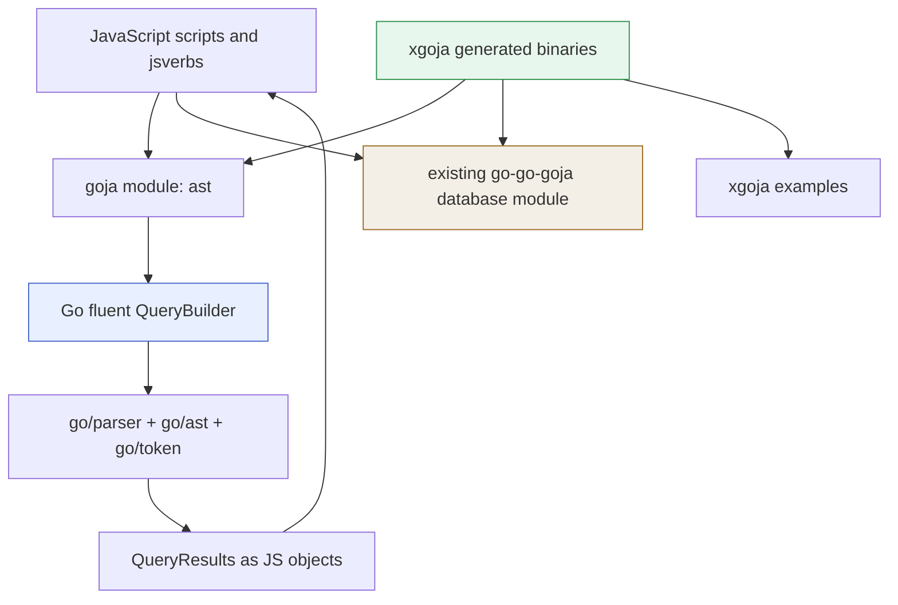

# Go AST Analysis: xgoja Bindings and Codebase Navigation

This report describes the `go-ast-analysis` project built on 2026-05-27. The project exposes Go source-code structure to JavaScript running inside goja, packages that integration as an xgoja provider, and demonstrates several generated binaries that analyze real Go repositories, persist results through the existing database module, register web routes, and begin exploring Loupedeck-based code navigation.

> [!summary]
> - The core library parses Go packages with `go/parser` and queries syntax trees through a fluent builder API implemented in Go.
> - The JavaScript surface is intentionally small: `parsePackage`, `query`, and `listPackages`. SQLite persistence is done in JavaScript with the existing `database` module.
> - xgoja examples prove the integration path: basic AST query commands, provider-shipped jsverbs, SQLite persistence, website wiring with `express`, and a first Loupedeck control-surface prototype.
> - The most important implementation lesson is that goja interop should expose explicit JavaScript wrapper objects for fluent APIs and handles, rather than relying on Go struct reflection to create a good public API.

## Why this project exists

JavaScript is a useful control language for exploratory codebase workflows. It is easy to edit, easy to run through goja, and already fits the jsverbs and xgoja command model used in `go-go-goja`. Go source analysis, however, is better implemented in Go. The standard library already provides `go/parser`, `go/ast`, and `go/token`; these packages produce typed syntax trees with precise source positions and stable node contracts.

The project exists to connect those two facts. JavaScript should be able to ask questions about a Go codebase, but JavaScript should not build untyped AST query objects by hand. Query construction belongs in Go, where a builder can accumulate typed constraints, validate them, execute an AST traversal, and return a JavaScript-friendly result set. The resulting API is compact enough to use interactively:

```javascript
const ast = require("ast")
const pkg = ast.parsePackage("/home/manuel/code/wesen/go-go-golems/go-go-goja/engine")

const methods = ast.query(pkg)
  .methods()
  .withReceiver("Runtime")
  .select("name", "receiver", "signature", "file", "line")
  .execute()
```

The same surface can be used from a generated xgoja binary, from provider-shipped jsverbs, from a website script, or from a hardware control surface. That reuse is the point of making the Go AST layer a module rather than only a standalone command.

## Repository and current status

The repository is:

```text
/home/manuel/code/wesen/2026-05-27--goja-ast-analysis
```

The current implementation includes:

```text
pkg/go-ast-analysis/                 # Core library, goja module, xgoja provider, tests
examples/xgoja/ast-analysis/          # Basic generated AST tool + jsverbs
examples/xgoja/ast-analysis-db/       # AST analysis persisted to SQLite through db module
examples/xgoja/ast-analysis-site/     # ast + db + express + fs website wiring example
examples/xgoja/loupedeck-code-nav/    # Loupedeck control-surface prototype scripts
ttmp/2026/05/27/GOJA-AST-001--...     # Design doc, cleanup guide, diary, tasks, changelog
```

The project reached a working state across three levels:

- The Go package tests pass with `go test ./pkg/go-ast-analysis/... -count=1`.
- The generated xgoja examples build and run their smoke tests.
- The Loupedeck generated binary builds and exposes `deck run`, but the first hardware run revealed an integration issue described later in this report.

## Architecture at a glance

The implementation has five relevant boundaries. Each boundary exists to keep one part of the system responsible for one kind of work.



The core library does not depend on SQLite. This was a deliberate cleanup after the first design pass. Storage is not part of AST querying. JavaScript receives result rows and chooses how to persist them. In the xgoja examples, JavaScript uses `require("db")` from `go-go-goja-host` and calls `db.exec(...)` and `db.query(...)` directly.

## The core library

The core package lives in `pkg/go-ast-analysis`. It is organized around a small set of files:

| File | Responsibility |
|------|----------------|
| `types.go` | Package handles, result structs, filter clauses, and map conversion. |
| `parse.go` | Parsing package directories into `PackageHandle` values. |
| `builder.go` | The fluent query API. |
| `query.go` | Query execution, matching, result construction, and selectors. |
| `inspect.go` | Conversion from concrete `go/ast` node types into queryable properties. |
| `module.go` | goja `NativeModule` implementation and JavaScript wrappers. |
| `provider.go` | xgoja provider registration and embedded jsverb source. |

The central type is `QueryBuilder`. It stores four pieces of query state: the package handle, selected node kinds, filter clauses, and output selectors.

```go
type QueryBuilder struct {
    handle    *PackageHandle
    nodeKinds []string
    filters   []FilterClause
    selectors []string
    limit     int
}
```

The builder exposes chainable methods such as `Functions`, `Methods`, `Structs`, `Exported`, `WithName`, `WithReceiver`, `ReturnsError`, `Select`, `Limit`, and `Execute`. These methods mutate the builder and return the same pointer. The JavaScript wrapper returns the same JavaScript object for each method call, so the JavaScript chain has the expected shape.

The query execution path is direct. The builder validates that it has a handle and at least one selected node kind. `executeQuery` builds a matcher from accumulated filters, walks each parsed file with `ast.Inspect`, projects recognized AST nodes into properties, applies filters, then builds `QueryResult` rows.

```go
func executeQuery(b *QueryBuilder) (*QueryResults, error) {
    matcher := buildMatcher(b.filters)

    for _, file := range b.handle.files {
        ast.Inspect(file, func(n ast.Node) bool {
            props := extractProperties(n, b.handle.fset)
            kind := props["_kind"]
            if !requested(kind) { return true }
            if !matcher(props) { return true }
            results.Items = append(results.Items, buildResult(props, b.selectors, b.handle.pkgName))
            return true
        })
    }

    return results, nil
}
```

The important correction in this code path is the nil-node case. `ast.Inspect` calls the visitor with `nil` when leaving branches. `extractProperties` must return an empty property map for nil nodes; otherwise ordinary queries panic on the first traversal that exits a branch.

## JavaScript module design

The first implementation assumed goja would expose exported Go methods on returned structs in a convenient JavaScript shape. That was not a good public interface. Goja can export Go values, but it does not automatically produce the lowerCamel, fluent, object-oriented JavaScript API that this module needs.

The final module therefore creates explicit wrapper objects. `parsePackage` returns a plain JavaScript object with lowerCamel metadata and an internal Go handle:

```javascript
const pkg = ast.parsePackage("/path/to/pkg")
console.log(pkg.name, pkg.fileCount)

const results = ast.query(pkg).functions().exported().execute()
```

Internally, the wrapper stores the Go handle on `__handle`. `ast.query(pkg)` recovers that handle and builds a Go `QueryBuilder`. The builder itself is wrapped as a JavaScript object whose methods are closures over the Go builder.

```go
func (m *Module) wrapPackageHandle(vm *goja.Runtime, h *PackageHandle) goja.Value {
    obj := vm.NewObject()
    _ = obj.Set("id", h.ID())
    _ = obj.Set("name", h.PackageName())
    _ = obj.Set("dir", h.Dir())
    _ = obj.Set("fileCount", h.FileCount())
    _ = obj.Set("__handle", h)
    return obj
}
```

This wrapper design solved two problems. It made the public API stable for JavaScript, and it prevented accidental dependence on Go field names such as `Name` or `FileCount`. It also kept the internal AST data inside Go. JavaScript can pass the handle back to Go, but it does not directly manipulate `*ast.File` values.

## xgoja provider integration

The xgoja provider is defined in `pkg/go-ast-analysis/provider.go`. It registers one module and one provider-shipped verb source.

```go
func Register(registry *providerapi.Registry) error {
    return registry.Package(PackageID,
        providerapi.Module{
            Name:        "go-ast-analysis",
            DefaultAs:   "ast",
            Description: "Go AST analysis with fluent builder query API",
            New:         newModuleFactory,
        },
        providerapi.VerbSource{
            Name:        "verbs",
            Description: "Pre-built Go AST analysis verbs",
            FS:          verbsFS,
            Root:        "verbs",
        },
    )
}
```

The generated binaries use `packages[].replace` in their `xgoja.yaml` files to point the provider import back at this local repository. The `--xgoja-replace` flag is only used for `github.com/go-go-golems/go-go-goja`; it should not also be pointed at the `go-ast-analysis` repository. Passing two unrelated replacement paths through `--xgoja-replace` caused the generated build to replace `go-go-goja` with the wrong module directory.

The correct pattern is visible in `examples/xgoja/ast-analysis/Makefile`:

```make
build:
	$(XGOJA) build -f $(CURDIR)/xgoja.yaml \
		--output $(BIN) \
		--xgoja-replace $(GOJA_ROOT) \
		--keep-work
```

The local provider replacement is in YAML:

```yaml
packages:
  - id: go-ast-analysis
    import: github.com/go-go-golems/go-ast-analysis/pkg/go-ast-analysis
    replace: ../../..
```

This distinction matters because xgoja generates a temporary Go module. That module must resolve both `go-go-goja` and `go-ast-analysis` correctly. `--xgoja-replace` handles the first. `packages[].replace` handles the second.

## Provider-shipped jsverbs

The provider embeds three JavaScript verbs:

```text
pkg/go-ast-analysis/verbs/list-functions.js
pkg/go-ast-analysis/verbs/list-structs.js
pkg/go-ast-analysis/verbs/inspect-package.js
```

The first version used comment-style metadata. That did not produce the expected command shape. The jsverbs scanner in this codebase expects sentinel calls such as `__package__` and `__verb__`, matching the fixtures in `go-go-goja/pkg/xgoja/testprovider/verbs/tools.js`.

The corrected verb style is:

```javascript
__package__({ name: "ast", short: "Go AST analysis commands" })

__verb__("listFunctions", {
  name: "list-functions",
  short: "List functions in a Go package",
  output: "glaze",
  fields: {
    path: { type: "string", argument: true, required: true },
    exported: { type: "bool" },
    namePattern: { type: "string" },
    limit: { type: "int", default: 100 }
  }
})

function listFunctions(path, exported, namePattern, limit) {
  const ast = require("ast")
  const pkg = ast.parsePackage(path)
  let q = ast.query(pkg).functions()
  if (exported) q = q.exported()
  if (namePattern) q = q.nameMatches(namePattern)
  return q.limit(limit || 100).execute().items
}
```

The basic generated example verifies both script execution and provider-shipped command execution:

```bash
make -C examples/xgoja/ast-analysis smoke
```

The smoke output confirms that `go-go-goja/engine` is parsed and that jsverbs are mounted under `verbs ast`:

```text
Package: engine (17 files)
Functions: 86
Exported functions: 68
Methods: 35
Structs: 17
Imports: 92
=== SMOKE PASSED ===
```

It then runs commands such as:

```bash
examples/xgoja/ast-analysis/dist/go-ast-tool \
  verbs ast list-functions /home/manuel/code/wesen/go-go-golems/go-go-goja/engine \
  --exported --limit 5
```

The table output is produced by Glazed from the JavaScript function result rows.

## SQLite persistence through JavaScript

The project originally considered a custom storage layer inside `go-ast-analysis`. That idea was removed. The existing `database` module in `go-go-goja-host` already provides SQLite access through `configure`, `exec`, `query`, and `close`. Adding a second storage path inside the AST module would have duplicated responsibility and made the module harder to review.

The database example is located at:

```text
examples/xgoja/ast-analysis-db
```

Its runtime profile includes `ast`, `path`, and `db`:

```yaml
runtimes:
  analysis-db:
    modules:
      - package: go-ast-analysis
        name: go-ast-analysis
        as: ast
      - package: go-go-goja-host
        name: database
        as: db
        config:
          allowConfigure: true
```

The script `scripts/analyze-to-db.js` parses `go-go-goja/engine`, creates three SQLite tables, and inserts rows from AST queries:

```javascript
const functions = ast.query(pkg)
  .functions()
  .select("name", "exported", "file", "line", "signature")
  .execute()

for (const fn of functions.items) {
  db.exec(
    "INSERT INTO functions (name, exported, file, line, signature) VALUES (?, ?, ?, ?, ?)",
    fn.name, fn.exported ? 1 : 0, fn.file, fn.line, fn.signature || ""
  )
}
```

The companion script `scripts/query-db.js` reopens the same database and queries the persisted rows. The smoke test proves both write and read paths:

```bash
make -C examples/xgoja/ast-analysis-db smoke
```

The run produced:

```text
Inserted 86 functions
Inserted 35 methods
Inserted 92 imports

=== Stored row counts ===
functions: 86
methods: 35
imports: 92

=== Top method receivers ===
FactoryBuilder: 6
Runtime: 5
testRuntimeModuleSpec: 3
NativeModuleSpec: 2
RuntimeContext: 2

=== DB SMOKE PASSED ===
```

This example is important because it demonstrates the intended division of work. Go owns parsing and query execution. JavaScript owns persistence policy and schema selection.

## Website wiring with ast, db, express, and fs

The website example is located at:

```text
examples/xgoja/ast-analysis-site
```

It combines five modules in one generated xgoja runtime:

- `ast` for package analysis.
- `db` for SQLite persistence.
- `express` for route registration.
- `fs` for writing generated CSS to the static directory.
- `path` for path construction.

The source is deliberately separated by role:

```text
scripts/server.js          # data preparation, db writes, Express routes
scripts/views/html.js      # HTML shell
scripts/views/css.js       # CSS source string
scripts/static/app.js      # browser-side JavaScript
```

The server script parses `go-go-goja/engine`, stores summary rows in SQLite, writes `site.css`, and registers routes:

```javascript
app.get("/", (_req, res) => {
  res.type("text/html")
  res.send(html.page({
    title: "Go AST Browser",
    heading: "Go AST Browser",
    subtitle: "Browse go-go-goja/engine analysis stored in SQLite."
  }))
})

app.get("/api/summary", (_req, res) => {
  const rows = db.query("SELECT * FROM summary LIMIT 1")
  res.json(rows[0] || {})
})
```

The example currently validates wiring rather than serving as a long-running browser session. The reason is in the xgoja command lifecycle. `xgoja run` loads a JavaScript module and then closes the runtime. The `express` provider starts an HTTP server during runtime initialization, but that server is closed when the runtime closes. Keeping the script alive with a busy loop would block the goja owner thread and prevent useful request dispatch. The correct future solution is a long-running xgoja command provider or `serve` command that holds the runtime open without blocking the owner thread.

The smoke test is still useful:

```bash
make -C examples/xgoja/ast-analysis-site smoke
```

It verifies that all modules load, SQLite is populated, static files are written, and routes are registered.

## Loupedeck code navigation prototype

The final example explores a Loupedeck-like control surface as a way to steer AST queries. It is located at:

```text
examples/xgoja/loupedeck-code-nav
```

Before building it, the actual Loupedeck runtime API was inspected through:

```bash
loupedeck help loupedeck-js-api-reference
```

The relevant JavaScript modules are:

| Module | Role |
|--------|------|
| `loupedeck/state` | Reactive values, computed values, watchers, and batches. |
| `loupedeck/ui` | Retained pages, 4x3 tile grid, and hardware event subscriptions. |
| `loupedeck/anim` | Numeric tweens and animation helpers. |
| `loupedeck/easing` | Easing functions for animation. |
| `loupedeck/metrics` | In-process metric counters and timings. |
| `loupedeck/scene-metrics` | Scene-level metric helpers. |

The xgoja integration is provided by the Loupedeck repository's provider package:

```text
/home/manuel/code/wesen/go-go-golems/loupedeck/runtime/js/provider/provider.go
/home/manuel/code/wesen/go-go-golems/loupedeck/pkg/xgoja/provider/provider.go
```

The generated example imports both `go-ast-analysis` and the Loupedeck provider. It mounts the Loupedeck `scenes` command provider as `deck`, so the generated binary exposes `deck run`.

The example contains four staged scripts:

| Script | Purpose |
|--------|---------|
| `01-log-interactions.js` | Render a simple page and `console.log` every button, touch, and knob event. |
| `02-query-state-console.js` | Use knobs and buttons to change query state and log the resulting JSON. |
| `03-ast-query-console.js` | Parse `go-go-goja/engine` and run real AST queries from hardware events. |
| `04-result-tiles.js` | Treat the 12 tiles as result slots; touching a tile logs its selected `file:line`. |

The first script is intentionally minimal. It tests device connectivity and event shape before introducing AST query logic:

```javascript
ui.onButton("Button1", event => record("button:Button1", event))
ui.onTouch("Touch6", event => record("touch:Touch6", event))
ui.onKnob("Knob1", event => record("knob:Knob1", event))
```

The generated binary builds successfully:

```bash
make -C examples/xgoja/loupedeck-code-nav build
```

The first intended hardware test is:

```bash
examples/xgoja/loupedeck-code-nav/dist/loupedeck-code-nav deck run \
  examples/xgoja/loupedeck-code-nav/scripts/01-log-interactions.js \
  --duration 0s --log-events
```

A later hardware run used `03-ast-query-console.js` and reached the device connection path, but failed with:

```text
Error: run script: GoError: Invalid module at github.com/dop251/goja_nodejs/require.(*RequireModule).require-fm (native)
```

The likely cause is the command boundary. The Loupedeck provider's `scenes` command set includes the native Loupedeck `run` command. That command appears to execute a plain Loupedeck scene runtime, not necessarily an xgoja runtime profile containing the `ast` module. The `ast` module is selected in the xgoja profile, but `deck run` may not be using that profile for plain scene execution. If so, `require("ast")` fails because the module is not present in that runtime.

This is not a failure of the AST module itself. It is an integration question at the Loupedeck xgoja command-provider boundary. The next technical step is to confirm whether `deck run` uses the xgoja `RuntimeFactory` profile or the standalone Loupedeck runner. If it uses the standalone runner, AST-aware Loupedeck scenes should be run through a Loupedeck scene verb path that uses `xgojaSceneInvokerFactory`, or the provider should grow an xgoja-backed run command.

## What was interesting

The most interesting part of the project was not parsing Go source. `go/parser` and `go/ast` make that part direct. The interesting part was making the AST query engine usable from several execution surfaces without changing its core semantics.

The same query builder now works from:

- Go unit tests.
- goja module tests.
- xgoja `run` scripts.
- provider-shipped jsverbs.
- SQLite persistence scripts.
- website route setup scripts.
- the proposed Loupedeck control surface, once the command-provider runtime boundary is resolved.

That reuse depends on keeping the AST module narrow. It parses and queries. It returns rows. It does not decide how rows are displayed, stored, served, or mapped onto hardware controls. Those decisions live in the JavaScript layer and in the generated binary configuration.

The second interesting point was the role of explicit wrappers. A Go-native fluent builder is useful because it keeps query state in typed Go structures. A JavaScript user, however, should not see Go struct mechanics. `wrapPackageHandle` and `wrapBuilder` are small pieces of code, but they define the actual user experience. They are where the Go implementation becomes a JavaScript API.

## What we learned

The project produced several reusable engineering lessons.

- A goja module should expose an intentional JavaScript object model. Relying on Go reflection produces Go-shaped JavaScript, not necessarily the API users should write.
- xgoja local development uses two replacement mechanisms. `--xgoja-replace` points generated builds at a local `go-go-goja` checkout. Provider packages use `packages[].replace` in `xgoja.yaml`.
- Provider-shipped jsverbs should use sentinel metadata such as `__package__` and `__verb__`. Comment-style metadata did not produce the intended command structure in this codebase.
- Storage belongs outside the AST module. The existing `database` module is sufficient for SQLite persistence and keeps the AST module focused.
- Long-running HTTP examples require a runtime lifecycle designed to stay open. A script loaded through `xgoja run` is the wrong long-term primitive for an interactive web server.
- Loupedeck scene scripts and xgoja runtime profiles have a real command-boundary question. A command can be available in a generated binary without necessarily executing inside the runtime profile that contains every selected module.

## Commands that define the current state

These commands are the current verification set:

```bash
cd /home/manuel/code/wesen/2026-05-27--goja-ast-analysis

go test ./pkg/go-ast-analysis/... -count=1
make -C examples/xgoja/ast-analysis smoke
make -C examples/xgoja/ast-analysis-db smoke
make -C examples/xgoja/ast-analysis-site smoke
make -C examples/xgoja/loupedeck-code-nav build
```

The hardware test still requires a physical device:

```bash
examples/xgoja/loupedeck-code-nav/dist/loupedeck-code-nav deck run \
  examples/xgoja/loupedeck-code-nav/scripts/01-log-interactions.js \
  --duration 0s --log-events
```

The known failure with `03-ast-query-console.js` should be investigated only after confirming the minimal logging script. If the minimal script works, the next question is not device connectivity; it is module availability inside the Loupedeck `deck run` execution path.

## Near-term next steps

The project is in a useful working state, but several next steps are clear.

1. Confirm `01-log-interactions.js` on the Loupedeck hardware and record the exact button, touch, and knob event logs.
2. Investigate whether `deck run` can use the xgoja runtime profile containing `ast`. If it cannot, add an xgoja-backed Loupedeck run command or convert AST-aware scenes into scene verbs.
3. Implement `WithAllowPaths`; the configuration exists but path enforcement is still a no-op.
4. Add TypeScript declarations for the JavaScript-facing API, including the fluent builder wrapper shape.
5. Add optional `go/types` support for type-aware queries such as interface methods, resolved selectors, and package-qualified call targets.
6. Decide whether `__handle` should become non-enumerable or hidden through another goja object pattern.

## Closing

`go-ast-analysis` is a small module, but it exercises several important integration paths. It shows how to keep a Go implementation typed while giving JavaScript an ergonomic control surface. It shows how xgoja can package that module into generated binaries with different capabilities. It shows that SQLite persistence does not require custom Go storage code when the existing database module is available. It also exposes a concrete runtime-boundary issue in the Loupedeck integration, which is exactly the kind of issue an end-to-end example should reveal.

The immediate value is practical: a generated binary can parse a real Go package, query functions and methods, store results in SQLite, serve analysis data through web routes, and begin mapping hardware controls to query state. The longer-term value is architectural: codebase navigation can be treated as a set of typed queries with multiple frontends, rather than as a single monolithic UI.
