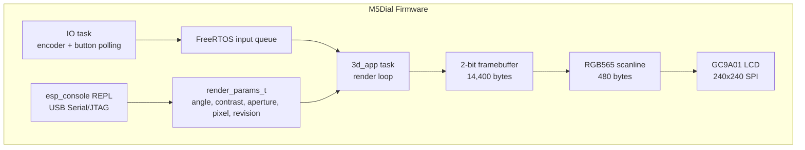

# M5Dial Dithered 3D Scene Viewer: Software Rendering on ESP32-S3

This report explains how the M5Dial dithered scene viewer was built: the hardware constraints that shaped the design, the image-processing math behind the ordered-dither aesthetic, the embedded rendering pipeline, the runtime control surface, and the debugging work required to make the output stable on the real device. The project lives at `/home/manuel/workspaces/2025-12-21/echo-base-documentation/esp32-s3-m5/0096-m5dial-dithered-3d`. The ticket documentation lives at `/home/manuel/workspaces/2025-12-21/echo-base-documentation/esp32-s3-m5/ttmp/2026/05/27/0096--m5dial-dithered-3d-scene-viewer`.

The current firmware is an ESP-IDF application for the M5Stack M5Dial. It drives the round 240×240 GC9A01 display directly through LovyanGFX, accepts runtime commands through `esp_console` over USB Serial/JTAG, and renders five four-color dithered scenes: terrain, toroid, ocean, planet, and tunnel. The terrain scene began as a target-driven port of a WebGL/Three.js JSX sketch. The first implementation attempted a general software 3D rasterizer, but hardware testing showed that the desired visual result was better served by a deterministic poster-style renderer: screen-space shapes, ordered dithering, a circular mask, four-color palette quantization, and encoder-driven scene motion.

> [!summary]
> - The firmware uses a 2-bit packed framebuffer: 240×240×2 bits = 14,400 bytes. This is the central memory decision that makes the project practical on an M5Dial with no PSRAM.
> - The visual style is created with screen-locked Bayer ordered dithering and four palette indices: black, warm, cool, and high. RGB565 expansion happens only at display-transfer time.
> - The real device changed the design. The triangle renderer built successfully but caused watchdog and flicker pressure during early tests, so the current user-visible path is an art-directed poster renderer for all scenes.
> - The rotary encoder, button, and console are not afterthoughts. They are the calibration system: encoder controls orbit, button cycles palettes, and console commands tune scene, palette, contrast, aperture, pixel size, rotation, and angle without reflashing.

## Why this project exists

The original goal was to take the visual language of a browser-based `m5dial.jsx` sketch and make it run on the physical M5Dial. The JSX version uses Three.js to render 3D scenes and a GLSL fragment shader to pixelate, dither, and reduce the image to a four-color palette. That pipeline is natural in a browser: the GPU performs vertex transformation, triangle rasterization, fragment shading, texture sampling, and post-processing. The M5Dial has none of that hardware. The ESP32-S3 must perform all graphics work in firmware and then stream pixels over SPI to the display.

The deeper goal is not only to show images on a small screen. The project is an experiment in direct embedded graphics under tight constraints. It asks a specific engineering question: how much of a shader-driven, posterized, animated scene system can be rebuilt on a no-PSRAM microcontroller if the renderer is designed around the device instead of copied from the desktop implementation?

The answer in the current build is practical and bounded. The device can render attractive four-color scenes at interactive speeds if the graphics are structured as screen-space procedural compositions rather than full general-purpose 3D geometry. The M5Dial encoder gives enough input resolution for scene orbit and parameter exploration. `esp_console` gives a development loop that is much faster than reflashing for every visual adjustment.

## Hardware target

The M5Dial is based on the ESP32-S3FN8. For this project the important properties are not the product name but the resource boundaries:

| Resource | Project-relevant fact | Consequence |
|---|---:|---|
| CPU | ESP32-S3, 240 MHz | Enough for per-pixel integer loops, but long full-frame raster work can still trip watchdogs if not yielded or bounded. |
| Flash | 8 MB embedded flash, DIO mode | Firmware and constant lookup tables fit comfortably. Build uses DIO flash mode. |
| PSRAM | None | No full RGB framebuffer plus Z-buffer. All runtime buffers must fit in internal RAM. |
| Display | GC9A01, 240×240 round LCD | Full display area is square in memory but circular in the physical product. The renderer applies a circular aperture. |
| Display bus | SPI through LovyanGFX | Output cost is dominated by streaming scanlines. RGB565 byte order must match LovyanGFX's SPI path. |
| Encoder | GPIO 40/41 | Primary interactive control. Calibrated to about 12 tactile clicks per full physical rotation. |
| Button | GPIO 42 | Palette cycling. This is useful for quick color validation on-device. |
| Console | USB Serial/JTAG | Interactive REPL for scene and rendering parameters. Preferred over UART to avoid pin conflicts. |

The firmware reuses the proven M5Dial board support from the earlier `0074-m5dial-web-remote` project. The relevant board files are copied into the project:

- `0096-m5dial-dithered-3d/main/m5dial_board.h`
- `0096-m5dial-dithered-3d/main/m5dial_board.cpp`
- `0096-m5dial-dithered-3d/main/input_events.h`
- `0096-m5dial-dithered-3d/main/vendor/ESP32Encoder.cpp`
- `0096-m5dial-dithered-3d/main/vendor/Button/Button.cpp`
- `0096-m5dial-dithered-3d/components/LovyanGFX`

The display pins come from the reference firmware: MOSI 5, SCLK 6, DC 4, CS 7, RST 8, BL 9. The encoder pins are GPIO 40 and GPIO 41. The physical button is GPIO 42. The power-hold pin is GPIO 46.

## The first constraint: memory, not geometry

The obvious graphics design is to allocate a full RGB565 framebuffer, draw into it, and push it to the display. On a 240×240 screen, that buffer is:

```text
240 × 240 × 2 bytes = 115,200 bytes
```

That sounds small on a desktop machine and large on a no-PSRAM ESP32-S3. It becomes impractical once a depth buffer or intermediate render target is added:

| Buffer | Bytes |
|---|---:|
| RGB565 framebuffer | 115,200 |
| 16-bit depth buffer | 115,200 |
| One additional staging framebuffer | 115,200 |
| Total for RGB565 + depth only | 230,400 |

The M5Dial firmware had roughly a few hundred kilobytes of internal heap after ESP-IDF, drivers, stacks, and system allocations. A design that consumes more than 200 KB before geometry, queues, stacks, and console support is fragile. It may boot in one configuration and fail after a small feature is added.

The project therefore uses a packed indexed framebuffer:

```text
240 × 240 pixels × 2 bits/pixel = 115,200 bits
115,200 / 8 = 14,400 bytes
```

Each pixel stores a palette index rather than a color. The four indices are:

| Index | Symbol | Meaning |
|---:|---|---|
| 0 | `COLOR_BLACK` | Background / masked-out area |
| 1 | `COLOR_WARM` | Red, orange, or warm palette entry |
| 2 | `COLOR_COOL` | Blue or cool palette entry |
| 3 | `COLOR_HIGH` | White, cream, or highlight entry |

The actual RGB565 colors come from the selected palette. This separation is essential. It means the renderer writes semantic color classes and the display path maps them to physical color values at the final moment. Palette switching can recolor the scene without changing the framebuffer representation.

The framebuffer implementation is in `main/framebuffer.h` and `main/framebuffer.cpp`:

```cpp
#define FB_WIDTH  240
#define FB_HEIGHT 240
#define FB_BYTES_PER_ROW  (FB_WIDTH / 4)
#define FB_TOTAL_BYTES    (FB_BYTES_PER_ROW * FB_HEIGHT)

static inline void fb_set(uint8_t* buf, int x, int y, uint8_t color) {
    const int bit_pos = (x & 3) * 2;
    const int byte_idx = y * FB_BYTES_PER_ROW + (x >> 2);
    const uint8_t mask = ~(0x03 << bit_pos);
    buf[byte_idx] = (buf[byte_idx] & mask) | ((color & 0x03) << bit_pos);
}
```

Four pixels fit in one byte. Pixel `x` selects a two-bit slot with `(x & 3) * 2`, and `x >> 2` selects the byte. This layout is simple enough to use directly from C++ inner loops and compact enough to keep the full screen resident in RAM.

## The second constraint: the display is round but the memory is square

The GC9A01 panel is addressed as a 240×240 square. The product presents it as a circular display. The renderer must therefore decide what to draw outside the visible circular region. The firmware treats the round screen as a circular aperture centered at `(120, 120)`:

```cpp
static inline bool inside_round_lcd(int x, int y, const render_params_t* p) {
    const int r = mask_radius(p);
    const int dx = x - 120;
    const int dy = y - 120;
    return dx * dx + dy * dy <= r * r;
}
```

The `aperture` console parameter scales the radius. This is not only a visual control. It is useful for debugging. A smaller aperture shows whether scene elements are centered and whether UI text sits too close to the physical edge. A larger aperture uses more of the panel.

The default aperture is currently `0.97`, which maps to a radius of about 115 pixels. The firmware clamps it between 40% and 100%:

```text
aperture 40  -> small circular viewport
aperture 97  -> default round LCD viewport
aperture 100 -> maximum radius
```

## The third constraint: display transfer format

The framebuffer is 2-bit indexed, but the LCD wants color pixels. The firmware expands one scanline at a time into a 240-entry `uint16_t` RGB565 buffer:

```cpp
uint16_t rgb565_line[FB_WIDTH];

for (int y = 0; y < FB_HEIGHT; y++) {
    fb_expand_scanline(ctx->fb, y, ctx->rgb565_line, pal->colors);
    display.writePixels(ctx->rgb565_line, FB_WIDTH);
}
```

The scanline buffer is only 480 bytes. It avoids allocating a full RGB565 frame. The expansion pass also keeps palette switching cheap: `fb_expand_scanline` reads indices and looks up `pal->colors[index]`.

One hardware bug was caused by byte order. RGB565 values in a `uint16_t` array are stored in host byte order. LovyanGFX's SPI write path sends bytes to the LCD. If the bytes are not swapped, red and blue palette entries become incorrect greenish colors. The visible symptom was that the target red/blue scene looked green or color-corrupted.

The fix is explicit:

```cpp
display.startWrite();
display.setSwapBytes(true);
display.setAddrWindow(0, 0, FB_WIDTH, FB_HEIGHT);
for (int y = 0; y < FB_HEIGHT; y++) {
    fb_expand_scanline(ctx->fb, y, ctx->rgb565_line, pal->colors);
    display.writePixels(ctx->rgb565_line, FB_WIDTH);
}
display.endWrite();
```

This matches LovyanGFX's own documentation: host-order `uint16_t` RGB565 data should be streamed with byte swapping enabled unless the data was pre-swapped.

## Ordered dithering: the image-processing core

The visual style is not antialiasing. It is ordered dithering. Each pixel has a desired density value from 0 to 64. A fixed threshold matrix decides whether the pixel is on or off for a given color class. The project uses an 8×8 Bayer matrix:

```cpp
static const uint8_t kBayer8[8][8] = {
    { 0, 48, 12, 60, 3, 51, 15, 63 },
    { 32, 16, 44, 28, 35, 19, 47, 31 },
    { 8, 56, 4, 52, 11, 59, 7, 55 },
    { 40, 24, 36, 20, 43, 27, 39, 23 },
    { 2, 50, 14, 62, 1, 49, 13, 61 },
    { 34, 18, 46, 30, 33, 17, 45, 29 },
    { 10, 58, 6, 54, 9, 57, 5, 53 },
    { 42, 26, 38, 22, 41, 25, 37, 21 },
};
```

A pixel is drawn if the requested density exceeds the matrix threshold at that pixel coordinate:

```cpp
static inline bool dither_on(int x, int y, int density, const render_params_t* p) {
    density = apply_contrast(density, p);
    if (density <= 0) return false;
    if (density >= 64) return true;
    const int px = poster_pixel_size(p);
    const int sx = (x / px) * px;
    const int sy = (y / px) * px;
    return density > kBayer8[sy & 7][sx & 7];
}
```

The important detail is that the threshold matrix is screen-locked. It depends on LCD pixel coordinates, not on time and not on object coordinates. That makes the image stable. When the encoder rotates the scene, the terrain mound or toroid shape moves, but the threshold pattern does not flicker randomly. This is the same reason the original GLSL shader used a deterministic Bayer matrix instead of noise for the final quantization pass.

Contrast is applied before thresholding:

```cpp
static inline int apply_contrast(int density, const render_params_t* p) {
    const float c = p ? clamp_f(p->contrast, 0.4f, 3.0f) : 1.4f;
    const float centered = (static_cast<float>(density) - 32.0f) * c + 32.0f;
    return clamp_i(static_cast<int>(centered), 0, 64);
}
```

This formula expands or compresses density around the midpoint 32. A contrast value above 1 makes sparse areas sparser and dense areas denser. A value below 1 flattens the image toward middle density. Because the output is binary per color class, contrast changes the distribution of on/off pixels rather than linearly changing brightness.

## Pixel size: controlled block quantization

The original JSX sketch included a pixelated post-process. The firmware now exposes a `pixel` console command with values from 1 to 6. Pixel size affects two parts of the poster renderer:

1. The dither threshold lookup is quantized to the block origin.
2. A drawn pixel can fill the whole pixel block.

The helper is deliberately simple:

```cpp
static inline int poster_pixel_size(const render_params_t* p) {
    if (!p) return 1;
    return clamp_i(p->pixel_size, 1, 6);
}
```

The threshold coordinates are snapped:

```cpp
const int px = poster_pixel_size(p);
const int sx = (x / px) * px;
const int sy = (y / px) * px;
return density > kBayer8[sy & 7][sx & 7];
```

The draw helper fills the snapped block:

```cpp
const int x0 = (x / px) * px;
const int y0 = (y / px) * px;
for (int yy = y0; yy < y0 + px && yy < FB_HEIGHT; ++yy) {
    for (int xx = x0; xx < x0 + px && xx < FB_WIDTH; ++xx) {
        if (inside_round_lcd(xx, yy, p)) fb_set(fb, xx, yy, color);
    }
}
```

This is not a separate low-resolution render target. It is a block-write rule applied during scene drawing. That choice avoids another framebuffer and preserves the existing 2-bit memory budget. It also means UI text and some direct helper primitives may remain crisper than the procedural scene content, which is useful during debugging. A later polish pass can decide whether text should also obey pixel size.

## Why the renderer changed from general 3D to poster scenes

The design document for ticket 0096 originally specified a software 3D renderer. That code exists in the project: `renderer.cpp`, `scene_terrain.cpp`, `fixedpoint.h`, and `trig_lut.cpp` implement the first version of the triangle path. It transforms geometry, projects vertices, and rasterizes triangles into the 2-bit framebuffer. The project compiled and could be flashed.

Hardware testing changed the priority. The first visible runs showed flicker, a watchdog failure in the renderer path, and a result that did not resemble the target TERRAIN image closely enough. The user supplied a target screenshot for the terrain scene: black circular field, blue ordered-dither terrain mound, red sun/halo, title text, small bottom indicators. That image is a composed poster-like scene. It is not simply a low-poly 3D mesh with a shader applied.

The practical decision was to preserve the general renderer as an experimental path and implement a dedicated poster renderer for the user-visible scenes. The current `app_main.cpp` now renders through:

```cpp
poster_render_scene(ctx->fb, scene_current_id(), p);
```

This function dispatches to scene-specific procedural renderers in `terrain_poster.cpp`:

```cpp
void poster_render_scene(uint8_t* fb, SceneId scene_id, const render_params_t* params) {
    switch (scene_id) {
        case SCENE_TERRAIN: render_terrain_scene(fb, params); break;
        case SCENE_TORUS:   render_torus_scene(fb, params);   break;
        case SCENE_OCEAN:   render_ocean_scene(fb, params);   break;
        case SCENE_PLANET:  render_planet_scene(fb, params);  break;
        case SCENE_TUNNEL:  render_tunnel_scene(fb, params);  break;
        default:            render_terrain_scene(fb, params); break;
    }
}
```

This choice is technically conservative. It removes the most expensive part of the graphics path while keeping the important parts of the product experience: the round display, the dithered four-color image, the palette system, the encoder interaction, and the console tuning controls.

## Runtime architecture

The firmware has three main runtime pieces:

1. The app task renders frames and pushes scanlines to the LCD.
2. The IO task polls the encoder and button and sends input events through a FreeRTOS queue.
3. The console REPL runs over USB Serial/JTAG and mutates global render parameters.



The render loop is dirty-frame based. When auto-rotate is disabled, it does not redraw continuously. This matters because full-screen SPI writes are visible on the LCD as flicker or tearing if repeated constantly. The loop repaints when one of these conditions is true:

- an input event changed the camera angle, scene, palette, or auto-rotate state
- auto-rotate is enabled and advances time
- a console command increments the render-parameter revision counter
- the initial boot frame has not yet been drawn

The revision counter was added because console commands run outside the app task. If a user types `contrast 2.0`, the parameter changes immediately, but the app task will not know to repaint unless there is a signal. The revision counter is the signal:

```cpp
typedef struct {
    float camera_angle;
    float auto_rotate_speed;
    float contrast;
    float aperture;
    int pixel_size;
    uint32_t revision;
    bool paused;
    bool wireframe;
} render_params_t;
```

Console setters call `render_params_touch()`:

```cpp
void render_params_touch(void) {
    s_params.revision++;
}
```

The app task observes it:

```cpp
if (p->revision != seen_revision) {
    seen_revision = p->revision;
    dirty = true;
}
```

This is a small piece of infrastructure, but it changes the development workflow. It makes console commands visually immediate without requiring continuous redraw.

## Input model

The encoder controls `camera_angle`. Hardware testing showed about twelve tactile clicks per full physical knob rotation. The original firmware used a very small angular increment, roughly two degrees per event. That felt too slow. The current mapping is:

```cpp
p->camera_angle += event.value * 0.5236f;
```

`0.5236` radians is approximately 30 degrees, or `2π / 12`. One physical revolution therefore produces about one full visual orbit if the encoder library reports one event per tactile click.

The button cycles palettes:

```cpp
case tutorial_0072::InputEventType::kButtonShortPress:
    palette_cycle_next();
    ESP_LOGI(TAG, "palette: %s", palette_current()->name);
    return true;
```

A long press toggles auto-rotation. Swipe events are wired to scene cycling, though the touch controller is currently disabled pending I2C stability work in the copied board support.

## Console controls

The console is intentionally part of the product. It provides a hardware-in-the-loop tuning surface:

| Command | Purpose |
|---|---|
| `scene [terrain|torus|ocean|planet|tunnel]` | Select scene or show current scene. |
| `palette [classic|inverted|red|blue|amber]` | Select palette or show current palette. |
| `rotate [speed]` | Set auto-rotation speed in radians per second. |
| `contrast [value]` | Set dither density contrast. |
| `aperture [pct]` | Set circular viewport radius as a percentage. |
| `pixel [size]` | Set poster pixel block size from 1 to 6. |
| `wireframe [on|off]` | Kept for the triangle renderer path. |
| `pause` | Toggle rendering pause. |
| `angle [radians]` | Set manual camera orbit angle. |
| `fps` | Show renderer statistics. |

The console runs over USB Serial/JTAG, not UART. This follows the project working rule for M5Stack ESP32-S3 boards: UART pins are often repurposed for peripherals, and UART console output can corrupt protocol traffic. USB Serial/JTAG avoids that class of pin conflict.

## Scene 1: terrain

The terrain scene is the reference scene because the user provided the strongest target for it. The desired composition is:

- black circular field
- red dithered sun/halo in the upper-right
- blue ordered-dither terrain mound dominating the lower half
- `TERRAIN` title near the top
- bottom status dots and `BIP-001`
- small palette probe squares while debugging

The terrain ridge is generated as a sum of Gaussian-like terms and sine waves. In screen coordinates, smaller `y` means higher on the display. The ridge function returns the top silhouette of the terrain for each `x`:

```cpp
static int ridge_y_for_x(int x, float angle) {
    const float xf = static_cast<float>(x);
    const float orbit = sinf(angle);
    const float orbit2 = cosf(angle * 0.7f);
    const float peak_x = 135.0f + orbit * 42.0f;
    const float shoulder_x = 70.0f + orbit * 22.0f;
    const float right_cut_x = 190.0f + orbit2 * 16.0f;

    const float peak = expf(-((xf - peak_x) * (xf - peak_x)) /
                            (2.0f * 42.0f * 42.0f));
    const float shoulder = expf(-((xf - shoulder_x) * (xf - shoulder_x)) /
                                (2.0f * 70.0f * 70.0f));
    const float right_cut = expf(-((xf - right_cut_x) * (xf - right_cut_x)) /
                                 (2.0f * 38.0f * 38.0f));

    const float wave = sinf(xf * 0.045f + angle * 2.0f) * 3.0f +
                       sinf(xf * 0.019f - angle * 1.3f) * 5.0f;

    const float y = 166.0f - peak * 64.0f - shoulder * 12.0f +
                    right_cut * 10.0f + wave;
    return clamp_i(static_cast<int>(y), 86, 190);
}
```

The encoder angle moves the peak and shoulders. This makes rotation visible without requiring a 3D mesh. The dither matrix remains fixed to the screen, so the scene changes shape but does not shimmer.

Pixels below the ridge are filled according to a depth-derived density:

```cpp
const int denom = floor_y - ridge;
int depth = denom > 0 ? ((y - ridge) * 64) / denom : 64;
int density = 59 - (depth * 44) / 64 + texture / 2;
if (y - ridge <= 2) density = 42 + texture;
if (dither_on(x, y, clamp_i(density, 4, 62), p)) {
    set_if_visible(fb, x, y, COLOR_COOL, p);
}
```

The top of the ridge is denser and the lower region is sparser. This produces the target look: a bright dithered blue mound, not a flat filled polygon.

## Scene 2: toroid

The toroid scene is the poster-renderer version of the original torus/torus-knot concept. It draws an elliptical ring with a dark center and asymmetric warm/cool coloring. The ring is defined in screen space by an implicit equation:

```cpp
r = sqrt((xr² / rx²) + (yr² / ry²))
dist = abs(r - 1)
```

Pixels with `dist <= thickness` belong to the torus band. The band density is highest near `r = 1` and falls off toward the edges. The coordinates are rotated by the camera angle:

```cpp
const float xr = dx * cos(angle) + dy * sin(angle);
const float yr = -dx * sin(angle) + dy * cos(angle);
```

The center hole is cut back to black with a second ellipse. This is important visually because a torus is recognized by the negative space in the middle. Without the explicit black hole, the dithered band reads as a filled oval.

The toroid uses warm color on one side and cool color on the other. That is not physically accurate lighting; it is palette composition. The goal is to create an object that visibly changes under palette cycling and encoder rotation.

## Scene 3: ocean

The ocean scene is built from a horizon, a low sun, and a dithered wave field. The horizon moves slightly with camera angle:

```cpp
const int horizon = 98 + static_cast<int>(sinf(angle * 0.8f) * 7.0f);
```

The water density combines two sine waves:

```cpp
const float wave = sinf(x * 0.13f + yy * 0.10f + angle * 2.2f) +
                   sinf(x * 0.035f - yy * 0.21f - angle * 1.4f);
int density = 52 - static_cast<int>(yy * 0.12f) + static_cast<int>(wave * 9.0f);
```

The result is a field of ordered-dither blue pixels with sparse white foam. The foam is a thresholded condition on the wave value:

```cpp
const bool foam = fabsf(wave) > 1.45f && ((y + x) & 3) == 0;
```

This scene is an example of a useful embedded graphics rule: procedural fields can produce rich motion with little state. The firmware does not store wave vertices or a heightmap. It computes the visible density directly from pixel coordinates and angle.

## Scene 4: planet

The planet scene uses three visual layers:

1. a starfield
2. a tilted ring behind the planet
3. a dithered circular planet with warm/cool shading and banding
4. a front ring segment over the lower planet

The planet disk is a circle in screen space. Each pixel inside the disk receives normalized coordinates:

```cpp
nx = dx / r
ny = dy / r
```

A simple directional light term controls density and color:

```cpp
shade = nx * lx + ny * ly
bands = sin(ny * 18 + angle * 1.5) * 0.16
density = 38 + shade * 30 + bands * 64
color = shade > 0.20 ? COLOR_WARM : COLOR_COOL
```

The planet is not a true sphere rasterizer. It is a disk with spherical shading cues. That is enough for a four-color 240×240 display. The image budget is small, and the target style rewards clear silhouettes more than accurate geometry.

The ring is drawn as a flattened ellipse. It is drawn once before the planet and once after the planet for the front segment. This ordering creates the expected occlusion without a depth buffer.

## Scene 5: tunnel

The tunnel scene uses polar coordinates around the screen center. For each pixel, it computes radius and angle:

```cpp
r = sqrt(xr² + yr²)
a = atan2(yr, xr)
```

It then creates moving rings and spokes:

```cpp
rings = fmod(r * 0.145 - angle * 1.7 + 40.0, 1.0)
spokes = abs(sin(a * 6.0 + angle * 1.2))
```

Pixels near a ring boundary become warm. Pixels near a spoke become cool. The rest receive sparse highlights. A black circle at the center creates a vanishing point.

This scene is computationally heavier than terrain because it uses `sqrtf`, `atan2f`, and trigonometric functions per pixel. On the ESP32-S3 this is still acceptable for an interactive poster renderer, but it is a candidate for lookup-table optimization if frame time becomes a problem. A future version can precompute per-pixel radius and angle for the static screen coordinate grid. That table would cost memory; the current version spends CPU to preserve RAM.

## Palette system

The palette system is in `main/palette.cpp`. The firmware stores five palettes:

| Palette | Index 1 warm | Index 2 cool | Index 3 high |
|---|---|---|---|
| `classic` | red `#ff2940` | blue `#3050ff` | white |
| `inverted` | blue | red | white |
| `red` | red | dark red | white |
| `blue` | light blue | blue | white |
| `amber` | amber | brown | pale amber |

The renderer writes only indices. The palette determines final RGB565 values. This lets the same scene data support several display modes.

The RGB565 conversion uses the standard bit packing:

```cpp
RGB565 = ((r >> 3) << 11) | ((g >> 2) << 5) | (b >> 3)
```

For example:

```text
#ff2940 -> r=0xff, g=0x29, b=0x40
r>>3 = 31
g>>2 = 10
b>>3 = 8
RGB565 = (31 << 11) | (10 << 5) | 8 = 0xF948
```

The earlier greenish output was not a palette math problem. The palette values were reasonable. The problem was byte order during SPI transfer. This distinction matters because changing palette constants would have hidden the actual display-path bug.

## Build system notes

The project is a normal ESP-IDF application. The root directory is:

```text
/home/manuel/workspaces/2025-12-21/echo-base-documentation/esp32-s3-m5/0096-m5dial-dithered-3d
```

The correct ESP-IDF version is 5.4.2:

```bash
cd 0096-m5dial-dithered-3d
source /home/manuel/esp/esp-idf-5.4.2/export.sh
idf.py build
```

One important build-system failure occurred early. A bad root `CMakeLists.txt` line set `COMPONENT_DIRS` manually:

```cmake
set(COMPONENT_DIRS "components" CACHE STRING "Component search dirs")
```

That looked harmless, but it hid ESP-IDF's built-in components from the resolver. The misleading error was:

```text
Failed to resolve component 'nvs_flash' required by component 'LovyanGFX': unknown name.
```

The actual problem was not that `nvs_flash` was missing. It existed in `/home/manuel/esp/esp-idf-5.4.2/components/nvs_flash`. The project had overridden the component search path. Removing the override fixed the resolver. Project-local components under `components/` are discovered automatically by ESP-IDF and do not require a manual `COMPONENT_DIRS` override.

The current `main/CMakeLists.txt` includes:

```cmake
idf_component_register(
    SRCS
        "app_main.cpp"
        "console_commands.cpp"
        "framebuffer.cpp"
        "m5dial_board.cpp"
        "palette.cpp"
        "renderer.cpp"
        "scene.cpp"
        "scene_terrain.cpp"
        "scene_stubs.cpp"
        "terrain_poster.cpp"
        "trig_lut.cpp"
        ...
    REQUIRES
        LovyanGFX
    PRIV_REQUIRES
        console
        driver
        esp_driver_usb_serial_jtag
        esp_event
        esp_timer
        esp_system
        nvs_flash
)
```

## Flashing and serial ownership

The device is flashed and monitored through `/dev/ttyACM0`:

```bash
idf.py -p /dev/ttyACM0 flash monitor
```

The project follows a strict single-owner rule for serial devices. Before flashing or probing, check for stale holders:

```bash
fuser -v /dev/ttyACM0
```

This matters on USB Serial/JTAG. If an old `idf_monitor.py` process still owns the port, new flash or monitor commands can fail with misleading serial timeouts, missing prompts, or interleaved output.

## Debugging timeline

The implementation was not a straight path from design to final scene. Several failures were important because they forced the current architecture.

### 1. Component resolution failure

The build initially failed with an error about `nvs_flash`. The root cause was a project-local CMake override that removed IDF built-ins from component search. The fix was to remove the override and let ESP-IDF discover local components normally.

### 2. Console API mismatch

The firmware first attempted a hand-written USB Serial/JTAG console loop. ESP-IDF 5.4.2's console APIs are easier to use through the REPL helper:

```cpp
esp_console_new_repl_usb_serial_jtag(&dev_config, &repl_config, &repl);
esp_console_start_repl(repl);
```

This avoids mismatches between VFS setup, linenoise, and USB Serial/JTAG configuration.

### 3. Display crash from incorrect LovyanGFX write API

An early display path used an incorrect `pushColors` call with a byte pointer and byte count. The fix was to use `writePixels` with a `uint16_t` scanline and pixel count:

```cpp
display.writePixels(ctx->rgb565_line, FB_WIDTH);
```

### 4. Watchdog pressure in triangle rendering

The early terrain triangle renderer could run long enough to trip the task watchdog. Reducing mesh resolution and adding yields helped, but the target image still called for a poster renderer. The poster path became the default user-visible renderer.

### 5. Flicker from continuous redraw

Auto-rotation and continuous full-frame redraw caused visible flicker. Dirty-frame rendering fixed that for manual operation. Auto-rotate still works, but the default boot state is static.

### 6. Greenish colors from RGB565 byte order

The final display-color bug was byte order. Adding `display.setSwapBytes(true)` before scanline writes fixed the class of greenish output caused by byte-swapped RGB565 values.

### 7. Encoder sensitivity

The first encoder mapping was too slow. The device has about twelve tactile clicks per full knob rotation. The current mapping uses `2π / 12` radians per click, so one physical rotation corresponds to about one full scene orbit.

## Current file map

| File | Role |
|---|---|
| `main/app_main.cpp` | Boot, board init, console start, render loop, input handling, LCD scanline push. |
| `main/framebuffer.h/.cpp` | 2-bit packed framebuffer and RGB565 scanline expansion. |
| `main/terrain_poster.h/.cpp` | Current poster renderer for terrain, toroid, ocean, planet, and tunnel. |
| `main/console_commands.cpp` | REPL commands for scene, palette, rotation, contrast, aperture, pixel size, and stats. |
| `main/palette.h/.cpp` | Four-color RGB565 palette system. |
| `main/scene.h/.cpp` | Scene registry and render parameters. |
| `main/renderer.cpp` | Experimental general triangle renderer retained for future work. |
| `main/scene_terrain.cpp` | Early terrain mesh path retained for the triangle renderer. |
| `main/scene_stubs.cpp` | Scene definitions for non-terrain names; currently poster renderer supplies visuals. |
| `main/m5dial_board.cpp` | Board support: display, encoder, button, power hold. |
| `components/LovyanGFX` | Display driver dependency copied from the reference project. |

## Current command examples

After flashing, the console prompt is:

```text
3d>
```

Useful commands:

```text
scene terrain
scene torus
scene ocean
scene planet
scene tunnel

palette classic
palette blue
palette amber

contrast 1.8
contrast 0.8

aperture 90
aperture 100

pixel 1
pixel 3
pixel 5

angle 0
angle 1.57
rotate 0.5
rotate 0
fps
```

Because console setters increment the render-parameter revision, the display should repaint after these commands even when auto-rotate is disabled.

## Why the project uses `esp_console`

A firmware that only changes behavior through reflashing has a slow graphics iteration loop. Small visual changes require editing code, compiling, flashing, and observing the screen. The console changes that loop. It lets the developer isolate parameters:

- Is the dither contrast too strong? Run `contrast 1.0`, `contrast 1.8`, `contrast 2.3`.
- Is the circular mask too small? Run `aperture 100`.
- Does the scene composition respond to rotation? Run `angle 0`, `angle 1.57`, `angle 3.14`.
- Does the pixelated style need coarser blocks? Run `pixel 2`, `pixel 4`.
- Is the palette byte order correct? Press the button or run `palette classic`, `palette inverted`, `palette amber`.

This is not a substitute for good code structure, but it is an important embedded workflow tool. The physical display is the final judge of the image, and console control makes hardware evaluation immediate.

## What is intentionally not solved yet

The current firmware is not the final full 3D renderer described by the first design document. It is a working embedded scene viewer with a poster-style renderer. The distinction is important.

Not yet finished:

- A serial framebuffer screenshot command. This would emit the 2-bit framebuffer and palette so a host script can reconstruct a PNG without photographing the device.
- A polished scene-specific UI mode that hides palette probe squares.
- A fully optimized triangle renderer with scanline Z-buffer and stable frame timing.
- LUT optimization for expensive per-pixel `sqrtf`, `atan2f`, `sinf`, and `cosf` in the poster scenes.
- Touch input. The copied board support currently disables touch pending an I2C stability fix.
- A runtime command for encoder sensitivity. The current value is compiled in as `2π / 12` radians per click.

These gaps are normal for this stage. The firmware now has the core loop: render, display, interact, tune. Future work can improve one subsystem at a time.

## Engineering lessons

The most important lesson is that the embedded renderer should be designed around the representation that the hardware can sustain. A full RGB framebuffer is convenient, but it is not the right default on a no-PSRAM M5Dial. A 2-bit indexed framebuffer gives the project enough memory margin to keep the rest of the firmware simple.

The second lesson is that the target image matters. The desired TERRAIN scene was not an arbitrary 3D scene. It had a specific graphic composition. Once that was clear, a procedural poster renderer became a better engineering choice than forcing the triangle path to approximate a design it was not naturally producing.

The third lesson is that low-level display correctness must be verified independently from render math. A color bug can look like a palette bug, a shader bug, or a scene bug. In this project, the greenish output came from RGB565 byte order at the LovyanGFX/SPI boundary. Palette probe squares made that class of bug visible quickly.

The fourth lesson is that dirty rendering is a graphics feature on small SPI displays. Avoiding unnecessary full-screen writes improves visual stability. It also reduces CPU and bus use, which leaves more room for input handling and console responsiveness.

The fifth lesson is that embedded graphics need a live control surface. `esp_console` made it possible to tune contrast, aperture, pixel size, scene, palette, rotation, and angle on the real display. Without that, the project would have required many more flash cycles for visual iteration.

## Recommended next implementation sequence

The next useful steps are incremental:

1. **Flash the latest five-scene poster build and validate each scene on-device.** Check color byte order, scene selection, encoder rotation, button palette cycling, and console redraw.
2. **Add `dumpfb` or `screenshot`.** Emit framebuffer bytes and palette values over serial. Write a host script that reconstructs a PNG. This will make future visual iteration evidence-based.
3. **Add a `sensitivity` command.** Keep the current 12-click default but allow runtime tuning.
4. **Add a `debug-ui` command.** Toggle palette probe squares and other diagnostic overlays.
5. **Profile poster scene frame times.** The tunnel scene is the likely slowest because of `atan2f`. If needed, precompute radius/angle tables or reduce per-pixel math.
6. **Decide the role of the triangle renderer.** Either continue toward the original 3D design or keep it as an experimental backend and polish the poster renderer as the primary product.
7. **Upload the final design/report bundle to reMarkable when the scene set is stable.** The ticket already has a design doc and diary; the report can be part of the final project handoff.

## Reference paths

- Firmware: `/home/manuel/workspaces/2025-12-21/echo-base-documentation/esp32-s3-m5/0096-m5dial-dithered-3d`
- Ticket: `/home/manuel/workspaces/2025-12-21/echo-base-documentation/esp32-s3-m5/ttmp/2026/05/27/0096--m5dial-dithered-3d-scene-viewer`
- Design doc: `/home/manuel/workspaces/2025-12-21/echo-base-documentation/esp32-s3-m5/ttmp/2026/05/27/0096--m5dial-dithered-3d-scene-viewer/design-doc/01-dithered-3d-scene-viewer-design-and-implementation-guide.md`
- Investigation diary: `/home/manuel/workspaces/2025-12-21/echo-base-documentation/esp32-s3-m5/ttmp/2026/05/27/0096--m5dial-dithered-3d-scene-viewer/reference/01-investigation-diary.md`
- JSX source copied into ticket: `/home/manuel/workspaces/2025-12-21/echo-base-documentation/esp32-s3-m5/ttmp/2026/05/27/0096--m5dial-dithered-3d-scene-viewer/scripts/m5dial.jsx`
- M5Dial reference firmware: `/home/manuel/workspaces/2025-12-21/echo-base-documentation/esp32-s3-m5/0074-m5dial-web-remote/firmware`

## Closing

The M5Dial dithered scene viewer is a small firmware project, but it exercises several important embedded graphics decisions: memory representation, display transfer format, deterministic dithering, input calibration, runtime tuning, and hardware-driven redesign. The result is not a desktop renderer compressed into a microcontroller. It is a renderer shaped by the M5Dial's actual limits: no PSRAM, a round 240×240 SPI display, a tactile encoder, and enough CPU for carefully bounded per-pixel procedural drawing.

That is the useful pattern to preserve. Start with the target image and the hardware budget. Choose the framebuffer representation first. Make the display path correct and measurable. Add live controls early. Then build scenes that fit the representation instead of carrying desktop assumptions into firmware.
