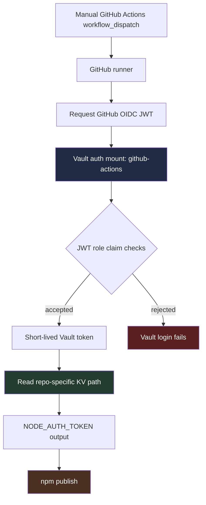
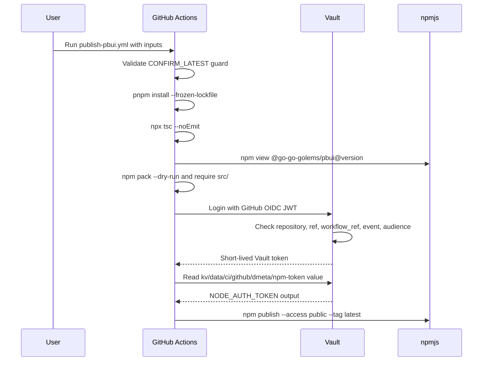
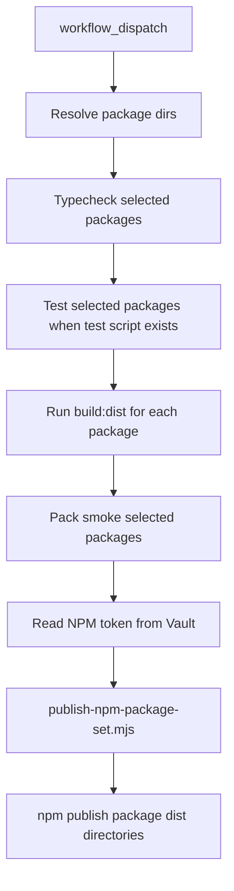

# NPM Publishing for Go Go Golems Packages with Vault OIDC

> [!important]
> This note is now historical. `go-go-os-frontend` and `react-chat` have moved to tokenless npm Trusted Publishing, and their npm publish workflows no longer read npm tokens from Vault. Use [[ARTICLE - Trusted npm Publishing for Go Go Golems React Packages]] as the current playbook for public package publishing. Keep this note for understanding the earlier Vault-backed design and the failure mode that motivated the migration.

This article explains how npm publishing was added and hardened for Go Go Golems packages, using `@go-go-golems/pbui` in `dmeta` and the package publishing workflow in `go-go-os-frontend` as the concrete implementations. The main subject is not npm alone. The important system is the connection between package shape, GitHub Actions workflow design, Vault-backed secret access, npm token permissions, and operational safety checks.

> [!summary]
> - `dmeta` publishes `@go-go-golems/pbui` as a source-only Tailwind-aware package from `packages/pbui`.
> - `go-go-os-frontend` publishes compiled package artifacts from each package's `dist/` directory after running `build:dist`.
> - Both repositories now retrieve `NODE_AUTH_TOKEN` from Vault through GitHub Actions OIDC instead of storing the npm token directly as a GitHub secret.
> - Dry-run workflows succeeded for both repositories, but the first real PBUI publish failed at npm with a scope permission error, which means Vault retrieval worked but the npm token or npm org permission still needs correction before the first real publish.

## Why this note exists

Publishing scoped npm packages is a small operation at the command line and a larger operation in CI. The command itself is short:

```bash
npm publish --access public --tag latest
```

That command is not the system. The system must answer several questions before the command is safe to run unattended or semi-attended:

- Which files are included in the tarball?
- Does the package need compiled JavaScript, or should it publish TypeScript source?
- Which branch and workflow are allowed to publish?
- Where does the npm credential live?
- How does GitHub Actions prove to Vault that this workflow is allowed to read that credential?
- What prevents an accidental `latest` publish?
- How do we test the pipeline before publishing an immutable version to npm?
- What does a permission failure look like, and which layer produced it?

The work described here put those answers in place for two related but different package publishing models.

## The two package publishing models

The Go Go Golems frontend packages now have two publishing shapes. They share authentication and safety mechanisms, but they differ in the artifact that npm receives.

| Repository | Package example | Artifact model | Publish command location | Reason |
|---|---|---|---|---|
| `dmeta` | `@go-go-golems/pbui` | Source-only package containing `src/` | `packages/pbui` | Tailwind v4 consumers need to scan package source with `@source`. |
| `go-go-os-frontend` | `@go-go-golems/os-core` | Compiled `dist/` package | repository root script publishes package `dist/` directories | Existing packages ship JavaScript, declarations, CSS assets, and rewritten package metadata. |

This distinction matters because npm publishing is not only about authentication. It is also about the package contract. A source-only package exposes `.ts` and `.tsx` files as the public package surface. A compiled package exposes `.js` and `.d.ts` files. The workflow must validate the correct artifact for each case.

## Package model 1: source-only PBUI publishing

`@go-go-golems/pbui` is a React package extracted from the Deli PBUI proof of concept in `dmeta`. Its published package intentionally includes source files:

```json
{
  "name": "@go-go-golems/pbui",
  "version": "0.1.0",
  "files": [
    "src",
    "README.md"
  ],
  "publishConfig": {
    "access": "public"
  },
  "exports": {
    ".": "./src/index.ts",
    "./theme": "./src/theme/index.ts",
    "./theme/clim-tokens.css": "./src/theme/clim-tokens.css",
    "./action-engine": "./src/actionEngine.ts",
    "./command-parser": "./src/commandParser.ts",
    "./session-slice": "./src/pbuiSessionSlice.ts",
    "./routing": "./src/routing.ts",
    "./types": "./src/types.ts"
  }
}
```

The source-only decision came from Tailwind v4 integration. PBUI components contain Tailwind class strings in their source. A consuming application must include those source files in Tailwind content discovery. The package README documents this through an `@source` directive such as:

```css
@source "../node_modules/@go-go-golems/pbui/src";
```

The PBUI publish workflow therefore does not run `build:dist`. It validates TypeScript, verifies that `npm pack --dry-run` includes `src/`, retrieves the npm token from Vault, and runs `npm publish` from `packages/pbui`.

The relevant workflow file is:

```text
/home/manuel/code/wesen/go-go-golems/dmeta/.github/workflows/publish-pbui.yml
```

The core publish sequence is:

```yaml
- name: Typecheck
  run: npx tsc --noEmit

- name: Pack smoke test
  if: steps.version-check.outputs.skip != 'true'
  run: |
    set -euo pipefail
    PACK_OUT=$(npm pack --dry-run 2>&1)
    echo "$PACK_OUT"
    if ! echo "$PACK_OUT" | grep -q "src/"; then
      echo "ERROR: src/ directory not found in npm pack output" >&2
      exit 1
    fi

- name: Read NPM token from Vault
  id: vault-npm
  if: steps.version-check.outputs.skip != 'true'
  uses: hashicorp/vault-action@v3
  with:
    url: https://vault.yolo.scapegoat.dev
    method: jwt
    path: github-actions
    role: dmeta-npm-publish
    jwtGithubAudience: https://vault.yolo.scapegoat.dev
    exportEnv: false
    secrets: |
      kv/data/ci/github/dmeta/npm-token value | NODE_AUTH_TOKEN

- name: Publish to npm
  if: steps.version-check.outputs.skip != 'true'
  env:
    NODE_AUTH_TOKEN: ${{ steps.vault-npm.outputs.NODE_AUTH_TOKEN }}
  run: |
    set -euo pipefail
    ARGS=(--access public --tag "${{ inputs.npm_tag }}")
    if [ "${{ inputs.dry_run }}" = "true" ]; then
      ARGS+=(--dry-run)
    fi
    npm publish "${ARGS[@]}"
```

The pack smoke test is specific to the PBUI model. For this package, a tarball without `src/` is not a valid package even if TypeScript passes. The expected pack output during validation included 47 files, a 16.0 KB package size, and `src/` entries such as `src/actionEngine.ts`, `src/components/PbuiShell/PbuiShell.tsx`, and `src/theme/clim-tokens.css`.

## Package model 2: compiled go-go-os-frontend publishing

`go-go-os-frontend` already had a more general publishing system. It can publish one package, a named package set, or all package sets. Its workflow is:

```text
/home/manuel/code/wesen/go-go-golems/go-go-os-frontend/.github/workflows/publish-npm.yml
```

The workflow accepts a `package_set` input with values such as `single`, `os-core`, `first-wave`, `shell-stack`, `vm-stack`, and `all`. When `package_set=single`, it resolves `package_name` to one package directory. When a set name is used, it delegates package ordering to:

```text
/home/manuel/code/wesen/go-go-golems/go-go-os-frontend/scripts/packages/package-sets.mjs
```

The compiled-publish path has three important scripts or steps:

1. Each selected package runs its own `typecheck` script.
2. Each selected package runs tests if it has a `test` script.
3. Each selected package runs `build:dist`, which invokes `scripts/packages/build-dist.mjs`.

The `build-dist.mjs` script prepares the actual publish directory. It removes the existing `dist/`, writes a temporary TypeScript configuration, compiles TypeScript, copies CSS and `.vm.js` assets, removes test/story artifacts, writes a publish-specific `dist/package.json`, and copies the README into `dist/`.

The publish-specific `package.json` rewriting is significant. Development package metadata can point to `src/index.ts`; published metadata must point to runtime JavaScript and declarations. The script rewrites source targets along these lines:

```text
./src/index.ts        -> ./index.js      for runtime imports
./src/index.ts        -> ./index.d.ts    for types
./src/theme.css       -> ./theme.css     for copied assets
workspace:*          -> concrete workspace package versions
```

The publish script then publishes the `dist/` directory, not the package root:

```js
function publishPackage(distDir, tag, dryRun, provenance) {
  const publishArgs = [
    'publish',
    distDir,
    '--access',
    'public',
    '--tag',
    tag,
    `--registry=${npmRegistry}`,
  ];

  if (provenance && !dryRun) {
    publishArgs.push('--provenance');
  }

  if (dryRun) {
    publishArgs.push('--dry-run');
  }

  return runNpm(publishArgs, workspaceRoot).status ?? 1;
}
```

This model is the right choice for packages whose public npm surface should be compiled JavaScript. It is not the current PBUI choice because PBUI's Tailwind integration depends on publishing source files.

## The shared workflow safety model

Both workflows are manual. They use `workflow_dispatch`, not automatic publish-on-tag. This is intentional. Publishing to npm creates an immutable package version. The workflows preserve human control while still making the operation reproducible.

The shared safety controls are:

| Control | Where it appears | Purpose |
|---|---|---|
| `workflow_dispatch` | Both workflows | Prevents publishing as a side effect of ordinary pushes. |
| `dry_run` defaulting to `true` | Both workflows | Makes validation the default operation. |
| `skip_existing` | Both workflows | Avoids failing or republishing when the same version already exists. |
| `confirm_latest_publish` | Both workflows | Requires `CONFIRM_LATEST` for a real `latest` publish. |
| `concurrency` | Both workflows | Prevents overlapping publish jobs for the same publishing domain. |
| `environment: npm-production` | Both workflows | Keeps GitHub environment controls available even though the token comes from Vault. |
| `permissions: id-token: write` | Both workflows | Allows GitHub Actions to request an OIDC token for Vault login. |

The `CONFIRM_LATEST` guard is implemented before any package preparation in both workflows. In PBUI it is a shell check:

```bash
if [ "${{ inputs.dry_run }}" = "false" ] \
  && [ "${{ inputs.npm_tag }}" = "latest" ] \
  && [ "${{ inputs.confirm_latest_publish }}" != "CONFIRM_LATEST" ]; then
  echo "ERROR: Real latest publishes require confirm_latest_publish=CONFIRM_LATEST" >&2
  exit 1
fi
```

In `go-go-os-frontend`, the workflow also passes a process environment variable to the publish script:

```yaml
env:
  CONFIRM_LATEST_PUBLISH: ${{ inputs.confirm_latest_publish == 'CONFIRM_LATEST' && 'true' || 'false' }}
```

The Node script enforces it again:

```js
if (args.tag === 'latest' && args.dryRun === false && process.env.CONFIRM_LATEST_PUBLISH !== 'true') {
  throw new Error('Refusing real latest publish without CONFIRM_LATEST_PUBLISH=true.');
}
```

This duplicate guard is useful. The workflow validates user input early, and the script protects the publish primitive if it is invoked from another workflow later.

## Authentication architecture

The final authentication design uses GitHub Actions OIDC to authenticate to Vault. Vault then returns the npm token from a narrow KV path. The workflow passes that token to npm as `NODE_AUTH_TOKEN` only for the publish step.



The design has three separate credentials or identities:

| Layer | Credential or identity | Lifetime | Purpose |
|---|---|---|---|
| GitHub Actions | OIDC JWT from `token.actions.githubusercontent.com` | Short-lived | Proves which repo, ref, workflow, and event is running. |
| Vault | Vault token issued by `auth/github-actions/login` | Short-lived | Allows reading exactly the permitted KV path. |
| npm | npm automation/publish token stored in Vault KV | Long-lived until rotated | Authorizes `npm publish` against npmjs. |

These layers should not be collapsed. The GitHub OIDC token is not an npm token. The Vault token is not an npm token. The npm token is not exposed to the whole workflow environment. It is read after package validation and passed only to the publish command.

## Vault auth mount

Vault already had a GitHub Actions JWT auth mount:

```text
auth/github-actions/    jwt
```

The mount is configured to trust GitHub's OIDC issuer:

```text
bound_issuer:       https://token.actions.githubusercontent.com
oidc_discovery_url: https://token.actions.githubusercontent.com
```

A workflow can use this mount only if it has:

```yaml
permissions:
  contents: read
  id-token: write
```

`contents: read` allows checkout. `id-token: write` allows the workflow to request a GitHub OIDC token. Without `id-token: write`, `hashicorp/vault-action` cannot obtain the JWT needed for Vault login.

## Vault policies

Two new Vault policies were created. Each policy can read one repo-specific npm token and can manage its own short-lived Vault token lifecycle.

The dmeta policy is:

```hcl
# GitHub Actions role for publishing @go-go-golems/pbui from go-go-golems/dmeta.
path "kv/data/ci/github/dmeta/npm-token" {
  capabilities = ["read"]
}

path "auth/token/lookup-self" {
  capabilities = ["read"]
}

path "auth/token/renew-self" {
  capabilities = ["update"]
}

path "auth/token/revoke-self" {
  capabilities = ["update"]
}
```

The go-go-os-frontend policy is the same shape with a different KV path:

```hcl
path "kv/data/ci/github/go-go-os-frontend/npm-token" {
  capabilities = ["read"]
}
```

The policies do not grant list access. They do not grant access to other CI secrets. They do not grant access to application runtime secrets. They are narrow publish-credential policies.

The KV paths were populated with the local npmjs publish token without printing the secret:

```bash
vault kv put kv/ci/github/dmeta/npm-token value="<npm-automation-token>"
vault kv put kv/ci/github/go-go-os-frontend/npm-token value="<npm-automation-token>"
```

At the time of setup, both paths used the same npm token. That works operationally, but it is not the best long-term permission model. Separate npm automation tokens per repository would make revocation and audit easier.

## Vault JWT roles

A Vault policy says what a Vault token may do after login. A Vault JWT role says which external JWTs are allowed to login and receive that policy.

The `dmeta-npm-publish` role is bound to the exact publish workflow on `main`:

```text
role:              dmeta-npm-publish
bound_audiences:   https://vault.yolo.scapegoat.dev
bound_claims_type: glob
policies:          gha-dmeta-npm-publish
ttl:               10m
max_ttl:           30m
```

The important bound claims are:

```json
{
  "repository": "go-go-golems/dmeta",
  "repository_owner": "go-go-golems",
  "event_name": "workflow_dispatch",
  "ref": "refs/heads/main",
  "workflow_ref": "go-go-golems/dmeta/.github/workflows/publish-pbui.yml@refs/heads/main"
}
```

The `go-go-os-frontend-npm-publish` role has the same structure:

```json
{
  "repository": "go-go-golems/go-go-os-frontend",
  "repository_owner": "go-go-golems",
  "event_name": "workflow_dispatch",
  "ref": "refs/heads/main",
  "workflow_ref": "go-go-golems/go-go-os-frontend/.github/workflows/publish-npm.yml@refs/heads/main"
}
```

These claim bindings are strict. A task branch cannot use the role. A different workflow file cannot use the role. A push event cannot use the role. A workflow in another repository cannot use the role. That strictness is the central security property of this setup.

The first attempt to create the roles used a shell string for `bound_claims` and failed:

```text
error converting input for field "bound_claims": '' expected a map, got 'string'
```

The working method was to write the role with JSON on stdin:

```bash
vault write auth/github-actions/role/dmeta-npm-publish - <<'JSON'
{
  "role_type": "jwt",
  "bound_audiences": ["https://vault.yolo.scapegoat.dev"],
  "bound_claims_type": "glob",
  "bound_claims": {
    "repository": "go-go-golems/dmeta",
    "repository_owner": "go-go-golems",
    "event_name": "workflow_dispatch",
    "ref": "refs/heads/main",
    "workflow_ref": "go-go-golems/dmeta/.github/workflows/publish-pbui.yml@refs/heads/main"
  },
  "user_claim": "repository",
  "policies": ["gha-dmeta-npm-publish"],
  "ttl": "10m",
  "max_ttl": "30m"
}
JSON
```

Use JSON for map-valued Vault role fields. It avoids shell quoting behavior that turns nested maps into strings.

## How the workflow reads from Vault

Both workflows use `hashicorp/vault-action@v3` with the JWT method:

```yaml
- name: Read NPM token from Vault
  id: vault-npm
  uses: hashicorp/vault-action@v3
  with:
    url: https://vault.yolo.scapegoat.dev
    method: jwt
    path: github-actions
    role: dmeta-npm-publish
    jwtGithubAudience: https://vault.yolo.scapegoat.dev
    exportEnv: false
    secrets: |
      kv/data/ci/github/dmeta/npm-token value | NODE_AUTH_TOKEN
```

The fields have specific meanings:

| Field | Meaning |
|---|---|
| `url` | Vault server URL. |
| `method: jwt` | Use Vault's JWT auth method. |
| `path: github-actions` | Use the `auth/github-actions/` mount. |
| `role` | Use the repo-specific Vault JWT role. |
| `jwtGithubAudience` | Request a GitHub OIDC token with the same audience the Vault role expects. |
| `exportEnv: false` | Do not put the secret into every later step automatically. |
| `secrets` | Read one KV field and expose it as one action output. |

The publish step then opts into the secret explicitly:

```yaml
env:
  NODE_AUTH_TOKEN: ${{ steps.vault-npm.outputs.NODE_AUTH_TOKEN }}
```

This is more precise than exporting `NODE_AUTH_TOKEN` globally. Dependency installation, typechecking, tests, package resolution, and pack smoke tests do not need npm publish credentials. The publish step does.

## End-to-end sequence

The complete PBUI sequence is:



The go-go-os-frontend sequence adds package-set resolution and `build:dist` before the Vault read:



Reading the npm token after build and pack validation is deliberate. If validation fails, the workflow never asks Vault for the npm token.

## Validation performed

Two dry-run workflows were dispatched after the Vault roles, policies, KV paths, and workflow changes were in place.

| Repository | Workflow | Inputs | Run | Result |
|---|---|---|---|---|
| `go-go-golems/dmeta` | `publish-pbui.yml` | `npm_tag=latest`, `dry_run=true`, `skip_existing=true` | `26481694722` | success |
| `go-go-golems/go-go-os-frontend` | `publish-npm.yml` | `package_set=single`, `package_name=@go-go-golems/os-core`, `npm_tag=latest`, `dry_run=true`, `skip_existing=true` | `26481694779` | success |

The successful steps in both runs included:

- package validation;
- `Read NPM token from Vault`;
- the npm publish dry-run step.

The dry-run result validates the CI wiring and Vault access. It does not fully prove that npm will accept a real publish for a new scoped package. npm dry-run can complete without exercising every server-side permission path that a real publish uses. The later real publish attempt exposed that distinction.

## The real PBUI publish failure

A real PBUI publish was attempted with:

```text
workflow: publish-pbui.yml
repo: go-go-golems/dmeta
run: 26511392684
inputs: npm_tag=latest, dry_run=false, skip_existing=true, confirm_latest_publish=CONFIRM_LATEST
```

The workflow reached the publish step. That means these parts succeeded:

- workflow input validation;
- dependency installation;
- TypeScript validation;
- version existence check;
- pack smoke test;
- Vault OIDC login;
- Vault KV read;
- `NODE_AUTH_TOKEN` injection into the publish step.

The failure occurred at npm:

```text
Publishing @go-go-golems/pbui@0.1.0 with tag=latest dry_run=false
npm notice Publishing to https://registry.npmjs.org/ with tag latest and public access
npm error code E404
npm error 404 Not Found - PUT https://registry.npmjs.org/@go-go-golems%2fpbui - Not found
npm error 404  The requested resource '@go-go-golems/pbui@0.1.0' could not be found or you do not have permission to access it.
```

For a first publish of a scoped package, npm's `E404` message often means the authenticated token does not have permission to publish under that scope. The package not existing is expected before the first publish. The relevant part is `or you do not have permission to access it`.

This error is not a Vault failure. If Vault auth had failed, the `Read NPM token from Vault` step would have failed before `npm publish`. If the workflow guard had failed, the job would not have reached package publication. The failure is in the npm authorization layer.

The corrective action is to use an npm automation token that has publish rights for the `@go-go-golems` organization scope, then update the Vault KV paths with that token:

```bash
vault kv put kv/ci/github/dmeta/npm-token value="<npm-token-with-go-go-golems-publish-permission>"
vault kv put kv/ci/github/go-go-os-frontend/npm-token value="<npm-token-with-go-go-golems-publish-permission>"
```

After rotation, rerun the PBUI workflow with `dry_run=true` once, then rerun with `dry_run=false` and `CONFIRM_LATEST` if the dry run still succeeds.

## Operational commands

Use these commands to inspect the Vault setup without printing secret values.

Read roles:

```bash
vault read auth/github-actions/role/dmeta-npm-publish
vault read auth/github-actions/role/go-go-os-frontend-npm-publish
```

Read policies:

```bash
vault policy read gha-dmeta-npm-publish
vault policy read gha-go-go-os-frontend-npm-publish
```

Check whether secret metadata exists:

```bash
vault kv metadata get kv/ci/github/dmeta/npm-token
vault kv metadata get kv/ci/github/go-go-os-frontend/npm-token
```

Do not use `vault kv get` in logs or shared terminals unless you intend to reveal the token value. Metadata confirms existence without exposing the secret field.

Dispatch a PBUI dry run:

```bash
gh workflow run publish-pbui.yml \
  --repo go-go-golems/dmeta \
  --ref main \
  -f npm_tag=latest \
  -f dry_run=true \
  -f skip_existing=true \
  -f confirm_latest_publish=''
```

Dispatch a PBUI real publish after permission is fixed:

```bash
gh workflow run publish-pbui.yml \
  --repo go-go-golems/dmeta \
  --ref main \
  -f npm_tag=latest \
  -f dry_run=false \
  -f skip_existing=true \
  -f confirm_latest_publish=CONFIRM_LATEST
```

Dispatch a go-go-os-frontend single-package dry run:

```bash
gh workflow run publish-npm.yml \
  --repo go-go-golems/go-go-os-frontend \
  --ref main \
  -f package_set=single \
  -f package_name=@go-go-golems/os-core \
  -f npm_tag=latest \
  -f dry_run=true \
  -f skip_existing=true \
  -f confirm_latest_publish=''
```

## Recommended implementation sequence for a new package

When adding npm publishing for another Go Go Golems package, use this sequence.

### 1. Decide the artifact model

Choose source-only publishing only when the consumer needs source files at runtime or build time. PBUI needs source because Tailwind v4 content discovery must scan class strings inside package source. Most packages should publish compiled JavaScript and declarations.

The decision determines these workflow details:

| Decision | Source-only | Compiled dist |
|---|---|---|
| Publish directory | package root | package `dist/` directory |
| Required build step | Typecheck only | `build:dist` |
| Pack smoke check | Ensure `src/` is included | Ensure compiled files and declarations are included |
| Package exports | May point to `src/*.ts` | Should point to `.js` and `.d.ts` |

### 2. Add package metadata

Every public scoped package should have:

```json
{
  "name": "@go-go-golems/<name>",
  "version": "0.1.0",
  "private": false,
  "publishConfig": {
    "access": "public"
  },
  "repository": {
    "type": "git",
    "url": "git+https://github.com/go-go-golems/<repo>.git",
    "directory": "packages/<name>"
  }
}
```

The `publishConfig.access=public` field is important for scoped public packages. The workflow also passes `--access public`, but keeping the package metadata explicit makes local dry runs and future tooling easier to reason about.

### 3. Add workflow safety inputs

The workflow should be manual and should default to dry-run:

```yaml
on:
  workflow_dispatch:
    inputs:
      npm_tag:
        default: latest
      dry_run:
        default: true
        type: boolean
      skip_existing:
        default: true
        type: boolean
      confirm_latest_publish:
        default: ''
```

Then enforce `CONFIRM_LATEST` before the workflow reads the npm token.

### 4. Add a Vault policy and role

Use one KV path per repository or per publishing domain:

```text
kv/ci/github/<repo>/npm-token
```

Create a narrow policy with read access only to that path. Create a JWT role bound to:

- `repository`;
- `repository_owner`;
- `event_name=workflow_dispatch`;
- `ref=refs/heads/main`;
- exact `workflow_ref`.

Do not bind a production npm publish role to `pull_request`, `push`, or a wildcard workflow path.

### 5. Read the npm token as late as possible

The workflow should run validation before secret retrieval. A good order is:

```text
checkout
setup pnpm/node
validate inputs
install dependencies
typecheck
test/build
pack smoke
read npm token from Vault
npm publish
```

The npm token is needed only for the last step. Keeping it out of earlier steps reduces accidental exposure and makes the workflow easier to audit.

### 6. Validate in two phases

First validate the workflow without a real publish:

```text
dry_run=true
```

Then validate the real publish path only after checking npm token permissions:

```text
dry_run=false
confirm_latest_publish=CONFIRM_LATEST
```

If a real publish fails with npm `E404` for a scoped package, inspect npm org membership and token permissions before changing Vault or workflow code.

## Failure modes and diagnosis

| Symptom | Likely layer | What to check |
|---|---|---|
| `hashicorp/vault-action` cannot get an ID token | GitHub workflow permissions | Confirm `permissions.id-token: write`. |
| Vault login fails with claim mismatch | Vault JWT role | Check `repository`, `ref`, `workflow_ref`, `event_name`, and audience. |
| Vault login succeeds but secret read fails | Vault policy or KV path | Check policy path uses `kv/data/...` for KV v2 and that metadata exists. |
| `npm pack --dry-run` omits expected files | Package `files` field or `.npmignore` | Inspect pack output before publishing. |
| `npm publish --dry-run` succeeds but real publish fails | npm server-side authorization | Check npm org scope permissions and automation token type. |
| npm returns `E404` on first scoped package publish | npm scope permission | Verify token can publish to `@go-go-golems`. |
| npm returns existing version error | Version management | Bump package version or keep `skip_existing=true`. |
| Workflow works on `main` but not on a task branch | Expected Vault claim binding | Production publish roles are intentionally bound to `refs/heads/main`. |

## Working rules

The publishing system should follow these rules unless there is a deliberate reason to change them.

- Publish workflows should be manual unless the release process explicitly moves to tag-based automation.
- Real `latest` publishes should require an explicit confirmation input.
- Vault roles for npm publishing should be bound to an exact workflow path on `main`.
- Policies should read one npm token path and no broader CI secret tree.
- The npm token should be read after validation and passed only to the publish step.
- `npm pack --dry-run` output should be treated as part of CI validation, not as incidental logging.
- Dry-run success should not be treated as proof that the real npm permission path is correct.
- First real publishes of new scoped packages should be expected to expose npm org permission problems.

## Current status

The infrastructure is in place:

- dmeta has `publish-pbui.yml` on `main`.
- go-go-os-frontend has `publish-npm.yml` on `main`.
- Vault policies and roles exist for both repositories.
- Vault KV paths exist for both npm tokens.
- Dry-run workflows succeeded for both repositories.

The first real PBUI publish did not complete because npm rejected the publish request for `@go-go-golems/pbui@0.1.0` with `E404`, indicating that the token used from Vault does not currently have the required publish permission for the `@go-go-golems` scope or package creation path. The next corrective step is npm-side permission repair, not workflow redesign.

## Related files

- `/home/manuel/code/wesen/go-go-golems/dmeta/.github/workflows/publish-pbui.yml`
- `/home/manuel/code/wesen/go-go-golems/dmeta/packages/pbui/package.json`
- `/home/manuel/code/wesen/go-go-golems/go-go-os-frontend/.github/workflows/publish-npm.yml`
- `/home/manuel/code/wesen/go-go-golems/go-go-os-frontend/scripts/packages/build-dist.mjs`
- `/home/manuel/code/wesen/go-go-golems/go-go-os-frontend/scripts/packages/publish-npm-package-set.mjs`
- `/home/manuel/code/wesen/go-go-golems/dmeta/ttmp/2026/05/26/DMETA-PBUI-RW-CROSSPOLL--cross-pollinate-readwise-viewer-clim-ux-into-deli-pbui-react-poc/reference/01-diary.md`

## Related workflow runs

- dmeta PBUI dry run: https://github.com/go-go-golems/dmeta/actions/runs/26481694722
- go-go-os-frontend os-core dry run: https://github.com/go-go-golems/go-go-os-frontend/actions/runs/26481694779
- dmeta PBUI real publish attempt: https://github.com/go-go-golems/dmeta/actions/runs/26511392684
