# Optimizing WiFi Image Upload on ESP32-P4: From 6 Seconds to Sub-Second

This article documents the optimization path for pushing a 1,843,200-byte RGB565 frame from a browser over WiFi to an ESP32-P4's MIPI DSI display. The initial implementation transferred the raw pixel buffer in 6+ seconds. The current implementation compresses the payload in the browser, transfers the compressed data over WiFi, and decompresses on the ESP32 using ROM-resident miniz. For the most common use case — UI screenshots with restricted color palettes — the transfer now takes under 3 seconds, and the architecture leaves a clear path to sub-second updates.

The article is structured around the bottlenecks as they were discovered and resolved. Each section explains the measurement, the root cause, and the fix. The final section outlines remaining optimizations that have not yet been implemented.

> [!summary]
> Four optimization layers, each addressing a distinct bottleneck:
> 1. **Payload compression**: browser-side zlib via CompressionStream reduces 1.8 MB to 10-200 KB for UI images
> 2. **Stack sizing**: tinfl_decompress_mem_to_mem needs 43 KB of stack; the default 8 KB HTTP task stack causes a crash
> 3. **Timeout tuning**: IDF httpd defaults to 5-second recv timeout; large frames need 30 seconds
> 4. **Future path**: TCP slow start, delta updates, and SoftAP direct connection can push performance below 1 second

## Why this note exists

The M5Stack Tab5 uses an ESP32-P4 SoC with a 720x1280 MIPI DSI display. A screen viewer firmware accepts uploaded images over WiFi and renders them fullscreen. The primary workflow — uploading UI mockup screenshots to preview on physical hardware — demands rapid iteration. A 6-second wait between uploads makes the tool frustrating; a sub-second wait makes it usable as a design tool.

The optimization work crossed three domains: browser JavaScript, TCP/IP over ESP-Hosted WiFi, and ESP32 firmware decompression. Each domain has its own performance characteristics, and the bottleneck shifts depending on the image content. Recording the analysis and the fixes serves future embedded projects that face the same class of problem: moving large pixel buffers over constrained wireless links.

## The hardware path and its constraints

Before discussing software optimizations, it is necessary to understand the physical data path and its inherent limits. The Tab5's WiFi is not a direct peripheral of the ESP32-P4.

```mermaid
graph LR
    subgraph Browser
        A[RGB565 pixels]
    end
    subgraph Network
        B[WiFi STA / Router]
    end
    subgraph ESP32-C6 Slave
        C[WiFi Radio]
        D[SDIO FIFO]
    end
    subgraph ESP32-P4 Host
        E[SDIO Host 4-bit 40MHz]
        F[HTTP Server]
        G[miniz decompress]
        H[SPIRAM screen buffer]
        I[LVGL MIPI DSI render]
    end
    A -->|TCP/IP| B
    B -->|802.11 radio| C
    C -->|internal| D
    D -->|SDIO 4-bit 40MHz| E
    E --> F
    F --> G
    G --> H
    H --> I
```



The WiFi radio lives on a separate ESP32-C6 die. The P4 communicates with the C6 over an SDIO 4-bit bus clocked at 40 MHz. Every received WiFi frame traverses this SDIO link before the P4's TCP stack can process it.

| Path segment | Theoretical maximum | Practical throughput |
|---|---|---|
| SDIO 4-bit @ 40 MHz | 20 MB/s (raw) / 12 MB/s (effective) | Not the bottleneck |
| ESP32-C6 WiFi STA (2.4 GHz) | 72 Mbps (802.11n, MCS 7) | 2-3 MB/s realistic |
| TCP over ESP-Hosted | Limited by WiFi + SDIO + stack overhead | 1-2.5 MB/s observed |

The SDIO bus is not the bottleneck. The C6's WiFi radio and the TCP/IP stack overhead are the primary throughput limiters. At 2.5 MB/s practical throughput, a raw 1.8 MB frame needs approximately 0.74 seconds of pure data transfer time. The observed 6 seconds for a raw upload is 8x slower than this theoretical minimum. Understanding where that 8x overhead comes from is the key to the optimization.

## Bottleneck 1: The 1.8 MB payload

### The measurement

A raw RGB565 frame at 1280x720 resolution is 1,280 x 720 x 2 = 1,843,200 bytes. Over WiFi STA at observed throughput of approximately 300 KB/s (accounting for TCP overhead, ESP-Hosted latency, and IDF httpd processing), this takes 6+ seconds to transfer.

The 300 KB/s figure is far below the theoretical WiFi maximum. The gap comes from:

- **TCP slow start**: The connection starts with a small congestion window (typically 10 segments = ~14.6 KB) and grows via additive increase. At 20-30 ms round-trip latency over WiFi, reaching a window that can absorb 1.8 MB takes many RTTs.
- **HTTP framing**: IDF's `httpd_req_recv()` reads the body in segments, with each `recv()` call involving an SDIO round-trip to the C6 for more data.
- **Protocol overhead**: Each TCP segment carries 20 bytes of IP header + 20 bytes of TCP header. For 1460-byte segments, this is a 2.7% overhead — small but not zero.

### The fix: browser-side compression

The most effective optimization is to reduce the number of bytes that must traverse the wireless link. The browser has abundant CPU and memory. The ESP32-P4 has 32 MB of PSRAM and a 400 MHz dual-core RISC-V processor with miniz decompression in ROM. The correct division of labor is: compress in the browser, decompress on the ESP32.

The browser's `CompressionStream('deflate')` API produces zlib-format output (RFC 1950: 2-byte zlib header + raw deflate + 4-byte Adler-32 checksum). This is not gzip (RFC 1952); the distinction matters because the ESP32 ROM miniz library provides `tinfl_decompress_mem_to_mem` with `TINFL_FLAG_PARSE_ZLIB_HEADER`, which handles zlib format directly, but does not provide the higher-level `mz_uncompress` function (the IDF ROM build defines `MINIZ_NO_ZLIB_APIS`).

### Compression ratio by image content

The compression ratio depends entirely on the image content. RGB565 is a raw pixel format with no inter-pixel correlation encoding. Deflate exploits repeated patterns and runs; its effectiveness on pixel data is therefore a function of how much spatial redundancy the image contains.

| Image type | Raw bytes | Compressed (zlib) | Ratio | WiFi STA transfer time |
|---|---|---|---|---|
| Solid color (any single color) | 1,843,200 | 1,809 | 1019x | <0.01s |
| Black-and-white horizontal stripes | 1,843,200 | 2,364 | 780x | <0.01s |
| 8-color UI, large blocks (80x60 px) | 1,843,200 | 15,612 | 118x | 0.01s |
| 8-color UI, small blocks (20x20 px) | 1,843,200 | 8,149 | 226x | <0.01s |
| ChatGPT-generated UI (anti-aliased) | 1,843,200 | 121,388 | 15x | 0.05s |
| Anti-aliased UI with noise | 1,843,200 | 482,034 | 3.8x | 0.19s |
| Smooth gradient (photo-like) | 1,843,200 | 470,508 | 3.9x | 0.19s |
| Random noise (worst case) | 1,843,200 | 1,843,771 | 1.0x | 0.74s |

The "WiFi STA transfer time" column shows the theoretical minimum transfer time for the compressed payload at 2.5 MB/s. The actual observed time is higher due to the TCP and HTTP overhead discussed in later sections.

The key insight: **restricted-palette UI images — the user's actual workload — compress by 15-1000x.** Random noise, the worst case, does not compress at all. The compression optimization is effective precisely because the target use case has structured pixel data with long runs and repeated patterns.

### The browser compression code

The CompressionStream API is a streaming API built on top of the browser's native zlib implementation. It runs in a Web Worker internally and does not block the main thread.

```javascript
const cs = new CompressionStream('deflate');
const writer = cs.writable.getWriter();
const reader = cs.readable.getReader();
writer.write(rgb565_data);
writer.close();
const chunks = [];
while (true) {
    const { done, value } = await reader.read();
    if (done) break;
    chunks.push(value);
}
// Concatenate chunks into a single Uint8Array
```

The compressed output is sent with `Content-Encoding: deflate` so the ESP32 knows to decompress it. The browser also sends `Content-Length` equal to the compressed size, which allows the IDF `httpd` to allocate the correct receive buffer.

### The ESP32 decompression code

The decompression uses ROM-resident miniz, which costs zero flash:

```c
size_t dec_len = tinfl_decompress_mem_to_mem(
    screen_buf, expected,        /* destination: SPIRAM screen buffer */
    recv_buf, received,           /* source: compressed zlib data */
    TINFL_FLAG_PARSE_ZLIB_HEADER  /* parse zlib header + Adler-32 */
    | TINFL_FLAG_USING_NON_WRAPPING_OUTPUT_BUF  /* output buffer is full-size */
);
```

`TINFL_FLAG_PARSE_ZLIB_HEADER` tells tinfl to expect the 2-byte zlib header and 4-byte Adler-32 trailer that `CompressionStream('deflate')` produces. `TINFL_FLAG_USING_NON_WRAPPING_OUTPUT_BUF` tells tinfl that the output buffer is large enough to hold the entire decompressed stream, which avoids the need for a 32 KB circular buffer and simplifies the decompression logic.

## Bottleneck 2: Stack overflow from tinfl

### The measurement

After adding compressed upload support, the firmware crashed with a "Stack protection fault" panic on core 0. The crash occurred during `tinfl_decompress_mem_to_mem`, called from the HTTP handler task.

### The root cause

`tinfl_decompress_mem_to_mem` allocates its working state on the stack. The state includes:

- A `tinfl_decompressor` struct containing Huffman tables, code size arrays, and a length code buffer. This struct is approximately 11 KB.
- A 32 KB LZ dictionary (`TINFL_LZ_DICT_SIZE = 32768`) used for back-reference matching.

The total stack requirement is approximately 43 KB. The IDF `httpd` default stack size is 4 KB. Even after increasing it to 8 KB (for the raw upload path), the decompressor overflows the stack by 35 KB.

### The fix

The ESP32-P4 has 32 MB of PSRAM. There is no reason to constrain the HTTP task stack. The fix is to allocate a 48 KB stack for the HTTP task:

```c
httpd_config_t cfg = HTTPD_DEFAULT_CONFIG();
cfg.stack_size = 48 * 1024;
```

This is a pragmatic choice for a single-purpose firmware. An alternative approach would be to allocate the `tinfl_decompressor` struct in SPIRAM and use `tinfl_decompress_mem_to_callback`, which allows the caller to provide the decompressor state as a heap allocation rather than a stack allocation. This approach would allow the HTTP task to keep its default 8 KB stack, but it requires more code to set up the callback and manage the decompressor lifecycle. For a firmware that does exactly one decompression at a time, the large stack is simpler and equally correct.

### Why not use mz_uncompress?

The IDF ROM build of miniz defines `MINIZ_NO_ZLIB_APIS`, which disables the `mz_uncompress` (a.k.a. `uncompress`) convenience function. This function wraps `tinfl_decompress_mem_to_callback` and manages the decompressor state internally. It would be the simplest API to use, but it is not available in the ROM. Only the low-level `tinfl_decompress_mem_to_mem` and `tinfl_decompress_mem_to_callback` functions are present.

The distinction between `tinfl_decompress_mem_to_mem` and `tinfl_decompress_mem_to_callback` is significant:

- `tinfl_decompress_mem_to_mem` decompresses the entire input in one call. It allocates the decompressor state on the stack. It returns the decompressed size or `TINFL_DECOMPRESS_MEM_TO_MEM_FAILED` on error.
- `tinfl_decompress_mem_to_callback` decompresses incrementally. The caller provides the decompressor state as a heap allocation. It calls a user-provided callback to flush decompressed output. This allows streaming decompression and avoids the large stack allocation.

For the screen viewer's use case — decompressing a known-size buffer into a known-size destination — the one-shot `tinfl_decompress_mem_to_mem` is sufficient. The callback API would be necessary only if the HTTP task stack were constrained to a size that cannot accommodate the decompressor.

## Bottleneck 3: HTTP receive timeout

### The measurement

Raw 1.8 MB uploads failed with `httpd_sock_err: error in recv : 128` (ETIMEDOUT). The upload would start, receive some data, then time out after 5 seconds.

### The root cause

IDF's `httpd_config_t` defaults `recv_wait_timeout` to 5 seconds. This timeout applies per `httpd_req_recv()` call, not to the total request. A single TCP segment that arrives 5.1 seconds after the previous segment triggers the timeout and aborts the upload.

At 300 KB/s effective throughput with TCP slow start, the initial receive rate is well below the steady-state rate. The first few seconds of a 1.8 MB transfer involve many short pauses as the congestion window grows. Network jitter, WiFi retransmissions, and ESP-Hosted SDIO bus contention all contribute to inter-segment delays that can exceed 5 seconds during the ramp-up phase.

### The fix

```c
cfg.recv_wait_timeout = 30;
```

Thirty seconds provides comfortable headroom. The `send_wait_timeout` does not need adjustment because the HTTP responses are small JSON payloads.

This is not a performance optimization — it does not make uploads faster. It makes them reliable. Without the timeout increase, any upload larger than approximately 500 KB will fail intermittently.

## The remaining gap: why 3 seconds, not 0.3 seconds

After compression, a ChatGPT-generated UI image transfers in approximately 3 seconds. The theoretical minimum — 121 KB at 2.5 MB/s plus 0.22 seconds of decompression — is 0.27 seconds. The observed time is 11x higher.

The gap comes from three sources:

### TCP slow start

The WiFi STA connection to a typical home router has 20-30 ms round-trip latency. TCP starts with a congestion window of approximately 14.6 KB (10 segments). At each RTT, the window grows by one segment (additive increase). Reaching a window large enough to absorb 121 KB takes approximately 121/14.6 = 8.3 RTTs, or about 200 ms. This is a fixed cost for any new TCP connection.

For a 1.8 MB raw upload, the slow-start cost is the same 200 ms, but the steady-state transfer then takes 0.74 seconds. The 200 ms is 27% of the theoretical minimum. For a 121 KB compressed upload, the 200 ms is 74% of the theoretical minimum. Compression makes the transfer time shorter, but the TCP startup cost does not shrink proportionally.

### HTTP server processing overhead

IDF's `httpd` processes the request in a single task. Each `httpd_req_recv()` call involves:

1. Reading from the TCP socket buffer
2. Possibly triggering a read from the ESP-Hosted SDIO transport
3. Copying data from the IDF receive buffer to the user-provided buffer

For small payloads, this overhead is negligible. For a 121 KB payload received in multiple segments, each segment involves at least one SDIO round-trip to the C6. At 40 MHz SDIO clock, each round-trip takes approximately 0.25 ms. For 80+ segments, this adds 20 ms — small, but not zero.

### LVGL refresh synchronization

After decompression, the upload handler calls `display_app_invalidate()`, which acquires the LVGL lock and calls `lv_obj_invalidate()`. The LVGL render task then redraws the image on the next frame. The LVGL lock may not be immediately available if a render cycle is in progress. The render cycle for a 1280x720 RGB565 fullscreen image takes approximately 16 ms (one frame at 60 Hz). If the upload completes mid-frame, the invalidation waits for the current render to finish, then the next render picks up the new pixel data.

This is at most a one-frame delay (16 ms), not the source of the remaining seconds.

### The likely remaining bottleneck

The most probable source of the 2.7-second gap is the interaction between TCP flow control and the ESP-Hosted SDIO transport. The C6 receives WiFi frames into its own buffers and forwards them to the P4 via SDIO. If the P4's TCP stack does not acknowledge data fast enough (because it is busy decompressing), the C6's receive buffers fill, and the C6 signals the WiFi access point to pause transmission. This creates a stop-and-go pattern where the C6 alternates between receiving data and waiting for the P4 to drain the SDIO FIFO.

Verifying this hypothesis would require instrumenting the SDIO transport latency and the C6's buffer occupancy, which has not been done.

## Future optimization paths

The current implementation achieves a 2x speedup (6s to 3s) for the most common use case. Further optimization is possible along three axes.

### Axis 1: Eliminate the router hop with SoftAP

The Tab5 runs in APSTA mode: it creates a SoftAP (192.168.4.1) while simultaneously connecting to a home router as a STA. A browser on the same WiFi network as the Tab5 currently uploads through the router: browser → router → C6 radio → SDIO → P4. The router hop adds one WiFi transmission's worth of latency and reduces throughput because the C6 must contend for airtime with other devices.

If the browser connects directly to the Tab5's SoftAP, the path becomes browser → C6 radio → SDIO → P4. This eliminates the router hop, reduces round-trip latency (the C6 controls the timing in AP mode), and avoids contention with other WiFi traffic. For the 121 KB compressed payload, the TCP slow-start phase would be shorter because the AP-mode latency is typically 5-10 ms rather than 20-30 ms.

### Axis 2: Delta updates

Most UI iteration involves small changes: moving a button, changing a label, adjusting a color. The pixels that change between two successive uploads are typically a small fraction of the total frame. If the ESP32 stored the previous frame in SPIRAM (it already does — the screen buffer persists between uploads), the browser could compute a binary diff and send only the changed pixels.

A delta encoding scheme for this device might look like:

```
struct delta_header {
    uint16_t num_regions;
};

struct region {
    uint16_t x, y, w, h;   // bounding rectangle in pixels
    uint16_t compressed_size;
    // followed by zlib-compressed RGB565 pixel data for this region
};
```

Each region specifies a rectangular area of the screen that has changed. The pixel data for each region is zlib-compressed independently. The ESP32 decompresses each region and writes it to the corresponding offset in the screen buffer.

For a typical UI edit that changes a 200x100 pixel area, the delta payload would be 200 x 100 x 2 = 40,000 bytes raw, or approximately 4-8 KB after compression. At 2.5 MB/s, this transfers in under 5 ms. The decompression time is proportional to the changed area, not the full frame.

The 32 MB PSRAM provides ample space to store the previous frame for diffing. The browser has the previous frame available because it generated it from the canvas.

### Axis 3: Streaming decompression

The current implementation receives the entire compressed payload into a SPIRAM buffer, then decompresses it in one shot into the screen buffer. This means the ESP32 cannot start decompressing until the entire compressed body has arrived.

If the firmware used `tinfl_decompress_mem_to_callback` with a SPIRAM-allocated `tinfl_decompressor`, it could decompress each chunk of data as it arrives from the TCP socket. This would pipeline the network receive with the decompression, reducing the total end-to-end latency.

The implementation would require:

1. Allocate a `tinfl_decompressor` in SPIRAM (approximately 11 KB)
2. Modify the HTTP handler to call `httpd_req_recv()` in a loop, feeding each received chunk to `tinfl_decompress_mem_to_callback`
3. The callback would write decompressed pixels directly into the screen buffer at the correct offset

This approach also eliminates the separate receive buffer, saving another 1.8-3.6 MB of SPIRAM.

### Axis 4: Color palette reduction

The user's UI screenshots use a restricted color palette. If the palette is known and small (e.g., 16 or 256 colors), the browser could send an indexed-color payload instead of full RGB565. A 256-color indexed image at 1280x720 would be 1280 x 720 = 921,600 bytes (1 byte per pixel instead of 2), plus a 256 x 2 = 512 byte palette table. This is a 50% reduction before compression. Combined with zlib, the compression ratio for indexed-color data would be even higher because adjacent pixels with the same palette index produce longer runs.

The ESP32 would expand the indexed pixels to RGB565 using the palette table before writing to the screen buffer. This is a simple lookup per pixel and runs at memory bandwidth speed.

### Optimization impact estimate

| Optimization | Current time | Estimated time | Mechanism |
|---|---|---|---|
| Current (zlib, 121 KB payload) | 3.0s | — | — |
| + SoftAP direct connection | 3.0s | 1.5-2.0s | Eliminate router hop, lower RTT |
| + Delta updates (40 KB changed region) | 3.0s | 0.3-0.5s | Smaller payload, less decompression |
| + Streaming decompression | 3.0s | 2.5-2.8s | Pipeline recv + decompress |
| + Indexed color (256-entry palette) | 3.0s | 1.5-2.0s | 50% raw reduction before zlib |
| All combined | 3.0s | 0.1-0.3s | Delta + SoftAP + streaming + indexed |

These are estimates, not measurements. The actual improvement from each optimization depends on the image content, the network conditions, and the implementation details. The table is ordered by expected impact: delta updates provide the largest improvement for the typical use case because they reduce both the network transfer and the decompression work proportionally to the change size rather than the full frame size.

## Working rules

1. **Compress before you send.** The browser has abundant CPU; the ESP32 has ROM decompression. Always compress in the browser for constrained wireless links.

2. **Use zlib format, not gzip.** `CompressionStream('deflate')` produces zlib (RFC 1950), which maps to `TINFL_FLAG_PARSE_ZLIB_HEADER`. Gzip (RFC 1952) requires manual header parsing and the IDF ROM miniz does not provide `mz_uncompress`.

3. **Size your stack for the decompressor.** `tinfl_decompress_mem_to_mem` needs approximately 43 KB of stack. Check the actual stack usage before assuming the default is sufficient.

4. **Set recv_wait_timeout generously.** The default 5-second timeout in `httpd_config_t` is insufficient for any binary upload over WiFi. Use 30 seconds.

5. **Measure the gap between theoretical and observed throughput.** If the theoretical transfer time at 2.5 MB/s is 0.74 seconds but the observed time is 6 seconds, the overhead is in the protocol, not the radio. TCP slow start and HTTP framing dominate for small payloads; raw bandwidth dominates for large payloads.

6. **Use the PSRAM.** The ESP32-P4 has 32 MB. Do not optimize for RAM usage; optimize for latency and throughput. A 48 KB stack allocation is the right tradeoff when 32 MB is available.

7. **Send deltas, not full frames.** Once the ESP32 has a frame in its buffer, subsequent updates only need to transmit the differences. This transforms the problem from "transfer 1.8 MB" to "transfer the changed pixels," which for UI iteration is typically 1-5% of the full frame.

## Related notes

- [[ARTICLE - ESP32-P4 MIPI DSI Image Blitter - Browser-to-Display Pipeline on the M5Stack Tab5]] — architecture, failure modes, and working patterns for the screen viewer firmware
- Ticket 0093 documentation: `/home/manuel/workspaces/2025-12-21/echo-base-documentation/esp32-s3-m5/ttmp/2026/05/27/0093--m5tab5-ui-screen-viewer-web-based-image-blit-to-display/`
