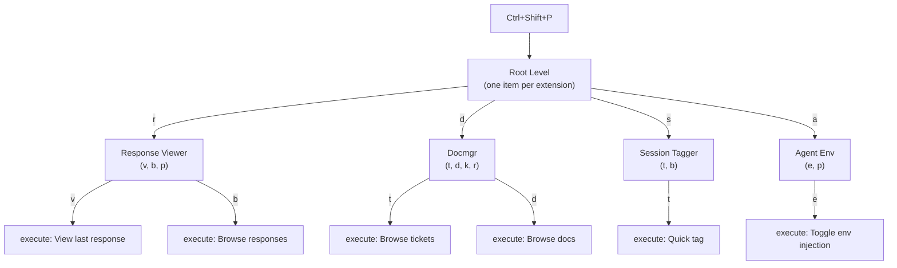
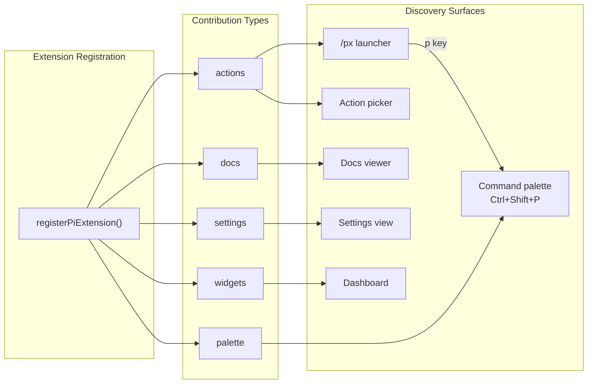

# Command Palette Completer — Keyboard-Driven Hierarchical Action Menu for Pi Extensions

The command palette is a keyboard-driven hierarchical menu that appears on a global shortcut and lets the user navigate to any registered extension action through a series of single-key presses. It is the speed layer in Pi's extension discovery system: where the `/px` launcher is for exploration, the palette is for execution. This article explains the design, implementation, integration, and usage of the command palette from both the user's and the extension developer's perspective.

The reference implementation lives in `/home/manuel/code/wesen/2026-04-21--pi-extensions/extensions/command-palette/` and depends on types and UI components in `extensions/_shared/`.

> [!summary]
> - The palette opens with `Ctrl+Shift+P` and uses single-key drill-down: one key per navigation level.
> - Extensions register `PaletteItem` entries alongside their existing `actions`, `docs`, `settings`, and `widgets` contributions.
> - Root-level keys are auto-assigned from extension names; submenu keys are auto-assigned from item titles, with explicit overrides available.
> - The `CommandPaletteOverlay` TUI component uses a stack-based navigation model: pushing levels for submenus, popping for back navigation.
> - The final shortcut implementation consumes `Ctrl+Shift+P` at the raw terminal input layer and buffers early keystrokes while the overlay is mounting.

## Why this note exists

The command palette introduces a new contribution type to Pi's shared extension framework. Future developers extending the palette, adding palette items to their own extensions, or debugging keyboard navigation issues need a single reference that covers the system end-to-end. This article is that reference.

## When to use the command palette

Use the palette when:

- you want to invoke a known extension action in two or three keystrokes from anywhere in Pi
- you have muscle memory for a specific key sequence (e.g., `Ctrl+Shift+P` → `r` → `v` to view the last assistant response)
- you want to toggle a setting or trigger a quick action without opening the `/px` launcher and navigating through overlays

Do not use the palette when:

- you do not know which extension provides the action you need — use `/px` for discovery instead
- you want to browse an extension's documentation or settings — use `/px` and press `?` or `s`
- you are scripting Pi commands programmatically — use the `/palette` command or direct slash commands instead

## Core mental model

The command palette is a decision tree rendered as a terminal overlay. Each level of the tree presents a list of items, each annotated with a single-character key hint. Pressing that key either drills into a submenu (pushing a new level onto the navigation stack) or executes a leaf action and closes the overlay.

The navigation stack is the central data structure. It is an array of `PaletteLevel` objects. The first element is the root level (one entry per extension that contributes palette items). Each subsequent element represents a submenu the user has entered. Back navigation pops the stack; forward navigation pushes a new level.



The key property is that each keypress has exactly one interpretation at each level. There is no ambiguity: a character either matches a visible item's key hint, or it does not. When no match exists and search mode is active, the character is appended to the search query instead.

## Architecture

The palette consists of four layers, each with a distinct responsibility:

| Layer | File | Responsibility |
|-------|------|---------------|
| **Registry types** | `extensions/_shared/registry.ts` | `PaletteItem`, `PaletteActionHandler`, `PaletteActionContext` interfaces and the `collectPaletteItems()` helper |
| **Key assignment** | `extensions/_shared/ui/palette-keys.ts` | Deterministic single-character key assignment algorithm and fuzzy filter |
| **TUI overlay** | `extensions/_shared/ui/command-palette.ts` | `CommandPaletteOverlay` component with stack navigation, rendering, and keyboard input handling |
| **Extension wiring** | `extensions/command-palette/index.ts` | Registers `Ctrl+Shift+P` shortcut, `/palette` command, and extension metadata |

### Registry types

The `PaletteItem` interface is the fundamental contract. A palette item is either a leaf (with a `run` handler) or a submenu (with `children`). The `key` field is an explicit single-character override; when omitted, the framework assigns a key automatically.

```ts
interface PaletteItem {
  id: string;           // stable machine name, unique within siblings
  title: string;        // display label
  description?: string; // optional one-line detail
  key?: string;         // explicit single-char override (a–z, 0–9)
  tags?: string[];      // for search filtering
  children?: PaletteItem[];  // makes this a submenu
  run?: PaletteActionHandler; // makes this a leaf action
}
```

Extensions add a `palette` array to their existing `registerPiExtension()` call. The registry's `collectPaletteItems()` function flattens all registered palette entries into a single list of `{ extension, item }` pairs.

The `PaletteActionContext` passed to every leaf handler provides the owning extension reference, the navigation path (array of IDs from root to leaf), and a `close()` callback:

```ts
interface PaletteActionContext {
  extension: PiExtensionRegistration;
  path: string[];
  close(): void;
}
```

### Key assignment algorithm

Key assignment is deterministic and runs once when the palette opens. The algorithm has three passes, executed in strict order:

1. **Explicit overrides.** If an item defines `key`, that character is used. Duplicate explicit keys at the same level throw an error.
2. **Title-based auto-assignment.** For items without an explicit key, scan the title's characters left-to-right and assign the first unique alphanumeric character that has not been taken.
3. **Sequential fallback.** If all title characters are taken, assign from `a`, `b`, `c`, … `z`, `0`, `1`, … `9`.

At the root level, the algorithm works differently. Root-level items represent entire extensions, not individual actions. Keys are auto-assigned from the **extension name**, not from the item's own `key` field. This prevents cross-extension key conflicts where two extensions might both want `c` for their first action.

The assignment is stable: as long as the set of extensions and their items does not change, the same keys are produced every time. Users can build muscle memory on this stability.

### The TUI overlay component

`CommandPaletteOverlay` implements the standard Pi TUI `Component` contract: `render(width)` returns `string[]`, `handleInput(data)` processes keyboard events, and `invalidate()` clears cached output.

The component's state consists of:

- **`stack`**: the navigation stack of `PaletteLevel` objects
- **`cursor`**: the index of the currently highlighted item
- **`query`**: the search query string (active only in search mode)
- **`searchActive`**: whether search mode is on
- **`pathIds`**: the ID path from root to the current level (for the `PaletteActionContext`)

The rendering produces a bordered overlay with a breadcrumb title showing the navigation path. Each item row shows the key hint, the item title, and a `→` marker for submenus. A footer line displays available actions.

### Extension wiring

The `command-palette` extension registers three things:

- `pi.registerShortcut("ctrl+shift+p", { handler: openPalette })` — the global keyboard shortcut
- `pi.registerCommand("palette", { handler: openPalette })` — a `/palette` command as an alternative entry point
- `registerPiExtension({ id: "command-palette", actions: [...], docs: [...] })` — metadata for the `/px` launcher

## Implementation details

### Root-level construction

The root level does not expose individual `PaletteItem` entries from each extension. Instead, `buildRootPaletteItems()` groups items by extension and creates one submenu per extension at the root. This was a deliberate design change after the initial implementation produced a flat list of all actions, which caused key conflicts and did not match the user's mental model of "extension → action" navigation.

```pseudocode
function buildRootPaletteItems(paletteItems):
  // Group by extension ID
  byExtension = groupBy(paletteItems, item => item.extension.id)
  
  result = []
  taken = empty set
  
  for each (extensionId, group) in byExtension:
    // Create one submenu per extension
    rootItem = {
      id: extensionId,
      title: group.extension.name,
      description: group.extension.description,
      children: group.items
    }
    
    // Auto-assign key from extension name (not from item keys)
    key = firstUniqueAlphanumericChar(group.extension.name, taken)
    result.push({ item: rootItem, key: key, extension: group.extension })
  
  return result
```

This means that at the root level, pressing `d` navigates to the Docmgr extension's submenu, where pressing `t` then opens the ticket browser. The `d` key is derived from "Docmgr", not from any individual palette item.

### Keyboard input handling

The input handler implements a strict priority order for each keypress:

1. If the character matches a key hint at the current level, activate that item immediately.
2. If no match and search mode is active, append the character to the search query.
3. If no match and search mode is inactive, the keypress is consumed with no effect.

This priority means that search mode cannot be used to type a character that also matches a visible key. This is intentional: key hints always take priority, because the user chose to press that specific key for navigation, not for search.

```pseudocode
function handleInput(data):
  if data == ESCAPE:
    if searchActive: deactivate search, clear query
    else: done(cancel)
    return
  
  if data == "/" and not searchActive:
    searchActive = true
    return
  
  if data == BACKSPACE:
    if searchActive and query not empty: delete last char
    else if stack depth > 1: pop stack (go up)
    else: done(cancel)
    return
  
  if data == LEFT_ARROW:
    if stack depth > 1: pop stack
    return
  
  if data == ENTER:
    activate item at cursor position
    return
  
  if data is single printable char:
    // Priority 1: key match
    match = currentLevel.items.find(entry => entry.key == data)
    if match: activate(match); return
    
    // Priority 2: search append
    if searchActive: query += data
```

The `activate` function either pushes a new level (for submenus) or resolves the overlay with the result (for leaf actions):

```pseudocode
function activate(entry):
  if entry.item.children:
    childItems = assignKeys(entry.item.children)
    stack.push({ title: entry.item.title, items: childItems })
    pathIds.push(entry.item.id)
    cursor = 0
    query = ""
    searchActive = false
  else if entry.item.run:
    done({ kind: "execute", extension, item, path: pathIds })
```

### Rendering

The overlay renders a bordered box with a breadcrumb title showing the full navigation path:

```text
╭────────────────────────────────────────────────── Command Palette ───────────────────────────────────────────────────╮
│ ▸ a  Agent Env →                                                                                                     │
│   c  Compaction Meter →                                                                                              │
│   o  Compaction Title →                                                                                              │
│   d  Docmgr →                                                                                                        │
│   p  Pinned Skills →                                                                                                 │
│   r  Response Viewer →                                                                                               │
│   s  Session Tagger →                                                                                                │
│   ← Back    Esc Close    / Search    ↑↓ Navigate                                                                     │
╰──────────────────────────────────────────────────────────────────────────────────────────────────────────────────────╯
```

After pressing `r` to enter the Response Viewer submenu:

```text
╭───────────────────────────────────────────── Command Palette ─ Response Viewer ──────────────────────────────────────────────╮
│ ▸ v  View last response                                                                                              │
│   b  Browse responses                                                                                                │
│   p  Preview last response                                                                                           │
│   ← Back    Esc Close    / Search    ↑↓ Navigate                                                                     │
╰────────────────────────────────────────────────────────────────────────────────────────────────────────────────────────────╯
```

After pressing `d` to enter the Docmgr submenu:

```text
╭───────────────────────────────────────────────── Command Palette ─ Docmgr ──────────────────────────────────────────────────╮
│ ▸ t  Browse tickets                                                                                                  │
│   d  Browse docs                                                                                                     │
│   k  Browse tasks                                                                                                    │
│   r  Refresh snapshot                                                                                                │
│   ← Back    Esc Close    / Search    ↑↓ Navigate                                                                     │
╰────────────────────────────────────────────────────────────────────────────────────────────────────────────────────────────╯
```

The rendering function produces each row by combining a selection marker (`▸` for selected, space otherwise), the key hint in accent color, the item title, and a `→` suffix for submenu items. Descriptions are omitted from the row display to keep the overlay compact. The breadcrumb is constructed by joining the titles of all levels on the stack with ` ─ `.

Search mode replaces the footer with a query line:

```text
╭────────────────────────────────────────────────── Command Palette ───────────────────────────────────────────────────╮
│ ▸ d  Docmgr →                                                                                                       │
│   r  Response Viewer →                                                                                              │
│   s  Session Tagger →                                                                                              │
│   Search: comp█    Esc close search                                                                                 │
╰────────────────────────────────────────────────────────────────────────────────────────────────────────────────────────────╯
```

### The `/px` launcher integration

The palette is also accessible from the `/px` launcher by pressing `p`. The `ExtensionLauncherResult` type gained a new variant `{ kind: "palette" }`, and the launcher's `handleInput` now routes the `p` key to `done({ kind: "palette" })`. The launcher's result handler then calls `openPaletteFromLauncher()`, which opens the same `CommandPaletteOverlay` component.

```text
/px launcher keys:
  /       enter search mode
  Enter   run selected extension default action
  a       open selected extension actions
  ?       open selected extension docs
  s       open selected extension settings
  p       open command palette          ← new
  d       open dashboard
  Esc     close launcher
```

This integration means the palette is two keystrokes from the launcher: `/px` then `p`. It is one keystroke from the global shortcut: `Ctrl+Shift+P`.

## Using the palette as a user

### Opening the palette

Two entry points exist:

- **`Ctrl+Shift+P`** — the global shortcut, available from anywhere in Pi.
- **`/palette`** — a slash command, useful when the shortcut is hard to type in your terminal.
- **`/px` then `p`** — from the launcher overlay, press `p` to open the palette.

### Navigation keys

| Key | Action |
|-----|--------|
| `a`–`z`, `0`–`9` | Activate the item whose key hint matches this character |
| `Esc` | Close the palette (or exit search mode if active) |
| `Backspace` | Delete last search character, or go up one level if search is empty |
| `←` (Left arrow) | Go up one level (at root, closes the palette) |
| `↑` / `↓` | Move cursor (for arrow-key navigation) |
| `Enter` | Activate the item at the cursor position |
| `/` | Toggle search mode on |

### Drill-down walkthrough

To toggle agent environment injection:

1. Press `Ctrl+Shift+P`. The root level appears.
2. Press `a` (the key hint for Agent Env). The Agent Env submenu appears.
3. Press `e` (the key hint for Toggle env injection). The action executes and the palette closes.

Total: three keystrokes from anywhere in Pi.

To browse docmgr tickets:

1. Press `Ctrl+Shift+P`.
2. Press `d` (Docmgr).
3. Press `t` (Browse tickets). The ticket browser opens.

### Search mode

Press `/` to enter search mode. Subsequent characters are appended to the search query and items are filtered by substring match on ID, title, description, and tags. Key matching still takes priority: if you type a character that matches a visible item's key hint, that item is activated instead of appending to the query.

Press `Esc` to leave search mode (the query is cleared). Press `Backspace` to delete the last query character.

### Going back

Press `←` or `Backspace` (when the search query is empty) to go up one level in the navigation stack. At the root level, `Backspace` closes the palette.

### Arrow key fallback

For users who prefer arrow-key navigation (or when the overlay has many items), `↑` and `↓` move a cursor through the visible items. Press `Enter` to activate the item at the cursor position. The cursor starts at the first item when entering a new level.

## Using the palette as an extension developer

### Adding palette items to your extension

Add a `palette` array to your `registerPiExtension()` call. Each entry is a `PaletteItem` with an `id`, `title`, and either a `run` handler (leaf) or `children` array (submenu).

```ts
registerPiExtension({
  id: "my-extension",
  name: "My Extension",
  description: "Does something useful.",
  // ... existing actions, docs, settings, widgets ...

  palette: [
    {
      id: "open",
      title: "Open dashboard",
      key: "o",                              // explicit key override
      run: async (ctx, paletteCtx) => {
        openDashboard(ctx);
      },
    },
    {
      id: "config",
      title: "Configuration",
      key: "c",
      children: [
        {
          id: "edit",
          title: "Edit settings",
          key: "e",
          run: async (ctx) => editSettings(ctx),
        },
        {
          id: "reset",
          title: "Reset defaults",
          key: "r",
          run: async (ctx) => resetSettings(ctx),
        },
      ],
    },
  ],
});
```

### Key hint guidelines

- Set `key` explicitly for your most important items. This guarantees stable key assignment.
- Choose keys that are mnemonic: `v` for "view", `t` for "toggle", `r` for "refresh".
- Do not use the same explicit key for two items at the same level — this throws a runtime error.
- If you omit `key`, the framework assigns the first unique alphanumeric character from the item's title.
- Root-level keys are always derived from the extension name, not from item keys. Your `key` field only applies within your submenu.

### Sharing handlers between actions and palette

Palette items and actions serve different purposes (speed vs. discovery), but they can share the same handler function:

```ts
const handleView = async (ctx) => viewLastResponse(ctx);

registerPiExtension({
  actions: [
    { id: "view", title: "View", run: handleView },
  ],
  palette: [
    { id: "view", title: "View last response", key: "v", run: handleView },
  ],
});
```

This is the recommended pattern. The palette item gets a different, more descriptive `title` and an explicit `key`, but the underlying logic is identical.

### Palette vs. actions: when to add which

Add to `actions` when:
- the action should appear in the `/px` action picker
- the action is destructive or needs confirmation (the action picker shows descriptions)

Add to `palette` when:
- the action should be reachable in two or three keystrokes from `Ctrl+Shift+P`
- you want to organize actions into a hierarchy (submenus)
- the action is safe and frequent enough for muscle memory

Add to both when:
- the action should be discoverable through `/px` and fast through the palette
- you want the best of both surfaces

### The `PaletteActionContext` parameter

Leaf `run` handlers receive a second argument beyond the standard `ExtensionCommandContext`:

```ts
run: async (ctx, paletteCtx) => {
  // paletteCtx.extension — the PiExtensionRegistration that owns this item
  // paletteCtx.path — string[] of IDs from root to this leaf
  // paletteCtx.close() — close the palette (no-op after execution, since it already closed)
}
```

The `path` array is useful for logging or telemetry. For example, if the user navigates `r` → `v` to reach "View last response", `path` would be `["response-viewer", "view"]`.

### Extension registration checklist

Before submitting an extension with palette items:

- [ ] Every `PaletteItem` has a stable `id` (kebab-case, unique within siblings).
- [ ] Leaf items have a `run` handler. Submenu items have `children`.
- [ ] No two items at the same level specify the same explicit `key`.
- [ ] Frequently used items have explicit `key` hints for muscle memory.
- [ ] Palette item titles are concise (they render in a compact overlay).
- [ ] The palette does not duplicate every action — curate it for the most useful operations.
- [ ] `timeout 20 pi --list-models` passes after adding the `palette` field.

## Integration with the existing framework

The palette is the sixth contribution type in the shared extension framework, joining `actions`, `docs`, `settings`, `widgets`, and the legacy `commands`. The registry contract in `extensions/_shared/registry.ts` now includes `palette?: PaletteItem[]` as a field on `PiExtensionRegistration`.



The palette does not replace any existing surface. It adds a new interaction mode optimized for speed. Extensions that do not register palette items are simply absent from the palette — they still appear in `/px` and can still be used through their slash commands.

### Current palette contributions

The following extensions register palette items as of this writing:

| Extension | Root key | Palette items |
|-----------|----------|---------------|
| Agent Env | `a` | Toggle env injection (`e`), Preview environment (`p`) |
| Compaction Meter | `c` | Show context remaining (`c`) |
| Compaction Title | `o` | Toggle auto-title (`o`) |
| Docmgr | `d` | Browse tickets (`t`), Browse docs (`d`), Browse tasks (`k`), Refresh snapshot (`r`) |
| Pinned Skills | `p` | Open checklist (`c`), Preview prompt block (`p`), List available skills (`l`) |
| Response Viewer | `r` | View last response (`v`), Browse responses (`b`), Preview last response (`p`) |
| Session Tagger | `s` | Quick tag (`t`), Browse tags (`b`) |

Notice that root-level keys are derived from extension names, not from the items' own keys. Compaction Title gets `o` (the second unique character of "Compaction Title") because `c` is already taken by Compaction Meter.


## Debugging case study: the Ctrl+Shift+P pre-mount input race

The most important bug in the command palette was not in key assignment or rendering. It was in the interval between recognizing the global shortcut and the overlay becoming the focused input receiver. The symptom was precise: pressing `Ctrl+Shift+P` sometimes did not visibly open the palette until the next keypress, and that next key could also appear in the main Pi REPL. The failure was easiest to notice after running `Response Viewer → View last response`, then immediately trying to open the palette again and press `a`, `r`, or another navigation key.

The visible symptom was misleading. It looked like a render problem because the overlay appeared late. The first attempted fixes therefore targeted rendering and focus: call `tui.requestRender()` from the custom UI factory, then call `handle.focus()` from `onHandle`. Both helped in narrow cases, but neither fixed the real failure. Rendering can only happen after the overlay component exists. The leaked key was arriving before that point.

### The reproduction sequence

The minimal sequence was:

```text
Ctrl+Shift+P   # open the palette
r              # enter Response Viewer
v              # execute View last response
Ctrl+Shift+P   # reopen palette
a              # expected: enter Agent Env; actual: sometimes leaked to REPL
```

A tighter stress case was:

```text
Ctrl+Shift+P r
```

When `r` arrived immediately after the shortcut, the palette sometimes had not finished mounting. In that state the raw terminal listener saw the `r`, but the overlay was not ready to receive it.

### Why the earlier fixes were incomplete

The first fix called `tui.requestRender()` in the `ctx.ui.custom()` factory. That request can run before the overlay is fully registered with the TUI overlay stack. It does not guarantee that focus is stable or that subsequent keys will be routed to the overlay.

The second fix used `onHandle` and called `handle.focus()` after `showOverlay()` returned the overlay handle. This was closer to the right layer because `onHandle` runs after the overlay is shown. It fixed the case where the overlay existed but needed focus. It still did not fix the case where the next key arrived before `onHandle` itself ran.

The actual timeline looked like this:

```text
T0  raw terminal input: Ctrl+Shift+P
T1  shortcut matches
T2  openPalette() starts
T3  ctx.ui.custom() calls factory
T4  user key r arrives
T5  raw listener sees r, but overlay is not input-ready yet
T6  onHandle fires and focuses overlay
```

At `T5`, the system is in a transitional state. `paletteOpen` is true, but the component is not yet the focused receiver. Returning `undefined` from the raw input listener lets the key continue to the editor path. That is the leak.

### Instrumentation: `/palette-debug`

The fix started by adding runtime logging rather than guessing. The command palette extension now supports:

```text
/palette-debug on
/palette-debug off
/palette-debug status
/palette-debug tail
/palette-debug clear
```

Logs are written to:

```text
/tmp/pi-command-palette-debug.log
```

The log records:

- raw terminal input chunks seen by `ctx.ui.onTerminalInput`
- Unicode codepoints for each input chunk
- whether `matchesKey(data, "ctrl+shift+p")` matched
- whether the raw terminal listener or fallback shortcut opened the palette
- the overlay lifecycle (`custom.factory`, `custom.onHandle`, `custom.result`)
- overlay input handling (`overlay.handleInput`)
- submenu and leaf activation (`overlay.activate`, `action.run.start`, `action.run.done`)

A useful reproduction run produced this sequence:

```json
{"event":"terminalInput","data":{"json":"\"\\u001b[112:80;6u\""},"matchesDefaultShortcut":true,"paletteOpen":false}
{"event":"openPalette.request","source":"raw-terminal-shortcut","paletteOpen":false}
{"event":"openPaletteOnce.start","source":"raw-terminal-shortcut"}
{"event":"custom.factory","source":"raw-terminal-shortcut"}
{"event":"terminalInput","data":{"json":"\"r\""},"matchesDefaultShortcut":false,"paletteOpen":true}
{"event":"custom.onHandle","source":"raw-terminal-shortcut","isFocusedBefore":true}
```

The decisive line is the raw `"r"` before `custom.onHandle`. It proves that the first navigation key can arrive before the overlay is ready.

The log also showed kitty/tmux CSI-u sequences. For example, `Ctrl+Shift+P` appeared as:

```json
{"json":"\"\\u001b[112:80;6u\"","chars":["U+001B","U+005B","U+0031","U+0031","U+0032","U+003A","U+0038","U+0030","U+003B","U+0036","U+0075"]}
```

and a release or alternate CSI-u event appeared as:

```json
{"json":"\"\\u001b[112;6:3u\"","chars":["U+001B","U+005B","U+0031","U+0031","U+0032","U+003B","U+0036","U+003A","U+0033","U+0075"]}
```

The important point is not the exact escape sequence. The important point is that terminal emulators can send multiple chunks for a physical key interaction, and those chunks can interleave with overlay lifecycle callbacks.

### The final fix: consume and buffer while opening

The final implementation adds two pieces of state:

```ts
let paletteInputReady = false;
let pendingOpeningInputs: string[] = [];
```

The raw terminal listener now has three behaviors:

1. If the input is `Ctrl+Shift+P`, open the palette and consume the input.
2. If the palette is opening (`paletteOpen && !paletteInputReady`), consume the input. If it is a replayable key, buffer it.
3. If the palette is fully ready, return `undefined` and let normal TUI focus routing deliver keys to the overlay.

The core logic is:

```ts
terminalShortcutUnsubscribe = ctx.ui.onTerminalInput((data) => {
  const matched = matchesKey(data, DEFAULT_SHORTCUT);

  if (matched) {
    void openPalette(ctx as ExtensionCommandContext, "raw-terminal-shortcut");
    return { consume: true };
  }

  if (paletteOpen && !paletteInputReady) {
    if (shouldReplayOpeningInput(data)) {
      pendingOpeningInputs.push(data);
    }
    return { consume: true };
  }

  return undefined;
});
```

When the overlay handle becomes available, the code focuses the overlay, marks input as ready, replays buffered inputs into the overlay component, and requests a render:

```ts
onHandle: (handle) => {
  handle.focus();
  paletteInputReady = true;

  const buffered = pendingOpeningInputs.splice(0);
  for (const data of buffered) {
    overlay?.handleInput?.(data);
  }

  requestRender?.();
}
```

The `shouldReplayOpeningInput()` function only replays inputs that should act like normal palette input: printable single-character keys, navigation keys, Enter, Escape, and Backspace. CSI-u release sequences are consumed during the mount window but not replayed.

```ts
function shouldReplayOpeningInput(data: string): boolean {
  if (data.length === 1 && data >= " " && data !== "\x7f") return true;
  if (matchesKey(data, Key.escape)) return true;
  if (matchesKey(data, Key.enter)) return true;
  if (matchesKey(data, Key.backspace)) return true;
  if (matchesKey(data, Key.left)) return true;
  if (matchesKey(data, Key.right)) return true;
  if (matchesKey(data, Key.up)) return true;
  if (matchesKey(data, Key.down)) return true;
  return false;
}
```

After the fix, the same tight reproduction logs the intended sequence:

```json
{"event":"terminalInput","data":{"json":"\"r\""},"paletteOpen":true,"paletteInputReady":false}
{"event":"terminalInput.bufferWhileOpening","data":{"json":"\"r\""},"pendingCount":1}
{"event":"custom.onHandle","pendingOpeningInputs":[{"json":"\"r\""}]}
{"event":"custom.replayBufferedInput","data":{"json":"\"r\""}}
{"event":"overlay.handleInput","data":{"json":"\"r\""},"level":"Command Palette"}
{"event":"overlay.activate","key":"r","itemId":"response-viewer","title":"Response Viewer"}
```

The UI now opens directly into the Response Viewer submenu when `Ctrl+Shift+P r` is entered quickly:

```text
╭──────────────────────── Command Palette ─ Response Viewer ────────────────────────╮
│ ▸ v  View last response                                                           │
│   b  Browse responses                                                             │
│   p  Preview last response                                                        │
│   ← Back    Esc Close    / Search    ↑↓ Navigate                                  │
╰───────────────────────────────────────────────────────────────────────────────────╯
```

### Lessons from the bug

- Rendering bugs and input routing bugs can produce the same visible symptom. The overlay appearing late did not mean the render call was missing; it meant the first key arrived before the overlay became the input owner.
- Editor-scoped shortcuts are not equivalent to raw terminal shortcuts. `pi.registerShortcut()` is attached through the editor path, while `ctx.ui.onTerminalInput()` runs before focused-component input handling.
- Terminal emulators with CSI-u support can produce multiple input chunks for a physical key interaction. Debug logs must include raw strings and codepoints, not just human-readable key names.
- Input during overlay mount is a real state. It must be handled explicitly, either by blocking, buffering, or designing the API so the overlay mounts synchronously before returning control to input processing.

## Common failure modes

### Duplicate explicit keys at the same level

If two `PaletteItem` entries at the same level both specify `key: "c"`, `assignKeys()` throws a runtime error when the palette opens. The error message identifies the offending item by title and ID.

**Fix:** Remove the explicit `key` from one of the items, or assign different keys. At the root level, this cannot happen because root keys are auto-assigned from extension names.

### Root-level key conflicts from extension names

If two extensions have names that start with the same letter, the first extension (alphabetically by name) gets the letter, and the second falls to the next unique character in its name. This is deterministic but may produce non-obvious keys.

**Example:** "Compaction Meter" gets `c`; "Compaction Title" gets `o` (from the "o" in "Compaction").

**Mitigation:** If an extension's auto-assigned root key is confusing, the extension author can rename the extension or accept the fallback key. Root-level keys are stable as long as the set of extensions does not change.

### Keystrokes leaking during overlay mount

The important leak class occurs before the overlay is focused. After `Ctrl+Shift+P` is recognized, there is a short interval where `paletteOpen` is true but `paletteInputReady` is still false. In kitty/tmux, a fast follow-up key such as `r` can arrive in that interval. If the raw terminal listener returns `undefined`, the key continues to the editor path instead of entering the palette.

**Mitigation:** The implementation consumes all input during the opening interval. Replayable keys are buffered and replayed into `CommandPaletteOverlay.handleInput()` after `onHandle` focuses the overlay. Non-replayable CSI-u release sequences are consumed and ignored.

### Search mode key-matching priority

When search mode is active, pressing a character that also matches a visible item's key hint will activate that item instead of appending to the search query. This is by design — key hints always have priority — but it can surprise users who expect search mode to capture all printable characters.

**Mitigation:** Use search mode for partial text queries that do not start with a character matching a visible key. For example, in a level with keys `t`, `d`, `k`, `r`, typing `br` in search mode will filter to "Browse" items because `b` does not match any key at that level.

## Anti-patterns

### Registering every action in the palette

The palette is for frequently used, safe actions. Registering destructive operations (reset, delete, clear) in the palette makes them dangerously easy to trigger. Put destructive operations in `actions` (visible in `/px`) where the user must navigate explicitly, but omit them from `palette`.

### Deep nesting

Three levels is the practical maximum for terminal palette UX. `Ctrl+Shift+P` → `d` → `o` → `i` is already pushing the limit. If your extension needs four or more levels, flatten the hierarchy by promoting the most-used leaf actions to the top submenu.

### Changing item IDs

Palette item IDs should be stable across versions, just like extension IDs. Changing an ID breaks any user documentation or muscle memory that references the key sequence. If you must change an ID, document the change in your extension's release notes.

## Working rules

1. **Key hints are stable.** Do not change an item's explicit `key` between releases. Users build muscle memory on these keys.
2. **Curate, do not dump.** The palette should contain the three to five most useful actions, not every operation the extension supports.
3. **Leaves are safe.** A single keypress executes a leaf action with no confirmation. Make sure leaf actions are non-destructive.
4. **Submenus group related actions.** If your extension has more than four or five actions, organize them into submenus by function.
5. **Share handlers with actions.** Avoid duplicating logic between `actions` and `palette` — call the same function from both.

## Related notes

- The shared extension framework guide at `docs/pi-shared-extension-framework-guide.md` covers all six contribution types including the palette.
- The TUI authoring guide at `docs/pi-tui-ui-authoring-guide.md` explains the `Component` contract that the palette overlay implements.
- The design document at `ttmp/2026/05/26/CMD-PALETTE--command-palette-completer-keyboard-driven-hierarchical-action-menu-for-pi-extensions/design/01-analysis-and-design-command-palette-completer.md` contains the full 12-part analysis written before implementation.
