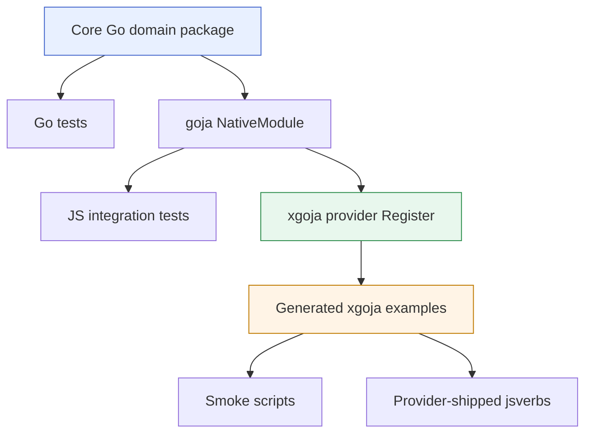

# Playbook: Building go-go-goja xgoja Provider Packages

This playbook explains how to build a `go-go-goja` package from scratch: a Go library with a JavaScript API, an xgoja provider, provider-shipped JavaScript verbs, generated-binary examples, and test scripts that prove the package works outside its own unit tests. The reference implementation is `/home/manuel/code/wesen/2026-05-27--goja-ast-analysis`, which exposes Go AST analysis through a fluent JavaScript API and demonstrates storage through the existing `database` module.

The goal is not only to reproduce one package. The goal is to make the implementation pattern clear enough that a new developer can build a similar package without guessing which pieces belong in Go, which pieces belong in JavaScript, and which pieces belong in the generated xgoja build specification.

> [!summary]
> - Build the domain logic as a normal Go package first. Do not start with xgoja.
> - Expose a narrow JavaScript API through a `modules.NativeModule` loader, and wrap Go objects explicitly when the public JavaScript shape matters.
> - Register the package with xgoja through `providerapi.Register`, then prove the integration with generated binaries under `examples/xgoja/...`.
> - Put storage, orchestration, and exploratory scripts in JavaScript when existing modules already provide those capabilities.

## Why this playbook exists

A working xgoja provider is more than a Go package that compiles. It has to work across several boundaries. The Go library has to be useful by itself. The goja module has to expose a stable JavaScript surface. The provider has to register modules and optional verb sources. The generated binary has to import the provider, select modules into runtime profiles, build successfully in a temporary workspace, and execute scripts that call the JavaScript API. If any boundary is skipped, the package can look complete while failing in the generated-binary path.

The `go-ast-analysis` project hit several of these boundaries directly. The Go tests passed before the xgoja example was actually built. The first JavaScript handle shape exposed Go-style fields instead of the intended lowerCamel names. The first provider-shipped verbs used the wrong metadata format and therefore generated an awkward command tree. The first Makefile passed replacement flags to commands that did not accept them. Each of those failures was useful because it clarified the real contract.

This document preserves the contract as a repeatable sequence.

## The package shape

A complete xgoja-capable package usually has this structure:

```text
repo/
├── go.mod
├── pkg/<domain>/
│   ├── types.go              # core domain data types
│   ├── parse.go              # domain input loading, when relevant
│   ├── builder.go            # fluent or typed API builders
│   ├── query.go              # execution logic
│   ├── inspect.go            # conversion from domain objects to JS-friendly values
│   ├── module.go             # goja NativeModule implementation
│   ├── provider.go           # xgoja provider registration
│   ├── *_test.go             # Go unit, JS integration, provider tests
│   └── verbs/
│       ├── command-one.js    # provider-shipped jsverbs
│       └── command-two.js
├── examples/xgoja/<basic>/
│   ├── xgoja.yaml
│   ├── Makefile
│   └── scripts/*.js
├── examples/xgoja/<db>/
│   ├── xgoja.yaml
│   ├── Makefile
│   └── scripts/*.js
└── ttmp/...                  # ticket docs, diary, design notes
```

The exact filenames depend on the domain, but the boundaries should stay stable. Keep the domain model independent from goja until the domain model is testable. Add the goja module as an adapter. Add the xgoja provider after the module works in an engine runtime. Add generated examples after provider registration is testable.



The sequence matters. If you start at the generated binary, every failure can be caused by any layer below it. If you start at the Go package and add one boundary at a time, each failure has a smaller search space.

## Step 1: Start with the Go domain package

The domain package should compile and test without a goja runtime. In the reference project, this is `pkg/go-ast-analysis`. It parses Go source directories and exposes a query builder over Go AST nodes. None of that requires JavaScript.

A minimal domain package needs three things:

1. A handle type that owns internal state.
2. A builder or command type that accumulates typed operations.
3. An execution path that returns plain Go values.

For AST analysis, the handle owns `*token.FileSet` and `[]*ast.File`. JavaScript does not need direct access to those fields, and callers should not mutate them. The public Go methods expose only stable metadata:

```go
type PackageHandle struct {
    id       string
    fset     *token.FileSet
    files    []*ast.File
    pkgName  string
    dir      string
    parsedAt time.Time
}

func (h *PackageHandle) ID() string          { return h.id }
func (h *PackageHandle) PackageName() string { return h.pkgName }
func (h *PackageHandle) Dir() string         { return h.dir }
func (h *PackageHandle) FileCount() int      { return len(h.files) }
```

The query builder is a normal Go object. It stores node kinds, filter clauses, selectors, and limits. JavaScript later calls methods on a wrapper object, but the query state itself remains in Go.

```go
type QueryBuilder struct {
    handle    *PackageHandle
    nodeKinds []string
    filters   []FilterClause
    selectors []string
    limit     int
}

func (b *QueryBuilder) Methods() *QueryBuilder {
    b.nodeKinds = append(b.nodeKinds, "method")
    return b
}

func (b *QueryBuilder) WithReceiver(typeName string) *QueryBuilder {
    b.filters = append(b.filters, FilterClause{
        Field: "receiver", Operator: "eq", Value: typeName,
    })
    return b
}

func (b *QueryBuilder) Execute() (*QueryResults, error) {
    if b.handle == nil {
        return nil, fmt.Errorf("query builder has no package handle")
    }
    if len(b.nodeKinds) == 0 {
        return nil, fmt.Errorf("query must specify at least one node kind")
    }
    return executeQuery(b)
}
```

This design keeps validation close to the data it validates. The builder can reject invalid state before traversal begins. The execution function can assume it has a parsed package and at least one node kind. That makes later JavaScript wrappers thinner and less error-prone.

### Domain tests

Write tests before any goja adapter. The tests should exercise the domain model directly:

```go
func TestQueryExportedFunctions(t *testing.T) {
    pkg := parseSelf(t)

    results, err := NewQuery(pkg).Functions().Exported().Execute()
    if err != nil {
        t.Fatalf("Execute(): %v", err)
    }
    if results.Count == 0 {
        t.Fatal("expected exported functions")
    }
}
```

The reference package has tests for parsing, functions, methods, structs, imports, calls, filters, selectors, limits, validation, and conversion to JavaScript-friendly maps. That coverage is important because every later layer depends on this one.

## Step 2: Convert domain objects to JavaScript values deliberately

A goja module can return Go structs directly, but that is not always the right public API. Goja exposes Go struct fields with Go names. JSON tags do not automatically make a Go field appear as a lowerCamel JavaScript property. A Go struct with `Name` and `FileCount` will appear as `pkg.Name` and `pkg.FileCount`, not `pkg.name` and `pkg.fileCount`.

If the JavaScript API shape matters, create wrapper objects explicitly.

In `go-ast-analysis`, `parsePackage(path)` returns a clean JavaScript object:

```javascript
{
  id: "/abs/path/to/package",
  name: "engine",
  dir: "/abs/path/to/package",
  fileCount: 17,
  __handle: <internal Go package handle>
}
```

The internal `__handle` property is how `ast.query(pkg)` recovers the Go package handle. The user-facing metadata remains lowerCamel and stable.

```go
func (m *Module) wrapPackageHandle(vm *goja.Runtime, h *PackageHandle) goja.Value {
    obj := vm.NewObject()
    _ = obj.Set("id", h.ID())
    _ = obj.Set("name", h.PackageName())
    _ = obj.Set("dir", h.Dir())
    _ = obj.Set("fileCount", h.FileCount())
    _ = obj.Set("__handle", h)
    return obj
}

func extractHandle(vm *goja.Runtime, v goja.Value) *PackageHandle {
    obj := v.ToObject(vm)
    if obj == nil {
        return nil
    }
    internal := obj.Get("__handle")
    if internal == nil || goja.IsUndefined(internal) || goja.IsNull(internal) {
        return nil
    }
    if handle, ok := internal.Export().(*PackageHandle); ok {
        return handle
    }
    return nil
}
```

This wrapper pattern is worth using whenever a Go value has both internal state and public metadata. The wrapper is the JavaScript contract. The Go struct is implementation state.

## Step 3: Implement the NativeModule adapter

A `go-go-goja` native module implements `modules.NativeModule`:

```go
type NativeModule interface {
    Name() string
    Doc() string
    Loader(*goja.Runtime, *goja.Object)
}
```

The loader populates `module.exports`. In the reference package, the exported JavaScript API has three functions:

```javascript
const ast = require("ast")

const pkg = ast.parsePackage("/path/to/go/package")
const query = ast.query(pkg)
const packages = ast.listPackages()
```

The loader shape is straightforward:

```go
func (m *Module) Loader(vm *goja.Runtime, moduleObj *goja.Object) {
    exports := moduleObj.Get("exports").(*goja.Object)

    exports.Set("parsePackage", func(path string) (goja.Value, error) {
        handle, err := m.parsePackage(path)
        if err != nil {
            return nil, err
        }
        return m.wrapPackageHandle(vm, handle), nil
    })

    exports.Set("query", func(call goja.FunctionCall) goja.Value {
        handle := extractHandle(vm, call.Argument(0))
        if handle == nil {
            panic(vm.NewTypeError("invalid package handle"))
        }
        return m.wrapBuilder(vm, newQueryBuilder(handle))
    })

    exports.Set("listPackages", func() []map[string]any {
        return m.listPackages()
    })
}
```

The important part is `wrapBuilder`. Goja does not provide the JavaScript fluent API you want simply because a Go struct has exported methods. The safest implementation is to create a JavaScript object and attach exactly the methods you want JavaScript to call.

```go
func (m *Module) wrapBuilder(vm *goja.Runtime, b *QueryBuilder) goja.Value {
    obj := vm.NewObject()

    obj.Set("methods", func() goja.Value {
        b.Methods()
        return obj
    })
    obj.Set("withReceiver", func(typeName string) goja.Value {
        b.WithReceiver(typeName)
        return obj
    })
    obj.Set("select", func(call goja.FunctionCall) goja.Value {
        fields := make([]string, len(call.Arguments))
        for i, arg := range call.Arguments {
            fields[i] = arg.String()
        }
        b.Select(fields...)
        return obj
    })
    obj.Set("execute", func() (map[string]any, error) {
        results, err := b.Execute()
        if err != nil {
            return nil, err
        }
        return results.ToMap(), nil
    })

    return obj
}
```

The methods return the same JavaScript object, so the JavaScript author can write:

```javascript
ast.query(pkg)
  .methods()
  .withReceiver("Runtime")
  .select("name", "receiver", "signature", "file", "line")
  .execute()
```

The fluent chain is JavaScript syntax, but the query state is Go data.

## Step 4: Test the JavaScript adapter inside an engine runtime

After the native module compiles, test it through `engine.NewBuilder`. Do not jump directly to xgoja. The engine test verifies the module registry, require path, runtime ownership, and JavaScript wrapper objects while still running inside normal Go tests.

A minimal test runtime looks like this:

```go
func newTestRuntime(t *testing.T) *engine.Runtime {
    t.Helper()
    ctx := context.Background()

    factory, err := engine.NewBuilder().
        UseModuleMiddleware(engine.MiddlewareOnly("go-ast-analysis", "path")).
        Build()
    if err != nil {
        t.Fatalf("engine.NewBuilder(): %v", err)
    }

    rt, err := factory.NewRuntime(
        engine.WithStartupContext(ctx),
        engine.WithLifetimeContext(ctx),
    )
    if err != nil {
        t.Fatalf("factory.NewRuntime(): %v", err)
    }
    return rt
}
```

Register the module in test setup:

```go
func init() {
    modules.Register(NewModule())
}
```

Then execute real JavaScript:

```go
_, err = rt.VM.RunString(`
  const ast = require("go-ast-analysis")
  const pkg = ast.parsePackage("/path/to/pkg")
  const results = ast.query(pkg)
    .functions()
    .exported()
    .select("name", "signature")
    .execute()

  if (results.count === 0) {
    throw new Error("expected exported functions")
  }
`)
```

This test catches the errors that pure Go tests cannot catch:

- `require("...")` names do not match module registration.
- JavaScript wrapper methods are missing or incorrectly cased.
- `goja.FunctionCall` handling is wrong for variable argument methods such as `select`.
- Go errors are not surfaced as useful JavaScript errors.

In the reference project, this stage revealed an important fact: Go struct methods were not a good public fluent API for JavaScript. The explicit wrapper object became the stable implementation.

## Step 5: Register the xgoja provider

An xgoja provider package tells generated binaries which modules a package provides. The registration function accepts a `*providerapi.Registry` and declares one or more `providerapi.Module` entries.

```go
const PackageID = "go-ast-analysis"

func Register(registry *providerapi.Registry) error {
    return registry.Package(PackageID,
        providerapi.Module{
            Name:        "go-ast-analysis",
            DefaultAs:   "ast",
            Description: "Go AST analysis with fluent builder query API",
            New:         newModuleFactory,
        },
    )
}
```

The module factory returns a `require.ModuleLoader`:

```go
func newModuleFactory(ctx providerapi.ModuleContext) (require.ModuleLoader, error) {
    mod := NewModule()
    return mod.Loader, nil
}
```

Keep the provider package explicit. Do not register every possible module automatically. xgoja uses two separate selection layers:

1. `packages[]` in `xgoja.yaml` selects which provider packages are compiled into the generated binary.
2. `runtimes.<profile>.modules[]` selects which registered modules are visible in a particular runtime profile.

A module can be compiled into the binary but unavailable to a script if the runtime profile does not include it. This is intentional. It lets one generated binary have separate profiles for safe evaluation, host access, database access, hardware access, or web serving.

## Step 6: Add provider-shipped jsverbs

Provider-shipped jsverbs are JavaScript command files embedded in the provider package. They are useful when the package should ship not only a `require(...)` module but also ready-made CLI commands.

The provider embeds a `verbs` directory:

```go
//go:embed verbs/*.js
var verbsFS embed.FS

func Register(registry *providerapi.Registry) error {
    return registry.Package(PackageID,
        providerapi.Module{...},
        providerapi.VerbSource{
            Name:        "verbs",
            Description: "Pre-built Go AST analysis verbs",
            FS:          verbsFS,
            Root:        "verbs",
        },
    )
}
```

The verb files should use the sentinel metadata format supported by `go-go-goja` jsverbs. The tested style is:

```javascript
__package__({ name: "ast", short: "Go AST analysis commands" })

__verb__("listFunctions", {
  name: "list-functions",
  short: "List functions in a Go package",
  output: "glaze",
  fields: {
    path: { type: "string", argument: true, required: true },
    exported: { type: "bool" },
    limit: { type: "int", default: 100 }
  }
})

function listFunctions(path, exported, limit) {
  const ast = require("ast")
  const pkg = ast.parsePackage(path)

  let q = ast.query(pkg).functions()
  if (exported) q = q.exported()

  return q
    .select("name", "signature", "file", "line", "doc")
    .limit(limit || 100)
    .execute()
    .items
}
```

Do not assume JSDoc-style annotations are sufficient. In the reference implementation, the first version used comments such as `@verb` and `@field`; the generated command tree was not the intended one. The sentinel format produced the correct package path and flags.

## Step 7: Write the first xgoja example

A basic generated example proves that the provider works in the xgoja build path. It should include:

```text
examples/xgoja/ast-analysis/
├── xgoja.yaml
├── Makefile
└── scripts/smoke.js
```

A minimal `xgoja.yaml` selects the provider package, a runtime profile, and commands:

```yaml
name: go-ast-tool
target:
  kind: xgoja
  output: dist/go-ast-tool
packages:
  - id: go-ast-analysis
    import: github.com/go-go-golems/go-ast-analysis/pkg/go-ast-analysis
    replace: ../../..
  - id: go-go-goja-core
    import: github.com/go-go-golems/go-go-goja/pkg/xgoja/providers/core
runtimes:
  analysis:
    modules:
      - package: go-ast-analysis
        name: go-ast-analysis
        as: ast
      - package: go-go-goja-core
        name: path
        as: path
commands:
  run:
    enabled: true
    runtime: analysis
  jsverbs:
    enabled: true
    runtime: analysis
    name: verbs
jsverbs:
  - id: ast-verbs
    package: go-ast-analysis
    source: verbs
```

The local package is replaced with `replace: ../../..` inside `packages[]`. The `--xgoja-replace` build flag is only for the `github.com/go-go-golems/go-go-goja` module. Do not pass a second `--xgoja-replace` for your provider package. That causes the generated module to replace `go-go-goja` with the wrong directory.

A correct Makefile uses `doctor` and `list-modules` without `--xgoja-replace`, and uses `--xgoja-replace` only during build:

```make
REPO_ROOT := $(abspath ../../..)
GOJA_ROOT := $(abspath ../../../../go-go-golems/go-go-goja)
BIN := $(CURDIR)/dist/go-ast-tool
XGOJA := cd $(GOJA_ROOT) && GOWORK=off go run ./cmd/xgoja

smoke: doctor list build run verbs

doctor:
	$(XGOJA) doctor -f $(CURDIR)/xgoja.yaml

list:
	$(XGOJA) list-modules -f $(CURDIR)/xgoja.yaml

build:
	$(XGOJA) build -f $(CURDIR)/xgoja.yaml \
		--output $(BIN) \
		--xgoja-replace $(GOJA_ROOT) \
		--keep-work

run:
	$(BIN) run $(CURDIR)/scripts/smoke.js

verbs:
	$(BIN) verbs ast list-functions /path/to/pkg --exported --limit 5
```

The smoke script should prove the JavaScript API, not merely load the module:

```javascript
const ast = require("ast")
const pkg = ast.parsePackage("/home/manuel/code/wesen/go-go-golems/go-go-goja/engine")

console.log("Package:", pkg.name, "(" + pkg.fileCount + " files)")

const methods = ast.query(pkg)
  .methods()
  .withReceiver("Runtime")
  .select("name", "receiver", "signature", "file", "line")
  .execute()

if (methods.count === 0) {
  throw new Error("expected Runtime methods")
}
```

Successful output from the reference smoke included:

```text
Package: engine (17 files)
Functions: 86
Exported functions: 68
Methods: 35
Structs: 17
Runtime methods (5)
Imports: 92
=== SMOKE PASSED ===
```

## Step 8: Use existing modules for storage and host capabilities

Do not add storage to a domain module when `go-go-goja` already has a database module. The domain module should return data. JavaScript should decide whether to print it, store it, transform it, or send it over HTTP.

The database example in the reference project uses this runtime profile:

```yaml
runtimes:
  analysis-db:
    modules:
      - package: go-ast-analysis
        name: go-ast-analysis
        as: ast
      - package: go-go-goja-host
        name: database
        as: db
        config:
          allowConfigure: true
```

The script configures SQLite, creates tables, inserts rows, and queries them back:

```javascript
const ast = require("ast")
const db = require("db")

db.configure("sqlite3", "analysis.db")
db.exec("CREATE TABLE functions (name TEXT, exported BOOLEAN, file TEXT, line INTEGER, signature TEXT)")

const pkg = ast.parsePackage("/home/manuel/code/wesen/go-go-golems/go-go-goja/engine")
const functions = ast.query(pkg)
  .functions()
  .select("name", "exported", "file", "line", "signature")
  .execute()

for (const fn of functions.items) {
  db.exec(
    "INSERT INTO functions (name, exported, file, line, signature) VALUES (?, ?, ?, ?, ?)",
    fn.name, fn.exported ? 1 : 0, fn.file, fn.line, fn.signature || ""
  )
}

const counts = db.query("SELECT COUNT(*) AS count FROM functions")
console.log(counts[0].count)
```

This pattern keeps the Go module smaller. It also makes the example more useful because it demonstrates module composition, which is the main reason to use xgoja.

The database smoke test in the reference implementation inserts and then reads back:

```text
functions: 86
methods: 35
imports: 92
Top method receivers:
FactoryBuilder: 6
Runtime: 5
=== DB SMOKE PASSED ===
```

The important engineering rule is simple: if a capability already exists as a module, use it from JavaScript. Do not reimplement the same capability inside the new domain module.

## Step 9: Add a web example only after the module and database examples work

The website example combines more runtime capabilities, so it should come after the basic and database examples. In the reference project, the website runtime includes:

```yaml
modules:
  - package: go-ast-analysis
    name: go-ast-analysis
    as: ast
  - package: go-go-goja-host
    name: fs
    as: fs
    config:
      allow: true
  - package: go-go-goja-host
    name: database
    as: db
    config:
      allowConfigure: true
  - package: go-go-goja-http
    name: express
    as: express
```

The script has one responsibility: wire the modules together. It parses the codebase, stores summary data, writes CSS assets, registers routes, and serves JSON endpoints.

```javascript
const ast = require("ast")
const db = require("db")
const express = require("express")
const fs = require("fs")
const path = require("path")

const html = require("./views/html")
const css = require("./views/css")

fs.writeFileSync(path.join(staticDir, "site.css"), css.css, "utf8")

db.configure("sqlite3", dbPath)
const pkg = ast.parsePackage(engineDir)
const functions = ast.query(pkg).functions().execute()
const methods = ast.query(pkg).methods().execute()

const app = express.app()
app.static("/static", staticDir)
app.get("/", (_req, res) => res.send(html.page(...)))
app.get("/api/summary", (_req, res) => res.json(db.query("SELECT * FROM summary LIMIT 1")[0]))
```

Keep files separated:

```text
scripts/server.js         # module wiring and route registration
scripts/views/html.js     # HTML shell
scripts/views/css.js      # CSS source string
scripts/static/app.js     # browser JavaScript
```

There is one current limitation: `xgoja run` loads a script and then closes the runtime. The Express provider can register routes and start the server during script loading, but the runtime is closed when the command returns. The example therefore validates wiring and route registration; it is not yet a long-running website smoke test. A production version should add a command provider or long-running `serve` command that keeps the runtime alive while HTTP requests are served.

Document this limitation directly. Do not hide it with a busy loop on the JavaScript owner thread. A blocking loop can prevent scheduled callbacks and route dispatch from running correctly.

## Step 10: Add hardware or UI control surfaces as separate examples

The Loupedeck example demonstrates a different kind of xgoja package composition. It combines the domain module with another provider that supplies a command set and hardware runtime modules.

The relevant Loupedeck provider is:

```text
/home/manuel/code/wesen/go-go-golems/loupedeck/pkg/xgoja/provider
```

It exposes modules such as:

```text
loupedeck/state
loupedeck/ui
loupedeck/metrics
loupedeck/scene-metrics
loupedeck/anim
loupedeck/easing
```

It also exposes a `scenes` command provider. That command provider is how the generated binary gets `deck run`:

```yaml
commandProviders:
  - id: deck-scenes
    package: loupedeck
    name: scenes
    mount: deck
    runtimeProfile: deck
    config:
      includeRun: true
```

The first script should be minimal. It should display a page and print every interaction. Do not start with AST queries. Confirm the hardware event stream first.

```javascript
const ui = require("loupedeck/ui")
const state = require("loupedeck/state")

const last = state.signal("touch, turn, or press")
const count = state.signal(0)

ui.page("log", page => {
  for (let row = 0; row < 3; row++) {
    for (let col = 0; col < 4; col++) {
      const n = row * 4 + col + 1
      page.tile(col, row, tile => {
        tile.text(() => n === 1 ? `COUNT ${count.get()}` : `T${n}\n${last.get()}`)
      })
    }
  }
})
ui.show("log")

function record(label, event) {
  count.update(v => v + 1)
  last.set(label)
  console.log(label, JSON.stringify(event))
}

ui.onButton("Button1", event => record("button:Button1", event))
ui.onTouch("Touch1", event => record("touch:Touch1", event))
ui.onKnob("Knob1", event => record("knob:Knob1", event))
```

Then add scripts in layers:

1. Log interactions only.
2. Change query state with knobs and buttons, still logging only.
3. Run real AST queries from interaction events.
4. Map query results onto the twelve touch tiles and log `file:line` on selection.

The reference Loupedeck example builds successfully, but the first hardware run reported:

```text
Error: run script: GoError: Invalid module at github.com/dop251/goja_nodejs/require.(*RequireModule).require-fm (native)
```

That failure is not yet resolved. The generated binary and provider wiring build correctly. The next debugging step is to determine which `require(...)` call fails in the hardware runtime. Start with `01-log-interactions.js`, because it only imports `loupedeck/ui` and `loupedeck/state`. If that still fails, the issue is likely in module registration or runtime profile selection rather than the AST integration.

## Step 11: Write scripts that teach while they test

A good xgoja example script is both a smoke test and documentation. It should print enough information to prove what happened without requiring the reader to inspect internal state.

A basic script should:

- print the package or resource it loaded,
- print counts or row totals,
- validate at least one invariant with `throw new Error(...)`,
- avoid relying on incidental output ordering,
- exit non-zero if the integration is broken.

Example:

```javascript
const exported = ast.query(pkg).functions().exported().execute()
console.log("Exported functions:", exported.count)

if (exported.count === 0) {
  throw new Error("expected at least one exported function")
}
```

For database examples, always include a second script that reads the persisted data back. The write script proves insertion. The read script proves the data survived process exit.

For hardware examples, start with `console.log` output. The logs are the first contract. Once the event names and shapes are confirmed, then build more complex behavior.

## Common failure modes

| Failure | Cause | Fix |
|---------|-------|-----|
| `require("ast")` fails | Runtime profile omitted the module or alias differs. | Check `xgoja list-modules -f xgoja.yaml`. Verify `as: ast`. |
| Generated build replaces the wrong module | `--xgoja-replace` was passed for the provider repo instead of only go-go-goja. | Use `packages[].replace` for your provider and one `--xgoja-replace` for go-go-goja. |
| jsverb command path is strange | Verb file used unsupported metadata shape. | Use `__package__` and `__verb__` sentinel calls. |
| JS handle fields are uppercase | Go struct fields are being exposed directly. | Return an explicit JS wrapper object. |
| DB example works once but query script sees no rows | Database path differs between scripts. | Use one absolute `dbPath` or a shared path derived from the example root. |
| Express site exits immediately | `xgoja run` closes the runtime after module load. | Add a long-running command/provider; document the limitation meanwhile. |
| Loupedeck generated binary builds but script fails with `Invalid module` | A required module is not present under the alias used by the script, or command-provider runtime initialization differs from direct `run`. | Reduce to the first script and identify the first failing `require(...)`. |

## Recommended implementation sequence

Use this order for a new package:

1. Create `go.mod` and a domain package under `pkg/<domain>`.
2. Implement pure Go domain logic and tests.
3. Add a builder or typed command API if JavaScript should compose operations.
4. Convert results to plain maps/slices/strings/numbers before crossing to JavaScript.
5. Implement `modules.NativeModule` in `module.go`.
6. Write engine-level JavaScript tests with `engine.NewBuilder`.
7. Implement `provider.go` with `providerapi.Module` registration.
8. Add provider tests that call `Register` and resolve modules.
9. Add provider-shipped jsverbs if the package should include commands.
10. Add a basic xgoja example and run `doctor`, `list-modules`, `build`, and `run`.
11. Add examples that compose existing modules such as `db`, `fs`, `express`, or hardware providers.
12. Keep a diary of failures and exact commands.

This sequence is longer than writing one command by hand, but it produces a package that can be reused in generated binaries, tests, scripts, websites, and device workflows.

## Review checklist

Before handing the package to another developer, verify these items:

- The core package has tests that do not require goja.
- The goja adapter has tests that run JavaScript through an engine runtime.
- The xgoja provider has a registration test.
- At least one generated xgoja example builds from scratch.
- Every example has a `Makefile` with `doctor`, `list`, `build`, and a smoke target.
- Provider-shipped jsverbs are tested through the generated binary, not only by scanning files.
- Database storage, filesystem access, process execution, and hardware access use existing modules where possible.
- Host-capability modules are guarded in `xgoja.yaml` with explicit config.
- The public JavaScript API is documented by scripts that a new developer can run.

## Closing

An xgoja provider package is a boundary between typed Go code and scriptable JavaScript workflows. The Go side should own parsing, validation, stateful handles, and execution over typed data. The JavaScript side should own orchestration: choosing queries, storing results with existing modules, rendering pages, and connecting user input to actions. xgoja is the packaging layer that makes those pieces available in a generated binary with explicit runtime profiles.

The `go-ast-analysis` project is a compact reference because it touches each part of the path. It has pure Go tests, goja integration tests, provider registration, provider-shipped verbs, generated examples, SQLite persistence, website wiring, and a first hardware-control prototype. A new developer can follow the same sequence for a different domain package and know where each responsibility belongs.
