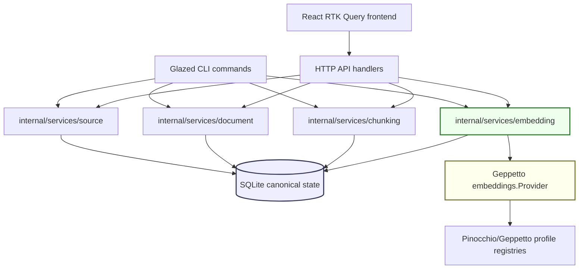
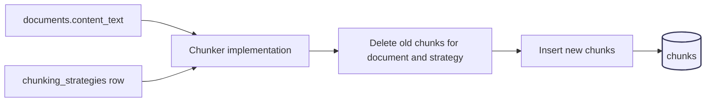
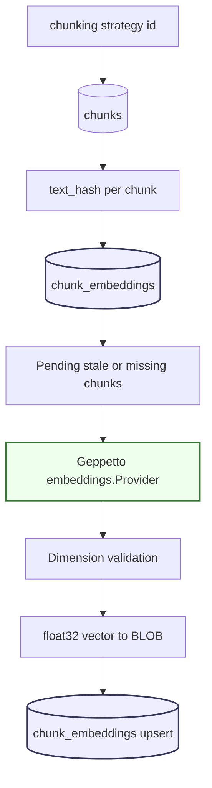
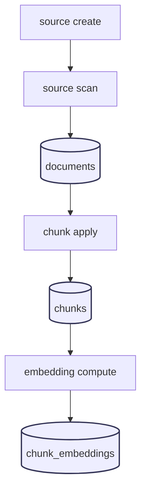

# RAG Evaluation System: Workflow-Driven Retrieval Evaluation

This report explains the RAG Evaluation System as it exists after the first implementation and stabilization pass. The project is a Go application with a SQLite state store, a Glazed command-line interface, an HTTP API, and a React frontend. Its purpose is to make document ingestion, chunking, embedding, search, reranking, and evaluation visible enough that an engineer can inspect each step of a retrieval pipeline rather than treating retrieval as a single opaque operation.

The project is still in active development. The important result so far is not a complete retrieval product. The important result is a backend structure that can safely support the next phases: strategy-aware chunks, idempotent ingestion, service-layer behavior shared by CLI and HTTP, Geppetto-backed embedding provider resolution, and an embedding compute service with text-hash staleness checks.

> [!summary]
> - The project is a Go + SQLite + Glazed + HTTP + React system for inspecting and evaluating RAG pipelines.
> - The first unsafe implementation path exposed a chunking termination bug; the fix led to explicit progress invariants, strategy-aware chunk identity, and service-layer tests.
> - Current backend functionality covers source creation, filesystem scanning, document reads, chunking, embedding provider resolution, embedding persistence, and bounded CLI/HTTP adapter surfaces.
> - The next implementation area is vector retrieval, embedding similarity, search indexing, scraper workflow integration, and a functional frontend inspector.

## Why this project exists

RAG systems are difficult to evaluate when their internal decisions are not stored in a form that can be inspected. A query result is the final output of several earlier decisions: which documents were loaded, how text was extracted, how chunks were cut, which embedding model was used, how stale embeddings were detected, how text and vector search were combined, whether reranking was applied, and how the final results were judged. If these decisions are not first-class records, the system cannot answer basic evaluation questions.

The RAG Evaluation System exists to make those decisions explicit. The backend stores source records, documents, chunks, chunking strategies, embeddings, search indexes, evaluation queries, evaluation runs, and evaluation results. The CLI and HTTP API expose the same domain services so an operator can run the system from scripts and a frontend can inspect the same state interactively.

The long-term project goal is a complete retrieval evaluation environment with four properties:

- Every derived artifact is connected to the input and configuration that produced it.
- Every expensive or retryable operation is idempotent or explicitly rebuildable.
- Every backend capability is available through both Glazed CLI commands and HTTP endpoints.
- Every user-facing view explains what happened internally rather than only showing the final answer.

## Repository and ticket context

The implementation lives at:

```text
/home/manuel/workspaces/2026-05-27/rag-evaluation-system/2026-05-27--rag-evaluation-system
```

The project ticket is `RAGEVAL-001`. The ticket workspace contains the design document, audit report, Phase 3 embedding integration plan, task list, changelog, and investigation diary:

```text
ttmp/2026/05/27/RAGEVAL-001--rag-evaluation-system-workflow-driven-document-indexing-with-interactive-playground/
├── design-doc/01-rag-evaluation-system-architecture-and-implementation-guide.md
├── analysis/01-implementation-audit-and-recovery-plan.md
├── analysis/02-phase-3-embedding-integration-plan.md
├── reference/01-investigation-diary.md
├── tasks.md
└── changelog.md
```

The current code history includes the stabilization and embedding commits:

```text
6a7ea65 docs: record embedding adapter progress
2a1f752 feat: add embedding compute HTTP endpoint
c0d4bd2 feat: add Glazed embedding compute command
785462b feat: add embedding compute service with staleness checks
d204a5e feat: add Geppetto embedding provider resolver
978f680 test: cover service idempotency and chunk migrations
3846818 fix: make chunks strategy-aware and rerun-safe
cbae145 feat: add chunking commands and guard overlap loops
```

The report below focuses on the technical structure that matters for continuation. It is not a changelog. It explains the system as a set of invariants, data flows, and service boundaries.

## Current project status

The project currently has a working backend foundation and a frontend shell.

Implemented backend capabilities:

- SQLite schema for sources, documents, chunks, chunking strategies, chunk embeddings, enrichments, search indexes, and evaluation tables.
- Source creation and filesystem scanning.
- Document listing, document lookup, and chunk listing.
- Fixed-size, sentence, and markdown-heading chunking strategies.
- Strategy-aware chunk identity.
- Rerun-safe chunk rebuilding for a document and strategy.
- Source and document upserts for retry-safe ingestion.
- Shared source, document, chunking, and embedding services.
- Glazed command groups for source, document, chunk, embedding, and serving the HTTP application.
- HTTP endpoints for source, document, chunking, and embedding compute operations.
- Geppetto embedding provider resolution with direct and profile-backed configuration paths.
- Embedding computation with batching, text-hash freshness checks, dimension validation, and SQLite persistence.
- Service-layer tests against temporary SQLite databases.

Implemented frontend capabilities:

- React + Vite + Tailwind + RTK Query shell.
- Retro macOS-style visual components.
- Basic Pipeline view that can list sources and documents.
- Placeholder views for Embeddings, Search, and Evaluation.

Not implemented yet:

- Embedding similarity command and HTTP endpoint.
- Frontend Embedding Inspector functionality.
- Bleve BM25 and hybrid search.
- Vector search path.
- Reranking service.
- Scraper workflow engine integration.
- Evaluation metrics and benchmark dashboard.
- Storybook stories for the retro UI components.

The project is now at the point where embeddings have backend support but not yet a complete inspection UI or retrieval path.

## The core architecture

The architecture has five major layers:

1. **SQLite state** stores canonical and derived records.
2. **Domain services** implement source, document, chunking, and embedding behavior.
3. **Glazed CLI adapters** expose service methods for operators and scripts.
4. **HTTP API adapters** expose service methods for the frontend.
5. **React frontend** will inspect and drive the pipeline through RTK Query.



The service layer is the key design correction. Earlier iterations put behavior directly in CLI commands and HTTP handlers. That would have created two versions of each capability. The current structure moves behavior into services and keeps CLI/HTTP adapters thin.

The current service packages are:

```text
internal/services/source/service.go
internal/services/document/service.go
internal/services/chunking/service.go
internal/services/embedding/provider.go
internal/services/embedding/service.go
internal/services/embedding/vector.go
```

The services are tested with temporary SQLite databases:

```text
internal/services/source/service_test.go
internal/services/document/service_test.go
internal/services/chunking/service_test.go
internal/services/embedding/service_test.go
internal/db/migrations_test.go
```

## State model and identity

The project treats SQLite as the canonical store. Derived artifacts can be rebuilt, but they still need stable identities so later phases can compare strategies and avoid recomputing fresh work.

The most important schema correction was adding `strategy_id` to chunks. Without this field, a document could not have chunk `0` under two different chunking strategies. The corrected schema gives chunk identity this form:

```sql
CREATE TABLE IF NOT EXISTS chunks (
    id TEXT PRIMARY KEY,
    document_id TEXT NOT NULL REFERENCES documents(id) ON DELETE CASCADE,
    strategy_id TEXT NOT NULL REFERENCES chunking_strategies(id),
    chunk_index INTEGER NOT NULL,
    text TEXT NOT NULL,
    token_count INTEGER NOT NULL DEFAULT 0,
    start_offset INTEGER DEFAULT 0,
    end_offset INTEGER DEFAULT 0,
    boundaries_json TEXT DEFAULT '{}',
    created_at TEXT NOT NULL DEFAULT (datetime('now')),
    updated_at TEXT NOT NULL DEFAULT (datetime('now')),
    UNIQUE(document_id, strategy_id, chunk_index)
);
```

This key means that a document can be chunked several times with different configurations. Each configuration gets its own ordered chunk sequence. Embeddings then reference both the chunk and the strategy:

```sql
CREATE TABLE IF NOT EXISTS chunk_embeddings (
    chunk_id TEXT NOT NULL REFERENCES chunks(id) ON DELETE CASCADE,
    strategy_id TEXT NOT NULL REFERENCES chunking_strategies(id),
    provider TEXT NOT NULL,
    model TEXT NOT NULL,
    dimensions INTEGER NOT NULL,
    text_hash TEXT NOT NULL,
    embedding BLOB NOT NULL,
    created_at TEXT NOT NULL DEFAULT (datetime('now')),
    updated_at TEXT NOT NULL DEFAULT (datetime('now')),
    PRIMARY KEY (chunk_id, strategy_id, provider, model, dimensions)
);
```

That primary key is the minimal identity needed for an embedding record. It distinguishes the same text chunk embedded by different providers, models, and vector dimensions.

The service layer uses `text_hash` to decide whether an embedding is fresh. If the chunk text has not changed and the same provider/model/dimensions identity already exists, the service skips recomputation unless `force` is set.

## The ingestion path

The ingestion path starts with a source record. A source identifies a collection of documents. The current source scanner is filesystem-based, but the model is general enough to support URL and API sources later.

```text
source create -> source scan -> documents table
```

The source service implements two operations:

```go
type CreateRequest struct {
    ID     string
    Name   string
    Type   string
    Config map[string]interface{}
}

type ScanRequest struct {
    SourceID string
    Dir      string
}
```

The scanner walks a directory, filters text-readable files, extracts a title, computes a word count, and stores the file content as document text. Document IDs are stable because they use the source ID and relative path. The relative path is also stored as `external_id`. This makes repeated scans safe: scanning the same directory twice updates the same document rows rather than creating duplicates.

The effective ingestion algorithm is:

```text
for each file under dir:
    if file is hidden or extension is unsupported:
        skip

    rel_path = relative_path(dir, file)
    doc_id = sha256(source_id + ":" + rel_path)[:16]
    title = first markdown H1 or filename without extension
    word_count = count fields in text

    upsert document:
        id = doc_id
        source_id = source_id
        external_id = rel_path
        content_text = file contents
        status = "extracted"
```

The important property is idempotency. Filesystem scanning is expected to become a workflow operation. Workflow operations are retried. A retried scan must not fail because a document already exists.

## Chunking and the termination bug

Chunking converts document text into smaller records that can be embedded, searched, and evaluated. The system currently supports fixed-size, sentence-based, and markdown-heading strategies.

The fixed-size chunker originally contained a termination bug. With overlap enabled, the algorithm could emit a final chunk that reached the end of the text, subtract overlap, and then emit another final chunk with the same end offset. This loop did not terminate. The observed symptom was a killed process during `chunk apply` even though the input document was small.

The corrected fixed-size chunker enforces three rules:

```go
if c.ChunkSize <= 0 { error }
if c.Overlap < 0 { error }
if c.Overlap >= c.ChunkSize { error }
```

Then, inside the loop:

```go
for start < totalRunes:
    end = min(start + chunkSize, totalRunes)
    emit chunk [start:end]

    if end >= totalRunes:
        break

    nextStart = end - overlap
    if nextStart <= start:
        nextStart = start + 1
    start = nextStart
```

The two invariants are explicit:

- If a chunk reaches the end of the text, the loop exits.
- If the loop continues, the next `start` is greater than the previous `start`.

The chunking service wraps this lower-level chunker and handles persistence:

```text
Apply(document_id, strategy, chunk_size, overlap):
    content = load document content
    strategy_id = explicit name or strategy-size-overlap
    upsert chunking strategy
    chunks = chunker.Chunk(document_id, content)
    delete chunks where document_id and strategy_id match
    insert new chunks
    update document status to "chunked"
```

Deleting and rebuilding the chunks for a document/strategy pair makes repeated `chunk apply` calls safe. It also means that chunks are treated as derived state. The canonical inputs are the document content and the chunking strategy configuration.



## Embedding provider resolution

Embedding computation uses Geppetto. The RAG system depends on Geppetto's provider interface:

```go
type Provider interface {
    GenerateEmbedding(ctx context.Context, text string) ([]float32, error)
    GenerateBatchEmbeddings(ctx context.Context, texts []string) ([][]float32, error)
    GetModel() EmbeddingModel
}
```

The provider resolver supports two configuration paths.

The direct path builds `settings.InferenceSettings` from explicit flags or JSON fields:

```text
embeddings-type      = ollama or openai
embeddings-engine    = model name
embeddings-dimensions = expected vector dimensions
api-key              = provider key, when needed
base-url             = provider base URL, when needed
cache-type           = none, memory, or file
```

The profile-backed path resolves a Geppetto/Pinocchio engine profile. It can either resolve a complete embedding-capable profile or resolve a base profile and overlay explicit embedding settings. The implementation follows the reference pattern in `geppetto/cmd/examples/embedding-profile-smoke/main.go`.

The resolver performs validation before returning a provider:

```text
ResolveProvider(ctx, config):
    settings, close, effective_profile = ResolveInferenceSettings(ctx, config)
    ValidateInferenceSettingsForEmbeddings(settings)
    provider = NewSettingsFactoryFromInferenceSettings(settings).NewProvider()
    model = provider.GetModel()
    return provider, model, provider_type, effective_profile, close
```

This validation matters because provider construction errors are otherwise too low-level. A missing OpenAI key should be reported as a profile/configuration problem, not as an opaque provider failure.

## Embedding computation

The embedding service computes embeddings for all chunks under a chunking strategy. It takes a provider interface, not a concrete OpenAI or Ollama client. Unit tests use fake providers; live provider calls are reserved for explicit smoke tests.

The service request is:

```go
type ComputeRequest struct {
    StrategyID   string
    Provider     embeddings.Provider
    ProviderType string
    BatchSize    int
    Limit        int
    Force        bool
}
```

The algorithm is:

```text
Compute(strategy_id, provider, provider_type, batch_size, limit, force):
    model = provider.GetModel()
    chunks = ListChunksForStrategy(strategy_id, limit)

    pending = []
    for chunk in chunks:
        hash = sha256(chunk.text)
        stored_hash = lookup embedding hash for:
            chunk_id, strategy_id, provider_type, model.name, model.dimensions

        if stored_hash == hash and not force:
            skipped_fresh += 1
        else:
            pending append (chunk, hash)

    for batch in pending split by batch_size:
        vectors = provider.GenerateBatchEmbeddings(batch.texts)
        assert len(vectors) == len(batch)

        for vector in vectors:
            assert len(vector) == model.dimensions
            blob = encode little-endian float32 vector
            upsert chunk embedding
            computed += 1

    return considered, computed, skipped_fresh
```

The service protects three important constraints:

- It bounds provider calls by batch size.
- It avoids recomputing fresh embeddings by comparing text hashes.
- It rejects dimension mismatches before storing invalid vectors.

Vectors are stored as little-endian `float32` blobs. The encoding helper is deliberately small:

```go
func EncodeFloat32Vector(vector []float32) []byte {
    buf := make([]byte, len(vector)*4)
    for i, v := range vector {
        binary.LittleEndian.PutUint32(buf[i*4:(i+1)*4], math.Float32bits(v))
    }
    return buf
}
```

This encoding is not a search index. It is canonical persisted vector data. A later vector search index can be built from it.



## CLI and HTTP adapter design

The project now follows a consistent adapter rule:

```text
Glazed CLI command -> service method -> db.Queries
HTTP handler       -> service method -> db.Queries
```

The CLI command tree currently includes:

```text
rag-eval source create
rag-eval source list
rag-eval source scan
rag-eval document list
rag-eval document get
rag-eval document chunks
rag-eval chunk apply
rag-eval chunk strategies
rag-eval embedding compute
rag-eval serve
```

The matching HTTP routes include:

```http
GET  /api/v1/health
GET  /api/v1/sources
POST /api/v1/sources
POST /api/v1/sources/{id}/scan
GET  /api/v1/documents
GET  /api/v1/documents/{id}
GET  /api/v1/documents/{id}/chunks
POST /api/v1/documents/{id}/chunk
GET  /api/v1/chunking-strategies
POST /api/v1/embeddings/compute
```

The CLI is not just a debugging convenience. It is the first stable operator surface. It also makes it possible to run controlled smoke tests without requiring the frontend to exist.

For example, a bounded embedding compute command has this shape:

```bash
rag-eval embedding compute \
  --strategy-id fixed-300-50 \
  --embeddings-type ollama \
  --embeddings-engine nomic-embed-text \
  --embeddings-dimensions 768 \
  --batch-size 16 \
  --limit 10 \
  --output table
```

The equivalent HTTP request is summary-oriented:

```http
POST /api/v1/embeddings/compute
Content-Type: application/json

{
  "strategy_id": "fixed-300-50",
  "embeddings_type": "ollama",
  "embeddings_engine": "nomic-embed-text",
  "embeddings_dimensions": 768,
  "batch_size": 16,
  "limit": 10
}
```

Both paths call the same embedding service.

## Frontend state

The frontend exists but is not yet the main functional surface. It is a React application using Vite, Tailwind, RTK Query, and a retro macOS visual style. The current UI has a menu bar and four major views:

- Pipeline
- Embeddings
- Search
- Evaluation

Only the Pipeline view has early live data wiring for sources and documents. The Embeddings, Search, and Evaluation views are placeholders. This is acceptable at the current stage because the backend contracts are still being stabilized.

The frontend should proceed in thin slices:

1. Show chunking strategies and embedding coverage.
2. Add a compute button for a limited embedding batch.
3. Show computed/skipped counts and model metadata.
4. Add chunk selection and pairwise similarity after vector retrieval exists.
5. Add search only after BM25 and vector retrieval are available through stable endpoints.

The frontend should not duplicate retrieval logic. It should display and trigger backend capabilities.

## Testing strategy

The most important test decision was to use temporary SQLite databases for service tests. Mocking the database would not test the failure modes that matter for this project. The project needs confidence in relational identity, upsert behavior, migration behavior, and derived-state rebuilds.

Current service tests cover:

| Area | Test focus |
|---|---|
| `source` service | Create upsert behavior; scan idempotency by relative path. |
| `chunking` service | Rerun-safe chunk rebuilding; strategy isolation. |
| `document` service | List/get defaults; strategy-aware chunk reads. |
| `embedding` service | Freshness skipping; forced recompute; dimension mismatch rejection. |
| `db` migration | Upgrading a legacy chunks table without `strategy_id`. |

The standard validation command is:

```bash
GOMAXPROCS=2 GOMEMLIMIT=1024MiB go test \
  ./internal/db \
  ./internal/ingest \
  ./internal/chunking \
  ./internal/services/source \
  ./internal/services/chunking \
  ./internal/services/document \
  ./internal/services/embedding \
  -count=1 \
  -timeout 60s

GOMAXPROCS=2 GOMEMLIMIT=1024MiB go build ./cmd/rag-eval
```

The `GOMAXPROCS` and `GOMEMLIMIT` settings are not required for correctness. They are useful because this project previously hit a runaway loop during chunking. Bounded execution reduces the cost of mistakes while the project is still algorithmically active.

## Failure modes and corrections

The project has already produced one useful failure: a chunking loop that could generate unbounded chunk rows. The correction was not only a patch. It changed the development rules.

### Failure mode: chunk overlap tail loop

Cause:

```text
end = total_length
next_start = end - overlap
next iteration also computes end = total_length
```

Correction:

```text
if end >= total_length:
    break
if next_start <= current_start:
    next_start = current_start + 1
```

Additional guard:

```text
0 <= overlap < chunk_size
```

### Failure mode: strategy identity hidden in JSON

Cause:

```text
chunks(document_id, chunk_index)
```

This cannot represent multiple chunking strategies for the same document.

Correction:

```text
chunks(document_id, strategy_id, chunk_index)
```

The strategy is now a relational column and part of the uniqueness constraint.

### Failure mode: duplicated adapter behavior

Cause:

```text
CLI command implements behavior
HTTP handler implements similar behavior
```

This makes fixes incomplete by default.

Correction:

```text
CLI command -> service
HTTP handler -> same service
```

### Failure mode: non-idempotent workflow operations

Cause:

```text
INSERT document
INSERT chunks
```

Plain inserts fail under retry.

Correction:

```text
source create -> upsert
source scan   -> document upsert by stable relative path
chunk apply   -> delete/rebuild derived chunks for document and strategy
embedding compute -> skip fresh rows by text_hash or force recompute
```

## What a new engineer should understand first

A new engineer should start by understanding identity. Most of the project follows from identity rules.

- A document belongs to a source and has a stable external ID.
- A chunk belongs to a document and a chunking strategy.
- An embedding belongs to a chunk, strategy, provider, model, and dimension count.
- Derived state is rebuilt or skipped based on stable keys and content hashes.
- CLI and HTTP should call services rather than implementing behavior directly.

These rules are more important than the current UI. They determine whether evaluation results can be trusted.

## Current command path

A minimal backend run looks like this:

```bash
# Create or update a source.
rag-eval source create \
  --id docs \
  --name "Docs" \
  --type filesystem

# Scan files into documents.
rag-eval source scan \
  --source-id docs \
  --dir ./docs

# Chunk one document under a strategy.
rag-eval chunk apply \
  --doc-id doc-... \
  --strategy fixed \
  --chunk-size 300 \
  --overlap 50

# Compute embeddings for that strategy.
rag-eval embedding compute \
  --strategy-id fixed-300-50 \
  --embeddings-type ollama \
  --embeddings-engine nomic-embed-text \
  --embeddings-dimensions 768 \
  --limit 10
```

The equivalent backend data flow is:



Each step is intended to be safe to repeat.

## Near-term next steps

The next backend slice should implement vector retrieval and similarity.

Recommended order:

1. Add DB helpers to fetch an embedding vector by `(chunk_id, strategy_id, provider, model, dimensions)`.
2. Add cosine similarity helpers with tests.
3. Add `rag-eval embedding similarity` for two chunks or a chunk against all chunks in a strategy.
4. Add `POST /api/v1/embeddings/similarity` backed by the same service.
5. Add a first Embedding Inspector frontend slice that displays strategy coverage and pairwise similarity.

After that, implement search:

1. Add Bleve BM25 index build/rebuild commands.
2. Store index metadata in `search_indexes`.
3. Add search endpoint with explain output.
4. Add vector search only after vector storage and similarity are stable.
5. Add hybrid RRF search once BM25 and vector candidate retrieval exist.

Workflow integration should come before large-scale usage:

1. Wrap source scan, chunk apply, and embedding compute as scraper workflow operations.
2. Make workflow run IDs visible in the Pipeline view.
3. Store operation results and failures in a way the frontend can inspect.

## Working rules for continuation

The project should continue under these rules:

- Every backend capability starts as a service method with a temporary-SQLite test.
- CLI and HTTP are adapters over services.
- Unit tests do not call live embedding providers.
- Commands that can emit document text, chunk text, or vectors use bounded output by default.
- Derived records include enough configuration identity to be compared and rebuilt.
- Operations intended for workflows must be retry-safe before they are connected to the workflow engine.
- Frontend work waits for stable backend contracts.

## Closing status

The RAG Evaluation System has moved from broad design into a concrete backend foundation. The first implementation attempt exposed a correctness problem, and that problem changed the architecture for the better: explicit identities, retry-safe writes, service-layer behavior, and tests against real SQLite state.

The project is not ready for retrieval evaluation yet. It is ready for the next backend slice: embedding similarity, search indexing, and workflow integration. Those features should preserve the same structure already established: service first, tests against SQLite, bounded outputs, then CLI and HTTP adapters, then frontend inspection.
