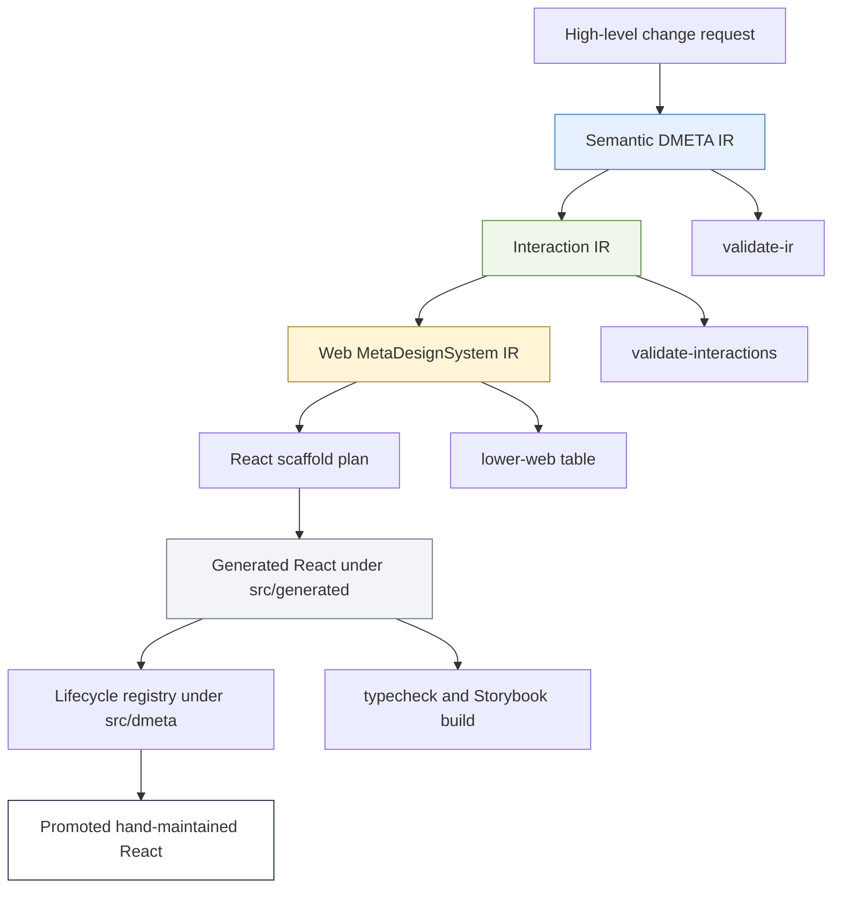
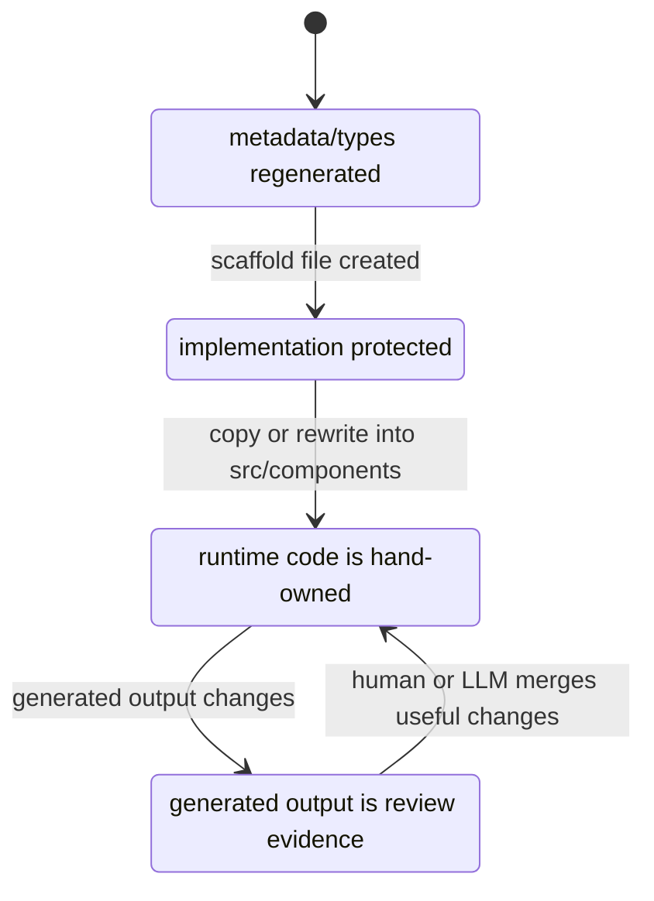
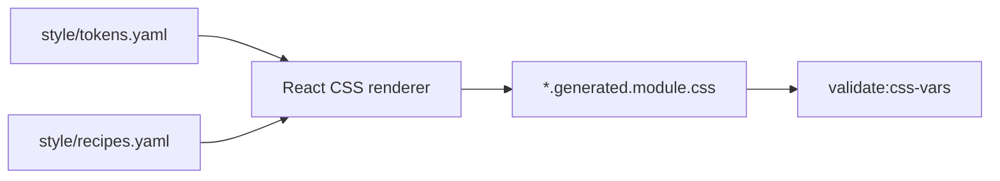

# TTC DMETA React Workflow: Semantic IR to Storybook Garden Assistant

This report explains the work done so far on the Tree Center Garden Assistant DMETA-to-React workflow. It is written as a project report and as a technical article: it records the decisions, the implementation path, the reasoning that led to the current architecture, the validation failures that shaped the result, and the near-term engineering direction. The concrete repository is `/home/manuel/workspaces/2026-05-27/ttc-design-system`.

The project started with a concrete design system prototype for a mobile garden assistant and an evolving toolkit called `dmeta`. The goal was not simply to copy the prototype into React. The goal was to make the prototype participate in a broader design-to-code workflow: high-level semantic YAML should describe domain concepts, interaction YAML should describe modality-neutral user actions and representations, web meta-design-system YAML should describe widget templates and lowering rules, and a React generator should produce traceable scaffolds that can be reviewed, promoted, merged, or regenerated.

> [!summary]
> - The project now has a working TTC DMETA source package, a Storybook React app, a generated React scaffold layer, and a live Storybook session at `http://localhost:6008/`.
> - Generated React lives in `src/generated/dmeta-widgets/` with `.generated.*` names and JSON metadata sidecars; hand-owned promoted components live in `src/components/`.
> - File lifecycle is now enforced by the generator: regenerate-only files are overwritten, scaffold-once files are protected, and sidecars can be regenerated for merge review.
> - CSS has started moving from flattened component literals into a design-system lowering path: `tokens.css`, DMETA style token/recipe YAML, tokenized generated CSS modules, and CSS-variable validation.
> - `Chip` and `Button` have been promoted as hand-owned atoms that import regenerate-only generated prop types. `ProductCard` is the next natural molecule to promote.

## Why this report exists

The interesting part of this project is not any one file. The important part is the shape of the workflow. The project is a live case study in how to build a system where design intent can move through several representations before it reaches source code, while still allowing human and LLM judgment at every boundary.

The user described the desired workflow directly. A high-level change should be expressible at an archetype, capability, interaction, or presentation level. That change should lower into a web meta-design-system. The web meta-design-system should lower into React scaffolds. Some of those scaffolds should remain regenerate-only. Some should be generated once and then promoted. Some should be regenerated as sidecars for manual or LLM-assisted merge work. The workflow should support deterministic tools where they exist, but it should not pretend that all lowering is deterministic today.

That last point affected almost every decision. The project is still being shaped from both ends. On one end there is a concrete TTC design in `original/` and a hand-built React Storybook implementation. On the other end there is a formal IR stack under `dmeta-ir/` and Go code that loads, validates, lowers, and generates scaffolds. The current work brings these ends closer together without forcing a false final architecture.

## The current state in one view

The current project has four major source zones.

```text
/home/manuel/workspaces/2026-05-27/ttc-design-system/
├── 2026-05-27--ttc-design-system/
│   ├── dmeta-ir/                         # Project-local TTC DMETA source package
│   ├── web/                              # React/Storybook app
│   ├── original/                         # Source design prototype, currently untracked in root repo
│   └── ttmp/                             # docmgr ticket documentation
├── dmeta/                                # Nested dmeta repo; generator fixes live here
├── 2026-04-23--pyxis/                    # Reference app layout, currently untracked in root repo
└── go.work
```

The commits that define the current checkpoint are now broader than the first report. The root repository has moved from a Storybook prototype to a tokenized component-system workflow:

- root repo `6dc2322` — `Add TTC DMETA React workflow`
- root repo `02c09ec` — `Add TTC component-system React scaffolds`
- root repo `017f291` — `Use generated suffix for React scaffolds`
- root repo `c99155e` — `Lower TTC React CSS from design tokens`
- root repo `5407f50` — `Promote TTC Button atom`
- root repo `1dfa3ab` — `Diary: record Button promotion`
- nested `dmeta` repo `853c522` — `Enforce React scaffold file lifecycles`
- nested `dmeta` repo `5a532ed` — `Lower React scaffold CSS from TTC tokens`

Storybook is running in `tmux`:

```text
session: ttc-storybook
url:     http://localhost:6008/
log:     /tmp/ttc-storybook.log
```

The validation commands passed at the current checkpoint:

```bash
cd dmeta

go test ./pkg/dmeta/generator/react ./pkg/dmeta/metadesign/web ./pkg/dmeta/interaction ./pkg/dmeta/validator

go run ./cmd/dmeta validate-ir \
  --root ../2026-05-27--ttc-design-system/dmeta-ir \
  --include-info \
  --output table

go run ./cmd/dmeta validate-interactions \
  --root ../2026-05-27--ttc-design-system/dmeta-ir \
  --include-info \
  --output table

go run ./cmd/dmeta lower-web \
  --root ../2026-05-27--ttc-design-system/dmeta-ir \
  --interactions-root ../2026-05-27--ttc-design-system/dmeta-ir \
  --web-root ../2026-05-27--ttc-design-system/dmeta-ir/meta-design-systems/web \
  --output table
```

```bash
cd 2026-05-27--ttc-design-system/web
pnpm --filter ttc-garden-assistant typecheck
pnpm --filter ttc-garden-assistant build-storybook
```

## The primary design decision

The central decision was to treat the system as a layered workflow with explicit ownership at each layer. The generated code should not replace the hand-authored prototype simply because it exists. The hand-authored prototype should not ignore the IR simply because it is more polished. Both should be connected by a traceable lifecycle mechanism.

The resulting rule is simple:

- **IR files are source.** They describe concepts, interactions, presentations, widget templates, lowering rules, and target generation rules.
- **Generated files are compiler output.** They live under `src/generated/dmeta-widgets/` and can be regenerated.
- **Polished UI files are promoted implementation.** They live under `src/components/`, `src/pages/`, `src/styles/`, and `src/stories/`.
- **The registry is the merge boundary.** `src/dmeta/widgetRegistry.ts` imports generated metadata and describes which generated template corresponds to which promoted component.

This decision avoided two failure modes. The first failure mode would be to over-trust generated scaffolds and lose the visual fidelity of the original design. The second failure mode would be to hand-code the entire app and leave the DMETA pipeline as documentation only. The lifecycle registry creates a third path: generated output remains live and typechecked, while the hand implementation remains the visual source of truth.

## The system architecture

The workflow is a compiler pipeline with reviewable intermediate artifacts. Some transformations are deterministic today. Some are currently manual or LLM-assisted. The important property is that each layer has a file format, validation story, and review boundary.



The current pipeline is implemented across the nested `dmeta` repo and the TTC project directory.

| Layer | Primary files | Current responsibility |
|---|---|---|
| Semantic IR | `2026-05-27--ttc-design-system/dmeta-ir/core-model/*.yaml` | Define TTC domain concepts, capabilities, presentations, actions, and domain examples. |
| Design language IR | `2026-05-27--ttc-design-system/dmeta-ir/02-design-language.yaml` | Define visual design constraints and human-language guidance for generated/polished widgets. |
| Interaction IR | `2026-05-27--ttc-design-system/dmeta-ir/interactions/*.yaml` | Define modality-neutral actions, representations, and elaboration rules. |
| Web MDS IR | `2026-05-27--ttc-design-system/dmeta-ir/meta-design-systems/web/**/*.yaml` | Define web widget templates and lowering rules from interaction obligations. |
| React target | `2026-05-27--ttc-design-system/dmeta-ir/meta-design-systems/web/targets/react.yaml` | Define output directory, file kinds, and React target defaults. |
| Instance | `2026-05-27--ttc-design-system/dmeta-ir/instantiations/ttc-garden-assistant.yaml` | Select which templates become generated React components. |
| Generator | `dmeta/pkg/dmeta/generator/react/*.go` | Plan, render, and write React scaffold files. |
| Generated React | `web/.../src/generated/dmeta-widgets/**` | Regenerable scaffold output and metadata sidecars. |
| Promoted React | `web/.../src/components/**`, `src/pages/**`, `src/styles/**` | Hand-maintained visual implementation. |
| Lifecycle registry | `web/.../src/dmeta/**` | Maps generated templates and metadata to promoted components. |

## Starting point: the concrete design

The concrete design existed before the formal TTC IR. The relevant source design files live under:

```text
2026-05-27--ttc-design-system/original/
```

Important files include:

```text
original/Garden Assistant - Design System.html
original/atoms.jsx
original/molecules.jsx
original/organisms.jsx
original/showcase.jsx
original/data.js
original/icons.jsx
original/tokens.css
```

The existing design already had a useful decomposition. There were atomic controls such as buttons, chips, badges, icons, and section headings. There were molecules such as message rows, product cards, plant list rows, filters, and stat tiles. There were organisms such as quick picks, top matches, watering guide, warning signs, plant pairing reasons, care calendar, upload prompt, and compare teaser. There were full conversation screens showing how those pieces sit inside a mobile Tree Center chat surface.

This concrete design mattered because it prevented the IR work from becoming abstract naming. The YAML was not invented in isolation. It was derived from real UI needs:

- A recommendation answer needs quick picks and product cards.
- A shopping answer needs price, availability, product identity, and cart actions.
- A care answer needs ordered steps and warning signs.
- A plant pairing answer needs explicit reasons.
- A diagnosis answer needs photo upload and symptom evidence.
- A generated plan needs to preserve why each plant belongs in the plan.

The design also established the visual tone: a premium Tree Center mobile commerce surface with navy authority, muted gold expertise, botanical semantic colors, white cards, and mobile chat rhythm. That became the basis for `02-design-language.yaml`.

## Why Pyxis mattered

The user asked for the web layout to follow the Pyxis app shape. The Pyxis reference is located at:

```text
2026-04-23--pyxis/web/packages/pyxis-app/
```

The relevant pattern was not the specific UI. The relevant pattern was the package organization:

```text
web/
  package.json
  pnpm-workspace.yaml
  packages/<app>/
    package.json
    .storybook/
    src/
      App.tsx
      components/
      pages/
      store.ts
      styles/
```

The TTC package now follows that direction:

```text
2026-05-27--ttc-design-system/web/
  package.json
  pnpm-workspace.yaml
  packages/ttc-garden-assistant/
    package.json
    .storybook/
    src/
      App.tsx
      components/
      dmeta/
      domain/
      generated/
      pages/
      stories/
      styles/
      store.ts
```

I did not immediately split every promoted TTC component into separate atom/molecule/organism files. That would be a reasonable next step, but it was not the best first step. The first step was to get Storybook running, keep the polished prototype visible, generate scaffolds, and add lifecycle metadata. The large `GardenAssistant.tsx` file is acceptable during this phase because the registry now gives us a map for future splitting.

## Building the semantic IR

The semantic IR begins with the question: what are the domain objects and what can be known or done with them? For TTC, the core archetypes are:

- `Plant`
- `PlantProduct`
- `GardenSite`
- `PlantRecommendationSet`
- `CarePlan`
- `PlantPairing`
- `DiagnosticObservation`
- `ShoppingPlan`

These are defined in:

```text
2026-05-27--ttc-design-system/dmeta-ir/core-model/archetypes.yaml
```

The important decision was to make TTC concepts domain-specific descendants of base DMETA concepts rather than forcing plant-commerce semantics into the global vocabulary. For example:

- `Plant` extends `Resource`.
- `PlantProduct` extends `Plant` and `ActionSpec`.
- `CarePlan` extends `WorkItem` and `TimelineSpan`.
- `PlantPairing` extends `Relation`.
- `DiagnosticObservation` extends `Annotation` and `Event`.
- `ShoppingPlan` extends `WorkItem`.

That structure matters because it lets TTC remain specific while still benefiting from base DMETA semantics. A `CarePlan` is not just text; it is work over time. A `PlantPairing` is not just a pair of product cards; it is a relation with reasons. A `DiagnosticObservation` is not a diagnosis by default; it is evidence that can be timestamped, related, inspected, and refined.

The capabilities are defined in:

```text
2026-05-27--ttc-design-system/dmeta-ir/core-model/capabilities.yaml
```

The core TTC capabilities are where the UI starts to become operational:

- `site_conditions` describes zone, sun, soil, drainage, location, goals, and constraints.
- `plant_suitability` describes zones, sun, water, mature height, mature width, spacing, maintenance, and fit rationale.
- `care_guidance` describes care steps, watch signs, care months, frequency, and seasonal notes.
- `purchasable` describes product references, product URLs, price, image, liked state, and cart eligibility.
- `availability` describes stock, shipping, seasonal, and substitution state.
- `recommendable` describes rank, score, reason, reason codes, and confidence.
- `pairable` describes paired references, pairing reasons, spacing notes, and style notes.
- `diagnostically_observable` describes symptoms, photo refs, diagnosis summary, confidence, and next question.
- `plan_composable` describes plan role, plan reason, dependencies, and optionality.

The long prose in these YAML files is deliberate. A future generator can use it for metadata and documentation. A future LLM prompt can use it to propose a change. A human reviewer can use it to decide whether a new feature belongs in an existing capability or needs a new one.

## Presentations: the semantic surface layer

Presentations are defined in:

```text
2026-05-27--ttc-design-system/dmeta-ir/core-model/presentations.yaml
```

This file answers a different question from archetypes and capabilities. It does not ask what a thing is or what fields it has. It asks what kind of UI surface can faithfully render it.

Examples:

- `quick_pick_list` represents a short ranked set of recommendations.
- `product_match_grid` represents concrete product cards.
- `active_filter_bar` represents visible site and result constraints.
- `suitability_summary` represents explanation of fit.
- `care_steps` represents ordered care instructions.
- `warning_signs` represents symptoms or watch-for signs.
- `pair_reason_grid` represents explicit plant compatibility reasoning.
- `photo_upload_prompt` represents diagnostic media intake.
- `shopping_plan_summary` represents a generated plan that can become commerce.

This layer matters because it prevents widgets from being chosen only by component names. The React component is an implementation detail. The presentation is the semantic obligation. The web meta-design-system can decide that `quick_pick_list` lowers to `ttc.quick_picks_widget`, while a future voice or CLI target could lower the same representation differently.

A representative presentation has this shape:

```yaml
quick_pick_list:
  description: Short ranked list of easy recommendations inside a chat answer.
  long_description: >
    quick_pick_list is optimized for conversational speed: three to five
    recommendations with image, label, and reason. It is the first helpful
    answer when context is sparse.
  layer: domain
  applies_to:
    archetypes: [PlantRecommendationSet]
    capabilities: [recommendable]
  requires_any:
    - recommendable.reason
    - labelable.label
  optional:
    - plant_suitability.zones
    - purchasable.image_url
  role: ranked_list
  style_recipe: compact_plant_row
  fallbacks: [summary_card]
```

The key fields are not only structural. The `long_description` carries design reasoning. The `requires_any` and `optional` fields explain how strongly a presentation depends on projections. The `style_recipe` links semantic rendering to design-language constraints.

## Interaction IR: modality-neutral behavior

The interaction package lives under:

```text
2026-05-27--ttc-design-system/dmeta-ir/interactions/
```

It contains:

```text
00-index.yaml
actions.yaml
representations.yaml
elaboration-rules.yaml
```

Actions include:

- `set_site_conditions`
- `refine_recommendations`
- `select_recommendation`
- `filter_plants`
- `compare_plants`
- `request_care_guide`
- `refine_care_guide`
- `upload_photo`
- `diagnose_observation`
- `build_plan`
- `add_to_plan`
- `remove_from_plan`
- `add_to_cart`
- `open_product`
- `toggle_like`
- `shop_pair`

Representations include:

- `quick_pick_list`
- `product_match_grid`
- `active_filter_bar`
- `suitability_summary`
- `care_steps`
- `warning_signs`
- `pair_reason_grid`
- `compare_teaser`
- `care_calendar`
- `plant_detail_card`
- `photo_upload_prompt`
- `suggestion_strip`
- `shopping_plan_summary`

The elaboration rules derive obligations from semantic facts. This is the first major deterministic lowering step. The code that applies these rules is in:

```text
dmeta/pkg/dmeta/interaction/elaborate.go
```

The essential algorithm is compact:

```go
for each domainExample in core.DomainExamples:
    for each domainType in domainExample.DomainTypes:
        facts := BuildDomainFacts(domainType, resolvedInheritance)
        for each rule in interaction.Rules:
            if SelectorMatches(rule.When, facts):
                emit each concrete representation in rule.Emits.Representations
                emit each concrete action in rule.Emits.Actions
```

This algorithm is important because it establishes the role of the domain example. The domain example is not only sample data. It is a contract test for the semantic model. It proves that the real application has domain types that can trigger obligations.

For example, this rule:

```yaml
- id: recommendation_set_to_quick_picks
  when:
    all_archetypes: [PlantRecommendationSet]
    all_capabilities: [recommendable]
  emits:
    representations:
      - quick_pick_list
      - active_filter_bar
      - suitability_summary
      - suggestion_strip
    actions:
      - select_recommendation
      - refine_recommendations
      - filter_plants
```

means that a recommendation set is expected to produce more than a list. It should expose current filters, explain suitability, and provide follow-up actions.

## Web MetaDesignSystem lowering

The web meta-design-system lives under:

```text
2026-05-27--ttc-design-system/dmeta-ir/meta-design-systems/web/
```

The important files are:

```text
meta-design-system.yaml
lowering-rules.yaml
widgets/chat.yaml
widgets/recommendations.yaml
widgets/care-and-diagnosis.yaml
widgets/planning-and-shopping.yaml
targets/react.yaml
```

This layer maps interaction obligations to web widget templates. The code path is in:

```text
dmeta/pkg/dmeta/metadesign/web/load.go
dmeta/pkg/dmeta/metadesign/web/validate.go
dmeta/pkg/dmeta/metadesign/web/lower.go
```

The lowering algorithm groups interaction obligations by example and domain type. Then it applies web lowering rules.

```go
for each interactionObligation:
    group by exampleID and domainTypeID
    collect representations and actions

for each group:
    for each webLoweringRule:
        if rule.When.Representations are all present
        and rule.When.Actions are all present:
            emit web widget obligations
```

A rule such as:

```yaml
- id: product_match_grid_to_top_matches_widget
  when:
    representations: [product_match_grid]
    actions: [open_product, toggle_like]
  emits:
    widget_templates: [ttc.top_matches_widget]
    slots:
      - section_title
      - view_all_link
      - product_grid
      - product_card_actions
    visual_states:
      - two_cards
      - many_results
      - liked
      - empty
    event_bindings:
      - open_product
      - toggle_like
      - add_to_plan
      - add_to_cart
```

says that when a product grid and the relevant commerce actions exist, the web target should generate a `TopMatchesWidget` scaffold with specific slots, visual states, and event bindings.

This is where the system becomes visibly useful for React generation. The web lowering output is not yet React code, but it contains the specific component obligations that React generation needs.

## React generation and the first generator fixes

The React generator is under:

```text
dmeta/pkg/dmeta/generator/react/
```

The important files are:

```text
model.go
plan.go
render.go
write.go
```

The command is registered as:

```text
dmeta scaffold-react
```

The command follows this path:

```go
semanticPkg := validator.LoadPackage(ctx, semanticRoot)
resolved := validator.ResolveCoreInheritance(semanticPkg.CoreModel)
interactionPkg := interaction.LoadPackage(ctx, interactionsRoot)
interactionObligations := interaction.ElaborateInteractions(...)
webPkg := webmds.LoadPackage(ctx, webRoot)
webObligations := webmds.Lower(interactionObligations, webPkg)
plan := reactgen.BuildScaffoldPlan(ctx, opts)
files := reactgen.Generate(plan)
reactgen.WriteFiles(files, force, dryRun)
```

The generated output goes to:

```text
2026-05-27--ttc-design-system/web/packages/ttc-garden-assistant/src/generated/dmeta-widgets/
```

Each generated component folder contains:

```text
<Component>.tsx
<Component>.types.ts
<Component>.metadata.json
<Component>.stories.tsx
<Component>.module.css
<Component>.adapter.todo.ts
README.md
index.ts
```

The first generated pass did not compile. That was useful. It showed where the generator had assumptions that were not compatible with the TTC Storybook package.

The first failure was Storybook type imports:

```text
Module '"@storybook/react-vite/*"' has no exported member 'Meta'.
Module '"@storybook/react-vite/*"' has no exported member 'StoryObj'.
```

The fix was in `renderStories`:

```go
import type { Meta, StoryObj } from "@storybook/react";
```

The second failure was generated barrel exports. The generator originally emitted metadata preludes into component `index.ts` barrels and then used wildcard exports. Every generated file exported a `dmetaGeneratedMetadata` constant. When the package-level index re-exported component barrels, TypeScript saw ambiguous metadata exports.

The fix was to make component barrels explicit and to avoid the metadata prelude in barrels:

```go
func renderBarrel(_ ScaffoldPlan, component ComponentPlan, _ PlannedFile) string {
    return fmt.Sprintf(`%sexport { %s } from "./%s";
export type { %sProps, %sSlotName, %sVisualState } from "./%s.types";
`, generatedHeader, component.ComponentName, component.ComponentName, component.ComponentName, component.ComponentName, component.ComponentName, component.ComponentName)
}
```

The third failure involved selected templates that had no lowered visual states. The generator emitted a `never` visual state type but still set `visualState: "default"` in stories. The fix was to make the fallback type include `"default"`:

```go
if len(component.VisualStates) == 0 {
    b.WriteString("  | \"default\"\n")
    b.WriteString(";\n")
}
```

The final cleanup fixed generated metadata double-newlines and trailing whitespace in generated README/adapter files. That mattered because the root repo was committing generated files and `git diff --check` surfaced those issues.

The nested `dmeta` commit for these fixes is:

```text
dd839fc Fix React scaffold output for TTC workflow
```

## The generated/handwritten merge problem

After generation, the repository had two implementations of similar concepts:

- Generated scaffolds under `src/generated/dmeta-widgets/`.
- Polished hand components in `src/components/GardenAssistant.tsx`.

The generated components compile, but they are intentionally generic. They render slots, states, and metadata. They are useful as scaffolds and provenance carriers. They are not visually equivalent to the TTC design.

The hand components are visually useful. They implement the design system: Tree Center header, promo banner, chat chrome, plant rows, product cards, suitability stats, care guide, warning signs, pair reason tiles, calendar, upload prompt, and full conversation stories. They do not by themselves explain which semantic template they implement.

The merge strategy was to introduce an explicit registry:

```text
2026-05-27--ttc-design-system/web/packages/ttc-garden-assistant/src/dmeta/widgetLifecycle.ts
2026-05-27--ttc-design-system/web/packages/ttc-garden-assistant/src/dmeta/widgetRegistry.ts
2026-05-27--ttc-design-system/web/packages/ttc-garden-assistant/src/dmeta/index.ts
```

The registry imports generated metadata sidecars:

```ts
import quickPicksMetadata from '../generated/dmeta-widgets/QuickPicksWidget/QuickPicksWidget.metadata.json';
```

Then it maps generated templates to promoted components:

```ts
{
  templateId: 'ttc.quick_picks_widget',
  generatedComponentName: 'QuickPicksWidget',
  promotedComponentName: 'QuickPicksWidget',
  lifecycle: 'promoted-hand-maintained',
  metadata: quickPicksMetadata,
  notes: 'The current hand widget matches the DMETA quick_pick_list obligation and should be used by the app.',
}
```

This is not a final runtime abstraction. It is a project control surface. It lets Storybook and future tooling answer:

- Which generated template exists?
- Which generated component name did the scaffold use?
- Which hand component is the promoted implementation?
- Is the generated file regenerate-only, a sidecar, an adapter bridge, or a future generated component?
- Which representations and actions does the generated metadata claim to realize?

The Storybook view lives in:

```text
src/stories/DmetaWorkflow.stories.tsx
```

It renders the registry as a table. That table is the first UI-level representation of the lifecycle policy.

## Lifecycle categories

The current lifecycle model is defined in:

```text
src/dmeta/widgetLifecycle.ts
```

The current type is:

```ts
export type DmetaWidgetLifecycle =
  | 'regenerate-only'
  | 'generated-sidecar'
  | 'promoted-hand-maintained'
  | 'adapter-bridge'
  | 'future-generated';
```

These categories exist because generated files do not all have the same ownership.

### Regenerate-only

A regenerate-only file should be overwritten from the generator. Metadata sidecars are the clearest current example. If metadata is wrong, the upstream IR or generator should be fixed. Hand-editing metadata sidecars would corrupt provenance.

### Generated sidecar

A generated sidecar is regenerated for comparison or merge assistance. It remains under `src/generated/`, but a developer may inspect it while editing a hand component. This is useful when the IR changes and the developer needs to see what the generator now thinks the component should expose.

### Promoted hand-maintained

A promoted hand-maintained component is visually and behaviorally owned by source files outside `src/generated/`. Most current TTC widgets are in this category. The generated metadata still records the source template and obligations, but the UI implementation is hand-owned.

### Adapter bridge

An adapter bridge exists when the generated template does not map one-to-one to a hand component. `ChatMessageRow` is the example. The generated template says there is a chat message row. The hand implementation splits this into `UserMessageRow` and `BotMessageRow`.

### Future generated

A future generated component exists as a scaffold but does not yet have a polished promoted implementation. `ShoppingPlanSummaryWidget` is currently the best example. It should be the next component to promote manually.

## The web package after the merge layer

The TTC web package now has this important structure:

```text
src/
  App.tsx
  components/
    GardenAssistant.tsx
    index.ts
    parts.ts
  dmeta/
    index.ts
    widgetLifecycle.ts
    widgetRegistry.ts
  domain/
    fixtures.ts
  generated/
    dmeta-widgets/
      QuickPicksWidget/
      TopMatchesWidget/
      ...
  pages/
    GardenAssistantPage/
      Page.tsx
      Page.css
      Page.stories.tsx
      index.ts
    index.ts
  stories/
    GardenAssistant.stories.tsx
    DmetaWorkflow.stories.tsx
  styles/
    app-tokens.css
    global.css
```

`App.tsx` now renders the page layer:

```tsx
import { GardenAssistantPage } from './pages';
import './styles/app-tokens.css';
import './styles/global.css';

export function App() {
  return <GardenAssistantPage scenario="quick-picks" />;
}
```

The page layer is in:

```text
src/pages/GardenAssistantPage/Page.tsx
```

It provides named scenarios:

- `quick-picks`
- `top-matches`
- `watering`
- `pairing`
- `generative-mix`
- `full-demo`

This was not only a cosmetic change. It moved the app toward a Pyxis-like page structure while preserving the existing component implementation. It gives future work a stable place to add routing, state selection, or assistant response adapters without turning `App.tsx` into a scenario switchboard.

## The documentation work

The project now has an intern-facing architecture guide in the docmgr ticket:

```text
2026-05-27--ttc-design-system/ttmp/2026/05/27/TTC-DMETA-CHATBOT--dmeta-toolkit-plan-for-the-tree-center-chatbot/design-doc/02-dmeta-to-react-workflow-architecture-and-implementation-guide.md
```

That guide was uploaded to reMarkable as:

```text
/ai/2026/05/27/TTC-DMETA-CHATBOT/TTC DMETA React Workflow Guide.pdf
```

The guide explains:

- the layered workflow;
- semantic IR;
- interaction IR;
- web meta-design-system IR;
- React target and instance manifest;
- generated file lifecycle;
- generated vs hand-maintained file ownership;
- commands for validation and regeneration;
- current failures and fixes;
- future lifecycle-aware generator work.

The diary was also backfilled:

```text
2026-05-27--ttc-design-system/ttmp/2026/05/27/TTC-DMETA-CHATBOT--dmeta-toolkit-plan-for-the-tree-center-chatbot/reference/01-investigation-diary.md
```

The diary now records Step 5, including the generator failures, the move of `dmeta-ir`, validation commands, reMarkable upload, and commit hashes.

## The thinking process behind the major decisions

### Why not replace the hand UI with generated UI?

The generated UI is not meant to be the final design at this stage. It renders semantic scaffolds: slots, states, metadata, and event binding placeholders. The hand UI already encodes visual decisions from the TTC prototype. Replacing it would reduce quality and erase the fastest path to visual review.

The generated output still matters. It proves that the IR can lower into concrete React artifacts. It exposes generator assumptions. It creates metadata sidecars. It lets typecheck and Storybook validate the pipeline. It gives future LLM-assisted merge work a concrete artifact to compare against.

The chosen strategy is therefore not replacement. It is coexistence with explicit lifecycle metadata.

### Why move `dmeta-ir` into the project directory?

The TTC IR started as a proposed package and briefly lived in an example-like context. The user then clarified that these were real working files and could move into the top directory of `2026-05-27--ttc-design-system/`. That was the right direction because the IR now describes this project, not a reusable generic example.

The move also made output paths cleaner. The instance manifest now points from project-local IR to project-local web output. The project can be understood by starting under `2026-05-27--ttc-design-system/` without first entering the nested `dmeta/examples/` tree.

### Why fix the generator immediately?

Generated code failed typecheck. There were two possible responses:

1. Patch generated files until the project compiles.
2. Fix the generator and regenerate.

The second response was necessary. If generated files are patched, the pipeline becomes untrustworthy. The next regeneration would reintroduce the same errors. Because this project is explicitly about a repeatable YAML-to-React workflow, generator correctness matters even while the generator is still primitive.

The generator fixes were small but important. They turned a scaffold that only existed as files into a scaffold that participates in the web package’s normal validation path.

### Why keep `GardenAssistant.tsx` large for now?

A fully modular component structure is likely the eventual shape. The current file contains atoms, molecules, organisms, templates, and screen-level compositions. Splitting it now would be possible, but it would introduce many file moves while the bigger design question is still lifecycle ownership.

The page layer and lifecycle registry solve more urgent problems:

- `App.tsx` no longer duplicates a conversation.
- Storybook has a page-level scenario surface.
- Generated metadata is connected to promoted components.
- The next promotion target is visible.

A component split should happen when we promote or refactor one component family at a time. For example, `ShoppingPlanSummaryWidget` can become a new hand component file when it is promoted. Later, the existing `QuickPicksWidget`, `TopMatchesWidget`, and related primitives can be split with less risk because the lifecycle registry will show their semantic relationships.

### Why write verbose YAML?

The user explicitly wanted the YAML to contain human language comparable to the Street Deli example. That changed the role of YAML from machine-only configuration to durable design source. The YAML now carries reasons, boundaries, examples, validation intent, and UI implications.

This matters for LLM-assisted workflows. A future prompt can include `capabilities.yaml` or `presentations.yaml` and ask for a new feature. If the YAML only had identifiers and projection types, the model would not know the design intent. With long descriptions, it can reason about whether a feature belongs under `care_guidance`, `diagnostically_observable`, `site_conditions`, or a new capability.

It also matters for human onboarding. An intern can read `PlantPairing.long_description` and understand why pair suggestions must show reasons. They do not have to infer that from a React component named `WhyPairWidget`.

## Validation as design feedback

Validation was not a final step. It shaped the implementation.

The DMETA validators require artifact identity, schema versions, known references, known presentations, known actions, known inheritance, and consistent widget templates. Early validation issues exposed missing or mismatched references. The most useful example was `action_group`: the semantic package initially referenced `action_group` as a presentation fallback, but it was not defined. The fix was to use `suggestion_action_strip` or `summary_card` instead of leaving an unresolved concept.

The TypeScript validator exposed generator defects. The errors were not treated as incidental. They revealed incorrect assumptions about Storybook imports, barrel exports, and default state types.

This is the desired workflow. Validators are not only compliance checks. They are design feedback tools. They force vague or inconsistent ideas to become explicit.

## Commands as a repeatable working loop

The current working loop is:

```bash
# 1. Validate project-local semantic IR.
cd dmeta
go run ./cmd/dmeta validate-ir \
  --root ../2026-05-27--ttc-design-system/dmeta-ir \
  --include-info \
  --output table

# 2. Validate project-local interaction IR.
go run ./cmd/dmeta validate-interactions \
  --root ../2026-05-27--ttc-design-system/dmeta-ir \
  --include-info \
  --output table

# 3. Inspect web obligations.
go run ./cmd/dmeta lower-web \
  --root ../2026-05-27--ttc-design-system/dmeta-ir \
  --interactions-root ../2026-05-27--ttc-design-system/dmeta-ir \
  --web-root ../2026-05-27--ttc-design-system/dmeta-ir/meta-design-systems/web \
  --output table

# 4. Regenerate React scaffolds.
go run ./cmd/dmeta scaffold-react \
  --instance ../2026-05-27--ttc-design-system/dmeta-ir/instantiations/ttc-garden-assistant.yaml \
  --force \
  --output table

# 5. Validate shared generator packages.
go test ./pkg/dmeta/generator/react ./pkg/dmeta/metadesign/web ./pkg/dmeta/interaction ./pkg/dmeta/validator

# 6. Validate web output.
cd ../2026-05-27--ttc-design-system/web
pnpm --filter ttc-garden-assistant typecheck
pnpm --filter ttc-garden-assistant build-storybook
```

A future script or `make` target should encode this loop. For now, keeping it explicit helps interns understand which stage failed.

## The current Storybook surface

Storybook now has several categories of stories:

- Hand-authored design-system stories in `GardenAssistant.stories.tsx`.
- Page-level scenario stories in `pages/GardenAssistantPage/Page.stories.tsx`.
- Generated scaffold stories under `src/generated/dmeta-widgets/**`.
- Workflow/lifecycle registry story in `DmetaWorkflow.stories.tsx`.

This is useful because it shows the project from multiple angles:

- The polished stories show what the TTC experience should look like.
- The generated stories show what the generator currently emits.
- The lifecycle story shows how these two worlds are connected.

That last story is especially important. It makes the workflow visible inside the product’s frontend tool, not only in prose documentation.

## Important file references

The most important files for continuing the work are:

```text
# Project-local IR
2026-05-27--ttc-design-system/dmeta-ir/01-core-model.yaml
2026-05-27--ttc-design-system/dmeta-ir/02-design-language.yaml
2026-05-27--ttc-design-system/dmeta-ir/core-model/archetypes.yaml
2026-05-27--ttc-design-system/dmeta-ir/core-model/capabilities.yaml
2026-05-27--ttc-design-system/dmeta-ir/core-model/presentations.yaml
2026-05-27--ttc-design-system/dmeta-ir/interactions/actions.yaml
2026-05-27--ttc-design-system/dmeta-ir/interactions/representations.yaml
2026-05-27--ttc-design-system/dmeta-ir/interactions/elaboration-rules.yaml
2026-05-27--ttc-design-system/dmeta-ir/meta-design-systems/web/lowering-rules.yaml
2026-05-27--ttc-design-system/dmeta-ir/meta-design-systems/web/widgets/recommendations.yaml
2026-05-27--ttc-design-system/dmeta-ir/meta-design-systems/web/widgets/care-and-diagnosis.yaml
2026-05-27--ttc-design-system/dmeta-ir/meta-design-systems/web/widgets/planning-and-shopping.yaml
2026-05-27--ttc-design-system/dmeta-ir/instantiations/ttc-garden-assistant.yaml

# Generator code
 dmeta/pkg/dmeta/generator/react/plan.go
 dmeta/pkg/dmeta/generator/react/render.go
 dmeta/pkg/dmeta/generator/react/write.go
 dmeta/pkg/dmeta/metadesign/web/lower.go
 dmeta/pkg/dmeta/interaction/elaborate.go

# TTC web code
2026-05-27--ttc-design-system/web/packages/ttc-garden-assistant/src/components/GardenAssistant.tsx
2026-05-27--ttc-design-system/web/packages/ttc-garden-assistant/src/pages/GardenAssistantPage/Page.tsx
2026-05-27--ttc-design-system/web/packages/ttc-garden-assistant/src/dmeta/widgetRegistry.ts
2026-05-27--ttc-design-system/web/packages/ttc-garden-assistant/src/stories/DmetaWorkflow.stories.tsx
2026-05-27--ttc-design-system/web/packages/ttc-garden-assistant/src/generated/dmeta-widgets/
```

## Follow-up phase: from generated widgets to a component system

The first version of the report ended with a reasonable next step: make lifecycle policy formal and promote a component. That work has now happened. The project no longer treats React generation as a single “write files” operation. It treats each generated file as an artifact with a lifecycle, and it treats promoted React as a separate ownership state.

This distinction matters because generated code is not one thing. A generated metadata sidecar is different from a generated implementation scaffold. A generated prop type may remain imported forever. A generated Storybook story may be useful as review evidence even after the component itself is hand-owned. A generated adapter TODO may be a checklist rather than runtime code. The workflow only becomes practical when those differences are represented in tooling.

The current generated component folder now has a predictable shape:

```text
src/generated/dmeta-widgets/atoms/Button/
  Button.generated.tsx
  Button.generated.types.ts
  Button.generated.stories.tsx
  Button.generated.module.css
  Button.generated.adapter.todo.ts
  Button.metadata.json
  index.ts
  README.md
```

The important part is the name. `Button.generated.types.ts` is allowed to remain imported by hand code because the import path itself says what is happening. The hand-owned component is not pretending the type is local. It is explicitly depending on generated source.

```ts
import type { ButtonProps as GeneratedButtonProps } from '../../../generated/dmeta-widgets/atoms/Button/Button.generated.types';
```

That single import line carries useful information for a reviewer. It says that the hand component is promoted, but its contract still comes from the lowering pipeline. If the contract changes, the generated type changes; if the visual implementation changes, the hand component changes. Those are different review events.

## File lifecycle is now enforced by the generator

The generator now carries lifecycle from the Web MetaDesignSystem widget template into the planned file and then into the write step. The lifecycle values are simple, but they change the behavior of regeneration in an important way.

| Lifecycle | Meaning | Write behavior |
|---|---|---|
| `regenerate_only` | The file is compiler output and should be overwritten when regenerated. | Always written by scaffold generation. |
| `scaffold_once` | The file is a starting point for hand ownership. | Written only when missing, even if `--force` is supplied. |
| `generated_sidecar` / `sidecar_for_merge` | The file is generated evidence for review or manual merge. | Written as generated output, usually with force semantics. |

The TTC atom and molecule YAML now uses this distinction. `Button`, `Chip`, and `ProductCard` explicitly keep their generated types and metadata regenerate-only while protecting implementation scaffolds.

```yaml
component_system:
  kind: atom
  lifecycle:
    default: scaffold_once
    types: regenerate_only
    styles: regenerate_only
    metadata: regenerate_only
    stories: sidecar_for_merge
    promote_into: src/components/atoms/Button
```

The scaffold output makes the policy visible. A run of `scaffold-react --force` now reports rows such as:

```text
Button.generated.tsx            skipped  scaffold_once; file exists
Button.generated.types.ts       written  regenerate_only
Button.metadata.json            written  regenerate_only
Button.generated.module.css     written  regenerate_only
```

This is the point where lifecycle stops being prose. The generator will not casually overwrite a scaffold-once implementation, but it will keep metadata and type contracts current.

The implementation touched the nested `dmeta` repo in these files:

```text
dmeta/pkg/dmeta/generator/react/model.go
dmeta/pkg/dmeta/generator/react/plan.go
dmeta/pkg/dmeta/generator/react/render.go
dmeta/pkg/dmeta/generator/react/write.go
```

The key rule is in the writer. In pseudocode, it behaves like this:

```text
for file in generatedFiles:
    lifecycle = normalize(file.lifecycle)

    if lifecycle == regenerate_only:
        write(file)
        continue

    if lifecycle == scaffold_once and exists(file.path):
        skip(file, reason = "scaffold_once; file exists")
        continue

    if lifecycle == scaffold_once:
        write(file)
        continue

    if exists(file.path) and not force:
        skip(file, reason = "file exists")
        continue

    write(file)
```

That algorithm is intentionally small. It does not try to solve all merge problems. It only enforces the ownership policy that the IR already declares.

## Generated names changed from template files to generated files

The first scaffold convention used `.template.*` names. That was close, but it implied that generated files were only templates waiting to be copied. The user corrected the model: some generated files should remain generated and still be imported. Types are the clearest example.

The convention is now `.generated.*`:

```text
Button.generated.tsx
Button.generated.types.ts
Button.generated.stories.tsx
Button.generated.module.css
Button.generated.adapter.todo.ts
```

This is a small naming change with a large maintenance effect. Import paths are part of the code review surface. A reviewer who sees this import does not need to inspect a registry to know that the type is generated:

```ts
import type { ChipProps as GeneratedChipProps } from '../../../generated/dmeta-widgets/atoms/Chip/Chip.generated.types';
```

The generated TypeScript files now carry compact headers that point to the JSON metadata sidecar rather than embedding large metadata objects inline:

```ts
// Code generated by dmeta scaffold-react. This is generated source, not hand-owned source.
// Metadata: ./Button.metadata.json
// Promotion/use: import as generated, or copy into src/components/atoms/Button and remove .generated from filenames when taking ownership.
// Do not edit this generated file directly; edit the IR/generator or promote first.
```

The full provenance remains in `Button.metadata.json`. This keeps source files readable while preserving traceability.

## The Web MetaDesignSystem now models atoms, molecules, and organisms

The first Web MetaDesignSystem was widget-oriented. That was enough to generate chat widgets, but it was not enough to describe a real React component system. React promotion starts from small reusable pieces: buttons, chips, product cards, message rows, cards, rows, and widgets. The IR therefore grew a `component_system` layer.

A widget template can now describe its React component role:

```yaml
component_system:
  kind: molecule
  specificity: domain
  family: commerce
  role: product_summary_card
  role_description: Domain molecule that summarizes a purchasable PlantProduct using branded atoms.
  promotion_order: 40
  owns_layout: true
  owns_behavior: false
```

The generator uses `kind` to place generated output in a component-system layout:

```text
src/generated/dmeta-widgets/
  atoms/
    Button/
    Chip/
  molecules/
    ProductCard/
    ChatMessageRow/
    FilterBar/
    SuggestionStrip/
    CompareTeaser/
  organisms/
    QuickPicksWidget/
    TopMatchesWidget/
    ShoppingPlanSummaryWidget/
    CareCalendarWidget/
    UploadPromptWidget/
```

This layout is useful because it matches the promotion sequence. Atoms are promoted first because molecules depend on them. Molecules come next because organisms need them. Organisms should be promoted only when the smaller pieces are stable enough to compose.

The validation layer was also extended so the Web MetaDesignSystem can catch bad component-system references. It now validates component kind, specificity, composition dependencies, event/action references, and action-slot references. The relevant implementation is in:

```text
dmeta/pkg/dmeta/validator/model.go
dmeta/pkg/dmeta/metadesign/web/validate.go
```

## CSS moved onto a token and recipe path

The original TTC design already had root CSS variables in `original/tokens.css`. Those variables were good. The problem was not the token values. The problem was that component styling was mostly encoded as inline JSX style objects in the imported prototype and then extracted into a large `global.css`. That made the visual result close to the original, but it left the component system flattened.

A flattened component style looks like this: the component directly owns literal paddings, colors, radii, shadows, and font sizes. A lowered component style is different. It composes named design-system tokens and recipes, leaving raw values in a canonical token file.

The project now has a token entrypoint:

```text
2026-05-27--ttc-design-system/web/packages/ttc-garden-assistant/src/styles/tokens.css
```

It preserves the original TTC root tokens and adds lowering aliases:

```css
:root {
  --ttc-navy-800: #15243f;
  --ttc-gold-600: #a88a3a;
  --ttc-line: #e6e7ec;

  --ttc-color-action-primary: var(--ttc-navy-800);
  --ttc-color-accent-expertise: var(--ttc-gold-600);
  --ttc-color-border-subtle: var(--ttc-line);

  --ttc-space-3: 8px;
  --ttc-space-5: 12px;
  --ttc-radius-control: var(--ttc-r-pill);
  --ttc-font-role-button: 500 14px/1 var(--ttc-font-body);
}
```

The DMETA side now records the same idea in style IR files:

```text
2026-05-27--ttc-design-system/dmeta-ir/meta-design-systems/web/style/tokens.yaml
2026-05-27--ttc-design-system/dmeta-ir/meta-design-systems/web/style/recipes.yaml
```

The generated CSS has changed accordingly. A generated chip no longer receives a generic placeholder style like `border-radius: 12px; padding: 12px;`. It receives tokenized recipe output:

```css
.root {
  align-items: center;
  background: var(--ttc-color-surface-card);
  border: var(--ttc-border-width-hairline) solid var(--ttc-color-border-strong);
  border-radius: var(--ttc-radius-control);
  color: var(--ttc-color-action-primary);
  display: inline-flex;
  font: var(--ttc-font-role-body-compact);
  gap: var(--ttc-space-3);
  min-height: calc(var(--ttc-space-12) - var(--ttc-space-1));
  padding: var(--ttc-space-3) var(--ttc-space-7);
  white-space: nowrap;
}
```

There is also a validation script:

```text
2026-05-27--ttc-design-system/web/packages/ttc-garden-assistant/scripts/validate-css-vars.mjs
```

It scans CSS files and fails if any `var(--ttc-...)` reference is undefined. This was added because TypeScript and Storybook will not catch a misspelled CSS custom property. The promoted `Chip` had already exposed this failure mode with references to nonexistent `--ttc-gold-soft` and `--ttc-gold-700`. The validator now catches that class of mistake.

The command is:

```bash
cd 2026-05-27--ttc-design-system/web
pnpm --filter ttc-garden-assistant validate:css-vars
```

A passing run currently reports:

```text
CSS variable validation passed (100 TTC variables defined, 596 TTC variable references checked).
```

This is not the final CSS architecture. The large legacy `global.css` still contains class-extracted styles from the imported prototype. The important change is that promoted atoms and generated CSS now have a token path. Future promotions should move styles out of the monolith and onto this path.

## Promoted atom: Chip

`Chip` was the first promoted atom because it is small and widely reused. The generated type contract lives at:

```text
src/generated/dmeta-widgets/atoms/Chip/Chip.generated.types.ts
```

The hand-owned implementation lives at:

```text
src/components/atoms/Chip/
  Chip.tsx
  Chip.module.css
  Chip.stories.tsx
  index.ts
```

The component imports the generated contract and exposes it as the hand-owned prop type:

```ts
import type { ChipProps as GeneratedChipProps } from '../../../generated/dmeta-widgets/atoms/Chip/Chip.generated.types';

export type ChipProps = GeneratedChipProps;
```

The component then implements the visual behavior in idiomatic React. It knows about tones, selected state, removability, and optional callbacks. Its CSS is tokenized, not hand-coded against nonexistent token names.

This promotion proved three things:

- A hand-owned component can depend on generated types without copying them.
- Generated metadata can stay in the registry as the semantic sidecar.
- CSS variable validation is necessary because visual correctness includes token correctness, not only TypeScript correctness.

`src/dmeta/widgetRegistry.ts` now marks `ttc.chip` as `promoted-hand-maintained`.

## Promoted atom: Button

`Button` was promoted next because product cards and shopping widgets need a stable action primitive. The generated type has one rough edge: the generated contract maps `ReactNode` to `unknown`, because the current type lowering does not yet understand React-specific type aliases deeply enough. The promoted component narrows that one field while preserving the rest of the generated contract:

```ts
import type { ReactNode } from 'react';
import type { ButtonProps as GeneratedButtonProps } from '../../../generated/dmeta-widgets/atoms/Button/Button.generated.types';

export type ButtonProps = Omit<GeneratedButtonProps, 'children'> & {
  children: ReactNode;
};
```

The implementation handles variants, sizes, disabled state, and loading state. It uses the generated callback shape, which is currently `(payload: void) => void`:

```ts
<button
  disabled={disabled || loading}
  type="button"
  onClick={() => onClick?.(undefined as void)}
>
  {loading && <span className={styles.spinner} aria-hidden="true" />}
  <span className={styles.label}>{children}</span>
</button>
```

That callback call is correct for the current generated type, but it also reveals the next generator improvement. A `payload_type: void` event should probably lower to `() => void`, not `(payload: void) => void`.

Promoting `Button` also exposed a module-boundary issue. `src/components/index.ts` originally re-exported both `./atoms` and the legacy monolithic `GardenAssistant.tsx`. The monolith already exported a `Button`, so TypeScript correctly reported an ambiguous export:

```text
src/components/index.ts(2,1): error TS2308: Module './atoms' has already exported a member named 'Button'. Consider explicitly re-exporting to resolve the ambiguity.
```

The fix was to make `src/components/index.ts` export promoted atoms only for now. Existing app and story code imports the legacy monolith directly, so this did not break current behavior. The lesson is that promotion is not only file movement. It changes the public module graph, and the barrel files must make ownership explicit.

`src/dmeta/widgetRegistry.ts` now marks `ttc.button` as `promoted-hand-maintained`.

## The registry is now the map from generated obligations to hand code

The lifecycle registry is no longer a future idea. It now records concrete promoted atoms as well as larger components whose hand implementations still live inside the monolith.

```text
src/dmeta/widgetLifecycle.ts
src/dmeta/widgetRegistry.ts
src/dmeta/index.ts
```

For an atom, the registry entry has become straightforward:

```ts
{
  templateId: 'ttc.button',
  generatedComponentName: 'Button',
  promotedComponentName: 'Button',
  lifecycle: 'promoted-hand-maintained',
  metadata: buttonMetadata,
  notes: 'Promoted hand-owned action atom; implementation imports the regenerate-only generated prop type from Button.generated.types.',
}
```

The registry matters because generated metadata remains useful after promotion. Promotion does not delete provenance. It changes which file owns the runtime implementation.

The workflow can be read as a state transition:



The registry is the table that tells the frontend which state each template is in.

## Storybook is the review surface

Storybook is running in `tmux`:

```text
session: ttc-storybook
url:     http://localhost:6008/
log:     /tmp/ttc-storybook.log
```

It is not only a visual demo. It now shows several layers of the workflow:

- Polished legacy TTC screens and scenarios.
- Generated scaffold stories under `Generated React/...`.
- Promoted atom stories for `Button` and `Chip`.
- The DMETA workflow/lifecycle table in `DmetaWorkflow.stories.tsx`.

The promoted atom stories are small, but they are important because they create review targets for tokenized, hand-owned components:

```text
TTC Garden Assistant/Atoms/Button
TTC Garden Assistant/Atoms/Chip
```

Each promoted atom story tests the contract boundary. For `Button`, the stories cover variants, sizes, disabled, and loading. For `Chip`, the stories cover tones, selected state, and removability. These stories are where future visual changes should be reviewed before larger molecules depend on the atoms.

## Validation after the follow-up work

The current validation set covers the IR, the generator packages, CSS token references, TypeScript, and Storybook build output:

```bash
cd dmeta
go test ./pkg/dmeta/generator/react ./pkg/dmeta/metadesign/web ./pkg/dmeta/interaction ./pkg/dmeta/validator

go run ./cmd/dmeta validate-ir \
  --root ../2026-05-27--ttc-design-system/dmeta-ir \
  --include-info \
  --output table

go run ./cmd/dmeta validate-interactions \
  --root ../2026-05-27--ttc-design-system/dmeta-ir \
  --include-info \
  --output table

go run ./cmd/dmeta lower-web \
  --root ../2026-05-27--ttc-design-system/dmeta-ir \
  --interactions-root ../2026-05-27--ttc-design-system/dmeta-ir \
  --web-root ../2026-05-27--ttc-design-system/dmeta-ir/meta-design-systems/web \
  --output table
```

```bash
cd 2026-05-27--ttc-design-system/web
pnpm --filter ttc-garden-assistant validate:css-vars
pnpm --filter ttc-garden-assistant typecheck
pnpm --filter ttc-garden-assistant build-storybook
```

The current ticket documentation also passes:

```bash
docmgr doctor --ticket TTC-REACT-MDS-COMPONENTS --stale-after 30
```

This validation set is still incomplete. It does not yet verify the registry against generated metadata. It does not yet enforce “no raw CSS values” in generated/promoted component modules. It does not yet check that every promoted component imports the intended generated type. Those are good next validations to add.

## What remains unfinished now

The next substantial work has changed. The old next step was to implement lifecycle policy and prove promotion. That is now done for two atoms. The next step is to promote a real molecule and improve the generator ergonomics exposed by atom promotion.

### 1. Promote `ProductCard`

`ProductCard` is the right next target. It is the first molecule that depends on the promoted atoms. It also carries real domain meaning: product identity, plant names, price, zones, image, saved state, availability, and action affordances.

A likely hand-owned layout is:

```text
src/components/molecules/ProductCard/
  ProductCard.tsx
  ProductCard.module.css
  ProductCard.stories.tsx
  index.ts
```

The component should import its generated prop type from:

```text
src/generated/dmeta-widgets/molecules/ProductCard/ProductCard.generated.types.ts
```

It should compose promoted atoms where the generated contract allows it:

```tsx
<ProductCard>
  <Chip label={product.zones} tone="leaf" />
  <Button variant="secondary" size="sm">Add to plan</Button>
</ProductCard>
```

This promotion will answer a practical question: can a domain molecule remain faithful to the TTC visual design while being constrained by generated prop contracts and design-token CSS recipes?

### 2. Fix generated React type ergonomics

Two generated type issues are now visible because hand components import generated contracts:

- `ReactNode` fields currently become `unknown` unless hand code narrows them.
- `payload_type: void` currently becomes `(payload: void) => void` instead of `() => void`.

The desired generated type for `Button` is closer to:

```ts
import type { ReactNode } from 'react';

export type ButtonProps = {
  children: ReactNode;
  variant?: 'primary' | 'secondary' | 'ghost';
  size?: 'sm' | 'md' | 'lg';
  disabled?: boolean;
  loading?: boolean;
  onClick?: () => void;
};
```

This change belongs in the generator, not in every promoted component.

### 3. Parse style recipes instead of mirroring them in Go

The project now has `style/recipes.yaml`, but the generator currently mirrors those recipes in Go helper functions. That is acceptable for a first implementation because it makes generated CSS better immediately. It should not remain the long-term architecture.

The more correct flow is:



At that point, changing the chip recipe in YAML would alter generated CSS without editing Go code.

### 4. Add stricter CSS validation for generated and promoted modules

The current CSS validator checks for undefined TTC variables. That is necessary but not sufficient. For generated CSS and promoted atoms/molecules, raw colors and raw spacing values should be rare.

A stricter validator should probably treat these files differently:

```text
src/generated/**/*.css
src/components/atoms/**/*.css
src/components/molecules/**/*.css
```

It could reject:

- raw hex colors outside `tokens.css`;
- raw `rgba(...)` colors unless allowlisted;
- raw pixel spacing outside token definitions;
- new `--ttc-*` references not defined in `tokens.css`.

Legacy `global.css` should be exempt at first because it still contains the class-extracted original prototype. The goal is not to break the working app. The goal is to keep the new component system clean as it grows.

### 5. Add registry validation

The registry is currently a human-maintained bridge. That is useful, but it should become testable. A `validate:dmeta-registry` script could check:

- every metadata import points to an existing JSON sidecar;
- every registry `templateId` matches the metadata template ID;
- every `promoted-hand-maintained` entry has a promoted component path or export;
- every lifecycle value is valid;
- every selected generated template appears in the registry.

This would catch drift when generation, promotion, and manual edits happen in different commits.

### 6. Continue splitting the monolith, but only under promotion pressure

`GardenAssistant.tsx` still contains many components. That is now the largest structural risk. It creates duplicate names, as the `Button` barrel conflict showed, and it makes it difficult to see which components are promoted versus legacy.

The split should be incremental:

1. Promote atoms.
2. Promote molecules.
3. Replace monolithic internals with promoted components only when the contracts fit.
4. Move organism widgets once their child atoms and molecules are stable.

This order keeps visual behavior stable while steadily reducing the monolith.

## Updated working rules

The working rules have become more concrete:

- Do not hand-edit generated files unless the goal is a temporary experiment. Fix YAML or generator code instead.
- Keep generated files under `src/generated/dmeta-widgets/` and keep `.generated.*` names.
- Keep full generated provenance in JSON sidecars, not inline in every TypeScript file.
- Let generated types remain imported when that is the right ownership model.
- Promote components into `src/components/<kind>/<Name>/` and update `src/dmeta/widgetRegistry.ts` in the same change.
- Use `src/styles/tokens.css` and recipe aliases for promoted component CSS.
- Run `validate:css-vars` whenever CSS is touched.
- Do not re-export the legacy monolith wholesale from the same barrel as promoted atoms; duplicate names hide ownership.
- Keep Storybook running because visual review is part of the workflow, not a separate afterthought.

## Updated concrete next sequence

If continuing immediately, the next sequence should be:

1. Fix generator type lowering for `ReactNode` and `void` callbacks.
2. Regenerate Button and Chip types and verify promoted atoms no longer need awkward callback calls or type narrowing.
3. Promote `ProductCard` into `src/components/molecules/ProductCard/`.
4. Compose promoted `Button` and `Chip` inside the hand-owned ProductCard where appropriate.
5. Add ProductCard stories for default, liked, unavailable, compact, and with/without zone badges.
6. Update `widgetRegistry.ts` and the workflow story.
7. Add `validate:dmeta-registry` to make the registry testable.
8. Add stricter CSS lint for generated/promoted modules.
9. Only then move on to a larger organism such as `ShoppingPlanSummaryWidget`.

This order reduces friction before the component tree grows. It fixes the generator issues that atoms revealed, then tests the improved contract on the first domain molecule.

## Closing assessment after the follow-up work

The project is now past a second threshold. The first threshold was having a working DMETA-to-React scaffold and Storybook prototype. The second threshold is having a credible ownership model for generated and hand code.

The strongest improvement is not that `Button` and `Chip` exist as files. The improvement is that they demonstrate a repeatable promotion pattern:

```text
Web template -> generated type/metadata/style -> hand-owned component -> registry entry -> Storybook story -> validation
```

The weakest remaining point is still the monolithic prototype. It is valuable because it preserves the original visual design, but it should stop being the hidden source of truth for new work. The project now has the tools to replace it gradually: component-system IR, generated contracts, tokenized recipes, promoted atoms, registry metadata, and Storybook review surfaces.

A future reader should understand the current state this way: the system is no longer trying to choose between generation and hand design. It is building a controlled handoff between them. Generation owns contracts, metadata, scaffolds, and sidecars. Hand code owns polished runtime components. The registry records the handoff. Validation keeps the two sides from drifting silently.
