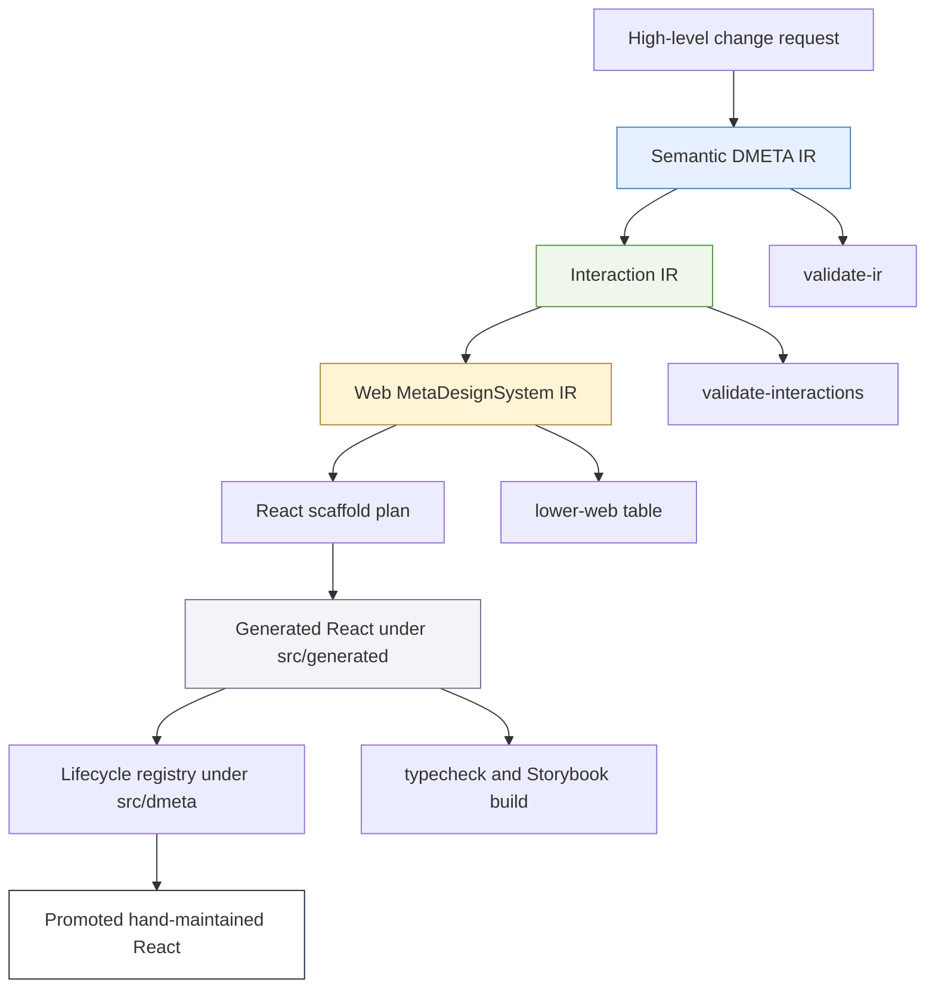

# TTC DMETA React Workflow: Semantic IR to Storybook Garden Assistant

This report explains the work done so far on the Tree Center Garden Assistant DMETA-to-React workflow. It is written as a project report and as a technical article: it records the decisions, the implementation path, the reasoning that led to the current architecture, the validation failures that shaped the result, and the near-term engineering direction. The concrete repository is `/home/manuel/workspaces/2026-05-27/ttc-design-system`.

The project started with a concrete design system prototype for a mobile garden assistant and an evolving toolkit called `dmeta`. The goal was not simply to copy the prototype into React. The goal was to make the prototype participate in a broader design-to-code workflow: high-level semantic YAML should describe domain concepts, interaction YAML should describe modality-neutral user actions and representations, web meta-design-system YAML should describe widget templates and lowering rules, and a React generator should produce traceable scaffolds that can be reviewed, promoted, merged, or regenerated.

> [!summary]
> - The project now has a working TTC DMETA source package at `2026-05-27--ttc-design-system/dmeta-ir/` and a working Storybook app at `2026-05-27--ttc-design-system/web/packages/ttc-garden-assistant/`.
> - Generated React lives in `src/generated/dmeta-widgets/`, while polished hand-maintained UI lives in `src/components/`, `src/pages/`, `src/styles/`, and `src/stories/`.
> - A lifecycle registry in `src/dmeta/` connects generated metadata to promoted hand components, making the generated/manual boundary explicit.
> - The work included generator fixes in the nested `dmeta` repo so generated React compiles cleanly instead of requiring hand-patches.

## Why this report exists

The interesting part of this project is not any one file. The important part is the shape of the workflow. The project is a live case study in how to build a system where design intent can move through several representations before it reaches source code, while still allowing human and LLM judgment at every boundary.

The user described the desired workflow directly. A high-level change should be expressible at an archetype, capability, interaction, or presentation level. That change should lower into a web meta-design-system. The web meta-design-system should lower into React scaffolds. Some of those scaffolds should remain regenerate-only. Some should be generated once and then promoted. Some should be regenerated as sidecars for manual or LLM-assisted merge work. The workflow should support deterministic tools where they exist, but it should not pretend that all lowering is deterministic today.

That last point affected almost every decision. The project is still being shaped from both ends. On one end there is a concrete TTC design in `original/` and a hand-built React Storybook implementation. On the other end there is a formal IR stack under `dmeta-ir/` and Go code that loads, validates, lowers, and generates scaffolds. The current work brings these ends closer together without forcing a false final architecture.

## The current state in one view

The current project has four major source zones.

```text
/home/manuel/workspaces/2026-05-27/ttc-design-system/
├── 2026-05-27--ttc-design-system/
│   ├── dmeta-ir/                         # Project-local TTC DMETA source package
│   ├── web/                              # React/Storybook app
│   ├── original/                         # Source design prototype, currently untracked in root repo
│   └── ttmp/                             # docmgr ticket documentation
├── dmeta/                                # Nested dmeta repo; generator fixes live here
├── 2026-04-23--pyxis/                    # Reference app layout, currently untracked in root repo
└── go.work
```

The commits that define the current checkpoint are:

- root repo `6dc2322` — `Add TTC DMETA React workflow`
- root repo `ef2fb69` — `Diary: record TTC DMETA React workflow`
- root repo `b312a9b` — `Docs: update TTC DMETA task status`
- nested `dmeta` repo `dd839fc` — `Fix React scaffold output for TTC workflow`

Storybook is running in `tmux`:

```text
session: ttc-storybook
url:     http://localhost:6008/
log:     /tmp/ttc-storybook.log
```

The validation commands passed at the current checkpoint:

```bash
cd dmeta

go test ./pkg/dmeta/generator/react ./pkg/dmeta/metadesign/web ./pkg/dmeta/interaction ./pkg/dmeta/validator

go run ./cmd/dmeta validate-ir \
  --root ../2026-05-27--ttc-design-system/dmeta-ir \
  --include-info \
  --output table

go run ./cmd/dmeta validate-interactions \
  --root ../2026-05-27--ttc-design-system/dmeta-ir \
  --include-info \
  --output table

go run ./cmd/dmeta lower-web \
  --root ../2026-05-27--ttc-design-system/dmeta-ir \
  --interactions-root ../2026-05-27--ttc-design-system/dmeta-ir \
  --web-root ../2026-05-27--ttc-design-system/dmeta-ir/meta-design-systems/web \
  --output table
```

```bash
cd 2026-05-27--ttc-design-system/web
pnpm --filter ttc-garden-assistant typecheck
pnpm --filter ttc-garden-assistant build-storybook
```

## The primary design decision

The central decision was to treat the system as a layered workflow with explicit ownership at each layer. The generated code should not replace the hand-authored prototype simply because it exists. The hand-authored prototype should not ignore the IR simply because it is more polished. Both should be connected by a traceable lifecycle mechanism.

The resulting rule is simple:

- **IR files are source.** They describe concepts, interactions, presentations, widget templates, lowering rules, and target generation rules.
- **Generated files are compiler output.** They live under `src/generated/dmeta-widgets/` and can be regenerated.
- **Polished UI files are promoted implementation.** They live under `src/components/`, `src/pages/`, `src/styles/`, and `src/stories/`.
- **The registry is the merge boundary.** `src/dmeta/widgetRegistry.ts` imports generated metadata and describes which generated template corresponds to which promoted component.

This decision avoided two failure modes. The first failure mode would be to over-trust generated scaffolds and lose the visual fidelity of the original design. The second failure mode would be to hand-code the entire app and leave the DMETA pipeline as documentation only. The lifecycle registry creates a third path: generated output remains live and typechecked, while the hand implementation remains the visual source of truth.

## The system architecture

The workflow is a compiler pipeline with reviewable intermediate artifacts. Some transformations are deterministic today. Some are currently manual or LLM-assisted. The important property is that each layer has a file format, validation story, and review boundary.



The current pipeline is implemented across the nested `dmeta` repo and the TTC project directory.

| Layer | Primary files | Current responsibility |
|---|---|---|
| Semantic IR | `2026-05-27--ttc-design-system/dmeta-ir/core-model/*.yaml` | Define TTC domain concepts, capabilities, presentations, actions, and domain examples. |
| Design language IR | `2026-05-27--ttc-design-system/dmeta-ir/02-design-language.yaml` | Define visual design constraints and human-language guidance for generated/polished widgets. |
| Interaction IR | `2026-05-27--ttc-design-system/dmeta-ir/interactions/*.yaml` | Define modality-neutral actions, representations, and elaboration rules. |
| Web MDS IR | `2026-05-27--ttc-design-system/dmeta-ir/meta-design-systems/web/**/*.yaml` | Define web widget templates and lowering rules from interaction obligations. |
| React target | `2026-05-27--ttc-design-system/dmeta-ir/meta-design-systems/web/targets/react.yaml` | Define output directory, file kinds, and React target defaults. |
| Instance | `2026-05-27--ttc-design-system/dmeta-ir/instantiations/ttc-garden-assistant.yaml` | Select which templates become generated React components. |
| Generator | `dmeta/pkg/dmeta/generator/react/*.go` | Plan, render, and write React scaffold files. |
| Generated React | `web/.../src/generated/dmeta-widgets/**` | Regenerable scaffold output and metadata sidecars. |
| Promoted React | `web/.../src/components/**`, `src/pages/**`, `src/styles/**` | Hand-maintained visual implementation. |
| Lifecycle registry | `web/.../src/dmeta/**` | Maps generated templates and metadata to promoted components. |

## Starting point: the concrete design

The concrete design existed before the formal TTC IR. The relevant source design files live under:

```text
2026-05-27--ttc-design-system/original/
```

Important files include:

```text
original/Garden Assistant - Design System.html
original/atoms.jsx
original/molecules.jsx
original/organisms.jsx
original/showcase.jsx
original/data.js
original/icons.jsx
original/tokens.css
```

The existing design already had a useful decomposition. There were atomic controls such as buttons, chips, badges, icons, and section headings. There were molecules such as message rows, product cards, plant list rows, filters, and stat tiles. There were organisms such as quick picks, top matches, watering guide, warning signs, plant pairing reasons, care calendar, upload prompt, and compare teaser. There were full conversation screens showing how those pieces sit inside a mobile Tree Center chat surface.

This concrete design mattered because it prevented the IR work from becoming abstract naming. The YAML was not invented in isolation. It was derived from real UI needs:

- A recommendation answer needs quick picks and product cards.
- A shopping answer needs price, availability, product identity, and cart actions.
- A care answer needs ordered steps and warning signs.
- A plant pairing answer needs explicit reasons.
- A diagnosis answer needs photo upload and symptom evidence.
- A generated plan needs to preserve why each plant belongs in the plan.

The design also established the visual tone: a premium Tree Center mobile commerce surface with navy authority, muted gold expertise, botanical semantic colors, white cards, and mobile chat rhythm. That became the basis for `02-design-language.yaml`.

## Why Pyxis mattered

The user asked for the web layout to follow the Pyxis app shape. The Pyxis reference is located at:

```text
2026-04-23--pyxis/web/packages/pyxis-app/
```

The relevant pattern was not the specific UI. The relevant pattern was the package organization:

```text
web/
  package.json
  pnpm-workspace.yaml
  packages/<app>/
    package.json
    .storybook/
    src/
      App.tsx
      components/
      pages/
      store.ts
      styles/
```

The TTC package now follows that direction:

```text
2026-05-27--ttc-design-system/web/
  package.json
  pnpm-workspace.yaml
  packages/ttc-garden-assistant/
    package.json
    .storybook/
    src/
      App.tsx
      components/
      dmeta/
      domain/
      generated/
      pages/
      stories/
      styles/
      store.ts
```

I did not immediately split every promoted TTC component into separate atom/molecule/organism files. That would be a reasonable next step, but it was not the best first step. The first step was to get Storybook running, keep the polished prototype visible, generate scaffolds, and add lifecycle metadata. The large `GardenAssistant.tsx` file is acceptable during this phase because the registry now gives us a map for future splitting.

## Building the semantic IR

The semantic IR begins with the question: what are the domain objects and what can be known or done with them? For TTC, the core archetypes are:

- `Plant`
- `PlantProduct`
- `GardenSite`
- `PlantRecommendationSet`
- `CarePlan`
- `PlantPairing`
- `DiagnosticObservation`
- `ShoppingPlan`

These are defined in:

```text
2026-05-27--ttc-design-system/dmeta-ir/core-model/archetypes.yaml
```

The important decision was to make TTC concepts domain-specific descendants of base DMETA concepts rather than forcing plant-commerce semantics into the global vocabulary. For example:

- `Plant` extends `Resource`.
- `PlantProduct` extends `Plant` and `ActionSpec`.
- `CarePlan` extends `WorkItem` and `TimelineSpan`.
- `PlantPairing` extends `Relation`.
- `DiagnosticObservation` extends `Annotation` and `Event`.
- `ShoppingPlan` extends `WorkItem`.

That structure matters because it lets TTC remain specific while still benefiting from base DMETA semantics. A `CarePlan` is not just text; it is work over time. A `PlantPairing` is not just a pair of product cards; it is a relation with reasons. A `DiagnosticObservation` is not a diagnosis by default; it is evidence that can be timestamped, related, inspected, and refined.

The capabilities are defined in:

```text
2026-05-27--ttc-design-system/dmeta-ir/core-model/capabilities.yaml
```

The core TTC capabilities are where the UI starts to become operational:

- `site_conditions` describes zone, sun, soil, drainage, location, goals, and constraints.
- `plant_suitability` describes zones, sun, water, mature height, mature width, spacing, maintenance, and fit rationale.
- `care_guidance` describes care steps, watch signs, care months, frequency, and seasonal notes.
- `purchasable` describes product references, product URLs, price, image, liked state, and cart eligibility.
- `availability` describes stock, shipping, seasonal, and substitution state.
- `recommendable` describes rank, score, reason, reason codes, and confidence.
- `pairable` describes paired references, pairing reasons, spacing notes, and style notes.
- `diagnostically_observable` describes symptoms, photo refs, diagnosis summary, confidence, and next question.
- `plan_composable` describes plan role, plan reason, dependencies, and optionality.

The long prose in these YAML files is deliberate. A future generator can use it for metadata and documentation. A future LLM prompt can use it to propose a change. A human reviewer can use it to decide whether a new feature belongs in an existing capability or needs a new one.

## Presentations: the semantic surface layer

Presentations are defined in:

```text
2026-05-27--ttc-design-system/dmeta-ir/core-model/presentations.yaml
```

This file answers a different question from archetypes and capabilities. It does not ask what a thing is or what fields it has. It asks what kind of UI surface can faithfully render it.

Examples:

- `quick_pick_list` represents a short ranked set of recommendations.
- `product_match_grid` represents concrete product cards.
- `active_filter_bar` represents visible site and result constraints.
- `suitability_summary` represents explanation of fit.
- `care_steps` represents ordered care instructions.
- `warning_signs` represents symptoms or watch-for signs.
- `pair_reason_grid` represents explicit plant compatibility reasoning.
- `photo_upload_prompt` represents diagnostic media intake.
- `shopping_plan_summary` represents a generated plan that can become commerce.

This layer matters because it prevents widgets from being chosen only by component names. The React component is an implementation detail. The presentation is the semantic obligation. The web meta-design-system can decide that `quick_pick_list` lowers to `ttc.quick_picks_widget`, while a future voice or CLI target could lower the same representation differently.

A representative presentation has this shape:

```yaml
quick_pick_list:
  description: Short ranked list of easy recommendations inside a chat answer.
  long_description: >
    quick_pick_list is optimized for conversational speed: three to five
    recommendations with image, label, and reason. It is the first helpful
    answer when context is sparse.
  layer: domain
  applies_to:
    archetypes: [PlantRecommendationSet]
    capabilities: [recommendable]
  requires_any:
    - recommendable.reason
    - labelable.label
  optional:
    - plant_suitability.zones
    - purchasable.image_url
  role: ranked_list
  style_recipe: compact_plant_row
  fallbacks: [summary_card]
```

The key fields are not only structural. The `long_description` carries design reasoning. The `requires_any` and `optional` fields explain how strongly a presentation depends on projections. The `style_recipe` links semantic rendering to design-language constraints.

## Interaction IR: modality-neutral behavior

The interaction package lives under:

```text
2026-05-27--ttc-design-system/dmeta-ir/interactions/
```

It contains:

```text
00-index.yaml
actions.yaml
representations.yaml
elaboration-rules.yaml
```

Actions include:

- `set_site_conditions`
- `refine_recommendations`
- `select_recommendation`
- `filter_plants`
- `compare_plants`
- `request_care_guide`
- `refine_care_guide`
- `upload_photo`
- `diagnose_observation`
- `build_plan`
- `add_to_plan`
- `remove_from_plan`
- `add_to_cart`
- `open_product`
- `toggle_like`
- `shop_pair`

Representations include:

- `quick_pick_list`
- `product_match_grid`
- `active_filter_bar`
- `suitability_summary`
- `care_steps`
- `warning_signs`
- `pair_reason_grid`
- `compare_teaser`
- `care_calendar`
- `plant_detail_card`
- `photo_upload_prompt`
- `suggestion_strip`
- `shopping_plan_summary`

The elaboration rules derive obligations from semantic facts. This is the first major deterministic lowering step. The code that applies these rules is in:

```text
dmeta/pkg/dmeta/interaction/elaborate.go
```

The essential algorithm is compact:

```go
for each domainExample in core.DomainExamples:
    for each domainType in domainExample.DomainTypes:
        facts := BuildDomainFacts(domainType, resolvedInheritance)
        for each rule in interaction.Rules:
            if SelectorMatches(rule.When, facts):
                emit each concrete representation in rule.Emits.Representations
                emit each concrete action in rule.Emits.Actions
```

This algorithm is important because it establishes the role of the domain example. The domain example is not only sample data. It is a contract test for the semantic model. It proves that the real application has domain types that can trigger obligations.

For example, this rule:

```yaml
- id: recommendation_set_to_quick_picks
  when:
    all_archetypes: [PlantRecommendationSet]
    all_capabilities: [recommendable]
  emits:
    representations:
      - quick_pick_list
      - active_filter_bar
      - suitability_summary
      - suggestion_strip
    actions:
      - select_recommendation
      - refine_recommendations
      - filter_plants
```

means that a recommendation set is expected to produce more than a list. It should expose current filters, explain suitability, and provide follow-up actions.

## Web MetaDesignSystem lowering

The web meta-design-system lives under:

```text
2026-05-27--ttc-design-system/dmeta-ir/meta-design-systems/web/
```

The important files are:

```text
meta-design-system.yaml
lowering-rules.yaml
widgets/chat.yaml
widgets/recommendations.yaml
widgets/care-and-diagnosis.yaml
widgets/planning-and-shopping.yaml
targets/react.yaml
```

This layer maps interaction obligations to web widget templates. The code path is in:

```text
dmeta/pkg/dmeta/metadesign/web/load.go
dmeta/pkg/dmeta/metadesign/web/validate.go
dmeta/pkg/dmeta/metadesign/web/lower.go
```

The lowering algorithm groups interaction obligations by example and domain type. Then it applies web lowering rules.

```go
for each interactionObligation:
    group by exampleID and domainTypeID
    collect representations and actions

for each group:
    for each webLoweringRule:
        if rule.When.Representations are all present
        and rule.When.Actions are all present:
            emit web widget obligations
```

A rule such as:

```yaml
- id: product_match_grid_to_top_matches_widget
  when:
    representations: [product_match_grid]
    actions: [open_product, toggle_like]
  emits:
    widget_templates: [ttc.top_matches_widget]
    slots:
      - section_title
      - view_all_link
      - product_grid
      - product_card_actions
    visual_states:
      - two_cards
      - many_results
      - liked
      - empty
    event_bindings:
      - open_product
      - toggle_like
      - add_to_plan
      - add_to_cart
```

says that when a product grid and the relevant commerce actions exist, the web target should generate a `TopMatchesWidget` scaffold with specific slots, visual states, and event bindings.

This is where the system becomes visibly useful for React generation. The web lowering output is not yet React code, but it contains the specific component obligations that React generation needs.

## React generation and the first generator fixes

The React generator is under:

```text
dmeta/pkg/dmeta/generator/react/
```

The important files are:

```text
model.go
plan.go
render.go
write.go
```

The command is registered as:

```text
dmeta scaffold-react
```

The command follows this path:

```go
semanticPkg := validator.LoadPackage(ctx, semanticRoot)
resolved := validator.ResolveCoreInheritance(semanticPkg.CoreModel)
interactionPkg := interaction.LoadPackage(ctx, interactionsRoot)
interactionObligations := interaction.ElaborateInteractions(...)
webPkg := webmds.LoadPackage(ctx, webRoot)
webObligations := webmds.Lower(interactionObligations, webPkg)
plan := reactgen.BuildScaffoldPlan(ctx, opts)
files := reactgen.Generate(plan)
reactgen.WriteFiles(files, force, dryRun)
```

The generated output goes to:

```text
2026-05-27--ttc-design-system/web/packages/ttc-garden-assistant/src/generated/dmeta-widgets/
```

Each generated component folder contains:

```text
<Component>.tsx
<Component>.types.ts
<Component>.metadata.json
<Component>.stories.tsx
<Component>.module.css
<Component>.adapter.todo.ts
README.md
index.ts
```

The first generated pass did not compile. That was useful. It showed where the generator had assumptions that were not compatible with the TTC Storybook package.

The first failure was Storybook type imports:

```text
Module '"@storybook/react-vite/*"' has no exported member 'Meta'.
Module '"@storybook/react-vite/*"' has no exported member 'StoryObj'.
```

The fix was in `renderStories`:

```go
import type { Meta, StoryObj } from "@storybook/react";
```

The second failure was generated barrel exports. The generator originally emitted metadata preludes into component `index.ts` barrels and then used wildcard exports. Every generated file exported a `dmetaGeneratedMetadata` constant. When the package-level index re-exported component barrels, TypeScript saw ambiguous metadata exports.

The fix was to make component barrels explicit and to avoid the metadata prelude in barrels:

```go
func renderBarrel(_ ScaffoldPlan, component ComponentPlan, _ PlannedFile) string {
    return fmt.Sprintf(`%sexport { %s } from "./%s";
export type { %sProps, %sSlotName, %sVisualState } from "./%s.types";
`, generatedHeader, component.ComponentName, component.ComponentName, component.ComponentName, component.ComponentName, component.ComponentName, component.ComponentName)
}
```

The third failure involved selected templates that had no lowered visual states. The generator emitted a `never` visual state type but still set `visualState: "default"` in stories. The fix was to make the fallback type include `"default"`:

```go
if len(component.VisualStates) == 0 {
    b.WriteString("  | \"default\"\n")
    b.WriteString(";\n")
}
```

The final cleanup fixed generated metadata double-newlines and trailing whitespace in generated README/adapter files. That mattered because the root repo was committing generated files and `git diff --check` surfaced those issues.

The nested `dmeta` commit for these fixes is:

```text
dd839fc Fix React scaffold output for TTC workflow
```

## The generated/handwritten merge problem

After generation, the repository had two implementations of similar concepts:

- Generated scaffolds under `src/generated/dmeta-widgets/`.
- Polished hand components in `src/components/GardenAssistant.tsx`.

The generated components compile, but they are intentionally generic. They render slots, states, and metadata. They are useful as scaffolds and provenance carriers. They are not visually equivalent to the TTC design.

The hand components are visually useful. They implement the design system: Tree Center header, promo banner, chat chrome, plant rows, product cards, suitability stats, care guide, warning signs, pair reason tiles, calendar, upload prompt, and full conversation stories. They do not by themselves explain which semantic template they implement.

The merge strategy was to introduce an explicit registry:

```text
2026-05-27--ttc-design-system/web/packages/ttc-garden-assistant/src/dmeta/widgetLifecycle.ts
2026-05-27--ttc-design-system/web/packages/ttc-garden-assistant/src/dmeta/widgetRegistry.ts
2026-05-27--ttc-design-system/web/packages/ttc-garden-assistant/src/dmeta/index.ts
```

The registry imports generated metadata sidecars:

```ts
import quickPicksMetadata from '../generated/dmeta-widgets/QuickPicksWidget/QuickPicksWidget.metadata.json';
```

Then it maps generated templates to promoted components:

```ts
{
  templateId: 'ttc.quick_picks_widget',
  generatedComponentName: 'QuickPicksWidget',
  promotedComponentName: 'QuickPicksWidget',
  lifecycle: 'promoted-hand-maintained',
  metadata: quickPicksMetadata,
  notes: 'The current hand widget matches the DMETA quick_pick_list obligation and should be used by the app.',
}
```

This is not a final runtime abstraction. It is a project control surface. It lets Storybook and future tooling answer:

- Which generated template exists?
- Which generated component name did the scaffold use?
- Which hand component is the promoted implementation?
- Is the generated file regenerate-only, a sidecar, an adapter bridge, or a future generated component?
- Which representations and actions does the generated metadata claim to realize?

The Storybook view lives in:

```text
src/stories/DmetaWorkflow.stories.tsx
```

It renders the registry as a table. That table is the first UI-level representation of the lifecycle policy.

## Lifecycle categories

The current lifecycle model is defined in:

```text
src/dmeta/widgetLifecycle.ts
```

The current type is:

```ts
export type DmetaWidgetLifecycle =
  | 'regenerate-only'
  | 'generated-sidecar'
  | 'promoted-hand-maintained'
  | 'adapter-bridge'
  | 'future-generated';
```

These categories exist because generated files do not all have the same ownership.

### Regenerate-only

A regenerate-only file should be overwritten from the generator. Metadata sidecars are the clearest current example. If metadata is wrong, the upstream IR or generator should be fixed. Hand-editing metadata sidecars would corrupt provenance.

### Generated sidecar

A generated sidecar is regenerated for comparison or merge assistance. It remains under `src/generated/`, but a developer may inspect it while editing a hand component. This is useful when the IR changes and the developer needs to see what the generator now thinks the component should expose.

### Promoted hand-maintained

A promoted hand-maintained component is visually and behaviorally owned by source files outside `src/generated/`. Most current TTC widgets are in this category. The generated metadata still records the source template and obligations, but the UI implementation is hand-owned.

### Adapter bridge

An adapter bridge exists when the generated template does not map one-to-one to a hand component. `ChatMessageRow` is the example. The generated template says there is a chat message row. The hand implementation splits this into `UserMessageRow` and `BotMessageRow`.

### Future generated

A future generated component exists as a scaffold but does not yet have a polished promoted implementation. `ShoppingPlanSummaryWidget` is currently the best example. It should be the next component to promote manually.

## The web package after the merge layer

The TTC web package now has this important structure:

```text
src/
  App.tsx
  components/
    GardenAssistant.tsx
    index.ts
    parts.ts
  dmeta/
    index.ts
    widgetLifecycle.ts
    widgetRegistry.ts
  domain/
    fixtures.ts
  generated/
    dmeta-widgets/
      QuickPicksWidget/
      TopMatchesWidget/
      ...
  pages/
    GardenAssistantPage/
      Page.tsx
      Page.css
      Page.stories.tsx
      index.ts
    index.ts
  stories/
    GardenAssistant.stories.tsx
    DmetaWorkflow.stories.tsx
  styles/
    app-tokens.css
    global.css
```

`App.tsx` now renders the page layer:

```tsx
import { GardenAssistantPage } from './pages';
import './styles/app-tokens.css';
import './styles/global.css';

export function App() {
  return <GardenAssistantPage scenario="quick-picks" />;
}
```

The page layer is in:

```text
src/pages/GardenAssistantPage/Page.tsx
```

It provides named scenarios:

- `quick-picks`
- `top-matches`
- `watering`
- `pairing`
- `generative-mix`
- `full-demo`

This was not only a cosmetic change. It moved the app toward a Pyxis-like page structure while preserving the existing component implementation. It gives future work a stable place to add routing, state selection, or assistant response adapters without turning `App.tsx` into a scenario switchboard.

## The documentation work

The project now has an intern-facing architecture guide in the docmgr ticket:

```text
2026-05-27--ttc-design-system/ttmp/2026/05/27/TTC-DMETA-CHATBOT--dmeta-toolkit-plan-for-the-tree-center-chatbot/design-doc/02-dmeta-to-react-workflow-architecture-and-implementation-guide.md
```

That guide was uploaded to reMarkable as:

```text
/ai/2026/05/27/TTC-DMETA-CHATBOT/TTC DMETA React Workflow Guide.pdf
```

The guide explains:

- the layered workflow;
- semantic IR;
- interaction IR;
- web meta-design-system IR;
- React target and instance manifest;
- generated file lifecycle;
- generated vs hand-maintained file ownership;
- commands for validation and regeneration;
- current failures and fixes;
- future lifecycle-aware generator work.

The diary was also backfilled:

```text
2026-05-27--ttc-design-system/ttmp/2026/05/27/TTC-DMETA-CHATBOT--dmeta-toolkit-plan-for-the-tree-center-chatbot/reference/01-investigation-diary.md
```

The diary now records Step 5, including the generator failures, the move of `dmeta-ir`, validation commands, reMarkable upload, and commit hashes.

## The thinking process behind the major decisions

### Why not replace the hand UI with generated UI?

The generated UI is not meant to be the final design at this stage. It renders semantic scaffolds: slots, states, metadata, and event binding placeholders. The hand UI already encodes visual decisions from the TTC prototype. Replacing it would reduce quality and erase the fastest path to visual review.

The generated output still matters. It proves that the IR can lower into concrete React artifacts. It exposes generator assumptions. It creates metadata sidecars. It lets typecheck and Storybook validate the pipeline. It gives future LLM-assisted merge work a concrete artifact to compare against.

The chosen strategy is therefore not replacement. It is coexistence with explicit lifecycle metadata.

### Why move `dmeta-ir` into the project directory?

The TTC IR started as a proposed package and briefly lived in an example-like context. The user then clarified that these were real working files and could move into the top directory of `2026-05-27--ttc-design-system/`. That was the right direction because the IR now describes this project, not a reusable generic example.

The move also made output paths cleaner. The instance manifest now points from project-local IR to project-local web output. The project can be understood by starting under `2026-05-27--ttc-design-system/` without first entering the nested `dmeta/examples/` tree.

### Why fix the generator immediately?

Generated code failed typecheck. There were two possible responses:

1. Patch generated files until the project compiles.
2. Fix the generator and regenerate.

The second response was necessary. If generated files are patched, the pipeline becomes untrustworthy. The next regeneration would reintroduce the same errors. Because this project is explicitly about a repeatable YAML-to-React workflow, generator correctness matters even while the generator is still primitive.

The generator fixes were small but important. They turned a scaffold that only existed as files into a scaffold that participates in the web package’s normal validation path.

### Why keep `GardenAssistant.tsx` large for now?

A fully modular component structure is likely the eventual shape. The current file contains atoms, molecules, organisms, templates, and screen-level compositions. Splitting it now would be possible, but it would introduce many file moves while the bigger design question is still lifecycle ownership.

The page layer and lifecycle registry solve more urgent problems:

- `App.tsx` no longer duplicates a conversation.
- Storybook has a page-level scenario surface.
- Generated metadata is connected to promoted components.
- The next promotion target is visible.

A component split should happen when we promote or refactor one component family at a time. For example, `ShoppingPlanSummaryWidget` can become a new hand component file when it is promoted. Later, the existing `QuickPicksWidget`, `TopMatchesWidget`, and related primitives can be split with less risk because the lifecycle registry will show their semantic relationships.

### Why write verbose YAML?

The user explicitly wanted the YAML to contain human language comparable to the Street Deli example. That changed the role of YAML from machine-only configuration to durable design source. The YAML now carries reasons, boundaries, examples, validation intent, and UI implications.

This matters for LLM-assisted workflows. A future prompt can include `capabilities.yaml` or `presentations.yaml` and ask for a new feature. If the YAML only had identifiers and projection types, the model would not know the design intent. With long descriptions, it can reason about whether a feature belongs under `care_guidance`, `diagnostically_observable`, `site_conditions`, or a new capability.

It also matters for human onboarding. An intern can read `PlantPairing.long_description` and understand why pair suggestions must show reasons. They do not have to infer that from a React component named `WhyPairWidget`.

## Validation as design feedback

Validation was not a final step. It shaped the implementation.

The DMETA validators require artifact identity, schema versions, known references, known presentations, known actions, known inheritance, and consistent widget templates. Early validation issues exposed missing or mismatched references. The most useful example was `action_group`: the semantic package initially referenced `action_group` as a presentation fallback, but it was not defined. The fix was to use `suggestion_action_strip` or `summary_card` instead of leaving an unresolved concept.

The TypeScript validator exposed generator defects. The errors were not treated as incidental. They revealed incorrect assumptions about Storybook imports, barrel exports, and default state types.

This is the desired workflow. Validators are not only compliance checks. They are design feedback tools. They force vague or inconsistent ideas to become explicit.

## Commands as a repeatable working loop

The current working loop is:

```bash
# 1. Validate project-local semantic IR.
cd dmeta
go run ./cmd/dmeta validate-ir \
  --root ../2026-05-27--ttc-design-system/dmeta-ir \
  --include-info \
  --output table

# 2. Validate project-local interaction IR.
go run ./cmd/dmeta validate-interactions \
  --root ../2026-05-27--ttc-design-system/dmeta-ir \
  --include-info \
  --output table

# 3. Inspect web obligations.
go run ./cmd/dmeta lower-web \
  --root ../2026-05-27--ttc-design-system/dmeta-ir \
  --interactions-root ../2026-05-27--ttc-design-system/dmeta-ir \
  --web-root ../2026-05-27--ttc-design-system/dmeta-ir/meta-design-systems/web \
  --output table

# 4. Regenerate React scaffolds.
go run ./cmd/dmeta scaffold-react \
  --instance ../2026-05-27--ttc-design-system/dmeta-ir/instantiations/ttc-garden-assistant.yaml \
  --force \
  --output table

# 5. Validate shared generator packages.
go test ./pkg/dmeta/generator/react ./pkg/dmeta/metadesign/web ./pkg/dmeta/interaction ./pkg/dmeta/validator

# 6. Validate web output.
cd ../2026-05-27--ttc-design-system/web
pnpm --filter ttc-garden-assistant typecheck
pnpm --filter ttc-garden-assistant build-storybook
```

A future script or `make` target should encode this loop. For now, keeping it explicit helps interns understand which stage failed.

## The current Storybook surface

Storybook now has several categories of stories:

- Hand-authored design-system stories in `GardenAssistant.stories.tsx`.
- Page-level scenario stories in `pages/GardenAssistantPage/Page.stories.tsx`.
- Generated scaffold stories under `src/generated/dmeta-widgets/**`.
- Workflow/lifecycle registry story in `DmetaWorkflow.stories.tsx`.

This is useful because it shows the project from multiple angles:

- The polished stories show what the TTC experience should look like.
- The generated stories show what the generator currently emits.
- The lifecycle story shows how these two worlds are connected.

That last story is especially important. It makes the workflow visible inside the product’s frontend tool, not only in prose documentation.

## Important file references

The most important files for continuing the work are:

```text
# Project-local IR
2026-05-27--ttc-design-system/dmeta-ir/01-core-model.yaml
2026-05-27--ttc-design-system/dmeta-ir/02-design-language.yaml
2026-05-27--ttc-design-system/dmeta-ir/core-model/archetypes.yaml
2026-05-27--ttc-design-system/dmeta-ir/core-model/capabilities.yaml
2026-05-27--ttc-design-system/dmeta-ir/core-model/presentations.yaml
2026-05-27--ttc-design-system/dmeta-ir/interactions/actions.yaml
2026-05-27--ttc-design-system/dmeta-ir/interactions/representations.yaml
2026-05-27--ttc-design-system/dmeta-ir/interactions/elaboration-rules.yaml
2026-05-27--ttc-design-system/dmeta-ir/meta-design-systems/web/lowering-rules.yaml
2026-05-27--ttc-design-system/dmeta-ir/meta-design-systems/web/widgets/recommendations.yaml
2026-05-27--ttc-design-system/dmeta-ir/meta-design-systems/web/widgets/care-and-diagnosis.yaml
2026-05-27--ttc-design-system/dmeta-ir/meta-design-systems/web/widgets/planning-and-shopping.yaml
2026-05-27--ttc-design-system/dmeta-ir/instantiations/ttc-garden-assistant.yaml

# Generator code
 dmeta/pkg/dmeta/generator/react/plan.go
 dmeta/pkg/dmeta/generator/react/render.go
 dmeta/pkg/dmeta/generator/react/write.go
 dmeta/pkg/dmeta/metadesign/web/lower.go
 dmeta/pkg/dmeta/interaction/elaborate.go

# TTC web code
2026-05-27--ttc-design-system/web/packages/ttc-garden-assistant/src/components/GardenAssistant.tsx
2026-05-27--ttc-design-system/web/packages/ttc-garden-assistant/src/pages/GardenAssistantPage/Page.tsx
2026-05-27--ttc-design-system/web/packages/ttc-garden-assistant/src/dmeta/widgetRegistry.ts
2026-05-27--ttc-design-system/web/packages/ttc-garden-assistant/src/stories/DmetaWorkflow.stories.tsx
2026-05-27--ttc-design-system/web/packages/ttc-garden-assistant/src/generated/dmeta-widgets/
```

## What remains unfinished

The next substantial work is not another generic scaffold pass. The next work should exercise the lifecycle model.

### 1. Promote `ShoppingPlanSummaryWidget`

`ShoppingPlanSummaryWidget` exists only as generated/future output. It is the right next target because the current hand UI has a generative mix screen but not a polished plan summary component. Promoting it would test the workflow end to end:

1. Read generated scaffold and metadata.
2. Design the hand component using TTC primitives.
3. Add fixtures.
4. Add Storybook stories.
5. Update `widgetRegistry.ts` from `future-generated` to `promoted-hand-maintained`.
6. Keep generated files as sidecars.
7. Validate typecheck and Storybook.

This would be the first full proof that generated scaffolds can lead to polished components without losing provenance.

### 2. Add lifecycle policy to YAML and generator behavior

The lifecycle categories currently live in TypeScript. They should eventually live in the React target or instance manifest. A possible YAML shape:

```yaml
outputs:
  component:
    lifecycle: scaffold_once
    promotion_path: src/components/widgets/ShoppingPlanSummaryWidget.tsx
  metadata:
    lifecycle: regenerate_only
  stories:
    lifecycle: sidecar_for_merge
  adapter_todo:
    lifecycle: scaffold_once
```

The generator could then enforce behavior:

```go
switch output.Lifecycle {
case RegenerateOnly:
    overwriteWhenForce()
case ScaffoldOnce:
    writeOnlyIfMissing()
case SidecarForMerge:
    writeToGeneratedSidecar()
case PromotedHandMaintained:
    neverOverwritePromotedPath()
}
```

This would move lifecycle out of convention and into tooling.

### 3. Define assistant response and catalog adapter contracts

The remaining ticket task is backend assistant response and product/catalog API contracts. This matters because the current UI uses static fixtures. The real system needs adapters that map assistant/catalog payloads into DMETA-informed view models.

A future contract might distinguish:

- assistant turn envelope;
- semantic objects emitted by the assistant;
- product/catalog records;
- generated presentation obligations;
- UI view models;
- action callbacks.

The adapter boundary should probably be explicit and testable. Generated `.adapter.todo.ts` files are a starting point, but they are not yet real adapters.

### 4. Split promoted components when promotion pressure increases

`GardenAssistant.tsx` can remain large for now, but promotion work will become easier if widgets move into individual files. A likely future layout:

```text
src/components/
  atoms/
  molecules/
  widgets/
    QuickPicksWidget/
    TopMatchesWidget/
    WateringGuideWidget/
    ShoppingPlanSummaryWidget/
  chrome/
  icons/
```

The split should be driven by actual lifecycle needs, not by a desire for neatness alone. Splitting before the registry existed would have created movement without ownership clarity. Splitting after the registry can preserve semantic provenance.

## Working rules for the next phase

The next contributor should follow these rules:

- Do not hand-edit generated files unless the goal is a temporary experiment. If generated output is wrong, fix YAML or the generator.
- Do not promote a generated component without updating `src/dmeta/widgetRegistry.ts`.
- Do not add a new widget directly in React if it represents a new semantic presentation. Add or update the IR first.
- Do not add add-to-cart behavior to a generic `Plant`; require `PlantProduct` and `purchasable` semantics.
- Do not show plant pairings without explicit pair reasons.
- Do not let Storybook be only visual. Keep the workflow/lifecycle Storybook surface alive because it teaches the pipeline.
- Keep docs and diary updated when pipeline boundaries change.

## A concrete next implementation sequence

If I were continuing immediately, I would implement the next phase in this order:

1. Add a small lifecycle policy block to `dmeta-ir/meta-design-systems/web/targets/react.yaml` or the instance manifest.
2. Extend `reactgen.TargetFile` or `instance.Selected` to parse lifecycle policy.
3. Add a `Lifecycle` field to planned files in `dmeta/pkg/dmeta/generator/react/model.go`.
4. Update `WriteFiles` to respect regenerate-only/scaffold-once/sidecar behavior.
5. Add a dry-run output column showing lifecycle.
6. Regenerate and confirm output is unchanged except metadata or lifecycle annotations.
7. Promote `ShoppingPlanSummaryWidget` into hand code.
8. Update the registry and Storybook table.
9. Add assistant/catalog adapter contract docs and initial TypeScript types.
10. Commit the dmeta generator change separately from the TTC web promotion.

This sequence keeps the system stable while deepening the workflow. It avoids jumping straight into a large visual refactor before the generator can express ownership.

## Closing assessment

The project is now past the first threshold. It is no longer only a hand-coded Storybook prototype, and it is no longer only a set of proposed YAML files. It has a project-local DMETA IR package, a validating lowering pipeline, generated React scaffolds, a hand-maintained TTC Storybook app, a lifecycle registry connecting generated metadata to promoted components, and a detailed intern guide in the ticket.

The remaining work is to make the lifecycle policy more formal and to prove promotion on a real component that does not yet have polished hand UI. `ShoppingPlanSummaryWidget` is the right candidate. After that, the project can begin to treat high-level semantic changes as practical inputs to the application, not only documentation.

The strongest result so far is the boundary discipline. Generated files compile and stay under `src/generated/`. Hand UI remains visually strong and stays outside generated output. Metadata sidecars cross the boundary. Storybook exposes the boundary. The docs explain the boundary. That gives the project a workable foundation for deterministic, manual, and LLM-assisted lowering phases to coexist without confusing ownership.
