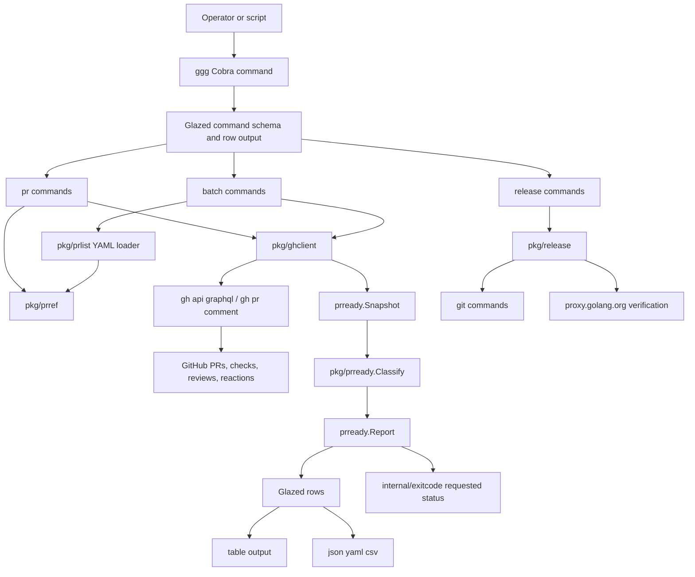

# `ggg`: Codex-aware release tooling for Go-Go-Golems

`ggg` is the first Go implementation of the release and pull-request management rules that were previously encoded in shell scripts, Python scripts, Makefile targets, and operator memory. It lives in `/home/manuel/code/wesen/go-go-golems/infra-tooling`, and its first implementation ticket was `INFRA-001 — Design go-go-golems open-source management CLI`.

This article explains how `ggg` works, why it was built, what we learned while testing it against real GitHub pull requests, and which design details are worth preserving. The focus is not only the command surface. The important part is the model behind the commands: PR readiness is a state machine, Codex review is an asynchronous signal source, release tagging is a mutating operation that needs guardrails, and release trains require machine-readable state rather than ad-hoc terminal text.

> [!summary]
> - `ggg` replaces the go-go-golems PR readiness scripts with a typed Go CLI built on Cobra, Glazed, `gh`, and focused packages such as `prready`, `prlist`, `prref`, `ghclient`, and `release`.
> - The central abstraction is a `prready.Snapshot`: checks, Codex signals, review comments, reactions, commit identity, and truncation metadata are collected first, then classified by a deterministic state machine.
> - Live test PRs proved three critical states: ready, failed checks, and current-head Codex feedback. Those live cases were then reduced to durable `pkg/prready/testdata` fixtures.
> - The most important operational lesson is that structured rows and exact exit codes must coexist. Operators need readable output; scripts need stable process status.
> - The next work should add raw GraphQL decoding fixtures, batch aggregation tests, temporary-git-repo release tests, and release-train orchestration commands.

## 1. Why `ggg` exists

The go-go-golems repositories are not maintained as isolated projects. A change in one module can require coordinated pull requests, releases, dependency bumps, and validation across several repositories. During the xgoja runtime API rollout, `go-go-goja` had to be released first, then downstream repositories such as `geppetto`, `pinocchio`, `discord-bot`, `go-minitrace`, `loupedeck`, `workspace-manager`, `goja-git`, and `css-visual-diff` had to adopt the new API and validate against published module versions.

The workflow already had automation before `ggg`. The reusable scripts lived under:

```text
/home/manuel/code/wesen/go-go-golems/infra-tooling/scripts/go-go-golems/
```

The important scripts were:

| Script | Role |
| --- | --- |
| `00-pr-ready-check.sh` | Bash entry point for one PR readiness check. |
| `01-pr-ready-check.py` | Python implementation of GitHub GraphQL readiness logic. |
| `02-trigger-codex-review.sh` | Posts `@codex review`. |
| `03-watch-codex-reactions.py` | Watches Codex reaction transitions. |
| `04-wait-pr-ready.sh` | Polls one PR until ready, timeout, failed checks, or Codex feedback. |
| `05-batch-pr-ready.sh` | Checks or watches many PRs and returns release-train-specific exit codes. |
| `06-batch-trigger-codex-review.sh` | Triggers Codex for every PR in a text file. |

Those scripts were useful because they encoded actual operating policy. They also had three limits.

First, their data model was implicit. `01-pr-ready-check.py` could decide whether a PR was ready, but a future command could not import a typed readiness model. The policy was inside script control flow.

Second, the scripts evolved around newline text files and human-readable output. That is workable for a one-off release train, but it becomes brittle when a batch needs metadata, structured output, or row-level post-processing.

Third, release operations need more guardrails than shell snippets usually provide. Tagging a repository, pushing a tag, and waiting for Go proxy visibility are mutating actions. They need dry-run rows, explicit confirmation, dirty-worktree checks, exact target commits, tag collision detection, and narrow pushes.

`ggg` exists to make those policies explicit and reusable. It is not a replacement for engineering judgment. It is a typed command layer around the operations that should not depend on memory or fragile terminal greps.

## 2. The first implementation boundary

The first `ggg` implementation did not try to automate the entire release train. It built the reusable core that later release-train orchestration can call.

The implemented commands are:

```text
ggg pr codex-trigger
ggg pr ready
ggg pr codex-comments
ggg batch ready
ggg release tag-patch
ggg release tag-minor
ggg release tag-major
```

The corresponding source layout is:

```text
infra-tooling/
  cmd/ggg/main.go
  internal/cli/root.go
  internal/cli/pr/root.go
  internal/cli/pr/ready.go
  internal/cli/pr/codex_trigger.go
  internal/cli/pr/codex_comments.go
  internal/cli/batch/ready.go
  internal/cli/release/tag.go
  internal/exitcode/exitcode.go
  pkg/prref/prref.go
  pkg/prlist/prlist.go
  pkg/prready/prready.go
  pkg/prready/codex_helpers.go
  pkg/ghclient/readiness.go
  pkg/release/release.go
```

The package boundaries are the important part:

| Package | Responsibility |
| --- | --- |
| `pkg/prref` | Parse PR references from URLs and `owner/repo#number` syntax. |
| `pkg/prlist` | Load YAML PR lists. |
| `pkg/ghclient` | Shell out to `gh` for GraphQL snapshots and mutating PR comments. |
| `pkg/prready` | Classify snapshots into readiness states. |
| `internal/cli/pr` | Expose PR commands as Glazed commands. |
| `internal/cli/batch` | Expose batch readiness and watch semantics. |
| `internal/cli/release` | Expose tag patch/minor/major commands. |
| `pkg/release` | Compute, create, push, and verify Go module release tags. |
| `internal/exitcode` | Preserve script-compatible exit status after row emission. |

The implementation deliberately uses `gh` as the GitHub transport. That preserves compatibility with the operator's existing authentication and keeps token handling outside the first implementation. The tradeoff is that `ghclient` is a shell-backed client rather than a pure Go GitHub client. That is acceptable for this phase because the higher-value work was to move the state model and command interface into Go.

## 3. The command interface

`ggg` uses Cobra for the command tree and Glazed for command schemas and row output. The default output is a concise table. Structured output comes from standard Glazed flags:

```bash
ggg pr ready https://github.com/go-go-golems/discord-bot/pull/9 --output json
ggg batch ready /tmp/prs.yaml --output yaml
ggg pr codex-comments https://github.com/go-go-golems/discord-bot/pull/9 --output csv
```

The root also keeps a compatibility flag:

```text
--with-structured-output
```

That flag exists because the design discussion included an explicit structured-output switch. In practice, Glazed already provides the real output selection through `--output json`, `--output yaml`, `--output csv`, and related flags. The compatibility flag is therefore a signal to older scripts or operators, not the mechanism that controls serialization.

The PR list input changed from newline text to YAML:

```yaml
prs:
  - https://github.com/go-go-golems/discord-bot/pull/9
  - repo: go-go-golems/goja-git
    number: 2
  - ref: go-go-golems/go-minitrace#11
```

This was a small design change with a large consequence. A newline file can hold only references unless conventions are added on top. A YAML object can later add expected dependency, release-train stage, validation profile, owner, priority, notes, or timeout policy without changing the file format.

## 4. Readiness is a state machine

The main concept in `ggg` is not a command. It is the readiness state machine in `pkg/prready`.

A PR is represented first as a snapshot:

```go
type Snapshot struct {
    PR                prref.Ref
    URL               string
    MergeStateStatus  string
    ReviewDecision    string
    HeadRefOID        string
    Checks            []Check
    Signals           []CodexSignal
    ReviewsTruncated  bool
    CommentsTruncated bool
}
```

The snapshot separates data collection from policy. `ghclient.Snapshot` queries GitHub and decodes checks, comments, reviews, reactions, inline review comments, and pagination metadata. `prready.Classify` decides what that data means.

That separation matters because it creates a stable test boundary. A fixture can construct a `Snapshot` directly without calling GitHub. The classifier can be tested with local JSON. Later, raw GraphQL decode tests can be added under `ghclient` without changing the readiness state machine.

The current states are:

| State | Meaning | Terminal |
| --- | --- | --- |
| `ready` | Checks and Codex gates are satisfied. | Yes |
| `waiting_checks` | Checks exist but at least one is still pending. | No |
| `waiting_codex` | Checks may be fine, but Codex is still running or not satisfied. | No |
| `no_codex` | No Codex-authored review/comment or trigger signal exists. | No |
| `failed_checks` | At least one check/status failed. | Yes |
| `codex_feedback` | Current-head Codex feedback exists or comments are truncated. | Yes |
| `not_ready` | Fallback state for non-ready conditions not classified above. | No |

A state is terminal when waiting is not enough. Failed checks require a code or workflow change. Current-head Codex feedback requires reading and addressing the feedback. A waiting state may become ready as GitHub Actions or Codex complete.

The classifier follows this outline:

```go
func Classify(snapshot Snapshot) Report {
    findings := checkFindings(snapshot.Checks)
    findings = append(findings, codexFindings(snapshot)...)

    if every finding is OK {
        return ready
    }
    if any finding says current-head Codex comments or substantive body exist {
        return codex_feedback
    }
    if any finding says failing/non-success checks exist {
        return failed_checks
    }
    if any finding says checks are pending {
        return waiting_checks
    }
    if no Codex signal exists {
        return no_codex
    }
    if Codex has EYES or no satisfied signal {
        return waiting_codex
    }
    return not_ready
}
```

The classifier produces findings as well as the final state. That is important for operator trust. A state such as `codex_feedback` is useful, but a finding that includes `scripts/go-go-golems/99-infra001-dangerous-example.py:12` is what lets the operator act.

## 5. Checks are not one kind of object

GitHub exposes two check-like objects through the readiness query: `CheckRun` and `StatusContext`. `CheckRun` has `status` and `conclusion`. `StatusContext` has `state`. A readiness tool that only handles GitHub Actions check runs can miss legacy statuses and synthetic statuses.

`ggg` handles both:

```go
type Check struct {
    Name       string
    Kind       string
    Status     string
    Conclusion string
    State      string
    URL        string
}
```

The rules are direct:

- A `CheckRun` is acceptable only when `status == COMPLETED` and the conclusion is `SUCCESS`, `SKIPPED`, or `NEUTRAL`.
- A `StatusContext` is acceptable only when `state == SUCCESS`.
- Missing checks are not ready because there is no evidence that CI ran.

The live tests proved why `StatusContext` support matters. The infra-tooling repository did not report normal Actions checks for the test branches, so synthetic commit statuses were posted to the test PR heads. Those statuses were enough to validate the classifier's success and failure paths.

The first implementation contained a subtle bug in check-kind reporting. It scanned every failed finding and looked for words such as `test` or `lint`. One Codex message contained the word `latest`, which includes `test`. That caused an incorrect `test` failed-check kind. The fix was to derive failed check kinds only from findings that explicitly begin with check-related messages such as `failing/non-success checks:`.

That bug is a useful lesson: classification labels should be derived from structured data or tightly scoped messages, not from broad substring scans across unrelated findings.

## 6. Codex review is several GitHub signals

Codex state is not stored in one GitHub field. `ggg` combines several pieces of evidence:

- Codex-authored PR reviews.
- Codex-authored PR comments.
- Human `@codex review` trigger comments.
- `EYES` reactions on trigger comments or reviews.
- `THUMBS_UP` reactions on trigger comments or reviews.
- Codex-authored review bodies.
- Inline review comments attached to Codex reviews.
- Reviewed commit markers embedded in Codex body text.

The current GraphQL query in `pkg/ghclient/readiness.go` reads the PR head SHA, status rollup, reviews, review comments, issue comments, reaction groups, and pagination flags. The decoded `CodexSignal` type is:

```go
type CodexSignal struct {
    Kind              string
    Author            string
    URL               string
    Time              string
    Body              string
    CodexAuthored     bool
    Eyes              int
    ThumbsUp          int
    Comments          []ReviewComment
    CommentsTruncated bool
}
```

A human trigger is a Codex signal when its body is exactly `@codex review`. It is not Codex-authored, but it can carry the `EYES` reaction that indicates a review is running. This was learned from actual GitHub behavior: the running state may be visible on the human trigger comment before a Codex-authored review exists.

A Codex-authored review is stronger evidence. It can contain a satisfied body, a substantive body, inline comments, or a reviewed commit marker. The readiness classifier keeps two concepts separate:

1. the latest overall Codex signal;
2. the latest Codex-authored signal.

That separation prevents a dangerous false ready state. A newer human `@codex review` trigger must not hide older current-head Codex review comments. If Codex has already left actionable feedback on the current head, a new trigger comment does not make that feedback go away.

## 7. Current-head feedback and stale feedback

Codex often includes a reviewed commit marker in the review body:

```text
Reviewed commit:** `f334ee7ec3`
```

`ggg` compares that marker against the current PR head SHA. If the reviewed commit is not a prefix of the current head, the feedback is stale. Stale feedback is recorded as evidence but does not block the current head. If the reviewed commit matches the current head, inline comments or substantive body text block readiness.

The logic can be described as:

```go
latestAuthored := latest Codex-authored signal
reviewed := ReviewedCommit(latestAuthored.Body)

if reviewed != "" && !strings.HasPrefix(headSHA, reviewed) {
    finding OK: latest Codex-authored findings are stale
} else if latestAuthored.CommentsTruncated {
    finding FAIL: comments are truncated
} else if len(latestAuthored.Comments) > 0 {
    finding FAIL: current-head inline review comments exist
} else if !BodyIsBenign(latestAuthored.Body) {
    finding FAIL: current-head substantive body exists
} else {
    finding OK: Codex body is benign/satisfied
}
```

This was one of the most important lessons from the XGOJA release train. Without the stale/current distinction, the tool can fail in two directions:

- It can block a fixed PR because Codex feedback belongs to an older commit.
- It can permit a PR because a newer human trigger comment appears after current-head Codex feedback.

Both failures are operationally serious. The first slows a release train. The second can merge code with unresolved review comments.

## 8. Truncation must be visible

GitHub GraphQL connections are paginated. The first `ggg` implementation does not yet fetch every page. It reads up to 100 reviews, 100 PR comments, and 100 inline comments per review. Rather than hiding that limit, the snapshot records truncation:

```go
Snapshot.ReviewsTruncated
Snapshot.CommentsTruncated
CodexSignal.CommentsTruncated
```

The policy is conservative for current-head Codex review comments. If the latest current-head Codex-authored review has truncated inline comments, readiness becomes `codex_feedback`. The message tells the operator to inspect manually or rerun after pagination support exists.

This decision is worth preserving. A readiness tool is a merge gate. When it has incomplete evidence about current-head review comments, it should not silently return ready.

## 9. Triggering Codex is mutating

`ggg pr codex-trigger` posts the standard comment:

```text
@codex review
```

That operation mutates a PR. The command therefore has safety behavior by default:

- It skips when the latest signal has `EYES`, because Codex may already be running.
- It skips when current-head Codex feedback exists, because feedback should be addressed before retriggering.
- It skips when a recent human `@codex review` trigger exists, because duplicate trigger spam makes history harder to read.
- It supports `--dry-run` so the operator can inspect the planned action.
- It supports `--force` when the operator intentionally wants to override the guards.

The skip ordering is:

```text
--dry-run                  -> would_trigger
running EYES               -> skipped_running
current-head feedback      -> skipped_current_feedback
recent trigger             -> skipped_recent_trigger
otherwise                  -> triggered
```

The command emits one row per PR. A dry-run row includes fields such as `action`, `codex_running`, `current_feedback`, `recent_trigger`, `trigger_age_seconds`, `eyes`, `thumbs_up`, `signal_url`, and `trigger_url`. This is more useful than printing only whether a comment was posted, because it records why the command did or did not mutate GitHub.

## 10. Batch readiness is release-train control flow

`ggg batch ready` is the Go replacement for `05-batch-pr-ready.sh`. It reads the YAML PR list, checks every PR, emits one row per PR, and emits a summary row.

The summary state is computed from all PR states:

```go
if notReady == 0      -> ready
if errors > 0         -> error
if codexFeedback > 0  -> codex_feedback
if failedChecks > 0   -> failed_checks
if ready > 0          -> partial_ready
otherwise             -> waiting
```

The exit code is then derived from the summary:

| Code | Batch state | Meaning |
| --- | --- | --- |
| `0` | `ready` | Every PR is ready. |
| `1` | `waiting` | Nothing is ready or terminal yet. |
| `2` | `error` | Tool/API error. |
| `3` | `codex_feedback` | At least one PR has actionable Codex feedback. |
| `4` | `failed_checks` | At least one PR has failed checks. |
| `5` | `partial_ready` | At least one PR is ready while others still wait. |

The `partial_ready` state is specific to release trains. If a batch contains ten PRs and one dependency-order PR is ready, the operator should often merge and release that PR before waiting on leaf repositories. Continuing to sleep until every PR changes state would hide actionable progress.

Watch mode repeats only while the summary stays in a waiting state:

```bash
ggg batch ready prs.yaml --watch --interval-seconds 30 --timeout-seconds 1800
```

It stops on ready, error, Codex feedback, failed checks, or partial readiness. This behavior encodes the operator workflow: wait only when waiting can produce new useful information without human intervention.

## 11. Structured rows and exact exit codes must coexist

The shell scripts used process exit codes as control flow. A script could call a readiness checker and branch on `$?`. A Glazed command emits structured rows through a processor. Those two needs can conflict if the command returns an error after adding rows: framework layers may print error messages, wrap errors, or normalize exit status.

The first `ggg` exit-code implementation used a typed `exitcode.Error`. It worked in simple cases, but live binary testing showed that `ggg batch ready` still exited `1` instead of the intended state-specific code. The fix was to separate row emission from process status.

The final mechanism is:

```go
// command code
if !report.OK {
    exitcode.Request(exitCodeForState(report.State))
}
return nil

// main.go
after root.Execute():
    if code := exitcode.Requested(); code != 0 {
        os.Exit(code)
    }
```

This lets the command emit rows successfully and lets `main` exit with the requested compatibility code after Glazed and Cobra finish. The built binary was then tested directly:

```bash
go build -o /tmp/ggg ./cmd/ggg
/tmp/ggg pr ready https://github.com/go-go-golems/infra-tooling/pull/5 --output json  # 0
/tmp/ggg pr ready https://github.com/go-go-golems/infra-tooling/pull/6 --output json  # 4
/tmp/ggg pr ready https://github.com/go-go-golems/infra-tooling/pull/7 --output json  # 3
/tmp/ggg batch ready ttmp/.../scripts/02-readiness-test-prs.yaml --output json       # 3
```

The important testing detail is that exact exit codes must be checked with a built binary. `go run` wraps non-zero program exits and reports its own failure status.

## 12. Release tagging needs guardrails

The initial `ggg release` commands implement patch, minor, and major tag publication:

```bash
ggg release tag-patch --repo . --dry-run
ggg release tag-minor --repo . --dry-run
ggg release tag-major --repo . --dry-run
```

The release code shells out to Git and existing tools, but it centralizes the safety checks:

- The command detects the Go module path from `go.mod`.
- It fetches `origin/main` and tags.
- It computes the next patch/minor/major tag.
- It refuses dirty repositories unless `--allow-dirty` is set.
- It supports `--from` and `--commit` so the tag target is explicit.
- It requires `--yes` for non-dry-run tag pushes.
- It detects existing tag collisions.
- It pushes only `refs/tags/<tag>`, never broad `git push --tags`.
- It verifies proxy visibility with retry/backoff.

Dry-run rows include the release plan. A representative row has fields such as:

```json
{
  "module": "github.com/go-go-golems/infra-tooling",
  "current_tag": "v0.0.0",
  "tag": "v0.0.1",
  "target": "origin/main",
  "dirty": true,
  "plan": [
    "git fetch origin main --tags",
    "git checkout --detach origin/main",
    "git tag v0.0.1"
  ]
}
```

This command family is not yet complete. Temporary-git-repo tests are still needed for patch/minor/major calculation, existing tag behavior, dirty worktree refusal, and exact target selection. The design is still valuable because it moves release mutation into a command that can be tested and audited.

## 13. Live testing changed the implementation

The project became more reliable because it was tested against real GitHub PRs, not only local unit tests. Three disposable PRs were opened in `go-go-golems/infra-tooling`:

| PR | Purpose | Expected state |
| --- | --- | --- |
| `#5` | Harmless docs-only control PR. | `ready` |
| `#6` | Intentionally failing unit test. | `failed_checks` |
| `#7` | Intentionally unsafe Python command using `shell=True` and `rm -rf`. | `codex_feedback` |

The creation script lived in the ticket:

```text
ttmp/2026/05/26/INFRA-001--design-go-go-golems-open-source-management-cli/scripts/01-create-readiness-test-prs.sh
```

The PR list was stored as YAML:

```text
ttmp/2026/05/26/INFRA-001--design-go-go-golems-open-source-management-cli/scripts/02-readiness-test-prs.yaml
```

Codex was triggered through `ggg pr codex-trigger --file ...`. An immediate second run validated duplicate protection:

- PR 5 and PR 6 skipped as `skipped_running` due to `EYES` reactions.
- PR 7 skipped as `skipped_recent_trigger` before a Codex review appeared.

The repository did not report normal Actions checks for the test branches. That failure was useful. A separate script posted synthetic commit statuses:

```text
ttmp/2026/05/26/INFRA-001--design-go-go-golems-open-source-management-cli/scripts/03-set-readiness-test-statuses.sh
```

The synthetic statuses created the intended check states:

- PR 5: success.
- PR 6: failure.
- PR 7: success.

Codex reviewed PR 7 and left an inline comment against:

```text
scripts/go-go-golems/99-infra001-dangerous-example.py:12
```

The issue was unsafe shell execution of an untrusted path. `ggg pr codex-comments` surfaced that comment as structured output, and `ggg pr ready` classified the PR as `codex_feedback` even though its synthetic status was successful.

After the behavior was captured, the live PRs were closed and their branches deleted by:

```text
ttmp/2026/05/26/INFRA-001--design-go-go-golems-open-source-management-cli/scripts/04-cleanup-readiness-test-prs.sh
```

This sequence matters because it produced evidence that local tests could not produce. It verified GitHub reactions, Codex inline comments, synthetic statuses, duplicate trigger protection, and exact binary exit codes.

## 14. Fixtures made the live tests durable

Live PRs are useful for discovery. They are not a stable regression suite. After the live validation, the important cases were reduced into minimal `prready.Snapshot` fixtures:

```text
pkg/prready/testdata/ready.json
pkg/prready/testdata/failed_checks.json
pkg/prready/testdata/codex_feedback_current_head.json
pkg/prready/testdata/waiting_codex_running.json
pkg/prready/testdata/stale_codex_feedback_waiting.json
pkg/prready/testdata/truncated_current_head_feedback.json
```

The table-driven test in `pkg/prready/fixture_test.go` maps each fixture to an expected state and terminal flag:

| Fixture | Expected state | Terminal |
| --- | --- | --- |
| `ready.json` | `ready` | `true` |
| `failed_checks.json` | `failed_checks` | `true` |
| `codex_feedback_current_head.json` | `codex_feedback` | `true` |
| `waiting_codex_running.json` | `waiting_codex` | `false` |
| `stale_codex_feedback_waiting.json` | `waiting_codex` | `false` |
| `truncated_current_head_feedback.json` | `codex_feedback` | `true` |

The choice to fixture `Snapshot` instead of raw GraphQL was deliberate. Snapshot fixtures are small, readable, and stable. They test the policy boundary directly. Raw GraphQL fixtures should still be added later, but they test a different boundary: whether `ghclient` decodes GitHub payloads correctly.

A good fixture strategy has layers:

1. Snapshot fixtures test classification policy.
2. Raw GraphQL fixtures test transport decoding.
3. Command-output fixtures test CLI row shape and exit-code behavior.
4. Temporary-git-repo fixtures test release tag mutation safely.

The first layer is now implemented.

## 15. What we learned

The implementation produced several lessons that should guide future `ggg` work.

### 15.1 A readiness check should return evidence, not only a decision

A boolean ready/not-ready result is not enough. Operators need the state, terminal flag, failed check kinds, current head SHA, Codex signal URL, review comment path, line, and body. The decision tells the operator whether to merge. The evidence tells the operator what to do next.

### 15.2 Human trigger comments are signals, but not reviews

A human `@codex review` comment can carry an `EYES` reaction and therefore represents in-progress state. It cannot clear current-head Codex feedback. The model needs both latest overall signal and latest Codex-authored signal.

### 15.3 Stale feedback should not block the current head

The reviewed commit marker changes the meaning of Codex comments. Feedback for an older commit should remain visible but should not block a newer head. Without this rule, release trains can stall after the fix has already been pushed.

### 15.4 New triggers should not hide current feedback

A newer trigger comment is not a resolution. The classifier must keep checking current-head Codex-authored comments even when a human trigger is newer.

### 15.5 Missing pagination is a correctness concern

If the tool cannot prove it has seen all current-head inline review comments, it should not quietly report ready. Truncation metadata belongs in the model.

### 15.6 Exact exit codes are part of the API

Release tooling is often composed by shell scripts, Makefiles, CI jobs, and operator runbooks. Exit code `3` for Codex feedback and exit code `4` for failed checks are not implementation details. They are part of the automation contract.

### 15.7 `go run` is the wrong way to test process status

`go run` is useful for smoke tests, but it wraps non-zero exits. Built binaries are required when testing exact exit-code semantics.

### 15.8 YAML is the right minimum release-train input

The YAML PR list solved the immediate need and keeps room for future metadata. It is small enough to write by hand and structured enough to become a release-train state file.

### 15.9 Live tests should become local fixtures

The live PRs found bugs that unit tests had missed. The durable value came from turning those cases into local fixtures before deleting the PR branches.

### 15.10 Mutating commands need dry-run rows

A dry-run that prints only “would run” is weak. A dry-run that emits a row containing target commit, dirty status, existing tag state, planned commands, and proxy verification plan is reviewable.

## 16. The architecture in one diagram



This diagram shows the main separation: GitHub collection is not readiness policy, and readiness policy is not CLI formatting. That separation is what made fixtures and live testing practical.

## 17. Practical command sequences

For a single PR:

```bash
ggg pr codex-trigger https://github.com/go-go-golems/<repo>/pull/<n> --dry-run
ggg pr codex-trigger https://github.com/go-go-golems/<repo>/pull/<n>
ggg pr ready https://github.com/go-go-golems/<repo>/pull/<n> --findings
ggg pr codex-comments https://github.com/go-go-golems/<repo>/pull/<n>
```

For a release-train batch:

```yaml
# /tmp/prs.yaml
prs:
  - https://github.com/go-go-golems/<repo-a>/pull/<n>
  - repo: go-go-golems/<repo-b>
    number: <n>
  - ref: go-go-golems/<repo-c>#<n>
```

```bash
ggg pr codex-trigger --file /tmp/prs.yaml
ggg batch ready /tmp/prs.yaml
ggg batch ready /tmp/prs.yaml --watch --interval-seconds 30 --timeout-seconds 1800
```

For release tagging:

```bash
ggg release tag-patch --repo . --dry-run
ggg release tag-patch --repo . --yes

ggg release tag-minor --repo . --dry-run
ggg release tag-major --repo . --dry-run
```

For exact exit-code validation:

```bash
go build -o /tmp/ggg ./cmd/ggg
/tmp/ggg pr ready https://github.com/go-go-golems/<repo>/pull/<n> --output json
echo $?
```

## 18. What remains to build

The first implementation ticket closed with future work intentionally left visible. These are not failures of the first slice. They are the next layers.

### 18.1 Raw GraphQL decode fixtures

Snapshot fixtures protect classification. Raw GraphQL fixtures should protect `ghclient` decoding. They should include at least:

- a ready PR;
- a failed-check PR;
- a current-head Codex inline-comment PR;
- a stale Codex feedback PR;
- a truncated review-comment connection.

### 18.2 Batch aggregation and command-output tests

`ggg batch ready` needs fixture-backed aggregation tests for:

- all ready;
- all waiting;
- failed checks;
- Codex feedback;
- partial readiness;
- tool/API errors.

Command-output tests should assert stable row fields for human and JSON output where practical.

### 18.3 Release tests with temporary git repositories

The release commands need tests that create temporary repositories, tags, dirty worktrees, and target refs. These tests should not push to a real remote. They should test planning and refusal behavior first, then use fake remotes for narrow tag push behavior if needed.

### 18.4 Validation profile runner

The XGOJA release train used repository-specific validation scripts. That should become a YAML profile model:

```yaml
profiles:
  go-minitrace:
    env:
      GOWORK: off
    commands:
      - go test ./pkg/minitracejs/provider -count=1
      - make lint
  loupedeck:
    commands:
      - go test ./runtime/js ./runtime/js/provider -count=1
      - make -C examples/xgoja/loupedeck-command-provider smoke
```

A future `ggg repo validate` command can execute those commands with workdir, env, timeout, dry-run, and log capture.

### 18.5 Release-train orchestration

The eventual train commands should read a release-train YAML file, compute dependency order, show current state, and identify the next safe operator action:

```text
ggg train status train.yaml
ggg train next train.yaml
ggg train report train.yaml
```

The first `ggg` implementation built the primitives those commands need: PR parsing, YAML input, readiness classification, Codex triggering, release tagging, and structured output.

## 19. Working rules for future `ggg` development

The following rules should guide later work.

- Keep GitHub data collection separate from readiness policy. `ghclient` should produce snapshots; `prready` should classify snapshots.
- Keep command output row-oriented. A command that emits one row per PR or one row per release plan is easier to inspect and automate.
- Preserve exact exit codes where scripts depend on them. If a command replaces a script, its process status is part of the compatibility surface.
- Use built binaries for process-status tests. Do not rely on `go run` for exact exit-code validation.
- Prefer YAML input for operator-authored state. Text files are acceptable for simple lists, but release trains need metadata.
- Treat Codex comments as review evidence, not only chat messages. Inline comments are the highest-value feedback path.
- Treat current-head and stale feedback differently. Reviewed commit identity is part of readiness.
- Report truncation explicitly. Missing data should be visible in both rows and state.
- Keep mutating commands dry-runnable. Codex trigger, tag push, branch cleanup, and future merge operations should all have inspectable plans.
- Convert live findings into fixtures before deleting live test artifacts.

## 20. Closing assessment

`ggg` is valuable because it moved release-train behavior from procedural memory into typed data and commands. The first implementation does not yet automate every step of a go-go-golems release train, but it defines the right foundation. PR references are parsed consistently. PR lists are structured. GitHub snapshots are decoded into a stable model. Codex state is represented explicitly. Readiness is deterministic. Batch watch mode preserves operator-action semantics. Release tagging has dry-run and safety rails. Live GitHub behavior has been captured as local fixtures.

The most interesting technical result is the Codex readiness model. A satisfied Codex review is not a single boolean. It is a relation between the current head commit, the latest overall signal, the latest Codex-authored signal, reaction state, inline comments, body text, and pagination completeness. Encoding that relation as a state machine is what makes `ggg` more than a wrapper around `gh`.

The next step is not to make the CLI larger immediately. The next step is to strengthen the boundaries that are already present: add raw GraphQL fixtures, command-output tests, temporary-git-repo release tests, and validation profiles. Once those are in place, release-train orchestration can be built on a stable base rather than another layer of ad-hoc scripts.
