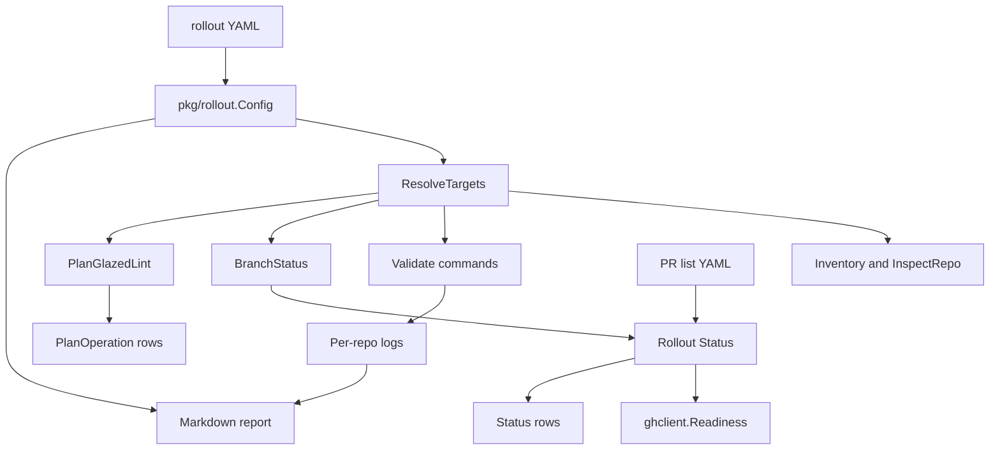
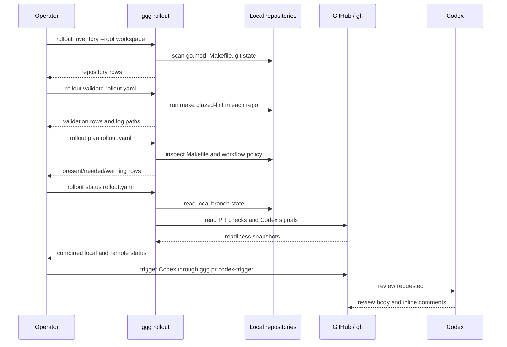
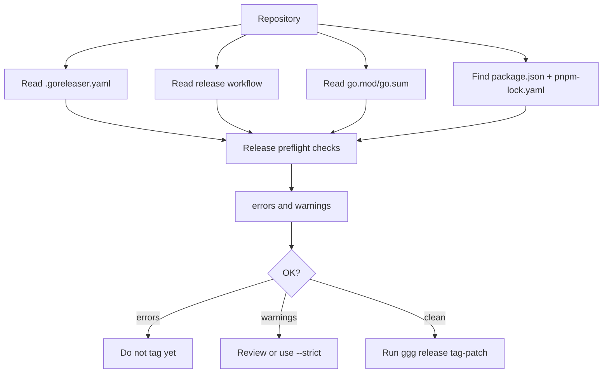

# `ggg rollout` automation: real-world testing and implementation

`ggg rollout` is the second major step in turning go-go-golems release operations into typed, resumable, reviewable tooling. The first `ggg` work focused on pull request readiness, Codex review signals, YAML PR lists, and release tagging. The later work described in this report focuses on the part of a rollout that happens before and around PR readiness: repository inventory, rollout configuration, validation across many local checkouts, branch hygiene, PR publication plumbing, combined local/remote status, generated reports, and profile-specific planning.

This report explains the implementation and the real testing work performed during the INFRA-002 Glazed lint rollout. It is written as a technical chapter for someone who needs to continue the system. The important idea is that the rollout was not only a feature implementation. It was tested against ten live repositories, ten live PRs, real Codex feedback, real CI states, existing Makefile variations, branch rewrite mistakes, stale feedback, and policy corrections discovered only after remote review.

> [!summary]
> - `ggg rollout` now contains a working operational layer: `inventory`, `init`, `plan`, `validate`, `branch`, `push-prs`, `status`, and `report`.
> - The implementation lives in `/home/manuel/code/wesen/go-go-golems/infra-tooling`, mainly under `pkg/rollout` and `internal/cli/rollout`.
> - The real test case was INFRA-002, which rolled Glazed CLI policy linting across ten repositories in `/home/manuel/workspaces/2026-05-24/add-js-providers`.
> - Live testing forced several policy corrections: no `@latest` linter fallback, use `GOWORK=off` for vettool runs, honor `GLAZED_LINT_DIRS`, treat the `glazed` repository as a self-hosted tool repo, and keep allow paths narrow.
> - The next major step is `ggg rollout apply --profile glazed-lint`, but it should be built on the read-only planner and tested with real Makefile fixtures before mutating repositories.

## 1. Why this note exists

The first article about `ggg` explained the PR-readiness and release-tagging core. That work answered questions such as: Is this PR ready? Did Codex produce current-head feedback? Are checks complete? Can a release tag be created safely? Those questions matter after a PR exists.

INFRA-002 exposed a different class of work. Before the PRs existed, the rollout needed to discover repositories, decide the target set, edit Makefiles, add CI steps, run local validation, commit branches, verify branch bases, push branches, open PRs, and then handle Codex feedback. The first pass used ticket-local scripts. Those scripts were useful because they captured real operator behavior. They also showed exactly which steps should become `ggg rollout` commands.

The user then asked for a design, a phase/task breakdown, and an implementation. The implementation did not try to automate every edit. It first created durable operational primitives, then added a read-only profile planner. This sequence matters because read-only commands are easier to validate against real repositories. Once the command can inspect the world accurately, mutation can be added with fewer hidden assumptions.

## 2. The concrete rollout that drove the design

INFRA-002 rolled out Glazed CLI policy linting to these repositories:

| Repository | PR |
| --- | --- |
| `css-visual-diff` | https://github.com/go-go-golems/css-visual-diff/pull/9 |
| `discord-bot` | https://github.com/go-go-golems/discord-bot/pull/10 |
| `geppetto` | https://github.com/go-go-golems/geppetto/pull/363 |
| `glazed` | https://github.com/go-go-golems/glazed/pull/582 |
| `go-go-goja` | https://github.com/go-go-golems/go-go-goja/pull/42 |
| `goja-git` | https://github.com/go-go-golems/goja-git/pull/3 |
| `go-minitrace` | https://github.com/go-go-golems/go-minitrace/pull/12 |
| `loupedeck` | https://github.com/go-go-golems/loupedeck/pull/4 |
| `pinocchio` | https://github.com/go-go-golems/pinocchio/pull/161 |
| `workspace-manager` | https://github.com/go-go-golems/workspace-manager/pull/21 |

The goal was to make each repository run:

```bash
make glazed-lint
```

and to wire that command into the repository's normal lint and CI path where appropriate. The first scripts under the INFRA-002 ticket performed inventory, target selection, Makefile editing, validation, allow-path repairs, branch commits, PR creation, and Codex triggering. The later `ggg rollout` implementation moved the reusable parts into Go.

The target workspace was:

```text
/home/manuel/workspaces/2026-05-24/add-js-providers
```

The tool repository was:

```text
/home/manuel/code/wesen/go-go-golems/infra-tooling
```

The ticket workspace was:

```text
/home/manuel/code/wesen/go-go-golems/infra-tooling/ttmp/2026/05/27/INFRA-002--roll-out-glazed-cli-policy-linting-across-go-go-golems-repositories
```

## 3. The implemented command surface

The implemented command group is:

```text
ggg rollout
```

It currently exposes:

```text
ggg rollout inventory
ggg rollout init
ggg rollout plan
ggg rollout validate
ggg rollout branch
ggg rollout push-prs
ggg rollout status
ggg rollout report
```

Each command is built as a Glazed command, so it emits structured rows and can be used with normal Glazed output flags such as `--output json`. The root registration happens in:

```text
/home/manuel/code/wesen/go-go-golems/infra-tooling/internal/cli/root.go
```

The command implementations live in:

```text
/home/manuel/code/wesen/go-go-golems/infra-tooling/internal/cli/rollout/
```

The reusable implementation lives in:

```text
/home/manuel/code/wesen/go-go-golems/infra-tooling/pkg/rollout/
```

The first implementation commits were:

| Commit | Meaning |
| --- | --- |
| `c6fe082 Add ggg rollout operations` | Added config, inventory, validate, branch, push-prs, report, and CLI wiring. |
| `22553ac Add rollout status command` | Added combined local branch and PR readiness status. |
| `81c55be Add rollout plan command` | Added read-only Glazed-lint profile planning. |
| `0184e27 Document ggg rollout implementation` | Recorded the phase/task implementation and validation artifacts. |
| `7e3f214 Document rollout plan implementation` | Recorded planner implementation, live validation, and follow-up fixes. |

## 4. The rollout YAML file

The central input is a rollout YAML file. For INFRA-002 it is:

```text
/home/manuel/code/wesen/go-go-golems/infra-tooling/ttmp/2026/05/27/INFRA-002--roll-out-glazed-cli-policy-linting-across-go-go-golems-repositories/scripts/12-ggg-rollout.yaml
```

Its shape is defined by `pkg/rollout/config.go`:

```go
type Config struct {
    ID            string        `yaml:"id"`
    Name          string        `yaml:"name"`
    Workspace     string        `yaml:"workspace"`
    Branch        string        `yaml:"branch"`
    Base          string        `yaml:"base"`
    CommitMessage string        `yaml:"commit_message"`
    Selection     Selection     `yaml:"selection"`
    Validation    Validation    `yaml:"validation"`
    PullRequest   PullRequest   `yaml:"pull_request"`
    Readiness     Readiness     `yaml:"readiness"`
    Release       ReleaseConfig `yaml:"release"`
}
```

This file gives the rollout commands enough information to operate without command-line state being reconstructed from memory. It contains the workspace path, branch name, base ref, target selection, validation commands, PR body path, output PR YAML, and release/readiness placeholders.

The target resolution rule is simple and important:

```go
func (c Config) ResolveTargets() ([]string, error) {
    if c.Selection.Include is non-empty:
        resolve each include entry relative to c.Workspace unless absolute
    else:
        inventory c.Workspace and filter by required go.mod modules
}
```

Explicit includes were used for INFRA-002 because the user clarified that the target set should be the active workspace repositories only, not every Glazed-dependent repository visible elsewhere on disk.

## 5. Architecture of the rollout layer

The rollout package is deliberately split into read-only inspection, command execution, local git state, remote PR state, and profile planning. Those responsibilities should remain separate.



The command layer under `internal/cli/rollout` should stay thin. It should decode Glazed settings, call `pkg/rollout`, convert results to rows, and request non-zero exit codes when needed. The implementation logic belongs in `pkg/rollout` so it can be tested without invoking Cobra.

## 6. Inventory: finding repositories and facts

`ggg rollout inventory` scans a workspace for `go.mod` files, parses module data, filters by required modules, and records repository facts. The implementation is in:

```text
pkg/rollout/inventory.go
internal/cli/rollout/inventory.go
```

It reports data such as:

- repository path;
- module path;
- pinned Glazed version;
- Makefile presence;
- lint target presence;
- workflow directory presence;
- lefthook presence;
- package directories;
- current branch;
- ahead count relative to the configured base;
- tracked and untracked dirty state.

The essential algorithm is:

```go
func Inventory(root string, opts InventoryOptions) ([]Repo, error) {
    goMods := findGoModFiles(root)
    for each go.mod:
        module, requires := parseGoMod(go.mod)
        if module requirements do not match opts.RequireModules:
            continue
        repo := InspectRepo(dir, opts.Base)
        repo.Module = module
        repo.GlazedVersion = requires["github.com/go-go-golems/glazed"]
        append repo
    return repos
}
```

This command replaced the need to write new shell inventory scripts for every rollout. It also made branch state visible earlier. That matters because the first INFRA-002 commit pass discovered that `go-go-goja` and `loupedeck` had old release-train history in their local branch bases. A rollout tool must check branch shape before PR creation.

## 7. Validation: running the same command everywhere

`ggg rollout validate` executes each configured validation command in every target repository and writes logs. For INFRA-002 the validation command was:

```yaml
validation:
  commands:
    - name: glazed-lint
      run: make glazed-lint
  continue_on_error: true
```

The implementation is in:

```text
pkg/rollout/validate.go
internal/cli/rollout/validate.go
```

The core behavior is:

```go
func Validate(ctx context.Context, cfg Config, opts ValidationOptions) ([]ValidationResult, error) {
    targets := cfg.ResolveTargets()
    for each target:
        repo := InspectRepo(target, cfg.Base)
        for each configured command:
            logPath := logDir / repoName-commandName.log
            if dry-run:
                emit planned row
            else:
                run bash -lc command in repo.Path
                write stdout and stderr to logPath
                emit exit code and OK flag
}
```

This command was run against all ten INFRA-002 repositories. It produced:

```text
ttmp/.../sources/15-ggg-rollout-validate.json
ttmp/.../sources/23-ggg-rollout-validate-after-codex-round2.json
ttmp/.../sources/ggg-rollout-logs/
```

The important result is that the validation did not only run once. It was rerun after policy changes discovered by Codex: pinned tool versions, `GOWORK=off`, directory variable usage, and refined allow paths. The validation command became a repeatable gate during the feedback loop.

## 8. Branch status: local shape before remote review

`ggg rollout branch` checks whether each target repository is on the expected branch, has the expected ahead count, and has no tracked dirty changes. The implementation is in:

```text
pkg/rollout/branch.go
internal/cli/rollout/branch.go
```

The branch policy used in INFRA-002 was strict: every PR branch should be exactly one commit ahead of `origin/main`. That policy keeps review focused. It also makes PR diffs simple to inspect.

The real rollout tested this policy several times:

1. The initial local commit pass found old history in `go-go-goja` and `loupedeck`.
2. Feedback-fix commits temporarily made several branches two commits ahead.
3. The branches were soft-reset and recommitted to one focused commit.
4. A later hardening pass left unstaged Makefile edits after a soft reset, which was caught by status and corrected with `git commit --amend`.

The branch status command encodes the checks that were previously manual:

```go
func BranchStatus(cfg Config) ([]BranchResult, error) {
    for each target:
        repo := InspectRepo(target, cfg.Base)
        problems := []string{}
        if repo.CurrentBranch != cfg.Branch:
            problems append branch mismatch
        if repo.AheadBase > 1:
            problems append too many commits ahead
        if repo.DirtyTracked:
            problems append tracked changes present
        emit OK if no problems
}
```

This is not enough to safely rewrite branches by itself, but it is an essential read-only guard. Future `ggg rollout branch squash` or `ggg rollout branch repair` commands should build on this status model.

## 9. Status: combining local branch state and remote PR readiness

`ggg rollout status` combines two distinct facts:

1. the local branch state from `BranchStatus`;
2. remote PR readiness from `ghclient.Readiness` and `prready.Report`.

The implementation is in:

```text
pkg/rollout/status.go
internal/cli/rollout/status.go
```

The core logic is:

```go
func Status(ctx context.Context, cfg Config) ([]StatusResult, error) {
    branches := BranchStatus(cfg)
    refs := prlist.Load(cfg.PullRequest.OutputPRs)
    for each PR ref:
        report := ghclient.Client{}.Readiness(ctx, ref)
        index report by repo name
    for each branch result:
        combine branch OK with report OK
        emit one row
}
```

This command was valuable immediately. It found current-head Codex feedback on six INFRA-002 PRs. It later confirmed that all branches were one commit ahead after squashing. It also showed the difference between local readiness and remote readiness. A branch can be locally clean and still have `waiting_checks`, `codex_feedback`, or `failed_checks` remotely.

The current observed readiness after the `ggg rollout plan` work was:

| Repository | Latest observed state |
| --- | --- |
| `css-visual-diff` | ready |
| `discord-bot` | codex feedback after a narrow allow-path review comment |
| `geppetto` | ready |
| `glazed` | ready after self-host target fix |
| `go-go-goja` | ready |
| `goja-git` | ready |
| `go-minitrace` | ready |
| `loupedeck` | ready |
| `pinocchio` | ready |
| `workspace-manager` | ready |

No PR was merged during this work.

## 10. Plan: read-only profile inspection

`ggg rollout plan` is the profile-specific dry-run inspector. It does not edit files. It emits one row per expected operation and marks each operation as `present`, `needed`, or `warning`.

The implementation is in:

```text
pkg/rollout/plan.go
pkg/rollout/plan_test.go
internal/cli/rollout/plan.go
```

For the `glazed-lint` profile, it checks:

- Makefile variables;
- `glazed-lint-build` target presence;
- reproducible tool installation;
- absence of `@latest` fallback;
- `glazed-lint` target presence;
- `GOWORK=off` on vettool invocations;
- use of `$(GLAZED_LINT_FLAGS)`;
- use of `$(GLAZED_LINT_DIRS)`;
- `lint` and `lintmax` integration;
- CI workflow coverage with `make glazed-lint`.

The planner has a specific rule for the `glazed` repository itself:

```go
selfHostedGlazed := repo.Module == "github.com/go-go-golems/glazed"
```

Downstream repositories install the tool from `github.com/go-go-golems/glazed/cmd/tools/glazed-lint`. The `glazed` repository builds the tool from the local checkout:

```make
glazed-lint-build:
	go build -o $(GLAZED_LINT_BIN) ./cmd/tools/glazed-lint
```

Without that self-host rule, the planner incorrectly reported missing module-install variables for the repository that owns the tool. The first live plan run exposed this. The fix made the planner aware of repository role, and the `glazed` Makefile was adjusted so its standalone target uses `$(GLAZED_LINT_FLAGS)` and `$(GLAZED_LINT_DIRS)`.

The core planner loop is:

```go
func PlanGlazedLint(cfg Config) ([]PlanOperation, error) {
    targets := cfg.ResolveTargets()
    for each target:
        repo := InspectRepo(target, cfg.Base)
        module, requires := parseGoMod(target/go.mod)
        repo.Module = module
        repo.GlazedVersion = requires["github.com/go-go-golems/glazed"]
        repoOps := planGlazedLintRepo(repo)
        append repoOps
    return ops
}
```

The planner is not an apply engine. That distinction is important. It reads Makefiles with simple target-boundary rules and string checks. That is appropriate for inspection. Mutation should use an explicit patch operation model with tests based on real Makefile fixtures.

## 11. Real failures and what they changed

The live rollout produced several important failures and review comments. Each one changed the policy encoded in either Makefiles or the planner.

### 11.1 Older Glazed versions did not contain `cmd/tools/glazed-lint`

Several repositories pinned Glazed `v1.2.x`. Those versions did not contain the linter package. The initial Makefile fallback used `@latest`, which made local validation pass, but Codex correctly flagged it as non-reproducible. A future upstream release could change analyzer behavior without any change in the target repository.

The corrected policy is:

```make
GLAZED_LINT_TOOL_VERSION ?= v1.3.4
```

and linter installation must use an explicit version, not `@latest`.

### 11.2 Standalone vettool runs must use `GOWORK=off`

Some repositories are checked out beneath a parent `go.work`. Without `GOWORK=off`, `go vet` can run in workspace mode and analyze different module versions or different package sets than CI. Codex flagged this in `goja-git` and `loupedeck`, and the policy was applied consistently.

The corrected pattern is:

```make
glazed-lint: glazed-lint-build
	GOWORK=off go vet -vettool=$(GLAZED_LINT_BIN) $(GLAZED_LINT_FLAGS) $(GLAZED_LINT_DIRS)
```

The same rule applies inside `lint` and `lintmax` when they call the Glazed vettool directly.

### 11.3 `GLAZED_LINT_DIRS` must actually be used

`geppetto` and `pinocchio` introduced `GLAZED_LINT_DIRS` but some vettool invocations still used hard-coded directories or `$(LINT_DIRS)`. Codex flagged this because the variable was ineffective. The fix was to route all Glazed vettool calls through `$(GLAZED_LINT_DIRS)`.

The planner now checks for this explicitly.

### 11.4 The `glazed` repository has a different correct tool-build path

The `glazed` repo owns the linter. It should not install its own tool from a released module version when the local checkout is the code under review. It should build:

```make
go build -o $(GLAZED_LINT_BIN) ./cmd/tools/glazed-lint
```

The planner now detects `repo.Module == "github.com/go-go-golems/glazed"` and checks for the local build path instead of downstream install variables.

### 11.5 Allow paths must be narrow

The rollout used allow paths for existing legacy code. This was intentional because the goal was to introduce policy enforcement without rewriting every existing raw Cobra or environment access path. Codex later flagged `discord-bot` because `cmd/discord-bot/` was too broad. That path would allow future production CLI files under the primary command package to bypass the policy.

The policy is now stricter:

- allow existing legacy adapter files when needed;
- avoid broad command package directories when specific files can be named;
- treat allow paths as known debt, not as permanent validation success.

At the time this report was written, `discord-bot` had a current Codex comment asking to narrow `cmd/discord-bot/` further to specific legacy files. That is active follow-up work, not a merged state.

## 12. Command-level data flow

The implemented system is best understood as a sequence of read and validation commands around one durable YAML file.



The durable files from the INFRA-002 ticket preserve the evidence:

```text
sources/15-ggg-rollout-validate.json
sources/23-ggg-rollout-validate-after-codex-round2.json
sources/29-ggg-rollout-plan-final-heads.json
sources/33-ggg-rollout-plan-after-discord-fix.json
sources/34-ggg-rollout-status-after-discord-fix.json
sources/ggg-rollout-logs/
```

## 13. What the tests cover today

The current tests are focused on the package layer. That is the right place for early coverage because the command layer mostly decodes flags and emits rows.

| Test file | Coverage |
| --- | --- |
| `pkg/rollout/inventory_test.go` | Inventory filtering by Glazed dependency, Makefile target detection, package-dir detection, explicit include target resolution. |
| `pkg/rollout/validate_test.go` | Command execution, log writing, continue-on-error behavior. |
| `pkg/rollout/plan_test.go` | Missing Glazed-lint operations, hardened Makefile recognition, CI step recognition. |

The tests do not yet cover every live Makefile shape. They should. The live rollout produced high-quality fixtures: self-hosted Glazed, old Glazed dependency versions, `LINT_DIRS`-based repos, hard-coded package dirs, custom vettools, and existing partial lint wiring.

A good next test phase is to add fixture Makefiles extracted from the ten INFRA-002 repositories, reduce them to stable minimal examples, and assert planner output. This would prevent regressions in `PlanGlazedLint` before an apply engine is added.

## 14. Current limitations

The implemented system is useful now, but it is intentionally incomplete.

`ggg rollout plan` is read-only. It does not produce patch diffs or mutate files. It uses target-body extraction and string checks, not a full Makefile parser. That is acceptable for detection. It is not enough for reliable rewriting.

`ggg rollout push-prs` exists but was not the primary creator of the INFRA-002 PRs because the PRs were already open before the command was implemented. It needs fake GitHub client tests before it should become the default publication path.

`ggg rollout branch --commit` exists as a guarded helper, but it stages only Makefile and workflow paths. Future profile-specific staging should come from planned patch operations, not a hard-coded staging list.

`ggg rollout status` uses current `ghclient.Readiness`, which still has known pagination limitations. Full GraphQL pagination remains future work.

The planner does not yet parse analyzer diagnostics and propose allow paths. That should be a separate command or sub-mode because allow-path suggestions require careful review.

## 15. Recommended next implementation sequence

The next implementation should add mutation only after strengthening the planner.

### Step 1: Add real Makefile fixtures

Create fixture inputs from the ten INFRA-002 Makefiles. Each fixture should have an expected set of `PlanOperation` rows. The planner should be tested against:

- no Glazed lint wiring;
- partial Glazed lint wiring;
- self-hosted Glazed local build;
- older Glazed dependency with tool-version fallback;
- `LINT_DIRS`-based package selection;
- hard-coded `./cmd/... ./pkg/...` package selection;
- existing custom vettools such as `geppetto-lint`.

### Step 2: Add operation filtering

`ggg rollout plan` should support:

```bash
ggg rollout plan rollout.yaml --status needed
ggg rollout plan rollout.yaml --status warning
ggg rollout plan rollout.yaml --kind vet-workspace
```

This is useful for review because the full plan emits many `present` rows when the rollout is already correct.

### Step 3: Add `ggg rollout apply --profile glazed-lint --dry-run`

The first apply command should be dry-run only. It should produce diffs and refuse to write files. The implementation should convert planner operations into patch operations:

```go
type PatchOperation struct {
    Repo        Repo
    File        string
    Kind        string
    Description string
    Before      string
    After       string
    Diff        string
}
```

### Step 4: Add `ggg rollout apply --yes`

Only after dry-run diffs are tested should the command mutate files. It should refuse dirty tracked worktrees unless explicitly allowed, and it should write one row per applied operation.

### Step 5: Add branch repair helpers

The live rollout needed repeated soft resets, amends, and force pushes with lease. That workflow should become explicit:

```bash
ggg rollout branch squash rollout.yaml --yes
ggg rollout branch amend rollout.yaml --paths Makefile,.github/workflows --yes
ggg rollout branch push --force-with-lease --yes
```

The command should show exactly which commit will be replaced before mutation.

### Step 6: Add diagnostic-driven allow suggestions

After `validate`, a future command can parse linter logs and suggest narrow allow paths:

```bash
ggg rollout suggest-allows rollout.yaml --from-logs sources/ggg-rollout-logs --output table
```

It should not apply suggestions automatically. It should emit candidate paths, diagnostic kinds, counts, and sample messages.

## 16. Working rules preserved by the live test

The live INFRA-002 run established rules that should remain part of `ggg rollout` development.

- A rollout YAML file is the durable operational state. Commands should load it rather than reconstruct target sets from shell history.
- Read-only commands should come before mutating commands. `inventory`, `plan`, `validate`, `branch`, and `status` are safety gates.
- Branch shape is a review policy. For this rollout, each branch should be one commit ahead of `origin/main`.
- `GOWORK=off` is required for reproducible module-only validation where ambient workspaces would change package resolution.
- `@latest` should not be used in CI-facing tool install fallbacks. Use an explicit tool version.
- Allow paths must be narrow and justified by current legacy code.
- Codex feedback should be treated as current only when it applies to the current head. Stale comments are evidence, not blockers.
- A no-verify push can publish a branch after local validation, but it does not replace CI, Codex, or human review.
- No merge automation should be added unless a future ticket explicitly authorizes it.

## 17. Review map for future maintainers

Start with these files:

```text
/home/manuel/code/wesen/go-go-golems/infra-tooling/pkg/rollout/config.go
/home/manuel/code/wesen/go-go-golems/infra-tooling/pkg/rollout/inventory.go
/home/manuel/code/wesen/go-go-golems/infra-tooling/pkg/rollout/validate.go
/home/manuel/code/wesen/go-go-golems/infra-tooling/pkg/rollout/branch.go
/home/manuel/code/wesen/go-go-golems/infra-tooling/pkg/rollout/status.go
/home/manuel/code/wesen/go-go-golems/infra-tooling/pkg/rollout/plan.go
/home/manuel/code/wesen/go-go-golems/infra-tooling/internal/cli/rollout/
```

Then read the ticket evidence:

```text
/home/manuel/code/wesen/go-go-golems/infra-tooling/ttmp/2026/05/27/INFRA-002--roll-out-glazed-cli-policy-linting-across-go-go-golems-repositories/design-doc/03-ggg-rollout-implementation-phases-and-tasks.md
/home/manuel/code/wesen/go-go-golems/infra-tooling/ttmp/2026/05/27/INFRA-002--roll-out-glazed-cli-policy-linting-across-go-go-golems-repositories/reference/01-glazed-linting-rollout-diary.md
/home/manuel/code/wesen/go-go-golems/infra-tooling/ttmp/2026/05/27/INFRA-002--roll-out-glazed-cli-policy-linting-across-go-go-golems-repositories/scripts/12-ggg-rollout.yaml
```

Run these commands:

```bash
cd /home/manuel/code/wesen/go-go-golems/infra-tooling

go test ./...

ggg rollout inventory \
  --root /home/manuel/workspaces/2026-05-24/add-js-providers \
  --require-module github.com/go-go-golems/glazed \
  --output json

ggg rollout plan \
  ttmp/2026/05/27/INFRA-002--roll-out-glazed-cli-policy-linting-across-go-go-golems-repositories/scripts/12-ggg-rollout.yaml \
  --output json

ggg rollout validate \
  ttmp/2026/05/27/INFRA-002--roll-out-glazed-cli-policy-linting-across-go-go-golems-repositories/scripts/12-ggg-rollout.yaml \
  --output json

ggg rollout status \
  ttmp/2026/05/27/INFRA-002--roll-out-glazed-cli-policy-linting-across-go-go-golems-repositories/scripts/12-ggg-rollout.yaml \
  --output json
```

The expected result is not that every PR is always ready. PR state changes over time. The expected local result is that the commands run, produce structured rows, and identify any current remote blockers precisely.

## 18. Closing state

`ggg rollout` moved from design to working code during INFRA-002. It was tested against a real rollout with ten repositories and ten PRs. The live test changed the implementation: it added the `plan` command, made the planner role-aware for the `glazed` repository, hardened linter installation policy, enforced `GOWORK=off`, and exposed remaining allow-path precision work in `discord-bot`.

The project is now in a useful intermediate state. It can inspect, validate, report, and combine status. It can plan Glazed-lint policy conformance without editing files. The next meaningful work is to turn the planner into a tested apply engine. That should be done only after adding fixture coverage from the real Makefiles used in INFRA-002.

The main conclusion is operational: `ggg` should continue to encode real rollout policy after that policy has been exercised against real repositories. INFRA-002 produced exactly that evidence. The implementation should remain grounded in those artifacts.

---

## 19. Addendum: INFRA-003 turned `ggg` from rollout PR tooling into release verification tooling

The original version of this article ended after the INFRA-002 Glazed lint rollout. The next rollout, INFRA-003, changed the shape of `ggg` again. INFRA-002 proved that `ggg` could help open and monitor many PRs. INFRA-003 proved that a rollout is not done when PRs merge: if the change affects release-tag behavior, the real proof is a successful tag-triggered release and a production verification step.

INFRA-003 added docsctl documentation publishing to Go-Go-Golems packages. Each package release workflow now exports Glazed help as SQLite, authenticates to Vault through GitHub OIDC, mints a short-lived docs-registry publishing JWT, uploads the package/version docs, and verifies that the docs browser can see the new version. The rollout forced `ggg` to grow from PR-readiness automation into release-watch, docs-verification, and release-preflight tooling.

> [!summary]
> - `ggg release watch` and `ggg release verify-docs` were added because merged PRs do not prove release-time docs publishing.
> - Terraform/Vault roles had to be applied before tag verification; otherwise tag workflows would fail at the OIDC/Vault boundary.
> - Real tag runs surfaced release workflow defects unrelated to docsctl: missing pnpm installs, stale GoReleaser placeholders, and CGO-disabled builds for tree-sitter packages.
> - All INFRA-003 target packages eventually published docs, but only after `ggg` learned to watch releases, emit failed-log commands, and run preflight checks.

### 19.1 The new docsctl rollout target

INFRA-003 targeted the packages that can export Glazed help SQLite:

| Package | Published docs version | Public docs URL | Sections |
| --- | ---: | --- | ---: |
| `loupedeck` | `v0.1.1` | `https://docs.yolo.scapegoat.dev/loupedeck/v0.1.1` | 4 |
| `discord-bot` | `v0.1.6` | `https://docs.yolo.scapegoat.dev/discord-bot/v0.1.6` | 3 |
| `go-minitrace` | `v0.0.17` | `https://docs.yolo.scapegoat.dev/go-minitrace/v0.0.17` | 20 |
| `workspace-manager` | `v0.0.5` | `https://docs.yolo.scapegoat.dev/workspace-manager/v0.0.5` | 6 |
| `pinocchio` | `v0.10.29` | `https://docs.yolo.scapegoat.dev/pinocchio/v0.10.29` | 112 |
| `css-visual-diff` | `v0.1.5` | `https://docs.yolo.scapegoat.dev/css-visual-diff/v0.1.5` | 8 |
| `go-go-goja` | `v0.6.3` | `https://docs.yolo.scapegoat.dev/go-go-goja/v0.6.3` | 22 |

The key operational correction was that the Terraform/Vault roles were not optional background infrastructure. They were part of the release path. The package release workflows bind GitHub OIDC claims such as repository, repository ID, ref, workflow ref, event, and reusable workflow ref. If the role is missing or the workflow filename is wrong, docs publishing fails even if the package release itself is otherwise healthy.

This mattered concretely for Pinocchio. Pinocchio uses `.github/workflows/release.yml`, while most packages use `release.yaml`. The Terraform role originally needed an exact `workflow_ref` correction from `release.yaml` to `release.yml`. The successful `pinocchio v0.10.29` publish proved that the claim correction was necessary and sufficient.

### 19.2 `ggg release watch` and `ggg release verify-docs`

INFRA-003 added two release-time commands:

```bash
ggg release watch \
  --repo go-go-golems/<repo> \
  --workflow release.yaml \
  --tag vX.Y.Z \
  --verify-docs \
  --package <package>
```

and:

```bash
ggg release verify-docs \
  --package <package> \
  --version vX.Y.Z \
  --output json
```

The watch command solves the “what happened after I pushed the tag?” problem. It finds the tag-triggered GitHub Actions run, optionally streams `gh run watch`, waits for completion, and can then call the docs verifier. For ticket automation, the important mode is:

```bash
ggg release watch \
  --repo go-go-golems/<repo> \
  --tag vX.Y.Z \
  --verify-docs \
  --package <package> \
  --no-stream \
  --output json
```

That produces a durable JSON artifact with the run ID, conclusion, docs URL, status code, page title, package/version presence, and section count.

The docs verifier intentionally checks the public browser page instead of depending on a private API shape. It fetches:

```text
https://docs.yolo.scapegoat.dev/<package>/<version>
```

and validates the preloaded page state. This was pragmatic: the public page is what readers and agents consume, and it contains enough state to verify package, version, and section count.

### 19.3 Release failures are first-class rollout data

The most useful `ggg` improvement from INFRA-003 came from failure, not success. `css-visual-diff` and `go-go-goja` both had merged docsctl PRs, applied Vault roles, and valid tags. They still failed before docs publishing because their release workflows had latent defects.

For `css-visual-diff`:

1. `v0.1.3` failed because the macOS GoReleaser job ran `go generate ./...`, the generator tried Dagger, Dagger was unavailable on the macOS runner, and the fallback local `pnpm` executable was missing.
2. `v0.1.4` failed because `pnpm` existed, but `web/review-site/node_modules` had not been installed, so `tsc` was missing.
3. `v0.1.5` succeeded after the release workflow installed pnpm and ran `pnpm --dir web/review-site install --frozen-lockfile` before GoReleaser.

For `go-go-goja`:

1. `v0.6.1` failed because `.goreleaser.yaml` still contained scaffold placeholders such as `cmd/XXX`.
2. `v0.6.2` failed because GoReleaser set `CGO_ENABLED=0`, but the tree-sitter JavaScript bindings require CGO.
3. `v0.6.3` succeeded after the GoReleaser config pointed at `./cmd/goja-repl` and enabled CGO with the needed cross-compiler variables.

Those failures changed `ggg release watch`: failed release results now include a `failed_log_command` field such as:

```bash
gh run view 26544778174 --repo go-go-golems/css-visual-diff --log-failed
```

That field turns a failed JSON artifact into an operator handoff. The next person does not need to rediscover which `gh` incantation to run.

### 19.4 The release preflight command

After the failed tags, the next obvious command was:

```bash
ggg release preflight --repo <repo> --output json
```

The first version checks for the failure modes that occurred in the rollout:

- `.goreleaser.yaml` scaffold placeholders like `XXX`;
- `main:` paths that point to missing command directories;
- `CGO_ENABLED=0` in a module that references tree-sitter packages;
- `go generate ./...` hooks in repositories with pnpm frontend packages but no release-workflow pnpm setup;
- frontend package directories that probably need `pnpm --dir <dir> install --frozen-lockfile` before GoReleaser;
- incomplete docsctl reusable workflow inputs.

The command is intentionally conservative. Some checks are warnings because they are heuristics. For example, `go-go-goja` currently has a `web/` frontend package and a `go generate ./...` hook, so preflight warns about pnpm even though the final successful `v0.6.3` release did not need that frontend path in practice. That is acceptable for a first release preflight: warnings should wake the operator up, not block a release unless `--strict` is used.

The mental model is:



The key design rule is that release preflight should run before tag creation. Failed tags are durable public history. A release preflight cannot guarantee success, but it can prevent the obvious failures that the rollout already paid for.

### 19.5 Updated implementation surface after INFRA-003

The release command surface now includes:

```text
ggg release tag-patch
ggg release tag-minor
ggg release tag-major
ggg release watch
ggg release verify-docs
ggg release preflight
```

`tag-*` also learned an important ergonomics fix: it no longer performs `git checkout --detach origin/main` before tagging. It now creates the tag directly at the target commit:

```bash
git tag <tag> <commit>
```

That matters in worktree-heavy environments. The old implementation left the Loupedeck checkout detached after a successful release. It did not corrupt the release, but it was exactly the kind of operator footgun that `ggg` is supposed to remove.

### 19.6 The broader lesson

INFRA-002 taught that rollout automation needs Codex-aware PR readiness, current-head review signals, batch status, and profile-specific planning. INFRA-003 taught that rollout automation also needs release-time proof.

The final shape is no longer just:

```text
edit repositories → open PRs → wait for checks → merge
```

It is:

```text
edit repositories
→ open PRs
→ wait for checks and Codex
→ apply external infrastructure
→ merge
→ preflight releases
→ tag
→ watch release workflows
→ verify production docs
→ record evidence
```

That last half is where many hidden problems live. `ggg` is valuable because it records those hidden problems as commands, not just as diary prose. Each rollout should continue this pattern: do the first live operation manually enough to understand it, then promote the repeated part into `ggg`, then update the playbooks so the next operator starts from the improved baseline.
