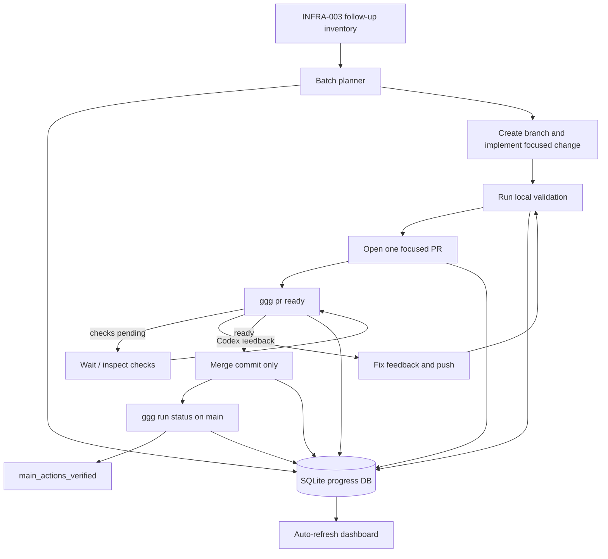

# INFRA-004 Release Train Machinery

This is the release-dashboard and rollout-control branch of the [[infrastructure-and-release]] project map.

This note explains the release train machinery built during the INFRA-004 rollout on 2026-05-28. The work was not only a set of package logger patches across Go-Go-Golems repositories. The central result was a controlled rollout system: a dependency-aware batch plan, a SQLite-backed progress tracker, an auto-refreshing dashboard, a repeatable PR readiness loop, and a corrected `ggg` action-status model where repositories with no workflow runs are terminally successful instead of blocking forever.

> [!summary]
> - INFRA-004 turned a broad multi-repository cleanup into an explicit release train with batches, states, validation records, events, PR URLs, merge SHAs, and main-branch action verification.
> - The dashboard is intentionally small: one SQLite database, one Python CLI, and one auto-refreshing HTTP page that reads the database on every request.
> - The workflow depends on three independent gates before merge: local validation, GitHub checks, and Codex review state. After merge, `ggg run status` verifies main, with `no_runs` treated as a successful terminal state.
> - The work surfaced practical failure modes: stale Codex feedback, Go toolchain directives, GoReleaser scaffold placeholders, cgo release targets, generated logger area preservation, archived repositories, and global `log` conflicts.

## Why this note exists

The INFRA-004 work created an operating model for future Go-Go-Golems rollouts. The durable knowledge is the machinery: how to decompose a large set of repository changes into safe waves, how to track the state of every repository without depending on memory, how to use CI and Codex as gates without serializing all work, and how to verify merged work on `main` without treating repositories that have no Actions runs as failures.

The immediate rollout began as follow-up from INFRA-003. INFRA-003 had identified repositories needing some combination of:

- generated package loggers through `logcopter`,
- documentation publishing through `docsctl`,
- Glazed command linting,
- xgoja provider/API binding work.

The important constraint was that not every repository could be changed in the same way. Some repositories are leaf packages. Some are command-line applications. Some have generated log conflicts. Some have incomplete GoReleaser scaffolding. Some are archived. Some require API intent confirmation before xgoja bindings should be touched. The release train machinery exists to keep these differences explicit.

## The control loop

The rollout workflow is a control loop. Each repository moves through a small state machine, and every transition is recorded. The loop is repeated per repository, but the repositories are ordered by dependency and risk.



The loop has two properties that mattered in practice.

First, PR creation and CI watching can be parallelized. Once a PR is open and the tracker knows the branch, URL, and validation status, the next repository can start while checks and Codex run. This is why the dashboard is not a convenience feature; it is what makes parallelism safe. Without a shared state table, the operator has to remember which PR is waiting for Codex, which one has stale feedback, which one is ready, and which one has already been verified on `main`.

Second, releases and dependency-sensitive work must still be sequential when they create upstream assumptions. The batches separate this. B1 contains foundation and upstream libraries. B2 contains safer leaf logcopter-only work. B5 contains xgoja/API-intent candidates and their pre-dependencies. The result is not maximal concurrency; it is controlled concurrency.

## The batch model

The batch planner produced five main groups:

| Batch | Meaning | Operational rule |
| --- | --- | --- |
| B1 | Foundation/upstream libraries and high-value prerequisites | Merge and verify before downstream work assumes them. |
| B2 | Leaf or mostly mechanical logcopter repos | Safe to run in parallel after validating local shape. |
| B3 | Glazed linting without docsctl | Requires lint attention but less documentation publishing surface. |
| B4 | docsctl plus Glazed CLI repos | Larger surface; defer until the control loop is stable. |
| B5 | xgoja/API-intent candidates | Highest value after mechanical waves, but only after pre-dependencies are ready and API intent is confirmed. |

The current direction changed during the work. After initial B1 and B2 progress, the user explicitly asked to skip `common-sense`, `plunger`, `biberon`, `bucheron`, and `ecrivain`, and then to prioritize B5 and its logcopter pre-dependencies. The tracker recorded those skip decisions as state transitions instead of leaving them as implicit conversation state.

The B5 set at the end of this session was:

| Repository | Tracks |
| --- | --- |
| `cozodb-goja` | logcopter, Glazed, xgoja |
| `go-go-gepa` | logcopter, docsctl, Glazed, xgoja |
| `go-go-goja` | xgoja |
| `go-minitrace` | xgoja |
| `goja-github-actions` | logcopter, docsctl, Glazed, xgoja |
| `openai-app-server` | logcopter, Glazed, xgoja |
| `pinocchio` | xgoja |
| `scraper` | logcopter, docsctl, Glazed, xgoja |
| `smailnail` | logcopter, docsctl, Glazed, xgoja |
| `vm-system` | logcopter, docsctl, Glazed, xgoja |
| `workspace-manager` | xgoja |

This table matters because B5 is not one kind of work. Some B5 repositories need only xgoja attention. Others need logcopter and docsctl baseline work first. The correct next step is not “do B5”; it is “clear the pre-dependencies for the B5 repos that need them, then do xgoja API work only after confirming intent.”

## The ticket workspace

INFRA-004 was created as a docmgr ticket under:

```text
/home/manuel/workspaces/2026-05-24/add-js-providers/infra-tooling/ttmp/2026/05/28/INFRA-004--batch-infra-003-follow-up-rollout-across-go-go-golems-repos
```

The ticket contains the implementation guide, diary, scripts, generated sources, and progress database. The key files are:

```text
analysis/01-rollout-analysis-and-implementation-guide.md
reference/01-diary.md
scripts/01-plan-rollout-batches.py
scripts/02-rollout-tracker.py
sources/01-rollout-batches.json
sources/02-rollout-batches.tsv
sources/03-rollout-batches.md
sources/04-b2-logcopter-prs.yaml
sources/05-rollout-progress.sqlite
```

The work deliberately kept generated planning artifacts and live progress artifacts in the ticket. This is useful because the release train is not just source code. The state of the rollout is itself an artifact: which repositories were skipped, which PRs were merged, which checks were green, which Codex findings were addressed, and which main actions were verified.

The ticket was committed together with the `ggg` fix in `infra-tooling`:

```text
fd72f13a6af327285cce941d37315376fa7dadeb Track INFRA-004 rollout progress
```

That commit included both the code changes that made `no_runs` terminal and the `ttmp` documentation/tracker files. The `ttmp/vocabulary.yaml` merge conflict was resolved by keeping the upstream vocabulary and adding the missing `logcopter` topic so `docmgr doctor --ticket INFRA-004 --stale-after 30` passed.

## The SQLite tracker

The tracker is the smallest system that can safely represent this rollout. It is a Python script with a SQLite database and a handful of commands:

```bash
./scripts/02-rollout-tracker.py init
./scripts/02-rollout-tracker.py summary
./scripts/02-rollout-tracker.py list --batch B2
./scripts/02-rollout-tracker.py update-repo REPO --state pr_open --branch BRANCH --pr-url URL
./scripts/02-rollout-tracker.py validation REPO --command 'GOWORK=off go test ./...' --status pass
./scripts/02-rollout-tracker.py merge REPO --sha MERGE_SHA --url PR_URL
./scripts/02-rollout-tracker.py event --repo REPO --kind codex --message 'Triggered fresh Codex review.'
./scripts/02-rollout-tracker.py dashboard --port 8765
```

The schema has three tables: `repos`, `validations`, and `events`.

```sql
CREATE TABLE IF NOT EXISTS repos (
  repo TEXT PRIMARY KEY,
  batch_id TEXT NOT NULL,
  batch_name TEXT NOT NULL,
  module TEXT,
  path TEXT,
  needs_logcopter INTEGER NOT NULL DEFAULT 0,
  needs_docsctl INTEGER NOT NULL DEFAULT 0,
  needs_glazed_lint INTEGER NOT NULL DEFAULT 0,
  needs_xgoja INTEGER NOT NULL DEFAULT 0,
  upstreams TEXT NOT NULL DEFAULT '[]',
  state TEXT NOT NULL DEFAULT 'planned',
  branch TEXT,
  pr_url TEXT,
  pr_number INTEGER,
  head_sha TEXT,
  merge_sha TEXT,
  tag TEXT,
  release_url TEXT,
  docs_url TEXT,
  action_status TEXT,
  notes TEXT NOT NULL DEFAULT '',
  updated_at TEXT NOT NULL
);

CREATE TABLE IF NOT EXISTS validations (
  id INTEGER PRIMARY KEY AUTOINCREMENT,
  repo TEXT NOT NULL REFERENCES repos(repo) ON DELETE CASCADE,
  command TEXT NOT NULL,
  status TEXT NOT NULL CHECK(status IN ('pass','fail','skip','warn')),
  note TEXT NOT NULL DEFAULT '',
  created_at TEXT NOT NULL
);

CREATE TABLE IF NOT EXISTS events (
  id INTEGER PRIMARY KEY AUTOINCREMENT,
  repo TEXT REFERENCES repos(repo) ON DELETE CASCADE,
  kind TEXT NOT NULL,
  message TEXT NOT NULL,
  url TEXT,
  created_at TEXT NOT NULL
);
```

The `repos` table is the current state. The `validations` table is the evidence that local checks were run. The `events` table is the chronological narrative. These three tables correspond to three questions that come up constantly during a multi-repo rollout:

- What is the current state of this repository?
- What commands have already been run, and did they pass?
- Why did the state change?

The state vocabulary is intentionally finite:

```text
planned
branch_created
local_validation
pr_open
codex_waiting
codex_feedback
ready
merged
main_actions_verified
released
blocked
skipped
```

A finite vocabulary keeps the dashboard readable and prevents the rollout from accumulating one-off textual states that cannot be queried. The one place this mattered during implementation was a failed attempt to set `checks_waiting`. The tracker rejected it because it was not in the state list. The correction was to keep the repository in `pr_open` or `codex_waiting` and record the details as an event. That is the right separation: the state should remain coarse; the event log carries nuance.

## The dashboard

The dashboard is served by the same tracker script:

```bash
./scripts/02-rollout-tracker.py dashboard --port 8765
```

It was run in a persistent tmux session named:

```text
infra004-dashboard
```

and served at:

```text
http://127.0.0.1:8765/
```

The dashboard reads SQLite on every request and uses a ten-second HTML refresh:

```html
<meta http-equiv='refresh' content='10'>
```

This design avoids a build step, a frontend dependency, a websocket server, or a separate state cache. The CLI writes SQLite. The dashboard reads SQLite. The browser refreshes. That is enough for an operator-facing rollout screen.

The render path is direct:

```python
def html_dashboard(db: Path, batch: str | None = None) -> str:
    con = connect(db)
    repos = con.execute(...).fetchall()
    states = con.execute(...).fetchall()
    batches = con.execute(...).fetchall()
    events = con.execute("SELECT * FROM events ORDER BY id DESC LIMIT 25").fetchall()
    con.close()
    return f"""<!doctype html> ... """
```

The page has three important regions:

1. A state summary card, showing counts by state.
2. A batch filter card, linking to `/?batch=B1`, `/?batch=B2`, and so on.
3. A repository table sorted so blocked and feedback states appear first, followed by the recent event log.

The table row combines the fields an operator needs while watching a release train:

```text
Batch | Repo | State | Tracks | PR | Merge SHA | Tag | Actions | Notes
```

The dashboard is deliberately not the source of truth. SQLite is the source of truth. The dashboard is a projection. This distinction kept the system easy to update from shell scripts, CI watch loops, or manual commands without adding a second write path.

## The PR readiness gate

The PR readiness gate used `ggg pr ready --findings --output json`. A PR was considered ready only when mergeability, checks, and Codex state were acceptable. The JSON findings made it possible to see which gate was blocking without opening multiple GitHub pages.

Typical ready output contained:

```json
{
  "finding_kind": "merge",
  "message": "merge state is CLEAN",
  "ok": true,
  "state": "ready",
  "terminal": true
}
```

and:

```json
{
  "finding_kind": "checks",
  "message": "all status checks completed successfully",
  "ok": true
}
```

and a Codex satisfied signal:

```json
{
  "finding_kind": "codex",
  "message": "latest Codex signal is satisfied",
  "ok": true
}
```

When the PR was not ready, the same command showed whether the blocker was pending checks, failed checks, stale Codex feedback, active Codex review, or actual Codex code-review comments. This mattered repeatedly. `go-go-app-sqlite` moved through several rounds of Codex feedback. `go-sqlite-regexp` initially had green local tests but failed GitHub lint because the repository’s lint workflow used a golangci-lint binary built with an older Go version than the module target. Later, Codex found release configuration issues that local tests would not have found.

The readiness loop used this sequence:

```bash
ggg pr ready https://github.com/go-go-golems/REPO/pull/N --findings --output json

# If Codex has stale or no feedback after a fix:
ggg pr codex-trigger https://github.com/go-go-golems/REPO/pull/N --wait-for-auto 30s

# If ready:
gh pr merge https://github.com/go-go-golems/REPO/pull/N --merge --delete-branch
```

The merge rule was strict: merge commits only, no squash merges, no direct pushes to `main`.

## The main-branch action gate and the `no_runs` fix

One of the most important infrastructure fixes was changing `ggg` so `no_runs` is terminal and successful under `--watch`. Before the fix, a repository with no GitHub Actions runs could cause `ggg run status --watch` to wait indefinitely or behave as if the absence of runs was a problem. For this rollout, that was wrong. Some repositories simply have no configured workflow for a given branch/SHA, and that state should not block a merge if mergeability and PR readiness were satisfied.

The changed files were:

```text
infra-tooling/pkg/actionstatus/actionstatus.go
infra-tooling/pkg/actionstatus/actionstatus_test.go
infra-tooling/internal/cli/run/status.go
infra-tooling/internal/cli/batch/actions.go
```

The observable behavior after the fix was:

```bash
ggg run status \
  --repo go-go-golems/dmeta \
  --branch main \
  --sha 0172e7ef18f143ce15d58f2eed665f79cd45f172 \
  --watch \
  --output json
```

which returned immediately:

```json
{
  "runs": null,
  "summary": {
    "repo": "go-go-golems/dmeta",
    "ok": true,
    "state": "no_runs",
    "total": 0,
    "success": 0,
    "ignored_failures": 0,
    "failed": 0,
    "pending": 0,
    "no_runs": 1,
    "other": 0
  }
}
```

This change aligned the tool with the rollout rule: no status checks found, or no Actions runs found after merge, is acceptable when the repository genuinely has no relevant workflow runs and the PR gates were satisfied.

The active binary was installed explicitly to the path used by the shell:

```bash
GOBIN=/home/manuel/.local/bin GOWORK=off go install ./cmd/ggg
```

Installing without `GOBIN=/home/manuel/.local/bin` would have placed the binary in `/home/manuel/go/bin/ggg`, which was not the active `ggg` on the operator path. This is a small detail, but it matters because the dashboard and tracker state assume the active command-line tools reflect the current rollout rules.

## What was merged today

By the time this report was written, the tracker recorded the following merged and main-action-verified repositories.

| Repository | PR | Merge SHA | Main action status |
| --- | --- | --- | --- |
| `oak-git-db` | https://github.com/go-go-golems/oak-git-db/pull/1 | `4f5c6aa0c4d54fbb897bdaef8cea26ab691cbcde` | `no_runs`, accepted |
| `go-go-agent-action` | https://github.com/go-go-golems/go-go-agent-action/pull/1 | `c8d6e8953f89237bbe4f5cb210f86f4d48784e33` | checked |
| `go-go-app-arc-agi` | https://github.com/go-go-golems/go-go-app-arc-agi/pull/6 | `ebc76c3019...` | checked |
| `salad` | https://github.com/go-go-golems/salad/pull/3 | `8aed24862a607c2cc32003a2c397951caf8b135d` | checked |
| `ai-in-action-app` | https://github.com/go-go-golems/ai-in-action-app/pull/3 | `ce0c665367...` | checked |
| `go-go-host` | https://github.com/go-go-golems/go-go-host/pull/3 | `67253b1d6e63b314aff3a0ca7ce7cf8f784c5c7b` | checked / no-runs behavior observed |
| `dmeta` | https://github.com/go-go-golems/dmeta/pull/5 | `0172e7ef18f143ce15d58f2eed665f79cd45f172` | `no_runs`, accepted |
| `esper` | https://github.com/go-go-golems/esper/pull/1 | `ba3f26007d62bb60712809a77f1cd5c4af7b839e` | checked / no-runs behavior observed |
| `sanitize` | https://github.com/go-go-golems/sanitize/pull/2 | `f1f965c450178d25978bc6ba317ed769f3fcc5b3` | checked / no-runs behavior observed |

Several of these had non-trivial fixes beyond generated package loggers:

- `go-go-agent-action` needed Docker builder and lint-container fixes.
- `go-go-app-arc-agi` needed a Go directive/toolchain adjustment so govulncheck could run.
- `salad` needed generated logger naming to avoid a `log` conflict, so generated logger usage used a `zlog` alias where appropriate.
- `ai-in-action-app` replaced stdlib/global `log` usage in the server and SQLite repository package with logcopter.
- `go-go-host` required remote correction, module path cleanup, logcopter baseline work, `.goreleaser.yaml` placeholder fixes, and then a follow-up PR because the main image workflow failed after the first merge.
- `sanitize` replaced the remaining stdlib server log call with logcopter and added generated package logger baselines.

## Open work at the report cutoff

The report cutoff matters because this was an active release train, not a completed project.

`go-go-app-sqlite` had PR #8 open:

```text
https://github.com/go-go-golems/go-go-app-sqlite/pull/8
```

It had moved through several Codex findings:

1. Configure logcopter before replacing startup logs.
2. Preserve the `sqliteapi` package logger area for query logs when no component logger is supplied.
3. Avoid forcing patch-level Go toolchain downloads through a `toolchain go1.25.10` directive.

The last change removed the `toolchain` directive and kept the module at:

```text
go 1.25.0
```

Local validation passed after the change:

```bash
GOWORK=off go test ./...
```

`go-sqlite-regexp` had PR #2 open:

```text
https://github.com/go-go-golems/go-sqlite-regexp/pull/2
```

It began as a logcopter baseline PR, then exposed release configuration problems. The repository contained scaffold GoReleaser placeholders such as `XXX` and a nonexistent `./cmd/XXX` main path. Fixing those naively caused more specific release issues because the project is a cgo SQLite extension. Codex correctly identified that:

- Ubuntu GoReleaser cannot cross-build cgo Darwin targets by default.
- A SQLite extension must be built with `-buildmode=c-shared`, not as a normal executable.

The release config was adjusted toward a Linux shared-library build, and then further constrained to avoid cross-architecture cgo complications.

The skipped set was explicitly recorded:

```text
common-sense
plunger
biberon
bucheron
ecrivain
```

The blocked set still included repositories where ownership or repository state prevented safe mechanical changes:

```text
voyage
bubble-table
raza
terraform-provider-stytch-b2b
```

`voyage` is archived/read-only and also has pre-existing compile failures. The others require ownership or external-module intent confirmation.

## Failure modes encountered

### Stale Codex findings

Codex feedback can be stale relative to the latest head commit. `ggg pr ready` reports that distinction. A stale finding is useful history but should not be treated the same as a current blocker. The workflow became:

1. Push a fix.
2. Trigger or wait for Codex.
3. Re-run readiness.
4. Only merge when the latest Codex-authored signal is satisfied or benign.

This prevented merging immediately after a local fix while Codex was still reviewing a previous commit.

### Go directive and toolchain tension

Several repositories encountered Go version issues. There are three distinct concepts that should not be conflated:

- The `go` directive is the module language version target.
- The `toolchain` directive can force or suggest a concrete toolchain.
- GitHub Actions setup and analysis tools must be compatible with the chosen module target.

For `go-go-app-sqlite`, Codex objected to forcing a patch toolchain through `toolchain go1.25.10`. The correction was to remove that directive while keeping the module on Go 1.25. For `go-sqlite-regexp`, the initial CI failure came from golangci-lint v2.1.0 being built with Go 1.24 while the module targeted Go 1.25. The fix was to align workflow setup with `go-version-file: go.mod` and update golangci-lint to a version compatible with Go 1.25.

### Release preflight is necessary but not sufficient

`ggg release preflight --repo . --output json` caught scaffold placeholders and missing main paths. It did not fully prove that a cgo SQLite extension would be released correctly. That required domain-specific reasoning about GoReleaser, cgo, target OS/architecture, and build mode.

The practical rule is:

- Use release preflight to catch obvious release hygiene problems.
- Use Codex and targeted review to catch semantic release problems.
- For cgo/shared-library projects, inspect GoReleaser targets manually.

### Generated logger area preservation

`go-go-app-sqlite` exposed a subtle logging issue. The backend component accepted an optional logger. If no logger was supplied, the component defaulted to its own generated package logger. Passing that logger into the `sqliteapi` query handler changed the area used for query logs from the `sqliteapi` package area to the backend component area.

The fix was to distinguish the component logger from the query handler default:

```go
var logger logcopter.Logger
var queryLogger *logcopter.Logger
if opts.Logger != nil {
    logger = *opts.Logger
    queryLogger = opts.Logger
}
if logger.IsZero() {
    logger = log
}

queryHandler, err := sqliteapi.NewQueryHandler(executor, store, queryLogger)
```

If the caller supplies a logger, both component and query handler use the caller’s logger. If the caller supplies no logger, the component uses its package logger and the query handler receives `nil`, allowing `sqliteapi.NewQueryHandler` to choose its own generated package logger. This preserves area identity.

### Main workflow failures must be fixed by PR

`go-go-host` had a main-branch image workflow failure after PR #2 merged. The constraint was no direct pushes to `main`, so the fix became a follow-up PR #3. That PR changed the publish-image workflow so `main` builds without pushing to GHCR, while `workflow_dispatch` can still publish. This preserves main-branch signal without requiring package publishing secrets on every push.

## The implementation sequence that worked

The most reliable implementation sequence was:

```text
1. Read the repository shape and existing module/workflow files.
2. Create a branch named infra/baseline-rollout.
3. Add logcopter dependency and logcopter-gen tool registration when needed.
4. Add logcopter_generate.go with the correct area prefix and strip prefix.
5. Generate package loggers.
6. Replace unsafe stdlib/global log usage only where it is part of the baseline requirement.
7. Add Makefile targets for logcopter generation and check.
8. Run local validation.
9. Run release preflight if the repository has release configuration.
10. Commit, push, open one focused PR.
11. Record PR URL, validation, and head SHA in SQLite.
12. Trigger or wait for Codex.
13. Fix current Codex findings and failed checks.
14. Merge with a merge commit only.
15. Run main action verification.
16. Record merge SHA and final state.
```

The tracker commands for a typical repository looked like this:

```bash
./scripts/02-rollout-tracker.py update-repo sanitize \
  --state pr_open \
  --branch infra/baseline-rollout \
  --pr-url https://github.com/go-go-golems/sanitize/pull/2 \
  --head-sha ab16ada \
  --event 'Opened B1 logcopter baseline PR.'

./scripts/02-rollout-tracker.py validation sanitize \
  --command 'make logcopter-check' \
  --status pass

./scripts/02-rollout-tracker.py validation sanitize \
  --command 'GOWORK=off go test ./...' \
  --status pass

./scripts/02-rollout-tracker.py merge sanitize \
  --sha f1f965c450178d25978bc6ba317ed769f3fcc5b3 \
  --url https://github.com/go-go-golems/sanitize/pull/2

./scripts/02-rollout-tracker.py update-repo sanitize \
  --state main_actions_verified \
  --merge-sha f1f965c450178d25978bc6ba317ed769f3fcc5b3 \
  --action-status checked \
  --event 'Main branch actions watched after merge.'
```

## The release train invariant

The invariant is simple and strict:

```text
A repository is not done when its PR is merged.
A repository is done when the merge commit is known and main has been checked or classified.
```

This invariant prevents a common mistake in multi-repo cleanup work: treating PR merge as the terminal event. The post-merge state matters because main can fail even when the PR was green. `go-go-host` demonstrated this. Its PR #2 merged, but the main publish-image workflow failed, so the repository stayed blocked until PR #3 fixed the workflow and main verification was recorded.

The state transition should therefore be:

```text
ready -> merged -> main_actions_verified
```

not:

```text
ready -> done
```

## Working rules for future rollout waves

The rules below are the stable operating procedure extracted from the day’s work.

1. Never push directly to `main`. Every fix, including a fix for a broken main workflow, goes through a PR.
2. Merge only with merge commits: `gh pr merge <url-or-number> --merge --delete-branch`.
3. Keep one focused PR per repository. Baseline release hygiene can be included when it is necessary for the same rollout gate, but do not mix unrelated feature work.
4. Treat `no_runs` as terminal and successful when the repository has no relevant Actions runs and PR readiness is otherwise satisfied.
5. Keep the SQLite tracker current while working. Do not reconstruct progress from shell history after the fact.
6. Record skip decisions explicitly. A skipped repository is a state, not an absence of work.
7. Record blocked repositories with the reason in events or notes. A blocker without a reason cannot be triaged later.
8. Trigger Codex after meaningful fixes and wait for the latest Codex-authored signal before merging.
9. Prefer local validation before pushing, but trust GitHub checks for environment-specific failures.
10. For B5, confirm API intent before implementing provider bindings. Do logcopter pre-dependencies first where needed.

## What to do next

The next high-value work is B5 plus B5 pre-dependencies. The immediate operational queue is:

1. Finish `go-go-app-sqlite` PR #8 once Codex and checks are satisfied after removing the toolchain directive.
2. Finish `go-sqlite-regexp` PR #2 once Codex confirms the cgo release configuration.
3. Start B5 repositories that require logcopter pre-dependencies, but do not implement xgoja provider APIs until the intended API shape is confirmed.
4. Keep the dashboard open in tmux and continue using the tracker as the source of truth.
5. When a B5 repository has no logcopter/docsctl prerequisite, handle xgoja analysis/design explicitly rather than treating it as a mechanical rollout.

The current B5 priority means the release train should shift from broad mechanical cleanup to targeted prerequisite clearing and API-sensitive implementation. The same dashboard and tracker still apply, but the validation burden changes. Mechanical logcopter PRs can be validated with generation checks, tests, release preflight, PR readiness, and main action status. xgoja PRs need an additional design gate: the binding surface must match the intended API, not just compile.

## Final technical lesson

The useful outcome of INFRA-004 is not a specific script. It is the combination of a finite state model, a durable event log, local validation evidence, PR readiness checks, Codex feedback, merge-commit discipline, and post-merge main verification. Each part closes a different failure mode. The dashboard makes the combined state visible enough that work can proceed in parallel without losing control.

The release train machinery is intentionally small. It uses files, SQLite, GitHub CLI, `ggg`, docmgr, and tmux. That smallness is a feature of the design: every state transition can be inspected, every command can be rerun, and every repository has a recorded reason for where it stands.
