# M5Dial Proper 3D Renderer: Building a Z-Buffered Planet and Terrain on ESP32-S3

This is the story of turning a browser sketch into a real firmware renderer on a small round display. The source sketch was `m5dial.jsx`: a React/Three.js toy that rendered five scenes, passed them through a pixelated Bayer-dither shader, and produced a tiny four-color visual language that looked right on a 240×240 circular screen. The target was the M5Dial: an ESP32-S3FN8 device with a 240×240 GC9A01 LCD, a rotary encoder, a button, embedded flash, and no PSRAM.

The first M5Dial renderer solved the aesthetic problem with a poster engine. It rendered deterministic screen-space compositions into a 2-bit framebuffer and produced excellent four-color mockups for terrain, torus, ocean, planet, and tunnel. The work in this report is the second pass: returning to the original 3D promise and asking what a proper software renderer can do if it is designed around the M5Dial's constraints rather than copied from Three.js.

> [!summary]
> - The proper renderer uses an `80×80` logical render target, a `uint16_t` Z-buffer, and a 2-bit final framebuffer. The scene is scaled 3× to the physical `240×240` LCD.
> - The planet renderer now performs real camera projection and triangle rasterization for the sphere body, then uses split ring composition and a solid UI pass to match the JSX target at firmware scale.
> - The terrain renderer is working but is harder than the planet because the terrain is a large surface; camera framing dominates the result. Host-side tests and sweeps became necessary immediately.
> - The important debugging lesson is that many visual errors are not Z-buffer errors. Geometry, projection, quantization, camera framing, and UI safe areas each fail differently.

The code lives in:

```text
/home/manuel/workspaces/2025-12-21/echo-base-documentation/esp32-s3-m5/0096-m5dial-dithered-3d
```

The ticket workspace lives in:

```text
/home/manuel/workspaces/2025-12-21/echo-base-documentation/esp32-s3-m5/ttmp/2026/05/28/0097--m5dial-proper-3d-planet-renderer-design
```

The most important firmware files are:

```text
0096-m5dial-dithered-3d/main/renderer3d.h
0096-m5dial-dithered-3d/main/renderer3d.cpp
0096-m5dial-dithered-3d/main/app_main.cpp
0096-m5dial-dithered-3d/main/console_commands.cpp
0096-m5dial-dithered-3d/main/framebuffer.h
```

The most important host-side analysis scripts are:

```text
ttmp/2026/05/28/0097--m5dial-proper-3d-planet-renderer-design/scripts/01-host-planet-renderer-prototype.py
ttmp/2026/05/28/0097--m5dial-proper-3d-planet-renderer-design/scripts/02-compare-buffer-configs.py
ttmp/2026/05/28/0097--m5dial-proper-3d-planet-renderer-design/scripts/03-host-terrain-renderer-tests.py
ttmp/2026/05/28/0097--m5dial-proper-3d-planet-renderer-design/scripts/04-terrain-combo-sweep.py
```

## The visual trail

The firmware did not emerge fully formed. We kept taking screenshots. That was not decoration; it was the primary test method. A renderer for a tiny indexed display can pass every compile-time check and still be wrong in the only way that matters: the pixels do not read as the intended object.

The poster renderer established the four-color language and the physical screenshot workflow:

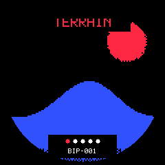

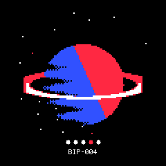

The host-side planet experiments then compared logical framebuffer sizes, Z-buffer depth, and mesh density before the firmware implementation began:


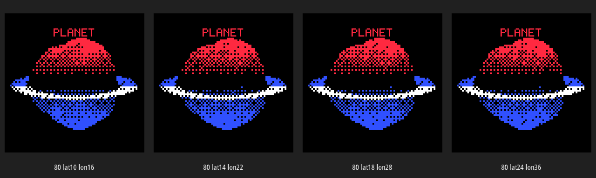

The first on-device planet proved that the pipeline worked, but it also taught us that a valid Z-buffer does not make a good shape by itself:

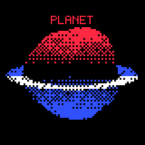

The next correction kept the silhouette spherical, although the later visual review reminded us that the black equatorial warm/cool split was an important part of the original look:


The terrain started much rougher. The first firmware terrain pass was technically alive but visually sparse:

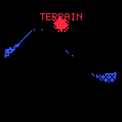

Host sweeps made the terrain problem analyzable:

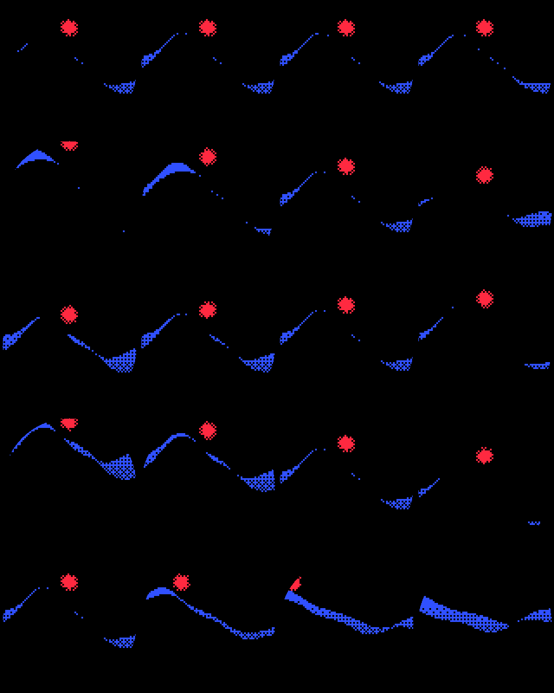

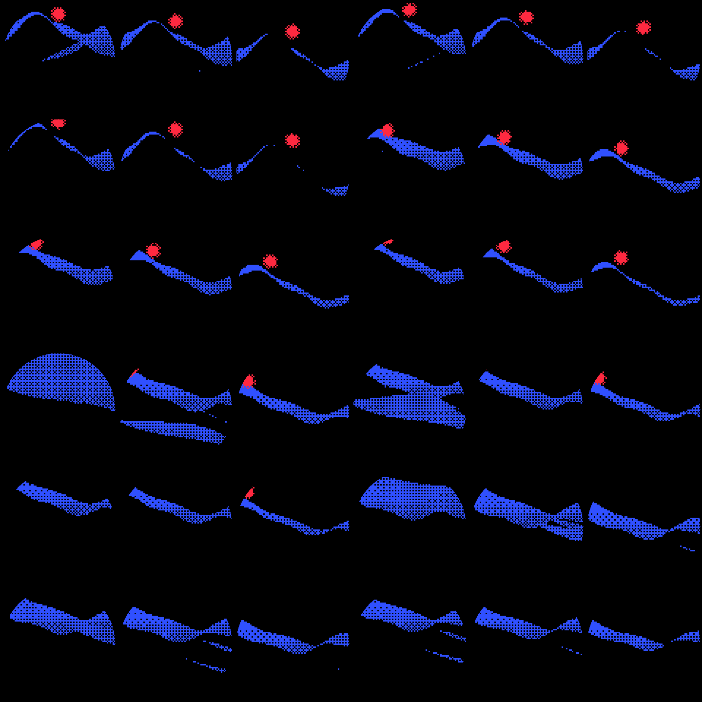

The first tuned firmware terrain capture is the current baseline:

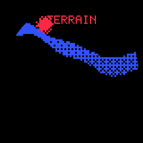

We even printed an almanach of the math and renders on the thermal printer. This mattered more than it sounds. A small physical print forces the design to be explained compactly: what buffers exist, what the projection math is, and which visual target matters first.

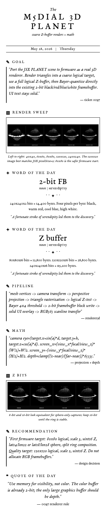

## The hardware problem in one table

The M5Dial is friendly to firmware experiments because it has a screen, a knob, a button, and USB Serial/JTAG. It is hostile to naive 3D rendering because it has no PSRAM. The screen is small, but a full-color software renderer still burns memory quickly.

| Resource | Project-relevant fact | Renderer consequence |
|---|---:|---|
| CPU | ESP32-S3 at 240 MHz | Triangle rasterization is possible if the logical target is small and loops yield occasionally. |
| PSRAM | None | Full RGB framebuffers and full-resolution Z-buffers are avoided. |
| Display | GC9A01, 240×240 round LCD | The physical display is circular even though the addressable memory is square. |
| Flash | 8 MB embedded, DIO | Code size and lookup tables are not the limiting resource. |
| Input | Rotary encoder and button | Camera orbit and palette control can be interactive. |
| Console | USB Serial/JTAG `esp_console` | Renderer parameters can be tested without reflashing. |

The fundamental memory decision is the same one that made the poster renderer successful: the final framebuffer is not RGB565. It is 2-bit indexed color.

```text
240 × 240 × 2 bits = 115,200 bits = 14,400 bytes
```

A full RGB565 framebuffer would be:

```text
240 × 240 × 16 bits = 921,600 bits = 115,200 bytes
```

Add a full-resolution 16-bit Z-buffer and the pair costs 230,400 bytes before queues, stacks, driver state, console, mesh storage, and temporary buffers. On a no-PSRAM ESP32-S3, that is the wrong starting point. The renderer therefore keeps the final framebuffer tiny and moves the true 3D work into a coarse logical target.

The current proper renderer uses:

| Buffer | Dimensions | Type | Bytes |
|---|---:|---:|---:|
| Final framebuffer | 240×240 | 2-bit indexed | 14,400 |
| Logical color buffer | 80×80 | 8-bit index | 6,400 |
| Logical Z-buffer | 80×80 | `uint16_t` | 12,800 |
| Total core image buffers | — | — | 33,600 |

That is the key. The renderer spends memory on visibility where it matters and keeps color cheap.

## The architecture

The firmware now has two renderer families. The poster renderer remains the stable default. The proper 3D renderer is selected explicitly from the console:

```text
backend poster
backend planet3d
backend terrain3d
```

The separation was intentional. The poster backend is a known-good product baseline; the proper renderer is an experimental backend that can crash, look strange, or be tuned without destroying the working experience.

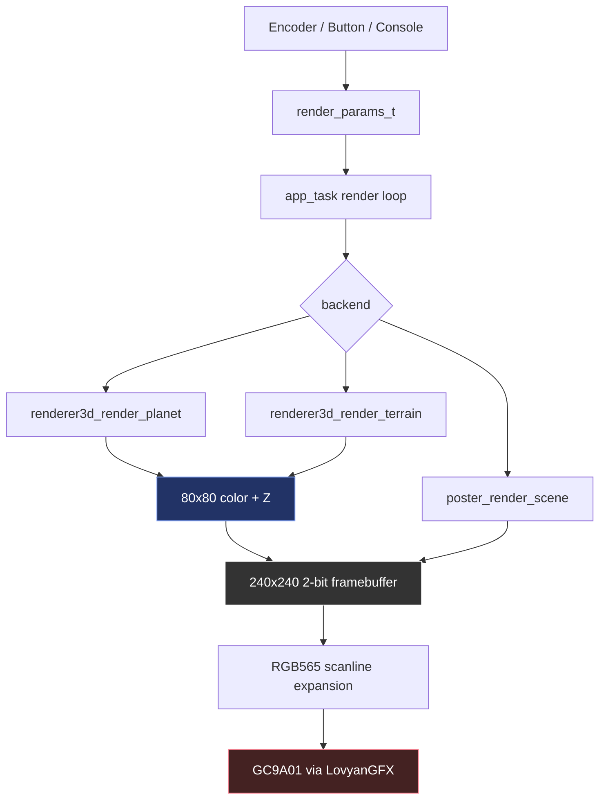

The public contract is in `renderer3d.h`:

```cpp
#define R3D_W 80
#define R3D_H 80
#define R3D_PIXEL_SCALE 3
#define R3D_Z_BITS 16

typedef struct {
    const char* scene_name;
    uint16_t logical_w;
    uint16_t logical_h;
    uint8_t pixel_scale;
    uint8_t z_bits;
    uint16_t mesh_vertices;
    uint16_t mesh_triangles;
    uint32_t triangles_submitted;
    uint32_t triangles_drawn;
    uint32_t planet_pixels;
    uint32_t terrain_pixels;
    uint32_t ring_pixels;
    uint32_t sun_pixels;
    uint32_t moon_pixels;
    uint32_t zbuffer_bytes;
    uint32_t colorbuffer_bytes;
    uint64_t render_time_us;
} renderer3d_stats_t;
```

The stats structure is not a vanity feature. It is how we know whether the renderer is failing because it has no visible vertices, because it submitted triangles that were clipped, because the quantizer erased fragments, because the ring pass is not drawing, or because the display transfer dominates the frame.

## The mathematical renderer, step by step

A software 3D renderer has a small number of responsibilities. Three.js hides these responsibilities behind a scene graph, a camera, a material system, and the GPU pipeline. Firmware must spell them out.

The current renderer performs this sequence:

1. Generate or select a mesh.
2. Build a camera basis from an orbit angle, distance, height, and target.
3. Project every vertex into logical screen coordinates.
4. Rasterize triangles into an 80×80 color buffer with a 16-bit Z-buffer.
5. Quantize interpolated color into one of four palette indices using a Bayer threshold.
6. Composite scene-specific analytic passes such as the planet ring or terrain sun.
7. Expand the 80×80 logical image into the 240×240 2-bit framebuffer.
8. Draw solid UI text after the dithered scene.
9. Expand scanlines to RGB565 and write them to the display.

The camera basis is the first real math step. For an orbiting camera, the eye position is:

```text
eye.x = sin(angle) * distance
eye.y = target_y + height
eye.z = cos(angle) * distance
```

The forward vector points from the eye to the target. The right vector is derived from world up and forward. The up vector is the cross product that completes the basis.

```cpp
float fx = -eye_x;
float fy = target_y - eye_y;
float fz = -eye_z;
normalize(fwd);

right = normalize(vec3(fwd.z, 0, -fwd.x));
up = cross(fwd, right);
```

Projection then transforms a world-space vertex into view-space coordinates and applies perspective:

```text
screen_x = (view_x * focal / view_z) * (W / 2) + W / 2
screen_y = -(view_y * focal / view_z) * (H / 2) + H / 2
```

The minus sign in `screen_y` is not incidental. Screen coordinates grow downward; view-space Y grows upward. Forgetting this sign does not produce a small error. It flips the rendered world.

Rasterization uses barycentric coordinates. For each triangle, compute a bounding box, test each pixel center, interpolate depth and color, and run the Z-test.

```text
for triangle in triangles:
    project vertices
    compute screen-space area
    for y in bbox_y:
        for x in bbox_x:
            w0, w1, w2 = barycentric(x + 0.5, y + 0.5)
            if outside: continue
            z = w0*z0 + w1*z1 + w2*z2
            if z >= zbuffer[x,y]: continue
            zbuffer[x,y] = z
            color = quantize(interpolate(vertex_colors), bayer[x,y])
            colorbuffer[x,y] = color
```

The current depth mapping is linear between a near and far plane:

```text
zn = clamp((z - near) / (far - near), 0, 1)
zi = int(zn * 65535 + 0.5)
```

Lower values are closer. The Z-buffer starts at `0xFFFF`, so any valid first fragment wins.

## Four colors are enough if the colors mean something

The renderer does not try to preserve RGB. It classifies color into four semantic indices:

| Index | Meaning | Typical use |
|---:|---|---|
| 0 | black | background, masked areas, thresholded-away pixels |
| 1 | warm | red sun, hot hemisphere, title text |
| 2 | cool | blue terrain, cold hemisphere, ring back half |
| 3 | high | white highlight, front ring, moon |

The quantizer applies contrast, compares red versus blue dominance, and gates the result with a 4×4 Bayer threshold.

```cpp
static uint8_t quantize(float r, float g, float b, int x, int y, float contrast) {
    r = clamp((r - 0.5f) * contrast + 0.5f, 0.0f, 1.0f);
    g = clamp((g - 0.5f) * contrast + 0.5f, 0.0f, 1.0f);
    b = clamp((b - 0.5f) * contrast + 0.5f, 0.0f, 1.0f);
    float t = bayer4[y & 3][x & 3] / 16.0f;

    if (r > 0.55f && g > 0.55f && b > 0.55f && lum > t) return COLOR_HIGH;
    if (r > b + 0.05f) return r > t ? COLOR_WARM : COLOR_BLACK;
    if (b > r + 0.05f) return b > t ? COLOR_COOL : COLOR_BLACK;
    if (lum > 0.25f && lum > t) return COLOR_COOL;
    return COLOR_BLACK;
}
```

This is not a photographic renderer. It is a symbolic renderer with thresholds. That is why the result can look clean on a tiny screen. It is also why some bugs are surprising. A mesh can be geometrically present, fully projected, and correctly Z-tested, while its interpolated color falls below the threshold and disappears.

## Why `80×80` won the first round

The host experiments compared logical resolutions: 40, 60, 80, 120, and 240. The browser shader's default `pixelSize = 2` corresponds visually to 120×120 expanded to 240×240. The firmware target started at 80×80 because it is cheaper and still recognizable.

| Logical target | Scale to 240 | Logical pixels | 16-bit Z bytes | Role |
|---:|---:|---:|---:|---|
| 40×40 | 6× | 1,600 | 3,200 | Too coarse except for iconic silhouettes. |
| 60×60 | 4× | 3,600 | 7,200 | Recognizable but chunky. |
| 80×80 | 3× | 6,400 | 12,800 | Best first firmware target. |
| 120×120 | 2× | 14,400 | 28,800 | Best JSX visual match. |
| 240×240 | 1× | 57,600 | 115,200 | Too expensive and less faithful to the pixelated target. |

The key judgment was not purely memory. `80×80` gives enough pixels for a ringed planet while keeping the Z-buffer small. `120×120` is the quality target once the algorithm is stable. Starting at `120×120` would have made every early bug more expensive to debug.

The host resolution sweep made this decision concrete:


The Z-bit comparison also mattered. For the first sphere body, 8-bit and 16-bit Z looked equivalent. We kept 16-bit anyway because the cost at 80×80 is only 12.8 KB and early debugging should not be complicated by depth precision artifacts.


This is a general embedded graphics rule: save memory after the picture is correct, not before.

## The planet renderer

The planet renderer started with the most bounded scene in `m5dial.jsx`. Terrain is large and camera-sensitive. Ocean has reflection and trails. Torus has more demanding geometry. Planet is centered, compact, and recognizable even at low resolution. That made it the correct first target for a real Z-buffered firmware renderer.

The host prototype generated a UV sphere:

```text
lat_steps = 18
lon_steps = 28
vertices  = (18 + 1) * 28 = 532
triangles ≈ 952
```

The firmware uses the same mesh size. Each vertex has a position and a color. The sphere body is real triangle geometry. The ring is currently an analytic split ellipse drawn in two passes:

1. Draw the back half of the ring into the logical color buffer.
2. Rasterize the planet sphere with Z.
3. Draw the front half of the ring over the sphere.
4. Draw the moon if visible.
5. Expand and draw title text.

This is not a true 3D ring mesh yet. It is a deliberate intermediate step. The original JSX target reads as a ringed planet; the host comparison without the ring was misleading. The split ring gave us the right composition while keeping the first firmware milestone focused on sphere projection and rasterization.

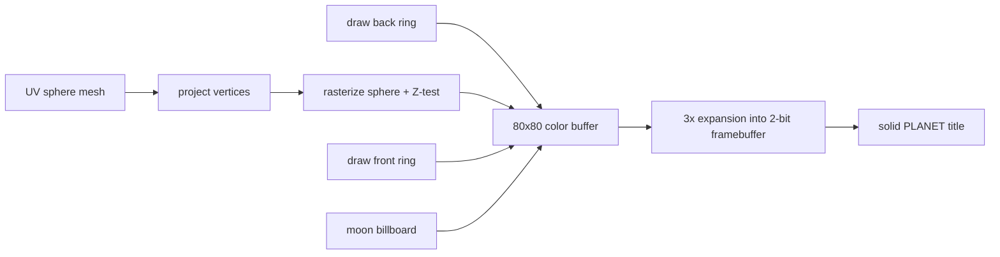

The first hardware result was exciting because it proved the architecture. It was also wrong enough to be useful:


The stats from the first successful renderer were already good:

```text
R3D: 80x80 scale=3 z=16-bit render=21032 us (47.5 FPS render-only)
Buffers: z=12800 bytes color=6400 bytes fb=14400 bytes
Mesh: 532 vertices, 952 triangles
Triangles: 952 submitted, 533 drawn
Pixels: planet=2080 ring=369 moon=0

Frame time: 33920 us (29.5 FPS)
```

At this point performance was not the problem. The picture was the problem.

## The misshapen planet bug

The first planet looked pinched and lumpy. It was tempting to blame Z precision because the project had just been framed as a Z-buffer renderer. That diagnosis was wrong.

Z precision answers one question: if two fragments want the same pixel, which one is closer? It does not decide whether the mesh is spherical. It does not decide whether a color survives a Bayer threshold. It does not decide whether a ring overlay hides a band of the body.

The first implementation used procedural noise as radial displacement:

```text
position = unit_sphere_position * (radius * (1.0 + noise * 0.5))
```

At high resolution this might read as surface relief. At 80×80, it damaged the silhouette. The corrected version kept the mesh spherical:

```text
position = unit_sphere_position * radius
```

and used noise only for color texture:

```text
color = latitude_gradient + procedural_texture
```

The second issue was color density. A pure warm/cool latitude split left black near the equator because both red and blue terms were weak there. The spherical correction added a density floor so more of the body survived quantization:

```text
lat01 = clamp(latitude * 0.5 + 0.5, 0, 1)
red   = 0.18 + lat01 * 0.74 + texture
blue  = 0.18 + (1 - lat01) * 0.74 - texture * 0.35
```

That made the silhouette rounder:


The user feedback after that correction was important: the warm/cool split with black in the middle was good. That is the right aesthetic target. The correct engineering conclusion is not "always add a density floor." The correct conclusion is that **silhouette geometry and color distribution must be controlled independently**. We need a spherical body that still permits the equator to be artfully black. That means future planet tuning should preserve a clean geometric disk while reintroducing the black warm/cool equator as a deliberate shading rule, not as an accidental consequence of weak colors.

The lesson is precise:

| Symptom | Not enough to change | Better diagnosis |
|---|---|---|
| Lumpy boundary | Z bits | Vertex positions / radial noise |
| Missing equator | Z bits | Color thresholds / Bayer quantization |
| Wrong ring ordering | Color ramp | Composition order or true ring geometry |
| Blockiness | Mesh density alone | Logical framebuffer size |

## The terrain renderer

Terrain looked simpler at first because the JSX code is straightforward. It builds a `40×40` plane with `80×80` subdivisions, displaces it by noise, colors it blue by height, rotates it into world space, and adds a red sun.

The relevant JSX logic is compact:

```js
const geo = new THREE.PlaneGeometry(40, 40, 80, 80);
for (let i = 0; i < positions.count; i++) {
  const x = positions.getX(i);
  const y = positions.getY(i);
  let h = noise2d(x * 0.4, y * 0.4) * 4.5;
  const distC = Math.sqrt(x * x + y * y);
  h += (1.0 - Math.min(1.0, distC / 8)) * -1.0;
  positions.setZ(i, h);

  const t = Math.max(0, Math.min(1, (h + 2) / 6));
  colors[i * 3 + 0] = 0.04 + t * 0.15;
  colors[i * 3 + 1] = 0.06 + t * 0.20;
  colors[i * 3 + 2] = 0.25 + t * 0.65;
}
geo.rotateX(-Math.PI / 2);
```

The firmware terrain backend mirrors the noise and color idea but reduces and fits the world:

```text
grid    = 32 × 32
verts   = 1024
tris    = 1922
extent  = 14 units initially fitted for the round display
camera  = distance 11, tuned height and target
```

The first firmware terrain output was technically valid and visually unsatisfying:


The renderer submitted 1,922 triangles, but only a small number contributed visible fragments. That did not mean the mesh was too small. It meant the camera and projection were poor for the physical viewport.

The first live stats made that visible:

```text
R3D terrain: 80x80 scale=3 z=16-bit render=17296 us (57.8 FPS render-only)
Buffers: z=12800 bytes color=6400 bytes fb=14400 bytes
Mesh: 1024 vertices, 1922 triangles
Triangles: 1922 submitted, 28 drawn
Pixels: terrain=162 sun=60
```

Only 28 drawn triangles out of 1,922 is not a rasterizer performance problem. It is a view problem.

## Why host-side tests became necessary

Firmware iteration is slow when the variable is visual composition. The loop is:

```text
change constants -> build -> flash -> wait for boot -> run console commands -> dumpfb -> decode PNG -> inspect image
```

That loop is fine for validating hardware. It is bad for exploring a camera space. Terrain has too many camera-sensitive variables:

- terrain extent,
- camera distance,
- camera height,
- target height,
- yaw angle,
- optional orientation correction,
- backface culling,
- contrast,
- color ramp.

The script `03-host-terrain-renderer-tests.py` mirrors the firmware terrain algorithm in Python. It can run unit tests, render one configuration, or generate sweep artifacts.

```bash
python3 scripts/03-host-terrain-renderer-tests.py test
python3 scripts/03-host-terrain-renderer-tests.py render --out /tmp/terrain.png
python3 scripts/03-host-terrain-renderer-tests.py sweep --out-dir artifacts/terrain-host-analysis
```

The tests are modest but important:

- noise is deterministic,
- mesh counts match expectations,
- the fitted extent renders visible terrain,
- the large JSX extent projects far outside the first firmware camera.

The first sweep varied one parameter at a time. It produced this montage:


The focused sweep varied angle, height, and target height together. That produced the useful candidates:


The top candidates by terrain pixel count were:

```text
a0.8-h1.4-ty-1  terrain_pixels=3731 triangles_drawn=551
a1.2-h1.4-ty-1  terrain_pixels=2347 triangles_drawn=653
a0.8-h2.2-ty-1  terrain_pixels=1989 triangles_drawn=432
a1.2-h2.2-ty-1  terrain_pixels=1635 triangles_drawn=547
a1.2-h1.4-ty0   terrain_pixels=1459 triangles_drawn=517
a0.8-h1.4-ty0   terrain_pixels=1428 triangles_drawn=409
```

The highest-fragment candidate was not necessarily the best picture. Some candidates removed the sun or shoved it into the title area. The selected first firmware tune was more conservative:

```text
angle offset = 0.4 radians
camera height = 1.4
target_y = 0.0
distance = 11.0
```

The result is this current on-device baseline:


The tuned stats are healthier:

```text
R3D terrain: 80x80 scale=3 z=16-bit render=21868 us (45.7 FPS render-only)
Buffers: z=12800 bytes color=6400 bytes fb=14400 bytes
Mesh: 1024 vertices, 1922 triangles
Triangles: 1922 submitted, 326 drawn
Pixels: terrain=675 sun=58

Frame time: 34821 us (28.7 FPS)
Mode: triangle
Triangles: 1922 submitted, 326 drawn
Pixels written: 733
```

There is still a composition issue: the red sun and red `TERRAIN` title overlap. The host sweep solved the first view problem; the next pass needs UI safe areas and scene-specific layout rules.

## Comparing firmware terrain to JSX terrain

The firmware terrain is not a literal port of the JSX terrain. It preserves the mathematical identity of the scene but changes the scale and development workflow.

| Aspect | JSX | Firmware terrain3d |
|---|---|---|
| Runtime | Three.js + WebGL | ESP-IDF C++ software renderer |
| Mesh | 40×40 plane, 80×80 subdivisions | 14-unit fitted plane, 32×32 grid |
| Height | `noise2d(x*.4, y*.4)*4.5` plus center valley | Same formula, lower mesh resolution |
| Color | blue by height in RGB | blue by height then four-color quantization |
| Camera | Three.js camera, GPU projection | explicit orbit basis and perspective projection |
| Dither | GLSL post-process | firmware Bayer threshold during rasterization |
| Display | browser canvas | 2-bit framebuffer expanded to GC9A01 |

The most important divergence is extent. JSX can show a 40×40 plane because the browser camera and canvas are flexible and the GPU has no trouble processing a large grid. The M5Dial version renders into an 80×80 logical buffer and then shows it through a circular physical mask. A literal 40-unit terrain initially produced mostly clipped edge fragments. The host tests preserved that failure as evidence rather than erasing it.

This is the difference between porting code and porting a scene. Porting code says: keep the constants. Porting a scene says: preserve the visual relationship under the target machine's constraints.

## Debugging through `dumpfb`

The most valuable tool in the project is not the renderer. It is the screenshot loop.

The firmware command `dumpfb` prints the packed 2-bit framebuffer over USB Serial/JTAG:

```text
DUMPFB_BEGIN width=240 height=240 bpp=2 bytes=14400 palette=classic
PALETTE 0000 F945 4A7F FFFF
ROW 000 ...
ROW 001 ...
...
DUMPFB_END
```

The host script captures this output and reconstructs a PNG. This gives us a device-grounded image without taking a camera photo of the LCD. It validates the framebuffer, palette indices, geometry, dither pattern, and UI overlay before the final RGB565 scanline transfer.

The workflow is:

```bash
python3 ttmp/2026/05/27/0096--m5dial-dithered-3d-scene-viewer/scripts/03-capture-dumpfb.py \
  --port /dev/ttyACM0 \
  --setup "backend terrain3d" \
  --setup "debug off" \
  --setup "angle 0" \
  --out artifacts/device-terrain3d-tuned.png
```

The serial behavior has a sharp edge: opening the USB Serial/JTAG port can reset the board. That means every capture script must reapply setup commands in the same session before dumping the framebuffer. Otherwise the screenshot may come from the default poster backend, not the backend you think you are testing.

This exact issue also appeared while querying stats. A fresh serial session reset the board, and `r3dstats` initially reported empty data because the selected backend had returned to default. The fix was not code; it was procedure: send `backend planet3d` or `backend terrain3d`, trigger a redraw, then query stats in the same session.

## The console is part of the renderer

A renderer without runtime controls is a compile-time guess. The firmware exposes commands because the device is the only final judge of the image.

Current useful commands include:

```text
backend [poster|planet3d|terrain3d]
heap
allocprobe <bytes>
r3dstats
fps
angle <radians>
rotate <speed>
contrast <value>
aperture <pct>
palette <classic|inverted|red|blue|amber>
dumpfb
```

The `heap` and `allocprobe` commands exist because memory decisions must be measured on the actual board. The M5Dial does not care what the data sheet says after ESP-IDF, USB, console, display, queues, stacks, and driver state are all live.

Typical heap after the renderer is active:

```text
Heap INTERNAL|8BIT free≈252 KB
largest block≈180 KB
```

That is enough headroom for the current 80×80 renderer. It is also why 120×120 remains plausible but should be tested carefully. At 120×120 the Z-buffer alone becomes 28.8 KB and the logical color buffer becomes 14.4 KB. The buffers are still reasonable, but the pixel and triangle work increases.

## What went wrong, and what each failure taught

The project produced several useful failures. Each one narrowed the renderer's design.

### Failure: the first full triangle renderer was too fragile for product visuals

The earlier 0096 firmware had a triangle-major renderer. It built and displayed something, but it created flicker, watchdog pressure, and stack concerns. Moving projected vertex arrays out of task stack and yielding in triangle loops helped, but the user-facing result became the poster renderer while the proper 3D design was moved into 0097.

The lesson was that a renderer must be organized around the device's loop timing, not only around mathematical correctness.

### Failure: `COMPONENT_DIRS` broke ESP-IDF component discovery

A misleading build error claimed `nvs_flash` could not be resolved for LovyanGFX. The real cause was a project CMake override:

```cmake
set(COMPONENT_DIRS "components" CACHE STRING "Component search dirs")
```

That hid built-in ESP-IDF components. Removing it fixed discovery. The lesson was that ESP-IDF's component model is easy to break by overriding global search variables.

### Failure: wrong LovyanGFX pixel API caused display trouble

The broken call was:

```cpp
display.pushColors(reinterpret_cast<uint8_t*>(ctx->rgb565_line), FB_WIDTH * 2);
```

The correct call was:

```cpp
display.writePixels(ctx->rgb565_line, FB_WIDTH);
```

Then `display.setSwapBytes(true)` fixed byte order for host-order RGB565 values. The lesson was that framebuffer correctness and bus-format correctness are separate layers.

### Failure: the first planet looked wrong even with 16-bit Z

The cause was not depth. It was radial noise plus quantization. The lesson was to classify visual bugs by pipeline stage.

### Failure: first terrain output had too few visible fragments

The cause was camera framing and terrain scale. The lesson was to build host sweeps before tuning firmware constants.

## The current implementation sequence

The work landed in focused milestones:

| Commit | Purpose |
|---|---|
| `320e57a` | Initial 0097 design docs and host planet prototype. |
| `87de29f` | Host buffer comparison artifacts and reports. |
| `6b3fa95` | Renderer backend selection and heap diagnostics. |
| `66ec490` | First proper 3D planet backend. |
| `3b45dea` | First firmware planet capture and diary. |
| `870cdd2` | Spherical silhouette correction for planet. |
| `f093d32` | Spherical planet analysis report. |
| `e8ccd82` | Experimental terrain3d backend. |
| `6292114` | Host terrain renderer tests and sweep artifacts. |
| `9d1a397` | Terrain camera tuning from focused host sweep. |

This sequence matters because each commit isolates a different kind of decision: documentation, host experiment, console controls, renderer implementation, device evidence, analysis, terrain expansion, host testing, and firmware tuning.

## The algorithm as a rebuildable recipe

If you wanted to rebuild the current renderer from scratch, the minimal recipe is this:

1. Allocate a 240×240 2-bit framebuffer.
2. Allocate an 80×80 `uint8_t` logical color buffer.
3. Allocate an 80×80 `uint16_t` Z-buffer.
4. Generate a low-poly mesh for the scene.
5. Build an orbit camera basis.
6. Project vertices into 80×80 logical coordinates.
7. Rasterize triangles with barycentric interpolation.
8. Store depth in the Z-buffer and palette index in the color buffer.
9. Apply scene-specific overlays: ring, moon, sun.
10. Expand each logical pixel into a 3×3 block in the final 2-bit framebuffer.
11. Draw solid text after the scene.
12. Expand 2-bit scanlines to RGB565 and stream them to the LCD.

The core rasterizer shape is:

```text
clear colorbuf to BLACK
clear zbuf to FAR

for triangle in mesh:
    if any vertex not visible: continue
    compute signed screen area
    if culling and wrong winding: continue
    bbox = clipped triangle bounding box

    for each pixel center in bbox:
        compute barycentric weights
        if outside: continue
        z = interpolate depth
        if z >= zbuf[pixel]: continue
        zbuf[pixel] = z
        rgb = interpolate vertex color
        colorbuf[pixel] = bayer_quantize(rgb, x, y)
```

Then expansion is intentionally simple:

```text
for ly in 0..79:
    for lx in 0..79:
        color = colorbuf[ly,lx]
        for yy in 0..2:
            for xx in 0..2:
                fb_set(lx*3+xx, ly*3+yy, color)
```

This is not the fastest possible renderer. It is the first correct-enough renderer whose behavior is easy to inspect.

## What is still open

The renderer is now real, but it is not finished.

### Planet open questions

The planet should combine the best of two versions: the corrected spherical geometry and the earlier black equatorial warm/cool split. The black band was visually good. The next planet pass should make that band deliberate while keeping the silhouette spherical.

The ring should eventually become either:

- an explicit design choice as a split analytic composition, or
- a true 3D strip mesh with Z-tested occlusion.

The split analytic ring is good enough for the current look. A true ring mesh would make the renderer more general.

### Terrain open questions

The terrain needs UI safe areas. The title and sun currently overlap. We need to decide whether to move the title, move the sun, mask the sun out of the title band, or adopt a scene-specific composition rule.

The terrain camera should become a console-tunable preset system:

```text
terrainpreset 0
terrainpreset 1
terraincam <angle-offset> <height> <target-y> <distance>
```

That would remove the remaining reflashing loop from terrain tuning.

The terrain may also need a hybrid approach. A pure mesh terrain is mathematically satisfying, but the poster renderer proved that art-directed screen-space shapes can be stronger on this display. A future terrain renderer may use a real height mesh for motion and a poster-like foreground treatment for composition.

### Resolution open questions

The 120×120 target remains the visual quality target. It costs:

```text
120 × 120 × 2 bytes = 28,800 bytes of Z
120 × 120 × 1 byte  = 14,400 bytes of color
```

That is still plausible. The question is CPU and display value: does 120×120 look enough better on the physical GC9A01 to justify the added work?

## Working rules that came out of the project

The project produced a set of practical rules that apply beyond this renderer.

- Start with a small logical framebuffer. Increase resolution after the pipeline is correct.
- Keep the final framebuffer indexed if the art style only needs a few semantic colors.
- Use 16-bit Z first when the memory cost is modest. Optimize depth precision later.
- Do not diagnose every visual problem as a Z-buffer problem.
- Build host renderers for parameter sweeps, but validate final output with device captures.
- Save ad-hoc scripts into the ticket `scripts/` directory as soon as they produce a useful result.
- Treat screenshots as tests. If a renderer is visual, a PNG artifact is evidence.
- Keep a stable fallback backend while experimental renderers evolve.
- Make the console part of the renderer architecture, not an afterthought.
- Separate geometry, color, quantization, composition, and UI passes when debugging.

## The entertaining part, stated technically

The delightful part of this project is that the renderer is small enough to understand and constrained enough to resist vague thinking. Every wrong picture had a specific cause. A lumpy planet was not a philosophical problem; it was a radius equation. A missing terrain was not a mysterious rendering failure; it was a camera and clipping problem. A greenish display was not a palette issue; it was RGB565 byte order. A slow loop was not cured by hope; it needed smaller buffers, fewer pixels, and device measurements.

That is what makes embedded graphics satisfying. The machine is small, so explanations must become precise. The screen is small, so every pixel has a job. The result is a renderer that teaches its own architecture: memory layout, projection, rasterization, depth, quantization, composition, and I/O are all visible in the final image.

## Near-term next steps

1. Add terrain camera presets or a `terraincam` console command.
2. Capture 4–6 terrain camera variants on-device without reflashing.
3. Fix terrain title/sun safe-area overlap.
4. Restore the preferred planet black equatorial split while keeping spherical geometry.
5. Test a 120×120 build profile for planet only.
6. Decide whether the planet ring remains analytic or becomes a true 3D strip.
7. Write a smaller implementation guide once the terrain composition stabilizes.

The current renderer has crossed the threshold from idea to firmware. It renders real triangles into a real Z-buffer on a no-PSRAM M5Dial, exports its framebuffer over the console, and can be compared against host simulations. The remaining work is not to prove that the renderer can exist. It can. The remaining work is to make the scenes worth staring at.
