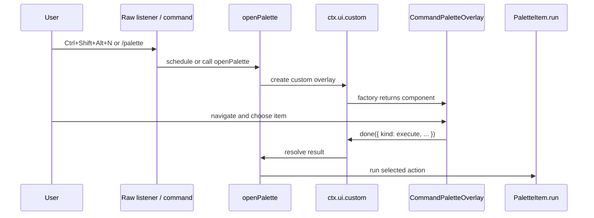

# Pi Agent Command Palette Extension Architecture: Shared Registry and Keyboard-Driven Actions

This is the shared command-palette branch of the [[pi-extensions]] project map.

This note explains the command palette extension in the Pi extensions repository. It is not only a description of one shortcut. It is a reusable architecture for collecting extension-owned actions into a shared registry, building a hierarchical palette from those contributions, rendering that palette as a Pi TUI overlay, and executing selected actions through a stable callback contract.

> [!summary]
> - Extensions contribute `PaletteItem` trees through `registerPiExtension()`; the palette does not hard-code per-extension actions.
> - The root palette groups contributions by extension, then assigns local single-key hints per level.
> - `CommandPaletteOverlay` owns navigation, filtering, rendering, and result selection; it does not execute extension code directly.
> - The extension entry point handles shortcuts, raw terminal input, mount-window buffering, overlay invocation, and execution after the overlay closes.

## Why this note exists

The command palette is a small feature with several architectural boundaries. It touches the extension registry, launcher, shared UI components, Pi TUI component contract, terminal shortcut handling, and action execution. Future developers need to know where those responsibilities begin and end before adding new palette items or changing shortcut behavior.

The command palette also shows the preferred extension framework style in this repository: an extension describes itself once through `registerPiExtension()`, and several UI surfaces reuse that registration. The launcher can discover it. The dashboard can show it. The command palette can invoke it. Documentation can refer to the same metadata.

## When to use this pattern

Use this pattern when building an extension feature that should be:

- discoverable by a launcher or dashboard
- invokable through a keyboard-driven menu
- organized by owning extension rather than a global flat command list
- extensible without editing the central palette code for every new action
- safe to call from both slash commands and keyboard shortcuts

Avoid this pattern when the feature is a single private command with no reusable metadata and no need for keyboard navigation. In that case, a normal slash command is simpler.

## Architecture overview

The command palette is built from four contracts: registration, collection, rendering, and execution.

```mermaid
flowchart TD
    ExtA[Extension A registerPiExtension] --> Registry[Shared registry]
    ExtB[Extension B registerPiExtension] --> Registry
    Registry --> Collect[collectPaletteItems]
    Collect --> Root[buildRootPaletteItems]
    Root --> Overlay[CommandPaletteOverlay]
    Overlay --> Result[PaletteResult]
    Result --> Runner[command-palette index.ts]
    Runner --> Action[Selected PaletteItem.run]

    Shortcut[Ctrl+Shift+Alt+N or /palette] --> Runner
    Launcher[/px launcher] --> Overlay

    style Registry fill:#d9ecff,stroke:#2f6db0
    style Overlay fill:#e1ffd9,stroke:#3c8c2f
    style Action fill:#fff0cc,stroke:#a87900
```

Each layer has a single job.

| Layer | Responsibility |
| --- | --- |
| Extension registration | Describe extension metadata and contributed palette items. |
| Shared registry | Store and return all registered extension metadata. |
| Palette item collection | Convert all contributed items into an extension-grouped root tree. |
| Overlay component | Render the tree, handle keyboard navigation, and return a result. |
| Command palette extension | Open the overlay, manage shortcut input, and run the selected action. |

This separation keeps the palette generic. The palette can show any extension that contributes `palette` metadata, and an extension can add palette actions without importing the palette extension.

## Core registry contract

Every extension in this repository should call `registerPiExtension()` from `extensions/_shared/registry.ts`. The registration object is the extension’s public description.

```ts
export interface PiExtensionRegistration {
  id: string;
  name: string;
  description: string;
  commands?: string[];
  tags?: string[];
  run?: PiExtensionActionHandler;
  actions?: PiExtensionAction[];
  docs?: PiExtensionDoc[];
  settings?: PiExtensionSettingsContribution;
  widgets?: PiDashboardWidget[];
  palette?: PaletteItem[];
}
```

The command palette cares primarily about `palette?: PaletteItem[]`.

```ts
export interface PaletteItem {
  id: string;
  title: string;
  description?: string;
  key?: string;
  tags?: string[];
  children?: PaletteItem[];
  run?: PaletteActionHandler;
}
```

A `PaletteItem` is a tree node. If it has `children`, activation enters a submenu. If it has `run`, activation returns an execute result that the command palette extension will invoke after the overlay closes. A node can technically have both, but the UI should treat child navigation as dominant because a visible submenu is a stronger user expectation than immediate execution.

## Adding palette actions to an extension

A typical extension contribution looks like this:

```ts
registerPiExtension({
  id: "my-extension",
  name: "My Extension",
  description: "Demonstrates palette actions.",
  commands: ["my-extension"],
  tags: ["example"],
  palette: [
    {
      id: "open",
      title: "Open",
      description: "Open the main view.",
      key: "o",
      run: async (ctx) => {
        await openMainView(ctx);
      },
    },
    {
      id: "settings",
      title: "Settings",
      description: "Configure the extension.",
      key: "s",
      children: [
        {
          id: "edit",
          title: "Edit Settings",
          key: "e",
          run: async (ctx, paletteContext) => {
            await openSettings(ctx, paletteContext.path);
          },
        },
      ],
    },
  ],
});
```

The extension owns its titles, descriptions, keys, tags, hierarchy, and action handlers. The palette owns presentation and navigation.

## Root palette construction

The raw registry returns many `{ extension, item }` pairs. The command palette groups them by owning extension so the root level remains stable and comprehensible.

```ts
const paletteItems = collectPaletteItems();
const rootItems = buildRootPaletteItems(paletteItems);
```

The root entry for an extension is synthesized from extension metadata:

```ts
const rootItem: PaletteItem = {
  id: extension.id,
  title: extension.name,
  description: extension.description,
  children: items,
};
```

This means a user first chooses an extension, then chooses an action inside that extension. It prevents different extensions from competing for a single global key namespace. One extension can use `o` for `Open`; another can also use `o` inside its own submenu.

## Local key assignment

Key hints are assigned per sibling list. The helper `assignKeys()` implements a deterministic priority order:

1. Use explicit `item.key` values first.
2. Assign unused alphanumeric characters from each item title.
3. Assign fallback keys from `abcdefghijklmnopqrstuvwxyz0123456789`.

Duplicate explicit keys at the same level are an error because they make the UI ambiguous. Duplicate keys across different levels are valid because the active stack level determines the current key map.

```ts
export function assignKeys(items: PaletteItem[]): KeyedPaletteItem[] {
  const taken = new Set<string>();
  const result: KeyedPaletteItem[] = [];

  // 1. explicit keys
  // 2. title-derived keys
  // 3. fallback keys

  return result;
}
```

Filtering is intentionally simple. `filterKeyedItems()` lowercases the query and searches over ID, title, description, and tags. This makes behavior predictable. Fuzzy ranking can be introduced later if needed, but it should not change the basic ownership and execution contracts.

## Overlay component internals

`CommandPaletteOverlay` implements the Pi TUI component contract.

```ts
export class CommandPaletteOverlay implements Component {
  render(width: number): string[];
  handleInput(data: string): void;
  invalidate(): void;
}
```

The overlay state has five important parts:

| State | Role |
| --- | --- |
| `stack` | The current hierarchy of palette levels. |
| `cursor` | The selected visible row in the current level. |
| `query` | The active local search query. |
| `searchActive` | Whether printable characters search or activate direct keys. |
| `pathIds` | Machine-readable IDs from root to current item for action context. |

The stack is the central concept. Root level contains one entry per extension. Activating a submenu pushes a new level. Going back pops a level. Selecting an executable item returns a `PaletteResult`.

```ts
export type PaletteResult =
  | { kind: "execute"; extension: PiExtensionRegistration; item: PaletteItem; path: string[] }
  | { kind: "cancel" };
```

The overlay does not call `item.run()`. It returns data. This is important because `ctx.ui.custom()` should finish and close the overlay before arbitrary extension code runs. Running extension actions outside the component also makes the component easier to test and reason about.

## Keyboard model

Inside the overlay, keys are interpreted relative to the current level.

| Input | Behavior |
| --- | --- |
| `Esc` | Close the palette, or leave search mode if search is active. |
| `/` | Enter search mode. |
| `Backspace` | Delete a search character, or go back one level outside search. |
| `Ctrl+U` | Clear the search query. |
| `Left` | Go back one level. |
| `Up` / `Down` | Move the cursor. |
| `Enter` | Activate the selected visible item. |
| printable key | Activate matching key hint; in search mode, append to query if no key match exists. |

The order of interpretation matters. Direct key activation is the fast path. Search mode is explicit. This prevents a normal key hint such as `p` from being treated as a search query at the root unless the user has entered search mode.

## Rendering model

The overlay renders a bounded panel. It derives a modal width from the available terminal width, builds a breadcrumb title from the stack, renders visible rows, and adds a footer that explains the active controls.

```text
┌─ Command Palette / Pinned Skills ─────────────────────────┐
│ ▸ p  Preview prompt block                                 │
│   s  Settings                                             │
│   r  Reload skills                                        │
│                                                           │
│ ← Back    Esc Close    / Search    ↑↓ Navigate            │
└───────────────────────────────────────────────────────────┘
```

Rows include a cursor marker, key hint, title, optional submenu arrow, and description when space allows. The component uses visible-width helpers because ANSI styling changes byte length but not terminal cell width. Any rendered line that exceeds the available width can corrupt the terminal layout, so width discipline is part of correctness, not just presentation.

## Opening pipeline

The command palette can be opened by `/palette`, by the registered extension action, by the raw terminal shortcut, by the registered shortcut fallback, or by the launcher. The production shortcut default is now:

```text
Ctrl+Shift+Alt+N
```

The environment override surface is:

```bash
PI_COMMAND_PALETTE_SHORTCUT=ctrl+space pi
PI_COMMAND_PALETTE_EXTRA_SHORTCUTS=ctrl+space,ctrl+shift+alt+n pi
PI_COMMAND_PALETTE_DEBUG=1 pi
```

The raw shortcut path uses a scheduled open:

```ts
function scheduleOpenPalette(ctx: ExtensionCommandContext, source: string): void {
  if (paletteOpen || paletteOpenScheduled) return;
  pendingOpeningInputs = [];
  paletteOpenScheduled = true;

  setImmediate(() => {
    paletteOpenScheduled = false;
    void openPalette(ctx, source);
  });
}
```

`openPalette()` guards reentrancy and resets mount state. `openPaletteOnce()` collects registered palette items, builds root items, mounts `CommandPaletteOverlay` with `ctx.ui.custom()`, and executes the selected action when the custom UI promise resolves.



## Mount-window buffering

The command palette supports fast follow-up input. A user may press the open shortcut and then immediately press a palette key. The raw listener can receive that second input before the overlay has focused. The extension stores only safe replayable input during this window.

```ts
if (paletteOpenScheduled || (paletteOpen && !paletteInputReady)) {
  if (shouldReplayOpeningInput(data)) {
    pendingOpeningInputs.push(data);
  }
  return { consume: true };
}
```

The replay list should stay conservative. Printable characters, Enter, Escape, Backspace, and plain arrow sequences are safe. Arbitrary CSI-u key release sequences are not safe because they can be protocol artifacts rather than deliberate user input. This distinction matters in Kitty keyboard protocol sessions, where physical key release events can arrive as semantic-looking escape sequences.

## Debugging and diagnostics

The command palette includes `/palette-debug` commands and writes debug events to:

```text
/tmp/pi-command-palette-debug.log
```

Useful commands:

```text
/palette-debug on
/palette-debug tail
/palette-debug status
/palette-debug clear
/palette-debug off
```

The status output should show active shortcuts and the override environment variables. A useful debug trace records whether the raw listener was installed, whether input arrived, which shortcut matched, whether the open was scheduled, whether the component factory ran, whether the overlay handle focused, whether buffered input was replayed, and whether an action result was returned.

## Developer working rules

- Add palette actions through `registerPiExtension({ palette: [...] })`, not by editing the central palette for each extension.
- Keep explicit keys unique within one sibling list.
- Prefer short, stable item IDs because they become part of `path` metadata.
- Keep action handlers independent of UI rendering; they should run from context and palette metadata.
- Do not run extension action code directly inside `CommandPaletteOverlay`.
- Use `ctx.ui.custom()` result handling as the execution boundary.
- Keep raw terminal listeners narrow and unsubscribe them on session shutdown.
- Avoid terminal-reserved default shortcuts; expose environment overrides for local preferences.
- Use slash commands as reliable fallbacks for keyboard-only features.

## Important source locations

- Source repo: `/home/manuel/code/wesen/2026-04-21--pi-extensions`
- Command palette extension: `extensions/command-palette/index.ts`
- Command palette overlay: `extensions/_shared/ui/command-palette.ts`
- Palette key helpers: `extensions/_shared/ui/palette-keys.ts`
- Shared registry: `extensions/_shared/registry.ts`
- Launcher integration: `extensions/launcher/index.ts`
- Extension framework guide: `docs/pi-shared-extension-framework-guide.md`

## Related notes

- [[ARTICLE - Pi Agent Modals and Terminal Shortcuts - Debugging Overlay Shortcut Behavior]]
