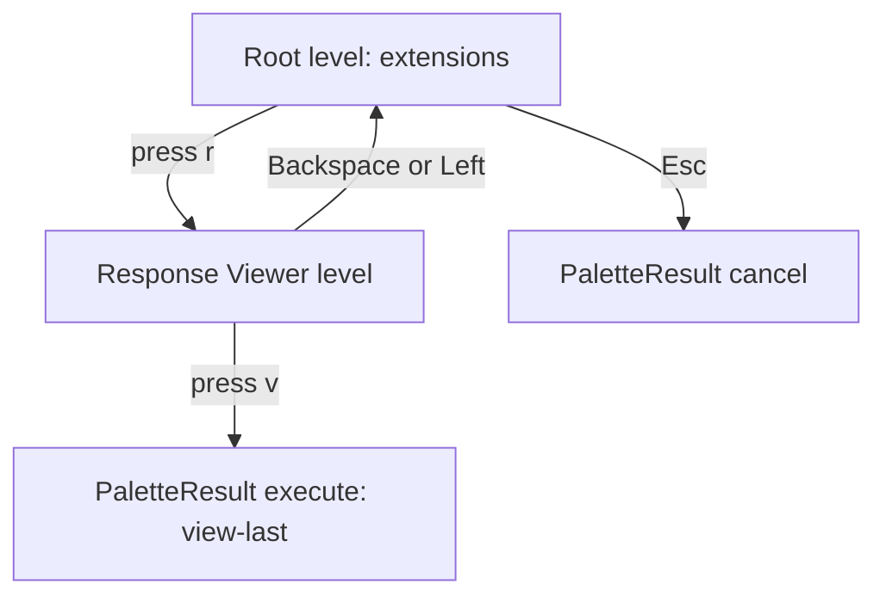
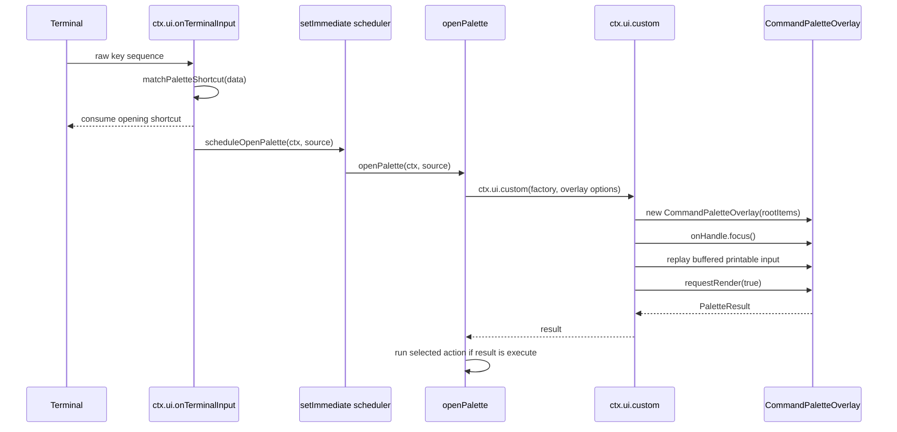

# Pi Agent Modals and Terminal Shortcuts: Project Report on the Command Palette Investigation

This report explains the work done to build and debug a keyboard-opened command palette for Pi extensions. It is written as a technical deep dive rather than a changelog. The goal is to make the system understandable to a developer who did not participate in the debugging session: what was built, why it was structured that way, which failures occurred, how those failures were isolated, and what rules should guide future Pi modal shortcut work.

The immediate feature was a command palette: a hierarchical keyboard menu that opens from a shortcut and executes extension-defined actions. The immediate bug was that the intended shortcut, `Ctrl+Shift+P`, did not reliably open the palette in Kitty/tmux. The final result is broader than a shortcut change. We now have a shared palette contribution contract, a production palette overlay, raw terminal shortcut handling, structured debug logging, a minimal modal-shortcut lab, terminal probing scripts, and a safer production default shortcut: `Ctrl+Shift+Alt+N`.

> [!summary]
> - The command palette became a new speed layer in the local Pi extension framework: extensions contribute `PaletteItem` trees, and the palette renders them as a hierarchical TUI overlay.
> - The first implementation problem was architectural: the root menu needed to group actions by extension rather than flatten all actions into one global list.
> - The later failures were terminal and lifecycle failures: raw shortcut delivery, overlay mount timing, render flushing, buffered input replay, and Kitty-reserved key chords.
> - The investigation stabilized when we stopped patching the production palette directly and built `extensions/modal-shortcut-lab`, a minimal isolated test extension that opens the same modal through progressively more complex entry paths.
> - The production default moved from `Ctrl+Shift+P` to `Ctrl+Shift+Alt+N` because Kitty reserves `Ctrl+Shift+P` as a key-chord prefix and `Ctrl+Shift+O` as a terminal action.

## 1. What We Built

The command palette gives Pi extensions a fast keyboard-driven action surface. The user presses a shortcut, selects an extension by a single key, then selects an action by another single key. The canonical example is the Response Viewer path: open the palette, press the extension key, then press the action key to view the last captured response.

The system has two entry points:

- `/palette` opens the palette through a slash command.
- `Ctrl+Shift+Alt+N` opens the palette through the raw terminal shortcut path.

The user-facing shape is:

```text
Ctrl+Shift+Alt+N
  └─ Command Palette root
       ├─ a  Agent Env →
       ├─ c  Compaction Meter →
       ├─ d  Docmgr →
       ├─ p  Pinned Skills →
       ├─ r  Response Viewer →
       └─ s  Session Tagger →

press r
  └─ Response Viewer submenu
       ├─ v  View last response
       ├─ b  Browse responses
       └─ p  Preview response
```

The developer-facing shape is a contribution to the shared registry:

```ts
registerPiExtension({
  id: "response-viewer",
  name: "Response Viewer",
  description: "View captured assistant responses.",
  palette: [
    {
      id: "view-last",
      title: "View last response",
      key: "v",
      run: async (ctx) => viewLastResponse(ctx),
    },
    {
      id: "browse",
      title: "Browse responses",
      key: "b",
      run: async (ctx) => browseResponses(ctx),
    },
  ],
});
```

The palette is not a hard-coded list of commands. It is a UI over shared extension metadata. That design matters because it keeps extension ownership local. An extension author can add an action to their own `registerPiExtension()` call without editing the palette extension itself.

## 2. File Map

The work crosses two related tickets: `CMD-PALETTE`, which introduced the palette itself, and `MODAL-SHORTCUT-LAB`, which isolated the terminal shortcut and overlay-opening failures.

| Area | File | Role |
| --- | --- | --- |
| Shared registry | `/home/manuel/code/wesen/2026-04-21--pi-extensions/extensions/_shared/registry.ts` | Defines `PaletteItem`, `PaletteActionHandler`, `PaletteActionContext`, and `collectPaletteItems()`. |
| Key assignment | `/home/manuel/code/wesen/2026-04-21--pi-extensions/extensions/_shared/ui/palette-keys.ts` | Assigns deterministic single-key hints within each palette level. |
| Palette overlay | `/home/manuel/code/wesen/2026-04-21--pi-extensions/extensions/_shared/ui/command-palette.ts` | Renders the palette, handles navigation, filtering, and action selection. |
| Palette extension | `/home/manuel/code/wesen/2026-04-21--pi-extensions/extensions/command-palette/index.ts` | Registers commands, shortcuts, raw terminal listeners, debug logging, and action execution. |
| Launcher integration | `/home/manuel/code/wesen/2026-04-21--pi-extensions/extensions/launcher/index.ts` and `_shared/ui/extension-launcher.ts` | Adds a `/px` path to open the same palette overlay. |
| Modal lab | `/home/manuel/code/wesen/2026-04-21--pi-extensions/extensions/modal-shortcut-lab/index.ts` | Minimal isolated extension for testing modal opening paths. |
| Terminal key probe | `ttmp/2026/05/27/MODAL-SHORTCUT-LAB--minimal-pi-shortcut-modal-lab-for-debugging-terminal-overlay-opening/scripts/03-terminal-key-probe.mjs` | Raw-mode key probe using Pi TUI parsing. |
| Safe shortcut smoke test | `ttmp/2026/05/27/MODAL-SHORTCUT-LAB--minimal-pi-shortcut-modal-lab-for-debugging-terminal-overlay-opening/scripts/04-smoke-tmux-safe-shortcuts.sh` | Replays candidate CSI-u sequences in an isolated Pi process. |
| Design docs | `ttmp/2026/05/26/CMD-PALETTE--...` and `ttmp/2026/05/27/MODAL-SHORTCUT-LAB--...` | Ticket documentation, diary entries, and implementation guides. |

The important structural point is that the palette has a product layer and a diagnostic layer. The product layer is the command palette extension and overlay. The diagnostic layer is the modal lab and terminal probe. Keeping those separate made the final diagnosis possible.

## 3. The Shared Registry and Palette Contribution Contract

Every extension in this repository is expected to call `registerPiExtension()` from the shared registry. Before the palette work, the registry already represented extension metadata, actions, docs, settings, and dashboard widgets. The palette added a new contribution type: `palette?: PaletteItem[]`.

```ts
export interface PiExtensionRegistration {
  id: string;
  name: string;
  description: string;
  commands?: string[];
  tags?: string[];
  run?: PiExtensionActionHandler;
  actions?: PiExtensionAction[];
  docs?: PiExtensionDoc[];
  settings?: PiExtensionSettingsContribution;
  widgets?: PiDashboardWidget[];
  palette?: PaletteItem[];
}
```

A palette item is a tree node. It can be a submenu when it has `children`, or it can be an executable leaf when it has `run`.

```ts
export interface PaletteItem {
  id: string;
  title: string;
  description?: string;
  key?: string;
  tags?: string[];
  children?: PaletteItem[];
  run?: PaletteActionHandler;
}
```

The action handler receives the normal command context plus metadata that describes where the action came from.

```ts
export type PaletteActionHandler = (
  ctx: ExtensionCommandContext,
  paletteContext: PaletteActionContext,
) => Promise<void> | void;

export interface PaletteActionContext {
  extension: PiExtensionRegistration;
  path: string[];
  close(): void;
}
```

The palette-specific context is deliberately small. The action needs to know its owning extension and its path through the palette tree. It should not know about cursor positions, render caches, or overlay dimensions. That separation lets the overlay remain a selector rather than an executor.

The registry exposes collection through `collectPaletteItems()`:

```ts
export function collectPaletteItems(): Array<{ extension: PiExtensionRegistration; item: PaletteItem }> {
  return listPiExtensions().flatMap((ext) =>
    (ext.palette ?? []).map((item) => ({ extension: ext, item })),
  );
}
```

This function returns extension-owned entries. The palette then builds its own root tree from those entries.

## 4. Why the Root Menu Groups by Extension

The first palette design tried to expose actions directly. That shape was too flat. It would make key conflicts common, and it would require the user to scan a global list of actions from unrelated extensions.

The corrected root model is one submenu per extension. Root-level keys are assigned from extension names. Keys inside an extension submenu are assigned from that extension’s action titles or explicit item keys.

```text
Root level: extension ownership boundary
  a  Agent Env →
  d  Docmgr →
  p  Pinned Skills →
  r  Response Viewer →

Response Viewer level: action boundary
  v  View last response
  b  Browse responses
```

The root construction can be described as:

```pseudocode
function buildRootPaletteItems(allPaletteItems):
  byExtension = group allPaletteItems by extension.id
  root = []

  for each extension group:
    rootItem = PaletteItem(
      id = extension.id,
      title = extension.name,
      description = extension.description,
      children = group.items,
    )

    rootKey = assign from extension.name, not from child action keys
    root.append(KeyedItem(rootKey, rootItem, extension))

  return root
```

This design has three properties worth preserving:

- Root keys identify extensions, not actions. This makes the first key stable and meaningful.
- Action keys are local to the extension submenu. Two extensions can both use `o` for `Open` without conflict.
- Extension authors own their action tree. The palette does not need per-extension code.

## 5. The Key Assignment Algorithm

The palette uses single-character keys because the interface is optimized for repeated invocation. Key assignment runs independently at each sibling level. The algorithm is deterministic.

```pseudocode
function assignKeys(items):
  taken = empty set
  result = []

  // Pass 1: explicit keys.
  for item in items:
    if item.key exists:
      key = normalize(item.key)
      if key in taken:
        throw duplicate explicit key error
      taken.add(key)
      result.add(item, key)

  // Pass 2: title-derived keys.
  for item in items without key:
    key = first unused alphanumeric character in item.title
    if key exists:
      taken.add(key)
      result.add(item, key)

  // Pass 3: fallback keys.
  for item still without key:
    key = first unused key from "abcdefghijklmnopqrstuvwxyz0123456789"
    taken.add(key)
    result.add(item, key)

  return result
```

Explicit duplicate keys are treated as an error because they indicate an authoring mistake. Automatically assigned keys are allowed to choose the next available character. This makes the common case easy while still giving authors control when they need stable muscle-memory keys.

## 6. The Palette Overlay Component

`CommandPaletteOverlay` implements the Pi TUI `Component` contract:

```ts
interface Component {
  render(width: number): string[];
  handleInput?(data: string): void;
  wantsKeyRelease?: boolean;
  invalidate(): void;
}
```

The component owns only UI state:

- `stack`: the navigation stack of palette levels.
- `cursor`: the selected row inside the current level.
- `query`: the current search query.
- `searchActive`: whether search mode is active.
- `pathIds`: the ID path to the current level.
- render cache fields, used to avoid rebuilding unchanged rows.

The stack is the central data structure. Entering a submenu pushes a level. Going back pops a level. Executing a leaf returns a `PaletteResult` to the extension entry point.



The overlay handles input in a strict priority order:

```pseudocode
function handleInput(data):
  if data is Escape:
    if searchActive:
      exit search and clear query
    else:
      done(cancel)
    return

  if data is "/" and search is inactive:
    enter search mode
    return

  if data is Backspace:
    if searchActive and query not empty:
      delete last query char
    else:
      go up one level or cancel at root
    return

  if data is Left:
    go up one level
    return

  if data is Up or Down:
    move cursor
    return

  if data is Enter:
    activate selected item
    return

  if data is one printable character:
    if character matches an item key:
      activate that item
      return
    if searchActive:
      append character to query
      return
```

Key hints have priority over search input. This is intentional. If a row says `r`, pressing `r` should activate that row. Search mode is available for cases where the desired item is not reachable by a remembered key.

## 7. The Shortcut Pipeline in Production

The command palette extension has to open the overlay from both `/palette` and a keyboard shortcut. The slash command is straightforward: call `openPalette(ctx, "slash-command")`. The keyboard shortcut path is more complex because it must deal with editor focus, terminal protocols, key releases, and fast follow-up keys.

The production pipeline is:



The raw terminal listener is used because a high-level registered shortcut can be too late for this interaction. The palette wants to consume the opening chord before the editor treats it as text or a navigation command. The registered shortcut fallback remains in place for sessions where the raw listener is not yet registered.

The final shortcut configuration is:

```ts
const DEFAULT_SHORTCUT = "ctrl+shift+alt+n";
const SHORTCUT_ENV = "PI_COMMAND_PALETTE_SHORTCUT";
const EXTRA_SHORTCUTS_ENV = "PI_COMMAND_PALETTE_EXTRA_SHORTCUTS";
const ACTIVE_SHORTCUTS = configuredShortcuts();
```

The environment override matters because terminal shortcut design is environment-dependent. `Ctrl+Space` may be excellent for one user and unusable for another because of IME, tmux, or desktop configuration. A production default should be conservative; a local override can be ergonomic.

## 8. Failure 1: Shortcut Detection Was Too Late

The original shortcut was registered through `pi.registerShortcut("ctrl+shift+p", ...)`. That path worked in some contexts, but it could race with editor focus and action execution. After a palette action closed the overlay, the next key could still be routed to the editor before the palette re-opened cleanly.

The first correction was to listen at the raw terminal input layer:

```ts
terminalShortcutUnsubscribe = ctx.ui.onTerminalInput((data) => {
  const matched = matchesKey(data, DEFAULT_SHORTCUT);
  if (matched) {
    scheduleOpenPalette(ctx as ExtensionCommandContext, "raw-terminal-shortcut");
    return { consume: true };
  }
  return undefined;
});
```

This moved shortcut detection earlier in the input path. It also made the extension responsible for guard state: whether the palette is open, whether an open is already scheduled, and whether input arriving during the mount window should be buffered.

## 9. Failure 2: Fast Follow-Up Keys Arrived Before the Overlay Was Ready

The palette was intended to support fast key sequences. A user should be able to type the opening shortcut and the first menu key without waiting for the screen to repaint. In practice, the follow-up key could arrive while the palette open was scheduled but before the overlay component was focused.

Without buffering, the follow-up key could leak into the editor. With overly broad buffering, terminal protocol events could be replayed as user input. The correct policy is narrow replay.

The production code now uses state like this:

```ts
let paletteOpen = false;
let paletteOpenScheduled = false;
let paletteInputReady = false;
let pendingOpeningInputs: string[] = [];
```

During the mount window:

```ts
if (paletteOpenScheduled || (paletteOpen && !paletteInputReady)) {
  if (shouldReplayOpeningInput(data)) {
    pendingOpeningInputs.push(data);
  }
  return { consume: true };
}
```

When the overlay handle arrives:

```ts
onHandle: (handle) => {
  handle.focus();
  paletteInputReady = true;

  const buffered = pendingOpeningInputs.splice(0);
  for (const data of buffered) {
    overlay?.handleInput?.(data);
  }

  forceRenderBurst(source, requestRender);
}
```

The key design rule is that buffering is not the same as replaying everything. The extension should consume mount-window protocol noise so it does not reach the editor, but it should replay only intentional user input.

## 10. Failure 3: Overlay Mount and Render Were Not Proven Separately

At one point, `Ctrl+Shift+P` was matched, the custom UI factory ran, and `custom.onHandle` eventually ran, but the modal did not visibly paint until a later key. The logs did not yet prove whether `CommandPaletteOverlay.render()` was called. This distinction matters.

There are three different cases:

| Evidence | Interpretation |
| --- | --- |
| `custom.onHandle` exists, but `overlay.render` does not | The overlay mounted, but render was not flushed. |
| `overlay.render.done` exists, but nothing is visible | Rows were produced; the failure is terminal output, overlay visibility, repaint timing, or immediate close. |
| `overlay.render.done` exists and `custom.result cancel` follows immediately | The overlay rendered but a later input closed it. |

Render-level logging was added to `CommandPaletteOverlay.render()`:

```ts
render(width: number): string[] {
  this.renderCount++;
  this.options.debug?.("overlay.render", {
    width,
    renderCount: this.renderCount,
    cached: Boolean(this.cachedLines),
    stack: this.stack.map((l) => l.title),
    cursor: this.cursor,
    searchActive: this.searchActive,
    query: this.query,
  });

  // build rows

  this.options.debug?.("overlay.render.done", {
    width,
    renderCount: this.renderCount,
    lineCount: this.cachedLines.length,
    firstLine: this.cachedLines[0],
  });

  return this.cachedLines;
}
```

A short render burst was also added after `onHandle`:

```ts
function forceRenderBurst(source, requestRender): void {
  const kick = (phase) => {
    debugLog("renderKick", { source, phase });
    requestRender?.(true);
  };

  kick("immediate");
  process.nextTick(() => kick("nextTick"));
  setImmediate(() => kick("setImmediate"));
  setTimeout(() => kick("timeout0"), 0);
  setTimeout(() => kick("timeout25"), 25);
}
```

This burst is diagnostic and defensive. It is not the conceptual foundation of the palette. Its value is that it tells us whether render callbacks are happening at all, and whether a delayed forced render changes visible behavior.

## 11. Failure 4: CSI-u Escape Was Replayed and Closed the Palette

The render logs showed a more specific failure. Kitty/tmux could emit `ESC[27u` during the palette opening window. `matchesKey(data, Key.escape)` classified that CSI-u sequence as Escape. The earlier replay policy treated it as replayable input. When the overlay mounted, the buffered sequence was replayed into `CommandPaletteOverlay.handleInput()`, which closed the palette immediately.

The evidence looked like this:

```json
{"event":"terminalInput","data":{"json":"\"\\u001b[27u\""},"paletteOpenScheduled":true}
{"event":"terminalInput.bufferBeforeReady","data":{"json":"\"\\u001b[27u\""}}
{"event":"custom.replayBufferedInput","data":{"json":"\"\\u001b[27u\""}}
{"event":"overlay.handleInput","data":{"json":"\"\\u001b[27u\""}}
{"event":"custom.result","resultKind":"cancel"}
```

The fix was to stop using broad semantic matching for pre-mount replay. The mount-window replay policy now allows literal printable characters and a few literal control sequences. It does not replay arbitrary CSI-u sequences that happen to parse as Escape.

```ts
function shouldReplayOpeningInput(data: string): boolean {
  if (data.length === 1 && data >= " " && data !== "\x7f") return true;
  if (data === "\x1b") return true;
  if (data === "\r" || data === "\n") return true;
  if (data === "\x7f" || data === "\b") return true;
  if (data === "\x1b[A" || data === "\x1b[B" || data === "\x1b[C" || data === "\x1b[D") return true;
  return false;
}
```

The distinction is precise: focused component input can use `matchesKey()` because the component is receiving user input after it is ready. Pre-mount replay should not use broad semantic matching because it is deciding whether to synthesize input into a component that did not receive the original event in real time.

## 12. The Modal Shortcut Lab

The investigation stabilized when we created `extensions/modal-shortcut-lab`. The lab does not contain the command palette tree, registry collection, action execution, or search. It contains one modal component and many ways to open it.

The lab can be run without all other discovered extensions:

```bash
PI_MODAL_SHORTCUT_LAB_DEBUG=1 \
pi --no-extensions --no-session \
  -e /home/manuel/code/wesen/2026-04-21--pi-extensions/extensions/modal-shortcut-lab/index.ts
```

The lab commands are:

```text
/modal-lab notify
/modal-lab replace
/modal-lab overlay
/modal-lab scheduled
/modal-lab status
/modal-lab-debug on|off|clear|tail|status
```

The lab shortcuts are:

| Shortcut | Source label | Purpose |
| --- | --- | --- |
| `Ctrl+Shift+M` | `registered-shortcut-direct` | Tests direct `pi.registerShortcut()` overlay open. |
| `Ctrl+Shift+Alt+M` | `registered-shortcut-scheduled` | Tests scheduled `pi.registerShortcut()` overlay open. |
| `Ctrl+Shift+P` | `raw-terminal-scheduled` | Tests the original problematic chord. |
| `Ctrl+Shift+O` | `raw-terminal-direct` | Tests an original raw comparison chord, now known to collide with Kitty defaults. |
| `Ctrl+Shift+Alt+N` | `raw-terminal-safe-candidate` | Tests the new production default candidate. |
| `Ctrl+Space` | `raw-terminal-ctrl-space` | Tests an ergonomic override candidate. |

The component is intentionally simple:

```text
╭───────────────────────── Modal Shortcut Lab ─────────────────────────╮
│ build: modal-shortcut-lab-2026-05-28T13:20                           │
│ id: 1  mode: overlay                                                 │
│ source: raw-terminal-safe-candidate                                  │
│ renders: 1  inputs: 0                                                │
│ last input: none                                                     │
│                                                                      │
│ Enter = close OK    Esc = cancel                                     │
│ Type any key to force a component redraw.                            │
╰──────────────────────────────────────────────────────────────────────╯
```

The lab writes JSONL events to `/tmp/pi-modal-shortcut-lab.log`. A successful raw scheduled open contains this sequence:

```json
{"event":"raw.input","matchesSafeCandidate":true}
{"event":"schedule.request","source":"raw-terminal-safe-candidate"}
{"event":"schedule.fire","source":"raw-terminal-safe-candidate"}
{"event":"open.start","source":"raw-terminal-safe-candidate","hasUI":true}
{"event":"custom.factory","source":"raw-terminal-safe-candidate"}
{"event":"modal.construct","source":"raw-terminal-safe-candidate"}
{"event":"custom.onHandle","isFocusedBefore":true}
{"event":"custom.onHandle.afterFocus","isFocusedAfter":true}
{"event":"renderKick","phase":"immediate"}
{"event":"modal.render","renderCount":1,"cached":false}
{"event":"modal.render.done","lineCount":10}
```

This log sequence answers the central question directly: did the key reach Pi, did the listener match it, did scheduling run, did custom UI mount, did focus occur, and did render return rows?

## 13. The Terminal Key Probe

The lab proved application-level behavior. The remaining question was terminal-level delivery. We added `scripts/03-terminal-key-probe.mjs` under the `MODAL-SHORTCUT-LAB` ticket.

The probe runs in raw mode, asks for Kitty keyboard protocol, falls back to xterm `modifyOtherKeys`, and uses Pi TUI’s own `StdinBuffer`, `parseKey()`, and `matchesKey()` implementations. That last detail matters. A probe with a different parser can disagree with production. This probe answers what Pi itself would see.

The probe can decode known sequences:

```bash
node scripts/03-terminal-key-probe.mjs --decode $'\e[110:78;8u' $'\e[32;5u'
```

Relevant findings:

| Physical key | Sequence | Pi parse result | Result |
| --- | --- | --- | --- |
| `Ctrl+Shift+P` | `ESC[112:80;6u` | `shift+ctrl+p` | Parser recognizes it, but Kitty reserves the chord as a key-chord prefix. |
| `Ctrl+Shift+O` | terminal-dependent | `ctrl+shift+o` if delivered | Kitty reserves it for `pass_selection_to_program`. |
| `Ctrl+Shift+Alt+N` | `ESC[110:78;8u` | `shift+ctrl+alt+n` | Good production default candidate. |
| `Ctrl+Space` | `ESC[32;5u` or legacy NUL | `ctrl+space` when delivered as CSI-u | Good opt-in candidate; terminal/IME-dependent. |

The important conclusion is that parser support was not the fundamental issue for `Ctrl+Shift+P`. Pi could parse the sequence when it arrived. The problem was that Kitty treats `Ctrl+Shift+P` as a terminal-level prefix, so it can hold or transform the interaction before Pi receives a complete application event.

## 14. Why the Default Changed to `Ctrl+Shift+Alt+N`

The production default changed from `Ctrl+Shift+P` to `Ctrl+Shift+Alt+N`.

This is not only a preference change. It is a conclusion from the terminal investigation:

- `Ctrl+Shift+P` is a Kitty key-chord prefix and is therefore unsuitable as a default application shortcut in this environment.
- `Ctrl+Shift+O` is bound by Kitty to `pass_selection_to_program` and is also unsuitable.
- `Ctrl+Shift+Alt+M` had already worked through the registered scheduled shortcut path, showing that triple-modifier chords can be delivered.
- `Ctrl+Shift+Alt+N` was not identified in the Kitty defaults and was verified in the lab through CSI-u sequence `ESC[110:78;8u`.
- `Ctrl+Space` was verified as a candidate but may conflict with input methods or local terminal configuration, so it is better as an override than as the immediate default.

The production code supports overrides:

```bash
PI_COMMAND_PALETTE_SHORTCUT=ctrl+space pi
PI_COMMAND_PALETTE_EXTRA_SHORTCUTS=ctrl+space,ctrl+shift+alt+n pi
```

This gives the default a safer baseline while letting users choose a shorter chord when their terminal stack supports it.

## 15. Validation Evidence

The work was validated at several levels.

Extension load validation:

```bash
timeout 25 pi --no-extensions \
  -e /home/manuel/code/wesen/2026-04-21--pi-extensions/extensions/modal-shortcut-lab/index.ts \
  --list-models
```

Initial tmux smoke test for the original CSI-u form:

```bash
ttmp/2026/05/27/MODAL-SHORTCUT-LAB--minimal-pi-shortcut-modal-lab-for-debugging-terminal-overlay-opening/scripts/02-smoke-tmux-ctrl-shift-p.sh
```

Safe shortcut smoke test:

```bash
ttmp/2026/05/27/MODAL-SHORTCUT-LAB--minimal-pi-shortcut-modal-lab-for-debugging-terminal-overlay-opening/scripts/04-smoke-tmux-safe-shortcuts.sh
```

Probe decode validation:

```bash
node ttmp/2026/05/27/MODAL-SHORTCUT-LAB--minimal-pi-shortcut-modal-lab-for-debugging-terminal-overlay-opening/scripts/03-terminal-key-probe.mjs \
  --decode $'\e[110:78;8u' $'\e[32;5u' $'\e[112:80;6u'
```

Production validation:

```bash
PI_COMMAND_PALETTE_DEBUG=1 pi
# then press Ctrl+Shift+Alt+N
# inspect /tmp/pi-command-palette-debug.log
```

Expected production log shape:

```json
{"event":"terminalInput","matchedShortcut":"ctrl+shift+alt+n"}
{"event":"scheduleOpenPalette.request"}
{"event":"scheduleOpenPalette.fire"}
{"event":"openPaletteOnce.start"}
{"event":"custom.factory"}
{"event":"custom.onHandle"}
{"event":"renderKick","phase":"immediate"}
{"event":"overlay.render"}
{"event":"overlay.render.done"}
```

## 16. Commit Timeline

The useful commits tell the investigation story. The exact sequence matters because each commit isolated or corrected a different layer.

| Commit | Purpose |
| --- | --- |
| `81e37d1` | Added the command-palette extension entry point. |
| `f2ac6b2` | Documented the command palette in the shared extension framework guide. |
| `b7053d6` | Added runtime logging for shortcut and overlay flow. |
| `26470fa` | Caught `Ctrl+Shift+P` at the raw terminal input layer. |
| `330d267` | Buffered keys typed while the shortcut overlay was mounting. |
| `f281c73` | Scheduled shortcut open outside the raw input callback. |
| `54ebee2` | Forced a full redraw after shortcut overlay mount. |
| `a44f524` | Logged overlay render calls and added a forced redraw burst. |
| `508d316` | Stopped replaying Kitty CSI-u Escape during overlay mount. |
| `85e1595` | Added the isolated modal shortcut test extension. |
| `d5d603c` | Added the modal shortcut lab investigation guide and scripts. |
| `d0fd0c1` | Switched the command palette to a Kitty-safe default shortcut. |

The main lesson from the timeline is that the system was not fixed by one large change. Each patch made one hidden layer visible: input arrival, scheduling, mount, focus, render, replay, and terminal shortcut ownership.

## 17. Failure Modes and Correct Fixes

| Symptom | Likely layer | Correct investigation step | Common wrong fix |
| --- | --- | --- | --- |
| Slash command does not work | Extension loading or command registration | Run `pi --list-models`, check extension load errors, run `/modal-lab notify`. | Change shortcut handling. |
| `/modal-lab overlay` fails | Custom UI or overlay rendering | Inspect `ctx.ui.custom()` factory, component render, overlay options. | Change terminal keybinding. |
| Registered shortcut fails but slash command works | Pi shortcut scope or key conflict | Test with a known safe registered shortcut. | Rewrite the component. |
| Raw listener does not log input | Terminal/tmux delivery | Run terminal key probe in the same terminal session. | Add render logging. |
| Raw input logs but no `schedule.fire` | Guard/scheduler state | Inspect `paletteOpen` and `paletteOpenScheduled`. | Change terminal shortcut. |
| `custom.onHandle` logs but no render | TUI render scheduling | Add `render()` logging and forced render request. | Change key assignment. |
| `render.done` logs but modal disappears | Immediate close or overlay output | Inspect subsequent `handleInput` and `custom.result`. | Add more delayed renders. |
| `ESC[27u` closes modal during mount | Replay policy | Narrow `shouldReplayOpeningInput()`. | Disable Escape handling entirely. |
| `Ctrl+Shift+P` appears after next key | Terminal-level chord prefix | Choose a non-reserved shortcut. | Keep patching Pi parser. |

This table should be used before making another production change. The first missing evidence point determines the layer to inspect.

## 18. Working Rules for Future Pi Shortcut Modals

These rules are the durable outcome of the investigation.

- Every shortcut-opened modal should have a slash-command fallback. The command path is the baseline for UI correctness.
- Do not choose a default shortcut only because Pi can parse it. Check terminal emulator defaults, tmux behavior, and input method conflicts.
- Use `pi.registerShortcut()` first when the shortcut can be editor-scoped. Use `ctx.ui.onTerminalInput()` when the extension must intercept before the editor.
- If using raw terminal input, consume the opening shortcut and schedule the modal open outside the raw input callback.
- Maintain explicit open/scheduled/input-ready state. Do not infer lifecycle state from the presence of a component reference alone.
- Focus the overlay in `onHandle` before expecting `handleInput()` to receive keys.
- Log `render()` and `render.done` when debugging visibility. Logging only `open()` is not enough.
- Replay mount-window input through a narrow whitelist. Printable user keys are replayable; arbitrary CSI-u protocol events are not.
- Keep diagnostic extensions small. A minimal lab produces cleaner evidence than a production feature with registry, search, actions, and nested UI state.
- Keep environment overrides for local shortcut preferences. A shortcut that is safe in one terminal stack can be unsuitable in another.

## 19. Current Status

The command palette is implemented as a shared extension-framework feature. It collects `palette` contributions from registered extensions, groups root entries by extension, renders a stack-based TUI overlay, supports keyboard navigation and search, and executes selected actions after the overlay returns a result.

The shortcut path is now configured around `Ctrl+Shift+Alt+N` by default. `Ctrl+Shift+P` is no longer the production default because it conflicts with Kitty’s key-chord prefix. The code supports `PI_COMMAND_PALETTE_SHORTCUT` and `PI_COMMAND_PALETTE_EXTRA_SHORTCUTS` for local experiments such as `Ctrl+Space`.

The modal shortcut lab remains in the repository as a diagnostic harness. It should not be treated as a user-facing feature. It is a controlled test surface for future shortcut and overlay regressions.

## 20. Open Questions

- Should the render burst remain in production permanently, or should it be reduced after enough live confirmation with the safer shortcut?
- Should command-palette shortcut configuration move from environment variables into a formal settings contribution?
- Should the modal lab gain explicit buffering/replay modes to reproduce mount-window failures without editing production code?
- Should Pi expose a more structured key event API to distinguish key press, repeat, and release without every extension inspecting raw strings?
- Should the shared extension framework provide a reusable helper for raw shortcut modal opening, including scheduling, focus, render request, and narrow replay policy?

## 21. Related Notes and Docs

- [[ARTICLE - Pi Agent Command Palette Extension Architecture - Shared Registry and Keyboard-Driven Actions]]
- [[ARTICLE - Pi Command Palette - Keyboard-Driven Hierarchical Action Menu]]
- Ticket `CMD-PALETTE`: `/home/manuel/code/wesen/2026-04-21--pi-extensions/ttmp/2026/05/26/CMD-PALETTE--command-palette-completer-keyboard-driven-hierarchical-action-menu-for-pi-extensions/`
- Ticket `MODAL-SHORTCUT-LAB`: `/home/manuel/code/wesen/2026-04-21--pi-extensions/ttmp/2026/05/27/MODAL-SHORTCUT-LAB--minimal-pi-shortcut-modal-lab-for-debugging-terminal-overlay-opening/`
- Pi extension docs: `/home/manuel/.nvm/versions/node/v22.22.1/lib/node_modules/@mariozechner/pi-coding-agent/docs/extensions.md`
- Pi TUI docs: `/home/manuel/.nvm/versions/node/v22.22.1/lib/node_modules/@mariozechner/pi-coding-agent/docs/tui.md`
- Pi keybinding docs: `/home/manuel/.nvm/versions/node/v22.22.1/lib/node_modules/@mariozechner/pi-coding-agent/docs/keybindings.md`
