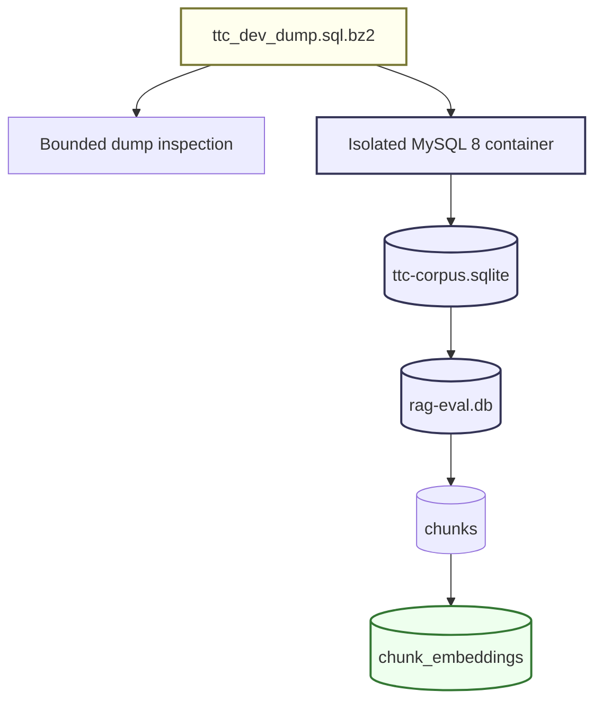

# RAG Evaluation System: Building a Database-Backed TTC Corpus Pipeline

This report explains the database-backed corpus pipeline built for the RAG Evaluation System on 2026-05-28. The work started with a compressed The Tree Center development database dump and ended with a normalized SQLite corpus, an import path into the RAG application database, a bounded chunking sample, source-aware embedding coverage, and a live OpenAI embedding smoke test through Pinocchio/Geppetto profiles.

The result is a reproducible path from a WordPress/WooCommerce MySQL dump to RAG-ready documents and chunks. The system now has two distinct corpus acquisition paths: Defuddle-based web extraction for public pages, and database-backed extraction for canonical WordPress content and product metadata. The database-backed path is more suitable for controlled evaluation because it preserves WordPress IDs, post types, publication status, taxonomy relationships, and product facts.

> [!summary]
> - A new ticket, `RAGEVAL-002`, was created to extract The Tree Center content from `/home/manuel/code/ttc/ttc/ttc_dev_dump.sql.bz2` into a normalized SQLite corpus.
> - The dump was loaded into an isolated MySQL 8 Docker Compose service, then exported into `data/corpus/ttc-dump/ttc-corpus.sqlite` with articles, guides, products, taxonomies, and product metadata.
> - The normalized corpus was imported into the RAG app database as 3,096 documents across `ttc-dump-articles`, `ttc-dump-guides`, and `ttc-dump-products`.
> - A representative 255-chunk sample was created and 30 OpenAI embeddings were computed through the `openai-embedding-small` Pinocchio profile with source-aware coverage tracking.

## Why this work was needed

The RAG Evaluation System already had a web-based corpus path. A Defuddle script downloaded 19 The Tree Center guide pages from the public WordPress sitemap and converted them into Markdown. That was enough to test ingestion, chunking, OpenAI embeddings, and stored cosine similarity. It was not enough to evaluate retrieval over the full The Tree Center content model.

The public website presents rendered pages. Those pages are useful, but they do not expose the whole structured state behind the site. Product pages depend on WordPress post rows, WooCommerce lookup tables, post meta fields, product attributes, categories, and variation records. A page scrape can capture the rendered text, but it cannot reliably preserve which fields came from which database records, which records were published, which taxonomy terms were attached, or which product facts should be kept separate from prose.

The compressed dump gave a more precise source. It contained canonical WordPress records for published blog posts, guides, and products. It also contained product facts such as botanical name, hardiness zone, mature height, mature width, sunlight, soil conditions, drought tolerance, SKU, price range, and stock status. The goal was to transform that raw operational database into a smaller corpus database designed for RAG ingestion.

The central engineering requirement was reproducibility. The pipeline should not be a sequence of unrecorded terminal commands. Every inspection, import, export, and app-ingestion step needed to live in the ticket workspace so the exact workflow could be rerun later.

## The source dump

The input file is:

```text
/home/manuel/code/ttc/ttc/ttc_dev_dump.sql.bz2
```

It is a compressed MySQL dump, about 43 MiB compressed. It comes from a WordPress/WooCommerce application and contains standard WordPress tables such as `wp_posts`, `wp_postmeta`, `wp_terms`, `wp_term_taxonomy`, and `wp_term_relationships`, plus WooCommerce tables such as `wp_wc_product_meta_lookup`.

The dump should not be inspected with raw `grep` over `INSERT` lines. MySQL dumps often store many rows in one physical line. In this dump, `wp_postmeta` contains extremely long multi-row insert lines with serialized metadata. A command that looks bounded, such as `bzgrep ... | head`, can still print a very large single line. That happened during the first inspection attempt and produced too much terminal output.

The corrected inspection path is a bounded Python script:

```text
ttmp/2026/05/28/RAGEVAL-002--extract-the-tree-center-content-dump-into-ordered-sqlite-corpus/scripts/01-inspect-dump-schema.py
```

It streams the compressed dump and emits only:

- selected `CREATE TABLE` blocks;
- `INSERT` statement counts;
- `wp_posts` post type/status counts;
- a small number of samples per post type.

The inspection output is stored as:

```text
ttmp/2026/05/28/RAGEVAL-002--extract-the-tree-center-content-dump-into-ordered-sqlite-corpus/sources/01-dump-schema-inspection.md
```

The relevant published content counts were:

| WordPress post type | Status | Count |
|---|---:|---:|
| `post` | `publish` | 483 |
| `ttc_guide` | `publish` | 19 |
| `product` | `publish` | 2,594 |
| `page` | `publish` | 120 |
| `product_variation` | `publish` | 11,913 |
| `faq` | `publish` | 35 |
| `attachment` | `inherit` | 17,038 |

The first corpus export includes only `post`, `ttc_guide`, and `product`. Product variations are useful structured commerce records, but they are not primary RAG documents in the first pass. Attachments, pages, FAQs, coupons, orders, and other operational records remain out of scope.

## Ticket structure

The new ticket is:

```text
RAGEVAL-002 -- Extract The Tree Center content dump into ordered SQLite corpus
```

Ticket path:

```text
ttmp/2026/05/28/RAGEVAL-002--extract-the-tree-center-content-dump-into-ordered-sqlite-corpus/
```

Important files:

```text
design-doc/01-ttc-dump-to-sqlite-corpus-implementation-guide.md
reference/01-implementation-diary.md
sources/01-dump-schema-inspection.md
scripts/01-inspect-dump-schema.py
scripts/02-docker-compose.mysql.yml
scripts/02-load-dump-into-mysql.sh
scripts/03-export-mysql-to-sqlite.py
scripts/04-import-corpus-into-rageval.py
scripts/05-chunk-ttc-sample.sh
```

The ticket scripts are part of the implementation. They are not scratch files. They define the replayable workflow.

## Overall pipeline

The final pipeline has five stages.



The stages are intentionally separated.

The MySQL import stage validates that the dump can be executed faithfully. The corpus SQLite export stage creates a small, stable database for content extraction. The app import stage maps corpus records into the RAG Evaluation System's existing `sources` and `documents` tables. The chunking stage uses existing strategy-aware chunk infrastructure. The embedding stage uses Geppetto/Pinocchio provider resolution and stores vectors in the app database.

Separating the corpus database from the app database is important. The corpus database represents source normalization. The app database represents RAG runtime state. The same corpus database can be imported into a clean app database, used to compare ingestion behavior, or transformed further without rerunning the MySQL import.

## Stage 1: bounded dump inspection

The inspection script avoids executing SQL. It reads the compressed dump as text and extracts structural information.

The key logic is:

```python
with bz2.open(path, "rt", encoding="utf-8", errors="replace") as f:
    for line in f:
        if CREATE TABLE line:
            collect bounded create block

        if INSERT INTO wp_posts line:
            split tuple payloads
            parse only enough fields for post_type/status/title/slug
            update counters and samples
```

The script does not print raw insert tuples. It parses enough to answer the first design questions:

- Which tables matter?
- How many published primary records exist?
- Which post types should become RAG documents?
- Which records should stay out of the first corpus?

The output established that `post`, `ttc_guide`, and `product` are the primary content records. It also confirmed that the database counts align with the public sitemap counts for posts and guides.

## Stage 2: isolated MySQL import

The dump is MySQL-specific. It contains MySQL table options, character set declarations, index definitions, and large multi-row inserts. Translating the dump directly into SQLite would require a partial MySQL parser. Loading it into MySQL first is simpler and more faithful.

A small Compose file was created:

```text
scripts/02-docker-compose.mysql.yml
```

It starts MySQL 8 as:

```text
container: rageval-ttc-mysql
port: 3347
database: ttc
user: ttc
password: ttc
root password: somewordpress
```

Port `3347` was chosen to avoid the existing TTC development MySQL port `3336`.

The import script is:

```text
scripts/02-load-dump-into-mysql.sh
```

The import script starts the container, waits for MySQL, resets the database, filters dump lines that should not be executed, and pipes SQL into MySQL.

The first implementation used `mysqladmin ping` as the readiness check. That failed. The MySQL Docker image starts a temporary initialization server before it applies the final root password. `mysqladmin ping` can succeed during that phase, but authenticated root queries can still fail. The script now waits for:

```bash
mysql -uroot -p"$ROOT_PASSWORD" -e 'SELECT 1'
```

That is the correct readiness condition for this workflow because the next command needs authenticated root access.

The second import issue came from the dump itself. Lines 17-19 contained raw `mysqldump` warnings, not SQL:

```text
Warning: A partial dump from a server that has GTIDs ...
Warning: A dump from a server that has GTIDs enabled ...
In order to ensure a consistent backup ...
```

MySQL reported:

```text
ERROR at line 17: Unknown command '"'.
```

The import script now filters warning lines, `GTID_PURGED`, and log-bin state statements. Those statements are irrelevant for local corpus extraction and can require elevated server privileges.

The corrected import path is:

```bash
python3 -c '...
    for line in dump:
        if line.startswith("Warning: ") or line.startswith("In order to ensure"):
            continue
        if "GTID_PURGED" in line or "MYSQLDUMP_TEMP_LOG_BIN" in line or "SESSION.SQL_LOG_BIN" in line:
            continue
        sys.stdout.write(line)
' "$DUMP_PATH" | docker compose ... mysql --binary-mode=1 ... ttc
```

The import completed successfully and reported the expected WordPress post counts.

## Stage 3: normalized SQLite corpus export

The export script is:

```text
scripts/03-export-mysql-to-sqlite.py
```

It reads rows from MySQL and writes:

```text
data/corpus/ttc-dump/ttc-corpus.sqlite
```

The output path is under `data/`, so it is intentionally ignored by Git.

The SQLite corpus has three tables.

### `content_items`

One row per exported article, guide, or product.

| Column | Meaning |
|---|---|
| `id` | Stable local ID, such as `ttc-guide-398454`. |
| `wp_id` | Original WordPress post ID. |
| `kind` | `article`, `guide`, or `product`. |
| `post_type` | Original WordPress post type. |
| `status` | Original WordPress status. |
| `slug` | WordPress slug. |
| `title` | WordPress title. |
| `url_path` | Canonical URL path approximation. |
| `published_at` | WordPress post date. |
| `modified_at` | WordPress modified date. |
| `excerpt` | WordPress excerpt. |
| `content_html` | Original `post_content`. |
| `content_text` | Extracted text used for RAG ingestion. |
| `word_count` | Derived word count. |
| `metadata_json` | Extra source metadata. |

### `item_terms`

Taxonomy relationships for exported items.

| Column | Meaning |
|---|---|
| `item_id` | Foreign key into `content_items`. |
| `taxonomy` | Taxonomy name, such as `product_cat` or `pa_size`. |
| `term_id` | Original WordPress term ID. |
| `term_slug` | Term slug. |
| `term_name` | Human-readable term. |

### `product_meta`

Selected product fields.

| Column | Meaning |
|---|---|
| `sku` | WooCommerce SKU. |
| `min_price`, `max_price` | Price range from lookup table. |
| `stock_status` | WooCommerce stock status. |
| `botanical_name` | `_treeinfo_botanical_name`. |
| `hardiness_zone` | `_treeinfo_hardiness_zone`. |
| `mature_height`, `mature_width` | Plant size fields. |
| `sunlight` | Sunlight field. |
| `soil_conditions` | Soil field. |
| `drought_tolerance` | Drought field. |

The export uses MySQL `JSON_OBJECT(...)` queries and parses one JSON object per output line in Python. This needed one important fix: the MySQL CLI must use `--raw`. Without `--raw`, batch output applies extra escaping, and Python sees invalid JSON. The failure was:

```text
json.decoder.JSONDecodeError: Expecting ',' delimiter: line 1 column 544 (char 543)
```

The corrected command includes:

```bash
mysql -N -B --raw --default-character-set=utf8mb4 ...
```

The final corpus counts are:

| Kind | Items | Words |
|---|---:|---:|
| article | 483 | 605,850 |
| guide | 19 | 37,594 |
| product | 2,594 | 2,208,648 |

Total primary items: 3,096.

The product corpus is much larger than the guide and article corpus. This matters for embedding cost and chunk volume. It also means product text quality needs review before full indexing because raw `post_content` may not include every field that should become searchable.

## Stage 4: importing the corpus into the RAG app database

The normalized corpus database is independent. To use it in the RAG Evaluation System, it must be mapped into the app database:

```text
data/rag-eval.db
```

The bridge script is:

```text
scripts/04-import-corpus-into-rageval.py
```

It creates three app sources:

```text
ttc-dump-articles
ttc-dump-guides
ttc-dump-products
```

It then upserts rows into the app's `documents` table. The document ID is the corpus item ID, so provenance remains explicit:

```text
ttc-article-9838
ttc-guide-418603
ttc-product-3708
```

The import preserves WordPress/corpus metadata in `documents.metadata_json`:

```json
{
  "corpus_item_id": "ttc-product-3708",
  "wp_id": 3708,
  "kind": "product",
  "post_type": "product",
  "slug": "...",
  "url_path": "/.../",
  "published_at": "...",
  "modified_at": "..."
}
```

After the bridge ran, the app database contained:

| Source ID | Documents | Words |
|---|---:|---:|
| `ttc-dump-articles` | 483 | 605,850 |
| `ttc-dump-guides` | 19 | 37,594 |
| `ttc-dump-products` | 2,594 | 2,208,648 |

This step makes the corpus visible to the existing CLI, HTTP API, and frontend document views.

## Stage 5: bounded sample chunking

The full corpus should not be embedded immediately. The product corpus alone contains more than two million extracted words. The first safe step is a mixed sample.

The chunking script is:

```text
scripts/05-chunk-ttc-sample.sh
```

It selects the largest documents by word count from each source and chunks a bounded number per kind. The default is:

```text
3 guides
3 articles
3 products
```

It uses:

```text
strategy: fixed
chunk_size: 1200
overlap: 150
strategy_id: fixed-1200-150
```

The sample produced:

| Source ID | Strategy | Chunks | Documents |
|---|---|---:|---:|
| `ttc-dump-articles` | `fixed-1200-150` | 162 | 3 |
| `ttc-dump-guides` | `fixed-1200-150` | 42 | 3 |
| `ttc-dump-products` | `fixed-1200-150` | 51 | 3 |

Total: 255 chunks across 9 documents.

The first version of this script expected `rag-eval chunk apply --emit none --output json` to return summary fields such as `document_id` and `chunk_count`. The command actually emitted chunk rows. The script was corrected to redirect chunk rows to `/dev/null` and query SQLite for counts after each chunk apply.

That behavior should be revisited in the app. A command named `--emit none` should ideally produce a summary only, not chunk rows, when used with JSON output.

## Embedding coverage and source-aware compute

After importing and chunking the dump corpus, `fixed-1200-150` contained chunks from several sources:

- the earlier Defuddle guide source, `thetreecenter-guides`;
- dump-derived articles;
- dump-derived guides;
- dump-derived products.

A strategy-only embedding command was no longer precise enough. Running `embedding compute --strategy-id fixed-1200-150 --limit 50` would select the first 50 chunks by strategy order, not necessarily a balanced sample across sources.

The embedding service was extended with source-aware chunk selection:

```go
type ComputeRequest struct {
    StrategyID   string
    SourceIDs    []string
    Provider     embeddings.Provider
    ProviderType string
    BatchSize    int
    Limit        int
    Force        bool
}
```

The database helper joins chunks to documents and optionally filters by source:

```sql
SELECT c.id, c.document_id, c.strategy_id, c.chunk_index, c.text, ...
FROM chunks c
JOIN documents d ON d.id = c.document_id
WHERE c.strategy_id = ?
  AND d.source_id IN (?, ?, ...)
ORDER BY d.source_id, c.document_id, c.chunk_index
LIMIT ?
```

The CLI now supports:

```bash
./rag-eval embedding compute \
  --strategy-id fixed-1200-150 \
  --source-ids ttc-dump-products \
  --profile openai-embedding-small \
  --profile-registries ~/.config/pinocchio/profiles.yaml \
  --batch-size 5 \
  --limit 10
```

A new coverage command was added:

```bash
./rag-eval embedding coverage \
  --strategy-id fixed-1200-150 \
  --provider-type openai \
  --model text-embedding-3-small \
  --dimensions 1536 \
  --output table
```

Coverage is a stored-vector query. It does not call an embedding provider. It groups by document source and reports chunk counts, embedded counts, and missing counts.

Before the mixed embedding smoke, coverage showed:

| Source ID | Chunks | Embedded | Missing |
|---|---:|---:|---:|
| `thetreecenter-guides` | 226 | 5 | 221 |
| `ttc-dump-articles` | 162 | 0 | 162 |
| `ttc-dump-guides` | 42 | 0 | 42 |
| `ttc-dump-products` | 51 | 0 | 51 |

The 5 embeddings in `thetreecenter-guides` came from the earlier OpenAI profile smoke test.

## OpenAI embedding smoke through Pinocchio profiles

The OpenAI embedding run used the same Pinocchio profile pattern already proven in the Readwise Viewer project:

```text
profile: openai-embedding-small
model: text-embedding-3-small
dimensions: 1536
registry: ~/.config/pinocchio/profiles.yaml
```

Three bounded compute runs were executed:

```bash
GOMAXPROCS=2 GOMEMLIMIT=1024MiB ./rag-eval embedding compute \
  --strategy-id fixed-1200-150 \
  --source-ids ttc-dump-guides \
  --profile openai-embedding-small \
  --profile-registries ~/.config/pinocchio/profiles.yaml \
  --batch-size 5 \
  --limit 10

GOMAXPROCS=2 GOMEMLIMIT=1024MiB ./rag-eval embedding compute \
  --strategy-id fixed-1200-150 \
  --source-ids ttc-dump-articles \
  --profile openai-embedding-small \
  --profile-registries ~/.config/pinocchio/profiles.yaml \
  --batch-size 5 \
  --limit 10

GOMAXPROCS=2 GOMEMLIMIT=1024MiB ./rag-eval embedding compute \
  --strategy-id fixed-1200-150 \
  --source-ids ttc-dump-products \
  --profile openai-embedding-small \
  --profile-registries ~/.config/pinocchio/profiles.yaml \
  --batch-size 5 \
  --limit 10
```

Each run succeeded:

| Source | Considered | Computed | Skipped fresh |
|---|---:|---:|---:|
| `ttc-dump-guides` | 10 | 10 | 0 |
| `ttc-dump-articles` | 10 | 10 | 0 |
| `ttc-dump-products` | 10 | 10 | 0 |

After the mixed smoke, coverage showed:

| Source ID | Chunks | Embedded | Missing |
|---|---:|---:|---:|
| `thetreecenter-guides` | 226 | 5 | 221 |
| `ttc-dump-articles` | 162 | 10 | 152 |
| `ttc-dump-guides` | 42 | 10 | 32 |
| `ttc-dump-products` | 51 | 10 | 41 |

This is the first source-balanced embedding test over database-derived content.

## Stored similarity over OpenAI vectors

Stored similarity was already implemented before this pipeline work. The new corpus made it useful on a more realistic sample.

A sample query compared the first embedded chunk of `Crape Myrtle Varieties and Guide` against the available OpenAI vectors:

```bash
./rag-eval embedding similarity \
  --strategy-id fixed-1200-150 \
  --provider-type openai \
  --model text-embedding-3-small \
  --dimensions 1536 \
  --chunk-id-a chk-b16aa790147ae371 \
  --limit 5 \
  --candidate-limit 60 \
  --preview-runes 100 \
  --output table
```

The top matches were other chunks from the same article. That result is expected for this small sample because the source chunk and nearby chunks share article-level vocabulary and topic structure. The test proves that the vectors are stored, decoded, and compared under the correct identity tuple:

```text
strategy_id = fixed-1200-150
provider = openai
model = text-embedding-3-small
dimensions = 1536
```

## Failure modes and corrections

This pipeline produced several important corrections.

### Raw dump inspection can print unbounded data

Problem:

```bash
bzgrep -n "INSERT INTO `wp_postmeta`" dump.sql.bz2 | head
```

A single mysqldump line can contain thousands of rows. `head` limits physical lines, not logical row volume.

Correction:

Use `scripts/01-inspect-dump-schema.py`, which parses bounded structural information and does not print raw insert payloads.

### MySQL readiness must require authenticated access

Problem:

```text
ERROR 1045 (28000): Access denied for user 'root'@'localhost'
```

Cause:

`mysqladmin ping` succeeded during the Docker image's temporary server phase.

Correction:

Readiness now requires:

```bash
mysql -uroot -p"$ROOT_PASSWORD" -e 'SELECT 1'
```

### The dump contains non-SQL warning lines

Problem:

```text
ERROR at line 17: Unknown command '"'.
```

Cause:

The dump stream contains raw warning text and GTID statements that are not needed for local corpus extraction.

Correction:

Filter warnings, `GTID_PURGED`, and log-bin statements before import.

### MySQL JSON output requires raw batch mode

Problem:

```text
json.decoder.JSONDecodeError: Expecting ',' delimiter
```

Cause:

MySQL CLI batch output escaped the JSON string again.

Correction:

Use:

```bash
mysql -N -B --raw
```

### Strategy-only embedding compute is too broad

Problem:

The same strategy ID now spans scraped guides and multiple dump-derived sources. A strategy-only limit can select the wrong subset.

Correction:

Add `--source-ids` to compute and `embedding coverage` to inspect source-level missing counts before live provider calls.

## Current user-facing commands

Inspect coverage:

```bash
./rag-eval embedding coverage \
  --strategy-id fixed-1200-150 \
  --provider-type openai \
  --model text-embedding-3-small \
  --dimensions 1536 \
  --output table
```

Compute embeddings for one source:

```bash
GOMAXPROCS=2 GOMEMLIMIT=1024MiB ./rag-eval embedding compute \
  --strategy-id fixed-1200-150 \
  --source-ids ttc-dump-products \
  --profile openai-embedding-small \
  --profile-registries ~/.config/pinocchio/profiles.yaml \
  --batch-size 5 \
  --limit 10 \
  --output table
```

List imported TTC dump documents:

```bash
sqlite3 -header -column data/rag-eval.db \
  "SELECT source_id, COUNT(*) docs, SUM(word_count) words
   FROM documents
   WHERE source_id LIKE 'ttc-dump-%'
   GROUP BY source_id
   ORDER BY source_id;"
```

Validate corpus SQLite counts:

```bash
sqlite3 -header -column data/corpus/ttc-dump/ttc-corpus.sqlite \
  "SELECT kind, COUNT(*) items, SUM(word_count) words
   FROM content_items
   GROUP BY kind
   ORDER BY kind;"
```

Rebuild the local corpus from the dump:

```bash
ttmp/2026/05/28/RAGEVAL-002--extract-the-tree-center-content-dump-into-ordered-sqlite-corpus/scripts/02-load-dump-into-mysql.sh \
  /home/manuel/code/ttc/ttc/ttc_dev_dump.sql.bz2

ttmp/2026/05/28/RAGEVAL-002--extract-the-tree-center-content-dump-into-ordered-sqlite-corpus/scripts/03-export-mysql-to-sqlite.py \
  --out data/corpus/ttc-dump/ttc-corpus.sqlite

ttmp/2026/05/28/RAGEVAL-002--extract-the-tree-center-content-dump-into-ordered-sqlite-corpus/scripts/04-import-corpus-into-rageval.py \
  --corpus data/corpus/ttc-dump/ttc-corpus.sqlite \
  --app-db data/rag-eval.db

TTC_SAMPLE_PER_KIND=3 \
  ttmp/2026/05/28/RAGEVAL-002--extract-the-tree-center-content-dump-into-ordered-sqlite-corpus/scripts/05-chunk-ttc-sample.sh
```

## Current implementation status

Implemented:

- Bounded MySQL dump inspection.
- Isolated MySQL Docker Compose import path.
- Dump filtering for warnings and GTID/log-bin statements.
- Normalized SQLite corpus export.
- App database import bridge.
- Bounded mixed-sample chunking.
- Source-aware embedding compute.
- Embedding coverage by source.
- HTTP coverage endpoint.
- OpenAI `text-embedding-3-small` smoke over dump-derived guides, articles, and products.
- Stored similarity over OpenAI vectors.

Still pending:

- Product text composition that includes selected product metadata directly in searchable text.
- Frontend coverage display in the Embedding Inspector.
- Stale-hash coverage, not just stored/missing coverage.
- BM25 indexing and search over the TTC corpus.
- Hybrid retrieval and evaluation metrics.
- A first query set for The Tree Center evaluation.

## Why this pipeline matters

The RAG Evaluation System now has a realistic data path. It can ingest content from a database dump, normalize it into an ordered corpus, load it into the application database, chunk it by strategy, compute embeddings with profile-backed providers, inspect coverage by source, and compare stored vectors.

This work changes the project from a general RAG scaffold into a system with a concrete corpus. The corpus has mixed content types, structured metadata, realistic scale, and enough provenance to support evaluation. It also exposes the next technical requirements clearly: product text needs better composition, search indexing must be added, and evaluation queries should be written against known content families such as planting guides, care articles, and plant product facts.

The immediate next development step should be BM25 search over the TTC corpus. Embeddings and similarity are useful for vector experiments, but evaluation requires retrievable result sets for user queries. BM25 will provide the first deterministic search baseline. Once BM25 exists, the system can compare text search, vector search, and hybrid retrieval over the same database-derived corpus.

## Related project artifacts

RAG Evaluation System repository:

```text
/home/manuel/workspaces/2026-05-27/rag-evaluation-system/2026-05-27--rag-evaluation-system
```

TTC source repository and dump:

```text
/home/manuel/code/ttc/ttc
/home/manuel/code/ttc/ttc/ttc_dev_dump.sql.bz2
```

Main tickets:

```text
RAGEVAL-001 -- RAG evaluation system workflow-driven document indexing with interactive playground
RAGEVAL-002 -- Extract The Tree Center content dump into ordered SQLite corpus
```

Important commits from this work:

```text
0afd3d9 docs: design TTC dump corpus extraction
348389b docs: record TTC dump import execution
29bdee9 docs: import TTC corpus into rag-eval
8216a5b feat: add source-aware embedding coverage and compute
b43c522 docs: record source-aware embedding workflow
```
