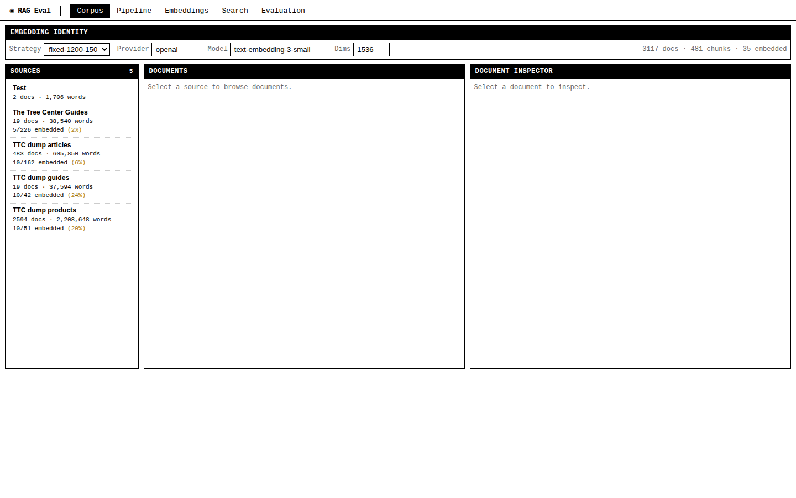
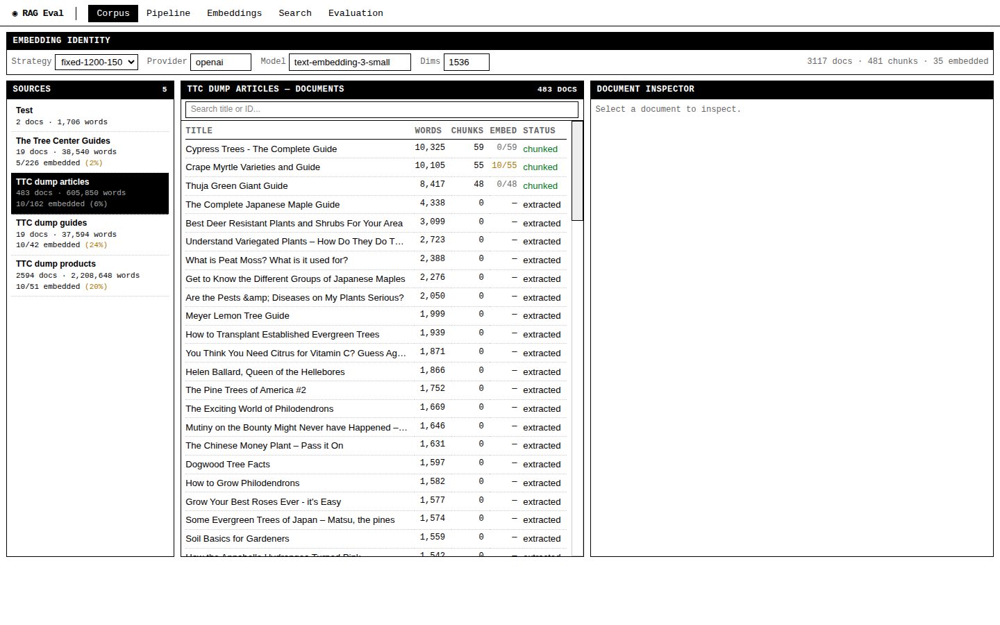
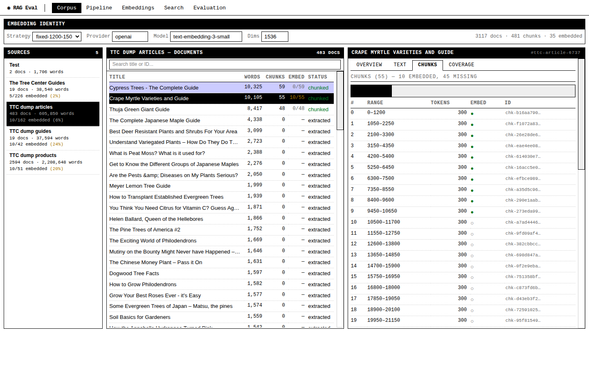
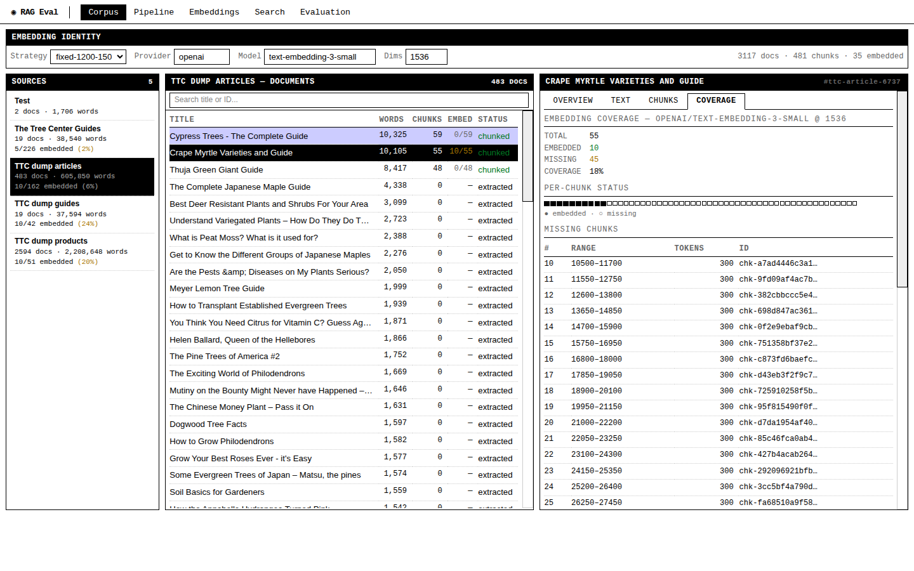
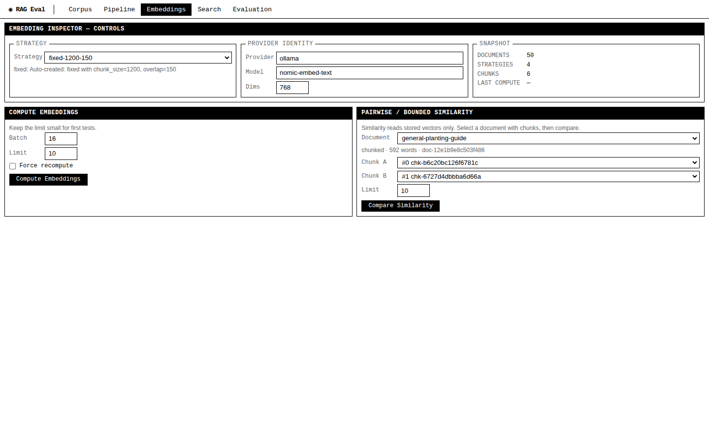

# RAG Evaluation System: Corpus Explorer and Pipeline Visualization Website

This report covers the website built for the RAG Evaluation System — a React SPA embedded in a Go binary that lets users browse, inspect, and validate every stage of a RAG pipeline. The site uses a retro macOS 1 monochrome design language: pure black and white, no window chrome, no menu bar, with color accents only on text foreground.

The website turns a database of 3,117 documents, 481 chunks, and 35 embeddings into something you can click through and understand. Before this work, the pipeline was only visible through CLI commands and raw API calls. Now a user can open a browser, pick a source, browse documents, inspect chunk boundaries, see which chunks have embeddings, and understand what to test next.

## What the system does

The RAG Evaluation System is a database-backed pipeline that takes content from multiple sources, chunks it into retrievable pieces, computes vector embeddings, and prepares everything for search and evaluation. The system has two corpus acquisition paths:

1. **Defuddle-based web extraction** — scrapes public pages from sites like The Tree Center and stores them as Markdown documents.
2. **Database-backed extraction** — imports content directly from WordPress/WooCommerce MySQL dumps, preserving post IDs, types, taxonomy, and product metadata.

The pipeline stages are:

```
Source → Document → Chunk → Embedding → Search → Evaluation
```

Each stage has its own database tables, service layer, and API endpoints. The website makes these transformations visible.

## The corpus at a glance

| Source | Type | Documents | Words | Chunks (fixed-1200-150) | Embedded (OpenAI) |
|---|---|---:|---:|---:|---:|
| Test | filesystem | 2 | 1,706 | 0 | 0 |
| The Tree Center Guides | filesystem | 19 | 38,540 | 226 | 5 |
| TTC dump articles | sqlite-corpus | 483 | 605,850 | 162 | 10 |
| TTC dump guides | sqlite-corpus | 19 | 37,594 | 42 | 10 |
| TTC dump products | sqlite-corpus | 2,594 | 2,208,648 | 51 | 10 |
| **Total** | | **3,117** | **2,892,538** | **481** | **35** |

The The Tree Center (TTC) corpus comes from a WordPress/WooCommerce development database containing 483 articles (long-form gardening guides), 19 standalone guides, and 2,594 products. A bounded sample of 255 chunks was created across three sources, and 35 of those chunks have OpenAI `text-embedding-3-small` embeddings at 1536 dimensions.

## Architecture

The system is a Go backend with SQLite persistence and a React frontend. The frontend is embedded into the Go binary at build time via `go:embed`, producing a single-file deployment.

### Backend stack

- **Go 1.22+** with `net/http` and `*http.ServeMux` (new pattern matching syntax with `{...}` paths)
- **SQLite** with WAL mode for the single-writer pattern
- **Service layer architecture** — CLI commands and HTTP handlers call shared services, no business logic in handlers
- **go:embed** — the React SPA is compiled into the binary, served at `/` with SPA fallback routing

Key backend packages:

| Package | Responsibility |
|---|---|
| `internal/db` | Database migrations, typed query helpers |
| `internal/services/source` | Source creation and filesystem scanning |
| `internal/services/document` | Document CRUD and chunk listing |
| `internal/services/chunking` | Applies chunking strategies (fixed-size with overlap) |
| `internal/services/embedding` | Computes embeddings, reports coverage, computes cosine similarity |
| `internal/services/corpus` | Read-only aggregation queries for the Corpus Explorer |
| `internal/api` | HTTP route registration and handler functions |

### Frontend stack

- **React 19** with TypeScript
- **RTK Query** (Redux Toolkit) for API state management with automatic caching and invalidation
- **Tailwind CSS 4** for utility classes
- **Vite** for build, with source maps enabled
- No component library — all UI is hand-built with CSS classes

The frontend is intentionally minimal: no router, no state management beyond RTK Query cache, no form libraries. The `App.tsx` switches between top-level views using a `useState` string.

### API surface

The backend exposes two route groups:

**Generic endpoints** (stable, simple):

```
GET  /api/v1/health
GET  /api/v1/sources
POST /api/v1/sources
POST /api/v1/sources/{id}/scan
GET  /api/v1/documents
GET  /api/v1/documents/{id}
GET  /api/v1/documents/{id}/chunks
POST /api/v1/documents/{id}/chunk
GET  /api/v1/chunking-strategies
POST /api/v1/embeddings/compute
POST /api/v1/embeddings/coverage
POST /api/v1/embeddings/similarity
```

**Corpus Explorer endpoints** (opinionated for browsing):

```
GET /api/v1/corpus/sources
GET /api/v1/corpus/documents
GET /api/v1/corpus/documents/{id}
```

The corpus endpoints differ from the generic ones in three ways: they filter by source, they include chunk and embedding counts via sub-query JOINs, and the document detail endpoint returns chunks with per-chunk embedding presence in a single request.

## The Corpus Explorer

The Corpus Explorer is the main feature of the website. It is a three-column layout: source list on the left, document browser in the middle, document inspector on the right.



### Source panel

The left column lists all sources with document counts, word counts, and embedding coverage percentages. Each source shows how many of its chunks have been embedded under the current identity (strategy + provider + model + dimensions). The identity is configurable in a toolbar above the three columns.

Clicking a source loads its documents into the middle column.

### Document browser



The middle column shows a searchable, paginated table of documents for the selected source. Each row shows the document title, word count, chunk count, embedding ratio (e.g. `10/55` in green or amber), and status (`chunked`, `extracted`, etc.).

The search bar filters by title or document ID within the loaded page. The "Load more" button fetches the next 100 documents. For the TTC dump articles source (483 documents), the initial load shows 100 rows with a "Load more (383 remaining)" button.

Clicking a document loads its details into the right column.

### Document inspector

The right column is a tabbed inspector with four tabs: Overview, Text, Chunks, Coverage.

**Overview tab** shows document metadata: ID (copyable), source, URL, word count, chunk count, embedding ratio, status, and a full metadata grid with all WordPress fields (post type, slug, publication date, taxonomy attributes).

**Text tab** shows the full extracted text in a scrollable container, useful for verifying normalization quality.

**Chunks tab** shows the chunk breakdown:



At the top, a **chunk timeline bar** visualizes chunk positions proportionally. Filled black bars represent embedded chunks, light gray bars represent missing chunks. Clicking a bar selects that chunk.

Below the timeline, a table lists each chunk with its index, character offset range, token count, embedding status (● for embedded, ○ for missing), and a copyable chunk ID. Clicking a row expands the full chunk text below the table.

**Coverage tab** shows embedding coverage statistics and a per-chunk dot visualization:



The dot strip shows each chunk as a small square: filled black if embedded, hollow if missing. Below it, a table lists all missing chunks with their indices and ranges. This makes it immediately clear which parts of a document still need embeddings.

### Embedding inspector

The Embeddings view provides controls for computing embeddings and comparing chunks:



It lets you select a strategy, provider, model, and dimensions, then trigger bounded embedding computation (with configurable batch size and chunk limit). The similarity comparison reads stored vectors only — it does not call the embedding provider — and shows score breakdowns for pairwise or top-candidate matching.

## Design language: retro macOS 1 monochrome

The entire site uses a strict monochrome palette inspired by the original Macintosh (1984):

- **Background**: white (`#FFFFFF`)
- **Panel headers**: black with white text, uppercase monospace
- **Borders**: pure black (`#000000`)
- **Row separators**: dotted gray
- **Text**: black, with color accents only on foreground:
  - Green (`#007722`): embedded, done, success
  - Amber (`#AA7700`): partial, warning
  - Red (`#CC0000`): error, failed
  - Blue (`#0000CC`): accent, links

There is no menu bar and no window chrome. Navigation is a flat strip at the top with the active item inverted (white text on black). Panels use black headers and white bodies with 1px black borders.

The scrollbars are styled in the retro thick style. The typography uses Geneva for body text, Monaco/Chicago for monospace labels and data. The overall effect is data-dense and readable without decorative noise.

## How it is built

### Component structure

The frontend is organized into six components under `web/src/components/corpus/`:

| Component | Responsibility |
|---|---|
| `CorpusExplorerView.tsx` | Main layout, state management, RTK Query wiring |
| `IdentityBar.tsx` | Strategy/provider/model/dimensions controls + summary stats |
| `SourcePanel.tsx` | Source list with coverage stats per source |
| `DocumentBrowser.tsx` | Document table with search filter and pagination |
| `DocumentInspector.tsx` | Four-tab inspector (overview, text, chunks, coverage) |
| `ChunkTimelineBar.tsx` | Proportional chunk position visualization |

All state lives in `CorpusExplorerView` and flows down as props. The components are stateless and render-only.

### Data flow

```
IdentityBar → { strategy, provider, model, dims }
  ↓
SourcePanel ← useListCorpusSourcesQuery(identity)
  ↓ (selected source)
DocumentBrowser ← useListCorpusDocumentsQuery({ source_id, ...identity })
  ↓ (selected document)
DocumentInspector ← useGetCorpusDocumentQuery({ document_id, ...identity })
```

RTK Query handles caching, loading states, and automatic refetching when the identity changes. Tags (`['Corpus']`) allow mutation endpoints to invalidate explorer data.

### Backend corpus service

The corpus service (`internal/services/corpus/service.go`, 425 lines) uses dynamic SQL construction: the number of `?` placeholders changes based on which identity fields are provided. When no strategy is given, only document and word counts are returned. When a full identity is given, chunk counts and embedding counts are computed via sub-query JOINs.

The document detail endpoint fetches the document and its chunks in two queries (not a single JOIN), which is clean for single-document inspection but not suitable for bulk operations.

### Build and deploy

The frontend is built with Vite and the output lands in `internal/web/dist/`. The Go binary embeds this directory via `go:embed`. The result is a single binary that serves both the API and the SPA:

```bash
cd web && npm run build && cd ..
go build ./cmd/rag-eval
./rag-eval serve --address 127.0.0.1:8080
```

No separate frontend server needed. No Nginx config. One binary, one process.

## What the pipeline can do today

### Source management

- Create filesystem sources pointing to a directory of Markdown files
- Scan sources to ingest files as documents
- Import corpus data from SQLite databases (used for the TTC WordPress dump)

### Document processing

- Store documents with metadata, content text, content HTML, and word counts
- Track document status through the pipeline: `pending` → `extracted` → `chunked`

### Chunking

- Fixed-size chunking with configurable chunk size and overlap
- Multiple strategies can coexist (e.g. `fixed-1200-150`, `fixed-500-50`, `fixed-200-30`)
- Chunks store start/end offsets and token estimates for boundary inspection

### Embeddings

- Compute embeddings through Geppetto/Pinocchio provider profiles (supports OpenAI, Ollama)
- Per-chunk embedding storage with text hash for freshness detection
- Skip already-embedded chunks (freshness check)
- Coverage reporting by source
- Stored cosine similarity comparison between chunks
- Bounded compute with configurable batch size and chunk limit

### What is not yet built

- **Search**: BM25, vector, and hybrid search indexes are not yet implemented. The `SearchView` is a placeholder.
- **Evaluation**: Query sets, evaluation runs, and metrics (Recall@K, MRR, nDCG@K) are not yet implemented. The `EvaluationView` is a placeholder.
- **Write actions from the Corpus Explorer**: The explorer is read-only. Bounded compute actions ("embed missing chunks for this document, limit 10") would reuse existing endpoints but are not wired into the UI yet.

## Testing

The corpus service has 8 unit tests using temporary SQLite databases:

- Source summaries with and without embedding identity
- Document browser with filtering and pagination
- Document detail with chunks, embedding status, not-found, no-text, and no-strategy cases

The existing services (source, document, chunking, embedding) also have unit tests. The frontend builds cleanly with TypeScript checking via `tsc`.

## Key files

### Backend

| File | Purpose |
|---|---|
| `cmd/rag-eval/main.go` | CLI entry point with serve command |
| `internal/api/handlers.go` | All HTTP route registrations and handlers |
| `internal/db/db.go` | Schema migrations |
| `internal/db/queries.go` | Typed query helpers |
| `internal/services/corpus/service.go` | Corpus explorer aggregation queries |
| `internal/services/embedding/service.go` | Embedding compute, coverage, and similarity |
| `internal/services/embedding/similarity.go` | Stored cosine similarity |
| `internal/services/chunking/service.go` | Chunking strategy application |
| `internal/web/spa.go` | Embedded SPA handler with fallback routing |

### Frontend

| File | Purpose |
|---|---|
| `web/src/App.tsx` | Top-level view switch and navigation |
| `web/src/index.css` | Complete retro macOS 1 monochrome theme |
| `web/src/services/api.ts` | RTK Query types and endpoint definitions |
| `web/src/components/corpus/*.tsx` | Corpus Explorer components (6 files) |
| `web/src/components/embeddings/EmbeddingsView.tsx` | Embedding inspector |
| `web/src/components/pipeline/PipelineView.tsx` | Source/document overview |
| `web/vite.config.ts` | Vite build config with source maps |

## Running it

```bash
# Build
cd web && npm run build && cd ..
go build ./cmd/rag-eval

# Run
./rag-eval serve --address 127.0.0.1:8080

# Open
open http://localhost:8080
```

The server serves the SPA at `/` and the API at `/api/v1/*`. Health check at `/api/v1/health`.

## Where to go from here

1. **Search integration** — Implement BM25/vector search, then link search results back into the Corpus Explorer via copyable chunk/document IDs.
2. **Server-side search** — The document browser currently does client-side search on the loaded page. For large sources (2,594 products), add a backend `q` parameter.
3. **Write actions from Corpus Explorer** — Bounded compute actions ("embed the 10 missing chunks for this document") wired as buttons.
4. **Chunk boundary highlighting** — Show chunk boundaries visually in the extracted text tab.
5. **Raw HTML vs extracted text** — A comparison tab for debugging normalization quality.
6. **Evaluation view** — Query sets, evaluation runs, Recall@K, MRR, nDCG@K metrics.

The Corpus Explorer already prepares for search integration by making every ID copyable and every coverage status visible. The next developer can focus on building the search and evaluation stages, knowing the browsing and inspection surface is ready.
