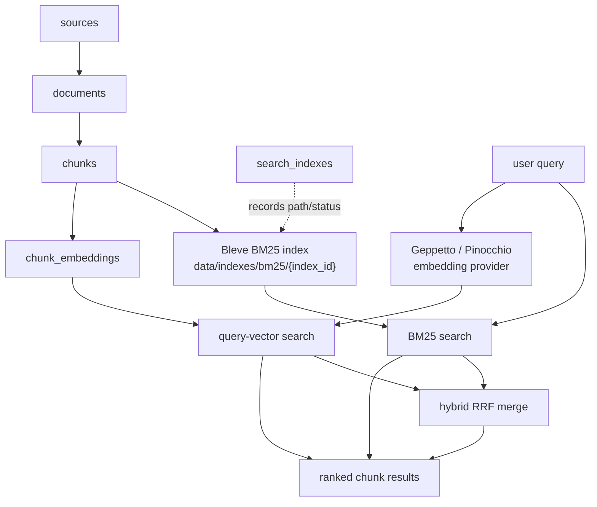

# RAG Evaluation System: Search Retrieval Foundation Deep Dive

This is the retrieval-stack foundation in the [[rag-evaluation-system]] project map.

This article explains the current search implementation in the RAG Evaluation System after the RAGEVAL-004 retrieval foundation work. The system can now build a BM25 index over persisted chunks, run lexical search, embed a live user query and compare it to stored chunk embeddings, merge BM25 and vector results with reciprocal-rank fusion, and run a small smoke-query suite against the corpus.

The implementation is deliberately modest. It is not yet a benchmark system. It is the retrieval layer that makes benchmarks worth building. The important change is that the project can now take a real text query, run it against the The Tree Center corpus artifacts, and return ranked chunks with document/source context and previews. That creates a technical basis for inspecting retrieval quality before labeling evaluation sets or designing metrics.

> [!summary]
> - The search engine now has three retrieval modes: BM25 lexical search, query-vector search over stored embeddings, and hybrid BM25+vector retrieval with reciprocal-rank fusion.
> - The smoke tests are intentionally not benchmarks. They check whether the retrieval path returns plausible evidence chunks and whether obvious corpus/index failures are visible.
> - The first real results are useful but uneven. Exact-match article queries work; broader care queries expose corpus coverage gaps; product discovery benefits from vector search but is constrained by sparse embeddings and incomplete product text composition.
> - The next quality gains should come from corpus text improvement, broader chunk/index coverage, source-balanced embeddings, better BM25 field modeling, and manually reviewed relevance judgments.

## Why this note exists

The RAG Evaluation System had already reached the point where it could ingest documents, chunk them, compute embeddings, inspect embedding coverage, and compare stored chunk embeddings. Those capabilities are necessary, but they are not retrieval. A RAG system becomes testable when a user can ask a natural query and receive ranked evidence units.

The retrieval foundation work answers this narrower question:

```text
Given a real query and a chunked corpus, can the system return plausible chunks with enough metadata to debug the result?
```

That question comes before benchmark design. Benchmark code can compute recall, MRR, NDCG, or preference judgments, but those metrics are only meaningful after the system can produce stable ranked lists. If the ranked lists are dominated by missing corpus content, weak chunk text, sparse embeddings, or incorrect source filters, the benchmark will measure upstream defects rather than retrieval behavior.

The current implementation therefore follows a staged plan:

1. Build a lexical baseline with BM25.
2. Add query-vector retrieval over stored chunk embeddings.
3. Add hybrid retrieval only after both standalone retrievers work.
4. Add smoke tests that catch broken request paths without pretending to be formal relevance evaluation.
5. Inspect real results and improve corpus/search quality before designing benchmarks.

## The current retrieval stack

The system is built around one invariant: SQLite is canonical, and indexes are derived artifacts. Sources, documents, chunks, and embeddings live in the application database. BM25 indexes live on disk under `data/indexes` and can be rebuilt from SQLite at any time.



The code paths that define this stack are:

| Area | Files |
|---|---|
| DB search helpers | `internal/db/search_queries.go` |
| BM25 service | `internal/services/search/service.go`, `internal/services/search/bm25.go` |
| Vector search service | `internal/services/search/vector.go` |
| Hybrid search service | `internal/services/search/hybrid.go` |
| Search service tests | `internal/services/search/service_test.go` |
| CLI commands | `cmd/rag-eval/cmds/search/*.go` |
| HTTP handlers | `internal/api/handlers.go` |
| Smoke query seed file | `eval/ttc-smoke.yaml` |
| Design and diary | `ttmp/2026/05/28/RAGEVAL-004--end-to-end-search-retrieval-foundation/` |

The current commits that matter most are:

| Commit | Purpose |
|---|---|
| `c24d8a5` | BM25 search service and CLI |
| `314f4ed` | BM25 HTTP endpoints |
| `952b4ab` | Query-vector search |
| `5fd061a` | Hybrid retrieval and smoke checks |
| `6651474` | Final validation diary |

## Canonical data: chunks and embeddings

Search operates over chunks. A chunk is not just text; it is a strategy-specific evidence unit tied to a document and source. The relevant tables are:

```text
sources
  id
  name
  type

documents
  id
  source_id
  title
  url
  content_text
  word_count
  metadata_json

chunks
  id
  document_id
  strategy_id
  chunk_index
  text
  token_count
  start_offset
  end_offset

chunk_embeddings
  chunk_id
  strategy_id
  provider
  model
  dimensions
  text_hash
  embedding BLOB

search_indexes
  id
  strategy_id
  index_type
  index_path
  document_count
  chunk_count
  last_rebuild_at
  status
```

The strategy ID is central. The current test corpus uses `fixed-1200-150`, meaning fixed-size chunks of roughly 1200 runes with 150 runes of overlap. A search index built for one strategy must not silently search chunks from another strategy. Embeddings also include the strategy ID because changing chunk boundaries changes the meaning of stored vectors.

The helper `ListChunksWithDocumentContext` returns the shape needed for BM25 indexing:

```go
type ChunkWithDocument struct {
    ChunkID     string
    DocumentID  string
    SourceID    string
    Title       string
    URL         string
    StrategyID  string
    ChunkIndex  int
    Text        string
    TokenCount  int
    StartOffset int
    EndOffset   int
}
```

This avoids an under-specified index. A hit must not come back as only a chunk ID and a score. It needs enough context for a developer to inspect why it appeared.

## BM25: the lexical baseline

BM25 is the first retriever because it is cheap, deterministic, and inspectable. It does not require provider credentials, network calls, stored embeddings, or a vector index. It answers a simple question: do the indexed chunks contain the words the user asked for?

The implementation uses Bleve v2. The index is disposable and lives under:

```text
data/indexes/bm25/{index_id}
```

The first real index used during validation was:

```text
bm25-ttc-guides-articles-fixed-1200-150
```

It was built with:

```bash
GOMAXPROCS=2 GOMEMLIMIT=1024MiB ./rag-eval search index \
  --strategy-id fixed-1200-150 \
  --source-ids ttc-dump-guides,ttc-dump-articles \
  --index-id bm25-ttc-guides-articles-fixed-1200-150 \
  --force \
  --output table
```

The build indexed 204 chunks across 6 documents. That number matters. A good result on this index proves the request path works for the indexed subset; a bad result may mean the answer is not present in the subset.

The indexed document shape is intentionally direct:

```go
type indexedChunk struct {
    ChunkID     string `json:"chunk_id"`
    DocumentID  string `json:"document_id"`
    SourceID    string `json:"source_id"`
    Title       string `json:"title"`
    URL         string `json:"url"`
    StrategyID  string `json:"strategy_id"`
    ChunkIndex  int    `json:"chunk_index"`
    Text        string `json:"text"`
    TokenCount  int    `json:"token_count"`
    StartOffset int    `json:"start_offset"`
    EndOffset   int    `json:"end_offset"`
}
```

The query is currently simple:

```go
textQuery := bleve.NewMatchQuery(req.Query)
textQuery.SetField("text")

titleQuery := bleve.NewMatchQuery(req.Query)
titleQuery.SetField("title")
titleQuery.SetBoost(2.0)

query := bleve.NewDisjunctionQuery(textQuery, titleQuery)
```

The result rows include:

- rank;
- retriever name;
- score;
- chunk ID;
- document ID;
- source ID;
- title;
- URL;
- chunk index;
- text preview.

This output is optimized for debugging. A search system that only returns text is hard to inspect. A search system that returns IDs, source names, and chunk indexes can be cross-checked against the Corpus Explorer, CLI commands, and SQLite.

## Query-vector search

The vector retriever answers a different question: after embedding the user query, which stored chunk vectors have the highest cosine similarity?

The current implementation does not use a native vector index. It scans a bounded set of stored embeddings from SQLite and computes cosine similarity in Go. That is the right first implementation because the current embedding coverage is sparse and the immediate need is correctness and observability, not million-vector latency.

The command shape is:

```bash
GOMAXPROCS=2 GOMEMLIMIT=1024MiB ./rag-eval search vector \
  --query "which trees make a good privacy screen" \
  --strategy-id fixed-1200-150 \
  --source-ids ttc-dump-articles,ttc-dump-guides,ttc-dump-products,thetreecenter-guides \
  --profile openai-embedding-small \
  --profile-registries ~/.config/pinocchio/profiles.yaml \
  --limit 5 \
  --candidate-limit 80 \
  --preview-runes 140 \
  --output table
```

The important parameters are:

| Parameter | Why it matters |
|---|---|
| `--strategy-id` | Selects the chunk boundary regime. |
| `--source-ids` | Prevents accidental searches over unintended sources. |
| `--profile` | Resolves the embedding provider through Pinocchio/Geppetto. |
| `--candidate-limit` | Caps the number of stored vectors compared in one request. |
| `--limit` | Caps emitted rows. |

The vector path uses existing embedding code rather than introducing a second provider stack. That keeps provider resolution consistent with `rag-eval embedding compute`.

The retrieval algorithm is:

```text
validate query, strategy, provider
resolve provider model metadata
embed query text
load stored chunk embeddings for strategy/provider/model/dimensions/source filters
for each candidate:
    decode little-endian float32 vector blob
    check vector dimension
    score = cosine(query_vector, candidate_vector)
sort by score descending
emit top N with document/source/chunk context
```

The first live vector smoke query was encouraging. For `which trees make a good privacy screen`, the top results included `Leyland Cypress` product chunks and a screening-related `Crape Myrtle Varieties and Guide` chunk. This is exactly the kind of behavior vector retrieval should surface: relevant chunks need not contain the exact phrasing of the query, but they must still be inspectably related.

## Hybrid retrieval

Hybrid retrieval combines BM25 and vector results with reciprocal-rank fusion. It does not normalize BM25 scores against cosine scores. It uses rank positions from each retriever.

For each result:

```text
rrf_score = 1 / (k + rank)
```

The implementation uses `k = 60` by default. If a chunk appears in both result lists, its scores accumulate. The output preserves component evidence:

```json
"components": {
  "bm25": { "rank": 2, "score": 0.7119 },
  "vector": { "rank": 7, "score": 0.5341 }
}
```

The CLI prints this as columns:

```text
bm25_rank
bm25_score
vector_rank
vector_score
```

That design choice matters. Hybrid search must remain inspectable. If a chunk appears at rank 1, the developer should know whether BM25 found exact words, vector search found semantic similarity, or both found the same chunk.

The live hybrid query:

```bash
GOMAXPROCS=2 GOMEMLIMIT=1024MiB ./rag-eval search hybrid \
  --query "which trees make a good privacy screen" \
  --index-id bm25-ttc-guides-articles-fixed-1200-150 \
  --strategy-id fixed-1200-150 \
  --source-ids ttc-dump-articles,ttc-dump-guides,ttc-dump-products,thetreecenter-guides \
  --profile openai-embedding-small \
  --profile-registries ~/.config/pinocchio/profiles.yaml \
  --limit 5 \
  --bm25-limit 20 \
  --vector-limit 20 \
  --candidate-limit 80 \
  --preview-runes 120 \
  --output table
```

returned a useful mix:

| Retriever contribution | Example result |
|---|---|
| Vector-only | `Leyland Cypress` product chunks about screening and fast growth. |
| BM25-only | `How To Plant a Privacy Screen` guide chunks. |
| Hybrid output | A ranked list that exposes both evidence sources. |

The equal-score behavior in the first rows is not a bug. If one item is rank 1 in BM25 and another item is rank 1 in vector search, both receive `1/(60+1)`. Later tuning can prefer chunks with evidence from both retrievers, but the first implementation intentionally keeps the merge rule simple.

## HTTP API

Search is available through CLI and HTTP. The current endpoints are:

```http
POST /api/v1/search/indexes
POST /api/v1/search/query
POST /api/v1/search/vector
POST /api/v1/search/hybrid
```

BM25 query request:

```json
{
  "index_id": "bm25-ttc-guides-articles-fixed-1200-150",
  "query": "crape myrtle varieties",
  "limit": 3,
  "preview_runes": 100
}
```

Vector and hybrid requests include provider/profile fields. The handler currently accepts provider options directly and resolves them through the same `embeddingservice.ResolveProvider` path as the CLI.

This is convenient for internal development, but it deserves review before exposing it as a general UI action. A production-facing API should probably use named profiles or server-side provider configuration rather than arbitrary provider credentials in request JSON.

## Smoke tests, not benchmarks

The smoke query file is:

```text
eval/ttc-smoke.yaml
```

It contains a small set of real queries:

```yaml
queries:
  - id: crape-myrtle-varieties
    text: crape myrtle varieties
    intent: article-discovery
    expected_terms: [crape, myrtle]
    expected_source_ids: [ttc-dump-articles, thetreecenter-guides]

  - id: arborvitae-planting
    text: how to plant arborvitae
    intent: care-guide
    expected_terms: [plant, arborvitae]
    expected_source_ids: [ttc-dump-guides, ttc-dump-articles]
```

The smoke runner is intentionally simple:

```bash
./rag-eval search smoke \
  --file eval/ttc-smoke.yaml \
  --index-id bm25-ttc-guides-articles-fixed-1200-150 \
  --limit 5 \
  --output table
```

It checks whether each query returns top-K results, whether at least one expected term appears in the result titles/previews, and whether an expected source appears. The result status is `pass`, `warn`, or `fail`.

This is not a benchmark because it does not have relevance labels. It does not know which documents are truly relevant. It does not compute recall@k, MRR, NDCG, or graded relevance. It is a request-path and sanity check.

That distinction should be kept explicit. The smoke runner is allowed to be permissive because its job is to catch broken retrieval paths early. A benchmark must be stricter because its job is to compare retrieval methods.

## What the first results say

The first smoke output was:

| Query ID | Status | Top result | Interpretation |
|---|---|---|---|
| `crape-myrtle-varieties` | pass | `Crape Myrtle Varieties and Guide` | Good exact-match behavior. |
| `arborvitae-planting` | pass | `How to Plant Japanese Maples` | Plumbing works, but the match is weak; `plant` dominated. |
| `emerald-green-spacing` | pass | `Thuja Green Giant Guide` | Related evergreen/arborvitae material appears, but exact product intent needs review. |
| `hydrangea-pruning` | warn | `How to Plant Japanese Maples` | Indexed sample lacks focused hydrangea material or ranking cannot find it. |
| `privacy-screen-trees` | pass | `How To Plant a Privacy Screen` | Good lexical retrieval for guide content. |

The quality is not great yet, and that is expected. The value of the smoke tests is that they show where the system is weak.

### `crape myrtle varieties` is the clean case

This query has strong lexical overlap with an indexed article title and body. BM25 returns multiple chunks from `Crape Myrtle Varieties and Guide`. That validates the basic path:

```text
query text -> Bleve index -> chunk hits -> document metadata -> previews
```

This is the kind of query that every retrieval implementation should pass before anything more sophisticated is attempted.

### `how to plant arborvitae` exposes weak evidence coverage

The top result was `How to Plant Japanese Maples`, which is not the intended topic. The result is not random: the chunk contains planting language. The failure is that the indexed subset does not provide enough strong arborvitae-specific planting evidence for BM25 to prefer it.

This tells us to inspect the corpus before tuning the ranker. If arborvitae planting content is absent from the indexed chunks, no lexical ranker can retrieve it. If it is present but hidden in product metadata or non-indexed documents, the fix is coverage and text composition. If it is present in indexed chunk text but ranked low, then BM25 configuration and field boosts become the right target.

### `hydrangea pruning` is a warning, not a search-engine verdict

The smoke runner marked `hydrangea pruning` as `warn` because no expected terms appeared in the top results. That is a useful failure. It means the current indexed sample should not be used to draw conclusions about hydrangea retrieval.

A formal benchmark would require known relevant hydrangea documents. The current smoke suite only tells us that the present retrieval setup is not ready for this query.

### `privacy screen` demonstrates complementarity

The query `which trees make a good privacy screen` showed the best reason to keep multiple retrievers. BM25 found the guide `How To Plant a Privacy Screen`. Vector search found `Leyland Cypress` product chunks. Those are different kinds of relevant evidence. A good RAG pipeline often needs both:

- explanatory guide content for methods and constraints;
- product content for concrete recommendations.

The current hybrid retriever can surface both, but the merge rule is still primitive.

## Why the results are not great yet

The current retrieval quality issues come from several layers. Search ranking is only one of them.

### The indexed corpus is small

The first BM25 index contains 204 chunks across 6 documents. The imported corpus has thousands of documents, but only a representative subset has been chunked under `fixed-1200-150`, and the initial index was intentionally bounded to guides/articles.

A query can only retrieve what has been chunked and indexed. Many apparent ranking failures are coverage failures.

### Embedding coverage is sparse

At the time of the retrieval foundation work, stored OpenAI embeddings existed for only a small source-balanced sample. Earlier coverage was approximately:

| Source | Chunks | Embedded |
|---|---:|---:|
| `thetreecenter-guides` | 226 | 5 |
| `ttc-dump-articles` | 162 | 10 |
| `ttc-dump-guides` | 42 | 10 |
| `ttc-dump-products` | 51 | 10 |

Vector search over 35 embedded chunks can validate the code path, but it cannot represent full-corpus semantic retrieval. The `candidate_limit` makes this explicit, but the real limitation is coverage.

### Product text composition is incomplete

The product corpus has structured facts: hardiness zone, mature height, mature width, sunlight, soil, drought tolerance, botanical name, categories, tags, SKU, price, and stock state. Not all of those facts are necessarily present in `documents.content_text` after import.

This matters for both BM25 and embeddings. BM25 cannot match terms that are not indexed. Embeddings cannot reliably recover structured facts that were never converted into the text being embedded. If a user asks for `zone 5 flowering trees`, the product chunks need to contain zone and product facts as text.

The fix is not ranker tuning. The fix is product document composition.

A product text should probably include sections like:

```text
Title: Leyland Cypress
Botanical name: Cupressus × leylandii
Categories: Evergreen Trees, Privacy Trees
Hardiness zones: 6-10
Mature height: ...
Mature width: ...
Sunlight: full sun to partial shade
Soil: well-drained soil
Drought tolerance: ...
Description:
...
```

That structured text should be generated deterministically during corpus import so both lexical and vector retrievers see the same facts.

### Chunks lack some retrieval context

The current chunk text is mostly content text slices. A chunk may not include the document title, section title, source kind, product category, or neighboring section context. BM25 indexes title separately, but vector embeddings are computed over chunk text alone. That means a chunk that says `Water regularly during the first season` may embed without knowing which plant or article it belongs to.

A retrieval-oriented chunk representation may need a composed embedding text distinct from display text:

```text
Document title: Leyland Cypress
Source kind: product
Chunk index: 2
Content:
...
```

The system already stores raw chunk text. A future improvement could add a chunk embedding input field or deterministic embedding-text builder.

### The BM25 mapping is default and under-modeled

The current Bleve index uses a default mapping and a simple disjunction over `text` and boosted `title`. That is good for the first baseline, but it is not a tuned search engine.

Potential improvements include:

- explicit field mappings;
- separate boosts for title, body, category, tags, botanical names, and product attributes;
- phrase queries for product names;
- query-time conjunction/disjunction tuning;
- stopword/stemming review;
- highlighting to show matched terms;
- source-specific fields for product facts.

The first ranking problems should still be investigated at the corpus layer first. Once content is present and indexed, BM25 tuning becomes meaningful.

### The smoke checks are permissive

The smoke suite currently passes a query if any expected term appears in top-K results. This explains why `arborvitae-planting` can pass when the top result is Japanese maples: the term `plant` appeared, and the expected source class appeared.

That is acceptable for a smoke test. It is not acceptable for a benchmark. The next evaluation layer needs relevance judgments, not just term checks.

### Hybrid ranking is intentionally primitive

Reciprocal-rank fusion is a good first hybrid method because it is simple and explainable. It is not tuned for this corpus. It does not account for:

- source type preferences;
- title exact matches;
- whether both retrievers found the same chunk;
- document diversity;
- duplicate neighboring chunks;
- product vs guide intent;
- score confidence.

Those improvements should come after more retrieval traces are collected.

## How to make it better

The path to better search should start with data quality and observability, then move to ranking.

### 1. Build broader indexes and record source coverage

The first index was intentionally small. The next experiments should build separate and combined indexes:

```bash
./rag-eval search index \
  --strategy-id fixed-1200-150 \
  --source-ids ttc-dump-products \
  --index-id bm25-ttc-products-fixed-1200-150 \
  --force

./rag-eval search index \
  --strategy-id fixed-1200-150 \
  --source-ids ttc-dump-guides,ttc-dump-articles,ttc-dump-products \
  --index-id bm25-ttc-all-sampled-fixed-1200-150 \
  --force
```

Every index build should report chunk and document counts. A query result should always be interpreted relative to what was indexed.

### 2. Improve product text composition before judging product search

Product retrieval quality will be constrained until structured product facts are included in searchable text. The importer should compose product documents from:

- title;
- post content;
- excerpt;
- botanical name;
- hardiness zone;
- mature size;
- sunlight;
- soil;
- drought tolerance;
- categories;
- tags;
- relevant WooCommerce attributes.

This should happen before full product embeddings are computed. Otherwise the system will pay to embed incomplete evidence.

### 3. Add query-result inspection workflows

For every smoke query, the developer should inspect the top 5 to 10 chunks. A useful inspection record includes:

| Field | Question |
|---|---|
| Query | What did the user ask? |
| Retriever | BM25, vector, or hybrid? |
| Top title | Is the document plausible? |
| Top chunk preview | Does the chunk itself contain usable evidence? |
| Missing content | Was the expected fact absent from indexed text? |
| Action | Fix corpus, chunking, embeddings, BM25 config, or query set? |

The result should be a short retrieval lab notebook before benchmark labels are created.

### 4. Create real relevance judgments

The smoke file should evolve into a benchmark only after manual review. A benchmark query needs expected relevant documents or chunks:

```yaml
queries:
  - id: privacy-screen-trees
    text: fast growing trees for privacy screen
    relevant_documents:
      - ttc-guide-405509
      - ttc-product-3701
    relevant_chunks:
      - chk-6cb63747847a4ae7
      - chk-18620b039f4bbd83
    notes: Includes guide-level planting advice and product-level recommendation evidence.
```

Then the system can compute metrics. Until then, it should print smoke statuses and retrieval traces.

### 5. Add vector and hybrid modes to the smoke runner

The current smoke runner supports BM25 only. Once more embeddings exist, it should support:

```bash
rag-eval search smoke --retriever vector ...
rag-eval search smoke --retriever hybrid ...
```

The output should compare retrievers per query:

| Query | BM25 top | Vector top | Hybrid top | Human note |
|---|---|---|---|---|
| privacy screen | guide | product | mixed | hybrid is useful |
| hydrangea pruning | weak | unknown | unknown | need corpus coverage |

This comparison will guide benchmark design.

### 6. Tune BM25 only after content coverage is fixed

Once the relevant content is present, BM25 tuning should target known failures:

- product names should benefit from title and exact phrase matching;
- category/tag matches should be visible but not dominate body evidence;
- botanical names should be indexed as searchable product facts;
- guide/article titles should have strong but not overwhelming boosts;
- adjacent chunks from the same document should not crowd out diverse results unless they are all genuinely relevant.

### 7. Add diversity and deduplication controls

Current retrieval can return many neighboring chunks from the same document. That is useful during debugging but may be poor for RAG context assembly. A future retrieval mode should support:

- maximum chunks per document;
- neighboring chunk collapsing;
- optional inclusion of previous/next chunks after selecting a hit;
- document-level grouping;
- source quotas.

These should be separate from raw search. Raw search should remain available for debugging.

### 8. Keep live provider calls out of unit tests

The implementation follows the right rule: unit tests use fake providers, and live OpenAI/Ollama calls are explicit smoke commands. That should remain true. Search tests should validate ranking logic, vector decoding, source filtering, and hybrid merging without network dependencies.

## What a good next retrieval session looks like

A productive next session should not start by adding metrics. It should run a controlled set of searches and decide which layer failed.

A good sequence is:

```bash
# 1. Check coverage.
./rag-eval embedding coverage \
  --strategy-id fixed-1200-150 \
  --provider-type openai \
  --model text-embedding-3-small \
  --dimensions 1536 \
  --output table

# 2. Build a broader BM25 index.
./rag-eval search index \
  --strategy-id fixed-1200-150 \
  --source-ids ttc-dump-guides,ttc-dump-articles,ttc-dump-products \
  --index-id bm25-ttc-sampled-all-fixed-1200-150 \
  --force \
  --output table

# 3. Run smoke checks.
./rag-eval search smoke \
  --file eval/ttc-smoke.yaml \
  --index-id bm25-ttc-sampled-all-fixed-1200-150 \
  --limit 10 \
  --output table

# 4. Inspect weak queries manually.
./rag-eval search query \
  --index-id bm25-ttc-sampled-all-fixed-1200-150 \
  --query "hydrangea pruning" \
  --limit 10 \
  --preview-runes 240 \
  --output table
```

For every weak query, classify the failure:

| Failure class | Evidence | Corrective action |
|---|---|---|
| Missing corpus coverage | Relevant document is not chunked/indexed. | Chunk/index more documents. |
| Missing text composition | Fact exists in metadata but not chunk text. | Improve importer/composed text. |
| Bad chunk boundary | Relevant sentence split or lacks context. | Improve chunking or embedding input text. |
| Weak lexical ranking | Terms exist but rank low. | Tune BM25 mapping/query boosts. |
| Sparse vector coverage | Relevant chunk has no embedding. | Compute bounded source-balanced embeddings. |
| Hybrid merge issue | BM25/vector are good individually, hybrid demotes good evidence. | Tune RRF/diversity/weights. |

This classification is more valuable than a single metric at the current stage.

## The current status

The search foundation is now implemented and validated:

```bash
GOMAXPROCS=2 GOMEMLIMIT=1024MiB go test ./internal/db ./internal/ingest ./internal/chunking ./internal/services/source ./internal/services/chunking ./internal/services/document ./internal/services/embedding ./internal/services/corpus ./internal/services/search ./internal/api -count=1 -timeout 60s

GOMAXPROCS=2 GOMEMLIMIT=1024MiB go build ./cmd/rag-eval

docmgr doctor --ticket RAGEVAL-004 --stale-after 30
```

All passed during the implementation session.

The important limitation is that passing validation means the implemented retrieval paths execute correctly. It does not mean the retrieval quality is production-grade. The smoke results are already telling us where to focus:

- broaden chunk/index coverage;
- improve product text composition;
- compute more embeddings only after text quality is acceptable;
- inspect weak queries manually;
- turn manually reviewed queries into benchmark candidates.

## Near-term next steps

The next technical work should be ordered like this:

1. **Product text composition.** Include structured product metadata in `documents.content_text` before full product embedding.
2. **Broader chunking/indexing.** Chunk and index larger subsets per source, with clear counts.
3. **Source-balanced embedding expansion.** Compute additional embeddings in small batches and check coverage before each run.
4. **Retriever comparison notebook.** Record BM25, vector, and hybrid top results for 15 to 25 queries.
5. **Benchmark seed set.** Promote reviewed smoke queries into labeled query/document/chunk relevance records.
6. **Ranking improvements.** Tune BM25 fields, hybrid fusion, deduplication, and source diversity based on observed failures.
7. **Search UI integration.** Add a search view that links each result back to the Corpus Explorer by document and chunk ID.

## The main lesson from the first search implementation

The search engine is now good enough to reveal the system's real problems. That is progress. Before this implementation, weak retrieval could be blamed on missing infrastructure. Now weak retrieval can be inspected at the right layer: corpus coverage, text composition, chunking, embeddings, lexical ranking, vector ranking, or hybrid merging.

A useful RAG benchmark should not be created in isolation from these traces. It should grow out of them. The smoke tests are the first set of questions. The result tables are the first retrieval traces. The warnings are the first evidence of what the corpus and retrievers cannot yet do.

The next phase should keep that discipline: run real queries, inspect real chunks, classify failures precisely, improve the layer that failed, and only then attach formal benchmark metrics.
