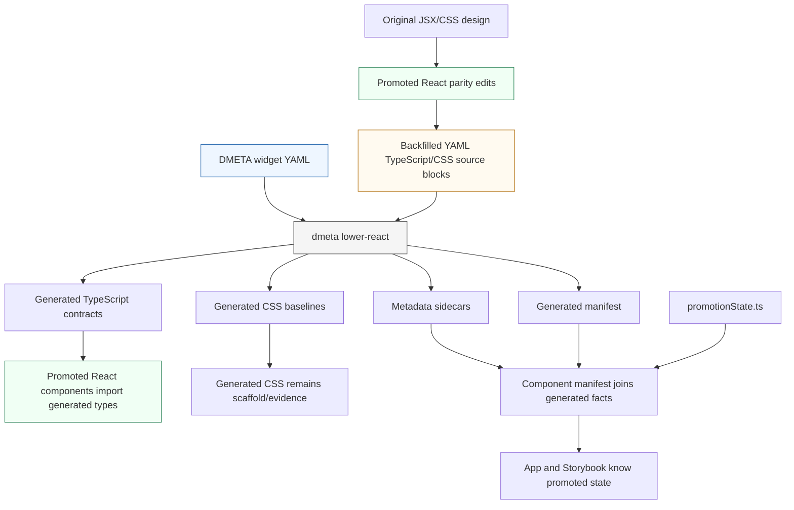

# TTC DMETA Visual Parity: Preserving IR and Codegen While Matching the Original Design

This report describes the large TTC Garden Assistant push that converted a generated-and-promoted React component prototype into a source-guided visual parity implementation while keeping DMETA IR, generated contracts, generated CSS baselines, Storybook, validation, and documentation aligned. The important result is not only that the components now look closer to the imported original design. The more durable result is the workflow: promoted React components can become hand-owned implementation truth without abandoning the IR, and the IR can remain useful without trying to encode every visual decision as a custom schema.

The work happened in the repository `/home/manuel/workspaces/2026-05-27/ttc-design-system`, mainly under `2026-05-27--ttc-design-system/`. The React package is `web/packages/ttc-garden-assistant`. The DMETA IR package is `dmeta-ir/`. The original imported design lives under `original/`, and the Phase 2 ticket documentation lives under `ttmp/2026/05/27/TTC-REACT-MDS-PHASE2--ttc-react-component-promotion-and-validation-phase-2/`.

> [!summary]
> - The project separated three responsibilities: DMETA IR describes semantic capacity, generated artifacts provide typed scaffolds and reviewable baselines, and promoted React components implement the runtime UI.
> - The visual source of truth became the imported original HTML/JSX/CSS under `original/`, not the richer accelerated promotion variants.
> - The IR was deliberately simplified: TypeScript source blocks define component contracts, CSS source blocks define style baselines, and YAML carries metadata, intent, semantic context, lifecycle, notes, and action-slot names.
> - The codegen path stayed active. After each visual parity pass, the settled promoted shape was backfilled into DMETA IR and regenerated into `.generated.*` files and manifest metadata.

## 1. What this push was trying to accomplish

The TTC Garden Assistant work began with a useful but incomplete state. There was a real DMETA IR package, a React/Storybook workspace, generated component scaffolds, promoted components, and a Storybook-driven review surface. The system could produce components from IR and could promote those components into hand-owned React. That was already a significant step beyond a static design mockup.

The remaining problem was that many promoted widgets did not match the imported original design. The accelerated promotion pass had made reasonable product-oriented choices: it added panel headers, extra copy, action buttons, badges, merchandising chips, and richer row/card structures. Those choices were not arbitrary, and some of them may become product features later. But they were not the imported visual baseline. The original design was simpler. It used compact widget cards, restrained title rows, thin borders, direct plant rows, product cards with only a few fields, and sparse action surfaces.

The project therefore needed to answer a precise technical question:

> How can promoted React components be made to match the original design while the DMETA IR and code generation path remain useful, current, and intentionally simple?

A less disciplined approach would have picked one side. It could have treated the original imported JSX as the only truth and abandoned the IR. It could have treated the generated output as the only truth and forced the original design into a large schema. It could have kept the accelerated promoted UI and declared the diff acceptable. None of those options would have preserved both implementation velocity and design-system continuity.

The chosen approach was to define the roles explicitly:

| Layer | Responsibility | What changed during this push |
| --- | --- | --- |
| Imported original design | Visual baseline for current parity work | Served as the source for structure, spacing, chrome, omitted fields, and artboard comparison. |
| DMETA IR | Semantic contract, metadata, intent, lifecycle, action slots, generated source blocks | Simplified around TypeScript contracts and CSS baselines instead of large custom visual schemas. |
| Generated artifacts | Typed scaffold, metadata sidecars, CSS evidence, manifest entries | Regenerated from IR and kept aligned after each settled promoted parity pass. |
| Promoted React components | Runtime implementation truth | Rewritten to match original source, while keeping generated types and semantic callbacks where useful. |
| Storybook and css-visual-diff | Review and regression surface | Used to compare original artboards against promoted React stories with repeatable artifacts. |
| Ticket docs and diary | Explanation, decisions, validation, failures | Updated at coherent milestones so the work can be reviewed and resumed. |

This separation is the main engineering result. It allowed the team to remove visual drift without turning the IR into a fragile second implementation of React.

## 2. The starting architecture

By the time this push began, the project had several major pieces in place.

```text
/home/manuel/workspaces/2026-05-27/ttc-design-system/
├── 2026-05-27--ttc-design-system/
│   ├── dmeta-ir/
│   │   ├── instantiations/ttc-garden-assistant.yaml
│   │   └── meta-design-systems/web/widgets/
│   │       ├── atoms-and-molecules.yaml
│   │       ├── care-and-diagnosis.yaml
│   │       ├── chat.yaml
│   │       ├── planning-and-shopping.yaml
│   │       └── recommendations.yaml
│   ├── original/
│   │   ├── Garden Assistant - Design System.html
│   │   ├── atoms.jsx
│   │   ├── molecules.jsx
│   │   ├── organisms.jsx
│   │   └── tokens.css
│   ├── ttmp/2026/05/27/TTC-REACT-MDS-PHASE2--.../
│   │   ├── design-doc/
│   │   ├── playbooks/
│   │   ├── reference/01-diary.md
│   │   ├── changelog.md
│   │   └── tasks.md
│   └── web/packages/ttc-garden-assistant/
│       ├── src/components/
│       ├── src/generated/dmeta-widgets/
│       ├── src/dmeta/
│       ├── src/domain/
│       ├── scripts/
│       └── verbs/original-design.js
└── dmeta/
    └── cmd/dmeta
```

The React package had a generated layer and a promoted layer. The generated layer lived under `src/generated/dmeta-widgets/` and used `.generated.*` filenames. The promoted layer lived under `src/components/atoms`, `src/components/molecules`, and `src/components/organisms`. Promoted files were hand-owned and were not overwritten by the generator.

The bridge between those layers used generated metadata plus promotion state:

```text
src/generated/dmeta-widgets/dmeta.generated-manifest.json
src/dmeta/promotionState.ts
src/dmeta/componentManifest.ts
src/dmeta/index.ts
```

The generator emitted metadata sidecars and manifest entries. The app joined those generated facts with the hand-maintained promotion state. That design avoided a hand-maintained registry that would silently diverge from generated output.

The important constraint was file ownership. Generated files are replaceable. Promoted files are not. The generator can regenerate CSS evidence, TypeScript contracts, metadata, README notes, sidecar stories, and manifest entries. It must not overwrite the hand-owned runtime implementation. That rule stayed intact throughout the push.

## 3. Why visual parity became the next priority

A design-system integration can fail even when all components compile and all tests pass. It fails when the UI no longer matches the design language the rest of the team expects. In this project, the drift was visible in the widgets that had been promoted quickly.

The accelerated promotion pass had created working React components for many widgets. It was useful because it proved that the components could be promoted, wired, tested, and shown in Storybook. But it also created UI that was not the imported original design. The drift had a consistent shape:

- promoted widgets often had an extra eyebrow label;
- promoted widgets often had gradient or soft panel backgrounds;
- promoted widgets often had action buttons that did not exist in the original;
- promoted product cards rendered optional merchandising fields that the original did not show;
- promoted layouts used generic three-column tiles where the original used specific rows or compact cards;
- promoted components sometimes treated every available semantic field as visible UI.

The original design under `original/` had a different contract. It did not say that every semantic field must be rendered. It said that the current visual projection should be compact, direct, and consistent with the imported artboards.

The css-visual-diff workflow made this drift concrete. Early comparisons showed large differences for several widgets. The exact numbers should not be read as a complete judgment of quality, because wrapper size, remote image availability, antialiasing, selector mismatch, and icon differences all affect the metric. But they were useful for ranking and regression detection.

Representative checkpoints during the push included:

| Widget | Visual checkpoint after parity work | Classification |
| --- | ---: | --- |
| `filter-bar` | `7.1413%` | accepted |
| `watch-for-signs` | `9.1783%` | review |
| `watering-guide` | `10.7630%` | review |
| `quick-picks` | `11.0534%` | review |
| `why-these-work` | `11.4783%` | review |
| `why-pair` | `11.9708%` | review |
| `compare-teaser` | `13.0968%` | review |
| `care-calendar` | `14.6848%` | review |
| `top-matches` | `16.2341%` | review |
| `plant-detail` | `27.7883%` | tune-required |

The numbers are less important than the workflow they enabled. Every parity pass had evidence before and after. The comparison artifacts lived under `/tmp/.../garden-assistant/artifacts/<case>/` with separate images:

```text
left_region.png    original crop
right_region.png   promoted React crop
diff_only.png      standalone diff mask
compare.json       numeric/style evidence
```

The project deliberately stopped using wide `comparison.png` composites as the primary image-QA input. The separate images made it easier to inspect the original, the promoted result, and the diff without introducing a wide layout that could distract automated or human review.

## 4. The central design decision: semantic capacity is not visual obligation

The most important conceptual decision was to separate semantic capacity from visual obligation.

A component contract may expose fields such as `availabilityLabel`, `badges`, `reason`, `onRefineRecommendations`, `onBuildPlan`, `onComparePlants`, or `onDiagnoseObservation`. These fields are useful for adapters and future variants. They should not automatically force the default visual baseline to render badges, reasons, refine buttons, build-plan buttons, or diagnostic buttons.

This distinction fixed a recurring mistake from the accelerated promotion phase. The generated contract was being treated as a list of things the component should show. The corrected rule is:

> The generated contract describes what the component can receive. The promoted original-source projection decides what the current baseline renders.

This rule allowed the system to keep rich TypeScript contracts while removing accidental UI. A few examples show the difference.

### ProductCard

The semantic contract could include product availability, badges, reason text, save actions, open-product actions, and cart actions. The original product card rendered only:

```text
image/fallback
heart button
zone badge
name
latin name
price
```

The parity implementation therefore removed availability badges, trait chips, reason copy, stock labels, and cart actions from the visible baseline. The semantic fields can remain in the generated contract for future product variants, but the current default component matches the original.

### QuickPicksWidget

The accelerated version rendered an eyebrow, a title, a `Refine` button, and clickable rows. The original widget rendered a compact white widget card, a leaf section title, and plant list rows with thumbnail, name, description, and chevron. The promoted version kept row selection but removed the visible refine control. The generated contract still keeps `onRefineRecommendations` as a hidden future-variant action slot.

### WhyPairWidget

The accelerated version rendered an eyebrow, feature tiles, and `Compare` / `Build plan` buttons. The original widget rendered only the title and three feature tiles separated by dividers. The final promoted component removed the buttons but kept `onComparePlants`, `onBuildPlan`, and `onShopPair` in the generated contract.

This is not a compromise between design and data. It is a more precise contract. The data layer can support more than one projection. The current projection is the original baseline.

## 5. How the IR was simplified

The IR could have become a large schema for every possible visual detail. That path would have required custom YAML structures for rows, cards, grids, icons, product fields, title slots, responsive variants, and action surfaces. It would also have required generator logic for every field. The cost would have been high, and most of the work would have duplicated information already expressible in TypeScript and CSS.

The simplified IR approach used source blocks instead.

A widget YAML entry contains semantic metadata and two important source blocks:

```yaml
contract:
  typescript:
    language: typescript
    description: ...
    intent: ...
    notes: ...
    code: |-
      export interface QuickPickItem {
        id?: string;
        name: string;
        desc: string;
        image?: string;
        reason?: string;
      }

      export interface QuickPicksWidgetProps {
        className?: string;
        visualState?: QuickPicksWidgetVisualState;
        slots?: Partial<Record<QuickPicksWidgetSlotName, unknown>>;
        viewModel?: QuickPicksWidgetViewModel;
        title?: string;
        items?: QuickPickItem[];
        onRefineRecommendations?: (payload: unknown) => void;
        onSelectRecommendation?: (payload: unknown) => void;
      }

style:
  language: css
  description: ...
  intent: ...
  notes: ...
  code: |-
    .root {
      background: var(--ttc-color-surface-card);
      border-radius: var(--ttc-radius-widget);
      box-shadow: var(--ttc-elevation-keyline);
      color: var(--ttc-navy-800);
      padding: var(--ttc-space-8);
    }
```

The YAML still carries structured information where structure matters:

- template identity: `id`, `name`, status, classification;
- lifecycle: `generated_role: scaffold_then_promote`;
- semantic context: presentations, capabilities, archetypes;
- projection hints: required, recommended, optional, documentation-only fields;
- storybook notes and story states;
- outputs and generated file paths;
- `contract_action_slots` for named semantic actions;
- descriptions, intent, and notes explaining what the source blocks mean.

The YAML does not attempt to define a private language for React props or CSS rules. TypeScript is already the precise language for React contracts. CSS is already the precise language for visual baselines. The IR stores those languages as source blocks with enough surrounding metadata to make them discoverable and generatable.

This simplification had several direct benefits:

- Generated TypeScript became useful immediately because promoted components could import generated types directly.
- Generated CSS baselines could be reviewed by normal frontend developers without learning a custom visual schema.
- Backfilling a settled promoted style into IR became a mechanical step: copy the promoted CSS module into `style.code`, update intent/notes, regenerate.
- The generator stayed smaller because it did not need to interpret a large design schema before writing CSS.
- The project could move quickly while still keeping the IR current.

The simplification did not eliminate structure. It moved structure to the level where it pays off: component identity, semantic capability, lifecycle, generated outputs, and named actions.

## 6. The generation and promotion pipeline

The pipeline is easiest to understand as a sequence of transformations and ownership decisions.



The important boundary is between generated and promoted code. Generated files are overwritten by `lower-react`. Promoted files are not. A promoted component may import generated types and generated metadata. It should not depend on generated JSX as its runtime body.

The main generated outputs are under:

```text
web/packages/ttc-garden-assistant/src/generated/dmeta-widgets/
```

Representative generated files:

```text
organisms/QuickPicksWidget/QuickPicksWidget.generated.types.ts
organisms/QuickPicksWidget/QuickPicksWidget.generated.module.css
organisms/QuickPicksWidget/QuickPicksWidget.metadata.json
organisms/QuickPicksWidget/QuickPicksWidget.generated.tsx
dmeta.generated-manifest.json
```

Representative promoted files:

```text
src/components/organisms/QuickPicksWidget/QuickPicksWidget.tsx
src/components/organisms/QuickPicksWidget/QuickPicksWidget.module.css
src/components/organisms/QuickPicksWidget/QuickPicksWidget.stories.tsx
```

A simplified version of the workflow looks like this:

```text
for each widget:
    read original JSX/CSS helper definitions
    read current promoted TSX/CSS
    identify visible projection mismatch
    rewrite promoted TSX/CSS to match original projection
    keep generated type imports and semantic callbacks where useful
    run CSS/type/test validation
    run focused css-visual-diff against original artboard and Storybook story
    if accepted:
        copy settled promoted CSS into YAML style.code
        update YAML purpose/intent/notes to describe original projection
        regenerate with dmeta lower-react
        curate generated timestamp-only churn
        rerun validation and focused visual regression
        commit code and docs at coherent checkpoints
```

The actual command for regeneration was:

```bash
cd dmeta
go run ./cmd/dmeta lower-react \
  --instance ../2026-05-27--ttc-design-system/dmeta-ir/instantiations/ttc-garden-assistant.yaml \
  --force \
  --output table
```

Validation used both DMETA and React-side checks:

```bash
cd dmeta
go run ./cmd/dmeta validate-ir \
  --root ../2026-05-27--ttc-design-system/dmeta-ir \
  --output table

go run ./cmd/dmeta validate-interactions \
  --root ../2026-05-27--ttc-design-system/dmeta-ir \
  --output table
```

```bash
cd 2026-05-27--ttc-design-system/web
pnpm --filter ttc-garden-assistant validate:dmeta-manifest
pnpm --filter ttc-garden-assistant scaffold:dmeta-promotions
pnpm --filter ttc-garden-assistant validate:css-strict
pnpm --filter ttc-garden-assistant validate:css-vars
pnpm --filter ttc-garden-assistant typecheck
pnpm --filter ttc-garden-assistant test
```

The validation suite matters because this kind of system has several drift vectors. The manifest can drift from promotion state. CSS can introduce raw values or unknown variables. Generated contracts can become uncomfortable for promoted components. Tests can continue expecting the old accelerated labels after a parity pass changes title text. The validation suite caught those issues quickly.

## 7. The visual parity workflow in detail

The parity workflow was not a general screenshot comparison. It was a source-guided implementation process with screenshot evidence.

The source of truth was the imported original:

```text
original/Garden Assistant - Design System.html
original/atoms.jsx
original/molecules.jsx
original/organisms.jsx
original/tokens.css
```

The original design was served in tmux:

```text
tmux session: ttc-original-design
URL: http://localhost:6019/Garden%20Assistant%20-%20Design%20System.html
log: /tmp/ttc-original-design.log
```

The promoted React implementation was served through Storybook:

```text
tmux session: ttc-storybook
URL: http://localhost:6008/
log: /tmp/ttc-storybook.log
```

The project-local css-visual-diff verb lived at:

```text
web/packages/ttc-garden-assistant/verbs/original-design.js
```

It compared original design-canvas slots to promoted Storybook stories. Example command:

```bash
cd 2026-05-27--ttc-design-system/web
pnpm --filter ttc-garden-assistant compare:original-design:verb -- \
  --caseList quick-picks,why-these-work,why-pair \
  --outDir /tmp/ttc-last-three-straight-match \
  --output json
```

The output directory followed the review-site-compatible shape:

```text
/tmp/ttc-last-three-straight-match/
├── summary.json
└── garden-assistant/
    └── artifacts/
        ├── quick-picks/
        │   ├── left_region.png
        │   ├── right_region.png
        │   ├── diff_only.png
        │   └── compare.json
        ├── why-these-work/
        └── why-pair/
```

This artifact shape became important for two reasons. First, it supported the `css-visual-diff serve` review UI. Second, it supported external image QA by feeding separate original, promoted, and diff images rather than a wide composite.

The workflow had a strict review order:

1. Read original source before editing.
2. Align Storybook fixture data if necessary.
3. Rewrite promoted component structure and CSS.
4. Run CSS/type/test validation.
5. Restart Storybook if stale output is suspected.
6. Run focused css-visual-diff.
7. Inspect artifacts and compare with source.
8. Commit the promoted implementation.
9. Backfill IR/generated baselines after the promoted shape is stable.
10. Validate again and commit the backfill.

This ordering prevented a common failure: updating IR before the visual target had settled. The promoted component was the place to find the correct implementation. The IR was backfilled after the component proved itself.

## 8. Component-by-component changes

This section records the major component changes at the level a future maintainer needs. It does not list every CSS property, but it explains what each component became and what was deliberately removed.

### ProductCard and TopMatchesWidget

The original `ProductCard` in `original/molecules.jsx` is a compact card with an image, heart, zone badge, name, Latin name, and price. The accelerated promoted version had grown into a product merchandising card. It rendered availability badges, trait chips, reason text, and extra CTAs.

The parity pass removed the expanded product UI and restored the original projection. `TopMatchesWidget` then became a simple section title, view-all link, and grid of compact `ProductCard`s.

Key promoted files:

```text
src/components/molecules/ProductCard/ProductCard.tsx
src/components/molecules/ProductCard/ProductCard.module.css
src/components/organisms/TopMatchesWidget/TopMatchesWidget.tsx
src/components/organisms/TopMatchesWidget/TopMatchesWidget.module.css
```

Key decision: keep optional semantic fields in the TypeScript contract, but do not render them in the original baseline.

### PlantDetailMini

The original `PlantDetailMini` is a compact wide card. It has a `16/9` hero image, a zone badge positioned in the image, title, italic Latin name, a three-column facts row, and price. The accelerated version was a larger detail panel with extra chips and actions.

The parity pass restored the original wide-card shape. The remaining drift stayed higher than most other components because image area, fact-row alignment, and selector/wrapper differences have a large effect on pixel comparison.

Key promoted files:

```text
src/components/organisms/PlantDetailMini/PlantDetailMini.tsx
src/components/organisms/PlantDetailMini/PlantDetailMini.module.css
```

Key visual checkpoint:

```text
plant-detail: 27.7883% tune-required
```

This is a case where the percentage remains high enough to warrant future subregion comparison, but the structure is much closer to the original than the accelerated detail-card variant.

### FilterBar

The original `FilterBar` is a compact horizontal rail with a leading sliders icon and removable pill chips. The accelerated promoted version was closer to a filter panel with header text, clear/refine actions, and Chip composition.

The parity pass removed the panel chrome and restored the rail. It kept `onFilterPlants` semantics for per-chip removal.

Key promoted files:

```text
src/components/molecules/FilterBar/FilterBar.tsx
src/components/molecules/FilterBar/FilterBar.module.css
src/components/molecules/FilterBar/FilterBar.test.tsx
```

Key visual checkpoint:

```text
filter-bar: 7.1413% accepted
```

This was one of the clearest wins. The original structure was small, focused, and easy to restore.

### CompareTeaser

The original `CompareTeaser` is a compact widget card with a title row, two plant summaries, a centered `VS`, and a full-width secondary compare button. The accelerated version had an eyebrow, plant notes, gradient panels, and bordered rows.

The parity pass restored the compact compare entrypoint and aligned the story fixture to the original plants.

Key promoted files:

```text
src/components/molecules/CompareTeaser/CompareTeaser.tsx
src/components/molecules/CompareTeaser/CompareTeaser.module.css
src/components/molecules/CompareTeaser/CompareTeaser.stories.tsx
```

Key visual checkpoint:

```text
compare-teaser: 13.0968% review
```

The remaining drift is partly icon and text fixture fidelity.

### CareCalendarWidget, WateringGuideWidget, and WatchForSignsWidget

These care and diagnostic widgets had the same accelerated-promotion issue: extra eyebrows, gradients, action buttons, and generic panel rows. The original widgets were white widget cards with section titles and compact content.

The parity pass restored:

- `WateringGuideWidget`: white widget card, section title, guide steps, dividers;
- `WatchForSignsWidget`: white widget card, section title, wrapped tag chips with colored icon discs;
- `CareCalendarWidget`: white widget card, section title, 12-month strip, legend.

Key promoted files:

```text
src/components/organisms/CareCalendarWidget/CareCalendarWidget.tsx
src/components/organisms/CareCalendarWidget/CareCalendarWidget.module.css
src/components/organisms/WateringGuideWidget/WateringGuideWidget.tsx
src/components/organisms/WateringGuideWidget/WateringGuideWidget.module.css
src/components/organisms/WatchForSignsWidget/WatchForSignsWidget.tsx
src/components/organisms/WatchForSignsWidget/WatchForSignsWidget.module.css
```

Key visual checkpoints:

```text
care-calendar:   14.6848% review
watering-guide:  10.7630% review
watch-for-signs:  9.1783% review
```

`CareCalendarWidget` is a good example of why pixel percentages are evidence, not a complete verdict. Its numeric diff worsened slightly in one pass while the source structure became more faithful. Icon glyph and wrapper differences can dominate small repeated elements.

### QuickPicksWidget, WhyTheseWorkWidget, and WhyPairWidget

These were the final three organism widgets in this push.

`QuickPicksWidget` changed from an accelerated recommendation panel into the original compact plant-row card. It removed the visible `Refine` button and the eyebrow, kept row selection, and rendered thumbnail/name/description/chevron rows.

`WhyTheseWorkWidget` changed from generic stat tiles under a `Fit summary` panel into the original suitability card. It restored the default title `Why these work in your front yard` and the horizontal stat-tile layout.

`WhyPairWidget` changed from a pairing panel with `Compare` and `Build plan` buttons into the original three-feature card with dividers. The action slots remained in the generated contract, but they stopped rendering in the default visual projection.

Key promoted files:

```text
src/components/organisms/QuickPicksWidget/QuickPicksWidget.tsx
src/components/organisms/QuickPicksWidget/QuickPicksWidget.module.css
src/components/organisms/WhyTheseWorkWidget/WhyTheseWorkWidget.tsx
src/components/organisms/WhyTheseWorkWidget/WhyTheseWorkWidget.module.css
src/components/organisms/WhyPairWidget/WhyPairWidget.tsx
src/components/organisms/WhyPairWidget/WhyPairWidget.module.css
```

Key visual checkpoints after the clean Storybook restart:

```text
quick-picks:     11.0534% review
why-these-work:  11.4783% review
why-pair:        11.9103% review
```

After IR/generated backfill, the same cases remained stable:

```text
quick-picks:     11.0534% review
why-these-work:  11.4783% review
why-pair:        11.9708% review
```

The slight `why-pair` movement is within the expected noise range for this workflow and did not indicate a promoted runtime change.

## 9. Backfilling IR after promoted parity

Backfilling was the second half of each parity pass. Without it, the runtime UI would match the original but the generated layer would still describe the old accelerated version. That would create future drift. A developer regenerating or inspecting the component would see outdated intent and CSS.

The backfill pattern was consistent:

1. Update YAML `intent.purpose` to describe the imported original projection.
2. Update `style.description`, `style.intent`, and `style.notes` to say what the baseline is and what it intentionally omits.
3. Copy the settled promoted CSS module into `style.code`.
4. Keep TypeScript contracts broad where semantic fields/actions remain useful.
5. Regenerate generated artifacts with `lower-react --force`.
6. Revert unrelated generated metadata churn.
7. Normalize timestamp-only changes when the only meaningful diff is role text.
8. Run validation and focused visual regression.
9. Commit.

The final recommendation backfill used a ticket-local helper:

```text
ttmp/2026/05/27/TTC-REACT-MDS-PHASE2--.../scripts/03-backfill-last-three-recommendation-ir.py
```

That script updated:

```text
dmeta-ir/meta-design-systems/web/widgets/recommendations.yaml
  - ttc.quick_picks_widget
  - ttc.suitability_widget

dmeta-ir/meta-design-systems/web/widgets/planning-and-shopping.yaml
  - ttc.pair_reason_widget
```

It copied promoted CSS from:

```text
src/components/organisms/QuickPicksWidget/QuickPicksWidget.module.css
src/components/organisms/WhyTheseWorkWidget/WhyTheseWorkWidget.module.css
src/components/organisms/WhyPairWidget/WhyPairWidget.module.css
```

into the corresponding YAML `style.code` blocks.

The important detail is that the script was kept inside the ticket `scripts/` directory. That makes the investigation reproducible without treating the script as permanent product code. It documents how the backfill was performed and can be used as evidence if someone needs to audit the exact transformation.

## 10. Why generated JSX remained scaffold, not runtime truth

One subtle point deserves explicit treatment. The generated CSS baselines now often mirror the promoted/original CSS classes, but generated TSX scaffolds still use generic structures such as header plus slot list. That is intentional in the current architecture.

The generator's React output has two roles:

- provide a typed, inspectable scaffold for components that have not been promoted yet;
- provide generated contracts, metadata, styles, sidecar stories, and manifest facts for components that have been promoted.

After promotion, the hand-owned component is the runtime implementation. It can import generated types, but it does not need the generated JSX body to match the final runtime DOM. This avoids a costly generator requirement: the generator does not have to understand every original-source widget layout immediately.

There is still a future improvement available. The generator could learn enough about the CSS/template semantics to emit more representative JSX for widget cards, rows, and title sections. That would improve scaffold usefulness. But it is not required for runtime correctness because promoted React owns runtime markup.

This decision kept the push focused. The team did not stop visual parity work to build a full visual-layout generator. It used generated output where it was strong and promoted output where hand implementation was necessary.

## 11. Storybook as the promoted runtime review surface

Storybook was not only a demo environment. It was the promoted runtime surface used by css-visual-diff. That made Storybook freshness and fixture fidelity operational concerns.

The Storybook server ran in tmux:

```text
tmux session: ttc-storybook
URL: http://localhost:6008/
log: /tmp/ttc-storybook.log
```

During the final recommendation pass, Storybook had to be restarted cleanly. A stale process was still holding port `6008`, and a new tmux process had started without replacing the old listener. This produced confusing visual-diff behavior. The fix was to kill the stale process tree, verify the listener with `lsof`, and restart Storybook.

Useful commands:

```bash
lsof -iTCP:6008 -sTCP:LISTEN -n -P
curl -fsS http://localhost:6008/index.json >/dev/null
```

The final clean listener was a `node` process on `*:6008`, and `index.json` responded.

This failure mode is worth preserving because it affects any Storybook-driven visual workflow. If css-visual-diff appears to compare old CSS or old component markup, do not assume the diff tool is wrong. Verify the server process and the Storybook iframe output.

## 12. Validation as an architecture boundary

The project has several validators because each protects a different boundary.

| Validation | Boundary protected | Failure it catches |
| --- | --- | --- |
| `dmeta validate-ir` | YAML IR package correctness | malformed or invalid DMETA IR source |
| `dmeta validate-interactions` | interaction IR correctness | invalid action/interaction mappings |
| `validate:dmeta-manifest` | generated manifest plus promotion state | generated/promoted component drift |
| `scaffold:dmeta-promotions` | promotion scaffold expectations | missing or inconsistent promoted layout scaffolds |
| `validate:css-strict` | CSS authoring rules | raw values, unsupported patterns, non-tokenized styles |
| `validate:css-vars` | CSS variable references | unknown token variables or undefined references |
| `typecheck` | TypeScript contracts and imports | generated/promoted type mismatch |
| `test` | component behavior and smoke render | stale expectations, callback regressions |

The validation suite caught several real issues:

- A smoke test expected `Why these work` after the original-source default title changed to `Why these work in your front yard`.
- YAML prose containing colon-separated descriptions caused a parse error when not quoted.
- Stale generated metadata timestamps created noisy diffs that had to be curated.
- Storybook stale process state affected visual review until the process tree was restarted cleanly.

The validations were not ceremonial. They shaped the workflow. Every parity commit became a checkpoint that could be reviewed and resumed safely.

## 13. Failure modes and corrections

The most useful project reports preserve failures because they teach the operational boundaries of the system. This push had several instructive failures.

### YAML prose with colons must be quoted

At one point YAML parsing failed with:

```text
Error: load widget templates: load Web widget template file ./widgets/atoms-and-molecules.yaml: yaml: line 528: mapping values are not allowed in this context
```

The cause was unquoted prose containing colon-separated text. YAML treats colons as syntax in certain positions. The fix was to quote `purpose` strings and other colon-containing prose where necessary.

The rule is simple: if a YAML scalar is long prose and contains punctuation that could be parsed as structure, quote it or use a block scalar.

### `lower-react --force` rewrites timestamp metadata

Regeneration touches more files than the meaningful change requires. In particular, metadata sidecars and the generated manifest include timestamps. This creates noisy diffs unless curated.

The current manual rule is:

```text
After lower-react --force:
    inspect git status
    revert unrelated generated metadata files
    normalize target generated.at fields if only timestamp changed
    keep role/metadata/CSS diffs that reflect the IR change
```

A future generator option should make this easier. Possible improvements include deterministic timestamps, `--preserve-generated-at`, or a provenance mode that can be disabled for local regeneration.

### CLI command names changed from memory

A mistaken command was attempted:

```bash
go run ./cmd/dmeta inspect web-components --package ../2026-05-27--ttc-design-system/dmeta-ir --output table
```

It failed with:

```text
Error: unknown command "inspect" for "dmeta"
```

The current CLI exposes `list-components` and `show-component`, not an `inspect` namespace. Similarly, validation uses `--root`, not `--package`:

```bash
go run ./cmd/dmeta validate-ir --root ../2026-05-27--ttc-design-system/dmeta-ir --output table
```

This matters because generated/tooling workflows are only reproducible if the report preserves the exact current commands.

### Visual diff can improve structure while the number moves slightly the wrong way

`CareCalendarWidget` is the best example. The structure moved closer to the original, but the numeric diff worsened slightly because repeated icon glyphs and small layout differences have a large pixel effect.

The rule is not to ignore the number. The rule is to interpret the number with the artifacts and source code. A higher diff after a source-faithful rewrite may still be acceptable if the remaining difference is icon fidelity or wrapper geometry. Conversely, a low number is not sufficient if the structure is wrong but the pixels happen to be similar.

### Storybook can serve stale modules

A stale Storybook process held port `6008` during the final recommendation pass. The visible symptom was that visual diff behavior did not line up with the code that had just been edited. The fix was not a code change. It was process hygiene:

```bash
tmux kill-session -t ttc-storybook 2>/dev/null || true
lsof -iTCP:6008 -sTCP:LISTEN -n -P
kill <stale pids>
# restart tmux storybook session
curl -fsS http://localhost:6008/index.json >/dev/null
```

The report includes this because visual workflows depend on dev-server correctness.

## 14. What changed in the IR philosophy

The IR started as a place where it was tempting to put everything. The final architecture is more restrained.

The IR should define:

- what the component is called;
- what semantic presentations it consumes;
- what capabilities and archetypes it relates to;
- what the component is for;
- what generated lifecycle it follows;
- what TypeScript contract should be emitted;
- what CSS baseline should be emitted;
- what action slots exist;
- what story states and documentation notes should travel with the component.

The IR should not try to define every React branch, every DOM node, every class relationship, every layout slot, and every product variant through a custom YAML vocabulary. That level of detail is already handled better by TypeScript and CSS in the current implementation.

The resulting rule is:

> Use YAML for metadata and intent. Use TypeScript for props and payloads. Use CSS for style baselines. Use promoted TSX for runtime UI bodies.

This rule is what made the push tractable. It avoided a premature schema project and let the team focus on the actual mismatch: runtime components did not match the original design.

## 15. The role of TypeScript contracts

TypeScript became the contract language for component props. This was a deliberate move away from YAML prop schemas.

A component contract in TypeScript has several advantages:

- It can be imported directly by promoted components.
- It can express optional fields, unions, callbacks, view models, and local payload shapes in the language the component already uses.
- It is checked by `tsc` after generation.
- It does not require a second schema-to-TypeScript translation for every prop nuance.
- It supports gradual refinement: a contract can start broad and become more specific as payloads stabilize.

The generator improvements made these contracts more ergonomic. For example, `ReactNode` is recognized and imported where needed, and void callbacks lower to zero-argument callbacks rather than awkward `(payload: void) => void` shapes.

The promoted components then use generated types directly where useful:

```ts
import type { QuickPicksWidgetProps as GeneratedQuickPicksWidgetProps } from '../../../generated/dmeta-widgets/organisms/QuickPicksWidget/QuickPicksWidget.generated.types';

export interface QuickPicksWidgetProps extends GeneratedQuickPicksWidgetProps {
  title?: string;
  items?: QuickPickItem[];
}
```

The local extension exists because promoted components may use local fixture/domain types while the generated contract remains the broad integration surface. Over time, more of those local shapes can migrate into generated contracts if they become stable.

## 16. The role of CSS source blocks

CSS source blocks became the generated visual baseline. They are not a replacement for promoted CSS modules. They are an IR-backed baseline that records what the generator should emit and what the component's intended default style is.

A good CSS source block includes:

- a `description` explaining what visual baseline it represents;
- an `intent` explaining why this baseline exists;
- `notes` explaining omitted fields, hidden future hooks, or generator limitations;
- tokenized CSS using `var(--ttc-*)` variables;
- class names that align with generated or promoted review conventions.

For the final recommendation backfill, `QuickPicksWidget` changed from a generic card scaffold CSS block to a source-faithful baseline with classes such as:

```css
.root
.sectionTitle
.titleIcon
.title
.rows
.row
.thumb
.body
.name
.meta
.chevron
.empty
```

This is more useful than a generic `.header`, `.list`, and `.grid` baseline because it records the actual original-source projection. It also keeps the generator useful even though the promoted TSX owns runtime markup.

## 17. Commit structure and documentation discipline

The work was committed at coherent intervals. Implementation commits and diary commits were separate where useful. This made code review easier because visual/component changes were not buried in long documentation diffs.

Representative root commits near the end of the push:

```text
eb24ed8 Match remaining recommendation widgets to original design
9b6fd81 Diary: record remaining recommendation parity
b5d72e0 Backfill remaining recommendation visual baselines
c13d7db Diary: record final recommendation backfill
```

Earlier important commits included:

```text
400c089 Add original visual parity workflow
9634ade Match PlantDetailMini to original design
54523ee Match FilterBar to original design
2232a35 Match CompareTeaser to original design
f1296fa Docs: add original visual parity playbook
9f75a07 Backfill original visual baselines in TTC IR
ac6e269 Match care widgets to original design
48beb96 Backfill care widget visual baselines in TTC IR
```

The documentation lived in the Phase 2 ticket:

```text
ttmp/2026/05/27/TTC-REACT-MDS-PHASE2--ttc-react-component-promotion-and-validation-phase-2/
├── design-doc/04-original-source-visual-parity-implementation-guide.md
├── playbooks/02-original-source-visual-parity-playbook.md
├── reference/01-diary.md
├── changelog.md
└── tasks.md
```

The diary was not a generic status log. It recorded user prompt context, interpretation, commands, failures, what was tricky, what needs review, and validation instructions. That made the work auditable after compaction and resumable by another agent or developer.

## 18. Current status

The selected TTC widget set has now been promoted and visually aligned in the most important areas. All 17 selected components are generated and promoted. The high-priority original-source parity widgets have promoted implementations and matching DMETA/generated baselines.

Completed categories include:

- atoms: `Button`, `Chip`;
- molecules: `ProductCard`, `SuggestionStrip`, `FilterBar`, `ChatMessageRow`, `CompareTeaser`;
- recommendation organisms: `QuickPicksWidget`, `TopMatchesWidget`, `WhyTheseWorkWidget`;
- care/diagnosis organisms: `WateringGuideWidget`, `WatchForSignsWidget`, `CareCalendarWidget`;
- planning/shopping organisms: `WhyPairWidget`, `PlantDetailMini`, `UploadPromptWidget`, `ShoppingPlanSummaryWidget`.

The latest validation suite passed. Storybook remains available at `http://localhost:6008/`. The original design server remains the comparison source at `http://localhost:6019/Garden%20Assistant%20-%20Design%20System.html` when running. The review site can be served from generated css-visual-diff artifact roots when needed.

The remaining work is no longer about proving the architecture. It is about optional polish and later integration:

- add a shared SVG `Icon` atom/helper to improve icon fidelity;
- add subregion css-visual-diff cases for noisy widgets such as `CareCalendarWidget`, `PlantDetailMini`, and `CompareTeaser`;
- improve generated scaffold JSX so generated examples are closer to original-source layouts;
- make `lower-react` provenance timestamps easier to preserve or omit;
- resume action lowering into Redux/RTK Query/MSW when the visual baseline work is accepted;
- integrate backend/API data once widget visual and contract boundaries are stable.

## 19. What a future engineer should preserve

The most important project rules are now clear.

- Promoted React components are hand-owned runtime implementation files. Do not overwrite them from the generator.
- Generated TypeScript contracts and metadata are useful dependencies for promoted components.
- Generated JSX is scaffold and evidence, not final runtime truth after promotion.
- DMETA IR should describe semantic capacity, component identity, action slots, source-block contracts, CSS baselines, and intent.
- DMETA IR should not become a large custom visual schema unless a concrete generator feature requires it.
- Optional semantic fields are not automatically visible UI fields.
- Original-source parity means matching the imported design, not preserving accelerated productized variants.
- css-visual-diff percentages rank drift and detect regression; the artifacts and source code decide whether the result is acceptable.
- Backfill IR after promoted parity passes so generation remains aligned with runtime truth.
- Use targeted `git add`, not `git add .`, because the workspace contains unrelated untracked directories.

These rules are practical because they were exercised across many components. They are not abstract preferences.

## 20. Recommended implementation sequence for similar work

A future project can reuse this sequence when integrating generated design-system components with a real visual baseline.

### Phase A: establish generated and promoted ownership

Create generated output under a clear path such as `src/generated/`. Use `.generated.*` filenames. Put hand-owned promoted components somewhere else, such as `src/components/`. Make the ownership rule explicit before visual work begins.

### Phase B: generate contracts before polishing UI

Use TypeScript source blocks for contracts. Generate them and import them from promoted components. Fix generator ergonomics early, because every promoted component will otherwise carry local adapter types.

### Phase C: promote components into Storybook

Promote enough components to create a representative UI surface. Add smoke tests and basic callback tests. Do not try to perfect every component before the promotion mechanism is proven.

### Phase D: create an original-vs-promoted visual comparison path

Serve the original design and Storybook at stable URLs. Create a script or verb that maps original selectors to Storybook stories. Save artifacts in a predictable directory structure.

### Phase E: perform source-guided parity passes

For each component, read original source first. Rewrite promoted TSX/CSS to match the original projection. Remove accidental chrome. Keep semantic callbacks when they still map to visible controls. Do not render optional semantic fields merely because they exist.

### Phase F: backfill the IR after promoted parity settles

Update YAML purpose, intent, notes, and CSS source blocks. Regenerate. Curate generated churn. Validate. Commit.

### Phase G: document failures and rules

Write the playbook while doing the work, not after the memory has faded. Preserve command failures and process fixes, especially around stale dev servers and generator churn.

## 21. Pseudocode for the final workflow

The following pseudocode captures the stable operational loop.

```text
function parity_pass(component):
    original = read_original_source(component)
    promoted = read_promoted_component(component)
    ir = read_dmeta_ir(component)

    visual_contract = summarize_original_projection(original)
    semantic_contract = summarize_generated_contract(ir)

    promoted_changes = rewrite_promoted_component(
        promoted,
        render_only = visual_contract.visible_fields,
        keep_hidden_semantics = semantic_contract.optional_fields_and_actions,
    )

    run("pnpm validate:css-strict")
    run("pnpm validate:css-vars")
    run("pnpm typecheck")
    run("pnpm test")

    ensure_storybook_fresh(port=6008)
    artifacts = run_css_visual_diff(component)
    inspect(artifacts.left_region, artifacts.right_region, artifacts.diff_only)

    commit(promoted_changes)

    ir_changes = backfill_ir(
        style_code = promoted.css,
        purpose = visual_contract.summary,
        notes = explain_hidden_semantic_hooks(semantic_contract),
    )

    run("dmeta lower-react --force")
    curate_generated_churn()
    run_dmeta_validation()
    run_react_validation()
    artifacts_after = run_css_visual_diff(component)

    assert_no_unexpected_visual_regression(artifacts_after)
    commit(ir_changes + generated_changes)
```

The important part is the order. Promote and verify runtime first. Backfill generation after the runtime target is known.

## 22. Why this architecture is worth keeping

The project now has a workflow that supports both product iteration and generated-system discipline.

A frontend engineer can work in promoted React and CSS modules, using familiar tools and Storybook. A design-system engineer can inspect DMETA IR and generated manifests to understand component identity, semantic capabilities, and source-block baselines. A generator engineer can improve `lower-react` without having to own all hand-written UI. A reviewer can use visual artifacts and tests to check whether a change is a real parity improvement.

The architecture does not require every improvement to happen in the generator first. That is essential. Many visual decisions are easier to find in promoted React by comparing against original source. Once found, those decisions can be backfilled into IR and generated baselines. This keeps the system moving while preserving long-term consistency.

The simplified IR is central to that result. It lets the project avoid doing too much schema work before the component system has stabilized. It keeps the IR readable. It keeps TypeScript and CSS in the languages where they are strongest. It keeps YAML focused on what YAML can do well in this system: identity, intent, metadata, semantic context, lifecycle, and source-block packaging.

## 23. Open questions

Several questions remain useful for future work.

1. Should generated scaffold TSX become more representative for promoted-original layouts, or is generated JSX primarily a diagnostic scaffold?
2. Should `lower-react` support stable provenance fields to avoid timestamp churn during local regeneration?
3. Should icon fidelity be solved by a shared promoted SVG `Icon` atom before more visual-diff tuning?
4. Should css-visual-diff support subregion cases for repeated or noisy areas such as month strips, icon rows, and plant fact rows?
5. Should optional semantic fields be modeled as explicit named visual variants in Storybook and DMETA, rather than hidden hooks in the default baseline?
6. What is the right point to resume action lowering into Redux/RTK Query/MSW now that the visual baseline is stable?

These questions are now tractable because the current system has clear ownership boundaries.

## 24. Near-term next steps

The best next steps are focused and incremental.

1. Close or explicitly continue `TTC-REACT-MDS-PHASE2` now that the main parity/backfill tasks are complete.
2. Add a shared icon helper if visual fidelity matters more than the current review-level diffs.
3. Add subregion visual diff cases for `CareCalendarWidget`, `PlantDetailMini`, and `CompareTeaser` if those widgets remain noisy in full-card comparisons.
4. Improve `lower-react` timestamp/provenance behavior to reduce manual generated-file cleanup.
5. Resume the deferred action/runtime ticket for Redux/RTK Query/MSW integration.
6. Treat any future expanded/productized UI as explicit variants with stories, not as accidental changes to the original baseline.

## 25. Key files and artifacts

Core repo paths:

```text
/home/manuel/workspaces/2026-05-27/ttc-design-system
/home/manuel/workspaces/2026-05-27/ttc-design-system/2026-05-27--ttc-design-system
```

DMETA IR:

```text
2026-05-27--ttc-design-system/dmeta-ir/meta-design-systems/web/widgets/atoms-and-molecules.yaml
2026-05-27--ttc-design-system/dmeta-ir/meta-design-systems/web/widgets/recommendations.yaml
2026-05-27--ttc-design-system/dmeta-ir/meta-design-systems/web/widgets/planning-and-shopping.yaml
2026-05-27--ttc-design-system/dmeta-ir/meta-design-systems/web/widgets/care-and-diagnosis.yaml
```

Original design source:

```text
2026-05-27--ttc-design-system/original/Garden Assistant - Design System.html
2026-05-27--ttc-design-system/original/atoms.jsx
2026-05-27--ttc-design-system/original/molecules.jsx
2026-05-27--ttc-design-system/original/organisms.jsx
2026-05-27--ttc-design-system/original/tokens.css
```

React package:

```text
2026-05-27--ttc-design-system/web/packages/ttc-garden-assistant
```

Generated layer:

```text
src/generated/dmeta-widgets/
src/generated/dmeta-widgets/dmeta.generated-manifest.json
```

Promoted layer:

```text
src/components/atoms/
src/components/molecules/
src/components/organisms/
```

Visual comparison tooling:

```text
scripts/compare-original-design.mjs
verbs/original-design.js
```

Phase 2 docs:

```text
ttmp/2026/05/27/TTC-REACT-MDS-PHASE2--ttc-react-component-promotion-and-validation-phase-2/design-doc/04-original-source-visual-parity-implementation-guide.md
ttmp/2026/05/27/TTC-REACT-MDS-PHASE2--ttc-react-component-promotion-and-validation-phase-2/playbooks/02-original-source-visual-parity-playbook.md
ttmp/2026/05/27/TTC-REACT-MDS-PHASE2--ttc-react-component-promotion-and-validation-phase-2/reference/01-diary.md
```

Latest visual artifact roots:

```text
/tmp/ttc-last-three-straight-match
/tmp/ttc-last-three-backfill-visual-regression
/tmp/ttc-care-backfill-visual-regression
/tmp/ttc-backfill-visual-regression
```

## 26. Final assessment

This push succeeded because it did not treat visual parity and generated-system architecture as opposing goals. The project matched promoted components to the imported original design, but it did so in a way that kept DMETA IR relevant and current. It simplified the IR instead of expanding it into a custom visual schema. It used TypeScript for contracts, CSS for visual baselines, YAML for metadata and intent, and promoted TSX for runtime implementation.

The result is a component system that can continue in several directions without a reset. It can support backend action lowering later. It can improve icon fidelity. It can generate better scaffolds. It can add productized variants explicitly. It can continue using css-visual-diff as a review tool. Most importantly, it now has a repeatable method for moving between hand implementation and generated artifacts without losing the source-of-truth boundary.

The rule to preserve is precise: match the original projection in promoted runtime code, keep semantic capacity in generated contracts, and backfill the settled visual baseline into IR after it proves itself.
