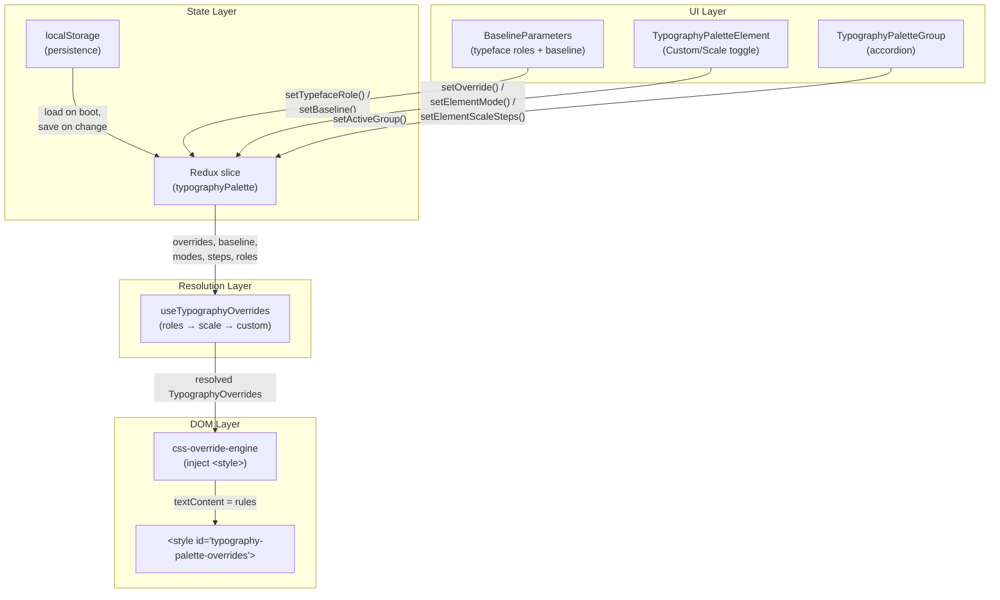

# Building a Typography Debug Palette for a React Docs Site

This article describes the design and implementation of a typography debug palette for a React documentation browser. The palette lets developers and designers adjust every typographic property of every UI element in real time — font family, font size, font weight, color, line height, letter spacing, and word spacing — without rebuilding or restarting anything. It introduces a typeface role system where three font assignments (Display, Body, Code) cascade to all elements, a baseline design system with modular scale ratios that derives sizes mathematically, and a CSS override engine that injects resolved values into the DOM.

The target audience is a developer or designer who wants to build a similar live-typography overlay for their own web application. The article assumes familiarity with React, Redux Toolkit, CSS custom properties, and the structure of a typical Vite-built SPA.

## Why this system exists

A documentation site with a classic Mac aesthetic uses many typographic contexts: title bars, menu bars, search inputs, tree navigation, section headers, markdown prose, code blocks, badges, and status bars. Each context has its own font size, weight, and color. When these values are scattered across a dozen CSS files, experimenting with typography requires editing multiple files, rebuilding the frontend, re-embedding assets into the Go binary, restarting the server, and refreshing the browser. That cycle takes minutes per change. It discourages exploration.

The debug palette collapses that cycle to zero. Changes are visible instantly because the palette injects CSS overrides directly into the DOM. No files are written. No builds run. The palette is ephemeral — refreshing the page restores the original styles unless you explicitly persist overrides to localStorage.

The typeface role system exists because even per-element font selection is the wrong abstraction for the most common typography decision. The designer's mental model is: "I want Chicago for chrome, Garamond for reading, Monaco for code." Three decisions, not thirty. The role system maps this mental model directly — three dropdowns cascade font family to every element in the appropriate group.

The design system layer exists because even with role-based font selection, adjusting thirty elements one by one for size is tedious. A baseline with a modular scale ratio lets you define a single base font size and a ratio, then assign each element a step on that scale. Changing the base or ratio recalculates every scale-mode element simultaneously. This is how professional design systems (Material Design, Tailwind, Bootstrap) work; the palette puts the same mechanism into the hands of the person viewing the site.

## Architecture overview

The palette has five layers, each with a clear responsibility:



The **state layer** holds all palette state in a Redux slice: the current overrides, typeface role assignments, baseline parameters, per-element mode assignments (custom or scale), per-element scale steps, the active preset, and custom presets. Every state change triggers a persist call that writes to localStorage.

The **resolution layer** merges three sources of typography values in priority order: per-element custom overrides (highest priority), typeface role assignments (font family inherited from Display/Body/Code), and scale-mode computed values (sizes derived from the baseline). It produces a single flat `TypographyOverrides` map that the DOM layer consumes.

The **DOM layer** generates CSS rules from the resolved overrides and injects them into a single `<style>` element in the document head. When the overrides map is empty, it clears the element. When it changes, it replaces the entire text content.

The **UI layer** renders the floating panel with typeface role controls, baseline parameters, preset selector, accordion groups, and per-element controls. It dispatches Redux actions; it does not manipulate the DOM directly.

## The typeface role system

The typeface role system is the highest-level typography control in the palette. It answers the question: "Which font family does each category of element use?"

### Three roles

Every adjustable element in the palette is assigned to one of three roles:

| Role | Purpose | Default font | What it covers |
|------|---------|-------------|----------------|
| **Display** | Chrome, navigation, signposts | Chicago_ | Title bar, menu bar, search input, package selector, nav toggle, type filter, section header heading, status bar, badges |
| **Body** | Reading, scanning, comprehension | Chicago_ | Root body, prose text, tree document rows, tree heading rows, card titles, card descriptions, section header subtitle, blockquotes, links, table headers |
| **Code** | Program text, identifiers, metadata | Monaco | Inline code, code blocks, header slug label |

The assignment is defined once in the element registry and then used by the resolution layer. When the user changes the Body role from Chicago_ to EB Garamond, every element with `typefaceRole: 'body'` receives the Garamond font stack. This is a single action that updates approximately fifteen elements simultaneously.

### Why three roles, not more or fewer

Three roles capture the fundamental typographic structure of a documentation browser:

- **Display** elements are navigational: you glance at them, you click them, you use them to orient yourself. They should be compact and distinctive. A bitmap font like Chicago_ works well here because it is legible at small sizes and has strong visual identity.

- **Body** elements are reading: you parse them sequentially, you spend sustained time with them, you need comfortable line height and spacing. A serif font like EB Garamond works well here because its old-style letterforms and moderate stroke contrast reduce eye fatigue over long passages.

- **Code** elements are monospaced by definition: they present program text where alignment and character width matter. Monaco is the classic Mac monospace; its clear character shapes and generous spacing make code readable at small sizes.

A four-role model (splitting "Navigation" from "Display") is possible, but in practice the title bar, menu bar, and navigation toggles share the same font assignment. A two-role model (merging "Display" and "Body") would force the chrome and the content to use the same font, which defeats the purpose.

### Role resolution in the override pipeline

The resolution layer applies role-based fontFamily before per-element custom overrides. The priority order is:

1. **Per-element custom override** (`overrides[elementId].fontFamily`): if the user explicitly set fontFamily on a specific element through the per-element dropdown, that value wins.
2. **Typeface role assignment** (`typefaceRoles[elem.typefaceRole]`): if no per-element override exists, the element inherits from its role.
3. **Element default** (`elem.defaults.fontFamily`): the original CSS value.

This means role assignments are the default, but per-element overrides serve as escape hatches. If you want the section header heading to use EB Garamond while all other display elements use Chicago_, you set Body=EB Garamond (which covers prose, tree, cards) and then explicitly set `header.heading.fontFamily = 'serif'` as a per-element override.

### Implementation

The `TypefaceRoleMap` type is a simple record:

```typescript
type TypefaceRole = 'display' | 'body' | 'code';
type TypefaceRoleMap = Record<TypefaceRole, FontFamily>;

const DEFAULT_TYPEFACE_ROLES: TypefaceRoleMap = {
  display: 'ui',
  body:    'ui',
  code:    'mono',
};
```

Each element in the registry has a `typefaceRole` field:

```typescript
// element-registry.ts
{
  id: 'prose.body',
  label: 'Body Text',
  typefaceRole: 'body',
  adjustable: ['fontFamily', 'fontSize', ...],
  // ...
},
{
  id: 'header.heading',
  label: 'Heading',
  typefaceRole: 'display',
  adjustable: ['fontFamily', 'fontSize', ...],
  // ...
},
{
  id: 'code.block',
  label: 'Code Block',
  typefaceRole: 'code',
  adjustable: ['fontFamily', 'fontSize', ...],
  // ...
},
```

The resolution layer in `useTypographyOverrides` iterates over all elements with `adjustable: ['fontFamily', ...]` and injects the role's font family for any element that lacks an explicit per-element override:

```typescript
for (const [elementId, elem] of elementMap.entries()) {
  if (!elem.adjustable.includes('fontFamily')) continue;
  const roleFont = typefaceRoles[elem.typefaceRole];
  if (!roleFont) continue;
  if (customOverrides[elementId]?.fontFamily) continue; // per-element wins
  if (!resolved[elementId]) resolved[elementId] = {};
  resolved[elementId].fontFamily = roleFont;
}
```

### The 🔤 Typeface Roles UI

The BaselineParameters panel includes a section with three dropdowns:

```
🔤 Typeface Roles
  Display  [Chicago_ ▾]
  Body     [EB Garamond ▾]
  Code     [Monaco ▾]
```

Each dropdown offers all three font families (Chicago_, Monaco, EB Garamond). Changing a dropdown dispatches `setTypefaceRole({ role, fontFamily })` to Redux, which triggers persistence and re-resolution. The effect is immediate: all elements in that role switch font family with no page reload.

### Presets with typeface roles

Presets bundle role assignments alongside overrides, baseline, and scale steps. The Serif Editorial preset uses:

```typescript
typefaceRoles: { display: 'ui', body: 'serif', code: 'mono' }
```

This single three-line object replaces what would otherwise require ten per-element `fontFamily` overrides (`root.body`, `prose.body`, `headings.h1`, `headings.h2`, `headings.h3`, `header.heading`, `extras.blockquote`, `tree.row`, `cards.title`, `header.subtitle`). The Dense Terminal preset uses:

```typescript
typefaceRoles: { display: 'mono', body: 'mono', code: 'mono' }
```

This replaces five per-element `fontFamily` overrides in the previous implementation.

## The font system

### Font families

The palette provides three font families, each with a CSS font stack that degrades gracefully:

| Family | Label | CSS stack |
|--------|-------|-----------|
| `ui` | Chicago_ | `'Chicago_', 'Geneva', 'Charcoal', 'Lucida Grande', 'Helvetica Neue', sans-serif` |
| `mono` | Monaco | `'Monaco', 'Courier New', monospace` |
| `serif` | EB Garamond | `'EB Garamond', 'Garamond', 'Georgia', 'Palatino', 'Times New Roman', serif` |

Each stack starts with the preferred font and falls back to system fonts with similar characteristics. If a user's system has Garamond or Georgia installed, the serif stack will use those before reaching Times New Roman.

### EB Garamond

EB Garamond is the serif body font. It is an open-source digitization of the historical Garamond typeface, produced by Georg Duffner under the SIL Open Font License 1.1. It is the closest free equivalent to Apple Garamond — the typeface Apple used for its corporate identity from 1984 to 2001.

The font is vendored as woff2 files in `web/public/fonts/`, sourced from the `@fontsource/eb-garamond` npm package. The following subsets and weights are included:

| File | Weight | Subset | Size |
|------|--------|--------|------|
| `eb-garamond-latin-400-normal.woff2` | Regular | Latin | 22 KB |
| `eb-garamond-latin-400-italic.woff2` | Italic | Latin | 22 KB |
| `eb-garamond-latin-500-normal.woff2` | Medium | Latin | 23 KB |
| `eb-garamond-latin-600-normal.woff2` | SemiBold | Latin | 23 KB |
| `eb-garamond-latin-700-normal.woff2` | Bold | Latin | 23 KB |
| `eb-garamond-latin-ext-400-normal.woff2` | Regular | Latin Extended | 57 KB |
| `eb-garamond-latin-ext-400-italic.woff2` | Italic | Latin Extended | 46 KB |
| `eb-garamond-latin-ext-500-normal.woff2` | Medium | Latin Extended | 65 KB |
| `eb-garamond-latin-ext-600-normal.woff2` | SemiBold | Latin Extended | 65 KB |
| `eb-garamond-latin-ext-700-normal.woff2` | Bold | Latin Extended | 64 KB |

The `@font-face` declarations in `global.css` use `local()` as the first source in the `src` list, so users who have EB Garamond installed system-wide will use the local copy instead of downloading the woff2 files. The `font-display: swap` directive ensures text renders immediately with a fallback font and reflows when EB Garamond loads.

The Latin Extended subset is listed first in the `src` chain. Browsers try each source in order and load the smallest file that covers the needed characters. A page with only basic Latin characters loads the 22 KB Latin file; a page with accented characters or Central European languages loads the 57 KB Latin Extended file.

## The type system

All palette data flows through TypeScript interfaces defined in `types/typography-palette.ts`. These types form the contract between every layer.

### TypographyProperties

The central data structure is `TypographyProperties`. It represents the set of CSS properties that can be overridden for any element:

```typescript
interface TypographyProperties {
  fontFamily?: FontFamily;    // 'ui' | 'mono' | 'serif'
  fontSize?: number;          // in px or em
  fontSizeUnit?: 'px' | 'em';
  fontWeight?: FontWeight;   // 100–900
  color?: GrayColor;         // 16 grayscale values
  lineHeight?: number;       // unitless multiplier
  letterSpacing?: number;   // in em
  wordSpacing?: number;      // in em
}
```

Every property is optional. An override object may set only the properties that differ from the CSS defaults. The resolution layer merges three sources in priority order: per-element custom overrides win over typeface role assignments, which win over scale-computed values, which win over element defaults.

The `GrayColor` type is a union of 16 hex strings from `#000` to `#fff` in 1/15 increments. The palette is monochrome by design; color experimentation is limited to choosing which shade of gray applies to which element.

### BaselineParameters

The design system is parameterized by five values:

```typescript
interface BaselineParameters {
  baseFontSize: number;        // px, default 13
  scaleRatioName: ScaleRatioName;  // e.g. 'major-third'
  baseLineHeight: number;      // unitless, default 1.6
  baseLetterSpacing: number;   // em, default 0
  baseWordSpacing: number;     // em, default 0
}
```

The scale ratio is a named constant drawn from musical intervals and mathematical proportions:

| Name | Value | Character |
|------|-------|-----------|
| Minor Second | 1.067 | Very subtle gradation |
| Major Second | 1.125 | Tight, functional |
| Minor Third | 1.200 | Compact but visible |
| Major Third | 1.250 | Balanced, classic |
| Perfect Fourth | 1.333 | Open, readable |
| Augmented Fourth | 1.414 | √2, musical tension |
| Perfect Fifth | 1.500 | Spacious, dramatic |
| Golden Ratio | 1.618 | Organic, mathematical |

These ratios produce the type scales found in professional design systems. A base of 16px with Major Third (1.25) yields: 8.19, 10.24, 12.8, 16, 20, 25, 31.25, 39.06 — a progression where each step is exactly 1.25× the previous.

### Scale steps

Elements in scale mode reference the baseline through a step index:

```
step −3:  base × ratio⁻³   (extra small)
step −2:  base × ratio⁻²   (small)
step −1:  base × ratio⁻¹   (medium)
step  0:  base × ratio⁰    (base — the baseline itself)
step +1:  base × ratio¹     (large)
step +2:  base × ratio²     (extra large)
step +3:  base × ratio³     (2× extra large)
step +4:  base × ratio⁴     (3× extra large)
```

The `computeScaledValue` function implements this directly:

```typescript
function computeScaledValue(base: number, ratio: number, step: number): number {
  return +(base * Math.pow(ratio, step)).toFixed(2);
}
```

For a base of 16px and ratio 1.25, step +4 produces `16 × 1.25⁴ = 39.06px`. Step −2 produces `16 × 1.25⁻² = 10.24px`. The formula is deterministic; given the same baseline inputs, it always produces the same outputs.

### Element mode

Each element can be in one of two modes:

- **Custom mode**: the element uses absolute values set through steppers and dropdowns. This is the default for existing overrides and for elements that do not participate in the design system.
- **Scale mode**: the element derives its font size from a scale step. Other properties (weight, color, family) remain individually adjustable.

The mode is stored per-element in `ElementSizeModeMap`, a `Record<string, 'custom' | 'scale'>`. When an element switches to scale mode, it uses the scale step assigned to it (or its default step from the element registry) to compute font size from the baseline.

## The element registry

Every adjustable element in the documentation browser is enumerated in `element-registry.ts`. This is the single source of truth for what the palette can control. The registry is organized into 13 groups, each containing one or more elements:

| Group | Elements | Scale step range | Typeface role |
|-------|----------|------------------|---------------|
| Root / Body | Body Text | 0 | body |
| Title Bar | Title Text | −1 | display |
| Menu Bar | Menu Items, App Name | −1, −2 | display |
| Sidebar Controls | Search, Package Selector, Nav Toggle, Type Filter | −1 to −3 | display |
| Sidebar Tree | Document Row, Heading Row | −1, −2 | body |
| Sidebar Cards | Card Title, Card Description | −1, −3 | body |
| Section Header | Slug Label, Heading, Subtitle | −3, +4, −1 | code, display, body |
| Markdown Prose | Body Text | 0 (with line height) | body |
| Markdown Headings | H1, H2, H3 | +4, +3, +2 | display |
| Markdown Code | Inline Code, Code Block | −1 each | code |
| Markdown Extras | Blockquote, Link, Table Header | 0, —, — | body |
| Status Bar | Status Text | −3 | display |
| Badges | Badge | −3 | display |

Each element record contains:

- `id`: a stable key used in overrides, modes, and scale steps maps
- `label`: human-readable name shown in the UI
- `adjustable`: which properties can be changed (fontFamily, fontSize, fontWeight, color, lineHeight, letterSpacing, wordSpacing)
- `defaults`: the CSS default values for this element, used as fallbacks when no override is set
- `selector`: the CSS selector that targets this element in the DOM
- `supportsScale`: whether this element can be put in scale mode
- `defaultFontSizeStep`: the step assigned by default when the element enters scale mode
- `defaultLineHeightStep`: the line height offset step for elements with line height controls
- `typefaceRole`: which of the three roles (display, body, code) this element belongs to

The `typefaceRole` field is the single most important piece of metadata in the registry. It determines which role dropdown controls the element's font family. The Section Header group demonstrates that elements within the same group can have different roles: the slug label is `code` (monospace), the heading is `display` (chrome/title), and the subtitle is `body` (reading).

The selector field uses the same `data-part` attribute selectors that the component CSS files use. For example, the title bar title is targeted with `[data-part='titlebar-title']`. This means the injected CSS rules have the same specificity as the component styles, but win by cascade order (the injected `<style>` appears later in the document).

## The CSS override engine

The `css-override-engine.ts` module is responsible for converting `TypographyOverrides` into CSS text and injecting it into the DOM. It also provides the export-to-clipboard functionality.

### Rule generation

For each element in the overrides map, the engine looks up the element's selector from the registry, then builds a list of CSS declarations from the properties that are set:

```typescript
function buildDeclarations(props: TypographyProperties): string[] {
  const declarations: string[] = [];
  if (props.fontFamily !== undefined) {
    declarations.push(`  font-family: ${FONT_STACKS[props.fontFamily]};`);
  }
  if (props.fontSize !== undefined) {
    const unit = props.fontSizeUnit || 'px';
    declarations.push(`  font-size: ${props.fontSize}${unit};`);
  }
  if (props.fontWeight !== undefined) {
    declarations.push(`  font-weight: ${props.fontWeight};`);
  }
  if (props.color !== undefined) {
    declarations.push(`  color: ${props.color};`);
  }
  if (props.lineHeight !== undefined) {
    declarations.push(`  line-height: ${props.lineHeight};`);
  }
  if (props.letterSpacing !== undefined) {
    declarations.push(`  letter-spacing: ${props.letterSpacing}em;`);
  }
  if (props.wordSpacing !== undefined) {
    declarations.push(`  word-spacing: ${props.wordSpacing}em;`);
  }
  return declarations;
}
```

The generated CSS for a palette with role-based fonts and scale-mode sizes might look like this:

```css
.app-root {
  font-family: 'EB Garamond', 'Garamond', 'Georgia', 'Palatino', 'Times New Roman', serif;
  font-size: 17px;
  line-height: 1.75;
}

[data-part='titlebar-title'] {
  font-family: 'Chicago_', 'Geneva', 'Charcoal', 'Lucida Grande', 'Helvetica Neue', sans-serif;
  font-size: 13.6px;
}

[data-part='section-header-heading'] {
  font-family: 'Chicago_', 'Geneva', 'Charcoal', 'Lucida Grande', 'Helvetica Neue', sans-serif;
  font-size: 41.5px;
}

[data-part='markdown-content'] pre {
  font-family: 'Monaco', 'Courier New', monospace;
  font-size: 13.6px;
}
```

These rules are written to a `<style id="typography-palette-overrides">` element in the document head. Because this element appears after the component CSS files, it wins by cascade order. No `!important` is needed.

### Export formats

The palette offers two export formats, both copied to the clipboard:

**CSS rules** (`format: 'rules'`): per-selector CSS rules matching the injected format. Paste these into component CSS files to make the overrides permanent.

**CSS variables** (`format: 'variables'`): a `:root` block mapping overrides to CSS custom property names where a logical mapping exists. For example, `root.body.fontSize` maps to `--font-size-base`, `extras.link.color` maps to `--color-accent`. This format is useful for updating `global.css`.

## The resolution layer

The `useTypographyOverrides` hook is where typeface role assignments, scale-mode computed values, and custom overrides are merged into a single overrides map. This is the most architecturally important piece of the system.

### Three sources of truth

There are three independent sources of typography values, listed in ascending priority:

1. **Scale-mode computed values** (lowest priority): derived from `baseline` parameters and per-element `elementScaleSteps`. These provide font size, line height, letter spacing, and word spacing for elements in scale mode.

2. **Typeface role assignments** (medium priority): the `typefaceRoles` map assigns a font family to each role (display, body, code). Every element inherits from its role unless an explicit per-element override exists.

3. **Per-element custom overrides** (highest priority): explicit values set through the UI steppers and dropdowns. If a user sets `fontFamily` on a specific element, that value wins over the role assignment.

### Resolution algorithm

The resolution runs in three phases:

**Phase 1: Scale-mode computation.** For each element where `elementModes[elementId] === 'scale'`, compute concrete properties from the baseline:

```
for each element where mode is 'scale':
    compute font size from baseFontSize × ratio^step
    compute line height from baseLineHeight + lineHeightStep × 0.1
    inherit baseLetterSpacing and baseWordSpacing if non-zero
    add computed properties to resolved map
```

**Phase 2: Typeface role inheritance.** For each element that supports `fontFamily`, inject the role's font family unless a per-element override already sets it:

```
for each element with adjustable fontFamily:
    if customOverrides[elementId].fontFamily is set: skip
    set resolved[elementId].fontFamily = typefaceRoles[elem.typefaceRole]
```

**Phase 3: Custom override merging.** Per-element overrides are merged on top, winning for any property they explicitly set:

```
for each element in custom overrides:
    merge custom properties on top of resolved values
    (custom wins for any property it explicitly sets)
```

This three-phase approach means that a user can put an element in scale mode to get its font size from the baseline, inherit its font family from the role, and override just its color or weight with custom values. All three sources cooperate.

The hook uses `useMemo` to avoid recomputing on every render. It depends on five Redux selectors: `overrides`, `baseline`, `elementModes`, `elementScaleSteps`, and `typefaceRoles`. When any of these change, the resolved map is recomputed and the effect applies the new CSS.

### Why not compute in the Redux slice

The resolution could be done in the Redux slice, but the hook is a better location for two reasons. First, `computeScaledValue` calls `Math.pow`, which is a pure function with no side effects — it belongs in a computation layer, not in the state layer. Second, the resolved map is derived state. Storing it in Redux would create a synchronization problem: every change to baseline, steps, or roles would need to update both the source values and the derived values, and the derived values must never drift from the sources.

## The Redux slice

The `typographyPaletteSlice` manages nine categories of state:

| State field | Type | Purpose |
|------------|------|---------|
| `isOpen` | boolean | Palette visibility |
| `activeGroup` | string \| null | Which accordion group is expanded |
| `activePreset` | string \| null | Currently selected preset ID |
| `overrides` | TypographyOverrides | Per-element custom property overrides |
| `customPresets` | TypographyPreset[] | User-saved presets (stored in localStorage) |
| `baseline` | BaselineParameters | Design system parameters |
| `elementModes` | ElementSizeModeMap | Per-element custom/scale toggle state |
| `elementScaleSteps` | Record<string, ElementScaleSteps> | Per-element step assignments for scale mode |
| `typefaceRoles` | TypefaceRoleMap | Font family assignments for Display/Body/Code |
| `copiedFeedback` | string \| null | "Copied!" flash text |

The slice persists state to localStorage after every mutating action. The persistence function serializes the full state shape (overrides, baseline, modes, steps, roles, custom presets) into a single JSON blob under the key `glazed-typography-palette`. On boot, the slice initializer loads from localStorage if available, falling back to defaults.

### Action design

Every user interaction dispatches a single Redux action. The actions are coarse-grained — they carry the full payload needed to update state, rather than requiring the reducer to compute derived values:

- `setTypefaceRole({ role, fontFamily })` — sets the font family for a typeface role, cascading to all elements in that role
- `setOverride({ elementId, properties })` — merges properties into the existing overrides for an element
- `setBaseline(partial)` — merges partial baseline parameters (like `React.setState`)
- `setElementMode({ elementId, mode })` — switches an element between custom and scale
- `setElementScaleSteps({ elementId, steps })` — merges scale step assignments for an element
- `setPreset({ presetId, overrides, baseline, elementModes, elementScaleSteps, typefaceRoles })` — loads a full preset, replacing all relevant state
- `saveAsPreset({ label, id })` — snapshots the current state as a new custom preset
- `resetAllOverrides()` — clears everything back to defaults (including typeface roles)

Every mutating action calls `persistAfterChange(state)`, which writes the current state to localStorage. This is synchronous and cheap for the data sizes involved (typically under 10KB of JSON).

## The element control component

The `TypographyPaletteElement` component renders the controls for a single element. It has two responsibilities: display the correct controls for the element's adjustable properties, and dispatch the right Redux actions when values change.

### The Custom/Scale toggle

Elements that support the design system (`supportsScale: true`) display a toggle between Custom and Scale mode. The toggle is a pair of buttons styled like the navigation mode toggle elsewhere in the app:

```
┌──────────────┐
│ Custom │ Scale│
└──────────────┘
```

When Custom is selected, the font size control renders a `FontSizeStepper` with absolute px or em values. When Scale is selected, it renders a `ScaleStepSelect` dropdown that shows step labels with their computed values:

```
┌──────────────────────────────┐
│ base (0) → 16px              │
│ lg  (+1) → 20px              │
│ xl  (+2) → 25px              │
│ ...                          │
└──────────────────────────────┘
```

The toggle does not affect font family. Font family is controlled at the role level (Display/Body/Code dropdowns in the baseline panel), not at the element level. The per-element `fontFamily` dropdown remains available as an escape hatch — setting it overrides the role assignment for that one element.

### Letter and word spacing

Letter spacing and word spacing use `FontSizeStepper` with `unit="em"` and a step of 0.01. This gives fine-grained control over horizontal rhythm. Letter spacing at 0.01–0.05em improves readability of sans-serif fonts at small sizes; word spacing at 0.05–0.1em adds breath between words for large-print or high-line-height settings.

These properties are rendered as `em` units in the CSS output:

```css
[data-part='markdown-content'] {
  letter-spacing: 0.02em;
  word-spacing: 0.05em;
}
```

## The baseline parameter panel

The `BaselineParameters` component sits at the top of the palette, above the preset selector and the accordion groups. It controls two categories of global parameters: the typeface role assignments and the design system baseline.

### Typeface role controls

The 🔤 Typeface Roles section contains three dropdowns, one per role:

```
🔤 Typeface Roles
  Display  [Chicago_ ▾]
  Body     [EB Garamond ▾]
  Code     [Monaco ▾]
```

Each dropdown offers all three font families. Changing a dropdown dispatches `setTypefaceRole` to Redux. The effect is immediate: all elements in that role switch font family with no page reload.

This is the most impactful control in the palette. A single dropdown change — switching Body from Chicago_ to EB Garamond — transforms the entire reading experience of the documentation browser. Prose text, tree navigation, card descriptions, blockquotes, and markdown headings all switch to the serif font simultaneously.

### Baseline controls

Below the typeface roles, the panel shows the five design system parameters:

- **Base** (px): the root font size from which the scale derives all other sizes
- **Scale**: the named ratio (Minor Second through Golden Ratio)
- **L-Height**: the base line height multiplier
- **L-Space**: base letter spacing in em
- **W-Space**: base word spacing in em

### The scale preview

Below the controls, the panel shows a row of computed sizes at each step. This preview updates in real time as you change the base size or ratio:

```
10.88px  13.6px  →17px  21.25px  26.56px  33.2px  41.5px
```

The arrow marks step 0 (the base). This preview gives immediate feedback about how the scale ratio distributes sizes across the step range, before you open any accordion group.

### The ratio selector

The ratio dropdown shows the numeric value and the musical/mathematical name for each ratio. This is more informative than a bare number: "1.250 — Major Third" tells you both the value and the relationship it represents. Designers who work with type scales will recognize these names from typographic tradition.

## Presets

Presets bundle a complete set of palette state into a named entity. A preset captures: overrides, baseline parameters, element modes, scale steps, and typeface role assignments. Loading a preset restores all five.

### Built-in presets

The palette ships with seven built-in presets:

| Preset | Base | Ratio | Display | Body | Code | Approach |
|--------|------|-------|---------|------|------|----------|
| Classic Mac (default) | 13 | Major Third | ui | ui | mono | Empty overrides — uses CSS as-is |
| Clean Modern | 16 | Perfect Fourth | ui | ui | mono | Custom overrides with larger sizes and softer grays |
| Dense Terminal | 12 | Minor Third | mono | mono | mono | All mono — three roles set to Monaco |
| Large Print | 18 | Perfect Fifth | ui | ui | mono | Custom overrides with big sizes and generous spacing |
| Scale System (1.25) | 16 | Major Third | ui | ui | mono | All elements in scale mode, no custom overrides |
| Serif Editorial | 17 | Perfect Fourth | ui | serif | mono | Garamond body, Chicago_ chrome, generous line height |
| Serif Scale | 17 | Major Third | ui | serif | mono | Garamond body + scale system, all elements in scale mode |

The Serif Editorial and Serif Scale presets demonstrate how the typeface role system changes the character of the entire site with three assignments. The Display role stays on Chicago_ — the title bar, menu bar, and navigation chrome retain the classic Mac bitmap identity. The Body role switches to serif — prose text, tree navigation, and card descriptions render in EB Garamond. The Code role stays on Monaco — code blocks and inline code remain monospaced.

The Dense Terminal preset takes the opposite approach: all three roles are set to mono. Every element — chrome, reading text, and code — renders in Monaco. This creates a terminal-like aesthetic where the entire UI has the same typographic texture.

### How typeface roles simplify presets

Before the role system, the Serif Editorial preset required explicit `fontFamily` overrides on ten elements:

```typescript
// Old approach — per-element fontFamily overrides
const SERIF_EDITORIAL_OVERRIDES: TypographyOverrides = {
  'root.body':           { fontFamily: 'serif', ... },
  'prose.body':          { fontFamily: 'serif', ... },
  'headings.h1':         { fontFamily: 'serif', ... },
  'headings.h2':         { fontFamily: 'serif', ... },
  'headings.h3':         { fontFamily: 'serif', ... },
  'header.heading':      { fontFamily: 'serif', ... },
  'header.subtitle':     { fontFamily: 'serif', ... },
  'extras.blockquote':   { fontFamily: 'serif', ... },
  'code.inline':         { fontFamily: 'mono', ... },
  'code.block':          { fontFamily: 'mono', ... },
  // ...
};
```

With the role system, those ten overrides collapse to three lines:

```typescript
typefaceRoles: { display: 'ui', body: 'serif', code: 'mono' }
```

The per-element overrides in the preset now only contain non-font-family properties (sizes, weights, colors, spacing). This is a meaningful reduction in cognitive load: the preset's intent ("serif body, mono code, ui chrome") is immediately visible instead of being distributed across ten entries.

### Custom presets

Users can save the current palette state as a custom preset. The save form appears inline when the ★ Save button is clicked. Custom presets are stored in localStorage alongside the rest of the palette state. They can be deleted through a ✕ button that appears when a custom preset is active.

The `saveAsPreset` action snapshots the current overrides, baseline, element modes, scale steps, and typeface roles into a `TypographyPreset` object and appends it to the `customPresets` array. The preset ID is `custom-{Date.now()}`, which guarantees uniqueness.

## Persistence

The persistence layer serializes the full palette state to a single localStorage key on every state change. The serialized shape includes:

```json
{
  "overrides": { "root.body": { "fontSize": 16, "color": "#222" } },
  "activePreset": "custom-1779976014028",
  "customPresets": [{ "id": "...", "label": "My Custom", "overrides": {...} }],
  "baseline": { "baseFontSize": 16, "scaleRatioName": "major-third", ... },
  "elementModes": { "root.body": "scale", "titlebar.title": "scale" },
  "elementScaleSteps": { "root.body": { "fontSizeStep": 0 } },
  "typefaceRoles": { "display": "ui", "body": "serif", "code": "mono" }
}
```

On boot, the Redux slice initializer calls `loadPaletteState()`, which parses this JSON with basic structural validation. If the parsed object passes validation (it has an `overrides` object and a `customPresets` array), it becomes the initial state. If parsing fails or validation rejects, the slice falls back to defaults.

This design means palette state survives page refreshes and HMR updates. It also means state from an older version of the palette loads gracefully: missing fields fall back to defaults. When `typefaceRoles` was added, the persistence layer was updated to inject `DEFAULT_TYPEFACE_ROLES` for any persisted state that lacked the field. This migration happens at load time, with no user action required.

## The keyboard shortcut and dev guard

The palette is activated by `Ctrl+Shift+T` (or `Cmd+Shift+T` on macOS) and by a small `𝒜a` button in the status bar. Both are gated by `import.meta.env.DEV`, which Vite sets to `true` in development mode and `false` in production builds. In a production build, the dead-code eliminator removes the shortcut handler and the toggle button entirely. The palette component still renders if `isOpen` is somehow true (for example, if localStorage contains a stale `isOpen: true`), but there is no way to open it from the production UI.

## File inventory

The palette consists of 20 source files across three directories, plus 10 vendored font files:

```
web/src/types/typography-palette.ts           # 260 lines — types, roles, scale, presets
web/src/store/typographyPaletteSlice.ts        # 210 lines — Redux slice with persistence

web/src/components/TypographyPalette/
  TypographyPalette.tsx                        # 240 lines — main panel
  TypographyPaletteGroup.tsx                   #  45 lines — accordion group
  TypographyPaletteElement.tsx                 # 215 lines — per-element controls
  BaselineParameters.tsx                       # 145 lines — typeface roles + baseline panel
  ScaleStepSelect.tsx                          #  47 lines — step dropdown with computed values
  FontFamilySelect.tsx                         #  23 lines — font dropdown
  FontSizeStepper.tsx                          #  53 lines — size +/- stepper
  FontWeightSelect.tsx                         #  36 lines — weight dropdown
  ColorStepper.tsx                             #  51 lines — gray shade stepper
  css-override-engine.ts                       # 188 lines — CSS generation + clipboard export
  element-registry.ts                          # 345 lines — 13 groups, 30+ elements, role assignments
  presets.ts                                   # 260 lines — 7 built-in presets
  persistence.ts                               #  65 lines — localStorage save/load with migration
  useTypographyOverrides.ts                    # 120 lines — roles → scale → custom resolution
  usePaletteShortcut.ts                        #  25 lines — Ctrl+Shift+T hook
  parts.ts                                     #  28 lines — data-part constants
  styles/typography-palette.css                # 315 lines — palette styles

web/public/fonts/
  ChicagoFLF.woff2                             # vendored Chicago_ bitmap font
  eb-garamond-latin-400-normal.woff2            # EB Garamond regular
  eb-garamond-latin-400-italic.woff2            # EB Garamond italic
  eb-garamond-latin-500-normal.woff2            # EB Garamond medium
  eb-garamond-latin-600-normal.woff2            # EB Garamond semi-bold
  eb-garamond-latin-700-normal.woff2            # EB Garamond bold
  eb-garamond-latin-ext-{400,500,600,700}-normal.woff2  # extended Latin subsets
```

Three existing files were modified:

- `web/src/store.ts` — added the `typographyPalette` reducer
- `web/src/App.tsx` — renders `<TypographyPalette />` and calls `usePaletteShortcut()`
- `web/src/components/StatusBar/StatusBar.tsx` — added the `𝒜a` toggle button

Total: approximately 2,700 lines of new code.

## Implementation sequence

If you are building a similar system in another application, the following sequence avoids unnecessary rework:

1. **Define the types first.** The `TypographyProperties` interface, the `TypefaceRoleMap`, and the `TypographyOverrides` map are the foundation. Every other layer depends on them.

2. **Build the CSS override engine.** Implement `applyOverrides()` and `clearOverrides()`. Test them from the browser console by dispatching Redux actions manually. Verify that injected rules actually override the component CSS.

3. **Build the element registry.** Enumerate every adjustable element with its selector, defaults, and typeface role assignment. This is tedious but mechanical. Audit every component CSS file for hardcoded font-size, font-weight, and color values.

4. **Build the Redux slice.** Start with just `isOpen`, `activeGroup`, `overrides`, and `typefaceRoles`. Add persistence. Test by opening the palette and dispatching actions from DevTools.

5. **Build the UI components.** Start with the typeface role dropdowns and the baseline controls, then the stepper and dropdown controls, then the element component, then the accordion group, then the main panel.

6. **Add the baseline and scale mode.** The types need to expand, the slice needs new actions, and the resolution hook needs to merge scale-mode values with role-based values and custom overrides.

7. **Add presets.** Presets bundle all palette state (overrides, baseline, modes, steps, roles) into a named object. Loading a preset replaces all relevant state.

8. **Add export.** The clipboard export is the final piece. Two formats (rules and variables) cover the two main use cases: pasting into component CSS files and pasting into `global.css`.

## Design decisions and their rationale

### Why typeface roles instead of per-element font selection only

Per-element font selection is correct for fine-tuning but wrong as the primary mechanism. The designer's mental model is "I want Garamond for reading, Chicago for chrome, Monaco for code" — three decisions, not thirty. The role system maps this mental model directly. Role assignments cascade to element groups; per-element overrides remain available as escape hatches. This is the same pattern that CSS uses: a `font-family` declaration on `<body>` cascades to all children, and individual elements can override it.

### Why headings are in the Display role, not Body

Markdown headings (h1, h2, h3) and the section header heading are navigational signposts. You scan them to orient yourself within a document; you do not read them sequentially like body text. Their function is display, not reading. This matches the user's stated intent: "Chicago as title / menu / headers." If a future design calls for headings in the body font, the per-element fontFamily override provides the escape hatch.

### Why data-part selectors instead of class names

The documentation browser uses `data-part` attributes for all component styling. This convention means every element has a stable, semantic identifier that the palette can target. If the app used CSS class names instead, the palette would need to know which class to target for each element — a more fragile mapping. The `data-part` convention gives the palette the same selectors the component CSS uses, which means injected overrides have exactly the same specificity and win purely by cascade order.

### Why a single injected `<style>` element instead of inline styles

Inline styles have the highest specificity in CSS. They override everything, including `!important` declarations. This makes them hard to debug and hard to undo. A single `<style>` element at the end of the `<head>` is more predictable: it overrides component CSS by cascade order, but it is easy to inspect in DevTools and easy to clear (set `textContent` to empty).

### Why ephemeral overrides instead of modifying CSS files

The palette exists for experimentation, not for permanent changes. When you find a combination you like, you export it as CSS and paste it into the codebase. The palette itself never touches files. This separation keeps the feedback loop fast (no rebuild needed) while making the permanent path explicit (export → paste → commit).

### Why scale mode is per-element instead of global

A global "use scale mode for everything" toggle would be simpler to implement, but it would force an all-or-nothing choice. Some elements benefit from scale-derived sizes (headings, body text, sidebar items) while others are better with custom values (code blocks at fixed 12px, badges at fixed 10px). Per-element toggle lets you use the design system where it helps and override where it doesn't.

### Why letter spacing and word spacing use em units

Pixel-based letter spacing produces different visual effects at different font sizes. A `1px` letter spacing on 12px text looks dramatically different from `1px` on 24px text. Em-based spacing scales proportionally: `0.02em` adds a consistent visual gap relative to the current font size. This is why professional typographic systems specify tracking in ems or thousandths of an em.

## Common failure modes

### Scale steps produce unexpected sizes for em-based elements

Markdown headings use `em` units: `h1` is `1.6em`, `h2` is `1.3em`. In scale mode, the step computes a multiplier from the base: step +4 with ratio 1.25 gives `1 × 1.25⁴ = 2.44em`. This is different from the CSS default of `1.6em`. The result is mathematically consistent (it follows the modular scale) but may not match the designer's intent for heading proportions. The fix is to either accept the scale-derived value as the new default, or switch those specific elements back to custom mode.

### localStorage state from an older version breaks the palette

If the palette's type definitions change between versions (a field is renamed, a union type gains a new member), the persisted JSON may not parse correctly. The persistence layer handles this by validating the structural shape of the loaded data and falling back to defaults for missing or invalid fields. When `typefaceRoles` was added, the persistence layer was updated to inject `DEFAULT_TYPEFACE_ROLES` for any persisted state that lacked the field. This graceful degradation prevents the palette from crashing on boot after an upgrade.

### Injected CSS does not override component styles

This happens when a component CSS file uses `!important` on a property that the palette also tries to override. The palette's injected `<style>` element does not use `!important` by design. If a component style uses `!important`, the palette cannot override it without also using `!important`, which escalates the specificity arms race. The correct fix is to remove `!important` from the component CSS. In the current codebase, no component styles use `!important`.

### Role assignment does not affect an element

This happens when the element has a per-element `fontFamily` override from a previous session. Per-element overrides win over role assignments. The fix is to clear the per-element override (either through the element's dropdown or by clicking Reset). The palette does not currently indicate which elements have per-element overrides that shadow their role assignment — this is a UX gap that could be addressed with a visual indicator.

## Working rules

- The element registry is the single source of truth for what the palette can control and what role each element belongs to. Add new elements there before adding controls.
- The resolution layer must remain pure: given the same inputs, it produces the same outputs. Never put side effects in the resolution hook.
- Priority order is strict: per-element custom overrides > typeface role assignments > scale-computed values > element defaults. No layer can bypass a higher-priority layer.
- The palette must never modify source files. Its contract is: inspect, experiment, export. Making changes permanent is a separate step.
- All new typographic properties must be added to `TypographyProperties`, the CSS override engine's `buildDeclarations`, and the export formatters. If you add a property to one but not the others, the palette will silently drop it in some code paths.
- When adding a new font family, you must update: `FontFamily` type, `FONT_FAMILY_LABELS`, `FONT_STACKS`, the `@font-face` declarations in `global.css`, and any vendored woff2 files. Missing any of these causes either a type error or a font that does not load.

## Related notes

- The design document for this feature is in the GL-012 ticket at `ttmp/2026/05/28/GL-012--typography-debug-palette-for-docs-site/design/01-typography-debug-palette-analysis-design-implementation-guide.md`
- The implementation diary is at `ttmp/2026/05/28/GL-012--typography-debug-palette-for-docs-site/reference/01-diary.md`
