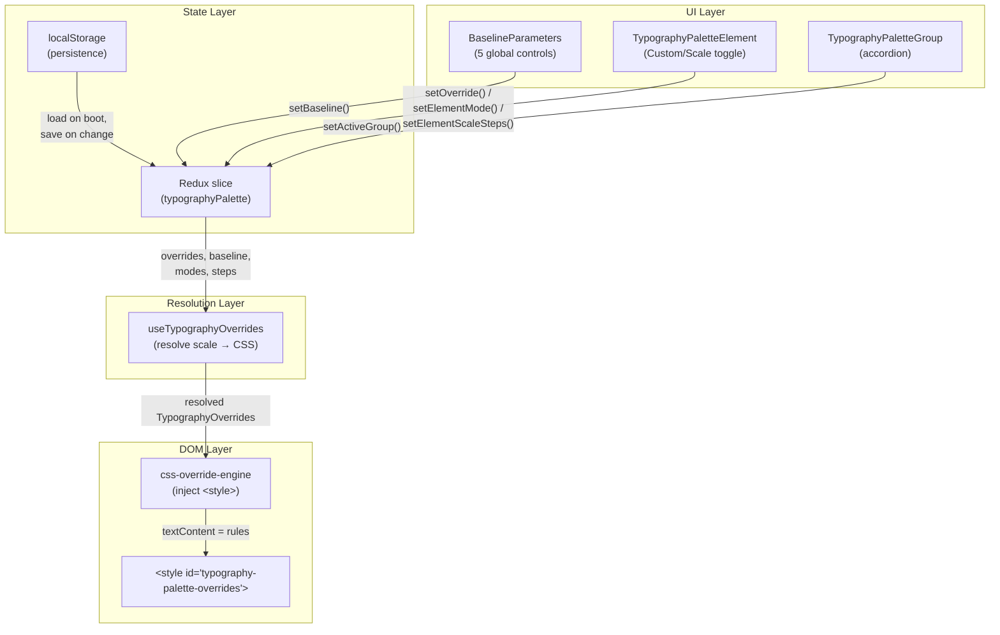

# Building a Typography Debug Palette for a React Docs Site

This article describes the design and implementation of a typography debug palette for a React documentation browser. The palette lets developers and designers adjust every typographic property of every UI element in real time — font family, font size, font weight, color, line height, letter spacing, and word spacing — without rebuilding or restarting anything. It also introduces a baseline design system with modular scale ratios, so that instead of tweaking thirty individual values, you set five global parameters and let a mathematical scale derive the rest.

The target audience is a developer or designer who wants to build a similar live-typography overlay for their own web application. The article assumes familiarity with React, Redux Toolkit, CSS custom properties, and the structure of a typical Vite-built SPA.

## Why this system exists

A documentation site with a classic Mac aesthetic uses many typographic contexts: title bars, menu bars, search inputs, tree navigation, section headers, markdown prose, code blocks, badges, and status bars. Each context has its own font size, weight, and color. When these values are scattered across a dozen CSS files, experimenting with typography requires editing multiple files, rebuilding the frontend, re-embedding assets into the Go binary, restarting the server, and refreshing the browser. That cycle takes minutes per change. It discourages exploration.

The debug palette collapses that cycle to zero. Changes are visible instantly because the palette injects CSS overrides directly into the DOM. No files are written. No builds run. The palette is ephemeral — refreshing the page restores the original styles unless you explicitly persist overrides to localStorage.

The design system layer exists because even with instant overrides, adjusting thirty elements one by one is tedious. A baseline with a modular scale ratio lets you define a single base font size and a ratio, then assign each element a step on that scale. Changing the base or ratio recalculates every scale-mode element simultaneously. This is how professional design systems (Material Design, Tailwind, Bootstrap) work; the palette puts the same mechanism into the hands of the person viewing the site.

## Architecture overview

The palette has four layers, each with a clear responsibility:



The **state layer** holds all palette state in a Redux slice: the current overrides, baseline parameters, per-element mode assignments (custom or scale), per-element scale steps, the active preset, and custom presets. Every state change triggers a persist call that writes to localStorage.

The **resolution layer** merges two sources of typography values: custom overrides (explicit per-element values set through the UI) and scale-mode overrides (values computed from the baseline parameters and scale steps). It produces a single flat `TypographyOverrides` map that the DOM layer consumes.

The **DOM layer** generates CSS rules from the resolved overrides and injects them into a single `<style>` element in the document head. When the overrides map is empty, it clears the element. When it changes, it replaces the entire text content.

The **UI layer** renders the floating panel with baseline controls, preset selector, accordion groups, and per-element controls. It dispatches Redux actions; it does not manipulate the DOM directly.

## The type system

All palette data flows through TypeScript interfaces defined in `types/typography-palette.ts`. These types form the contract between every layer.

### TypographyProperties

The central data structure is `TypographyProperties`. It represents the set of CSS properties that can be overridden for any element:

```typescript
interface TypographyProperties {
  fontFamily?: FontFamily;    // 'ui' | 'mono'
  fontSize?: number;          // in px or em
  fontSizeUnit?: 'px' | 'em';
  fontWeight?: FontWeight;     // 100–900
  color?: GrayColor;          // 16 grayscale values
  lineHeight?: number;        // unitless multiplier
  letterSpacing?: number;     // in em
  wordSpacing?: number;       // in em
}
```

Every property is optional. An override object may set only the properties that differ from the CSS defaults. The resolution layer merges defaults, scale-computed values, and custom overrides in that priority order: custom wins over scale, scale wins over defaults.

The `GrayColor` type is a union of 16 hex strings from `#000` to `#fff` in 1/15 increments. The palette is monochrome by design; color experimentation is limited to choosing which shade of gray applies to which element.

### BaselineParameters

The design system is parameterized by five values:

```typescript
interface BaselineParameters {
  baseFontSize: number;        // px, default 13
  scaleRatioName: ScaleRatioName;  // e.g. 'major-third'
  baseLineHeight: number;      // unitless, default 1.6
  baseLetterSpacing: number;   // em, default 0
  baseWordSpacing: number;     // em, default 0
}
```

The scale ratio is a named constant drawn from musical intervals and mathematical proportions:

| Name | Value | Character |
|------|-------|-----------|
| Minor Second | 1.067 | Very subtle gradation |
| Major Second | 1.125 | Tight, functional |
| Minor Third | 1.200 | Compact but visible |
| Major Third | 1.250 | Balanced, classic |
| Perfect Fourth | 1.333 | Open, readable |
| Augmented Fourth | 1.414 | √2, musical tension |
| Perfect Fifth | 1.500 | Spacious, dramatic |
| Golden Ratio | 1.618 | Organic, mathematical |

These ratios produce the type scales found in professional design systems. A base of 16px with Major Third (1.25) yields: 8.19, 10.24, 12.8, 16, 20, 25, 31.25, 39.06 — a progression where each step is exactly 1.25× the previous.

### Scale steps

Elements in scale mode reference the baseline through a step index:

```
step −3:  base × ratio⁻³   (extra small)
step −2:  base × ratio⁻²   (small)
step −1:  base × ratio⁻¹   (medium)
step  0:  base × ratio⁰    (base — the baseline itself)
step +1:  base × ratio¹     (large)
step +2:  base × ratio²     (extra large)
step +3:  base × ratio³     (2× extra large)
step +4:  base × ratio⁴     (3× extra large)
```

The `computeScaledValue` function implements this directly:

```typescript
function computeScaledValue(base: number, ratio: number, step: number): number {
  return +(base * Math.pow(ratio, step)).toFixed(2);
}
```

For a base of 16px and ratio 1.25, step +4 produces `16 × 1.25⁴ = 39.06px`. Step −2 produces `16 × 1.25⁻² = 10.24px`. The formula is deterministic; given the same baseline inputs, it always produces the same outputs.

### Element mode

Each element can be in one of two modes:

- **Custom mode**: the element uses absolute values set through steppers and dropdowns. This is the default for existing overrides and for elements that do not participate in the design system.
- **Scale mode**: the element derives its font size from a scale step. Other properties (weight, color, family) remain individually adjustable.

The mode is stored per-element in `ElementSizeModeMap`, a `Record<string, 'custom' | 'scale'>`. When an element switches to scale mode, it uses the scale step assigned to it (or its default step from the element registry) to compute font size from the baseline.

## The element registry

Every adjustable element in the documentation browser is enumerated in `element-registry.ts`. This is the single source of truth for what the palette can control. The registry is organized into 13 groups, each containing one or more elements:

| Group | Elements | Scale-relevant? |
|-------|----------|----------------|
| Root / Body | Body Text | Yes — base step 0 |
| Title Bar | Title Text | Yes — step −1 |
| Menu Bar | Menu Items, App Name | Yes — steps −1, −2 |
| Sidebar Controls | Search, Package Selector, Nav Toggle, Type Filter | Yes — steps −1 to −3 |
| Sidebar Tree | Document Row, Heading Row | Yes — steps −1, −2 |
| Sidebar Cards | Card Title, Card Description | Yes — steps −1, −3 |
| Section Header | Slug Label, Heading, Subtitle | Yes — steps −3, +4, −1 |
| Markdown Prose | Body Text | Yes — step 0 (with line height and spacing) |
| Markdown Headings | H1, H2, H3 | Yes — steps +4, +3, +2 |
| Markdown Code | Inline Code, Code Block | Yes — steps −1 each |
| Markdown Extras | Blockquote, Link, Table Header | Mixed — blockquote is scale, link/table are weight-only |
| Status Bar | Status Text | Yes — step −3 |
| Badges | Badge | Yes — step −3 |

Each element record contains:

- `id`: a stable key used in overrides, modes, and scale steps maps
- `label`: human-readable name shown in the UI
- `adjustable`: which properties can be changed (fontFamily, fontSize, fontWeight, color, lineHeight, letterSpacing, wordSpacing)
- `defaults`: the CSS default values for this element, used as fallbacks when no override is set
- `selector`: the CSS selector that targets this element in the DOM
- `supportsScale`: whether this element can be put in scale mode
- `defaultFontSizeStep`: the step assigned by default when the element enters scale mode
- `defaultLineHeightStep`: the line height offset step for elements with line height controls

The selector field uses the same `data-part` attribute selectors that the component CSS files use. For example, the title bar title is targeted with `[data-part='titlebar-title']`. This means the injected CSS rules have the same specificity as the component styles, but win by cascade order (the injected `<style>` appears later in the document).

## The CSS override engine

The `css-override-engine.ts` module is responsible for converting `TypographyOverrides` into CSS text and injecting it into the DOM. It also provides the export-to-clipboard functionality.

### Rule generation

For each element in the overrides map, the engine looks up the element's selector from the registry, then builds a list of CSS declarations from the properties that are set:

```typescript
function buildDeclarations(props: TypographyProperties): string[] {
  const declarations: string[] = [];
  if (props.fontFamily !== undefined) {
    declarations.push(`  font-family: ${FONT_STACKS[props.fontFamily]};`);
  }
  if (props.fontSize !== undefined) {
    const unit = props.fontSizeUnit || 'px';
    declarations.push(`  font-size: ${props.fontSize}${unit};`);
  }
  if (props.fontWeight !== undefined) {
    declarations.push(`  font-weight: ${props.fontWeight};`);
  }
  if (props.color !== undefined) {
    declarations.push(`  color: ${props.color};`);
  }
  if (props.lineHeight !== undefined) {
    declarations.push(`  line-height: ${props.lineHeight};`);
  }
  if (props.letterSpacing !== undefined) {
    declarations.push(`  letter-spacing: ${props.letterSpacing}em;`);
  }
  if (props.wordSpacing !== undefined) {
    declarations.push(`  word-spacing: ${props.wordSpacing}em;`);
  }
  return declarations;
}
```

The generated CSS for a scale-mode override might look like this:

```css
.app-root {
  font-size: 16px;
  line-height: 1.6;
}

[data-part='titlebar-title'] {
  font-size: 12.8px;
}

[data-part='section-header-heading'] {
  font-size: 39.06px;
}
```

These rules are written to a `<style id="typography-palette-overrides">` element in the document head. Because this element appears after the component CSS files, it wins by cascade order. No `!important` is needed.

### Export formats

The palette offers two export formats, both copied to the clipboard:

**CSS rules** (`format: 'rules'`): per-selector CSS rules matching the injected format. Paste these into component CSS files to make the overrides permanent.

**CSS variables** (`format: 'variables'`): a `:root` block mapping overrides to CSS custom property names where a logical mapping exists. For example, `root.body.fontSize` maps to `--font-size-base`, `extras.link.color` maps to `--color-accent`. This format is useful for updating `global.css`.

## The resolution layer

The `useTypographyOverrides` hook is where custom overrides and scale-mode computed values are merged into a single overrides map. This is the most architecturally important piece of the system.

### Two sources of truth

There are two independent sources of typography values:

1. **Custom overrides** (`state.typographyPalette.overrides`): explicit per-element values set through the UI steppers and dropdowns.
2. **Scale-mode computed values**: derived from `baseline` parameters and per-element `elementScaleSteps`.

The resolution layer produces a merged map where custom overrides take precedence over scale-computed values for any property that the custom override sets. This means you can put an element in scale mode to get its font size from the baseline, then override just its color or weight with custom values.

### Resolution algorithm

```
for each element where mode is 'scale':
    compute font size from baseFontSize × ratio^step
    compute line height from baseLineHeight + lineHeightStep × 0.1
    inherit baseLetterSpacing and baseWordSpacing if non-zero
    add computed properties to resolved map

for each element in custom overrides:
    merge custom properties on top of resolved values
    (custom wins for any property it explicitly sets)
```

The hook uses `useMemo` to avoid recomputing on every render. It depends on four Redux selectors: `overrides`, `baseline`, `elementModes`, and `elementScaleSteps`. When any of these change, the resolved map is recomputed and the effect applies the new CSS.

### Why not compute in the Redux slice

The resolution could be done in the Redux slice, but the hook is a better location for two reasons. First, `computeScaledValue` calls `Math.pow`, which is a pure function with no side effects — it belongs in a computation layer, not in the state layer. Second, the resolved map is derived state. Storing it in Redux would create a synchronization problem: every change to baseline or steps would need to update both the source values and the derived values, and the derived values must never drift from the sources.

## The Redux slice

The `typographyPaletteSlice` manages seven categories of state:

| State field | Type | Purpose |
|------------|------|---------|
| `isOpen` | boolean | Palette visibility |
| `activeGroup` | string \| null | Which accordion group is expanded |
| `activePreset` | string \| null | Currently selected preset ID |
| `overrides` | TypographyOverrides | Per-element custom property overrides |
| `customPresets` | TypographyPreset[] | User-saved presets (stored in localStorage) |
| `baseline` | BaselineParameters | Design system parameters |
| `elementModes` | ElementSizeModeMap | Per-element custom/scale toggle state |
| `elementScaleSteps` | Record<string, ElementScaleSteps> | Per-element step assignments for scale mode |
| `copiedFeedback` | string \| null | "Copied!" flash text |

The slice persists state to localStorage after every mutating action. The persistence function serializes the full state shape (overrides, baseline, modes, steps, custom presets) into a single JSON blob under the key `glazed-typography-palette`. On boot, the slice initializer loads from localStorage if available, falling back to defaults.

### Action design

Every user interaction dispatches a single Redux action. The actions are coarse-grained — they carry the full payload needed to update state, rather than requiring the reducer to compute derived values:

- `setOverride({ elementId, properties })` — merges properties into the existing overrides for an element
- `setBaseline(partial)` — merges partial baseline parameters (like `React.setState`)
- `setElementMode({ elementId, mode })` — switches an element between custom and scale
- `setElementScaleSteps({ elementId, steps })` — merges scale step assignments for an element
- `setPreset({ presetId, overrides, baseline, elementModes, elementScaleSteps })` — loads a full preset, replacing all relevant state
- `saveAsPreset({ label, id })` — snapshots the current state as a new custom preset
- `resetAllOverrides()` — clears everything back to defaults

Every mutating action calls `persistAfterChange(state)`, which writes the current state to localStorage. This is synchronous and cheap for the data sizes involved (typically under 10KB of JSON).

## The element control component

The `TypographyPaletteElement` component renders the controls for a single element. It has two responsibilities: display the correct controls for the element's adjustable properties, and dispatch the right Redux actions when values change.

### The Custom/Scale toggle

Elements that support the design system (`supportsScale: true`) display a toggle between Custom and Scale mode. The toggle is a pair of buttons styled like the navigation mode toggle elsewhere in the app:

```
┌──────────────┐
│ Custom │ Scale│
└──────────────┘
```

When Custom is selected, the font size control renders a `FontSizeStepper` with absolute px or em values. When Scale is selected, it renders a `ScaleStepSelect` dropdown that shows step labels with their computed values:

```
┌──────────────────────────────┐
│ base (0) → 16px              │
│ lg  (+1) → 20px              │
│ xl  (+2) → 25px              │
│ ...                          │
└──────────────────────────────┘
```

The toggle does not affect other properties. Font family, weight, and color are always in custom mode — they are not derived from the baseline. This is a deliberate design choice: the baseline drives size relationships, not stylistic identity.

### Letter and word spacing

Letter spacing and word spacing use `FontSizeStepper` with `unit="em"` and a step of 0.01. This gives fine-grained control over horizontal rhythm. Letter spacing at 0.01–0.05em improves readability of sans-serif fonts at small sizes; word spacing at 0.05–0.1em adds breath between words for large-print or high-line-height settings.

These properties are rendered as `em` units in the CSS output:

```css
[data-part='markdown-content'] {
  letter-spacing: 0.02em;
  word-spacing: 0.05em;
}
```

## The baseline parameter panel

The `BaselineParameters` component sits at the top of the palette, above the preset selector and the accordion groups. It controls the five global parameters that drive scale-mode elements.

### The scale preview

Below the controls, the panel shows a row of computed sizes at each step. This preview updates in real time as you change the base size or ratio:

```
 8.32px  10.4px  →13px  16.25px  20.31px  25.39px  31.74px
```

The arrow marks step 0 (the base). This preview gives immediate feedback about how the scale ratio distributes sizes across the step range, before you open any accordion group.

### The ratio selector

The ratio dropdown shows the numeric value and the musical/mathematical name for each ratio. This is more informative than a bare number: "1.250 — Major Third" tells you both the value and the relationship it represents. Designers who work with type scales will recognize these names from typographic tradition.

## Presets

Presets bundle a complete set of palette state into a named entity. A preset captures: overrides, baseline parameters, element modes, and scale steps. Loading a preset restores all four.

### Built-in presets

The palette ships with five built-in presets:

| Preset | Base | Ratio | Approach |
|--------|------|-------|----------|
| Classic Mac (default) | 13 | Major Third | Empty overrides — uses CSS as-is |
| Clean Modern | 16 | Perfect Fourth | Custom overrides with larger sizes and softer grays |
| Dense Terminal | 12 | Minor Third | Custom overrides with monospace everywhere |
| Large Print | 18 | Perfect Fifth | Custom overrides with big sizes and generous spacing |
| Scale System (1.25) | 16 | Major Third | All elements in scale mode, no custom overrides |

The Scale System preset demonstrates the design system approach in its purest form. Every element is in scale mode. The overrides map is empty. All values come from the baseline. Changing the base from 16 to 14 immediately shrinks every scale-mode element proportionally. Switching the ratio from Major Third to Perfect Fourth immediately redistributes the size progression.

### Custom presets

Users can save the current palette state as a custom preset. The save form appears inline when the ★ Save button is clicked. Custom presets are stored in localStorage alongside the rest of the palette state. They can be deleted through a ✕ button that appears when a custom preset is active.

The `saveAsPreset` action snapshots the current overrides, baseline, element modes, and scale steps into a `TypographyPreset` object and appends it to the `customPresets` array. The preset ID is `custom-{Date.now()}`, which guarantees uniqueness.

## Persistence

The persistence layer serializes the full palette state to a single localStorage key on every state change. The serialized shape includes:

```json
{
  "overrides": { "root.body": { "fontSize": 16, "color": "#222" } },
  "activePreset": "custom-1779976014028",
  "customPresets": [{ "id": "...", "label": "My Custom", "overrides": {...} }],
  "baseline": { "baseFontSize": 16, "scaleRatioName": "major-third", ... },
  "elementModes": { "root.body": "scale", "titlebar.title": "scale" },
  "elementScaleSteps": { "root.body": { "fontSizeStep": 0 }, "titlebar.title": { "fontSizeStep": -1 } }
}
```

On boot, the Redux slice initializer calls `loadPaletteState()`, which parses this JSON with basic structural validation. If the parsed object passes validation (it has an `overrides` object and a `customPresets` array), it becomes the initial state. If parsing fails or validation rejects, the slice falls back to defaults.

This design means palette state survives page refreshes and HMR updates. It also means state from an older version of the palette (one that lacked `baseline` or `elementModes`) loads gracefully: missing fields fall back to defaults.

## The keyboard shortcut and dev guard

The palette is activated by `Ctrl+Shift+T` (or `Cmd+Shift+T` on macOS) and by a small `𝒜a` button in the status bar. Both are gated by `import.meta.env.DEV`, which Vite sets to `true` in development mode and `false` in production builds. In a production build, the dead-code eliminator removes the shortcut handler and the toggle button entirely. The palette component still renders if `isOpen` is somehow true (for example, if localStorage contains a stale `isOpen: true`), but there is no way to open it from the production UI.

## File inventory

The palette consists of 20 files across three directories:

```
web/src/types/typography-palette.ts           # 216 lines — all type definitions
web/src/store/typographyPaletteSlice.ts        # 198 lines — Redux slice with persistence

web/src/components/TypographyPalette/
  TypographyPalette.tsx                        # 238 lines — main panel
  TypographyPaletteGroup.tsx                   #  45 lines — accordion group
  TypographyPaletteElement.tsx                 # 215 lines — per-element controls
  BaselineParameters.tsx                       # 115 lines — baseline panel
  ScaleStepSelect.tsx                          #  47 lines — step dropdown with computed values
  FontFamilySelect.tsx                         #  23 lines — font dropdown
  FontSizeStepper.tsx                          #  53 lines — size +/- stepper
  FontWeightSelect.tsx                         #  36 lines — weight dropdown
  ColorStepper.tsx                             #  51 lines — gray shade stepper
  css-override-engine.ts                       # 188 lines — CSS generation + clipboard export
  element-registry.ts                          # 331 lines — all 13 groups, 30+ elements
  presets.ts                                   # 208 lines — 5 built-in presets
  persistence.ts                               #  59 lines — localStorage save/load
  useTypographyOverrides.ts                    # 106 lines — Redux→DOM sync + scale resolution
  usePaletteShortcut.ts                        #  25 lines — Ctrl+Shift+T hook
  parts.ts                                     #  28 lines — data-part constants
  styles/typography-palette.css                # 315 lines — palette styles
```

Three existing files were modified:

- `web/src/store.ts` — added the `typographyPalette` reducer
- `web/src/App.tsx` — renders `<TypographyPalette />` and calls `usePaletteShortcut()`
- `web/src/components/StatusBar/StatusBar.tsx` — added the `𝒜a` toggle button

Total: approximately 2,500 lines of new code.

## Implementation sequence

If you are building a similar system in another application, the following sequence avoids unnecessary rework:

1. **Define the types first.** The `TypographyProperties` interface and the `TypographyOverrides` map are the foundation. Every other layer depends on them.

2. **Build the CSS override engine.** Implement `applyOverrides()` and `clearOverrides()`. Test them from the browser console by dispatching Redux actions manually. Verify that injected rules actually override the component CSS.

3. **Build the element registry.** Enumerate every adjustable element with its selector and defaults. This is tedious but mechanical. Audit every component CSS file for hardcoded font-size, font-weight, and color values.

4. **Build the Redux slice.** Start with just `isOpen`, `activeGroup`, and `overrides`. Add persistence. Test by opening the palette and dispatching `setOverride` actions from DevTools.

5. **Build the UI components.** Start with the stepper and dropdown controls, then the element component, then the accordion group, then the main panel.

6. **Add the baseline and scale mode.** This is the second major iteration. The types need to expand, the slice needs new actions, and the resolution hook needs to merge two sources of values.

7. **Add presets and persistence.** Presets are the third iteration. They require bundling all palette state into a named object and restoring it on selection.

8. **Add export.** The clipboard export is the final piece. Two formats (rules and variables) cover the two main use cases: pasting into component CSS files and pasting into `global.css`.

## Design decisions and their rationale

### Why data-part selectors instead of class names

The documentation browser uses `data-part` attributes for all component styling. This convention means every element has a stable, semantic identifier that the palette can target. If the app used CSS class names instead, the palette would need to know which class to target for each element — a more fragile mapping. The `data-part` convention gives the palette the same selectors the component CSS uses, which means injected overrides have exactly the same specificity and win purely by cascade order.

### Why a single injected `<style>` element instead of inline styles

Inline styles have the highest specificity in CSS. They override everything, including `!important` declarations. This makes them hard to debug and hard to undo. A single `<style>` element at the end of the `<head>` is more predictable: it overrides component CSS by cascade order, but it is easy to inspect in DevTools and easy to clear (set `textContent` to empty).

### Why ephemeral overrides instead of modifying CSS files

The palette exists for experimentation, not for permanent changes. When you find a combination you like, you export it as CSS and paste it into the codebase. The palette itself never touches files. This separation keeps the feedback loop fast (no rebuild needed) while making the permanent path explicit (export → paste → commit).

### Why scale mode is per-element instead of global

A global "use scale mode for everything" toggle would be simpler to implement, but it would force an all-or-nothing choice. Some elements benefit from scale-derived sizes (headings, body text, sidebar items) while others are better with custom values (code blocks at fixed 12px, badges at fixed 10px). Per-element toggle lets you use the design system where it helps and override where it doesn't.

### Why letter spacing and word spacing use em units

Pixel-based letter spacing produces different visual effects at different font sizes. A `1px` letter spacing on 12px text looks dramatically different from `1px` on 24px text. Em-based spacing scales proportionally: `0.02em` adds a consistent visual gap relative to the current font size. This is why professional typographic systems specify tracking in ems or thousandths of an em.

## Common failure modes

### Scale steps produce unexpected sizes for em-based elements

Markdown headings use `em` units: `h1` is `1.6em`, `h2` is `1.3em`. In scale mode, the step computes a multiplier from the base: step +4 with ratio 1.25 gives `1 × 1.25⁴ = 2.44em`. This is different from the CSS default of `1.6em`. The result is mathematically consistent (it follows the modular scale) but may not match the designer's intent for heading proportions. The fix is to either accept the scale-derived value as the new default, or switch those specific elements back to custom mode.

### localStorage state from an older version breaks the palette

If the palette's type definitions change between versions (a field is renamed, a union type gains a new member), the persisted JSON may not parse correctly. The persistence layer handles this by validating the structural shape of the loaded data and falling back to defaults for missing or invalid fields. This graceful degradation prevents the palette from crashing on boot after an upgrade.

### Injected CSS does not override component styles

This happens when a component CSS file uses `!important` on a property that the palette also tries to override. The palette's injected `<style>` element does not use `!important` by design. If a component style uses `!important`, the palette cannot override it without also using `!important`, which escalates the specificity arms race. The correct fix is to remove `!important` from the component CSS. In the current codebase, no component styles use `!important`.

## Working rules

- The element registry is the single source of truth for what the palette can control. Add new elements there before adding controls.
- The resolution layer must remain pure: given the same inputs, it produces the same outputs. Never put side effects in the resolution hook.
- Custom overrides always win over scale-computed values. This principle lets you use the design system for most elements and fine-tune specific ones.
- The palette must never modify source files. Its contract is: inspect, experiment, export. Making changes permanent is a separate step.
- All new typographic properties must be added to `TypographyProperties`, the CSS override engine's `buildDeclarations`, and the export formatters. If you add a property to one but not the others, the palette will silently drop it in some code paths.

## Related notes

- The design document for this feature is in the GL-012 ticket at `ttmp/2026/05/28/GL-012--typography-debug-palette-for-docs-site/design/01-typography-debug-palette-analysis-design-implementation-guide.md`
- The implementation diary is at `ttmp/2026/05/28/GL-012--typography-debug-palette-for-docs-site/reference/01-diary.md`
